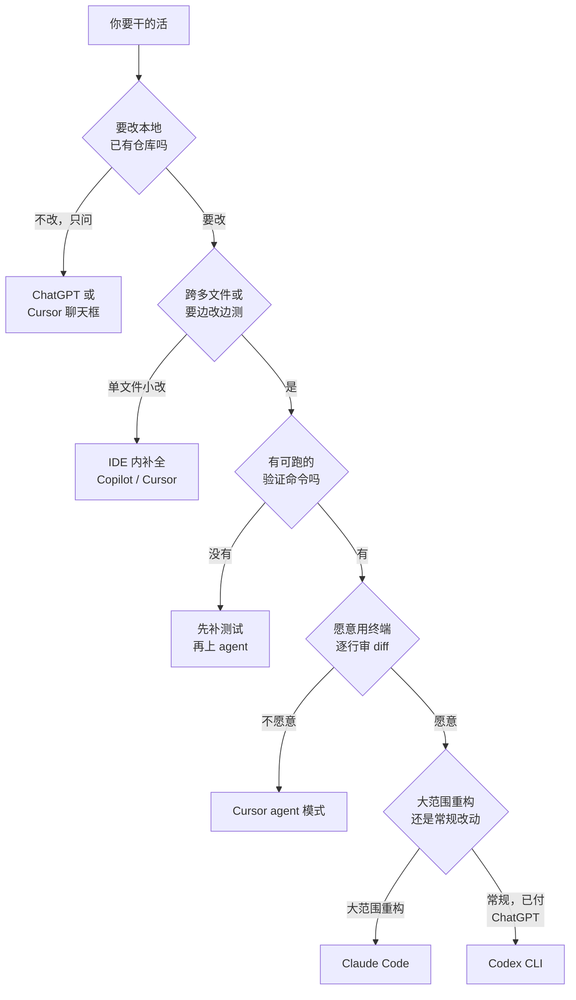

# 001. Claude Code、Codex、Cursor、Copilot 到底该用哪个？按你的活儿选，不按测评选

**一句话**：要在本地已有仓库里跨多文件改代码、且项目有能跑的验证命令（`npm test`、`pytest` 之类），装 Claude Code 并给它目标而不是步骤；只是想问「这段代码什么意思」「这个 API 怎么用」，ChatGPT 或 Cursor 的聊天框就够。

## 30 秒结论

| 你要干的活 | 立刻做 | 不想再犯 |
|---|---|---|
| 改本地已有仓库、跨多文件、有可跑的验证命令 | 装 Claude Code 或 Codex CLI，在项目根目录启动 | 给目标 + 参考实现 + 验证方式，让它自己闭环 |
| 大范围重构、跨模块改、要求代码风格贴合现有仓库 | Claude Code | 别指望一次派活就完事，分批 + 每批审 diff |
| 已经在付 ChatGPT 订阅，不想再开一份 | Codex CLI（含在 ChatGPT 订阅里） | 先查订阅档位的用量上限，Plus 档很容易撞顶 |
| 想把活丢出去异步跑，回头看结果 | Codex 的云端 agent（在 ChatGPT 里派任务） | 云端环境和你本地不一样，跑不了的命令要提前配 |
| 只想问 API 用法、让它解释一段代码 | 用 ChatGPT / Cursor 聊天框 | 别为一次问答装终端 agent |
| 团队流程深度绑在 GitHub 上 | Copilot（补全 / IDE agent / 云端 agent 三档） | 它的主入口在 IDE 和网页，不在你的终端 |
| 装完第一天就嫌「不如 ChatGPT 快」 | 检查你是不是在一问一答地用它 | 见 [002](./002-上手Claude-Code不顺怎么办.md) 的 5 个卡点 |



两个终端 agent 怎么选，一句话：**大范围重构和风格一致性要求高的活给 Claude Code，日常改动且你已经在付 ChatGPT 订阅就用 Codex。** 两个都装、按活切换是很多人的实际做法。

## 怎么做

一条 10 分钟能跑完的上手路径，每步都有能看见的成功判据。

### 第 1 步：装（约 2 分钟）

```bash
# macOS / Linux / WSL
curl -fsSL https://claude.ai/install.sh | bash

# Windows PowerShell
irm https://claude.ai/install.ps1 | iex

# Homebrew / WinGet 装的都不会自动更新，要手动 upgrade
brew install --cask claude-code
winget install Anthropic.ClaudeCode
```

**怎么确认生效**：跑 `claude --version`，预期输出形如 `2.1.220 (Claude Code)`（版本号会变，关键是括号里那句）。提示 `command not found` 就是安装目录没进 `PATH`，重开一个终端窗口再试。

### 第 2 步：选登录方式（约 2 分钟）

个人已有 Claude Pro / Max 订阅的，直接跑 `claude` 走浏览器授权，按订阅额度用，不再按 token 计费。其余四种情况见下表。

<details>
<summary>四种登录方式对照，以及两个必踩的坑</summary>

| 你的情况 | 选哪个 | 怎么登 |
|---------|-------|-------|
| 个人用，已有 Claude Pro / Max 订阅 | 订阅登录（官方推荐） | 直接跑 `claude`，浏览器完成授权 |
| 想按量付费、或要在 CI 里跑 | Claude Console（API 额度，预付费） | 同样跑 `claude` 选 Console 账号；首次登录自动建一个 "Claude Code" workspace 便于对账 |
| 公司走云厂商 | Bedrock / Google Cloud Agent Platform / Microsoft Foundry | 按官方 third-party-integrations 文档配环境变量 |
| 公司自建网关 | Claude apps gateway | `/login` 直接进 Cloud gateway 页，用公司 SSO 登 |

两个坑：

- 已经设过 `ANTHROPIC_API_KEY` 环境变量时，Claude Code **不弹登录**，而是问你要不要用这个 key。想改用订阅登录，先 `unset ANTHROPIC_API_KEY` 再跑。
- 公司网络下浏览器回调打不开，就把终端里打印的授权 URL 手动复制到能上网的浏览器，再把回调里的 code 粘回终端。

登错了随时在会话里打 `/login` 换账号。

</details>

**怎么确认生效**：跑 `claude doctor`。这是只读诊断、不开会话，输出里应能看到安装健康状况和 settings 文件校验结果，有配置错误会逐条列出来。

### 第 3 步：在项目根目录启动（约 1 分钟）

```bash
cd /path/to/your-project   # 必须是有代码的 git 仓库，别在空目录或 home 目录启动
claude
```

**怎么确认生效**：提示符上方显示的工作目录，要和你的项目根目录字符串完全一致。然后打一句 `/context`，它把当前上下文占用画成彩色格子图并列出各项来源 —— 你的 `CLAUDE.md`（有这个文件的话）应该出现在 Memory files 那一栏，这就是「它认识你项目了」的证据。目录不对就退出重新 `cd`，目录错了后面全白干。

### 第 4 步：给目标，不给步骤（约 3 分钟）

```text
> 给 src/api/handlers/payment.ts 加输入校验，金额必须是正整数，
  参考 src/api/handlers/user.ts 里 validateUserInput 的写法。
  改完跑 npm test 确认没挂。
```

而不是「打开文件、找到第 42 行、加个 if」。目标 + 参考实现 + 验证方式三件套齐了，agent 才能自己闭环。

**怎么确认做对了**：它的动作顺序应该是「先读那两个文件 → 改 payment.ts → 自己跑 `npm test` → 把 diff 摊给你看」。如果它一上来就贴整段代码让你复制，说明你给的还是步骤不是目标。

### 第 5 步：审 diff 再决定（约 2 分钟）

逐行看改动对比。方向不对就按 `Esc` 打断、重新说清楚 —— 打断是常规操作，不是失败信号[^3]。最终合并进 main 的代码责任在你，不在它。

顺带把预期调对：agent 会跑偏、会卡住、会产出要大改的代码。tptacek 描述的异步用法就是一批产出里有的推翻重来、有的像给初级开发者反馈那样改、只有一部分能直接合并[^2]。这是常态，不必怕让它试。

### 冷启动 `CLAUDE.md`

```text
> /init
```

`/init` 扫描项目，生成一份含技术栈、构建命令、目录结构和约定的 `CLAUDE.md` 草稿。别盲信自动生成的内容，逐行手工打磨（[#010 CLAUDE.md 怎么写才真的生效](../02-上下文工程/010-CLAUDE-md怎么写才生效.md)）。它是 Claude Code 在所有入口自动加载的持久指令文件。

<details>
<summary>进阶：`claude -p` 非交互模式（塞进 CI 或 shell 脚本）</summary>

```bash
claude -p "找出 auth.py 里的 bug 并修复" \
  --allowed-tools "Read" "Edit" "Bash(pytest *)"
```

`-p`（等价于 `--print`）让 Claude Code 跑完就退出。两个容易踩的点：

- **`--allowed-tools` 和 `--allowedTools` 两种拼法官方都接受**，老文章里的写法照样能跑。
- **逗号分隔和空格分隔官方也都接受**。推荐空格分隔：括号里能写 `Bash(pytest *)` 这类含空格的命令模式，做到「只允许跑 pytest」，这种模式塞进逗号串里容易读错。

不想逐个列工具就改用 `--permission-mode`，取值有 `default`、`acceptEdits`、`plan`、`auto`、`dontAsk`、`bypassPermissions`，以及 `manual`（`default` 的别名，需 v2.1.200 以上）。CI 里常用 `acceptEdits`；`bypassPermissions` 跳过所有确认，只在隔离容器里用。

**怎么确认生效**：先拿一条无副作用的命令试跑。

```bash
claude -p "用一句话说明 README.md 讲的是什么" --allowed-tools "Read"
# 预期：输出一句话摘要，且 echo $? 为 0。
# 若输出「我没有权限读取文件」之类，说明 --allowed-tools 没写对。
```

</details>

### 可选：想要 IDE 体验就装插件

VS Code 里 `Cmd+Shift+X` 搜 "Claude Code" 安装，JetBrains 同理。它和命令行共享同一套 `CLAUDE.md`、settings 和 MCP 配置，不用重配一遍[^1]。

Claude Code 内部那堆能力（plan / skill / subagent / hooks）各是什么、什么时候用哪个，见 [#004 能力地图](./004-Claude-Code能力地图.md)。

## 为什么

### 1. 本质是自主执行，不是对话补全

官方给它的定性是 agentic coding tool：读你的代码库、改文件、跑命令、接入你的开发工具[^1]。关键在 agentic —— 它自己规划步骤、自己调工具、看执行结果、再决定下一步，整个过程是闭环，不需要你把它吐出来的代码手动粘回去。

差别落到一句可验证的话上：ChatGPT 的代码跑在浏览器或云端沙箱，它读不到也改不了你本地的文件，执行的人是你；Claude Code 跑在你本地终端，直接访问文件系统、直接执行命令，执行的是它。Cloudflare 的 Kenton Varda 在 HN 上的说法是「在代码目录里打开终端、用英语说你想要什么」就够了 —— 「在代码目录里打开终端」这个动作，ChatGPT 永远做不到。

### 2. 形态不同，工作流就根本不同

Claude Code 不是单一形态，而是一组共享同一引擎的入口：命令行、VS Code、JetBrains、桌面 App、Web。每个入口连到同一个引擎，所以 `CLAUDE.md`、settings、MCP servers 全入口通用[^1]。相比之下 ChatGPT 是纯网页，Cursor 是 VS Code 的分叉版本，Copilot 是 IDE 插件。Codex 是这几个里唯一同样从命令行起家的，它多走了一个方向：把任务丢到云端沙箱异步跑，你派完就能去干别的。

「终端原生」不是小细节：它能在你的 shell 里跑任何命令、看任何文件、操作 Git，所以用起来像指挥一个坐在旁边的工程师，而不是查一个更聪明的搜索引擎。

<details>
<summary>五个工具的形态、执行模式、上下文来源对照表</summary>

| 工具 | 形态 | 执行模式 | 文件系统 | 上下文怎么来 | 项目级规则文件 |
|------|------|---------|---------|-----------|-----------|
| **ChatGPT** | Web / App 对话 | 一问一答，沙箱执行 | ❌ 不能直接改本地 | 你手动粘贴 / 上传文件 | ❌ 无（只能靠自定义指令，跨项目共用） |
| **Cursor** | IDE 内嵌（VS Code 分叉版） | agent 模式，可多文件编辑并跑终端命令 | ✅ IDE 内 | 后台索引整个仓库 + `@文件/@符号` 手动指定 | ✅ `.cursor/rules/*.mdc`（或根目录 `AGENTS.md`），仅 Cursor 内生效 |
| **Copilot** | IDE 插件 + GitHub 云端（补全起家） | 补全 / agent mode / 云端 coding agent 三档并存 | ✅ IDE 内；云端 agent 在 GitHub 托管环境里改 | 打开的文件 + 仓库索引 | ✅ `.github/copilot-instructions.md` |
| **Codex** | **命令行原生** + IDE 扩展 + ChatGPT 里的云端 agent | **自主执行 + 工具链**；本地跑，也可以把任务丢到云端沙箱异步跑 | ✅ **终端直接**；云端模式在隔离沙箱里改 | 按需自己去读文件、跑命令 | ✅ `AGENTS.md`（跨厂商通用格式） |
| **Claude Code** | **命令行原生** + 多入口 | **自主执行 + 工具链**（读写文件、跑命令、跑测试、操作 Git） | ✅ **终端直接** | 按需自己去读文件、grep、跑命令，不预先索引 | ✅ `CLAUDE.md`，命令行 / IDE / 桌面 / Web 各入口共用 |

Codex 和 Claude Code 是这张表里唯二的「命令行原生 agent」，形态最接近，也是目前最常被放在一起比的两个。差别不在能不能做，而在擅长什么和怎么计费 —— 见下面「别这么干」后面的横向对比。

</details>

### 3. 「新手差点放弃」的根子是心智错位

社区里反复出现同一个现象：用 ChatGPT 的方式来用 Claude Code，然后差点放弃。r/ClaudeAI 那篇《Claude Code Tips I Wish I Knew as a Beginner》开篇就是作者自陈早期差点放弃、觉得全是炒作。

HN 上 matthewsinclair 的经历更典型：先怀疑，Claude Code 出来后被吸引，真去读那些代码发现质量糟糕于是强烈反弹；转折点是他不再对它下命令，改成把它当协作者、当一套需要牢牢控制的「机甲」来用[^3]。

根子在这里 —— ChatGPT 养成的习惯是「我给指令，它给答案，我来执行」，开车的是人；Claude Code 期待的是「我给目标，它规划执行，我审查把方向」，开车的是它，人负责导航。两套心智一错位，就会得出「它不如 ChatGPT 好用」的结论，其实是把它当 ChatGPT 用了。

Phil Booth 从另一面佐证：他反对「把自动化调到最大、放任一群 agent 乱跑」，主张 LLM 开车、人导航的结对模式，并且频繁按 `Esc` 打断 agent。agentic 不等于放任不管。

## 别这么干

- ❌ **把 Claude Code 当 ChatGPT 用。** 一问一答、等它给完整代码、自己复制粘贴 —— 完全没用到自主能力，还会嫌它慢。根子是心智错位，见上面第 3 节。
- ❌ **放任 agent 跑不管。** 不审查就合并，攒出的是没人看得懂的技术债，只是攒得比人手写快。你是导航者，不是甩手掌柜。
- ❌ **在空目录或 home 目录启动。** 没有代码、`CLAUDE.md`、git 状态，等于让工程师在白纸上凭空写，必然跑偏。
- ❌ **给步骤而不是给目标。** 「打开文件、找到第几行、改成什么」是在浪费它的规划能力，也让你比自己写还累。
- ❌ **因为它写过一坨烂代码就全盘否定。** 「上瘾 → 失望 → 转变」是典型路径，失望期把心智从「下命令」调成「协作」通常就过去了；一批产出只有一部分能直接合并本来就是常态[^2]。

<details>
<summary>横向对比：同一件事五个工具分别怎么解</summary>

| 工具 | 解法 | 差异 |
|------|------|------|
| **ChatGPT** | Web 对话，沙箱跑代码，**不能改你本地文件** | 适合学习、查 API、要解释。不适合直接改项目代码，执行的人是你。 |
| **Cursor** | IDE 内嵌 AI，agent 模式可多文件编辑，看行内改动 | 适合喜欢「在编辑器里看改动」的人。自主性弱于两个终端 agent，更像一个聪明的结对伙伴。 |
| **Copilot** | 三档并存：行内补全 / IDE 内 agent mode / GitHub 云端 coding agent（可自主规划、执行、开 PR，2025-09 正式发布） | 适合已深度用 GitHub 生态的团队。云端 agent 自主度不低，但主入口仍是 IDE 插件与 GitHub 网页，不在你本地终端。 |
| **Codex** | **命令行原生的自主执行**，另有云端沙箱异步模式：在 ChatGPT 里派任务，它在隔离环境里跑完再给你结果 | 适合已经在付 ChatGPT 订阅、想省一份钱的人，以及想把活丢出去异步做的场景。终端任务和执行速度是它的强项。 |
| **Claude Code** | **命令行原生的自主执行**，终端直接跑命令、改文件、操作 Git，多入口共享配置 | 适合愿意用终端、想让 AI 在项目里直接动手的人。大范围重构和风格贴合现有仓库是它的强项。 |

### Codex 和 Claude Code 具体怎么选

两个都是终端原生 agent，形态最接近。可操作的分界线：

| 你的情况 | 选哪个 | 为什么 |
|---|---|---|
| 大范围重构、跨模块改、要求改出来的代码像原作者写的 | Claude Code | 社区盲评里它的代码整洁度评价更高，仓库级重构是它被反复提到的强项 |
| 日常改动、修 bug、写脚本，且已在付 ChatGPT 订阅 | Codex | 含在订阅里不用再开一份；终端任务和执行速度是它被反复提到的强项 |
| 想提交任务后去干别的，回来看结果 | Codex 云端 agent | Claude Code 主要是本地同步执行，没有等价的云端异步派单 |
| 要用 hooks 做强制闸门、要 Agent Teams 协作 | Claude Code | 生命周期 hook 事件和多 agent 协作是它的差异化能力 |
| 需要一次塞进超大量上下文 | Claude Code | 支持 1M 上下文窗口，见 [#012](../02-上下文工程/012-上下文窗口要爆了.md) |

**别把「谁更强」当选型依据。** 两家在各类 benchmark 上互有胜负、每次模型更新就翻一次，跟着榜单换工具的成本远高于收益。按上面的活儿类型选，或者两个都装、按活切换 —— 后者是不少人的实际做法。

一个共同趋势：所有主流工具都在从「补全或对话」走向「agent 自主执行」。Cursor 的 agent 模式、Copilot 的 coding agent、Codex 与 Claude Code 本身，本质都是把模型放进「调用工具、拿反馈验证」的闭环。差别只在两点 —— 入口形态（终端 / IDE / 网页）和自主程度。

</details>

## 延伸

**相关文章**

- [#002 为什么我一开始用 Claude Code 各种不顺、"差点放弃"？](./002-上手Claude-Code不顺怎么办.md) —— 装完之后最常卡的 5 个具体场景
- [#004 CLAUDE.md、skill、subagent、hooks、plan mode 该用哪个](./004-Claude-Code能力地图.md) —— 它内部这堆能力的地图
- [#010 CLAUDE.md 怎么写才真的生效？](../02-上下文工程/010-CLAUDE-md怎么写才生效.md) —— `/init` 生成的草稿怎么手工打磨
- [#011 Context Engineering 和 Prompt Engineering 到底什么区别？](../02-上下文工程/011-上下文工程与提示词工程.md) —— 为什么给 agent 目标比给指令更高效
- [#030 TDD 在 AI coding 里怎么做？](../04-执行工作流/030-AI写的测试不可信.md) —— 怎么让 agent 自己跑测试验证
- [#031 plan → execute → review 的正确循环怎么做？](../04-执行工作流/031-plan-execute-review循环.md) —— 导航者和开车者协作的标准节奏

**参考资料**

- [Claude Code Docs: Overview](https://code.claude.com/docs/en/overview) —— 「agentic coding tool」定性与多入口共享配置，本篇第 1、2 节的官方依据（官方，2026-06 访问）
- [Claude Code Docs: Quickstart](https://code.claude.com/docs/en/quickstart) —— 第 1、2 步的安装命令、四种登录方式、Console 自动建 workspace（官方，2026-08 复核）
- [Claude Code Docs: CLI reference](https://code.claude.com/docs/en/cli-reference) —— `--allowed-tools` / `--permission-mode` / `claude doctor` 的现行写法，支撑折叠块里的非交互模式（官方，2026-08 复核）
- [My AI skeptic friends are all nuts — Hacker News 44163063](https://news.ycombinator.com/item?id=44163063) —— kentonv「零学习成本」、matthewsinclair「上瘾→失望→转变」两条社区经历的出处（社区，2025-06）
- [My AI skeptic friends are all nuts — fly.io 原文](https://fly.io/blog/youre-all-nuts/) —— tptacek 的异步用法：一批产出只有一部分可直接合并（社区，2025-06）
- [Agentic coding and mental models — Phil Booth](https://www.philbooth.me/blog/agentic-coding-and-mental-models) —— 第 3 节末尾「LLM 开车、人导航、频繁按 Esc」的出处（社区，2026-06）
- [Claude Code Tips I Wish I Knew as a Beginner — r/ClaudeAI 1m1ihia](https://www.reddit.com/r/ClaudeAI/comments/1m1ihia/claude_code_tips_i_wish_i_knew_as_a_beginner/) —— 新手「差点放弃」自陈，第 3 节的社区佐证（社区，2025）
- [Claude Code vs Cursor vs Copilot: 2026 Developer Comparison — SitePoint](https://www.sitepoint.com/claude-code-vs-cursor-vs-copilot-the-2026-developer-comparison/) —— 折叠块里横向对比表的形态与自主性依据（社区，2026）
- [Agent Mode 101 — GitHub Blog](https://github.blog/ai-and-ml/github-copilot/agent-mode-101-all-about-github-copilots-powerful-mode/) —— Copilot 从补全走向 agent 的官方表述（官方，2025-05）
- [GitHub Copilot: 自定义响应](https://docs.github.com/en/copilot/concepts/response-customization) —— 对照表里 `.github/copilot-instructions.md` 一格（官方，2026-08 访问）
- [Cursor Docs: Rules](https://cursor.com/docs/context/rules) —— 对照表里 `.cursor/rules/*.mdc` 与 `AGENTS.md` 一格（官方，2026-08 访问）
- [OpenAI Codex 文档](https://developers.openai.com/codex/) —— Codex 的 CLI / IDE 扩展 / 云端 agent 三种形态、`AGENTS.md` 规则文件、订阅归属（官方，2026-08 访问）
- [Codex vs Claude Code — Northflank](https://northflank.com/blog/claude-code-vs-openai-codex) / [Dupple](https://dupple.com/learn/codex-vs-claude-code) —— 两个终端 agent 的定性差异（重构 vs 速度、代码整洁度盲评）来自这类社区对比，⚠️ 各家结论随模型版本变动，不作为硬结论使用（社区，2026）

[^1]: [Claude Code Docs: Overview](https://code.claude.com/docs/en/overview)（官方，2026-06 访问）：Claude Code 是 agentic coding tool，多个入口共享同一套 `CLAUDE.md`、settings 与 MCP 配置。
[^2]: [My AI skeptic friends are all nuts — fly.io](https://fly.io/blog/youre-all-nuts/)（社区，2025-06）：一批 agent 产出里只有一部分可直接合并，其余要么推翻重来、要么按初级开发者标准反馈重写。
[^3]: [Hacker News 44163063，matthewsinclair 评论](https://news.ycombinator.com/item?id=44163063)（社区，2025-06）：读到代码质量糟糕后强烈反弹，转折点是停止下命令、改把它当协作者。

---

<sub>难度 基础 · 决策题 + 配置题 · 主线 Claude Code，横向 Codex / ChatGPT / Cursor / Copilot</sub>

<sub>**时效**：安装命令、四种登录方式、`claude --version` / `claude doctor` / `/context` 输出、`--allowed-tools` 与 `--permission-mode` 取值已于 2026-08 依据官方 Quickstart 与 CLI reference 核实，`--version` 输出取自本地 v2.1.220。**已知不确定**：第 3 节依赖的两条社区经历（Reddit 帖、Phil Booth 站点）本轮未能实访逐字复核；Codex 与 Claude Code 的强项分工（重构 vs 速度、代码整洁度）来自社区对比文章，非官方表述，也没有可复现的实测。**易变**：CLI flag 与权限档取值随版本变化，报错时以 `claude --help` 为准；两家 benchmark 排名每次模型更新就翻一次，本篇刻意不写具体分数；五工具对比是定性描述，以各自官方文档为准。</sub>

> 本篇个人实践（L4）：`[待补：BOSS 的实战经验/踩坑]`
