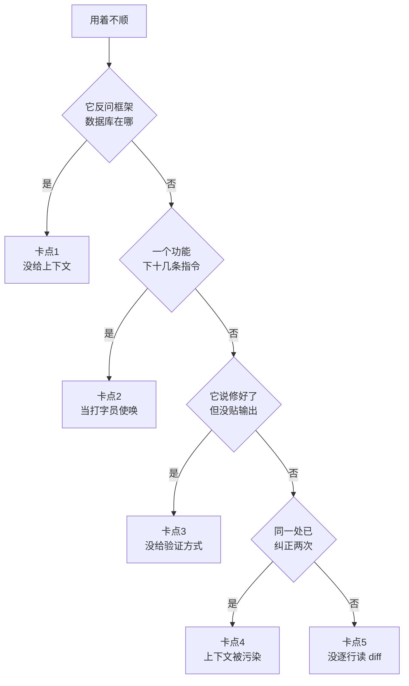

# 002. 为什么我一开始用 Claude Code 各种不顺、"差点放弃"？卡在哪、怎么顺

**一句话**：不顺几乎都不是工具烂，是你在用 ChatGPT 的姿势用它 —— 每次开口带上「文件指针 + 约束 + 参考实现 + 能跑出 pass/fail 的验证」，同一处纠正两次不过就 `/clear` 重开，diff 逐行读完再接受。

## 30 秒结论

| 你看到的现象 | 立刻做 | 不想再犯 |
|---|---|---|
| 它反问「用什么框架」「数据库在哪」 | 补上具体文件路径 + 参考实现 | 每条指令带「文件指针 + 约束 + 参考实现」 |
| 改一个功能你下了十几条指令 | 停手，改成给一句目标 | 让它先出计划，你审计划而不是审步骤 |
| 它回「修好了」，但没贴任何命令输出 | 要求它贴测试输出再说 | 开口就附一个能跑出 pass/fail 的检查 |
| 同一处已经纠正两次还没对 | `/clear`，把踩到的坑写进新 prompt | 别在被污染的会话里死磕 |
| 一口气改了 8 个文件，你想按 `2` 全接 | 逐个展开 diff 读完再按 `1` | 长任务另起 subagent 做对抗式 review |



## 怎么做

五个卡点，每个给「错法 → 正确姿势 → 怎么确认做对了」。

### 卡点 1：当聊天框用，不给项目上下文

**错法**：敲一句「帮我写个登录功能」就等它吐代码。**可观测信号**：它反问你「用什么框架」「数据库在哪」，或者直接编了一套你项目里根本没有的写法。

**正确姿势**：每次开口带「文件指针 + 约束 + 参考实现」三件套。

```bash
cd ~/my-api && claude

# 错法：不给上下文，指望它凭空答
> 帮我加个登录功能

# 正确法：目标 + 上下文 + 参考 + 验证
> 给 src/api/auth.ts 加 POST /login：校验邮箱密码，
  参考 src/api/users.ts 里 validateInput 的风格，密码用 bcrypt。
  改完跑 npm test src/api/auth.test.ts 必须全过。
```

**怎么确认做对了**：它的第一个动作是去读你点名的那两个文件，而不是直接贴代码。

顺带一条前提：必须在项目根目录启动。空目录或 home 目录启动，它读不到 `CLAUDE.md` 也读不到代码，等于让工程师在白纸上凭空写。

### 卡点 2：当打字员使唤，逐行指挥它怎么改

**错法**：「打开 `payment.ts`，找到第 42 行，在 `if (amount)` 前面加一个 `amount > 0` 的判断……」。**可观测信号**：改一个功能你下了十几条指令，比自己写还累。

**正确姿势**：给目标，别给步骤，让它先探索、再出计划、再写码。官方的说法是让 Claude 直接跳到写码，容易写出「解决了错误问题」的代码[^1]。

```text
> 给 payment.ts 加金额校验，参考 users.ts 的写法，跑 npm test 验证。
  先别动手，把你打算读哪些文件、改哪些、风险在哪告诉我。
```

**怎么确认做对了**：你的角色从「盯着打字员的监工」变成「审计划的人」—— 一个任务里你说话的次数应该是个位数。完整节奏见 [#031 plan → execute → review 循环](../04-执行工作流/031-plan-execute-review循环.md)。

### 卡点 3：不给验证方式就放它跑

**错法**：说「修这个 bug」，它改一堆然后回你「修好了」。**可观测信号**：它的结束语里没有任何命令输出 —— 没有测试结果、没有退出码、没有它跑了什么。

**正确姿势**：开口就给一个能跑出 pass/fail 的东西（测试套件、build 退出码、linter、截图对比脚本），这个循环就能自己闭合[^2]。

```text
# 错法：没验证，它说"修好了"你就信
> 修一下登录偶尔失败的 bug

# 正确法：先要一个能复现的失败测试，再修
> 用户反映登录在 session 超时后会失败。
  1. 先在 src/auth/login.test.ts 写一个复现这个 bug 的失败测试
  2. 跑 npm test 确认测试是红的（证明 bug 存在）
  3. 修 src/auth/login.ts，让测试变绿
  4. 跑完整测试套件确认没改坏别的
  每一步都把命令输出贴给我看，别只说"成功了"。
```

**怎么确认做对了**：它的回复里能看到真实的测试输出文本（用例名、通过数、耗时），而不是一句「已通过」。落地成 TDD 节奏见 [#030 TDD 在 AI coding 里怎么做](../04-执行工作流/030-AI写的测试不可信.md)。

### 卡点 4：一条道走到黑，越纠正越乱

**错法**：它改错了你说「不对，再改」，还是错，「再改」……**可观测信号**：同一个点你已经纠正两次仍未通过，或者它改了 A 又把 B 改回去、来回拉锯。

**正确姿势**：官方红线是同一个问题在一个会话里纠正两次以上就 `/clear` 重开，用一个更具体、写进了新发现的 prompt 重来[^3]。

```text
> /clear

# 重新组织一个更准的 prompt，把刚才踩的坑写进去：
> 注意：修改 payment.ts 时，
  金额校验必须同时满足 (1) 是正整数 (2) 不超过余额，
  两个条件缺一不可，之前那版改丢了第二条。
```

**怎么确认做对了**：新会话第一轮就命中，不再出现「改了 A 丢了 B」。窗口为什么会被这样污染，见 [#012 上下文窗口要爆了怎么办](../02-上下文工程/012-上下文窗口要爆了.md)。

### 卡点 5：不读 diff，想按 `2` 全盘接受

**错法**：它一口气改了 8 个文件，你没逐个展开就一路按 `1`，甚至动了按 `2`（本次会话所有改动全盘接受）的念头。

**正确姿势**：每一行 diff 都当 code review 来读。跑偏就 `Esc` 打断、`/rewind` 回退、或直接说 "Undo that"。长任务另起一个干净上下文的 subagent 做对抗式 review —— 它不带「写这段代码时的偏见」[^1]。

```text
> 用 subagent review 刚才对 src/api/auth.ts 的改动。
  只看 diff 和这个任务的目标（POST /login + bcrypt + 测试通过），
  找出：边界情况漏处理、和 users.ts 风格不一致的地方、
  有没有引入安全问题。报告问题，不要报告风格偏好。
```

**怎么确认做对了**：合并前你能逐个文件说出「这个文件改了什么、为什么」。说不出来的文件，就是你没读的文件。

## 为什么

### 官方自己承认这条学习曲线

Anthropic 的 best practices 开篇就说：Claude Code 是一个 agentic coding environment（智能体式编码环境），和「你问它答、然后等着」的聊天机器人不同，它能读文件、跑命令、改代码，在你旁观或走开时自主推进；但这份自主性带着一条学习曲线[^1]。

白话说：你用 ChatGPT 练出来的肌肉记忆是「我提问 → 它回答 → 我执行」，Claude Code 期待的是「我给目标 → 它执行 → 我审查」。两套模式隔着一段适应期，套错了必然别扭。

### 最隐蔽的坑：trust-then-verify gap

官方给「它交出一个看起来合理、却没处理边界情况的实现，你一信任就翻车」这件事起了名字，叫 trust-then-verify gap[^2]。机制是：Claude 会在「工作看起来做完了」的时候停下；如果没有一个能跑的检查，「看起来做完了」就是它唯一的信号，于是你成了那个验证环，每个错误都得等你自己发现。

这正是卡点 3 要用 pass/fail 检查换掉「它说做完了」的原因 —— 你要的是终止条件，不是它的自我评价。

### 纠正会污染上下文，而不是修正它

官方把反复纠正命名为 Correcting over and over：你纠正一次，失败的做法就留在上下文里；纠正越多，模型手里的「错误示范」越多，越被带偏[^3]。相关的还有 kitchen sink session（大杂烩会话）—— 一个会话塞五件不相干的事，上下文全是噪音。

所以「两次不过就 `/clear`」不是认输，是止损：一个干净会话加一个更精准的 prompt，几乎总能跑赢一个堆满失败尝试的旧会话。

### 你会从代码作者变成代码观众

安全工程师 Michael Taggart 用 Claude Code 做完一个项目后写道：按 `2`（接受本次会话所有改动）实在太诱人，而一旦你停止审视模型的输出，出事的概率就趋近于 1[^4]。他把自己那段状态形容成「辛普森一家里那只点头喝水的鸟」—— 读一段改动、按 `1`、再读一段、再按 `1`。

更深的问题是：用 agent 写代码，你会从代码的作者变成代码的观众，只能事后倒推着去理解这段代码。理解成本更高，也更容易漏掉隐患。这条认知层的账怎么算，见 [#003](./003-AI代码审不动改不懂.md)。

## 别这么干

- ❌ **把它当 ChatGPT 用。** 一问一答、不给项目上下文、等它吐完整代码自己粘贴 —— 完全没用上 agentic 能力，还嫌它「不如 ChatGPT 快」。
- ❌ **当打字员使唤。** 逐行逐字下指令，浪费它的规划能力，把自己累成喝水鸟。
- ❌ **不给验证方式就放它跑。** 它说「修好了」你就信，正好踩进 trust-then-verify gap。
- ❌ **同一处纠正超过两次还在死磕。** 上下文已经被失败尝试塞满，越改越偏。官方红线是两次不过就 `/clear`。
- ❌ **全盘接受 diff、想按 `2`。** 一旦停止审视，出事概率趋近 1。空目录启动同理 —— 没有上下文可审，也没有上下文可给。

<details>
<summary>横向对比：同一个卡点，换 ChatGPT 或 Cursor 会怎样</summary>

001 已做过四工具的完整横向表，这里只回答一个具体问题。

| 卡点 | Claude Code（终端 agent） | ChatGPT（Web 对话） | Cursor（IDE 内嵌） |
|------|------|------|------|
| 当聊天框用 | 你啥都不给，它瞎猜改歪 —— **卡点最痛** | 本来就是聊天框，**没有「卡点」，因为期待一致** | 介于两者之间，IDE 有索引兜底 |
| 不给验证方式 | 它「看起来 done」就停，**坑最隐蔽**（trust-then-verify） | 你复制它代码自己跑，验证环一直是你 | IDE 内有报错提示，部分兜底 |
| 不读 diff | 终端 diff 要主动看，**诱惑最大**（想按 `2`） | 没有这步，它不直接改你文件 | inline diff 就在编辑器里，**审查成本最低** |

一句话：**Claude Code 的自主性最高，所以「用法错」的代价也最痛。** 同样的错法，ChatGPT 顶多让你白问一次，Cursor 有 IDE 兜着，Claude Code 会让你真金白银地跑偏。这正是很多新手「差点放弃」的来源。

</details>

## 延伸

**相关文章**

- [#001 Claude Code、Codex、Cursor、Copilot 到底该用哪个？](./001-AI编程工具怎么选.md) —— 本篇的前提：它是什么、我该不该用
- [#003 为什么 AI 写的代码我审不动、改完自己看不懂？](./003-AI代码审不动改不懂.md) —— 本篇的认知层续集：操作对了但心智没转，差在哪
- [#010 CLAUDE.md 怎么写才真的生效？](../02-上下文工程/010-CLAUDE-md怎么写才生效.md) —— 卡点 1「给上下文」的持久化方式
- [#012 上下文窗口要爆了怎么办？](../02-上下文工程/012-上下文窗口要爆了.md) —— 卡点 4「两次纠正不过就 `/clear`」的底层机制
- [#030 TDD 在 AI coding 里怎么做？](../04-执行工作流/030-AI写的测试不可信.md) —— 卡点 3「给验证方式」的标准落地姿势
- [#031 plan → execute → review 的正确循环怎么做？](../04-执行工作流/031-plan-execute-review循环.md) —— 卡点 2「给目标别给步骤」的完整节奏

**参考资料**

- [Claude Code Best practices — Anthropic](https://www.anthropic.com/engineering/claude-code-best-practices) —— 本篇 5 个卡点的主要官方依据：agentic coding environment 与学习曲线、trust-then-verify gap、kitchen sink session、两次纠正就 `/clear`、course-correct early and often、用干净上下文的 subagent 做对抗式 review（官方，2026-06 访问）
- [Claude Code Docs: Overview](https://code.claude.com/docs/en/overview) —— 「agentic coding tool」定义与多入口架构，支撑「为什么」第一节（官方，2026-06 访问）
- [I used AI. It worked. I hated it. — Michael Taggart](https://taggart-tech.com/reckoning/) —— 卡点 5 与「作者变观众」的出处：按 `2` 太诱人、停止审视则出事概率趋近 1、喝水鸟状态（社区，2025）
- [Claude Code Tips I Wish I Knew as a Beginner — r/ClaudeAI 1m1ihia](https://www.reddit.com/r/ClaudeAI/comments/1m1ihia/claude_code_tips_i_wish_i_knew_as_a_beginner/) —— 「差点放弃、觉得全是炒作」这条现象普遍存在的社区佐证（社区，2025）
- [5 Mistakes I Made Using Claude Code That Cost Me Real Money — Medium](https://medium.com/@jaumegallegocusco/5-mistakes-i-made-using-claude-code-that-cost-me-real-money-55b8a8ee09bb) —— 「赔了钱不是因为工具差，是因为用错了」的佐证（社区，2025）

[^1]: [Claude Code Best practices — Anthropic](https://www.anthropic.com/engineering/claude-code-best-practices)（官方，2026-06 访问）：agentic coding environment 的定义与学习曲线；Explore first, then plan, then code；用干净上下文的 subagent 只看 diff 与验收标准挑错。
[^2]: 同上，trust-then-verify gap：没有可跑的检查时，「看起来做完了」是 Claude 唯一的停止信号；给它一个能产出 pass 或 fail 的东西，循环就能自己闭合。
[^3]: 同上，Correcting over and over：同一问题在一个会话里纠正两次以上就 `/clear`，用写进了新发现的更具体 prompt 重开。
[^4]: [I used AI. It worked. I hated it. — Michael Taggart](https://taggart-tech.com/reckoning/)（社区，2025）：按 `2` 太诱人；一旦停止审视模型输出，出事概率趋近 1；用 agent 写代码会让你从代码作者变成代码观众。

---

<sub>难度 基础 · 排错题 + 场景题 · 主线 Claude Code，横向 ChatGPT / Cursor</sub>

<sub>**时效**：2026-07-18 复核。主干论据（agentic 定义、trust-then-verify gap、两次纠正就 `/clear`）是 Anthropic 官方 best-practices 的转述，不是社区传闻。**已知不确定**：Reddit 帖与 Medium 帖本轮只核到摘要级，未逐字复核全文；Taggart 一文已复核全文。**易变**：`/clear`、`/rewind`、`Esc` 打断等交互键随版本变化，以 `claude --help` 与官方 interactive-mode 文档为准；5 个卡点与处方不绑定版本。</sub>

> 本篇个人实践（L4）：`[待补：BOSS 的实战经验/踩坑]`
