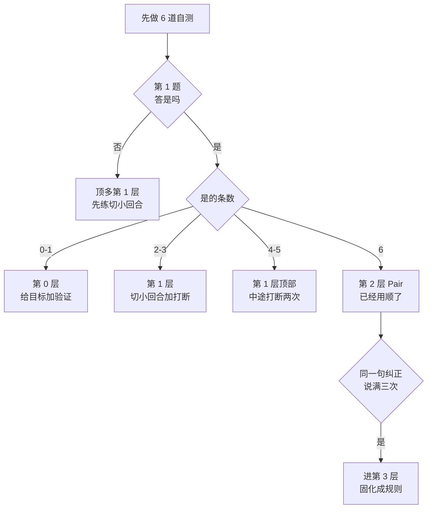

# 003. 为什么 AI 写的代码我审不动、改完自己看不懂？

**一句话**：审不动的原因是单次改动太大、你的理解没跟着长，解法不是把 prompt 写更长，而是把回合切小 —— 一个任务里至少 `Esc` 打断两次让它解释设计取舍，收尾时能不看代码讲清「为什么这么写、改它会牵动谁」才算过。

## 30 秒结论

| 你看到的现象 | 立刻做 | 不想再犯 |
|---|---|---|
| 一次接受了 8 个文件 300 行，三天后打开看不懂 | 把任务拆到一次只改一件事 | 单次 diff 控制在你能逐段读完的量 |
| 能 review「写得对不对」，说不出「为什么这么设计」 | 下个任务中途 `Esc` 打断，让它先解释取舍 | 一个任务里至少打断两次 |
| 收尾时你判断的是「测试绿了」 | 改成判断「它的实现和我脑中模型对不对得上」 | 合并前口头讲一遍设计取舍与影响面 |
| 需求越写越长，还是审不动 | 停止加字，改切小回合 | 审不动是改动太大，不是描述太短 |
| 同一句纠正你已经说满三次 | 写进 `CLAUDE.md`，一条就够 | 没说满三次不动手，过早固化没人遵守 |



**第 1 题答「否」就到不了第 2 层**：说不出「为什么这么设计」，其余答对再多也只是操作熟练。

## 怎么做

### 第 1 步：2 分钟自测，先定位自己在第几层

按你**最近三次**真实使用回答，只答「是 / 否」。回忆上一次实际发生了什么，不要回忆理想状态。

| # | 自测题 | 是 / 否 |
|---|---|---|
| 1 | 上一个 agent 改完的模块，你能不看代码说出它为什么这么设计吗？ | |
| 2 | 最近一次 diff，你是逐段读完才接受的吗？（先按接受再说 = 否） | |
| 3 | 你能说出上次那个改动会牵动哪些调用方、哪些下游？ | |
| 4 | 上一个任务里，你在 agent 干到一半时打断过它、纠正过方向吗？ | |
| 5 | 开工前你让它给过计划、并且从计划里挑出过至少一个漏项吗？ | |
| 6 | 交付时你判断的是「它的实现和我脑中的模型对得上」吗？（只判断测试绿了 = 否） | |

按「是」的个数定位：**0–1 条** 第 0 层 Prompt 心智；**2–3 条** 第 1 层 目标心智；**4–5 条** 第 1 层顶部到第 2 层之间；**6 条** 第 2 层 Pair 心智，这就是「用顺了」。

再加一条**否决项**：不管答对几条，第 1 题若为「否」，你就还没到第 2 层 —— 说不出「为什么这么设计」，说明理解没长起来，其余都只是操作熟练度。

（这套 0–3 层分档是本库为了让读者能自检做的原创归纳，不是业界通用术语，别当行话去跟人对齐。）

### 第 2 步：按所在层，只改一个动作

| 你在哪层 | 只做这一件事 | 怎么确认做对了 |
|---|---|---|
| 第 0 层 | 下个任务开工前，把「目标 + 约束 + 验证方式」写进第一条消息，别写实现步骤 | 会话开始后它先去读文件、给改动范围，而不是立刻贴代码。上来就贴整段实现 = 你给的还是步骤 |
| 第 1 层 | 把回合切小：它改完第一个文件时就 `Esc` 打断，让它解释这一段的设计取舍，你判断完再放行，一次任务至少打断两次 | 收尾时不看代码，口头讲一遍「这块为什么这么写、改它会牵动谁」。讲得出来 = 理解长了 |
| 第 2 层 | 保持第 3 步那套四步句式，别退回大块甩任务 | 连续三个任务都能在收尾时不看代码说清设计取舍和影响面 |
| 第 3 层 | 翻最近一周的会话，找出你重复最多的那句纠正，写进 `CLAUDE.md`，一条就够 | 开新会话跑同类任务，看它是否不用提醒就遵守。没遵守说明规则写得太笼统 |

**什么时候该进第 3 层，只有一个信号**：同一句纠正你说满三次 —— 第 3 次说完就动手。比如连续三次都要说「用项目里已有的 `redis-lock.ts`，别自己造」，这句话就该进 `CLAUDE.md`。没说满三次不用动，过早固化只会写出一堆没人遵守的规矩。

### 第 3 步：可复制的四步搭档句式

这是第 2 层的日常做法，换任何场景都能套：**先对齐 → 要计划 → 挑漏项 → 中途打断 → 收尾对模型**。

<details>
<summary>四步句式完整模板</summary>

```text
# 第 1 步 先对齐（不许它写代码）
先别写代码，我跟你对齐一下：
这次要解决的问题是 <问题现象，不是方案>。
约束是 <一致性 / 性能 / 兼容 等硬条件>。
参考项目里已有的 <文件或模块>。
你先告诉我：你打算读哪些文件、改哪些、风险在哪？

# 第 2 步 要计划（拿到计划后，你负责挑漏）
计划里少了 <你发现的漏项>。加上，并且用已有的 <模块>，别自己造。

# 第 3 步 改动中打断（读到不对就 Esc，然后问为什么）
等等，你这里用的是 <它的做法>，
项目里 <另一个模块> 用的是 <既有做法>，
对齐一下，并告诉我为什么。

# 第 4 步 收尾（判断的是模型对不对得上，不是绿不绿）
跑测试。然后用三句话讲清楚：
这个改动的核心取舍是什么、哪些调用方会受影响、什么情况下它会失效。
```

</details>

第 3 步用的 `Esc` 打断当前回应或工具调用，Claude 会保留已完成的部分。如果改动已经落盘、想整体退回某个时点，在输入框为空时按两次 `Esc` 打开回退菜单。

<details>
<summary>一个真实场景走一遍：给 UserService 加缓存</summary>

第 0 层的做法：想的是「我要它给 `UserService` 加缓存」，等它吐代码，不展开 diff 就接受。理解没动，甚至更模糊。

第 2 层套四步句式：

```bash
cd ~/my-api && claude
```

```text
> 先别写代码，我跟你对齐一下：
  要解决的是 getUserById 读放大，用 Redis。
  约束：必须支持写后失效（TTL 5 分钟），还要防缓存穿透。
  参考项目里已有的 Redis 用法。
  你先告诉我：你打算读哪些文件、改哪些、风险在哪？

# 它回了一版计划 → 你发现它漏了热点 key 重建的并发保护
> 计划里少了缓存击穿的防护。加一个：
  用已有的 redis-lock.ts 做单飞，别自己造。

# 它开始改 → 你逐段读 diff，读到失效策略不对就 Esc 打断
> 等等，你这个失效策略是写后立即删 key，
  项目里 ProfileService 用的是"先更新 DB 再删缓存"，
  对齐一下，告诉我为什么。

# 它解释 → 你判断对不对，对就放行
> 跑测试。然后三句话讲清楚：核心取舍、受影响的调用方、什么情况下会失效。
```

**怎么确认这次做对了**：任务结束后合上编辑器，口头讲一遍「这个缓存为什么用先更新 DB 再删、并发下最坏会脏多久、下游哪些接口受影响」。讲得出来，说明理解跟着长了；讲不出来，说明你只是完成了一次验收。

</details>

<details>
<summary>第 3 层的四种固化手段：分别放哪、固化什么</summary>

| 固化对象 | 放哪 | 用来固化什么 |
|---|---|---|
| CLAUDE.md | 仓库根目录 | 项目常识与硬规矩（技术栈、测试怎么跑、哪些目录不许动） |
| skill | `.claude/skills/<名字>/SKILL.md` | 你反复走的同一套流程（发版检查、写迁移脚本） |
| subagent | `.claude/agents/<名字>.md` | 需要独立上下文的子任务（大范围调研、写测试），不污染主会话 |
| hook | `.claude/settings.json` | 必须每次强制执行、不能靠它自觉的事（提交前跑测试） |

四者的完整选型（什么时候用哪个、怎么配）归 [#004 能力地图](./004-Claude-Code能力地图.md)，本篇只给「什么时候该开始想这件事」的信号。

日常的 plan → execute → review 节奏属于第 2 层搭档心智的落地纪律，不属于第 3 层，见 [#031](../04-执行工作流/031-plan-execute-review循环.md)。

</details>

## 为什么

### 症状是「审不动」，根因是理解没在长

很多人以为问题在「prompt 写得不好」，于是不断把需求写得更长更细。真正的分界线不在 prompt 长度，在**你的理解有没有跟着改动一起长**。

对照两种审 diff：验收式是检查「它有没有满足我提的要求」，checklist 过了就接受，你的理解没动；搭档式是检查「它的实现和我脑中那套模型对不对得上」，对不上就追问为什么，你的理解在动。前者做得再熟练，三天后你还是说不出这块为什么这么设计 —— 因为你从没构建过那个模型。

Phil Booth 把机制说清楚了：写代码时你产出两样东西，代码本身，和脑中「它怎么跑、怎么挂、怎么改」的理解；代码进 Git 不会忘，理解一不碰就退化，放得越久重建成本越高[^1]。

### agent 越自主，你的理解掉得越快

同一篇里还有一句更直接的因果：提高 coding agent 的自主性，效果等同于加大 code review 的体积 —— 它让你的活更难干、拖慢你心智模型的构建、并降低你对「自己知道在发生什么」的信心[^1]。

一次接受 300 行，就是给自己派了一个 300 行的 code review。这也是「vibe coding 放羊式」真正危险的地方：危险的不是代码质量差（那是表象），而是等它坏了你不会修，只能再去求 agent。

反过来就是解法：要的是小 code review 而不是大的，也就是更短的反馈回路 —— 而比 code review 更短的回路，就是结对编程。频繁打断这条纪律在这里才有真正的理由 —— 不是为了控制它，是为了保护你自己的理解。

### 官方数据能支持什么、不能支持什么

<details>
<summary>Anthropic 40 万会话研究的三组数字与解读边界</summary>

Anthropic 对约 40 万个 Claude Code 会话、约 23.5 万人（2025-10 至 2026-04）做了隐私保护分析[^2]。

| 指标 | 新手 | 中级至专家 |
|---|---|---|
| 可验证成功（verified success） | 15% | 28–33% |
| 部分成功（partial success） | 77% | 91–92% |
| 卡壳会话中的可验证成功 | 4% | 15%（专家） |

另外，产码会话里前十大职业的成功率都落在软件工程师的 ±7 个百分点内（软件类约 34%，其他职业约 29%），官方由此说 coding agents 并没有取代领域专长。

**这份数据能支持的**：专长在 agentic 时代仍有持续回报，玩家没有被拉平；尤其在会话卡壳时，专家把局面救回来的比例约是新手的 4 倍 —— 这一格最贴近「你自己得懂」的直觉。

**这份数据不能支持的**：它没有测量「心智模型是否被外包」，也没证明「外包理解会导致失败」。它是横截面的相关性，不是因果实验。上面那条「理解外包 → 审不动 → 修不了」的链条，依据是 Phil Booth 的一手工程经验和你自己的可复现体感，不是这份研究。两者分开看。

</details>

Tweag 那边给出的是同一件事的另一面：agentic coding 不是甩手交责任，而是放大好的工程判断力；实验里最成功的工程师，是把 AI 当协作者而不是当魔法师的那些人 —— 注意这来自双团队的单次对照实验，样本极小，只作旁证[^3]。

## 别这么干

- ❌ **用更长的 prompt 解决「审不动」。** 审不动的原因是单次改动太大，不是描述太短。正确动作是切小回合、中途打断，不是继续加字。
- ❌ **以为操作对了就等于转过来了**（停在第 1 层）。姿势全对，理解还在外包。表现是简单任务漂亮、复杂任务一崩就懵，自测题第 1、3、6 条专抓这种情况。
- ❌ **把 agentic 等同于放权甩手**（vibe coding 放羊式）。真正的 agentic 是搭档加放大判断力。什么时候该停 vibe 转 spec，见 [#023](../03-需求与规划/023-Vibe-coding什么时候停下规划.md)。
- ❌ **以为转换一次性完成。** 理解会退化，一段时间只甩大块任务就会悄悄退回第 1 层甚至第 0 层。每月重跑一次上面 6 道自测题。
- ❌ **过早进第 3 层。** 同一句纠正没说满三次就急着写 `CLAUDE.md` / skill，结果是一堆没人遵守也没人维护的规矩。

<details>
<summary>横向对比：这场心智转换在不同工具上的陡峭程度</summary>

001 已有四工具完整横向表，这里只回答一个心智层问题。

- **ChatGPT**（网页对话）：不要求你转。它就是 prompt 工具，停在第 0 层就是正确用法，期待和现实一致。
- **Copilot**（编辑器内补全）：起步门槛最低。但它向 agent 演进后（多文件改动、自主执行），停在「按 Tab 接受补全」越来越不够用。
- **Cursor**（IDE 内嵌）：半要求。在编辑器里搭档，到第 1 层够用，inline diff 让审查成本最低。
- **Claude Code**（终端 agentic）：最要求。它在你的项目里直接动手，第 1 层会卡（能 review 但理解没长），撑到第 2 层才顺。

这解释了 002 那条「怀疑 → 上瘾 → 失望 → 转变」曲线为什么在 Claude Code 用户身上最明显：门槛最高，「差点放弃」的人最多。

</details>

## 延伸

**相关文章**

- [#001 Claude Code、Codex、Cursor、Copilot 到底该用哪个？](./001-AI编程工具怎么选.md) —— agentic 本质定义、四工具形态。本篇是它的认知层深水区
- [#002 为什么我一开始用 Claude Code 各种不顺、"差点放弃"？](./002-上手Claude-Code不顺怎么办.md) —— 操作层 5 卡点。002 答「操作卡在哪」，003 答「操作对了但心智没转」
- [#004 CLAUDE.md、skill、subagent、hooks、plan mode 该用哪个](./004-Claude-Code能力地图.md) —— 第 3 层四种固化手段的完整选型
- [#010 CLAUDE.md 怎么写才真的生效？](../02-上下文工程/010-CLAUDE-md怎么写才生效.md) —— 第 3 层「把重复纠正固化下来」的具体写法
- [#011 Context Engineering 和 Prompt Engineering 到底什么区别？](../02-上下文工程/011-上下文工程与提示词工程.md) —— 第 0 层到第 1 层的底层机制
- [#023 Vibe coding 为什么会翻车？什么时候必须停下来规划？](../03-需求与规划/023-Vibe-coding什么时候停下规划.md) —— 停在第 0 层的极端形态
- [#031 plan → execute → review 的正确循环怎么做？](../04-执行工作流/031-plan-execute-review循环.md) —— 第 2 层的落地节奏

**参考资料**

- [Agentic coding and mental models — Phil Booth](https://philbooth.me/blog/agentic-coding-and-mental-models) —— 本篇「为什么」前两节的主要依据：心智模型的构建与退化、自主性越高构建越慢、更短的反馈回路就是结对编程（社区权威，2026-06-11）
- [Agentic coding and persistent returns to expertise — Anthropic](https://www.anthropic.com/research/claude-code-expertise) —— 折叠块里三组数字的出处：约 40 万会话、约 23.5 万人的隐私保护分析（官方研究，2026-06-16）
- [Interactive mode — Claude Code 官方文档](https://code.claude.com/docs/en/interactive-mode) —— 四步句式里 `Esc` 打断并保留已完成工作、输入框为空时 `Esc Esc` 打开回退菜单（官方，2026-08 复核）
- [Introduction to Agentic Coding — Modus Create / Tweag](https://tweag.io/blog/2025-10-23-agentic-coding-intro/) —— 「为什么」末尾「不是甩手交责任而是放大工程判断力」「当协作者不是魔法师」的出处。注：文中 "our experiments" 指 Modus Create 的双团队对照实验（n=2 团队），属公司单次实验（社区，2025-10-23）

[^1]: [Agentic coding and mental models — Phil Booth](https://philbooth.me/blog/agentic-coding-and-mental-models)（社区权威，2026-06-11）：写代码同时产出代码与心智模型，心智模型不碰就快速退化；提高 agent 自主性等同于加大 code review 体积。
[^2]: [Agentic coding and persistent returns to expertise — Anthropic](https://www.anthropic.com/research/claude-code-expertise)（官方研究，2026-06-16）：可验证成功 15% vs 28–33%、部分成功 77% vs 91–92%、卡壳会话 4% vs 15%、各职业与软件工程师差距 ≤7 个百分点。34% / 29% 是「产码会话」口径下按职业统计的数字，与按熟练度分档的 28–33% 不是同一口径。
[^3]: [Introduction to Agentic Coding — Modus Create / Tweag](https://www.tweag.io/blog/2025-10-23-agentic-coding-intro/)（社区，2025-10-23）：DIY 团队 vs AI 团队的单次对照实验，n=2 团队，公司单次实验数据，只作旁证。

---

<sub>难度 中级 · 场景题 + 决策题 · 主线 Claude Code，横向 ChatGPT / Cursor / Copilot</sub>

<sub>**时效**：2026-08-15 复核。Anthropic 40 万会话研究的各项数字本轮实访官方页逐项核对；`Esc` 打断保留已完成工作、空输入框 `Esc Esc` 打开回退菜单按官方 interactive-mode 文档当前版核对；Phil Booth 与 Tweag 两篇的论断与日期均实访原文核对。**已知不确定**：0–3 层框架是本库的原创归纳，不是业界通用术语，也没有实证研究支撑；「理解外包 → 审不动」的因果链依据一手工程经验，官方数据只能佐证「专长仍有回报」。**易变**：交互键与官方研究结论随版本和后续研究变化。</sub>

> 本篇个人实践（L4）：`[待补：BOSS 的"用顺了"时刻 / 心智迁移体验]`
