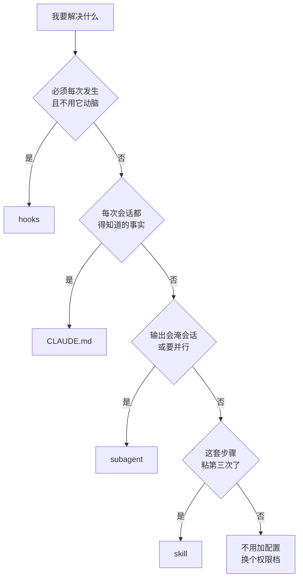

# 004. CLAUDE.md、skill、subagent、hooks、plan mode——这几个到底该用哪个？

**一句话**：别按文档目录学这六个功能，按「我要解决什么」分四类挑 —— 管上下文用 CLAUDE.md / auto memory，管节奏与闸门用权限档 / hooks，管复用用 skill，管隔离与并行用 subagent；先问问题，答案自然指向某一类。

## 30 秒结论

| 你要解决的问题 | 用哪个（属哪类） | 最小起步件 |
|---|---|---|
| 有些事每次会话都得让它知道 | **CLAUDE.md**（管上下文） | 项目根 `./CLAUDE.md`；不想手写就跑 `/init` |
| 不想手维护，让它自己攒踩坑和你的偏好 | **auto memory**（管上下文） | 默认开启，`/memory` 浏览与开关 |
| 想在某个环节按住它、控制放多少权 | **permission modes**（管节奏，plan 是其中一档） | `claude --permission-mode plan`，或 `Shift+Tab` 连按两次 |
| 必须每次都发生、且不需要它动脑 | **hooks**（管节奏） | `.claude/settings.json` 的 `hooks` 键，见下方 JSON |
| 同一套步骤你已经粘贴第三次 | **skill**（管复用） | `.claude/skills/<名字>/SKILL.md` |
| 这段活会用你不会再看的输出淹了主会话 | **subagent**（管隔离与并行） | prompt 里直接点名，或建 `.claude/agents/<名字>.md` |



## 怎么做

主干按上面的决策树走：第一个答「是」的就是答案。四问都答「否」，那你要的不是新增配置，而是换个权限档 —— 动手前想清楚方向用 `plan`，正在迭代改代码用 `acceptEdits`，长任务想少被打断用 `auto`。

下面是三个最容易卡住的岔口，和三段可直接复制的起步件。

### 岔口一：既要复用、又会产生大量输出，选 skill 还是 subagent

先按「复用」做成 skill。skill 是内容、subagent 是执行环境，两者不互斥：等你发现这个 skill 每次跑都把主会话塞满，再让它在隔离上下文里跑（skill 可以用 `context: fork`，subagent 也可以用 `skills:` 字段预加载 skill）。官方在 sub-agents 页给的反向信号是：如果你要的是在主会话上下文里跑的可复用提示或流程，而不是隔离的 subagent 上下文，就改用 skill。

### 岔口二：一条规则该写 CLAUDE.md 还是做成 skill

看它是一条**事实**还是一套**步骤**。「API handler 放在 `src/api/handlers/`」是事实，写 CLAUDE.md；「发版要依次做这七件事」是流程，做成 skill。官方的分界线是：当 CLAUDE.md 里某节从一条事实长成了一套流程时，就该做成 skill[^2]。判断不了就看长度 —— CLAUDE.md 官方建议 200 行以内，超了就是该往外拆的信号。

### 岔口三：CLAUDE.md 里写了规则它还是不听，加强语气有用吗

没用，换机制。官方在 memory 页写得很直：CLAUDE.md 是在系统提示之后以用户消息形式送进去的，不保证严格遵守[^3]。正确动作是先跑 `/context` 确认文件真的加载了（看 **Memory files** 那一栏），再判断这条规则是不是本来就该做成 hook —— 写在 CLAUDE.md 或 skill 里的「never edit `.env`」是一个请求，不是保证；`PreToolUse` hook 才是强制[^1]。

### 起步件 1：hooks 最小可跑配置

贴进项目的 `.claude/settings.json`（没有就新建）。作用是：Claude 每次要跑 `rm ` 开头的 Bash 命令时先跑你的脚本，脚本退出码非 0 就拦下。

```json
{
  "hooks": {
    "PreToolUse": [
      {
        "matcher": "Bash",
        "hooks": [
          {
            "type": "command",
            "if": "Bash(rm *)",
            "command": "${CLAUDE_PROJECT_DIR}/.claude/hooks/block-rm.sh",
            "timeout": 30,
            "statusMessage": "检查危险删除命令…"
          }
        ]
      }
    ]
  }
}
```

字段含义：`matcher` 是工具名；`if` 是权限规则语法的过滤条件（如 `Bash(git *)`、`Edit(*.ts)`），不写就对该工具的所有调用都跑；`type` 除 `command` 外还支持 `http` / `mcp_tool` / `prompt` / `agent`；`timeout` 单位是秒，command 类默认 600。

**怎么确认生效**：会话里输入 `/hooks`，你这条应该出现在 `PreToolUse` 下、来源标 Project Settings。`/hooks` 里根本看不到它，通常是 JSON 语法错了或放错了文件，不是 hook 没触发。注意这个菜单是只读的，改还是得改 JSON。

### 起步件 2：skill 最小可跑骨架

```bash
mkdir -p .claude/skills/pr-check
cat > .claude/skills/pr-check/SKILL.md <<'EOF'
---
name: pr-check
description: 提 PR 前的自检清单：跑测试、跑 lint、检查是否漏了 changelog
---

依次执行并逐条汇报结果：

1. 跑 `npm test`，全绿才继续。
2. 跑 `npm run lint`，有 error 先修。
3. 检查本次改动是否需要更新 CHANGELOG.md，需要就补上。
4. 输出一段可直接粘进 PR 描述的改动摘要。
EOF
```

`name` 和 `description` 必填，可选的还有 `allowed-tools`（这一轮内免权限提示的工具）、`disallowed-tools`。目录名决定命令名，所以这个装完就是 `/pr-check`。

**怎么确认生效**：会话里敲 `/pr-`，自动补全里出现 `pr-check` 并显示你写的 description。Claude Code 监听 `~/.claude/skills/` 和项目 `.claude/skills/` 的文件变化，本会话内即时生效，不用重启 —— 唯一例外是这个顶层 skills 目录在会话启动时还不存在，那种情况要重启一次。

### 起步件 3：subagent 最小可跑骨架

临时用不必建文件，直接在 prompt 里点名：`Use the code-reviewer subagent to review the authentication module`。要固化就建 `.claude/agents/code-reviewer.md`（个人级放 `~/.claude/agents/`）：

```markdown
---
name: code-reviewer
description: Reviews code for quality and best practices
tools: Read, Glob, Grep
model: sonnet
---

你是代码评审员。被调用时，分析改动并就质量、安全性、最佳实践给出具体、可执行的反馈。
```

`tools` 限定它能用哪些工具（这里没给写工具，所以它改不了代码）；`model` 可以指到更便宜的模型控成本；正文成为它的系统提示。

**怎么确认生效**：主会话里说 `Use the code-reviewer subagent to review the authentication module`，主会话里应该只多出一段摘要而不是几百行源码。注意 v2.1.198 起 `/agents` 不再是创建向导，敲它只会提示你去问 Claude 或直接编辑 `.claude/agents/`；文件位置和字段没变。找不到新建的 subagent，多半是 `~/.claude/agents/` 在会话启动前还不存在，重启一次即可。

<details>
<summary>完整能力表：六项的官方定位、何时用、深用指针</summary>

| 能力 | 分类 | 一句话定位 | 何时用 | 深用指针 |
|------|------|------|--------|----------|
| **CLAUDE.md** | 管上下文 | 你写的持久指令，每次会话开始时自动加载全文 | 项目事实、技术栈、构建命令、团队约定要每次生效时写进去。目标 200 行以内 | [010](../02-上下文工程/010-CLAUDE-md怎么写才生效.md) |
| **auto memory** | 管上下文 | Claude 自己写的跨会话笔记，默认开启，存在 `~/.claude/projects/<project>/memory/`，每次会话只加载 `MEMORY.md` 的前 200 行或 25KB。与 CLAUDE.md 的差别就一句：**CLAUDE.md 是你写规则，auto memory 是它记发现** | 你不想手动维护、但希望它自己攒下来的东西：构建命令、调试踩坑、你纠正过的偏好。单项目关掉就在 `.claude/settings.json` 写 `{"autoMemoryEnabled": false}` | [013](../02-上下文工程/013-哪些决策要写进memory.md) |
| **permission modes**（含 plan） | 管节奏 | 控制 Claude 多频繁停下来问你的权限档，官方表里共 6 档：`default`（每次首用某个工具时停下来问你，能写文件只是要确认，CLI 里标签叫 Manual）、`acceptEdits`、`plan`（真正只读的那一档）、`auto`、`dontAsk`、`bypassPermissions`。**plan 就是其中一档**，不是叠在别的档上的修饰。**2026-08-14 起新会话的默认档变了**，见表下说明 | 敏感活用 `default`；迭代改代码用 `acceptEdits`；动手前先想清楚用 `plan`；长任务减少打断用 `auto`；CI 脚本用 `dontAsk`；`bypassPermissions` 只在容器或虚拟机里用。会话里按 `Shift+Tab` 循环 `default → acceptEdits → plan`，所以进 plan 是连按两次 | [031](../04-执行工作流/031-plan-execute-review循环.md) |
| **hooks** | 管节奏 | 写在 settings.json 的 `hooks` 键下的确定性闸门，在 `PreToolUse`、`PostToolUse`、`Stop`、`SessionStart` 等生命周期事件上跑东西，由 Claude Code 本身执行，不靠 Claude 自觉 | 必须每次都发生、且不需要 Claude 动脑的事：编辑后跑 lint、拦掉危险命令、会话结束发通知 | 本库暂无独立篇；配置写法见 [010](../02-上下文工程/010-CLAUDE-md怎么写才生效.md)，跑测试类 hook 见 [033](../04-执行工作流/033-Skill与superpowers怎么用.md) |
| **skill** | 管复用 | 按需加载的流程和参考资料，会话开始只加载描述、用到才加载正文 | 同一段流程或检查清单反复粘贴（3 次以上），或 CLAUDE.md 某节变成了流程。项目级 `.claude/skills/<名字>/SKILL.md`，个人级 `~/.claude/skills/<名字>/SKILL.md` | [033](../04-执行工作流/033-Skill与superpowers怎么用.md) |
| **subagent** | 管并行与隔离 | 独立上下文窗口的 worker，只把摘要回给主会话 | 冗长输出要隔离（跑测试、读大量日志）、有两个以上独立子任务要并行、或需要一个工具受限的专用 worker | [032](../04-执行工作流/032-SubAgent并行开几个.md) |

**默认档在 2026-08-14 变了**：在此之前，新会话一律从 `default`（Manual，每次首用某个工具都停下来问）起步。从这天起，Pro / Max / Team 计划的新会话默认档改成 `auto` —— 工具调用由后台分类器判断放行，只在它认为动作与你的请求不符时才拦。三种情况不受影响：你自己在设置里写过 `defaultMode` 的（会收到一次性切换提示，不接受就保持原样）、组织用 managed settings 托管了默认档的、以及走 Bedrock / Vertex / Foundry / 网关这些通道的（那边 `auto` 只是出现在 `Shift+Tab` 循环里，起始档仍是 Manual）[^4]。**影响是双向的**：想少被打断的人不用再配了；而习惯「默认档会拦住我」的人，那层弹窗确认没了，敏感目录下要主动 `Shift+Tab` 切回 Manual，或用 `permissions.disableAutoMode` 关掉。分类器默认拦什么、放什么，见 [083](../09-工具可靠性/083-permissions和hooks拦不住.md)。

**表里为什么没有 TDD**：TDD 是你的工作方法，不是 Claude Code 的一项能力，放进这张表会让人以为 CC 里有个叫 TDD 的功能。它的正确位置是上面两项的配套做法 —— 先写一个会失败的测试当终止条件，再用 `PostToolUse` 或 `Stop` hook 把「跑测试」变成每次必发生的事。做法见 [030](../04-执行工作流/030-AI写的测试不可信.md)。

**表里也没有 MCP 和 agent team**：MCP 是「接外部数据和工具」，官方定位是 MCP 把 Claude 接到数据，skill 教 Claude 拿这数据干什么 —— 该装哪些 MCP、怎么量它占了多少上下文，见 [006](./006-MCP装哪些不装哪些.md)。agent team 是多个独立会话互相通信的形态，官方标注为实验性、默认关闭，和 subagent 的差别是队友之间能直接对话，细节归 032。

</details>

<details>
<summary>一个任务串起四类能力：给 Node 项目加「导出本月账单 PDF」</summary>

**第 1 步：先把项目事实固化进 CLAUDE.md。**

```bash
cat >> CLAUDE.md <<'EOF'

## 账单模块约定
- 金额一律用「分」为单位的整数，禁止浮点
- 时间一律 UTC，展示层才转时区
- 导出文件名格式：`bill-YYYY-MM.pdf`
EOF
```

验证：会话里跑 `/context`，**Memory files** 一栏里能看到 `CLAUDE.md`。看不到就是路径不对 —— 项目级只认 `./CLAUDE.md` 和 `./.claude/CLAUDE.md`。

**第 2 步：动手前进 plan mode 摸清楚。**

```bash
claude --permission-mode plan
```

已经在会话里就连按两次 `Shift+Tab`，状态栏显示 `⏸ plan mode on`。然后问：

```text
不要改任何文件。先摸清三件事再给方案：
1. 现有账单数据的读取入口在哪个模块、什么签名
2. 项目里有没有已经在用的 PDF 库，装在哪、怎么调
3. 现有导出类接口的鉴权是怎么做的，走哪个中间件
最后给一份分步实施计划，标出每步要改哪些文件。
```

验证：这一步做对的标志是它只读不写。中途出现文件编辑，说明你不在 plan 里（或者这个会话是带 bypass permissions 起的 —— 那种会话里官方明确说 plan 的拦截不生效）。

**第 3 步：先写一个会失败的测试当终止条件。**

```text
先只写测试，不要写实现：新增 test/bill-export.test.js，断言导出的 PDF 包含
本月全部交易、且金额字段是分为单位的整数。写完直接跑 npm test，
我要看到它因为实现不存在而失败。
```

验证：`npm test` 输出里这条新用例是 fail 而不是 error 找不到文件。

**第 4 步：探索量大就派 subagent。**

```text
Use a subagent to survey how the three existing export endpoints handle
auth, pagination and file streaming. Return only a comparison table and
a recommended pattern — do not paste the source.
```

验证：主会话里只多出一段摘要。想量化就在派之前和之后各跑一次 `/context`，对比 token 占用。

**第 5 步：把「每次必须跑」的事交给 hook。** 把前面那段 `PreToolUse` 换成 `PostToolUse` 就是「编辑后自动 lint」。写完跑 `/hooks` 确认它出现在列表里、来源标 Project Settings。

**第 6 步：流程粘第三次了就抽成 skill。** 如果这套 plan → 写红灯测试 → 实现 → review 的动作你在第三个任务里又原样敲了一遍，按前面的骨架建 `.claude/skills/new-module/SKILL.md`，之后一句 `/new-module` 就够。验证：敲 `/new-` 能补全。

注意这个导览里发生了什么：你不是在学六个功能，而是在用一个任务把四类能力按需串起来。每一步的起点都是一个问题（要每次生效、要先想清楚、要闭合验证、要隔离输出、要强制执行、要复用），答案自然指向某一类。

</details>

## 为什么

### 文档按机制分页，回答不了「我这个活该选哪个」

permission-modes、sub-agents、skills、memory、hooks 各占一页，每页都在讲「这个机制怎么配」。即使官方后来补了一页汇总（Extend Claude Code），那页也是从「扩展点」视角切的，把 code intelligence、artifacts、plugins 一并列进来，一次要消化十来个概念。对只想知道「我现在这个活该用哪个」的人来说还是太宽。

### 按触发场景选，是官方自己认的路子

官方 Extend Claude Code 页里有一节 "Build your setup over time"，用的正是「触发条件 → 加什么」的写法：Claude 同一个约定或命令错了第二次，就写进 CLAUDE.md；一个支线任务用你不会再看的输出淹了会话，就走 subagent[^1]。本篇在此之上再收一层，归成四类：

- **管上下文**：CLAUDE.md 和 auto memory，解决「有些事每次都要让它知道」。
- **管节奏与闸门**：权限档（含 plan）和 hooks，解决「我要在哪个环节按住它、放多少权」。
- **管复用**：skill，解决「这套流程我反复粘贴」。
- **管并行与隔离**：subagent，解决「这段活会淹没主会话」或「我想并行干」。

### 三组取舍关系，官方都有正面说法

CLAUDE.md 管事实、skill 管流程[^2]；CLAUDE.md 是请求、hooks 是强制[^1]；subagent 在隔离窗口跑、skill 在主会话加载。记住这三组，六个功能就不会互相串味。

## 别这么干

- ❌ **把这堆能力当散装功能各学各的。** 不先问「我要解决什么」就会用错，最典型的是把该写 CLAUDE.md 的事实塞进 skill —— 事实塞进按需加载层，结果就是它经常想不起来加载。
- ❌ **该用 hook 的写进 CLAUDE.md。** CLAUDE.md 里的「never edit `.env`」是一个请求，不是保证。必须每次生效的用 `PreToolUse` hook 拦。规则不生效时先跑 `/context` 看文件到底加载了没，别靠加粗、加「务必」、加全大写。
- ❌ **以为 plan mode 只是叠在 default 上的只读开关。** 它就是官方 6 档权限模式里的一档，配置值 `plan`，可以 `claude --permission-mode plan` 起，也可以在 `.claude/settings.json` 里写 `{"permissions": {"defaultMode": "plan"}}` 设成项目默认。一个坑：会话若是带 bypass permissions 起的，plan 的编辑拦截不生效。
- ❌ **该留主会话的丢给 subagent。** 需要频繁来回、共享大量上下文的任务留主会话。subagent 适合自包含、输出冗长的活 —— 它不继承你的对话历史，来回一多，光交代背景就比自己干还贵。
- ❌ **CLAUDE.md 越写越长当成「上下文更充分」。** 官方建议单文件 200 行以内，超了会稀释遵守度。长了就往 `.claude/rules/`（可按 `paths` 作用域加载）或 skill 里拆。

<details>
<summary>横向对比：这四个维度别的工具有没有对应物</summary>

| 维度 | Claude Code | Cursor | Copilot |
|------|-------------|--------|---------|
| 常驻项目指令 | `CLAUDE.md` | `.cursor/rules`（规则文件，可带路径作用域） | `.github/copilot-instructions.md` |
| 按需加载的流程 | `skill`（`.claude/skills/<名>/SKILL.md`，`/名字` 触发） | 混在 rules 里，没有独立的按需加载层 | 无独立机制 |
| 隔离上下文的 worker | `subagent`（`.claude/agents/*.md`） | Cloud Agents（环境级隔离，粒度更粗） | 无对应物 |
| 确定性闸门 | `hooks`（settings.json 生命周期事件） | 无对应物，靠 rules 文字约束 | 无对应物 |
| 权限档 | 6 档，`Shift+Tab` 切 | 有 auto-run 开关，档位更少 | 无 |

Claude Code 的差异在于这四类是各自独立的机制，而不是揉进一个 rules 文件 —— 代价是要学四套东西，收益是「建议」和「强制」能分开表达。第三方产品形态变动快，以上为 2026-08 观察。

</details>

## 延伸

**相关文章**

- [#001 Claude Code、Codex、Cursor、Copilot 到底该用哪个？](./001-AI编程工具怎么选.md) —— agentic 本质、四工具形态，本篇的前提
- [#003 为什么 AI 写的代码我审不动、改完自己看不懂？](./003-AI代码审不动改不懂.md) —— 第 3 层 Orchestration 心智指向本篇，本篇是它的工具展开
- [#006 装了一堆 MCP 之后卡顿、上下文被吃掉，到底该留哪些？](./006-MCP装哪些不装哪些.md) —— 「表里也没有 MCP」那条注解的展开
- [#010 CLAUDE.md 怎么写才真的生效？](../02-上下文工程/010-CLAUDE-md怎么写才生效.md) —— CLAUDE.md 与 hooks 的攻略
- [#013 哪些决策必须写进 memory 才扛得住 compact](../02-上下文工程/013-哪些决策要写进memory.md) —— auto memory 的攻略
- [#030 TDD 在 AI coding 里怎么做？](../04-执行工作流/030-AI写的测试不可信.md) —— 「表里为什么没有 TDD」那条注解的展开
- [#031 plan → execute → review 的正确循环怎么做？](../04-执行工作流/031-plan-execute-review循环.md) —— plan mode 的攻略
- [#032 并行 agent 到底该开几个？](../04-执行工作流/032-SubAgent并行开几个.md) —— subagent 的攻略
- [#033 Skill / superpowers 怎么用、怎么写？](../04-执行工作流/033-Skill与superpowers怎么用.md) —— skill 的攻略

**参考资料**

- [CC Docs: Extend Claude Code（features-overview）](https://code.claude.com/docs/en/features-overview) —— 本篇四类分类框架的主要官方依据："Build your setup over time" 触发表、Skill vs Subagent / CLAUDE.md vs Skill / Hook vs Skill 三组对照、各能力上下文开销表（官方，2026-08 访问）
- [CC Docs: Choose a permission mode](https://code.claude.com/docs/en/permission-modes) —— 6 档权限模式表、`plan` 是其中一档、`Shift+Tab` 循环顺序、`--permission-mode` 与 `defaultMode`、bypass 会话下 plan 拦截失效（官方，2026-08 访问）
- [CC Docs: Hooks reference](https://code.claude.com/docs/en/hooks) —— 起步件 1 那段 JSON 的结构与字段（`matcher` / `type` / `if` / `timeout` / `statusMessage`）、事件名全表、`/hooks` 只读浏览器（官方，2026-08 访问）
- [CC Docs: Extend Claude with skills](https://code.claude.com/docs/en/skills) —— 起步件 2 的存放路径、frontmatter 字段、目录名即命令名、文件变更即时生效，以及岔口二的分界线（官方，2026-08 访问）
- [CC Docs: Create custom subagents](https://code.claude.com/docs/en/sub-agents) —— 起步件 3 的路径与 frontmatter、「支线任务会淹掉主会话」的定位、岔口一的反向信号、v2.1.198 起 `/agents` 不再是向导（官方，2026-08 访问）
- [CC Docs: How Claude remembers your project](https://code.claude.com/docs/en/memory) —— CLAUDE.md vs auto memory 对照、200 行建议、`/context` 的 Memory files 排查法、岔口三的「不保证严格遵守」（官方，2026-08 访问）
- [CC Docs: Best practices for Claude Code](https://code.claude.com/docs/en/best-practices) —— 「表里为什么没有 TDD」注解引的「给 Claude 一个能判定通过或失败的东西，循环就会自己收口」（官方，2026-08 访问）
- [Anthropic Blog: Steering Claude Code](https://claude.com/blog/steering-claude-code-skills-hooks-rules-subagents-and-more) —— 官方博客版的选型走查，features-overview 页在「Compare similar features」一节点名推荐（官方博客，2026）
- [Anthropic: Skills explained](https://claude.com/blog/skills-explained) —— 「表里也没有 MCP」那条注解的依据：MCP 把 Claude 接到数据，skill 教 Claude 拿这数据干什么（官方，2026-03）

[^1]: [CC Docs: Extend Claude Code](https://code.claude.com/docs/en/features-overview)（官方，2026-08 访问）："Build your setup over time" 用「触发条件 → 加什么」组织；并明确 CLAUDE.md 或 skill 里的 "never edit `.env`" 是一个请求而非保证，`PreToolUse` hook 才是强制。
[^2]: [CC Docs: Extend Claude with skills](https://code.claude.com/docs/en/skills)（官方，2026-08 访问）：当你反复往聊天里粘同一套指令、清单或多步流程，或者 CLAUDE.md 里某节从一条事实长成了一套流程时，就该做一个 skill。
[^3]: [CC Docs: How Claude remembers your project](https://code.claude.com/docs/en/memory)（官方，2026-08 访问）：CLAUDE.md 在系统提示之后以用户消息形式送入，不保证严格遵守。
[^4]: [CC Docs: Permission modes](https://code.claude.com/docs/en/permission-modes)（官方，2026-08-13 访问）原文：「Starting August 14, 2026, auto mode becomes the default permission mode for new sessions on Pro, Max, and Team plans. You can switch modes at any time. A default you set yourself stays in place unless you accept the one-time switch prompt, and a default your organization manages is unchanged.」同页另注明，Bedrock / Vertex / Foundry / 网关通道上 `auto` 只是默认出现在 `Shift+Tab` 循环里，会话起始档仍是 `defaultMode`（默认 Manual）。

---

<sub>难度 中级 · 配置题 + 决策题 · 主线 Claude Code，横向 Cursor / Copilot</sub>

<sub>**时效**：2026-08-03 复核，权限档默认值一项 2026-08-13 复核。权限档、hooks JSON 结构、skill / subagent 文件路径与 frontmatter 字段均对照官方文档原页逐条核对（permission-modes / hooks / skills / sub-agents / memory / features-overview 六页）。**已知不确定**：四类分类框架是本库在官方触发表之上的再归纳，不是官方术语。**易变**：具体路径、字段名、快捷键、`/agents` 之类命令的行为随版本变化，涉及版本行为处已标最低版本号，以官方文档为准。</sub>

> 本篇个人实践（L4）：`[待补：BOSS 的能力地图使用顺序 / 哪个能力最先上手 / 哪个最后才用]`
