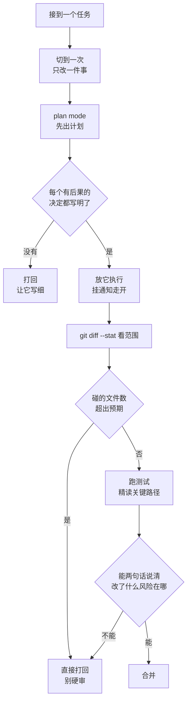

# 005. AI 写得比我读得快，我一天到晚在审代码——怎么把节奏和心流拿回来？

**一句话**：累是因为你的角色被换成了全职审稿人，解法是压产出体积（单次 diff 200~300 行以内）、先审计划再审代码、挂 hook 响铃后再回来，并守住一条原则 —— **让 AI 并发，不要让你的注意力并发**：后台可以多开，前台需要你深度读代码的任务同时只留 1 个。

## 30 秒结论

| 你看到的现象 | 立刻做 | 不想再犯 |
|---|---|---|
| `git diff --stat` 一次几百行、碰了十几个文件 | 打回重切，一次只改一件事 | 单次 diff 控制在 5~10 分钟能读完的量 |
| 一份实现读到一半发现方向就错了 | 用 plan mode，先批计划再让它写 | 计划里每个有后果的决定都要写明 |
| 你在盯着它一行行输出，什么也没干 | 配 `Stop` / `Notification` hook 响铃 | 跑起来就切走，响了再回来 |
| 从头读到尾，读到麻木开始降标准 | 改成按验收条件核对 + 关键路径精读 | 合并前能用两句话说清改了什么、风险在哪 |
| 同时开了三个 agent，队列越排越长 | 停手清队列 | 需要深度读代码的任务同时只留 1 个，纯监工类可再 +1 |



## 怎么做

### 第 1 步：把单次任务切到「一口气能读完」

不要给「实现整个登录模块」这种任务。拆成：加数据模型 → 加接口 → 加校验 → 加测试，一次一个，每次单独看 diff。

```bash
git diff --stat            # 本次改了多少、碰了几个文件
git diff -- src/auth.ts    # 只看关心的那个文件
```

**怎么确认做对了**：`git diff --stat` 的总变更行数，是你能在 5~10 分钟内读完并说清「每处为什么改」的量 —— 多数人这个值在 200~300 行。超了就是切得不够细。如果一次任务碰了 10 个以上你没预期的文件，说明任务描述太模糊，回去重切，别硬审。

### 第 2 步：先审计划，再审代码

plan mode 下 Claude Code 只读文件、只出计划，不落盘：

```bash
claude --permission-mode plan
```

会话中途按 `Shift+Tab` 也能切，循环顺序是 `default → acceptEdits → plan`，开启后状态栏显示 `⏸ plan mode on`。

**怎么确认做对了**：计划里每个「有后果的决定」（改哪个表、动哪个公共函数、加什么依赖）都被明确写出来了，你能逐条点头或否掉。如果计划只写「重构认证模块」这种粒度，让它重写细一点再批。

这一步的收益是算术级的：一段错的计划改一分钟，一份错的实现改一下午。

### 第 3 步：跑起来就别盯着，让它响铃叫你

给 `Stop`（回答完毕）和 `Notification`（需要你输入）事件挂通知。**注意**：hook 进程没有控制终端，老教程里 `printf '\a' > /dev/tty` 的写法已经失效；现在要用 hook 输出的 `terminalSequence` 字段，由 Claude Code 自己写终端。响铃没动静时先确认你的 Claude Code 是较新版本[^3]。

`.claude/settings.json`：

```json
{
  "hooks": {
    "Stop": [
      { "hooks": [ { "type": "command", "command": "${CLAUDE_PROJECT_DIR}/.claude/hooks/notify.sh", "async": true } ] }
    ],
    "Notification": [
      { "matcher": "idle_prompt|agent_needs_input",
        "hooks": [ { "type": "command", "command": "${CLAUDE_PROJECT_DIR}/.claude/hooks/notify.sh", "async": true } ] }
    ]
  }
}
```

`.claude/hooks/notify.sh`（记得 `chmod +x`）：

```bash
#!/bin/bash
printf '{"terminalSequence":"\\u0007"}'
```

裸 BEL（响铃）在允许列表里，最省事。想要桌面通知横幅，把输出换成 OSC 9 或 OSC 777 序列（iTerm2 / Windows Terminal / WezTerm 认 OSC 9，Ghostty / Warp 认 OSC 777）。

**怎么确认做对了**：随便让它跑个任务，切到别的窗口，任务结束时终端响一声或弹出通知。没响就按顺序查三件事 —— 脚本有没有执行权限（`ls -l .claude/hooks/notify.sh` 看有没有 `x`）、`claude --version` 是否 ≥ 2.1.141、终端本身是否关了响铃。

### 第 4 步：用验收条件代替逐行阅读

在让它写之前，先写下「怎么算做对」：哪几个测试要过、哪个接口签名不许变、哪些边界要处理。写完之后按这张单子核对，而不是从头读到尾。

可复制的顺序：

1. `git diff --stat` 看范围有没有超出预期，超了直接打回
2. 跑测试与类型检查（`npm test`、`pytest`、`tsc --noEmit` 等，按项目来）
3. 只精读关键路径：涉及钱、权限、数据写入、对外契约的部分
4. 其余抽查：随机挑两三处，看它的实现理由是否站得住

**怎么确认做对了**：你能用两句话说清「这次改了什么、风险在哪」。说不清就是没审明白，别合。

### 第 5 步：让 AI 并发，别让你的注意力并发

先把两件事分开：**AI 的产出带宽**可以随便加，**你的审查带宽只有一个你**，而且是串行的 —— 一次只能深度理解一份代码。多开 agent 加的是前者，堵的是后者。所以上限不该拍在「开几个 agent」上，而该拍在「同时有几件事在占用你的深度注意力」上。

由此推出的分层上限，按「这条产出需不需要你逐行读懂」分档：

| 这个任务需要你做什么 | 同时最多几个 | 为什么是这个数 |
|---|---:|---|
| **深度代码审读**（要逐行看懂逻辑、判断风险再决定合不合） | 1 | 这是串行资源，第 2 个必然排队；边排边催只会让你两个都读不透 |
| **纯执行监工**（跑测试、批量改名、格式化、跑构建，你只看成功/失败和 diff 范围） | +1 | 不占深度理解，只占一次扫视，可以叠在深度任务上 |
| **后台调研 / 探索**（结论回传成摘要，你不逐条审） | 3~5 | 这类产出根本不进你的深度审查口，它们的上限是 token 和限流，不是你 |
| **架构、数据模型、安全边界这类不可逆决定** | 1，且不并任何别的 | 想错了改不回来，值得单线程 |

所以那个常被写成「等审队列 ≤ 2」的数字，实际是「1 个深度审读 + 1 个监工」推出来的结果，不是随手定的[^4]。你要是那天只在跑测试和批量改名，开 3 个也不累；只要出现第 2 份需要逐行读懂的 diff，就已经超了。

真要并行，用官方 worktree 隔离，避免几个会话互改同一份工作区：

```bash
claude --worktree feature-auth      # 另开一个终端换个名字，就是一路独立会话
```

**怎么确认做对了**：随时能说清「现在哪一份 diff 是我正在读懂的那一份」。如果你要想一下、或者答案是「两份都读了一半」，就是超了 —— 停手，把其中一个挂起或直接丢弃。另一个可观测信号：你开始跳过 diff 直接看测试结果就合，说明队列已经压过你的带宽了。

并行到底该开几个 agent（生成端的上限），见 [#032](../04-执行工作流/032-SubAgent并行开几个.md)。

### 第 6 步：给自己留一段不用 AI 的时间

明确划出一段时间自己写 —— 通常是那些你本来就想清楚了、写起来最快的部分。把 AI 用在你不想亲手做的部分（样板代码、测试脚手架、批量改名、查资料）。HN 那个帖子里声称重新找回心流的人几乎都是这么做的：要么把心流转移到「规划」这一层（自己设计、AI 执行），要么保留一块自己动手的地盘。**没有人是靠「审得更快」找回心流的。**

<details>
<summary>一次完整的低疲劳循环长什么样</summary>

```bash
# 1. 隔离工作区，跑起来不影响主分支
claude --worktree fix-login-rate-limit

# 2. 进去先规划不落盘
claude --permission-mode plan
```

```text
读一下 src/auth/ 和 tests/auth/，我要给登录接口加限流。
先给计划：改哪些文件、限流放在哪一层、用什么存计数、失败返回什么。
不要写代码。范围限制在 src/auth/ 下，不许动公共中间件。
```

批计划时重点看三处：范围有没有溢出、有没有偷偷引新依赖、失败路径写没写。批完再让它执行。执行完：

```bash
git diff --stat
npm test
git diff -- src/auth/rate-limit.ts    # 只精读核心那一个文件
```

几个降低疲劳的小配置：

- `CLAUDE.md` 里写死约束，省得每次重复提醒：「改动前先说计划」「不许改测试来让测试通过」「一次只做一件事」
- 用 `/rewind` 或 `git checkout` 直接丢弃跑歪的结果，不要花力气去审一个已经方向错了的 diff —— **审一份注定要扔的代码是纯亏**
- 大范围探索交给 subagent：「用一个 subagent 调研我们的 token 刷新是怎么做的」，只把结论带回主上下文，你也少读一堆无关文件

</details>

## 为什么

累的根源不是「活变多了」，是**你的角色被换了**：从写代码的人变成全职审稿人，而审稿是持续高强度的理解工作，中间还被 agent 的等待时间反复打断。这个问题在社区被反复问，说明它不是个人状态问题 —— V2EX 上一句原话概括得最准：生成的速度上去了，但你理解的节奏还是原来的节奏[^1]。

背后是三个机制叠加。

### 一、写和读的成本不对称

自己写代码时，理解是在写的过程中顺带完成的 —— 你做每个决定时就知道为什么。读别人的代码，理解要单独付一遍钱，而且是全额。HN 上那条高赞把这件事说死了：因为不是我写的，我得读一遍才懂，而这样建立理解比我自己写还慢[^2]。AI 把「写」的时间压到接近零，但没有压缩「读」的时间，于是全部负载压到了理解这一端。

### 二、心流需要连续的操作反馈，agent 循环把它切碎了

心流的前提是「动作—反馈」闭环足够快且由你控制。等 agent 跑 2 分钟、读一屏输出、发现方向不对、重新提示 —— 这是走走停停。HN 讨论里有条评论形容为「哪怕开多个 agent，也还是走走停停的堵车」。

### 三、标准会自己往下滑

同一帖里有人描述过完整过程：一开始认真审，越审越累，于是降低标准，最后完全不知道代码里有哪些决定，分支变得没法维护只能重来。这是本篇最需要防的结局 —— 疲劳的终点不是慢，是**放弃把关**。

所以目标不是「忍着把所有代码读完」，是**降低必须读的量、提高每次读的信噪比、并且把等待时间还给自己**。

## 别这么干

- ❌ **把 AI 的输出当 PR 一行行从头读到尾。** 你的时间会被产出量线性吃掉，而产出量是它说了算的。要按风险分级读。
- ❌ **累了就直接合，反正测试绿了。** 这是社区里描述过的标准滑坡路径：降标准 → 不知道代码里有什么决定 → 最后整块重写。合之前至少能用两句话说清改了什么、风险在哪。
- ❌ **开五个 agent 想提速。** 瓶颈在你的审查带宽，不在生成速度。加生成端只会加长等你审的队列。
- ❌ **拿后台能开几个当前台上限。** 后台跑 5 个调研没问题，那是因为它们回传的是摘要；一旦这 5 个都产出需要你逐行读的 diff，上限立刻掉回 1。判断依据是「要不要我深度读」，不是「机器扛不扛得住」。
- ❌ **盯着输出流看。** 既进不了心流，也没在有效工作。挂通知，走开。
- ❌ **计划都没看就让它写。** 省下的两分钟，会在读错误实现时以小时计付回去。

## 延伸

**相关文章**

- [#003 为什么 AI 写的代码我审不动、改完自己看不懂](./003-AI代码审不动改不懂.md) —— 同一现象的另一半：这篇讲工作节奏，003 讲认知负担本身
- [#004 CLAUDE.md、skill、subagent、hooks、plan mode 该用哪个](./004-Claude-Code能力地图.md) —— 本篇用到的 plan mode、hooks、subagent 的全景
- [#031 让 AI 改一个小功能，它却动了一堆无关文件](../04-执行工作流/031-plan-execute-review循环.md) —— 控制 diff 体积的完整循环
- [#032 并行 agent 到底该开几个](../04-执行工作流/032-SubAgent并行开几个.md) —— 吞吐量该设多大
- [#041 AI 一次吐几百行 diff 我读不过来，怎么 review](../05-质量保证/041-怎么审查AI生成的代码.md) —— 具体的 review 方法论

**参考资料**

- [Vibe coding is mad depressing (HN)](https://news.ycombinator.com/item?id=46227422) —— 263 分 / 159 评论，「读懂它写的比自己写还慢」与「降标准 → 整块重写」滑坡路径的原始讨论，支撑「为什么」的机制一和机制三（社区，2026-01）
- [Ask HN: How do you get into a flow state when using AI to code?](https://news.ycombinator.com/item?id=48492118) —— 98 分 / 124 评论，「走走停停的堵车」的形容与找回心流的几种做法，支撑机制二和第 6 步（社区，2026-06）
- [AI 编程后，我更累了 (V2EX)](https://v2ex.com/t/1192730) —— 130 回复，「生成速度上去了，理解节奏还是原来的节奏」（社区，2026-02）
- [Ask HN 早期同题讨论](https://news.ycombinator.com/item?id=44811457) —— 58 分 / 53 评论，同一诉求更早的一次，说明这不是个人适应不良（社区，2025）
- [Claude Code · Common workflows](https://code.claude.com/docs/en/common-workflows) —— 第 2、5 步的官方写法：plan mode（`--permission-mode plan` / `Shift+Tab`）、`claude --worktree`、subagent 委派（官方，2026-08 核对）
- 《AI 认知外包与深度使用自救》 —— 第 5 步分层 WIP 上限表与「让 AI 并发，不要让人的注意力并发」原则的出处，含前台/后台分层配置（个人实践，2026-06）
- [Claude Code · Hooks reference](https://code.claude.com/docs/en/hooks) —— 第 3 步的 `Stop` / `Notification` 事件、`terminalSequence` 字段与允许的转义序列、版本要求（官方，2026-08 核对）

[^1]: [AI 编程后，我更累了 — V2EX 1192730](https://v2ex.com/t/1192730)（社区，2026-02）：生成的速度上去了，但是我理解的节奏还是原来的节奏。
[^2]: [Vibe coding is mad depressing — Hacker News](https://news.ycombinator.com/item?id=46227422)（社区，2026-01）：因为不是我写的，我得读一遍才懂；而这样建立理解比我自己写还慢。
[^3]: [Claude Code · Hooks reference](https://code.claude.com/docs/en/hooks)（官方，2026-08 核对）：hook 进程没有控制终端，改用 hook 输出的 `terminalSequence` 字段由 Claude Code 写终端。
[^4]: 分层 WIP 上限与「让 AI 并发，不要让人的注意力并发」出自本库作者的个人实践笔记《AI 认知外包与深度使用自救》（个人实践，2026-06）：后台吞吐量可以高，前台审查口必须窄；代码类工作的前台配置是 1 个执行 agent + 1 个 review agent。没有官方或研究给出这个数字。

---

<sub>难度 基础 · 场景题 · 主线 Claude Code，横向 Cursor / Copilot / Codex</sub>

<sub>**时效**：plan mode 快捷键、`claude --worktree`、`terminalSequence` 字段与版本号按 2026-08 官方文档核对。**已知不确定**：200~300 行是经验阈值；第 5 步的分层 WIP 上限（深度审读 1 个、监工 +1、后台调研 3~5）来自个人实践笔记，没有官方或研究依据，按你自己的阅读速度和任务性质调；社区帖的分数与评论数为抓取时点数值。**易变**：hook 通知这块行为改过一次（老的 `/dev/tty` 写法就是被那次改动废掉的），配之前建议再看一眼官方 hooks 文档当前版本。</sub>

> 本篇个人实践（L4）：`[待补：BOSS 的实战经验/踩坑]`
