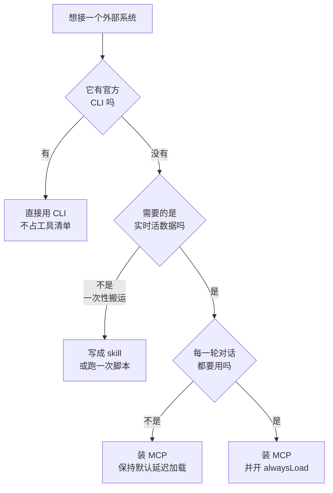

# 006. 装了一堆 MCP 之后卡顿、上下文被吃掉，到底该留哪些？

**一句话**：先用 `/context all` 量出 MCP 到底占了多少 —— 新版本默认开了 tool search，多数人量出来只有几百到几千 token，真正的凶手另有其人；确实占大头的，按「只有需要活数据才留 MCP，一次性自动化改用 CLI 或 skill」这一条判据裁，裁完重开会话再量一次对比数字。

## 30 秒结论

| 你看到的 | 立刻做 | 不想再犯 |
|---|---|---|
| 怀疑 MCP 吃上下文 | `/context all` 看 MCP tools 那一项的实际 token | 先量再裁，别凭感觉删 |
| 量出来 MCP 只占几百 token | 停手，问题不在 MCP，去查 CLAUDE.md / 历史对话 | 见 [#012](../02-上下文工程/012-上下文窗口要爆了.md) |
| 量出来上万 token | 查是不是有 server 配了 `alwaysLoad: true`，或走在 tool search 关闭的路径上 | 只给每轮都要用的少数工具开 `alwaysLoad` |
| 启动要等好几秒 | `/mcp` 看谁连不上；`alwaysLoad` 的 server 会阻塞启动最多 5 秒 | 不常用的 `/mcp disable <名字>` |
| 一个 MCP 调用返回刷屏 | 该调用被截到 25000 token；改用 CLI + `grep` 拿你要的那几行 | 大输出走 subagent 隔离 |
| 这事一次性做完就不用了 | 别装 MCP，写成 skill 或直接让它跑 CLI | 判据见下图 |



**有官方 CLI 就别装 MCP**；只有「要的是活数据、且每一轮都要用」才给它开 `alwaysLoad`。

## 怎么做

### 第 1 步：先量，别先删

```text
/context all
```

`/context` 把当前上下文画成一张彩色格子图，并列出每一项占多少 token；全屏模式下明细默认折叠，加 `all` 展开[^1]。看 MCP tools 那一项的绝对 token 数，**不要看百分比**（百分比会随窗口大小骗人，见 012）。

**怎么确认量对了**：你能说出一个具体数字，比如「MCP tools 占 1.2k token」。说不出数字就还没量。

拿到数字之后分三档处理：

- **几百 token**：正常，tool search 生效中，MCP 不是你的问题，别再往下读裁剪部分。
- **几千到一万**：可优化，走第 2、3 步。
- **上万甚至几万**：说明 tool search 没生效或被绕过了，先走第 4 步排查，比裁 server 见效快得多。

### 第 2 步：用「活数据」这一条判据决定装不装

官方给 MCP 的定位很窄：**当你发现自己在反复从另一个系统里复制粘贴数据到对话里时，才接一个 server**[^2]。反过来说：

| 你的需求 | 该用什么 | 为什么 |
|---|---|---|
| 查 issue 当前状态、查线上报错、查数据库现值 | MCP | 要的是每次都不一样的活数据 |
| 建 PR、发布、跑 CI、查云资源 | CLI（`gh` / `aws` / `gcloud` / `sentry-cli`） | 官方明说 CLI 比 MCP 更省上下文，因为它完全不进工具清单[^3] |
| 一次性把数据搬进仓库（导出一份 schema、抓一批文案） | 跑一次脚本，把结果存成文件 | 跑完就不用了，没必要常驻 |
| 同一套多步流程反复执行 | skill（见 [#033](../04-执行工作流/033-Skill与superpowers怎么用.md)） | 正文按需加载，不用时几乎零成本 |

一句话记法：**MCP 管「接到数据」，skill 管「拿这数据干什么」，CLI 管「做一个动作」。** 三者混用是装一堆 MCP 的根因。

### 第 3 步：不用的按需关掉，别删配置

```text
/mcp disable <server 名字>     # 关一个，配置留着
/mcp disable all               # 全关，用来做对照实验
/mcp enable <server 名字>      # 用的时候再开
/mcp                           # 打开面板，每个 server 后面显示工具数
```

`/mcp` 的 enable / disable 子命令是官方支持的，也可以在面板里直接切换开关；关掉的 server 仍然列在 `/mcp` 里、标记为 disabled，配置不丢[^4]。

**怎么确认生效**：`/mcp` 里那个 server 显示 disabled，且重开会话后 `/context all` 的 MCP tools 数字下降。**注意必须重开会话再量** —— 连/断 MCP 会改变工具清单，而修改工具定义会让整段 prompt 缓存失效[^10]，当场量到的数字既不准，还额外付一次缓存重写的钱（见 [#060](../07-效率与成本/060-一天该烧多少额度.md)）。

<details>
<summary>三个 scope 分别放什么，别把公司凭证提交进仓库</summary>

| scope | 生效范围 | 存在哪 | 放什么 |
|---|---|---|---|
| `local`（默认） | 只当前项目，只你自己 | `~/.claude.json` | 个人实验、带私人凭证的 server |
| `project` | 只当前项目，全团队 | 项目根的 `.mcp.json` | 团队共用、且不含密钥的 server |
| `user` | 你的所有项目 | `~/.claude.json` | 你到哪都要用的少数几个 |

```bash
claude mcp add --transport http sentry --scope local https://mcp.sentry.dev/mcp
claude mcp list          # 看当前生效的
claude mcp get <名字>    # 看单个的详情和状态
```

判据：**默认全部用 `local`。** 只有确认这个 server 全组都要用、且配置里没有密钥，才升到 `project`。`.mcp.json` 是要提交进版本库的，凭证进去就是事故 —— 见 [#072](../08-团队与组织/072-AI-coding安全红线.md)。

</details>

### 第 4 步：数字异常大时，查这四件事

1. **有 server 配了 `alwaysLoad: true`。** 这个字段让该 server 的**全部**工具在会话开始就进上下文，绕过 tool search，还会阻塞启动最长 5 秒[^5]。只给「每一轮都要用」的少数工具开，其余全部去掉。
2. **走在 tool search 被关掉的路径上。** 自定义 `ANTHROPIC_BASE_URL` 指向非官方主机、Google Cloud Agent Platform、Azure 上的 Microsoft Foundry 部署、以及设了 `CLAUDE_CODE_DISABLE_EXPERIMENTAL_BETAS`，都会退回「全部工具预先加载」[^6]。用中转站的人特别容易撞上这条。
3. **模型不支持。** tool search 需要模型支持 `tool_reference` 块，官方点名 Sonnet 4.5 / Haiku 4.5 / Opus 4.5 及以后[^6]。挂在老模型上就是全量加载。
4. **单次调用输出太大。** 超过 10000 token 会告警，默认截到 25000 token；要放宽用环境变量 `MAX_MCP_OUTPUT_TOKENS`[^7]。但更该做的是别放宽 —— 大输出交给 subagent（[#032](../04-执行工作流/032-SubAgent并行开几个.md)）。

<details>
<summary>`ENABLE_TOOL_SEARCH` 取值表与两种折中配置</summary>

| 取值 | 行为 |
|---|---|
| 不设（默认） | 全部延迟加载，按需搜索 |
| `true` | 强制全部延迟，对代理也发 beta 头（代理不支持 `tool_reference` 会直接报错）；Azure 上的 Foundry 部署和 GCP 上 4.5 之前的模型仍全量预加载，覆盖不了 |
| `auto` | 阈值模式：工具定义能塞进上下文窗口 10% 以内就预先加载，超出的才延迟 |
| `auto:N` | 同上，阈值改成 N%（0-100） |
| `false` | 全部预先加载，不延迟 |

取值行为均按官方文档核对[^6]。

```bash
ENABLE_TOOL_SEARCH=auto:5 claude    # 5% 以内预加载，其余延迟
ENABLE_TOOL_SEARCH=false claude     # 完全关掉延迟加载
```

也可以写进 `settings.json` 的 `env` 字段。想彻底禁掉搜索工具本身：

```json
{ "permissions": { "deny": ["ToolSearch"] } }
```

什么时候该用 `auto`：工具总量不大，且出现这两个可观测信号之一 —— 模型在回答里明说「没有可用的工具」，或同一个工具连续两轮以上搜不到、只能改用 Bash 兜底。什么时候该用 `false`：几乎没有 —— 除非在排查「是不是 tool search 导致工具调不到」。

</details>

### 第 5 步：做一次前后对比，把数字记下来

裁剪是不是有效，靠三个数字说话，不靠感觉：

```text
# 裁剪前
/mcp disable all        →  重开会话  →  /context all  →  记下 MCP tools 的 token 数（下界）
# 恢复你打算保留的
/mcp enable <A>         # 要留多个就一行一个，逐个 enable
/mcp enable <B>         →  重开会话  →  /context all  →  记下新数字
```

**怎么确认做对了**：三个数字（原始 / 全关 / 保留后）你都写下来了，且「保留后」明显靠近「全关」而不是「原始」。如果保留后跟原始几乎一样，说明占位的正好是你保留的那个 —— 那就该重新问它值不值这个价，而不是继续删别的。

## 为什么

### 一、tool search 已经把这个问题的性质改了

Claude Code 现在默认开启 tool search：**MCP 工具定义不再预先塞进上下文，只有工具名和 server instructions 在会话开始加载**，模型需要时通过搜索工具去发现，只有真正用到的才进上下文；官方明确说因此「加更多 MCP server 对上下文窗口的影响极小」[^8]。

所以网上大量「装 5 个 MCP 吃掉 55K token」的说法，描述的是关闭延迟加载时的情况。Anthropic 自己给的那组示例数字是：5 个 server / 58 个工具约 55K token（GitHub 35 个工具约 26K，Slack 11 个约 21K），再加 Jira（单独约 17K）这样的 server 继续装，很快逼近 10 万以上，内部见过 134K 的；官方另给了一组前后对比：50 多个 MCP 工具全量预加载约 72K，开启 Tool Search Tool 后只剩约 500 token[^9]。**这组数字今天的正确读法是「上界」和「关掉延迟加载会退回到哪」，不是你现在的实际占用。**

> 个人观点（小C）：这也是为什么第 1 步必须是量而不是删。照着一年前的帖子删 MCP，很可能删掉了有用的东西，而真正吃掉你上下文的是那份 400 行的 CLAUDE.md。

### 二、还没被消掉的三种真实成本

延迟加载消掉的只是「工具定义常驻」这一项。剩下三项还在：

1. **server instructions 仍然常驻**，而且官方把工具描述和 server instructions 各截断在 2KB[^8] —— server 装得多，这部分是线性叠加的。
2. **连接开销与启动阻塞**：`alwaysLoad` 的 server 会卡住启动最多 5 秒[^5]；HTTP/SSE 断开会按指数退避重连最多 5 次[^11]。装十几个远程 server，启动慢是必然的。
3. **每次调用的输出**：这才是长会话里 MCP 的主要消耗 —— 一次查询回来几千 token 的 JSON，全部进上下文且不会退出。这一项跟你装了几个 server 无关，只跟你调了几次有关。

### 三、CLI 为什么在多数场景下更划算

官方在成本页明确推荐优先用 CLI：`gh`、`aws`、`gcloud`、`sentry-cli` 这类工具**完全不产生逐工具的清单开销**，Claude 直接当命令跑[^3]。而且 CLI 的输出你能用管道现场裁（`| head`、`| jq`），MCP 的返回结构由 server 定，你改不了。

代价是要自己拼命令、要处理鉴权。所以判据落在「活数据 + 没有可用 CLI」这个交集上，而不是「这个系统有 MCP server 我就装」。

## 别这么干

- ❌ **凭感觉删 server。** 没量过就删，删完也不知道省了多少，下次照样装回来。三个数字对比是这件事唯一的验收方式。
- ❌ **给每个 server 都开 `alwaysLoad: true`，怕模型找不到工具。** 这等于手动退回到全量预加载，还额外承担启动阻塞。真找不到，先去改 server instructions（那才是官方给的解法）。
- ❌ **把带凭证的 server 加到 `project` scope。** `.mcp.json` 要进版本库，密钥跟着一起走。
- ❌ **为一次性任务装 MCP。** 装的成本是永久的，收益是一次性的。写个脚本跑完就完事。
- ❌ **靠调大 `MAX_MCP_OUTPUT_TOKENS` 解决刷屏。** 截断是保护不是障碍，放宽之后那几万 token 会留在上下文里直到会话结束。

<details>
<summary>换成 Cursor / Copilot 呢</summary>

| 维度 | Claude Code | Cursor | GitHub Copilot |
|---|---|---|---|
| 工具定义是否延迟加载 | 默认延迟（tool search） | 未见等价机制 | 未见等价机制 |
| 占用可视化 | `/context all` 给逐项 token | 无同等粒度 | 无同等粒度 |
| 按需开关 | `/mcp enable/disable` | 设置面板勾选 | 设置面板勾选 |

结论不变：不管哪个工具，「有 CLI 优先用 CLI、一次性任务不装 MCP」这条判据都成立，只是别的工具没给你量化和验证的手段。（横向部分为 2026-08-15 检索所得：多篇社区对比文一致称 Cursor 截至 2026 年中仍无原生延迟加载；两家官方文档未见等价机制的描述，也未见官方明确否认，属社区检索结论。）

</details>

## 延伸

**相关文章**

- [#004 CLAUDE.md、skill、subagent、hooks、plan mode 该用哪个](./004-Claude-Code能力地图.md) —— 那张能力表里空着的 MCP 一格，就是本篇
- [#012 上下文窗口要爆了怎么办](../02-上下文工程/012-上下文窗口要爆了.md) —— MCP 量出来不大时，去那边查真正的占用大头
- [#033 Skill 与 superpowers 怎么用](../04-执行工作流/033-Skill与superpowers怎么用.md) —— 判据里「一次性流程写成 skill」的做法
- [#060 一天该烧多少额度](../07-效率与成本/060-一天该烧多少额度.md) —— `/usage` 按 MCP server 拆分用量，以及中途连断 MCP 打掉缓存这件事
- [#072 AI coding 安全红线](../08-团队与组织/072-AI-coding安全红线.md) —— MCP 是外部数据通道，凭证与数据出境的红线在这篇

**参考资料**

- [CC Docs: Connect Claude Code to tools via MCP](https://code.claude.com/docs/en/mcp) —— 本篇绝大部分事实来源：三个 scope、`/mcp` 开关、`alwaysLoad`、`ENABLE_TOOL_SEARCH` 取值表、输出限额、重连策略（官方，2026-08-15 核对）
- [Anthropic API Docs: Prompt caching](https://platform.claude.com/docs/en/build-with-claude/prompt-caching) —— 「修改工具定义使整个缓存失效」的出处（官方，2026-08-15 核对）
- [CC Docs: Manage costs effectively](https://code.claude.com/docs/en/costs) —— 「优先用 CLI」「MCP 工具定义默认延迟加载」「用 `/context` 看占用」（官方，2026-08 核对）
- [CC Docs: Commands reference](https://code.claude.com/docs/en/commands) —— `/context all` 与 `/mcp enable|disable` 的准确语法（官方，2026-08 核对）
- [Anthropic Engineering: Advanced tool use](https://www.anthropic.com/engineering/advanced-tool-use) —— 55K / 134K / 85% 那组示例数字的原始出处（官方博客，2025-11）

[^1]: [CC Docs: Commands reference](https://code.claude.com/docs/en/commands)（官方，2026-08 核对）：`/context` 把上下文占用画成彩色格子并给出优化建议；全屏模式下折叠逐项明细，传 `all` 展开。
[^2]: [CC Docs: Connect Claude Code to tools via MCP](https://code.claude.com/docs/en/mcp)（官方，2026-08 核对）：当你发现自己在从另一个工具（如 issue 跟踪器或监控面板）往对话里复制数据时，就该接一个 server。
[^3]: [CC Docs: Manage costs effectively](https://code.claude.com/docs/en/costs)（官方，2026-08 核对）：`gh`、`aws`、`gcloud`、`sentry-cli` 这类 CLI 比 MCP server 更省上下文，因为它们不产生任何逐工具的清单开销。
[^4]: [CC Docs: Commands reference](https://code.claude.com/docs/en/commands)（官方，2026-08 核对）：`/mcp` 可传 `enable`/`disable` 加 server 名或 `all` 直接改连接状态；非交互模式需 v2.1.205 及以上。
[^5]: [CC Docs: MCP · Exempt a server from deferral](https://code.claude.com/docs/en/mcp)（官方，2026-08 核对）：`alwaysLoad: true` 让该 server 全部工具在会话开始加载，需 v2.1.121 及以上，并会阻塞启动直到连上、上限 5 秒。
[^6]: [CC Docs: MCP · Configure tool search](https://code.claude.com/docs/en/mcp)（官方，2026-08-15 核对）：tool search 默认开启；`ANTHROPIC_BASE_URL` 指向非官方主机时默认关闭（多数代理不转发 `tool_reference` 块）；GCP Agent Platform 上 4.5 之前的模型、Azure 上的 Microsoft Foundry 部署会全量预加载且 `ENABLE_TOOL_SEARCH=true` 覆盖不了；`CLAUDE_CODE_DISABLE_EXPERIMENTAL_BETAS` 会强制关闭且无法被 `ENABLE_TOOL_SEARCH` 覆盖；需模型支持 `tool_reference`（Sonnet 4.5 / Haiku 4.5 / Opus 4.5 及以后）；`auto` 默认阈值 10%、`auto:N` 自定义、`false` 全量预加载，取值表同页。
[^7]: [CC Docs: MCP](https://code.claude.com/docs/en/mcp)（官方，2026-08 核对）：MCP 工具输出超过 10000 token 时告警，默认限制在 25000 token，用 `MAX_MCP_OUTPUT_TOKENS` 提高上限，告警阈值本身固定。
[^8]: [CC Docs: MCP · Scale with MCP tool search](https://code.claude.com/docs/en/mcp)（官方，2026-08 核对）：只有工具名和 server instructions 在会话开始加载，因此增加 MCP server 对上下文窗口影响极小；工具描述和 server instructions 各截断在 2KB。
[^9]: [Anthropic Engineering: Advanced tool use](https://www.anthropic.com/engineering/advanced-tool-use)（官方博客，2025-11，2026-08-15 复核）：5 个 server / 58 个工具约 55K token；原文说再加 Jira（单独约 17K）这类 server 会「快速逼近 10 万以上的开销」——是继续加 server 才逼近 10 万，不是 55K+17K 直接超 10 万；内部优化前见过 134K。前后对比是另一组示例：50+ 个 MCP 工具全量预加载约 72K，开启 Tool Search Tool 后预加载只剩约 500 token，官方称整体 token 用量减少约 85%。
[^10]: [Anthropic API Docs: Prompt caching](https://platform.claude.com/docs/en/build-with-claude/prompt-caching)（官方，2026-08-15 核对）：修改工具定义（名称、描述、参数）会使整个缓存失效，且按 tools → system → messages 层级逐级传导。「连/断 MCP 属于修改工具定义」是据此的直接推断，官方未单独点名 MCP 这个场景；「额外付一次钱」指失效后重新写入缓存按 1.25 倍或 2.0 倍输入价计费。
[^11]: [CC Docs: MCP · Automatic reconnection](https://code.claude.com/docs/en/mcp)（官方，2026-08-15 核对）：HTTP/SSE server 会话中断开后自动重连，指数退避最多 5 次，首次间隔 1 秒、逐次翻倍；5 次失败标记为 failed，可在 `/mcp` 手动重试；stdio server 是本地进程，不自动重连。

---

<sub>难度 中级 · 决策题|配置题 · 主线 Claude Code，横向 Cursor / Copilot</sub>

<sub>**时效**：`/context all`、`/mcp enable|disable`、`alwaysLoad`、`ENABLE_TOOL_SEARCH` 取值表、`MAX_MCP_OUTPUT_TOKENS`、重连策略、三个 scope 的存放位置均按 2026-08-15 官方文档核对。**已知不确定**：文中「几百 / 几千 / 上万」的三档分界是经验分档，未见官方给出推荐阈值，按你自己的窗口大小调；「连/断 MCP 打掉缓存」由官方「修改工具定义使缓存失效」推断而来，官方未单独点名 MCP 场景；横向对比一栏为社区检索结论，Cursor / Copilot 官方文档未见等价机制描述、未见官方确证。**易变**：tool search 目前走 beta 头，默认值和支持的模型列表都在变；`alwaysLoad`（v2.1.121+）、`/mcp` 非交互模式（v2.1.205+）带版本门槛，配之前先 `claude --version` 对一眼。</sub>

> 本篇个人实践（L4）：我常驻的 MCP 只有两类——编码辅助类（CodeGraph、Context7）和浏览器操作类。其余能走 CLI 的一律不装 MCP，比如飞书就直接用 CLI。原则是按项目清理：当前项目用不上的 MCP 和 Skill 都清掉，只留这个项目真需要的，确保上下文干净。
