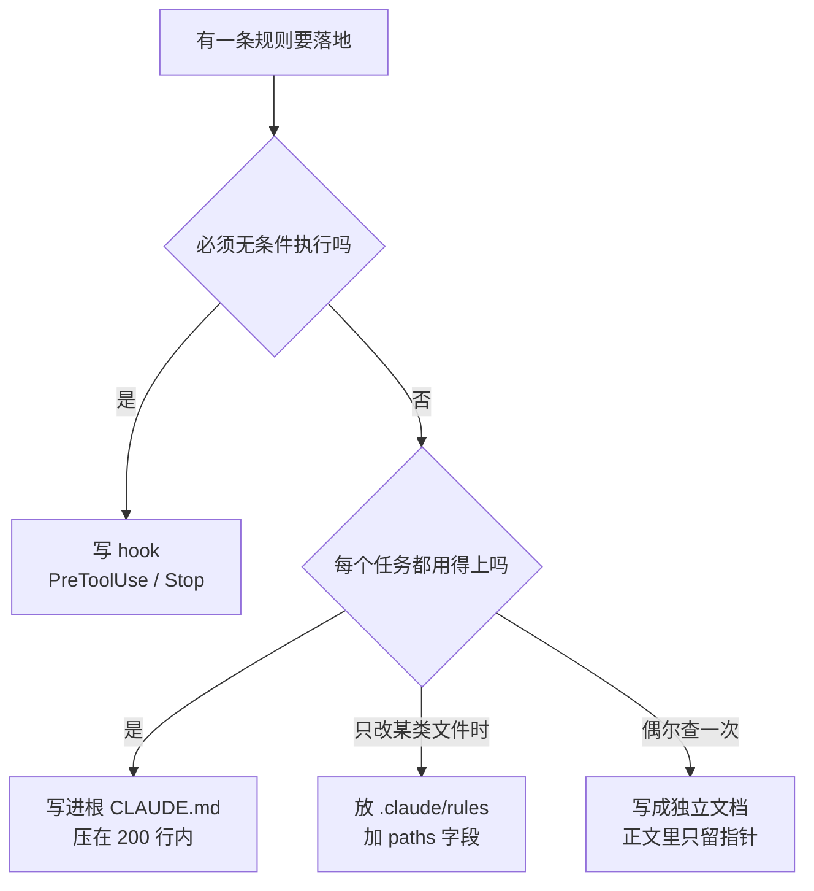

# 010. CLAUDE.md 怎么写才真的生效？

**一句话**：放根目录 `./CLAUDE.md`、总长压在 200 行以内、每条指令都能用一条命令验证；发现不生效，第一个动作永远是跑 `/context` 看它到底加载了没有。

## 30 秒结论

| 你看到的 | 立刻做 | 不想再犯 |
|---|---|---|
| 写的规则像完全没写过 | `/context` 看加载清单里有没有这个文件 | 只放标准路径，别自创目录 |
| 加载了，但时灵时不灵 | 把这条改到「能用一条命令验证」 | 写不出验证方式的指令不写 |
| 文件涨过 200 行后整体变差 | 砍回 200 行内，细节挪进 `.claude/rules/` | 每季度逐行过一遍，删死指令 |
| 行为前后矛盾 | 全文贴进新会话，问「哪些指令互相冲突」 | 加新指令前先搜有没有对立的旧条 |
| 有条规则必须 100% 执行 | 改写成 hook | 硬约束一律不进 CLAUDE.md |
| 它顺手改了没让改的地方 | 贴一段「自缚条款」进 CLAUDE.md | 交付前让它自报改动文件数与行数 |
| 规则越来越多、越来越死板 | 删掉说不出对应失败记录的那些 | 只为已发生过的失败加规则 |

一条规则该落到哪个文件，按这张图判：



## 怎么做

### 第 1 步：先确认它到底被加载了

排查「不生效」的第一步不是改内容，是跑 `/context`。它列出本会话实际加载进上下文的 memory 文件。文件不在这个清单里，说明 Claude 从头到尾没看见它，改多少内容都没用。

`/memory` 是另一个工具：它列出各层级 `CLAUDE.md` / `CLAUDE.local.md` 的**位置**并支持直接打开编辑，但不告诉你哪份真的加载了。两个别用混 —— 排查加载问题只认 `/context`。

<details>
<summary>四个层级分别放哪里、进不进 git</summary>

| 层级 | 位置 | 用途 | 是否进 git |
|------|------|------|-----------|
| 托管策略 (Managed policy) | macOS `/Library/Application Support/ClaudeCode/CLAUDE.md` 等 | 组织级（IT 管控、安全合规） | 否，机器级 |
| 用户级 (User) | `~/.claude/CLAUDE.md` | 个人跨项目偏好 | 否 |
| 项目级 (Project) | `./CLAUDE.md` 或 `./.claude/CLAUDE.md` | 团队共享的项目规范 | **是** |
| 项目本地 (Local) | `./CLAUDE.local.md` | 个人的、此项目专属（沙箱 URL 等） | 否（加 `.gitignore`） |

这几层是**拼接**进上下文，不是互相覆盖，越靠近工作目录的越晚被读到。放在这四类路径之外的自创位置不加载；放在子目录里的 CLAUDE.md 只在 Claude 读那个目录的文件时才加载。

</details>

### 第 2 步：每条指令写到「能被验证」

别用「够不够具体」这种自我感觉当标准。用一个能操作的自问：**这条指令，我能不能说出一条命令、或一个肉眼可见的结果，用来判断它有没有被执行？** 说不出来的就是模糊指令，删掉或改写。

| 写不出验证方式（模糊） | 验证方式摆在明面（具体） |
|---|---|
| 格式化好 | 用 2 空格缩进 —— `npm run lint` 报错即违反 |
| 记得测试 | 提交前跑 `npm test` —— 看有没有测试输出 |
| 保持文件整洁 | API handler 放 `src/api/handlers/` —— 看新文件落在哪 |

内容上只放三类「每次都适用」的东西：技术栈和目录结构（是什么）、项目目的（为什么）、构建/测试/验证命令与工作流约定（怎么做）。

`/init` 可以用来起草，但生成完必须逐行手改。自动生成的版本常见两个毛病：啰嗦，以及夹带只在当时成立的一次性指令。

### 第 3 步：加一段「自缚条款」限制改动范围

「只让改一行，它顺手重写了整个文件」是最费时间的一类返工。事后审 diff 已经晚了，把边界写在前面更省事。下面这段可以直接粘进项目 CLAUDE.md，六行，每条都有可观测的判据。

<details>
<summary>可直接复制的自缚条款（6 行）</summary>

```markdown
## Scope discipline
- 只改任务明确要求的代码。顺手发现的其他问题写进回复末尾的「顺带发现」列表，不要直接改。
- 小改动用最小编辑，禁止整文件重写：改 3 行就只出现 3 行 diff。
- 不新增没有对应需求条目的抽象层（接口、基类、工厂、配置项、插件机制）。需要抽象时先说明它服务哪条需求，等我确认。
- 不为需求里没提的场景加错误处理、兼容分支或防御性判断。
- 不改动测试来让代码通过；测试要改必须单独说明理由。
- 交付前自检并在回复里报一行：本次改了几个文件、每个文件改了多少行、是否都在任务范围内。
```

**怎么确认生效**：跑一个「只改一行」的小任务，看两个信号 —— 回复末尾有没有出现那行自检（改动文件数、行数）；`git diff --stat` 的文件数是不是等于你要求的文件数。有一项对不上，说明这段没被读到，回第 1 步查加载。

这段之所以能生效，是因为每条都写成了可判定的动作（「diff 里不该出现的文件数 = 0」），而不是「不要过度设计」这种没法验证的原则。范围外的改动怎么在审查阶段捞回来，见 [#041 怎么审查 AI 生成的代码](../05-质量保证/041-怎么审查AI生成的代码.md)。

</details>

### 第 4 步：超过 200 行就下沉，别硬塞

官方建议单个 CLAUDE.md 控制在 200 行以内[^1]。超了有两条下沉路径，区别很关键：

- `.claude/rules/*.md` **带 `paths:` 字段** —— 只在 Claude 改到匹配的文件时才加载，是唯一真省上下文的做法。API 规范、测试规范、前端规范适合放这里。
- `@path/to/file` **import** —— 适合组织文件结构、复用已有的 AGENTS.md，但被导入的文件启动时仍然全量加载，**不省 token**。

<details>
<summary>四种下沉机制的完整对照</summary>

| 机制 | 何时加载 | 省 token? | 典型用途 |
|------|---------|----------|---------|
| `@docs/x.md` import | 启动时全量 | ❌ 否 | 组织结构、复用 AGENTS.md |
| `.claude/rules/x.md`（无 paths） | 启动时全量 | ❌ 否 | 按主题拆分，便于维护 |
| `.claude/rules/x.md`（带 `paths:`） | **匹配文件时才加载** | ✅ 是 | API 规范、测试规范、前端规范 |
| `~/.claude/rules/` | 启动时（用户级，早于项目） | ❌ 否 | 个人偏好 |

**代价提醒**：带 `paths:` 的规则在 `/compact` 之后会丢失，要等 Claude 再次读到匹配文件才回来。必须每次都生效的指令别用这个字段（见 [#012 上下文窗口要爆了怎么办](./012-上下文窗口要爆了.md)）。

</details>

### 第 5 步：必须硬执行的，改写成 hook

「提交前必须 lint」「禁止改 `migrations/`」这类不容打折的约束，写进 CLAUDE.md 只是行为引导，写成 `PreToolUse` / `Stop` hook（在特定动作前后自动触发的脚本）才是硬执行。hook 是代码，不参与模型判断，也不占上下文。

### 第 6 步：定好「怎么增、怎么减」

CLAUDE.md 是要长期维护的，加法和减法都得有明确闸门，否则一年后它会变成一份没人敢动、也没人真在遵守的长文档。

**怎么增：只为已经发生过的失败加规则。** 官方给的触发条件很具体 —— Claude 第二次犯同一个错、code review 抓到一个它本该知道的项目约定、你这次又在聊天里敲了上次敲过的同一句纠正[^5]。三条都是「已经发生过」。反过来，「万一它以后……」这种假想边界不加规则，Copilot 官方的元规范把这种膨胀单独列成反模式[^6]。

落地成一个动作：建一个 `docs/ai-misses.md`（或 issue label），每次跑偏就记一行「日期 + 现象 + 当时的任务」。**同一条现象记到第 2 次，才允许往 CLAUDE.md 加规则**，并在规则后面用 HTML 注释挂上出处，比如 `<!-- 2026-07-02, 2026-07-15 两次把 handler 写进 src/utils -->`。块级 HTML 注释在注入前会被剥掉，不占 token[^7]。

**怎么减：三条判据，命中就删。**

| 判据 | 怎么看出来 | 动作 |
|---|---|---|
| 死指令 | 命令跑不通、路径 `ls` 不存在 | 直接删 |
| 无出处的规则 | 规则后面没有失败记录的注释，且没人说得出它当初为什么加 | 删，等它再犯一次再加回来 |
| 被反复手动豁免 | 同一条规则你在会话里说过 3 次「这次不用管它」 | 改写成带条件的表述，或降级到 `.claude/rules/` |

节奏上每季度过一遍即可。另外 `/doctor` 自带一项 CLAUDE.md 瘦身检查：它会提议砍掉 Claude 能自己从代码库看出来的内容（目录结构、依赖清单、架构概览），保留坑点、理由和与工具默认不同的约定；需要 Claude Code v2.1.206 及以上[^8]。

**查矛盾**：把整份 CLAUDE.md 贴进一个新会话，问「哪些指令互相冲突？」。Claude 很擅长找出自己被喂的矛盾指令。官方也明说两条规则打架时它会**任选一条**，所以矛盾不是「偶尔出错」，是行为直接变得不可预测[^2]。

<details>
<summary>一份合格的项目级 CLAUDE.md（不到 60 行的完整示例）</summary>

```markdown
# Project: payments-service

## Stack
- Node 20 + TypeScript strict, Fastify, Prisma (PostgreSQL)
- 测试: Vitest; 单测 `npm run test:unit`, 集成 `npm run test:integration`（需本地 Redis）

## Architecture at a glance
- `src/api/handlers/` — HTTP 路由 handler，所有入参必须校验
- `src/domain/` — 领域逻辑，不依赖 HTTP 层
- `src/db/` — Prisma repository，所有数据库访问只走这里
- 详细规范见 @docs/architecture.md（需要时再读）

## Conventions
- 错误响应统一用 `src/api/errors.ts` 的 `ApiError`
- 提交前跑 `npm run lint && npm test`
- 金额一律用分（整数），禁止浮点

## Out of scope for CLAUDE.md
- 代码风格细节交给 Biome（已配 Stop hook 自动修复）
- 临时计划放 issue tracker，不要写进这里
```

两个要点：一是只放指针不放拷贝（用 `@docs/architecture.md` 引，不复制全文）；二是每条都具体到命令、目录、单位。

**社区技巧**（单源，可选）：某条规则被反复忽略时，把它单独拆进一个 `coderules.md`，再做一个 slash 命令，在会话开始或 compact 之后显式让 Claude 读一遍，绕开系统提醒里那句「可能不相关」的判断。

</details>

## 为什么

### 它是「上下文」，不是「配置」

官方文档写得很清楚：CLAUDE.md 的内容是作为一条**用户消息**放在系统提示之后送进去的，不是系统提示的一部分；Claude 会读、会尽量遵守，但不保证严格照做，遇到模糊或互相冲突的指令时尤其如此[^2]。

还有个更决定性的细节：Claude Code 在 CLAUDE.md 之后会再附加一段 `important-instruction-reminders`，其中一句的意思是「这段上下文可能和你的任务相关也可能无关，除非高度相关否则不要理会它」[^3]。也就是说，Claude 会自己判定你的指令跟当前任务相不相关，判定为不相关就直接跳过。

这解释了为什么「时灵时不灵」是常态，也解释了为什么硬约束必须走 hook。

### 指令越多，遵守率越低 —— 而且是均匀下降

社区研究的结论是：前沿推理模型能稳定跟随大约 150 到 200 条指令；超过之后，遵循质量是**均匀下降**的 —— 不是只忽略排在后面的，而是所有指令都开始被差不多的概率忽视[^4]。Claude Code 自身的系统提示已经占掉约 50 条，留给你的可靠跟随预算本来就不多。

这就是 200 行上限的由来：它不是排版洁癖，是把有限的跟随预算花在真正每次都要用的指令上。

### compact 之后，只有一部分指令会回来

项目根目录的 `CLAUDE.md` 在 `/compact` 之后会从磁盘重新读取并重新注入；子目录里嵌套的 CLAUDE.md、以及带 `paths:` 的 rules 不会自动回来，要等 Claude 再次读到对应目录/文件。所以「必须每次都生效」的指令，务必放根目录、不加 `paths:`。

## 别这么干

- ❌ **把 CLAUDE.md 当 linter。** 代码风格细则交给 Biome / ESLint / Prettier，再挂 Stop hook 自动修复。让大模型当 linter 又慢又贵，还占上下文。
- ❌ **`/init` 生成后一行不改。** 自动生成的版本啰嗦且夹带一次性指令，而 CLAUDE.md 影响每个工作流阶段，一行错指令会被放大成大量错代码。
- ❌ **无限堆叠、从不删除，于是攒出一堆矛盾指令。** 超过官方建议的 200 行后遵守率明显下降；架构重构了文件却没更新时，Claude 会自信地往不存在的目录里写文件。堆久了还会出现「永远用 async/await」和「工具目录用 .then()」并存这种矛盾，行为直接变得不可预测。按第 6 步定期做减法、查冲突。
- ❌ **规则写太死。** 满篇 NEVER / ALWAYS，边缘情况上它会宁可机械硬套也不变通：比如「禁止用 `any`」逼出十几行类型体操来替代一句合理的断言，或者它在回复里明说「规则不让我 X，所以我改用 Y」而 Y 明显更绕。三个可观测信号 —— 出现上面这类绕远的实现；规则条数在涨但你说不出每条对应哪次真实失败；同一条规则你在会话里连着 3 次手动豁免。硬规则只留给真出过事的那几条，其余写成带条件的表述（「默认 X；确有必要用 Y 时先说明理由」）。
- ❌ **指望它强制执行。** 「提交前必须跑测试」要万无一失就写 hook。CLAUDE.md 是行为引导，hook 才是硬执行层。

<details>
<summary>横向对比：Cursor / Copilot / Cline 的规则文件</summary>

| 工具 | 文件/机制 | 作用域与加载 | 关键差异 |
|------|----------|------------|---------|
| **Claude Code** | `CLAUDE.md`（多层级）+ `.claude/rules/*.md`（带 `paths`）+ `@import` | 4 层级拼接注入；rules 可按 glob 条件加载 | 层级最丰富；强调「上下文非配置」；官方建议 <200 行 |
| **Cursor** | 旧 `.cursorrules`（已弃用）→ 新 `.cursor/rules/*.mdc` | 旧：每次请求全量注入；新：4 种激活模式（Always/Auto/Glob/Manual） | MDC 用 YAML frontmatter（`globs`/`alwaysApply`）；`alwaysApply:true` 等价旧 `.cursorrules` |
| **GitHub Copilot** | `.github/copilot-instructions.md` | 仓库根单文件，IDE 内自动注入 chat/inline | 无多层级、无条件加载机制；**GitHub.com 的 Code Review 可能不读它** |
| **Cline** | `.clinerules`（项目根） | 类似旧 `.cursorrules`，线性加载 | 概念相同但更偏 agent 化；上下文窗口最大可达 1M token（取决于所选 provider/模型） |

共性趋势：所有主流工具都在从「单文件全量注入」走向「按文件类型或路径条件加载」。Cursor 的 glob、Claude Code 的 `paths` rules、Cline 的 memory bank，本质是同一件事 —— 渐进式披露（用到时才加载对应内容），目的是避免上下文膨胀。

有一份社区实测称优化 rules 能把 agent 准确率提升 10–15%，单源、未见复现，当方向参考即可，别当指标。

</details>

## 延伸

**相关文章**

- [#011 为什么 prompt 写得很细，Claude 还是越跑越偏？](./011-上下文工程与提示词工程.md) —— CLAUDE.md 被稀释的上层原理
- [#012 上下文窗口要爆了怎么办？](./012-上下文窗口要爆了.md) —— compact 之后哪些规则会丢
- [#013 哪些决策必须写进 memory 才扛得住 compact](./013-哪些决策要写进memory.md) —— 手写指令层与自动记忆层怎么分工
- [#014 三份规则文件改一处漏两处怎么办？](./014-多份规则文件怎么同步.md) —— CLAUDE.md 与 AGENTS.md 的真源方案

**参考资料**

- [How Claude remembers your project — Claude Code Docs](https://code.claude.com/docs/en/memory) —— 支撑本篇的层级加载表、200 行建议、`/context` 排查顺序、compact 后的重新注入规则、加规则的四个时机、HTML 注释不占 token、`/doctor` 瘦身检查（官方，2026-08 复核）
- [github/awesome-copilot: instructions.instructions.md](https://github.com/github/awesome-copilot/blob/main/instructions/instructions.instructions.md) —— 支撑「不为假想边界加规则」这条反模式（GitHub 官方仓库，2026-08）
- [Writing a good CLAUDE.md — HumanLayer Blog](https://www.humanlayer.dev/blog/writing-a-good-claude-md) —— 支撑「指令跟随均匀衰减」「系统提示已占约 50 条」「必须逐行手改而非 `/init` 直接用」（社区权威，2025-11）
- [Why your CLAUDE.md stops working — aicodex.to](https://www.aicodex.to/articles/claude-md-maintenance) —— 支撑「无限堆叠、从不删除」这条反模式与季度审计习惯（社区，2026-04）
- [Claude Code Memory Explained — Jose Parreño Garcia](https://joseparreogarcia.substack.com/p/claude-code-memory-explained) —— 支撑「层级是拼接不是覆盖」的心智模型（社区，2026-02）
- [This is why Claude Code sometimes ignores your claude.md — r/ClaudeAI](https://www.reddit.com/r/ClaudeAI/comments/1ldugmg/this_is_why_claude_code_sometimes_ignore_your/) —— 支撑 `important-instruction-reminders` 注入机制与 `coderules.md` 社区技巧（社区，2025-05）
- [The CLAUDE.md Memory System — SFEIR Institute](https://institute.sfeir.com/en/claude-code/claude-code-memory-system-claude-md/faq/) —— 支撑「指令要具体可验证」的写法清单（社区，2025）
- [Optimizing Coding Agent Rules — Arize Blog](https://arize.com/blog/optimizing-coding-agent-rules-claude-md-agents-md-clinerules-cursor-rules-for-improved-accuracy/) —— 横向对比里「优化 rules 提升准确率 10–15%」的唯一来源（社区，2025，单源）
- [Adding repository custom instructions for GitHub Copilot — GitHub Docs](https://docs.github.com/copilot/customizing-copilot/adding-custom-instructions-for-github-copilot) / [GitHub Community 187926](https://github.com/orgs/community/discussions/187926) —— 横向对比里 Copilot 一行的依据（官方 + 社区）
- [r/cursor: .cursor/rules MDC files](https://www.reddit.com/r/cursor/comments/1idg434/anyone_else_finding_the_the_new_mdc_cursorrules/) —— 横向对比里 Cursor MDC 机制的依据（社区，2025-02）

[^1]: [Claude Code Docs: Choose where to put CLAUDE.md files](https://code.claude.com/docs/en/memory)（官方，2026-06）：建议每个 CLAUDE.md 文件保持在 200 行以内，过长会消耗更多上下文并降低遵守率。
[^2]: [Claude Code Docs: Troubleshoot memory issues](https://code.claude.com/docs/en/memory)（官方，2026-06）：CLAUDE.md 以系统提示之后的一条用户消息投递，不保证严格遵守，模糊或冲突指令尤甚。
[^3]: [This is why Claude Code sometimes ignores your claude.md — r/ClaudeAI](https://www.reddit.com/r/ClaudeAI/comments/1ldugmg/this_is_why_claude_code_sometimes_ignore_your/)（社区，2025-05）：揭示附加在 CLAUDE.md 之后的 `important-instruction-reminders` 段落；HumanLayer 通过抓取 `ANTHROPIC_BASE_URL` 请求独立验证了同样的注入顺序。
[^4]: [Writing a good CLAUDE.md — HumanLayer Blog](https://www.humanlayer.dev/blog/writing-a-good-claude-md)（社区权威，2025-11）：前沿推理模型可稳定跟随约 150–200 条指令，超出后遵循质量均匀下降，Claude Code 系统提示已占约 50 条。
[^5]: [Claude Code Docs: When to add to CLAUDE.md](https://code.claude.com/docs/en/memory)（官方，2026-08）：给出四个添加时机 —— Claude 第二次犯同一个错、code review 抓到它本该知道的项目知识、你重复敲同一句纠正、新同事需要同样的上下文。
[^6]: [github/awesome-copilot: instructions.instructions.md](https://github.com/github/awesome-copilot/blob/main/instructions/instructions.instructions.md)（GitHub 官方仓库，2026-08 核实）：把 "Hypothetical-rule inflation: Do not add rules for failures that have not occurred" 列为编写指令文件的反模式。
[^7]: [Claude Code Docs: How CLAUDE.md files load](https://code.claude.com/docs/en/memory)（官方，2026-08）：CLAUDE.md 中的块级 HTML 注释在注入上下文前被剥除，可用于给人类维护者留注记而不消耗 token。
[^8]: [Claude Code Docs: My CLAUDE.md is too large](https://code.claude.com/docs/en/memory)（官方，2026-08）：`/doctor` 会为已提交的 CLAUDE.md 提出瘦身建议，砍掉可从代码库推导的内容、保留坑点与非默认约定；该检查需 v2.1.206 及以上。

---

<sub>难度 中级 · 配置题 · 主线 Claude Code，横向 Cursor / Copilot / Cline</sub>

<sub>**时效**：注入机制（以 user message 形式投递、不保证严格遵守）、200 行建议、四层加载顺序、`/context` 与 `/memory` 分工，已于 2026-07-18 对照官方 memory 文档核实；「第二次犯同一个错才加规则」「矛盾规则会被任选一条」「块级 HTML 注释不占 token」「`/doctor` 的 CLAUDE.md 瘦身检查（需 v2.1.206+）」于 2026-08-04 对照同一份官方文档核实。**已知不确定**：「150–200 条指令」「系统提示占约 50 条」「优化 rules 提升准确率 10–15%」均为社区单源，未见官方确证；「自缚条款」这一整段片段的具体措辞、以及「同一现象记满 2 次才加规则」「同一条规则豁免 3 次就改写」的阈值，都是实践约定而非官方或实测结论，按自己的节奏调；300 行上限是社区流行说法，本篇统一按官方的 200 行给行动阈值。**易变**：第三方工具（Cursor `.mdc`、Copilot、Cline）的规则文件机制迭代快，落地前查各家官方文档。</sub>

> 本篇个人实践（L4）：`[待补：BOSS 的实战经验/踩坑]`
