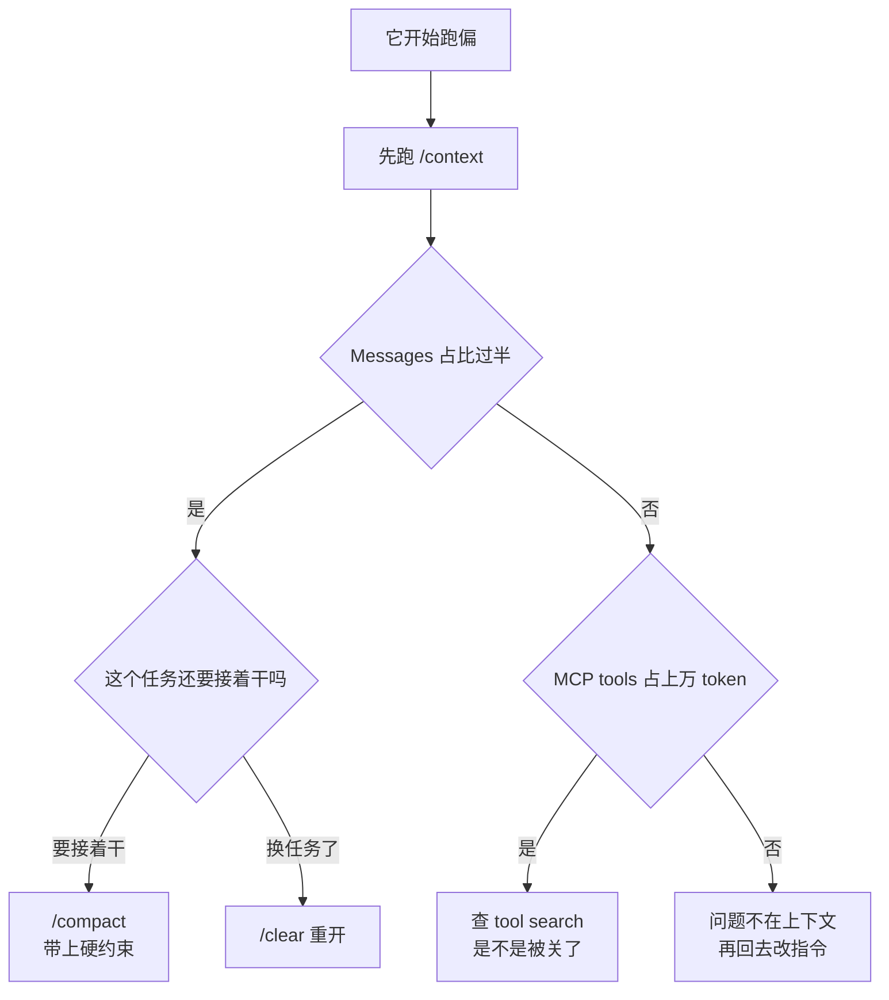

# 011. 为什么 prompt 写得很细，Claude 还是越跑越偏？

**一句话**：跑几十轮后不听话，不是 prompt 写得不好，是你的指令被工具输出稀释了 —— 先跑 `/context` 看 Messages 占比，过半就 `/compact` 带上约束重说一遍，换任务就 `/clear`，会产出大量文本的活全丢给 subagent。

## 30 秒结论

| 你看到的 | 立刻做 | 不想再犯 |
|---|---|---|
| 跑几十轮后忘了开头的约束（「不许改测试」之类） | `/context` 看 Messages 占比 → `/compact` 带上约束再说一遍 | 长任务每到一个阶段就带指令压一次 |
| 换了个任务，它还在提上一个任务的文件 | `/clear` 重开 | 任务不共享文件就一律先 clear |
| 让它读了一遍全仓库，之后回答开始胡说 | 别再预塞，改成给入口文件让它自己 Grep | 默认按需加载，上下文里只留路径和查询 |
| 接了几个 MCP server 后可用上下文肉眼变少 | `/context` 看 MCP tools 一行，确认 tool search 没被关掉 | 不给每个 server 都开 `alwaysLoad` |
| 子任务（查资料、翻日志）把主对话搞脏 | 丢给 subagent，只回传结论 | 一次性大文本的活默认走 subagent |



先分清两个词：**prompt** 是你写的那段字符串；**context（上下文）** 是每次调模型时真正送进去的全部 token —— 系统提示、CLAUDE.md、对话历史、工具返回结果、检索片段全算在内。你只直接控制了第一项。

## 怎么做

### 第 1 步：先量，别猜

跑 `/context`。它把当前上下文占用画成彩色网格，按项目分行（System prompt / CLAUDE.md / Skills / MCP tools / Messages 等），并给优化建议。要逐项明细就跑 `/context all`。

三条判据（阈值是经验参考，官方没给推荐值，按自己的任务调）：

- **Messages 占比超过一半** → 该压缩或清空了。
- **MCP tools 一行上万 token** → 见第 5 步。
- **CLAUDE.md 一行比 System prompt 那行还大** → 太长了，拆成按需加载的 skill 或 rules（见 [#010 CLAUDE.md 怎么写才真的生效](./010-CLAUDE-md怎么写才生效.md)）。

### 第 2 步：任务边界到了就 `/clear`

```
/clear
```

`/clear` 开一个空上下文的新会话。可以带名字（`/clear 支付重构`）给旧会话打标签，之后 `/resume` 找回。

**什么时候用**：新任务和旧任务不共享文件 → 一律先 clear。留着旧上下文既烧钱又制造干扰。

### 第 3 步：必须接着干的长任务，用带指令的 `/compact`

```
/compact 保留：不许修改 tests/ 目录、改动前必须跑 pytest、当前正在改 payments/refund.py
```

`/compact [instructions]` 把对话摘要成一段释放空间，你传的 instructions 决定摘要保留什么。**这是让核心约束「活过压缩」的唯一手段** —— 不写 instructions，约束大概率被摘掉。

**怎么确认做对了**：压缩结束立刻跑 `/context`，Messages 一行的 token 数必须比压缩前小，没变就是没压成；再问一句「复述一下当前的硬约束」，答案里必须逐条出现你写进 instructions 的那几项，缺一条就当场补一遍。

### 第 4 步：脏活丢给 subagent，只让结论回主上下文

subagent 有自己独立的上下文窗口、系统提示和权限，工作完只把摘要回传主会话。查资料、翻日志、遍历大目录这类会产出大量一次性文本的活，全该走这条路。

**怎么确认做对了**：让它干一件该委派的活，主会话里应该只出现摘要而不是原始日志；跑 `/context`，Messages 的增量应远小于你自己手动读一遍日志。

<details>
<summary>可复制：一个只回传结论的 log-digger subagent</summary>

新建 `.claude/agents/log-digger.md`（项目级）或 `~/.claude/agents/log-digger.md`（个人全局）：

```markdown
---
name: log-digger
description: 翻查测试报错与运行日志，只回传结论与关键行号，不回传原始日志
tools: Read, Glob, Grep, Bash
model: sonnet
---

你负责在日志与测试输出里定位问题。

规则：
1. 只回传结论、涉及的文件与行号、最多 10 行关键原文。
2. 绝不把整份日志或整个文件内容回传给主会话。
3. 找不到就直接说找不到，不要猜。
```

`tools` 里带了 `Bash` 就意味着这个 subagent 能写文件、能执行命令 —— 想要真只读，删掉 `Bash`，只留 `Read, Glob, Grep`。

文件存下后几秒内生效，不必重启。官方列了两种仍需重启的例外：一是 `agents/` 目录在会话启动之后才新建（目录监听只覆盖启动时已存在的目录）；二是会话用 `--disable-slash-commands` 启动，这种会话根本不监听这两个目录。

</details>

### 第 5 步：MCP 接多了，确认 tool search 是开的

Claude Code 默认开启 MCP tool search：会话启动时只加载工具名和 server 说明，完整工具定义等用到时才拉进来，所以多接几个 server 对上下文影响很小。

**怎么确认做对了**：跑 `/context` 记下 MCP tools 那一行的数值；临时设 `ENABLE_TOOL_SEARCH=false` 重启再看同一行。tool search 生效时，前者应明显小于后者；两次数值一样，说明它本来就没开。

<details>
<summary>tool search 被关掉的四种情况，以及怎么显式打开</summary>

会被关掉的情况：设了 `ENABLE_TOOL_SEARCH=false`；设了 `CLAUDE_CODE_DISABLE_EXPERIMENTAL_BETAS`；`ANTHROPIC_BASE_URL` 指向非官方主机（多数代理不转发所需的 `tool_reference` 块）；模型不支持 `tool_reference`（需要 Sonnet 4.5 / Haiku 4.5 / Opus 4.5 及之后）。

显式打开，写进 `.claude/settings.json`（项目）或 `~/.claude/settings.json`（个人）：

```json
{
  "env": {
    "ENABLE_TOOL_SEARCH": "true"
  }
}
```

`ENABLE_TOOL_SEARCH=auto` 是阈值模式：工具定义能塞进上下文窗口 10% 以内就一次性加载，超出的部分才延迟。

例外：某个 server 的工具每轮都要用，可以在该 server 配置里设 `"alwaysLoad": true`，它的全部工具在启动时进上下文。代价是这些 token 一直占着，只对少量工具这么干。

</details>

### 第 6 步：默认按需加载，不预塞

官方推荐的做法是上下文里只保留轻量引用（文件路径、查询语句、链接），运行时用工具按需加载，而不是提前把所有数据塞进去[^1]。Claude Code 处理大仓库就是这个套路。

落到手上两条：

- 不要一上来「把整个 `src/` 读一遍」。给它入口文件和目标，让它自己 Grep。
- CLAUDE.md 只写「每次都要遵守的事实和约束」，长流程写成 skill —— skill 正文只在被用到时才加载，放着基本不花 token。

另外别往 prompt 里堆边缘情况清单，也别把工具集堆臃肿 —— 官方把「覆盖过多功能的臃肿工具集」列为最常见的工具失效模式之一。

## 为什么

### 一个真实现场：指令一个字没变，比重被稀释了

你在 CLAUDE.md 里写清楚了「改动前先跑 `pytest`，不许修改 `tests/` 下的文件」。前几轮完全正常。然后你让它修一个跨 8 个文件的 bug，它开始 Grep、Read、跑测试、看报错、再 Read……三十几轮工具调用之后，你发现它删掉了一个断言，理由是「这个测试和新实现不符」。

你的指令还在上下文里躺着，变的是它周围多了大量文件内容和报错日志。这个稀释比例可以自己量：任务刚开始和三十轮之后各跑一次 `/context`，对比 CLAUDE.md 和 Messages 两行的 token 数，比值一目了然。

这就是 prompt engineering 和 context engineering 的分界线：**前者管你写了什么，后者管模型实际看到的那一整包东西长什么样。**

| 维度 | Prompt Engineering | Context Engineering |
|------|-------------------|---------------------|
| 工作单元 | 一段文本 | 推理时刻的整个上下文窗口 |
| 包含内容 | 指令 + few-shot 示例 | 指令 + 历史 + 工具结果 + 检索 + 记忆 + 输出格式 |
| 静态/动态 | 一次写定 | 运行时按任务组装 |
| 发生时机 | 离线、一次性 | 每一轮都发生 |

### 根因：上下文越长越记不住，而 agent 的上下文只涨不降

第一层是 **context rot（上下文腐烂）**：上下文里 token 越多，模型准确回忆其中信息的能力越差，所以上下文要当成「边际收益递减的有限资源」[^2]。学界更早就有实证：模型对长上下文中**位于中间**的信息回忆显著变差，即使专为长上下文设计的模型也一样，这个现象叫 lost in the middle[^3]。直接含义是：「全塞进去更保险」是错的。

第二层是 agent 特有的：长程任务加上不断累积的工具调用反馈会让 token 快速堆高，后果是超窗口、成本延迟暴涨、表现下降。数量级上，一个典型 agent 任务平均需要约 50 次工具调用[^4]，每次调用的返回值都进上下文，而且不会自己出去。你在第 0 轮写的 prompt，无法预判第 30 轮需要什么、又该扔掉什么 —— 这是 prompt 单独解决不了的问题。

第三层是可调的旋钮变多了。单轮聊天里 system prompt 几乎是唯一杠杆；多轮 agent 里多出来一堆维度：什么时候检索什么、工具结果留不留、历史压不压、要不要拆 subagent 隔离。官方给的原则是找到**能达成目标的最小一组高信号 token**[^1]。

### 「prompt engineering 已死」这话别信

有一派喊 prompt engineering 已死，但官方用的词是「自然演进」（natural progression），不是替代[^1]。Simon Willison 的解释更准：换名字之所以赢，是因为旧名字被大众理解成「往聊天框里打字的一个自命不凡的说法」，而不是这项技能本身作废。

实用的分法：**prompt 是写给聊天机器人的一次性请求，context 是为应用维护、不断演化的指令；两者没有高下，只是用途不同。**

> 个人经验的分界线：你在聊天框里问一句就走，写好 prompt 够了。你在 Claude Code 里跑一个要几十轮工具调用的任务，那就是上下文工程问题，改 prompt 的措辞收益很小。

## 别这么干

- ❌ **靠「再强调一遍措辞」解决跑偏。** 先看 `/context`：Messages 已占大半时问题不在措辞，先 `/compact` 带约束或 `/clear` 重开。
- ❌ **裸跑 `/compact`，不带 instructions。** 摘要不知道你要保什么，硬约束经常被摘没。压完一定复述验证一次。
- ❌ **把所有规则堆进 CLAUDE.md 或 system prompt。** 官方明确反对穷举边缘情况，堆得越多单条规则被忽略的概率越高。该按需加载的写成 skill 或 rules。
- ❌ **主会话亲自翻日志、遍历大目录。** 一次性文本进了主上下文就出不去了，该走 subagent。
- ❌ **工具集臃肿。** 挂太多工具会让 agent 在选择上犹豫 —— 不是模型笨，是上下文里的选项制造了决策噪声，官方把它列为最常见的工具失效模式之一。

<details>
<summary>横向对比：Claude Code / Cursor / Copilot 的上下文机制</summary>

只列机制，具体数值参数变化快，以各家官方文档为准。

| 维度 | Claude Code | Cursor | GitHub Copilot |
|------|------------|--------|----------------|
| 持久项目上下文 | `CLAUDE.md`（多层级）+ `.claude/rules/*.md`（可按 glob 条件加载） | `.cursor/rules/*.mdc`（Always / Auto / Glob / Manual 四种激活） | `.github/copilot-instructions.md`（仓库根单文件） |
| 上下文压缩 | `/compact [instructions]` + 接近上限时自动压缩 + `/clear` | Max Mode —— 偏「撑大窗口」而非压缩 | 无显式压缩特性（官方文档未记载） |
| 上下文隔离 | Subagents：独立上下文窗口 + 独立系统提示 + 独立权限，只回传摘要 ⭐ | 无命名隔离特性 | 官方未记载 |
| 代码库检索 | Read / Grep + MCP tool search 延迟加载工具定义 | Codebase Indexing（embedding 索引）+ `@` 引用 | 语义搜索（`#codebase`），需 workspace 索引 |
| 上下文可视化 | `/context`（占用网格 + 优化建议）⭐ | 无 | 无 |

三点观察：

**Claude Code 的差异化是「隔离 + 延迟加载」。** subagent 和 tool search 正好对应官方博客里的 isolate 和 just-in-time context 两条原则，等于把自家理论做进了产品。

**Cursor 偏「撑大窗口 + 精准引用」**，靠 Max Mode、`@` 符号、embedding 索引让用户显式控制塞什么进去。

**Copilot 偏「自动决策」**，agent 自己判断要什么、自动跑语义搜索，用户介入最少。

共性趋势：三家都在从「单文件全量注入」走向渐进式披露 —— 条件加载、按需检索、延迟注入。原因一样，谁都逃不过 context rot。

</details>

## 延伸

**相关文章**

- [#010 CLAUDE.md 怎么写才真的生效？](./010-CLAUDE-md怎么写才生效.md) —— 指令层怎么写才不被稀释掉
- [#012 上下文窗口要爆了怎么办？](./012-上下文窗口要爆了.md) —— 压缩与清空的完整操作手册
- [#013 哪些决策必须写进 memory 才扛得住 compact](./013-哪些决策要写进memory.md) —— 上下文工程的「持久化」子环节
- [#014 三份规则文件改一处漏两处怎么办？](./014-多份规则文件怎么同步.md) —— 多工具规则文件的真源方案

**参考资料**

- [Effective context engineering for AI agents — Anthropic](https://www.anthropic.com/engineering/effective-context-engineering-for-ai-agents) —— 支撑「自然演进而非替代」「最小高信号 token 集」「按需加载优于预塞」「臃肿工具集是最常见失效模式之一」（官方，2025-09，2026-08-15 核对）
- [Claude Code Docs: 命令参考](https://code.claude.com/docs/en/commands) —— 支撑 `/compact [instructions]`、`/clear [name]`、`/context [all]` 的准确语法（官方，2026-08-15 核对）
- [Claude Code Docs: MCP](https://code.claude.com/docs/en/mcp) —— 支撑 tool search 默认开启、四种被关掉的情况、`ENABLE_TOOL_SEARCH` 取值与 `alwaysLoad`（官方，2026-08-15 核对）

<details>
<summary>更多参考资料</summary>

- [Claude Code Docs: Subagents](https://code.claude.com/docs/en/sub-agents) —— 支撑 subagent 独立窗口/权限、frontmatter 字段、两种需重启的例外（官方，2026-08-15 核对）
- [Claude Code Docs: Skills](https://code.claude.com/docs/en/skills) —— 支撑「skill 正文按需加载、放着基本不花 token」（官方，2026-08 核对）
- [Context Engineering for AI Agents: Lessons from Building Manus — Manus 官方博客](https://manus.im/blog/Context-Engineering-for-AI-Agents-Lessons-from-Building-Manus) —— 支撑「一个典型 agent 任务平均约 50 次工具调用」（厂商官方博客，2025-07，2026-08-15 核对）
- [Context engineering — Simon Willison](https://simonwillison.net/2025/jun/27/context-engineering/) —— 支撑「换名字赢不等于技能作废」这段判断（社区权威，2025-06）
- [Prompts vs. Context — Drew Breunig](https://www.dbreunig.com/2025/06/25/prompts-vs-context.html) —— 支撑「一次性请求 vs 为应用维护的指令」这条分法（社区，2025-06-25）
- [The New Skill in AI is Not Prompting, It's Context Engineering — Philipp Schmid](https://www.philschmid.de/context-engineering) —— 支撑「多数 agent 失败是上下文失败而非模型失败」（社区权威，2025-06）
- [Context Engineering for Agents — LangChain](https://www.langchain.com/blog/context-engineering-for-agents) —— 支撑「工具调用反馈累积导致超窗口、成本与表现恶化」（社区权威，2025-07）
- [Working with Contexts — O'Reilly Radar (Drew Breunig)](https://www.oreilly.com/radar/working-with-contexts/) —— 支撑「过期工具输出与无关检索片段会污染推理」（社区权威，2025-08）
- ["Prompt engineering is dead. Long live context engineering" — MarTech](https://martech.org/prompt-engineering-is-dead-long-live-context-engineering/) —— 本篇不采纳的那一派观点原文（社区，2025-07）
- 词源背景（本篇不展开，仅存档）：[Tobi Lütke 原推](https://x.com/tobi/status/1935533422589399127)（社区，2025-06-19）、[Karpathy 转推](https://x.com/karpathy/status/1937902205765607626)（社区权威，2025-06-25）
- [Cursor Docs: Max Mode](https://docs.cursor.com/context/max-mode) / [VS Code Workspace Context](https://code.visualstudio.com/docs/agents/reference/workspace-context) —— 横向对比表里 Cursor 与 Copilot 两列的依据（官方）

</details>

[^1]: [Effective context engineering for AI agents — Anthropic](https://www.anthropic.com/engineering/effective-context-engineering-for-ai-agents)（官方，2025-09）：把上下文工程定义为提示工程的自然演进，目标是找到能达成任务的最小一组高信号 token，并推荐运行时按需加载而非预先塞满。
[^2]: 同上（官方，2025-09）：引用大海捞针类研究提出 context rot —— 窗口内 token 越多，模型准确回忆其中信息的能力越差，上下文应视为边际收益递减的有限资源。
[^3]: [Lost in the Middle — arXiv:2307.03172](https://arxiv.org/abs/2307.03172)（学术，2023-07，2023-11 修订）：模型对长上下文中间位置信息的回忆显著弱于首尾。
[^4]: [Context Engineering for AI Agents: Lessons from Building Manus — Manus 官方博客](https://manus.im/blog/Context-Engineering-for-AI-Agents-Lessons-from-Building-Manus)（厂商官方博客，2025-07）：原文为「A typical task in Manus requires around 50 tool calls on average」。这是 Manus 团队对自家产品的自报平均值，其他 agent 产品未必相同，取其数量级即可。

---

<sub>难度 中级 · 决策题 · 主线 Claude Code，横向 Cursor / Copilot</sub>

<sub>**时效**：`/compact`、`/clear [name]`、`/context` 语法，subagent 文件生效条件与两种需重启的例外，MCP tool search 的 `ENABLE_TOOL_SEARCH` 取值（含 auto 的 10% 阈值）与 `alwaysLoad`，已于 2026-08-15 对照 Claude Code 官方文档核实。**已知不确定**：「Messages 占比过半就该压」「MCP tools 上万 token」是经验阈值，官方没有给推荐值；「一个 agent 任务约 50 次工具调用」出自 Manus 官方博客的自报平均值，仅此一家数据。**易变**：支持 `tool_reference` 的模型清单、Cursor 与 Copilot 的上下文机制，随版本变化快，以各家官方文档为准。</sub>

> 本篇个人实践（L4）：`[待补：BOSS 的实战经验——你在 Claude Code / Cursor 里踩过的 context 相关坑、或哪次"塞太多"翻车的案例]`
