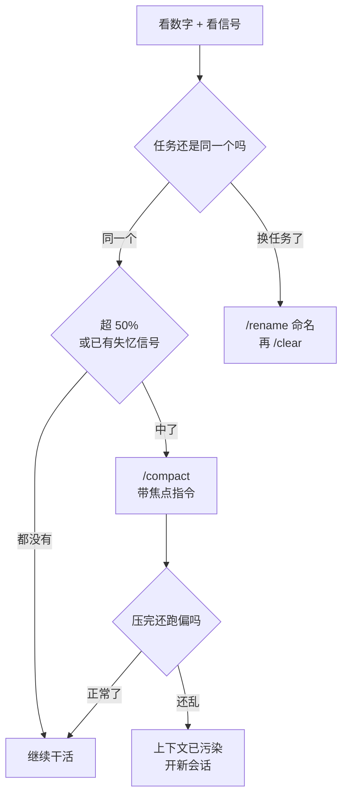

# 012. 上下文窗口要爆了怎么办？

**一句话**：占用过半就主动 `/compact`，任务切了就 `/clear`，产生大量输出的活丢给 SubAgent。别等 auto-compact —— 官方不公布触发点，只说「接近上限时」，等它动手你的工作现场已经保不住了。

## 30 秒结论

| 你看到的 | 立刻做 | 不想再犯 |
|---|---|---|
| `/context` 超 50%，或出现下面任一个失忆信号 | `/compact` 带焦点指令 | 大输出的活丢给 SubAgent |
| 刚切到一个不相关的任务 | 先 `/rename`，再 `/clear` | 任务边界养成 clear 习惯 |
| auto-compact 已经触发 | 压完立刻核对关键信息还在不在 | 阈值调到 65 |
| 长任务反复爆窗口 | 写进度文件 + git commit | 拆任务，用笔记交接 |



## 怎么做

### 第 1 步：看清状态

两个维度，看数字，也看信号。数字是滞后指标，信号先到。

**看数字**：跑 `/context`。它用彩色网格展示上下文被什么占满了 —— 系统提示、工具、CLAUDE.md、对话历史各占多少，并给出优化建议。`/context all` 展开全部分项。

**看信号**：出现下面任意一条，不管百分比是多少，都该压了。

| 失忆信号 | 说明它已经丢了什么 |
|---|---|
| 重复问你已经答过的问题 | 早期对话被稀释，最早出现的信号 |
| 「重新发现」你早就否决过的方案 | 决策记录没了 |
| 引用的文件路径或函数名是会话早期的旧版本 | 硬信号 —— 它读的是旧信息，不是当前状态 |
| 同一个 bug 修了 3 次，每次换个方向 | 不记得前两次试过什么 |
| 回答从「改这行」退化成「你可以考虑」 | 具体细节丢了，只剩泛化建议 |

第 3 条最硬 —— 它明确说明模型手里的信息版本已经过期。碰到就别犹豫。

<details>
<summary>不想反复敲 /context：配一行 statusline</summary>

写进 `~/.claude/settings.json`：

```json
{
  "statusLine": {
    "type": "command",
    "command": "jq -r '\"[\\(.model.display_name)] \\(.context_window.used_percentage // 0)% context\"'"
  }
}
```

**怎么确认生效**：重启后底部出现类似 `[Opus 4.8] 8% context` 的一行。没出现就先查 `jq --version`。字段名是 `context_window.used_percentage`，会话刚开始时可能是 `null`，所以用 `// 0` 兜底。

</details>

### 第 2 步：按症状选动作

**超 50%，或中了任一失忆信号 → `/compact` 带焦点指令。**

阈值别死记百分比。Claude Code 团队成员公开建议主动 compact 在 50–60%，但**百分比是个会骗人的度量** —— 同样从 70% 压到 30%，1M 窗口一次丢掉 40 万 token，200K 窗口只丢 8 万。窗口越大，同一个百分比对应的损失越惨。

实用换算：**200K 窗口按 50% 走；1M 窗口盯绝对量，累积到 10 万 token 左右就压**（相当于 10%）。

裸 `/compact` 用默认摘要逻辑，带焦点指令能指定优先保留什么：

```
/compact focus on the database schema decisions and the failing test cases
```

也可以把偏好写进 CLAUDE.md，之后每次自动生效：

```markdown
# Compact instructions

When you are using compact, please focus on test output and code changes
```

**切到不相关的任务 → 先 `/rename <名字>`，再 `/clear`。**

`/rename` 给**当前**会话起名，之后 `/resume <名字>` 或 `claude --resume <名字>` 随时能回来。`/clear <名字>` 方向相反 —— 它命名的是你正要丢下的那个旧会话。两种写法都能留记号，`/rename` 更直观。手动设的名字能跨 `/clear` 保留，AI 自动生成的标题不能。

不 clear 的代价：过期上下文在后续每条消息上都要重新计费一遍。

**auto-compact 已经触发 → 压完立刻核对。**

先确认关键信息（当前任务目标、改到一半的文件、待办）还在不在。不在就从 git diff 和进度文件补回来。想让它别在半路触发，见下面的阈值调优。

### 第 3 步：防复发

1. **大输出操作丢给 SubAgent。** 跑测试、读日志、爬文档，这些输出会全进主上下文。SubAgent 在独立窗口里跑，只回传摘要，而且它的 transcript 存在单独文件里，主对话 compact 时不受影响。

   ```
   Use a subagent to run the test suite and report only the failing tests with their error messages
   ```

2. **探索用 Plan mode。** 连按两次 `Shift+Tab`，探索工作交给内置的 Plan SubAgent，大量探索输出留在它那边。

3. **关掉不用的 MCP server。** `/mcp` 看谁在占位。优先用 `gh`、`aws` 这类命令行工具 —— 它们不占工具清单的空间。注意新版默认开了 tool search，MCP 的实际占用往往比想象中小，先用 `/context all` 量再决定关谁，判据见 [#006 装了一堆 MCP 之后卡顿、上下文被吃掉，到底该留哪些？](../01-心智与工具/006-MCP装哪些不装哪些.md)。

4. **prompt 写具体。** 「改进这个代码库」会触发大范围扫描；「给 auth.ts 的 login 函数加输入校验」直接定位。

5. **把余量喂给模型自己。** 上面几条靠你盯着 statusline，模型自己是看不到用量的。让 statusline 把数字落到一个临时文件，再用 hook 读回来注入 —— 配置见下面的折叠块。

<details>
<summary>进阶：让 AI 自己知道快没上下文了（statusline 落盘 + hook 回灌）</summary>

模型看不到 statusline，statusline 看得到用量。所以链路是：**statusline 每次刷新把用量写进一个临时 JSON → PostToolUse hook 读这个文件 → 用 `hookSpecificOutput.additionalContext` 把余量和该做的动作作为 system reminder 注入模型上下文**[^5]。

两档阈值，口径跟本文前面完全一致，都换算成绝对 token：

| 已用 token | 注入什么 | 期望它做什么 |
|---|---|---|
| ≥ 100000 | 一档提醒 | 手上这件事收尾，别开新任务 |
| ≥ 130000 | 二档告警 | 立刻写进度文件 + commit，提示用户 `/compact` |

10 万 = 200K 窗口的 50%，也正好是本文对 1M 窗口给的「累积 10 万 token 就压」，两条口径在绝对量上重合，所以一档统一写 100000。13 万 = 下面那个进阶块（给 auto-compact 加一道保险）里 `200000 × 65%` 的兜底触发点 —— 到这里再不存盘，就等着 auto-compact 替你决定丢什么。

**第 1 步：statusline 顺手落盘。** 把 `~/.claude/statusline.sh` 写成：

```bash
#!/usr/bin/env bash
input=$(cat)
# 落盘失败绝不影响状态栏显示
{ printf '%s' "$input" | jq -c '{used: (.context_window.total_input_tokens // 0)}' \
    > "/tmp/cc-ctx-$(printf '%s' "$input" | jq -r '.session_id').json"; } 2>/dev/null
printf '%s' "$input" | jq -r '"[\(.model.display_name)] \(.context_window.used_percentage // 0)% context"'
```

settings.json 里把 `statusLine.command` 指向它（替换掉前面那行内联 jq）。`total_input_tokens` 是最近一次 API 响应里当前窗口内的输入 token，含缓存读写。

**第 2 步：PostToolUse hook 读回来。** `~/.claude/hooks/ctx-warn.sh`：

```bash
#!/usr/bin/env bash
{
  input=$(cat)
  sid=$(printf '%s' "$input" | jq -r '.session_id // empty')
  f="/tmp/cc-ctx-$sid.json"
  [ -n "$sid" ] && [ -r "$f" ] || exit 0
  used=$(jq -r '.used // 0' "$f")
  level=0
  [ "$used" -ge 100000 ] && level=1
  [ "$used" -ge 130000 ] && level=2
  [ "$level" -eq 0 ] && exit 0

  # 去抖：同一档只说一次，避免每次工具调用都刷屏
  seen_file="/tmp/cc-ctx-$sid.level"
  seen=$(cat "$seen_file" 2>/dev/null || echo 0)
  [ "$level" -le "$seen" ] && exit 0
  printf '%s' "$level" > "$seen_file"

  if [ "$level" = 1 ]; then
    msg="上下文已用 ${used} token（200K 窗口的一半）。把手上这件事收尾，不要开新任务，接下来只做必要的读写。"
  else
    msg="上下文已用 ${used} token，已进兜底压缩区。立刻把现场写进 .claude-stash.md 并 git commit，然后提示用户 /compact。"
  fi
  jq -cn --arg m "$msg" \
    '{hookSpecificOutput:{hookEventName:"PostToolUse",additionalContext:$m}}'
} 2>/dev/null
exit 0   # 监控坏了绝不阻塞主流程
```

`chmod +x` 两个脚本，然后注册（`~/.claude/settings.json`）：

```json
{
  "hooks": {
    "PostToolUse": [
      {
        "matcher": "Edit|Write|Bash",
        "hooks": [{ "type": "command", "command": "$HOME/.claude/hooks/ctx-warn.sh" }]
      }
    ]
  }
}
```

只挂在会真正推进工作的三个工具上，Read/Grep 这类高频调用不挂，进一步减少触发次数。

**怎么确认生效**：

1. 干一轮活后跑 `ls -l /tmp/cc-ctx-*.json`，有文件且时间戳是新的 —— 说明 statusline 在落盘。
2. 手动把 used 改高造一次告警：`echo '{"used":140000}' > /tmp/cc-ctx-<你的 session_id>.json`，然后让 Claude 做一次 Edit。它下一轮应该主动说要存盘 —— 这就是 `additionalContext` 到位了。测完删掉 `/tmp/cc-ctx-<sid>.level` 重置去抖状态。
3. 验证不阻塞：把脚本里的 `jq` 改成一个不存在的命令，再做一次 Edit，会话应照常继续（PostToolUse 本来就无法阻断，工具已经跑完了）。

**两个已知限制**：statusline 是事件驱动刷新的，模型拿到的数字可能滞后一轮，当告警线用够了，当精确读数不行；`/tmp` 文件按 session_id 区分，多开会话不会串，但要自己定期清。

</details>

<details>
<summary>进阶：给 auto-compact 加一道保险（调低触发阈值）</summary>

先说清楚：**这是兜底，不是替代主动 compact。** 它管的是你忘了手动压的情况。设太低会在你正常工作时打断你，65–70 之间比较合适。

三个可调项：

| 变量 | 作用 | 取值 |
|---|---|---|
| `CLAUDE_AUTOCOMPACT_PCT_OVERRIDE` | 触发压缩的百分比。**只能调低**，设得比默认高无效 | 1–100 |
| `CLAUDE_CODE_AUTO_COMPACT_WINDOW` | 用来算阈值的窗口容量（token 数），上限是模型真实窗口 | 如 `500000` |
| `DISABLE_AUTO_COMPACT` | 完全关闭自动压缩（等价于 settings.json 的 `autoCompactEnabled: false`） | `1` |

**坑**：`CLAUDE_AUTOCOMPACT_PCT_OVERRIDE` 单独设不一定生效 —— 它只在「Claude Code 主动压缩」的场景下才提前触发（设了 `AUTO_COMPACT_WINDOW` 时、云端会话、未开扩展上下文的 Sonnet 4.6/Opus 4.6）。本地 Opus 4.8 单设百分比没效果。**稳妥写法是两个一起设。**

选一个文件写：

| 文件 | 作用范围 |
|---|---|
| `~/.claude/settings.json` | 你本人，所有项目 |
| `<项目>/.claude/settings.json` | 项目全员，进版本库 |
| `<项目>/.claude/settings.local.json` | 你本人，仅本项目，被 gitignore |

内容（1M 模型上按 500K 窗口的 65% 触发）：

```json
{
  "env": {
    "CLAUDE_CODE_AUTO_COMPACT_WINDOW": "500000",
    "CLAUDE_AUTOCOMPACT_PCT_OVERRIDE": "65"
  }
}
```

200K 模型就把窗口写 `"200000"`，实际触发点 = 200000 × 65% = 130K。

**怎么确认生效**：

1. 重启 Claude Code。环境变量只在启动时读一次。
2. 会话里跑 `echo $CLAUDE_AUTOCOMPACT_PCT_OVERRIDE`，预期输出 `65`。空行说明 JSON 没加载 —— 用 `cat ~/.claude/settings.json | jq .` 查语法。
3. 跑 `/context` 看容量警告行。注意 statusline 的百分比永远按模型完整窗口算，和你设的阈值口径不一样（500K×65% 相当于 1M 窗口的 32%），别以为没生效。

</details>

<details>
<summary>进阶：compact 前用一个 skill 暂存现场</summary>

Claude Code 没有原生 `/stash`。社区做法是用文件暂存，最省事的是封装成 skill。存成 `~/.claude/skills/save/SKILL.md`：

```markdown
---
name: save
description: 上下文快满、准备 /compact 或 /clear 前，把当前工作现场落盘到文件。当用户说"save""存一下""要爆了"时使用。
---

把当前现场写入 `./.claude-stash.md`，覆盖旧内容。必须包含这五项：

1. 正在做什么：一句话任务目标
2. 已完成：改了哪些文件，每个文件一句话说明改了什么
3. 下一步：具体到"打开哪个文件、做什么动作"
4. 关键路径与命令：本次涉及的文件绝对路径、跑过的验证命令
5. 已知坑：踩过的错和结论，避免下次重复

写完把文件路径打印出来，并提醒用户可以 /compact 了。
```

恢复端再写一个 `restore` skill：读 `.claude-stash.md`，复述五项跟我对齐，等确认再动手。

**怎么确认生效**：跑 `/context`，skill 分项里能看到 `save`；或直接说"save 一下"，`ls -l .claude-stash.md` 看到新时间戳。记得把 `.claude-stash.md` 加进 `.gitignore`。

</details>

## 为什么

### 塞得越满，质量越差

上下文不是「填满才出问题」。每多一个 token，所有信息的被回忆概率都在下降 —— 这个现象叫 context rot（上下文腐烂）[^1]。原因是注意力预算：Transformer 的注意力开销和 token 数量成平方关系，上下文越长，每个 token 分到的注意力越稀薄。

学界更早就有实证：模型对位于上下文**中间**的信息回忆明显变差，论文管这叫 lost in the middle，专为长上下文设计的模型也一样[^2]。

所以窗口更大不等于不用管。1M token 塞满照样衰减，它只是给了你更多缓冲。

<details>
<summary>另外四种「远没满就失效」的情况</summary>

社区研究者 Drew Breunig 总结的四种失效模式[^3]，它们都在窗口远未填满时就发生：

- **Context Poisoning**：幻觉内容混进上下文，之后一直被当真
- **Context Distraction**：信息过载，模型抓不住重点
- **Context Confusion**：无关上下文造成干扰
- **Context Clash**：上下文内部自相矛盾

对应处置：poisoning 和 clash 只能 clear 或开新会话，compact 救不了 —— 压一个已经错的对话，只会得到更浓缩的错误。

</details>

### compact 是有损的，而且丢什么有规律

`/compact` 把对话替换成结构化摘要，完整工具输出和中间推理都没了[^4]。哪些能活下来是有明确规则的：

| 机制 | compact 之后 |
|---|---|
| 系统提示、output style | 不变（本就不在消息历史里） |
| 项目根 CLAUDE.md、无 `paths:` 的规则 | 从磁盘重新注入 |
| auto memory（MEMORY.md） | 从磁盘重新注入 |
| 带 `paths:` frontmatter 的规则 | **丢失**，直到再次读到匹配文件 |
| 子目录里嵌套的 CLAUDE.md | **丢失**，直到再次读到该目录下的文件 |
| 已调用的 skill 正文 | 重新注入，每个上限 5000 token、总额 25000 token，超了先丢最旧的 |
| hooks | 不受影响（hook 是代码，不占上下文） |

**能直接照做的推论**：如果某条规则必须扛过 compact，就删掉它的 `paths:` frontmatter，或者挪进项目根 CLAUDE.md。skill 同理 —— 重要指令写在 `SKILL.md` 最前面，因为截断是从后往前砍的。

### auto-compact 默认压得太晚

官方文档只写「接近上限时自动压缩」，**不公布统一百分比**。已知的分档：

| 场景 | 默认什么时候压 | 这个数有多硬 |
|---|---|---|
| Sonnet 5（默认 1M） | 约 967K token（约 97%） | model-config 有写 |
| 本地会话 Opus 4.8 | 到模型上下文上限才压 | model-config 有写 |
| 200K 模型 | 社区实测约 83.5%（167K），留 34K 给回复生成 | ⚠️ 社区数据，未见官方确证 |
| 设了 `CLAUDE_CODE_AUTO_COMPACT_WINDOW` / 云端会话 | 按你设的窗口 × 百分比 | 你说了算 |

具体是 83% 还是 97% 不重要，方向一致：**默认触发点都远在质量滑坡之后。**

而质量什么时候开始滑？没有官方数字，社区经验普遍指向 50% 前后。所以：

- **auto-compact 是安全网，不是质量保障。** 别指望它。
- **主动压才是正常操作。** 看到失忆信号或过半就动手。
- 想给安全网加一道保险，可以把阈值调低（见上面的进阶折叠块），但那只是兜底，不替代主动压。

> 个人观点（小C）：对大多数人，默认动作应该是 compact 而不是 clear。只有当你感觉上下文已被污染（Claude 开始重复或跑偏）时才 clear。盲目 clear 会丢掉你还需要的东西。

## 别这么干

- ❌ **把上下文当无限垃圾桶。** 塞得越多质量越降，1M 窗口填满照样衰减。
- ❌ **只等 auto-compact。** 默认触发点远在质量滑坡之后。等它动手时，你的活可能已经干到一半崩了。
- ❌ **只盯百分比，不看信号。** 数字是滞后指标。它重复问你答过的问题、引用早就改掉的函数名时，不管 `/context` 显示多少都该压了。
- ❌ **把 compact 当无损操作。** 完整工具输出、带 `paths:` 的规则、嵌套 CLAUDE.md 都会没。压之前先暂存关键信息。
- ❌ **指望 compact 救一个已经混乱的对话。** 压垃圾只会得到更浓缩的垃圾。上下文被污染就 clear 或开新会话。
- ❌ **长任务只靠上下文，不做笔记交接。** 窗口填满只是时间问题。不写进度文件、不 commit，新会话就要从头猜之前干了什么。

<details>
<summary>换成 Cursor / Copilot 呢</summary>

| 维度 | Claude Code | Cursor | GitHub Copilot |
|---|---|---|---|
| 显式 `/compact` | ✅ 支持焦点指令 | ⚠️ 无官方命令，社区称约 100% 时自动摘要 | ✅ CLI 支持手动触发，无焦点参数 |
| 显式 `/clear` | ✅ 旧会话归档到 `/resume` | ❌ 只能开新 chat | ❌ 官方建议开新 chat |
| auto-compact | ✅ 按模型定，阈值可调低 | ✅ 社区报告约 100%（非官方证实） | ✅ CLI 在约 80% 触发，留 20% 缓冲 |
| 上下文隔离 | ⭐ SubAgent 独立窗口 + 独立系统提示 | ⚠️ 有多 tab，无 subagent 模型 | ⚠️ 无文档化的隔离特性 |
| 上下文可视化 | ⭐ `/context` 彩色网格 + 建议 | 填充百分比指示器 | 控制条 + `/context` |
| 更大窗口 | 200K 默认，`[1m]` 激活 1M | Max Mode | 可配置，最高 1M |
| 压缩检查点 | SubAgent transcript 独立持久化 | 无 | ⭐ `/session checkpoints`，每次压缩存带编号的摘要可回看 |

三点观察：

- Claude Code 的差异化优势是 SubAgent 隔离 —— 它把上下文隔离做成了一等公民的产品特性。
- Copilot 给统一的 80% 阈值，简单好记；Claude Code 给按模型分档的绝对 token 数，更精确但要自己换算。
- Cursor 偏向撑大窗口而非精细管理，没有 subagent 隔离，压缩机制几乎全靠社区报告。

</details>

<details>
<summary>1M 上下文窗口怎么开（清单易变，别背）</summary>

在 `/model` 后加 `[1m]` 激活，比如 `/model opus[1m]`。

**查当前清单的正确姿势**：跑 `/model` 看选择器里哪些条目带 `[1m]`，比记文章里的型号列表可靠。截至 2026-08，官方列出 Fable 5、Sonnet 5、Opus 4.6 及以后、Sonnet 4.6 支持 1M。

Sonnet 5 是例外：在 Anthropic API 上永远跑 1M，没有 200K 变体也没有 `[1m]` 后缀，且不消耗额外用量额度。

两个相关的坑：走 LLM 网关（设了 `ANTHROPIC_BASE_URL`）时，Claude Code 无法确认对端支持 1M，会按 200K 预算并在该边界压缩，要用满得在选择器里显式选 "Sonnet 5 (1M context)"；设了 `CLAUDE_CODE_DISABLE_1M_CONTEXT=1` 也会被按 200K 处理。

</details>

## 延伸

**相关文章**

- [#010 CLAUDE.md 怎么写才真的生效？](./010-CLAUDE-md怎么写才生效.md) —— CLAUDE.md 在 compact 后会重新注入，根目录文件最稳
- [#011 Context Engineering 和 Prompt Engineering 到底什么区别？](./011-上下文工程与提示词工程.md) —— 上下文管理的理论框架
- [#013 哪些决策必须写进 memory 才扛得住 compact](./013-哪些决策要写进memory.md) —— 记忆膨胀与 context rot 同源
- [#033 Skill 和 superpowers 怎么用？](../04-执行工作流/033-Skill与superpowers怎么用.md) —— save skill 的 frontmatter 字段与加载优先级
- [#006 装了一堆 MCP 之后卡顿、上下文被吃掉，到底该留哪些？](../01-心智与工具/006-MCP装哪些不装哪些.md) —— 「关掉不用的 MCP server」那步的完整判据与量化方法

**参考资料**

- [Effective context engineering for AI agents](https://www.anthropic.com/engineering/effective-context-engineering-for-ai-agents) —— context rot、compaction 与 isolate 原理、何时用哪种策略（官方，2025-09）
- [Effective harnesses for long-running agents](https://www.anthropic.com/engineering/effective-harnesses-for-long-running-agents) —— 进度文件 + git commit 的跨窗口交接范式（官方，2025）
- Claude Code Docs：[context-window](https://code.claude.com/docs/en/context-window)、[commands](https://code.claude.com/docs/en/commands)、[costs](https://code.claude.com/docs/en/costs)、[sub-agents](https://code.claude.com/docs/en/sub-agents)、[env-vars](https://code.claude.com/docs/en/env-vars)、[sessions](https://code.claude.com/docs/en/sessions)、[model-config](https://code.claude.com/docs/en/model-config)、[statusline](https://code.claude.com/docs/en/statusline)、[hooks](https://code.claude.com/docs/en/hooks) —— 命令、SubAgent、阈值变量、statusline 字段、hook 输入输出字段（官方，2026-08 核实）
- [How we built our multi-agent research system](https://www.anthropic.com/engineering/multi-agent-research-system) —— SubAgent 隔离与并行压缩原理（官方）
- [Context Engineering for Agents — LangChain](https://www.langchain.com/blog/context-engineering-for-agents) —— write/select/compress/isolate 四分法（社区权威，2025-07）。注：文中「约 95% 触发 auto-compact」是 2025 年观测值，与 2026-08 官方口径不一致，本篇不采用
- [Context Rot — Chroma Research](https://www.trychroma.com/research/context-rot) —— 性能下降源于上下文长度而非任务难度（研究，2025）
- [Copilot CLI Context Management](https://docs.github.com/en/copilot/concepts/agents/copilot-cli/context-management) / [Cursor Docs: Max Mode](https://docs.cursor.com/context/max-mode) —— 横向对比的依据（官方）
- [What Does /compact Do in Claude Code](https://www.howdoiuseai.com/blog/2026-04-16-what-does-compact-do-in-claude-code-context-management) —— Claude Code 团队成员建议主动 compact 在 50–60%（社区转述，2026-04）
- [CLAUDE_AUTOCOMPACT_PCT_OVERRIDE Guide — TurboAI](https://www.turboai.dev/blog/claude-autocompact-pct-override-guide) —— 200K 窗口约 83.5% 触发、`Math.min` 钳制导致只能调低（社区实测，未见官方确证）
- Claude Code Issues [#23711](https://github.com/anthropics/claude-code/issues/23711) / [#28728](https://github.com/anthropics/claude-code/issues/28728) —— 社区要求可配置压缩阈值、要求提前触发的讨论

[^1]: [Effective context engineering for AI agents — Anthropic](https://www.anthropic.com/engineering/effective-context-engineering-for-ai-agents)（官方，2025-09）：上下文必须被当作边际收益递减的有限资源。
[^2]: [Lost in the Middle — arXiv:2307.03172](https://arxiv.org/abs/2307.03172)（学术，2023-07，TACL 2024 发表）。
[^3]: [How Contexts Fail — Drew Breunig](https://www.dbreunig.com/2025/06/22/how-contexts-fail-and-how-to-fix-them.html)（社区，2025-06），后被 LangChain 转载。
[^4]: [Claude Code Docs: Explore the context window](https://code.claude.com/docs/en/context-window)（官方，2026-08 核实）：压缩用结构化摘要替换逐字对话。
[^5]: [Claude Code Docs: Hooks reference](https://code.claude.com/docs/en/hooks)（官方，2026-08-04 核实）：PostToolUse 支持 `hookSpecificOutput.additionalContext`，内容以 system reminder 形式插入到工具结果旁；PostToolUse 无法阻断（工具已执行）。

---

<sub>难度 中级 · 排错题 · 主线 Claude Code，横向 Cursor / Copilot</sub>

<sub>**时效**：窗口与机制事实（200K 默认、1M 支持列表与 `[1m]` 激活、compact 保留规则、skill 重注入预算、环境变量与 statusline 字段名、PostToolUse 的 `hookSpecificOutput.additionalContext` 与 `context_window.total_input_tokens`）已于 2026-08-04 逐项核实。**已知不确定**：auto-compact 的默认触发百分比官方不公布，200K 的 83.5% 是社区实测值。**易变**：支持 1M 的模型清单、Sonnet 5 的 967K 压缩点，随模型迭代变化，用前回查 model-config。</sub>

> 本篇个人实践（L4）：`[待补：BOSS 的实战经验——你在 Claude Code 里哪次上下文爆掉/compact 丢关键信息/靠 SubAgent 救场的踩坑案例]`
