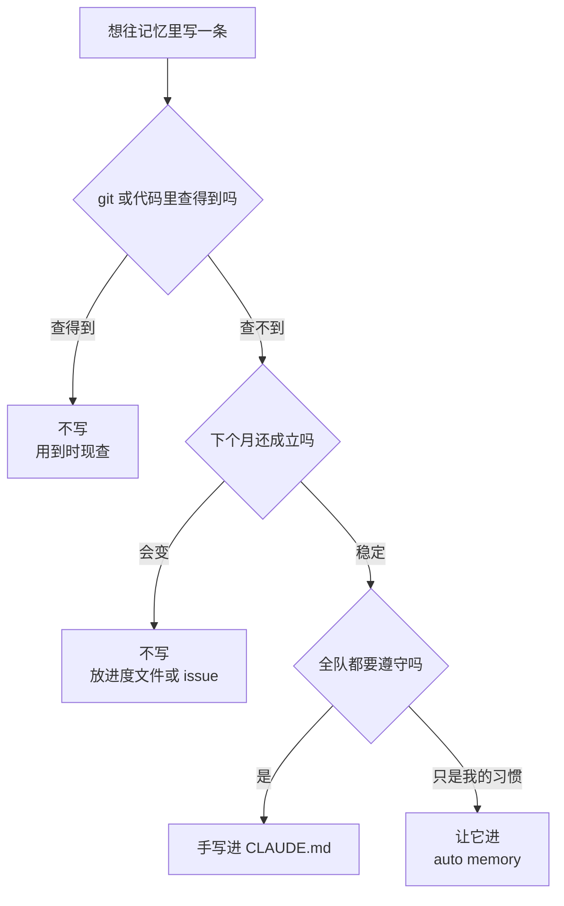

# 013. 压缩一次它就忘了刚定的方案——哪些决策必须写进 memory 才扛得住 compact

**一句话**：只有「git 和代码里查不到、下个月还成立、你已经纠正过第二遍」的东西才值得写进记忆 —— 全队要遵守的手写进 `CLAUDE.md`，个人踩坑经验交给 auto memory，其余一律不写，写了也活不长。

## 30 秒结论

| 你看到的 | 立刻做 | 不想再犯 |
|---|---|---|
| 压缩一次，刚定的方案就没了 | 把方案里「跨会话仍成立」的部分写进 `CLAUDE.md`，其余写进度文件 | 定完方案先落盘再继续干 |
| 你第二次敲下和上次一样的纠正 | 这就是官方给的信号，把它写进记忆 | 纠正超过一次就落成规则 |
| `MEMORY.md` 超过 200 行或 25KB | 立刻精简 —— 超出部分根本不加载 | 每月跑一次 `/memory` 逐条清 |
| 它自信地引用了不存在的目录/命令 | 打开记忆文件删掉这条死指令 | 每条记忆写的时候顺手加失效条件 |
| 不确定某条记忆有没有被加载 | 跑 `/context` 看实际加载清单，别看 `/memory` | 排查加载问题一律只认 `/context` |

一条内容该不该写、写去哪，按这张图判：



**`git` 或代码里查得到的一律不写**；查不到、下个月还成立、全队要遵守的，才手写进 `CLAUDE.md`。

## 怎么做

每次想往记忆里写东西之前（或让 Claude 写之前），先过一遍下面这两张清单。

### 该记的 4 类

1. **反复纠正过的偏好。** 「用 pnpm 不用 npm」「金额用分不用浮点」「commit message 用中文」。官方给的判据很硬：**当你第二次把同一句纠正敲进对话，就该写进去**[^1]。
2. **只能靠踩坑学到的隐性知识。** 某测试需要本地 Redis、某次构建必须带 `--force`、某目录是自动生成的不能手改。判据是：**这条读代码看不出来** —— 你能 `grep` 出来的就不算。
3. **跨会话的协作约定。** code review 反复抓到的问题、新人 onboarding 必须知道的协作方式、外部系统的入口（生产环境 URL、关键文档位置）。
4. **指向外部资源的指针，而不是内容本身。** 写「架构详见 @docs/architecture.md」，不要把整份架构文档复制进来。注意：`@` import 进来的文件启动时仍会全量加载，**并不省 token**[^5]；真正省的是「只写路径、需要时才让它去读」。

### 不该记的 5 类

1. **git 或代码里能查到的状态。** 「当前在 feature/auth 分支」「package.json 里 React 是 18.2」「测试在 src/__tests__/」—— `git log` 或 `grep` 一秒就有，写进记忆只会过时。
2. **一次性的任务计划或待办。** 「正在重构 auth 模块，第 3 步做完了」——计划变得比记忆快，这类信息放 issue tracker 或进度文件（见 [#012 上下文窗口要爆了怎么办](./012-上下文窗口要爆了.md)）。
3. **读代码就能推断的显性信息。** 函数的明显用途、已经显式写在配置里的命名规范。
4. **正在变化的代码的观察。** 「这个函数现在是这样写的」。判据不用凭感觉：`git log -- <文件>` 看它最近三个月改过几次，改过就别写进记忆。
5. **通用编程常识。** 「TypeScript 是静态类型」「React 用 JSX」——Claude 本来就知道，记忆只该装本项目独有的东西。

### 维护闭环：3 个习惯

1. **每月跑一次 `/memory` 逐条审。** 判据是可执行的，不靠感觉：命令跑不通、路径 `ls` 不存在、依赖版本已经不是那个了 —— 三条中任意一条成立就删。官方还提供了 `/doctor` 自动体检（v2.1.206+）：它会对已入库的 CLAUDE.md 提议精简，砍掉能从代码库推断的目录结构、依赖清单、架构概览，保留「和工具默认行为不同」的坑、原因和约定，相当于本篇这两张清单的机器版。
2. **重复出现的条目升舱成规则。** auto memory 里同一条反复出现，说明它该被手写进 `CLAUDE.md` 变成硬规则。社区有个 `/remember` 命令专门做这件事：识别反复出现的模式并提议加进 `CLAUDE.local.md`。
3. **每条记忆都带一个失效条件。** 写的时候顺手加一句「本条在 X 之后失效」，比如「用 Redis 5.x；升级到 6.x 后本条作废」。这样下次审计时不用重新判断，一眼就知道哪条该清。

### 排查：`/memory` 和 `/context` 别用混

- `/memory` 跨 user / project 作用域列出各记忆文件的**位置**，可以切换 auto memory 开关、打开 auto memory 文件夹、选中文件直接编辑。它只告诉你「有哪些文件」。
- `/context` 告诉你**本会话实际加载进上下文的是哪些文件**。某个文件不在 `/context` 明细里，Claude 就看不到它。

所以「我明明写了它却不听」这类问题，第一步永远是 `/context`，不是 `/memory`。

<details>
<summary>auto memory 的目录结构、开关，以及一份合格的 MEMORY.md 索引</summary>

```
~/.claude/projects/<project>/memory/
├── MEMORY.md          # 索引，每次启动加载前 200 行
├── debugging.md       # 主题文件，用到时才读
├── api-conventions.md
└── ...
```

`<project>` 由 git repo 根目录派生，同一仓库下所有 worktree 和子目录共享一个 memory 目录。auto memory 是本机本地的，不跨机器，也不进 git。

默认开启。想关掉：settings.json 里设 `autoMemoryEnabled: false`，或设环境变量 `CLAUDE_CODE_DISABLE_AUTO_MEMORY=1`。

一份合格的索引（不到 20 行）：

```markdown
## Build & Env
- 集成测试需本地 Redis（端口 6379），否则 test:integration 挂
- 必须用 pnpm，npm install 会破坏 lockfile

## Conventions（踩坑所得）
- 金额一律用分（整数），禁止浮点 —— [2026-06 发现的精度 bug]
- 提交前必须跑 npm run lint && npm test

## 外部指针
- 架构决策详见 @docs/adr/
- 生产环境配置在 1Password vault "payments-prod"
```

注意看：全是非显性的、踩坑才懂的、本项目独有的条目，没有一条能从 `git log` 或 `package.json` 查到。

**subagent 也能有自己的 auto memory**，作用域独立 —— 可以给专职跑测试的子 agent 单独一份记忆，不污染主会话。社区抓包还发现自定义 agent 有 project / local / user 三个 memory 作用域，其中 project 作用域的 `.claude/agent-memory/` 可以提交进 git 全队共享。

</details>

## 为什么

### 两套记忆系统，分工不同，代价也不同

Claude Code 有两套记忆，都在每次会话开始时加载：

|  | CLAUDE.md 文件 | Auto memory（`MEMORY.md`） |
| --- | --- | --- |
| **谁写** | 你 | Claude 自己 |
| **装什么** | 指令和规则 | 学到的模式和教训 |
| **作用域** | project / user / org | per-repo（同 repo 的 worktrees 共享） |
| **加载量** | 全量加载（官方建议每文件 <200 行） | **前 200 行或 25KB**，超出不加载 |
| **用途** | 编码规范、工作流、架构 | 构建命令、调试洞察、Claude 发现的偏好 |

关键设计是「索引常驻、细节按需」：`MEMORY.md` 只是一个索引，详细内容拆到 `debugging.md`、`api-conventions.md` 等主题文件里，这些主题文件启动时不加载，Claude 需要时才用文件工具去读[^2]。

### 它是「上下文」，不是「学习」

社区反复强调的一个认知纠偏：auto memory 不是 Claude 在学习，而是 Claude 在替你做配置。有人用了几周 auto memory 后打开文件，发现在一个有 13 个项目、40 多个 skill 的工作区里，Claude 只记了 12 行，而且全是「文件名要带 Claude 实例名」这类操作性配置。他的结论是：那次命名冲突里 Claude 什么都没「学到」，真正发生的只是自动化配置 —— 本质上仍然是在训练它适应这个特定工作区[^3]。

官方口径一致：两套记忆都是作为 context 注入的，不是强制生效的配置。Claude 会读、会尽量遵守，但没有「保证严格执行」这回事，指令越模糊或越矛盾，遵守率越低。

> 个人观点（小C）：你写进记忆的每一条，本质上都是「每次会话都白送给 Claude 读一遍」的上下文。写得越多，留给真正任务的空间就越少，而且每一条都在稀释其他指令的注意力。

### 膨胀、过时、沉默失效，三种代价都是真的

- **膨胀**：`MEMORY.md` 超过 200 行，超出部分直接不加载，Claude 只看得到前 200 行并收到一条警告 —— 有人抓包在源码里确认了这个硬上限（`var U_ = "MEMORY.md", pZ = 200`）。CLAUDE.md 侧官方也说超长会消耗更多上下文、降低遵守率。
- **过时**：上下文太多要么膨胀、要么很快陈旧。不清理的记忆会让 Claude 自信地引用已经失效的命令、已经重构掉的目录，而且这种错很难查 —— 文件本身看起来是对的，只是过期了。
- **沉默失效**：有人花几个月搭了一套 learning-moment 系统，因为没有接进 `MEMORY.md`，新会话根本不知道这些教训存在。两套记忆系统之间不会自动打通[^3]。

<details>
<summary>该记 / 不该记的判据从哪来：三层分工与四条筛选标准</summary>

`CLAUDE.md`、auto memory、按需检索三者的分工，在官方和多个社区来源里高度一致：

| 维度 | `CLAUDE.md`（手写指令） | Auto memory（Claude 自写） | 检索 / RAG（按需读取文件） |
|------|----------------------|--------------------------|----------------------------|
| **谁控制** | 你全控 | Claude 判断 | 代码库里已有的事实 |
| **加载时机** | 每次启动全量 | 每次启动前 200 行 | **用到时才加载** |
| **该装** | 「每次都适用」的规则 | 踩坑才懂的非显性模式 | 代码结构、API、文档 |
| **不该装** | 能从代码查的 | 一次性任务状态 | 个人偏好 |

官方对「什么时候该往 CLAUDE.md 里加」给了三个信号，满足任一条才加：Claude 第二次犯同一个错；你在对话里敲下和上次会话一样的纠正或说明；一个新同事也会需要同样的背景[^1]。

社区把 auto memory 的隐式筛选标准总结成四条，**要同时满足**才值得记[^4]：

- **Recurrence（会反复出现）**：只出现过一次的不记。
- **Inferability（读代码推不出来）**：`grep` 得到的不记。
- **Stability（稳定不变）**：`git log` 显示最近频繁改动的不记。
- **Project specificity（本项目独有）**：通用常识不记。

本篇的两张清单就是这四条的展开。

</details>

## 别这么干

- ❌ **把 git 能查的状态写进记忆。** 「当前分支是 X」「依赖版本是 Y」一查就有，写进去只会随时间失效并误导后续会话。状态类信息永远走 git 和代码，不走记忆。
- ❌ **记忆只增不删。** `MEMORY.md` 超过 200 行或 25KB 后超出部分根本不加载，你写的等于白写；过时的命令还会让 Claude 往不存在的目录里写文件。
- ❌ **把一次性计划或待办写进记忆。** 计划变化太快，记忆很快变成化石。用 issue tracker 或进度文件，绝不进 `CLAUDE.md` / `MEMORY.md`。
- ❌ **指望记忆能强制执行。** 记忆是上下文不是配置。要让「提交前必须跑测试」万无一失，写 `PreToolUse` hook。
- ❌ **把 API key、密码、生产密钥写进会被 git 跟踪的记忆。** project 级 `CLAUDE.md` 会进 git，auto memory 虽在本机也容易被误分享。用 `CLAUDE.local.md`（加 `.gitignore`）或 secrets manager。

<details>
<summary>横向对比：Claude Code / Cursor / Copilot 的记忆机制</summary>

| 维度 | Claude Code | Cursor | GitHub Copilot |
|------|------------|--------|----------------|
| **持久规则文件** | `CLAUDE.md`（4 层级）+ `.claude/rules/*.md`（可带 `paths`） | `.cursor/rules/*.mdc`（4 种激活模式，YAML frontmatter） | `.github/copilot-instructions.md`（仓库根单文件） |
| **自动记忆** | ✅ **auto memory**（`MEMORY.md`，Claude 自写，默认开启，前 200 行加载） | ⚠️ "Memories" toggle（需手动开启，不默认记住对话） | ✅ **Copilot Memory**（2025 末公测，2026-03 起 Pro/Pro+ 默认开启，自动学 repo 事实和个人偏好） |
| **记忆透明度** | ⭐ 纯 markdown，`/memory` 可看可改 | MDC 文件可见；memories 可在 Settings 审计 | repo owner 可在 Settings → Copilot → Memory 审查/删除 ⭐ |
| **跨会话共享** | auto memory per-repo 本机本地；project-scope agent memory 可进 git | rules 进 git 共享；memories 偏个人 | 跨会话/跨 repo（Pro 用户） |
| **上下文预算意识** | ⭐ 明确 200 行硬上限 + 「越短遵守率越高」官方建议 | 无文档化的明确上限 | 不透明 |

一句话总结：Claude Code 最透明、最有上下文预算意识（纯 markdown 可审计、200 行硬上限、官方反复强调要短）；GitHub Copilot 最「自动」也最不透明（2026-03-04 起对 Pro/Pro+ 默认开启，记忆限定单 repo、28 天自动过期，可在 Repository Settings → Copilot → Memory 审查删除，但你平时不知道它记了什么）；Cursor 偏手动（rules 成熟，持久记忆要手动开 toggle）。三家都在走向「自动学习 + 可审计」的混合模型，但自动不等于免维护 —— 越自动，越要定期审计。

</details>

## 延伸

**相关文章**

- [#010 CLAUDE.md 怎么写才真的生效？](./010-CLAUDE-md怎么写才生效.md) —— 记忆系统的手写层，写法直接决定遵守率
- [#011 为什么 prompt 写得很细，Claude 还是越跑越偏？](./011-上下文工程与提示词工程.md) —— 记忆是上下文工程的「持久化」子环节
- [#012 上下文窗口要爆了怎么办？](./012-上下文窗口要爆了.md) —— 记忆膨胀与 context rot 是同一枚硬币的两面
- [#014 三份规则文件改一处漏两处怎么办？](./014-多份规则文件怎么同步.md) —— 多工具环境下手写层的真源方案

<details>
<summary>参考资料（10 条）</summary>

- [How Claude remembers your project — Claude Code Docs](https://code.claude.com/docs/en/memory) —— 支撑两套记忆的分工表、`MEMORY.md` 200 行/25KB 上限、目录结构、`/memory` 与 `/context` 的区别、`/doctor` 体检、「记忆是上下文不是配置」（官方，2026-06）
- [Automatic Memory Is Not Learning — Brent W. Peterson](https://medium.com/@brentwpeterson/automatic-memory-is-not-learning-4191f548df4c) —— 支撑「auto memory 是配置不是学习」「12 行实战案例」「两套系统不自动打通」「`/remember` 升舱命令」（社区，2026-02）
- [What Is Claude Code Auto-Memory? — MindStudio](https://www.mindstudio.ai/blog/what-is-claude-code-auto-memory) —— 支撑 recurrence / inferability / stability / specificity 四条筛选标准（社区，2026-03）
- [Claude Code's experimental memory system — Giuseppe Gurgone](https://giuseppegurgone.com/claude-memory) —— 支撑「源码里 200 行硬上限」与「subagent memory 三个作用域」（社区，2026）
- [r/ClaudeCode: claude.md doesn't scale. built a memory agent](https://www.reddit.com/r/ClaudeCode/comments/1qr9dws/claudemd_doesnt_scale_built_a_memory_agent_for/) —— 支撑「上下文太多要么膨胀要么很快陈旧」的社区实证（社区，2025–2026）
- [r/ClaudeCode: What's the point of /memory?](https://www.reddit.com/r/ClaudeCode/comments/1st5p7h/whats_the_point_of_memory/) —— `/memory` 到底有没有用的社区辩论，本篇「两个命令别用混」的问题来源（社区）
- [Claude Code Memory Explained — Jose Parreño Garcia](https://joseparreogarcia.substack.com/p/claude-code-memory-explained) —— 支撑「记忆定义了 Claude 作为协作者的行为」这一整体视角（社区，2026-02）
- [Cursor Forum: Best way to provide context — Rules vs. Memories](https://forum.cursor.com/t/best-way-to-provide-context-rules-vs-memories/132960) —— 横向对比表里 Cursor 一列的依据（社区）
- [Copilot Memory now on by default — GitHub Changelog](https://github.blog/changelog/2026-03-04-copilot-memory-now-on-by-default-for-pro-and-pro-users-in-public-preview/) —— 横向对比表里 Copilot 默认开启时间、28 天过期、审查入口的依据（官方，2026-03）
- [GitHub Community 162797: Enable persistent memory in Copilot](https://github.com/orgs/community/discussions/162797) —— Copilot Memory 透明度讨论（社区）

</details>

[^1]: [Claude Code Docs: When to add to CLAUDE.md](https://code.claude.com/docs/en/memory)（官方，2026-06）：满足以下任一条才加 —— Claude 第二次犯同一个错；你敲下和上次会话相同的纠正；一个新同事也会需要同样的背景。
[^2]: [Claude Code Docs: How Claude remembers your project](https://code.claude.com/docs/en/memory)（官方，2026-06）：`MEMORY.md` 每次只加载前 200 行或 25KB，超出不加载；主题文件启动时不加载，需要时才由文件工具读取。
[^3]: [Automatic Memory Is Not Learning — Brent W. Peterson](https://medium.com/@brentwpeterson/automatic-memory-is-not-learning-4191f548df4c)（社区，2026-02）：auto memory 记下的是操作性配置而非习得知识；未接入 `MEMORY.md` 的自建教训系统对新会话完全不可见。
[^4]: [What Is Claude Code Auto-Memory? — MindStudio](https://www.mindstudio.ai/blog/what-is-claude-code-auto-memory)（社区，2026-03）：值得记的条目需同时满足会反复出现、读代码推不出来、稳定不变、本项目独有四条。
[^5]: [Claude Code Docs: Import additional files](https://code.claude.com/docs/en/memory)（官方，2026-08 核实）：imported 文件在启动时展开并随所引用的 CLAUDE.md 一并载入上下文；拆成 `@path` import 只利于组织，不减少上下文占用。

---

<sub>难度 中级 · 流程题 · 主线 Claude Code，横向 Cursor / Copilot</sub>

<sub>**时效**：`MEMORY.md` 前 200 行或 25KB 的加载上限、CLAUDE.md <200 行建议、`@` import 启动时全量加载、auto memory 目录结构与开关（`autoMemoryEnabled` / `CLAUDE_CODE_DISABLE_AUTO_MEMORY=1`）、`/doctor` 体检（v2.1.206+）、`CLAUDE.local.md` 仍为官方现行方案（跨 worktree 时官方建议改用 `@~/` import）、`/memory` 与 `/context` 分工，已于 2026-08-15 对照官方 memory 文档核实；Copilot Memory 默认开启日期与 28 天过期策略同日对照 GitHub Changelog 核实。**已知不确定**：源码里 `pZ = 200` 的硬上限出自社区抓包，未见官方确证；四条筛选标准（recurrence / inferability / stability / specificity）是社区总结，非官方术语。**易变**：`/doctor` 依赖的版本号、Copilot Memory 的默认开启范围与过期策略，随版本迭代，用前回查各家官方文档。</sub>

> 本篇个人实践（L4）：`[待补：BOSS 的实战经验——你往 memory 里写过什么后来发现该删/该留的条目，或 auto memory 自动记了什么让你意外的案例]`
