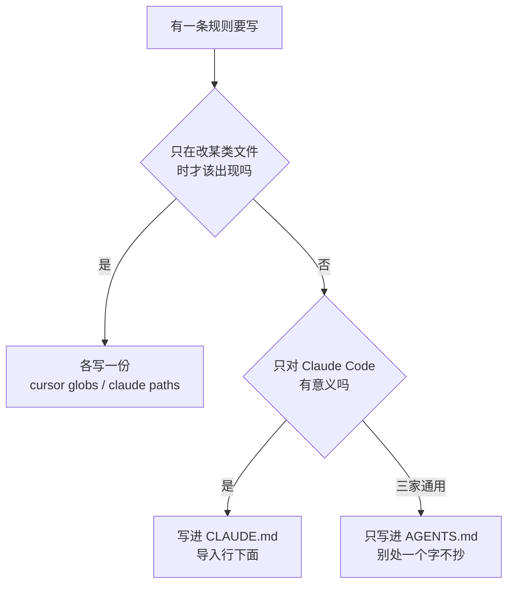

# 014. CLAUDE.md、AGENTS.md、.cursor/rules 三份规则文件，改一处漏两处怎么办？

**一句话**：选一个文件当唯一真源（选 AGENTS.md，读它的工具最多），其余文件只写指针 —— `CLAUDE.md` 第一行写不带反引号的 `@AGENTS.md`，然后开新会话跑 `/context` 确认两个文件都出现在 Memory files 里。

## 30 秒结论

| 你看到的 | 立刻做 | 不想再犯 |
|---|---|---|
| 改了构建命令，另一个工具还在跑旧的 | 把最全的那份定为 `AGENTS.md`，其余改成指针 | 一份内容只允许存在一个物理文件 |
| 「我明明写了它却不听」 | `/context` 看 Memory files 里有没有这个文件 | 排查加载问题一律只认 `/context` |
| 写了 `@AGENTS.md` 但没导入 | 检查是不是带了反引号，去掉 | 导入行永远顶格裸写，不放代码块里 |
| 有人又往 CLAUDE.md 里粘了 30 行通用规范 | 挪回 AGENTS.md | 加一条 CI 检查，卡住非指针内容 |
| Windows 同事 clone 下来规则是空的 | 把软链改成 `@AGENTS.md` 导入 | 团队方案不用 `ln -s` |

一条规则该落到哪份文件，按这张图判：



## 怎么做

### 第 0 步：先查清现在到底加载了什么

动手改文件之前先确认现状。任何「我明明写了它却不听」，八成在这一步就能定位。

```bash
# 1. 列出仓库里所有规则文件，看看到底有几份
ls -la CLAUDE.md CLAUDE.local.md AGENTS.md .cursorrules 2>/dev/null
ls -la .claude/rules/ .cursor/rules/ .github/copilot-instructions.md 2>/dev/null

# 2. 找出被复制粘贴的重复内容（有几份就有几处会漂移）
find . -maxdepth 3 \( -name "AGENTS.md" -o -name "CLAUDE.md" \) -not -path "./node_modules/*"
```

然后开一个新的 Claude Code 会话跑 `/context`。

**怎么判断做对了**：`/context` 输出里有一节 **Memory files**，列的是本次会话实际加载的文件。你期望的文件出现在这里 = 加载了；没出现 = 没加载，改再多内容都没用。想更细地看「哪个文件、什么时候、为什么被加载」，可以挂 `InstructionsLoaded` hook 打日志。

### 第 1 步：把真源定为 AGENTS.md

选它的理由很简单：直接读它的工具最多，需要额外写指针的份数最少。

哪份内容「最全」不用凭印象，对照三件事逐项数：构建/测试命令、目录与命名约定、禁止改动的目录。三项覆盖最全的那份就是起点；三份各有各的就先合并去重再定。

```bash
# 假设现在最全的是 CLAUDE.md
git mv CLAUDE.md AGENTS.md
```

**怎么判断做对了**：`git status` 显示的是重命名而不是删除 + 新增（历史保留）；Codex / Cursor 这类直接读 AGENTS.md 的工具开一个新会话，能复述出你写在里面的构建命令。

### 第 2 步：CLAUDE.md 改成两行的指针文件

```bash
cat > CLAUDE.md <<'EOF'
@AGENTS.md

## Claude Code 专属

- 改 `src/billing/` 下的代码前先进 plan mode
EOF
```

三个要点：

- `@AGENTS.md` **不能带反引号**。官方的导入解析会跳过行内代码和代码块，写成带反引号的形式就只是一行普通文字，什么都不会导入。
- Claude 专属内容写在导入之后，位置更靠后，也更贴近「后读到的优先」的直觉。
- 别在 CLAUDE.md 里重抄 AGENTS.md 的任何一句话，一抄就回到漂移。

**怎么判断做对了**：新会话跑 `/context`，Memory files 里同时出现 `CLAUDE.md` 和 `AGENTS.md`；再问一句「本项目的测试命令是什么」，它能答出只写在 AGENTS.md 里的那条。

### 第 3 步：清理 `.cursor/rules`，只留路径触发的

分工原则：**全局通用规则** 只留在 AGENTS.md，Cursor 自己会读；**只在改某类文件时才该出现的规则** 留在 `.cursor/rules/*.mdc`，用 `globs` 限定。

**怎么判断做对了**：`.cursor/rules/` 里的每个文件，你都能回答出「为什么它不能挪进 AGENTS.md」，而唯一合法的答案是「它有 globs，不该常驻」。答不出来的一律挪走。

<details>
<summary>.mdc 示例与 Claude Code 侧的对应写法</summary>

Cursor 现在同时支持根目录 `AGENTS.md`（纯 markdown，无 frontmatter）和 `.cursor/rules/*.mdc`（带 frontmatter，支持 `globs` / `alwaysApply` / `description`）。注意 `.cursor/rules/` 下的纯 `.md` 文件因为没有 frontmatter 会被规则系统忽略。

```markdown
---
description: API 层的输入校验与错误格式约定
globs:
  - "src/api/**/*.ts"
alwaysApply: false
---

- 所有接口必须做入参校验
- 错误响应统一用标准 error 结构
```

Claude Code 侧对应的能力是 `.claude/rules/`，frontmatter 字段叫 `paths`，值同样是 glob 数组。这两个是各家自己的路径触发机制，目前没有跨工具统一格式，属于**必须各写一份**的部分 —— 好消息是这部分体量小、变动少，漂移代价远低于把全局规则抄三遍。

</details>

### 第 4 步：用 `/init` 接上已有规则（一次性，不是同步）

`/init` 做的是**合并快照**，不是持续同步。跑完之后仍然要按第 2 步把 CLAUDE.md 改回指针文件，否则你只是又造了一份副本。

<details>
<summary>/init 具体会读哪些文件</summary>

```bash
claude
> /init
```

`/init` 会读已有的 Cursor 规则（`.cursor/rules/` 或 `.cursorrules`）和 Copilot 规则（`.github/copilot-instructions.md`），把相关部分并进生成的 CLAUDE.md。想让它同时读 `AGENTS.md`、`.devin/rules/`、`.windsurf/rules/`、`.clinerules`，开新版 init：`CLAUDE_CODE_NEW_INIT=1 claude`。

</details>

<details>
<summary>monorepo、跨 worktree 个人偏好、软链接方案</summary>

**monorepo：用就近文件，不要一份大而全。** 两套加载逻辑行为不同，别混淆：

- AGENTS.md 生态（Codex / Cursor / Copilot）：agent 读**目录树上最近的那一份**，就近覆盖。
- Claude Code：从工作目录**向上逐级查找并拼接**，全部进上下文而不是互相覆盖；子目录下的 CLAUDE.md 则在 Claude 读到该目录文件时按需加载。

做法是根目录放跨包共用的，各 package 目录下放自己的，两边都别写「全仓所有细节」。完整做法见 [#050 大仓库 / monorepo 怎么让它不迷路](../06-工程协作/050-大仓库monorepo里不迷路.md)。

被别的团队的 CLAUDE.md 污染了，用 `claudeMdExcludes` 排除（放 `.claude/settings.local.json`，只影响你自己）：

```json
{
  "claudeMdExcludes": ["**/monorepo/other-team/CLAUDE.md"]
}
```

**跨 worktree 的个人偏好**：`CLAUDE.local.md` 被 gitignore 后只存在于你创建它的那个 worktree。要跨 worktree 共享，改成从家目录导入：

```markdown
# 个人偏好
- @~/.claude/my-project-instructions.md
```

项目级文件里出现指向工作目录之外的导入时，Claude Code 第一次会弹审批对话框（防止别人往共享项目里塞外部导入）。选了拒绝之后就不再弹，也不会加载。

**软链接方案（可用但有前提）**：

```bash
ln -s AGENTS.md CLAUDE.md
```

成功时没有任何输出，下次开会话跑 `/context` 确认 `CLAUDE.md` 出现在 Memory files 里。适用条件：你完全没有 Claude 专属内容，且团队全员非 Windows。Windows 上创建软链需要管理员权限或开发者模式，git 侧还需要 `core.symlinks=true` 才能正确 clone 出软链 —— 跨平台团队一律用 `@AGENTS.md` 导入。

</details>

<details>
<summary>第 5 步：加一道 CI 防线，堵住有人重新抄回来</summary>

方案能不能活下去，取决于有没有人偷偷往 CLAUDE.md 里加内容。加一个几行的检查：

```bash
#!/usr/bin/env bash
# scripts/check-agent-rules.sh —— CLAUDE.md 必须是指针文件
set -euo pipefail

grep -q '^@AGENTS\.md' CLAUDE.md || {
  echo "✗ CLAUDE.md 缺少 @AGENTS.md 导入行"; exit 1; }

lines=$(grep -vc '^\s*$' CLAUDE.md)
if [ "$lines" -gt 20 ]; then
  echo "✗ CLAUDE.md 有 $lines 行非空内容，超过 20 行：通用规则请写进 AGENTS.md"
  exit 1
fi
echo "CLAUDE.md 仍是指针文件"
```

**怎么判断做对了**：故意往 CLAUDE.md 里粘 30 行通用规范，跑脚本应该退出码非 0 并报错；恢复后应该通过。

</details>

## 为什么

### 三份文件不是三种需求，是三家工具各起了各的名字

同一件事 ——「告诉 agent 这个项目怎么构建、什么规范、别碰哪些目录」—— 各家约定了不同的文件名：

| 工具 | 读的文件 |
|---|---|
| Claude Code | `CLAUDE.md`、`.claude/rules/*.md` |
| OpenAI Codex / Cursor / Copilot coding agent 等 | `AGENTS.md` |
| Gemini CLI | 默认 `GEMINI.md`，配置后才读 `AGENTS.md`[^4] |
| Cursor（带路径触发的规则） | `.cursor/rules/*.mdc` |
| GitHub Copilot（仓库自定义指令） | `.github/copilot-instructions.md` |

内容高度重叠，文件名不重叠。于是团队里同时装了三种工具的人，就得维护三份几乎一样的 markdown。

漂移不是「可能发生」，是默认结果：改构建命令的人只会改自己那份。下一个用另一个工具的人拿到的是旧指令，agent 照旧指令跑，出了问题还很难查 —— 文件本身看起来是对的，只是过期了。

### Claude Code 确实不读 AGENTS.md，这不是配置问题

这一点必须说死，因为社区里不少三方教程写「没有 CLAUDE.md 时 Claude Code 会回退读 AGENTS.md」—— **这个说法是错的**。官方 memory 文档的原话是「Claude Code 读 CLAUDE.md，不读 AGENTS.md」[^1]。

社区从 2025-08 就在提这个需求，主 issue 至今 open，后续的重复 issue 也都还开着，其中一个被打上了 `duplicate` 标签[^2]。也就是说：**不要等原生支持，按现状搭方案。**

### 官方给的解法是「导入」，不是「同步」

`@路径` 导入语法把被导入文件在会话启动时展开进上下文，效果等同于把内容内联写在 CLAUDE.md 里[^1]。所以一份内容、一个物理文件，不存在两份副本对不上 —— 这就是「唯一真源 + 指针」能成立的机制基础。

三条要记住的细节：支持相对路径和绝对路径，相对路径相对于**写导入语句的那个文件**而不是当前工作目录；可以递归导入，最多 4 层；导入进来的内容照样在启动时全量进上下文，**它只解决一致性，不解决体积**，所以真源本身也要控制在 200 行以内（见 [#010 CLAUDE.md 怎么写才真的生效](./010-CLAUDE-md怎么写才生效.md)）。

还有一条容易踩的直觉错误：**多份 CLAUDE.md 是拼接，多份 `settings.json` 是覆盖**[^3]。同一个仓库里两套机制、语义相反，混淆之后排查方向会全错。

<details>
<summary>拼接和覆盖的实际差别，以及各自怎么排查</summary>

| | 多层怎么合 | 结果 |
|---|---|---|
| `CLAUDE.md`（managed / user / project / local） | **拼接**，所有发现的文件首尾相接进上下文 | 上层规则不会被下层顶掉，全部生效；冲突只能靠删，删不掉就一直在 |
| `settings.json`（user / project / local） | **覆盖**，同名字段以更靠近工作目录的一层为准 | 本地一份就能改掉项目值，改完看不出上层原来写了什么 |

`~/.claude/CLAUDE.md` 里那句「所有注释写中文」不会因为项目 CLAUDE.md 没提就失效，它一直在，还会跟项目规则打架；而 `.claude/settings.local.json` 里改掉的 `permissions`，项目那份就彻底不作数了。

所以两类问题查法不同：「规则不生效」查加载（`/context`）和查冲突（把几份贴一起问哪些互相打架）；「配置不生效」查覆盖链（哪一层写了同名字段）。

</details>

顺带提醒：这三份文件不管怎么合并，都属于「喂给模型的话」，不是开关。要无条件拦住某个动作，用 `PreToolUse` hook。合并文件解决的是「说的话不一致」，不解决「说了不听」。

## 别这么干

- ❌ **复制粘贴同步三份文件。** 没有任何机制保证一致，改一处漏两处是默认结果，不是意外。
- ❌ **信「Claude Code 没有 CLAUDE.md 时会回退读 AGENTS.md」。** 官方文档没这句话，实测也不是。按这个假设搭出来的项目，Claude Code 全程零指令在跑，你还以为它读到了。
- ❌ **给导入行加反引号。** 导入解析会跳过代码块和行内代码，一加反引号就变成普通文字，什么都不会导入 —— 而且失败是静默的。
- ❌ **团队方案用软链接。** Windows 成员 clone 出来是坏的或需要提权，失败同样静默：文件看着在，内容却读不到。
- ❌ **把 monorepo 全部细节堆进根目录一份文件。** 上下文爆掉、遵守率下降，正确做法是按目录分层放。

<details>
<summary>横向对比：五家工具各读什么、要不要单独维护</summary>

| 工具 | 读什么 | 要不要单独维护 | 备注 |
|---|---|---|---|
| Claude Code | `CLAUDE.md` + `.claude/rules/*.md` | 要一个两行指针文件 | 不读 AGENTS.md；`@路径` 导入最多 4 层 |
| OpenAI Codex | `AGENTS.md` | 不用 | 直接读真源 |
| Cursor | `AGENTS.md` + `.cursor/rules/*.mdc` | 只有 globs 规则要单写 | `.cursor/rules/` 下无 frontmatter 的 `.md` 被忽略 |
| GitHub Copilot | `AGENTS.md` + `.github/copilot-instructions.md`（coding agent 还会读 `CLAUDE.md` / `GEMINI.md`） | 不用 | 两者同属仓库级，个人指令优先级更高[^5] |
| Gemini CLI | 默认 `GEMINI.md` | 要改一行配置 | 在 `settings.json` 配 `contextFileName` 指向 `AGENTS.md` 才读，官方无原生支持计划[^4] |
| Zed / Aider / Windsurf 等 | `AGENTS.md` | 不用 | agents.md 官网列的支持工具还在增加 |

结论：把真源放在 AGENTS.md，需要额外动手的只有两家 —— Claude Code 写一个两行指针文件，Gemini CLI 改一行配置。

</details>

## 延伸

**相关文章**

- [#010 CLAUDE.md 怎么写才真的生效？](./010-CLAUDE-md怎么写才生效.md) —— 真源本身怎么写才被遵守
- [#012 上下文窗口要爆了怎么办？](./012-上下文窗口要爆了.md) —— 导入不省 token，合并后仍要控体积
- [#013 哪些决策必须写进 memory 才扛得住 compact](./013-哪些决策要写进memory.md) —— 真源里到底该装什么、不该装什么
- [#050 大仓库 / monorepo 怎么让它不迷路](../06-工程协作/050-大仓库monorepo里不迷路.md) —— 分层放规则文件的完整做法
- [#074 团队的 AI coding 规范怎么立？哪些该强制、哪些该自由？](../08-团队与组织/074-团队AI-coding规范怎么立.md) —— 规范内容本身怎么定

<details>
<summary>参考资料（9 条）</summary>

- [Claude Code 官方文档：How Claude remembers your project](https://code.claude.com/docs/en/memory) —— 支撑「不读 AGENTS.md」、`@AGENTS.md` 导入与 `ln -s` 两种官方写法、导入解析跳过代码块、最多 4 层递归、`.claude/rules/` 的 `paths` 字段、`claudeMdExcludes`、`/context` 与 `/memory` 的区别（官方，2026-08 访问）
- [agents.md 官网](https://agents.md/) —— 支撑「AGENTS.md 是跨工具开放格式」「支持工具清单」「6 万+ 开源项目采用」「monorepo 就近覆盖」（官方，2026-08 访问）
- [Cursor 官方文档：Rules](https://cursor.com/docs/context/rules) —— 支撑 `.cursor/rules/*.mdc` 的 frontmatter 字段与「无 frontmatter 的 `.md` 被忽略」（官方，2026-08 访问）
- [GitHub Changelog：Copilot coding agent now supports AGENTS.md](https://github.blog/changelog/2025-08-28-copilot-coding-agent-now-supports-agents-md-custom-instructions/) —— 支撑横向对比表里 Copilot 同时支持 AGENTS.md 与 copilot-instructions.md（官方，2025-08）
- [GitHub Docs：About customizing GitHub Copilot responses](https://docs.github.com/en/copilot/concepts/prompting/response-customization) —— 支撑「个人指令优先级高于仓库指令」（官方，2026-08-15 访问）
- [Gemini CLI 官方文档：Configuration](https://github.com/google-gemini/gemini-cli/blob/main/docs/cli/configuration.md) —— 支撑「Gemini CLI 默认读 GEMINI.md，配 `contextFileName` 后才读 AGENTS.md」（官方，2026-08-15 访问）
- [GH issue #31005：Support for AGENTS.md and .agents/skills/](https://github.com/anthropics/claude-code/issues/31005) —— 汇总 2025-08 至今 6 个相关 issue 及其状态，本篇「不要等原生支持」的依据（社区，2026-08-15 访问）
- [GH issue #34235：Support AGENTS.md as Native Context File](https://github.com/anthropics/claude-code/issues/34235) —— open 且被标 `duplicate`，评论区给出「CLAUDE.md 只做文件清单」的变体写法（社区，2026-08-15 访问）
- [agyn.io：AGENTS.md vs CLAUDE.md, Does Claude Code or Codex Read Both?](https://agyn.io/blog/claude-md-agents-md-compatibility) —— 支撑「手工维护两份一周就漂移」的实践记录与「导入优于软链」的理由（实践，2026-08 访问）

</details>

[^1]: [Claude Code Docs: How Claude remembers your project](https://code.claude.com/docs/en/memory)（官方，2026-08 访问）：明确写着 Claude Code 读 `CLAUDE.md` 而不读 `AGENTS.md`，并给出 `@AGENTS.md` 导入与 `ln -s` 软链两种官方写法；导入在会话启动时展开、最多递归 4 层、解析时跳过代码块与行内代码。
[^2]: [GH issue #31005](https://github.com/anthropics/claude-code/issues/31005) / [#34235](https://github.com/anthropics/claude-code/issues/34235)（社区，2026-08-15 用 `gh issue view` 复核）：原生支持 AGENTS.md 的需求自 2025-08 提出，两个 issue 状态均为 open，#34235 带 `duplicate` 标签，官方未给时间表。
[^3]: [Claude Code Docs: How CLAUDE.md files load](https://code.claude.com/docs/en/memory)（官方，2026-08 核实）：所有被发现的 memory 文件是拼接进上下文，而不是互相覆盖；`settings.json` 的多层合并是另一套机制，同名字段由更靠近工作目录的一层覆盖。
[^4]: [Gemini CLI Docs: Configuration](https://github.com/google-gemini/gemini-cli/blob/main/docs/cli/configuration.md)（官方，2026-08-15 核实）：上下文文件默认名为 `GEMINI.md`，需在 `settings.json` 里配 `contextFileName`（可填单个文件名或数组，如 `["AGENTS.md", "GEMINI.md"]`）才会读 AGENTS.md；把 AGENTS.md 加入默认列表的官方 issue（[#12345](https://github.com/google-gemini/gemini-cli/issues/12345)）已被关闭为 not planned。agents.md 官网对 Gemini CLI 的收录也是以这个可配置能力为前提。
[^5]: [GitHub Docs: About customizing GitHub Copilot responses](https://docs.github.com/en/copilot/concepts/prompting/response-customization)（官方，2026-08-15 核实）：多类指令同时存在时优先级为个人指令 > 仓库指令 > 组织指令；低优先级指令不会被丢弃，全部都会提供给 Copilot，冲突时以高优先级为准。

---

<sub>难度 中级 · 配置题 · 主线 Claude Code，横向 Codex / Cursor / Copilot</sub>

<sub>**时效**：官方 memory 文档「不读 AGENTS.md」的表述、`@路径` 导入语义与 4 层上限、`.claude/rules/` 的 `paths` 字段、`claudeMdExcludes`、Cursor `.mdc` frontmatter 字段，已于 2026-08-03 核实；相关 issue 状态（均 open，#34235 带 `duplicate` 标签）、Gemini CLI 的 `contextFileName` 配置、Copilot 个人指令优先级，已于 2026-08-15 核实。「CLAUDE.md 多层是拼接、`settings.json` 多层是覆盖」于 2026-08-04 对照官方 memory 与 settings 文档核实。**已知不确定**：「6 万+ 开源项目采用 AGENTS.md」是 agents.md 官网自述，无第三方核对；主 issue 的反应数与评论数会随时间变化，本篇不再引用具体数字。**易变**：各家工具对 AGENTS.md 的支持范围变化快，落地前用文中第 0 步的 `/context` 自己确认一遍。</sub>

> 本篇个人实践（L4）：`[待补：BOSS 的实战经验/踩坑]`
