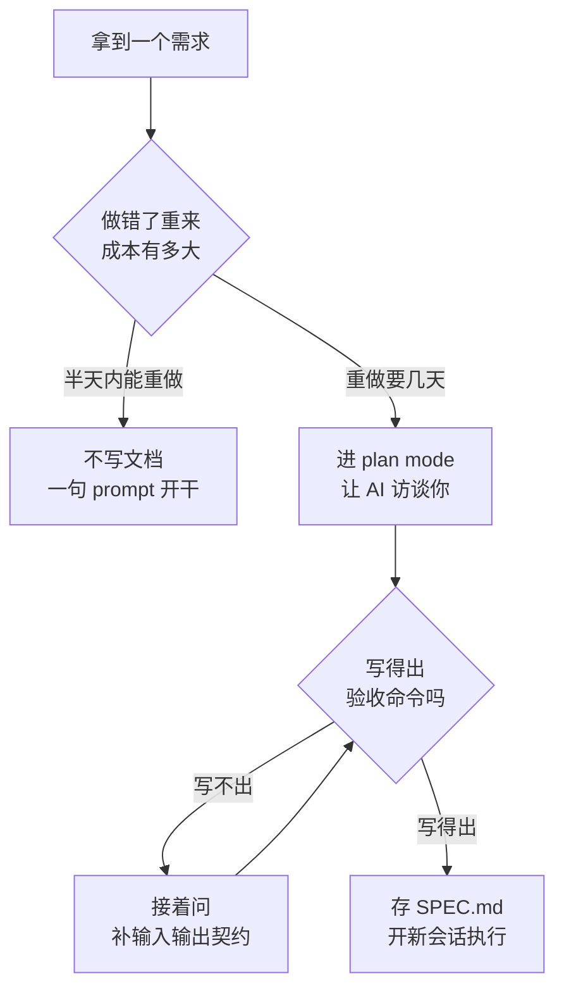

# 021. 动手前到底要不要先写 PRD / 需求文档？写多详细才够？

**一句话**：别纠结「要不要写 PRD」，纠结「AI 能不能自己判断做完没」—— 写不出验收命令就接着补，写得出就停笔开工。

## 30 秒结论

| 你的处境 | 立刻做 | 不想再犯 |
|---|---|---|
| 一次性脚本 / POC，跑完就扔 | 不写文档，一句 prompt 开干 | 按返工成本定仪式感，别一刀切 |
| 单功能、0.5–2 天 | plan mode 里对齐，`SPEC.md` 可写可不写 | 开工前先答一句「验收命令是什么」 |
| 中型功能、3 天–2 周 | 写 5 要素最小 PRD，存 `SPEC.md` 进 git | 验收标准自己定，别整份交给 AI |
| 新项目 0→1 / 大重构 | `/init` 出 CLAUDE.md，再写 PRD + 架构文档 | 需求写进 `SPEC.md`，别塞 CLAUDE.md |
| 需求文档已经写到伪代码那么细 | 删到「能据此写出验收测试」为止 | 写行为，不写实现 |
| 写完了 AI 还在反复追问细节 | 把它问的每个点补进文档再开工 | 让 AI 先访谈你，别自己闷头写 |



## 怎么做

本篇里 PRD、spec、需求文档指同一件事：动手前写清「要做什么、做成什么样算完」的那份文档。

### 第 1 步：让 AI 访谈你，别自己闷头写

「先写份 PRD 再动手」这句劝告有个隐含前提 —— 你已经清楚自己要什么，只是还没写下来。多数时候不成立[^1]。所以正确姿势是反过来：让 AI 把你没想清的地方逼问出来。

进 plan mode（连按两次 `Shift+Tab`，或 `claude --permission-mode plan`），用官方推荐的访谈 prompt：

```
我想做 [简要描述]。用 AskUserQuestion 工具详细地访谈我。
问技术实现、UI/UX、边界情况、顾虑和权衡。别问显而易见的问题，
挖那些我可能没考虑到的难点。
一直问到把所有点覆盖完，然后写一份完整的 spec 到 SPEC.md。
```

plan mode 是只读的，它会先扫一遍相关代码再提问，所以问出来的东西贴着你的代码库，不是通用清单。

### 第 2 步：落成 5 要素的 `SPEC.md`

官方给的标准是「自包含」：点名涉及哪些文件和接口，声明什么不在范围内，最后用一个端到端的验证步骤收尾[^2]。落成模板就是这五节，直接存 `SPEC.md` 进 git：

```markdown
# [功能名] PRD

## 1. 做什么 & 为什么
- 用户故事：作为 X，我想 Y，以便 Z
- 解决的问题：[一句话]

## 2. 输入输出契约
- 输入：[数据结构 / API 入参]
- 输出：[返回结构 / 副作用]
- 涉及的文件/接口：[列出，做到自包含]

## 3. 验收标准（最关键，可执行）
- [ ] 场景 A：输入 X → 期望输出 Y（附测试命令）
- [ ] 场景 B：边界情况 → 期望行为
- [ ] 端到端验证：[一条能跑的命令/脚本]

## 4. 约束与边界
- 必做：...
- 先问我再动：...
- 别碰：[显式列出不要动的文件/模块]

## 5. Out of scope（显式排除）
- 本次不做 X、Y、Z
```

第 3 节是灵魂。删到只剩一节，就留这一节：前 4 节可以让 AI 在访谈里帮你补，验收标准最好自己定，因为它是「你对结果负责」的锚点。

### 第 3 步：判断写够了没有

不看字数，看三个能观察到的信号，全中就停笔：

1. **第 3 节每一条都能落到一条能跑的命令或一个能过的测试。** 落不到的那条，说明需求还没想清，接着问。
2. **把 `SPEC.md` 丢给一个新会话，问「照这份文档动手，你还有哪些地方不确定」。** 它提不出新问题，说明自包含了；它一口气列出五六个疑问，把这些疑问补进文档再来一遍。
3. **文档里没有出现函数体、伪代码、变量名级别的实现细节。** 一旦细到代码层，评审文档等于评审伪代码，人会跳过不看；而且实现一改文档就过期。

写行为不写实现，是这三条的共同底线。

### 第 4 步：开新 session 执行

`SPEC.md` 写完，别在同一个会话里接着干。开新 session、把 `SPEC.md` 作为参照带进去 —— 干净的上下文加一份书面契约，能避开访谈阶段累积的失败尝试。

之后怎么把 spec 拆成 task，见 [#022 大需求怎么拆子任务](./022-大需求怎么拆子任务.md)；怎么一轮轮执行验收，见 [#031 plan→execute→review 循环](../04-执行工作流/031-plan-execute-review循环.md)。

### `/init` 不是写 PRD 的入口

`/init` 的产物是 `CLAUDE.md`，它回答「这个项目长什么样、怎么跑」—— 构建命令、测试方式、代码约定，由 Claude 扫描代码库自动生成[^3]。PRD 回答「这次要做什么、做成什么样算完」。

新项目的顺序是 `/init`（环境层）→ `SPEC.md`（需求层）→ 执行。把一次性需求塞进 `CLAUDE.md` 是常见误用：它每次会话都加载，塞需求进去等于每轮对话都为过期信息付费。

<details>
<summary>四档姿势：从零文档到全流程 SDD（含 Spec Kit 的取舍）</summary>

| 档位 | 怎么做 | 适用 | 花的时间 |
|------|-------|------|---------|
| **零文档** | 一句 prompt 直接开干 | 探索性脚本、demo | 0 |
| **plan mode + 访谈** | 上面第 1–4 步，产出 `SPEC.md` | 绝大多数中型任务 | 15–30 min |
| **brainstorming skill** | superpowers 的 `brainstorming` 引导式收敛 | 需求还说不出「做完是什么样」 | 30–60 min |
| **全流程 SDD** | GitHub Spec Kit 的 `/speckit.*` 命令链，spec/plan/tasks 分阶段进 git | 新项目 0→1、团队协作、大重构 | 数小时起 |

第二档覆盖大部分场景。第四档是把 spec 从「一次性文档」升级成「跟着项目一起改的事实来源」，这就是 SDD（Spec-Driven Development，规范驱动开发）：先把「要做什么、做到什么程度」写成能读、能测、能改的规范，再让 agent 照着它生成代码。GitHub 发布 Spec Kit 时的定义是「随项目一起演进的、活的、可执行的产物」[^4]。

它不是瀑布流复活：瀑布流的 spec 一锁死就改不动、反馈周期以月计；SDD 的反馈周期是小时到天。

**什么时候值得上到第四档：**

| 场景 | 上不上 SDD |
|------|-----------|
| 探索性原型、一次性脚本 | 不上。plan mode 就够，SDD 流程纯属负担 |
| 单功能、中型迭代 | 不必上全流程，写最小 PRD（5 要素）即可 |
| 新项目 0→1（greenfield） | 最适合。少量前期 spec 换来大幅减少返工 |
| 既有项目加新功能（brownfield） | 适合，但要先让 agent 只读探索代码库 |
| 大型既有库（10 万行以上）做全量 spec | 维护成本陡增，建议只为单次任务写轻量 spec |
| 正式生产代码、要对结果负责 | 强烈建议 |

**代价先认下来**：SDD 的主要成本不是写 spec，是维护 spec —— 每次改动都要同步回写，否则文档和代码逐渐脱节，最后变成一堆过时规则。团队上 SDD 前先回答：愿不愿意把「维护 spec」纳入日常流程？不愿意就停在第二档，每次任务写一份 `SPEC.md`、用完即弃。

具体命令链以官方仓库 [github/spec-kit](https://github.com/github/spec-kit) 为准（命令名随版本变）；spec 里写什么，直接复用上面那份 5 要素模板。

</details>

<details>
<summary>新项目 vs 既有项目：顺序不一样</summary>

**新项目（greenfield，从零起步）**：`/init` 搭项目记忆 CLAUDE.md → brainstorm 出 PRD 骨架 → 让 AI 访谈你补全 → 写架构文档 → 进 plan mode 开干。

**既有项目迭代（brownfield，在已有代码上改）**：先让 AI 在 plan mode 只读探索相关代码 → 基于理解写「这次改动」的最小 spec → 在 out of scope 里写清别碰什么 → 执行。不必为每次迭代重写整个项目的 PRD。

**需求太大太模糊时的三步**：

1. 让 AI 先列出它从需求里识别到的所有点，不许开始写。面对 100+ 页的需求文档，这一步能把它压成一张可核对的清单。
2. 你逐条确认、否决或补充。这一步往往能暴露你自己都没想清楚的点。
3. 先落地再扩展（Land then Expand）：先产出 5 要素骨架，再逐节填充，而不是一上来堆一份大 PRD。

可选加一步：把 `SPEC.md` 分别丢给 Claude、ChatGPT、Gemini，让它们各自挑盲区。多模型交叉评审属于「需求阶段找盲区」的技巧，本篇点到为止。

</details>

## 为什么

### 先有需求，AI 才不瞎猜

官方把「先探索、再规划、再写码」列为推荐工作流的第一条：直接开写会产出「解错了问题」的代码，用 plan mode 把探索和执行分开[^2]。官方的 feature-dev plugin 更把这条固化成七个阶段 —— 发现 → 读代码 → 澄清提问 → 架构设计 → 实现 → 质量评审 → 总结，其核心原则一句话：实现前先等用户回答[^5]。

注意官方的答案不是「写份 PRD」，是一条行为链：先读代码 → 反向访谈澄清 → 出方案经你批准 → 才动手。文档只是这条链的产物。

### 核心是验收标准，不是篇幅

官方那句话值得单独记：把 spec 写精确花的时间，比盯着 AI 实现花的时间更值[^2]。

原因在于 AI 的停止条件。没有能跑的检查时，「看起来做完了」就是它唯一的信号，于是它在半成品处停下并宣布完成。一条能产出通过/失败的检查，才能让它自己闭环。所以一份没有验收标准的需求文档，写多长都等于没写。

### 详细度有上界

需求文档也是上下文，越精炼越有效 —— 官方对上下文的表述是：找出信号量最高的最小 token 集合。写到伪代码那一档，你付出两份成本：人不看（评审伪代码没人愿意干），文档还会随实现漂移。所以上界卡在「能据此写出验收测试」，到此为止。

## 别这么干

- **把「just write a PRD」当字面指令。** 这句话假设你已经知道想要什么。让 AI 访谈你，把模糊想法逼问成契约。
- **把 PRD 写成愿望清单，没有验收标准。** 没有端到端验证步骤，AI 依然在瞎猜，你也没法判断它是不是在骗你。
- **写到伪代码、具体函数实现。** 人会懒得评审，文档还会跟着实现漂移。详到「能写验收测试」即停。
- **把 PRD 塞进 CLAUDE.md。** CLAUDE.md 每次会话都加载，一次性需求塞进去会持续占用上下文。用 `SPEC.md` 单独存。
- **PRD 写完就锁死不更新。** 执行中确认的需求变更要回写，否则文档和实现脱节，下一个人只能当它不存在。

<details>
<summary>换成 Cursor / Copilot / Gemini CLI 呢</summary>

| 维度 | Claude Code | Cursor | GitHub Copilot | Gemini CLI |
|------|------------|--------|----------------|------------|
| **原生「写需求」入口** | plan mode（只读强制）+ 访谈 prompt + `SPEC.md` | `.cursor/rules` + chat 引导，无原生受控流程 | `agents.md` + Spec Kit 的 `/speckit.specify` | 支持 Spec Kit 集成 |
| **反向访谈** | 「Let Claude interview you」+ AskUserQuestion 工具（官方推荐） | 依赖人工 prompt 引导 | Spec Kit 的 `/speckit.clarify` | Spec Kit 的 `/speckit.clarify` |
| **项目记忆初始化** | `/init` 生成 CLAUDE.md | 无原生等价（靠 rules） | agents.md 手写 | 无原生等价 |
| **最小 PRD 产物** | `SPEC.md`（官方文档示例用这个名字） | 用户自定 | `specs/xxx/spec.md`（Spec Kit 结构） | Spec Kit 结构 |

「写需求文档」本身是工具无关的实践，差异在原生引导的成熟度：Claude Code 的 plan mode 加访谈机制把「需求先行」做得最顺手，Copilot 通过 Spec Kit 拿到受控工作流，Cursor 更多依赖人工纪律。

</details>

## 延伸

**相关文章**

- [#022 怎么把一个大需求拆成 AI 能一次做对的子任务？](./022-大需求怎么拆子任务.md) —— 本篇产出 spec，022 讲怎么把它拆成一条条可执行任务
- [#023 Vibe coding 为什么会翻车？什么时候必须停下来规划？](./023-Vibe-coding什么时候停下规划.md) —— 023 是「问题」（不规划就开干会崩），本篇是「方案」（怎么规划）
- [#031 plan → execute → review 的正确循环怎么做？](../04-执行工作流/031-plan-execute-review循环.md) —— 本篇讲需求怎么产出，031 讲定了之后如何一轮轮执行
- [#010 CLAUDE.md 怎么写才真的生效？](../02-上下文工程/010-CLAUDE-md怎么写才生效.md) —— 010 是长期全局约定，本篇是单次任务契约，别混在一个文件里
- [#012 上下文窗口要爆了怎么办？](../02-上下文工程/012-上下文窗口要爆了.md) —— 需求文档写太长也是上下文负担

**参考资料**

- [Best practices for Claude Code — Claude Code Docs](https://code.claude.com/docs/en/best-practices) —— 支撑「先探索再规划再写码」「让 Claude 访谈你」「自包含 spec + 端到端验证步骤」「写精确 spec 比盯实现更值」四条核心论断（官方，2026-06）
- [feature-dev plugin — anthropics/claude-code](https://github.com/anthropics/claude-code/blob/main/plugins/feature-dev/README.md) —— 支撑「官方答案是一条七阶段行为链，不是一份文档」（官方 plugin，2026）
- [feature-dev Core Principles — anthropics/claude-code](https://github.com/anthropics/claude-code/blob/main/plugins/feature-dev/commands/feature-dev.md) —— 支撑「问具体问题、实现前先等用户回答」（官方 plugin，2026）
- [new-sdk-app.md — anthropics/claude-code](https://github.com/anthropics/claude-code/blob/main/plugins/agent-sdk-dev/commands/new-sdk-app.md) —— 支撑「一次只问一个问题、等回答再继续」的访谈节奏（官方 plugin，2026）
- [How Claude remembers your project — Claude Code Docs](https://code.claude.com/docs/en/memory) —— 支撑「`/init` 产物是 CLAUDE.md，属环境层不是需求层」（官方，2026）
- [Effective context engineering for AI agents — Anthropic](https://www.anthropic.com/engineering/effective-context-engineering-for-ai-agents) —— 支撑「需求文档也是上下文，越精炼越有效」（官方，2025-09）
- [Spec-driven development with AI — GitHub Blog](https://github.blog/ai-and-ml/generative-ai/spec-driven-development-with-ai-get-started-with-a-new-open-source-toolkit/) —— 支撑 SDD 一档的定义与适用场景（官方，2025-09）
- [github/spec-kit — GitHub](https://github.com/github/spec-kit) —— 支撑「`/speckit.specify` 阶段即 PRD 产出」，命令链以此仓库为准（官方/开源，2025-2026）
- ["Just write a PRD" - How does this actually work for AI coding? — r/ClaudeAI 1so45i3](https://www.reddit.com/r/ClaudeAI/comments/1so45i3/just_write_a_prd_how_does_this_actually_work_for/) —— 支撑「这条建议假设你已经知道自己要什么」以及「PRD 不是一句 prompt，是被代码可验证测试隔开的一组文档」（社区，2026；Reddit 反爬，未能实访复核）
- [I forced Claude to reject my code until I wrote a PRD — r/ClaudeAI 1qwgpfl](https://www.reddit.com/r/ClaudeAI/comments/1qwgpfl/i_forced_claude_to_reject_my_code_until_i_wrote_a/) —— 支撑「强制先写需求后，AI 不再瞎猜、人不再反复 re-prompt」（社区，2025-11；Reddit 反爬，未能实访复核）
- [How to get a PRD from a huge project requirement — r/ClaudeAI 1qg78ev](https://www.reddit.com/r/ClaudeAI/comments/1qg78ev/how_to_get_prd_from_a_huge_project_requirement/) —— 支撑「需求太大时先让 AI 逐条列出再结构化」（社区，2025；Reddit 反爬，未能实访复核）
- [Claude Code Tip: Land then Expand — Chris Dunlop · Medium](https://medium.com/realworld-ai-use-cases/claude-code-tip-land-then-expand-dont-start-with-a-big-prd-d0f982704845) —— 支撑「先出骨架再逐节扩展，别一上来堆大 PRD」，Land then Expand 的命名出处（社区，2025-09）
- [Claude Code: What do you do when starting a brand new project? — r/ClaudeAI 1l8s5zd](https://www.reddit.com/r/ClaudeAI/comments/1l8s5zd/claude_code_what_do_you_do_when_starting_a_brand/) —— 支撑新项目冷启动顺序（`/init` → PRD）的讨论（社区，2025；Reddit 反爬，未能实访复核）
- [So I tried using Claude Code to build actual software and it humbled me — r/ClaudeCode 1rx1l7d](https://www.reddit.com/r/ClaudeCode/comments/1rx1l7d/so_i_tried_using_claude_code_to_build_actual/) —— 支撑「PRD → SPEC → 详细计划 → 才动手」的社区经验（社区，2026；Reddit 反爬，未能实访复核）
- [I run every PRD through Claude, ChatGPT, and Gemini before coding — r/vibecoding 1sfyjmo](https://www.reddit.com/r/vibecoding/comments/1sfyjmo/i_run_every_prd_through_claude_chatgpt_and_gemini/) —— 支撑「多模型交叉评审 spec 找盲区」（社区，2026；单源经验帖）
- [How I write PRDs and Tech Specs with AI — r/agile 1nek7ai](https://www.reddit.com/r/agile/comments/1nek7ai/how_i_write_prds_and_tech_specs_with_ai_saving/) —— 支撑「用 AI 写需求文档省工时、人保留判断」（社区，2025；Reddit 反爬，未能实访复核）

[^1]: ["Just write a PRD" - How does this actually work for AI coding? — r/ClaudeAI 1so45i3](https://www.reddit.com/r/ClaudeAI/comments/1so45i3/just_write_a_prd_how_does_this_actually_work_for/)（社区，2026）：高赞评论指出这条建议假设你已经足够清楚自己想要什么、能把它写成规格。Reddit 反爬，本轮未能实访复核。
[^2]: [Best practices for Claude Code](https://code.claude.com/docs/en/best-practices)（官方，2026-06）：最有用的 spec 是自包含的 —— 点名涉及的文件和接口、声明什么不在范围内、以一个端到端验证步骤收尾；把 spec 写精确花的时间比盯实现更值。
[^3]: [How Claude remembers your project — Claude Code Docs](https://code.claude.com/docs/en/memory)（官方，2026）：`/init` 分析代码库，生成含构建命令、测试说明与项目约定的起步 CLAUDE.md。
[^4]: [Spec-driven development with AI — GitHub Blog](https://github.blog/ai-and-ml/generative-ai/spec-driven-development-with-ai-get-started-with-a-new-open-source-toolkit/)（官方，2025-09）：spec 不是静态文档，而是随项目一起演进的、活的、可执行的产物。
[^5]: [feature-dev plugin — anthropics/claude-code](https://github.com/anthropics/claude-code/blob/main/plugins/feature-dev/commands/feature-dev.md)（官方 plugin，2026）：找出所有模糊点与边界情况，问具体问题而不是自己假设，实现前先等用户回答。

---

<sub>难度 中级 · 决策题 · 主线 Claude Code，横向 Cursor / Copilot / Gemini CLI</sub>

<sub>**时效**：官方 best-practices 的 spec 标准、`/init` 与 memory 定位、feature-dev 与 agent-sdk-dev plugin 的流程约束、Spec Kit 定位，均于 2026-07-18 核实。**已知不确定**：几条 Reddit 出处受站点反爬限制，本轮未能实访复核，正文只把它们当佐证，不作为唯一依据。**易变**：Spec Kit 的 `/speckit.*` 命令名随版本变化，用前回查官方仓库；「验收标准优先」的决策框架与 5 要素模板不依赖版本。</sub>

> 本篇个人实践（L4）：`[待补：BOSS 的实战经验——你写 PRD 吗？什么量级会写？用 plan mode + interview 还是直接手写？有没有遇到 PRD 写太细反而 review 不动的情况？]`
