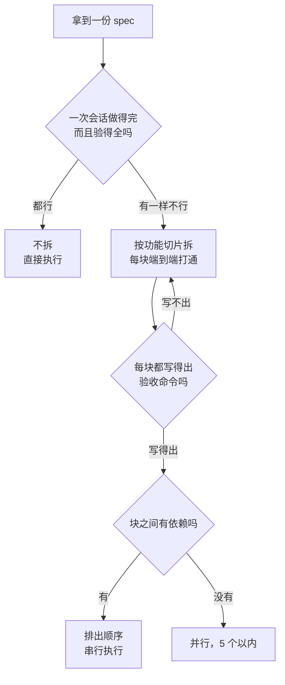

# 022. 怎么把一个大需求拆成 AI 能一次做对的子任务？

**一句话**：拆不拆看「AI 能不能在一次干净会话里做完、并且自己能证明做完」，不看需求有多大；按端到端功能切片拆，每块配一条能跑的验收命令。

## 30 秒结论

| 你看到的 | 立刻做 | 不想再犯 |
|---|---|---|
| 交上来的东西没处理边界、没测试，或口头说完成但没跑过任何命令 | 停手，按功能切片重新拆 | 每块 task 先写验收命令再动手 |
| 一个 task 干到 `/context` 过半还没完 | 把已完成部分 commit，`/clear` 后拆开继续 | 单个 task 压进一个干净会话 |
| 你说不出「这块做完了怎么验」 | 接着拆，拆到写得出一条命令为止 | 用「能不能验」定颗粒度 |
| 拆出「建 DB 表」「写 API」这类块 | 改成 DB→API→UI 一条线的端到端切片 | 别按层拆 |
| 改 A 必须同时改 B | 合并成一个 task，或显式排顺序串行 | 拆完先过一遍依赖 |
| 一次拆出十几个并行块 | 收到 5 个以内 | 并行度按复杂度定，别默认铺满 |
| 半天能干完的探索脚本 | 不拆，一句 prompt 直接干 | 返工成本约等于 0 就别上流程 |



**一次会话做得完又验得全就别拆**；要拆就按功能切片，每块配一条能跑的验收命令。

> 本篇只讲**怎么拆**：按什么维度拆、每块拆多小、验收怎么定、产物长什么样。**拆完怎么一轮轮执行、什么时候派 SubAgent 并行**，见 [#031 plan→execute→review 循环](../04-执行工作流/031-plan-execute-review循环.md) 和 [#032 何时该派 SubAgent](../04-执行工作流/032-SubAgent并行开几个.md)。本篇的产出是一张 task 列表，交给 04 去执行。

## 怎么做

主战场是 plan mode（只读探索、只出方案、不改代码）：连按两次 `Shift+Tab`，或用 `claude --permission-mode plan`。先让它只读扫一遍相关代码，再按下面六步产出 task 列表 —— 代码还没写的时候纠错最便宜。

### 第 1 步：先有 spec，再拆 task

拆的输入是一份已经收敛的 spec，它要能回答：做什么、输入输出是什么、验收标准是什么、什么不做（见 [#021 动手前要不要写 PRD](./021-动手前要不要写PRD.md)）。

对着模糊需求拆，拆出来的每一块都是模糊的，做完也没人说得清对不对。一句话：spec 是输入，task 列表是产物。

### 第 2 步：选维度 —— 优先功能切片，慎用按层拆

| 维度 | 怎么拆 | 优点 | 风险 |
|------|-------|------|------|
| **功能切片**（首选） | 沿「用户能感知的一个完整功能」切，每块端到端打通（DB→API→UI） | 每块能独立验收（端到端跑通 = 做完），可独立交付 | 需要先想清功能边界 |
| **按层**（慎用） | 按 DB 层 / API 层 / UI 层拆 | 符合直觉、好分工 | 中间产物无法独立验收（表建好但功能跑不通） |
| **文件/模块**（备选） | 按独立文件或模块拆，每块只动一组文件 | 边界清晰、冲突少，适合并行 | 需确保文件间无强依赖 |

功能切片（vertical slice）的定义很精确：一段薄薄的、端到端打通的功能，不是一个层（「建数据库表」），也不是一个组件（「写 API」）[^1]。

按层拆的具体危害：「建好数据库表」这种 task，AI 跑不出一个通过/失败的检查来自证完成，只能在「看起来做完了」处停下 —— 这正好踩中下面「为什么」里那条机制。

### 第 3 步：定每块的大小 —— 三条标尺交叉判断

没有绝对行数，用三条能观察的标尺，三条都过才算大小合适：

1. **上下文标尺**：从读代码、写代码到跑命令，这块能不能在一个干净会话里做完，且 `/context` 不过半？官方只说快满时会开始遗忘早先指令，「不过半」是留出安全余量的经验值。
2. **验收标尺**：能不能给它配一条命令或一个测试，跑出通过/失败？配不出来，说明这块还太大或太模糊，继续拆。
3. **逆转标尺**：做错了能不能一次 `git revert` 回滚干净？回滚要动到别的 task 的产出，说明边界没切干净。

### 第 4 步：给每块写验收标准

这是把「task 列表」和「愿望清单」区分开的核心。每个 task 至少写清三样：

- **done 的判据**：一条能跑的命令、一个能过的测试，或一张能对比的截图。
- **涉及的范围**：动哪些文件、哪些接口，让这个 task 自成一体。
- **不做什么**：明确这块不碰什么，防止 AI 顺手改别处（scope creep，指改动范围悄悄扩大）。

官方对验收的表述很硬：永远提供验证手段（测试、脚本、截图）；无法验证的东西就别交付[^2]。

### 第 5 步：过一遍依赖

规则只有一条：两个 task 如果需要彼此的输出，就必须串行；完全独立，才能并行。

- **无依赖**（改 A 不影响 B）：可并行，一次 5 个以内，交给 04/032 派 SubAgent。
- **有依赖**（A 的输出是 B 的输入）：在 task 里显式写 `依赖：Task N`，串行执行。
- **双向依赖**（改 A 必须同时改 B，比如前端组件和它依赖的 API 契约）：别硬拆，合成一个 task。

### 第 6 步：产出 `tasks.md` 并 review

拆完的产物是一张 task 列表，进 git，然后开新 session 逐块执行：

```markdown
# [功能名] tasks.md

## Task 1: [切片名，如「用户登录端到端」]
- 范围：src/auth/login.ts, src/api/auth.ts, src/components/Login.tsx
- 验收：`npm test auth` 全绿 + 手动登录 demo 通过
- out of scope：不改注册流程、不改 token 刷新逻辑
- 依赖：无（可并行）

## Task 2: [下一个切片]
- 范围：...
- 验收：...
- 依赖：Task 1（需要登录态）
```

让 AI 直接产出这张表的 prompt：

```
基于 SPEC.md，把这个需求拆成 AI 能一次做对的子任务。
每个 task 写清：①范围（动哪些文件）②验收（一条能跑的命令/测试）
③out of scope（不碰什么）④依赖（依赖哪些其他 task）。
优先按功能切片拆，不要按层拆。一次并行块控制在 5 个以内。
```

**怎么确认拆对了**：逐条对着 `tasks.md` 检查三件事 —— 每个 task 的「验收」栏是不是一条你现在就能复制去终端跑的命令（不是「功能正常」这种话）；每个 task 的「范围」栏文件列表和别的 task 有没有重叠；有依赖的 task 是不是都写了 `依赖：`。三项全过再开工。

<details>
<summary>三档「拆 task」姿势：手写 / superpowers / Spec Kit</summary>

| 档位 | 工具 | 适用 | 仪式感 |
|------|------|------|--------|
| **轻量** | plan mode + 手写 `tasks.md` | 单功能、1–3 天 | 低，零额外工具 |
| **半自动** | superpowers 的 `brainstorming → writing-plans` | 中等功能、想要引导式拆分 | 中，装插件 |
| **全流程 gated** | GitHub Spec Kit 的 `/speckit.tasks` | 新项目、团队协作 | 高，四阶段带关卡 |

Spec Kit 的 `/speckit.tasks` 会基于 `/speckit.plan` 自动产出结构化 task 列表，产物结构是 `specs/xxx/tasks.md`。但 021 篇的结论同样适用：Spec Kit 的仪式感对小任务过重，1–3 天的功能用 plan mode 手写 `tasks.md` 就够。

社区流行的 TASKS.md、Backlog.md 流法本质是同一张表，区别只在文件名。

</details>

## 为什么

### 大任务必然偷工减料

官方把上下文窗口称为「最需要管理的资源」：它填得很快，越满性能越差；快满时 Claude 会开始「忘记」早先的指令，或者出更多错[^3]。

一个大需求塞进一个会话，文件读几轮、命令跑几次、失败重试几次，上下文很快过半。上下文越满，AI 对「最初那份验收标准」的注意力越涣散，于是跳过边界情况、省掉测试、把半成品报成完成。社区有典型抱怨正是这件事：大范围任务上 Claude Code 独立做不成，一直在偷工减料，根本交付不了。

### 拆能救，是因为验收重新变得可执行

真正起作用的机制在官方这句话里：Claude 的停止条件是「活儿看起来做完了」；没有一个它能跑的检查时，「看起来做完了」就是它唯一可用的信号。给它一个能产出通过或失败的检查，循环就自己闭合 —— 干活、跑检查、读结果、迭代到通过为止[^2]。

大任务里没法跑一个覆盖全部需求的检查，所以它必然在「看起来做完了」处停下。拆成小块后，每块都能配一个明确的通过/失败检查，AI 才会真的迭代到通过。

社区有一次完整的流程改造记录：用 README 给上下文、每个 task 写成独立 Markdown 文件、每做完一个就 review/test/commit 再进下一个，任务成功率从第一遍的 50% 升到 75%，再到 95% 以上。起作用的不是换模型，是「拆 + 每块独立验收 + 块间清上下文」。

### 官方给的骨架：orchestrator-workers

Anthropic 把「拆任务」抽象成一个正式工作流模式 —— 一个中枢 LLM 动态拆分任务、分派给 worker LLM、再汇总结果，适合那种事先没法预知子任务的复杂任务[^4]。

从中能提取两条判据：**能拆**，是子任务彼此独立、能分别交给一个 worker；**不能拆**，是子任务有强依赖，硬拆开反而要额外协调。

并行度上，Anthropic 的多智能体研究系统给了一个锚点：主控 agent 通常并行派 3–5 个 subagent，而不是几十个[^5]。同一篇文章也说可以按复杂度伸缩 —— 简单任务 1 个、对比类 2–4 个、真正复杂的任务 10 个以上。两者不冲突：3–5 是常见并行度，10+ 是复杂度确实撑得起时的上限。本篇给的行动值取 5 以内，因为超过 5 通常说明拆得太细，协调成本反过来吃掉收益。

## 别这么干

- **按层拆而不是按功能拆。** 「建 DB 表」「写 API」无法独立验收，AI 没法自证完成。改成端到端切片。
- **拆出的 task 没有验收标准。** 没验收，AI 就在「看起来做完了」时停下。每块必须配一条能跑的通过/失败检查。
- **对着模糊需求硬拆。** spec 没收敛就拆，每块都模糊。先出 spec（021 篇）再拆。
- **把强依赖的 task 硬拆成并行。** 改 A 必须同时改 B 时硬拆，会引入额外协调甚至相互覆盖。强依赖就串行或合并。
- **拆完不 commit。** 没有回滚锚点，做错了无法干净逆转。每块做完 review + test + commit 再进下一个。

<details>
<summary>换成 Cursor / Copilot / Gemini CLI 呢</summary>

| 维度 | Claude Code | Cursor | GitHub Copilot | Gemini CLI |
|------|------------|--------|----------------|------------|
| **原生拆 task 入口** | plan mode（只读探索）+ `tasks.md` 手写 + Spec Kit 的 `/speckit.tasks` | `.cursor/rules` + chat 引导，无原生带关卡的流程 | Spec Kit 的 `/speckit.tasks` 一等公民 | 支持 Spec Kit 集成 |
| **并行执行拆出的 task** | subagents / agent teams / dynamic workflows（原生原语最全） | 依赖人工开多窗口 | Spec Kit 配合 | Spec Kit 配合 |
| **任务追踪产物** | `tasks.md` / `SPEC.md`（官方文档示例） | 用户自定 | `specs/xxx/tasks.md`（Spec Kit 结构） | Spec Kit 结构 |

「拆 task」本身是工具无关的方法，差异在「原生拆分 + 执行原语」的成熟度：Claude Code 的 plan mode 加 subagents 把「拆完即并行」做得最顺；Copilot 通过 Spec Kit 拿到结构化 task 产物；Cursor 更多依赖人工纪律。

</details>

## 延伸

**相关文章**

- [#021 动手前到底要不要先写 PRD / 需求文档？写多详细才够？](./021-动手前要不要写PRD.md) —— 021 产出的 spec 就是本篇拆 task 的输入，先 021 再 022
- [#031 plan → execute → review 的正确循环怎么做？](../04-执行工作流/031-plan-execute-review循环.md) —— 本篇产出 task 列表（规划层），031 接手逐块执行（执行层）
- [#032 开几个 agent 并行跑，结果互相踩、被限流、token 指数级炸开——并行到底该开几个？](../04-执行工作流/032-SubAgent并行开几个.md) —— 本篇判断哪些 task 可并行，032 讲并行的机制与上限
- [#012 上下文窗口要爆了怎么办？](../02-上下文工程/012-上下文窗口要爆了.md) —— 本篇「一次做对」的判据之一是上下文不过半，012 讲塞满后的机制与处置

<details>
<summary>参考资料</summary>

- [Best practices for Claude Code — Claude Code Docs](https://code.claude.com/docs/en/best-practices) —— 支撑「上下文填得快、越满性能越差」「给它一个通过/失败的检查，循环就闭合」「无法验证的东西别交付」三条论断（官方，2026-06）
- [Building Effective AI Agents — Anthropic](https://www.anthropic.com/engineering/building-effective-agents) —— 支撑 orchestrator-workers 骨架与「可拆 = 子任务能独立完成」的判据（官方，2024-12）
- [How we built our multi-agent research system — Anthropic](https://www.anthropic.com/engineering/multi-agent-research-system) —— 支撑并行度锚点：常见 3–5 个 subagent，按复杂度可伸缩到 10 个以上（官方，2025-06）
- [Run agents in parallel — Claude Code Docs](https://code.claude.com/docs/en/agents) —— 支撑横向对比里 Claude Code 的并行原语一栏（官方，2026）
- [github/spec-kit — GitHub](https://github.com/github/spec-kit) —— 支撑「`/speckit.tasks` 产出结构化 task 列表、产物结构 `specs/xxx/tasks.md`」（官方/开源，2025-2026）
- [The Real Secret to Agentic Development is Small PRDs and Vertical Slices — Allan Hill · LinkedIn](https://www.linkedin.com/pulse/real-secret-agentic-development-small-prds-vertical-slices-allan-hill-puihc) —— 该文把 vertical slice 应用到 AI coding 场景并给出上述定义；术语本身源自敏捷社区（社区实践，2025）
- [INVEST in Good Stories, and SMART Tasks — Bill Wake · XP123](https://xp123.com/invest-in-good-stories-and-smart-tasks/) —— vertical slice 的敏捷社区源头之一：拆 story 要竖切「多层蛋糕」而非按层横切（社区经典，2003）
- [Claude Code cutting corners on larger tasks — r/ClaudeAI 1qbgqqg](https://www.reddit.com/r/ClaudeAI/comments/1qbgqqg/claude_code_cutting_corners_on_larger_tasks/) —— 支撑「大任务上偷工减料、根本交付不了」的症状描述（社区，2025-2026）
- [Getting close to 100% task-success with Claude Code — r/ClaudeAI 1lta114](https://www.reddit.com/r/ClaudeAI/comments/1lta114/getting_close_to_100_tasksuccess_with_claude_code/) —— 支撑「拆 + 逐块验收 + 块间清上下文，成功率 50%→75%→95% 以上」这组数字（社区，2025）
- [TASKS.md changed how I use Claude Code — r/ClaudeAI 1n07iq8](https://www.reddit.com/r/ClaudeAI/comments/1n07iq8/tasksmd_changed_how_i_use_claude_code_less_lies/) —— 支撑「每做完一个 task 就 review + commit 再进下一个」的流法（社区，2025）
- [After 5 years as a full-stack dev, AI finally 'clicked' for me — r/ClaudeAI 1p1eqgv](https://www.reddit.com/r/ClaudeAI/comments/1p1eqgv/after_5_years_as_a_fullstack_dev_ai_finally/) —— 支撑「拆解得当，任何系统都能搞定」的社区共识（社区，2025）
- [How I handle large projects that exceed context limits — r/ClaudeAI 1ptdflg](https://www.reddit.com/r/ClaudeAI/comments/1ptdflg/how_i_handle_large_projects_in_claudeai_that/) —— 支撑「拆分本身模糊，就不知道从哪里干净续接」（社区，2025）

</details>

[^1]: [The Real Secret to Agentic Development is Small PRDs and Vertical Slices — Allan Hill](https://www.linkedin.com/pulse/real-secret-agentic-development-small-prds-vertical-slices-allan-hill-puihc)（社区实践，2025）：功能切片是一段薄薄的、端到端的功能，不是一个层，也不是一个组件。该文是把这个定义用到 AI coding 场景的实践，vertical slice 术语本身源自敏捷社区（如 Bill Wake 2003 年 INVEST 一文的「竖切蛋糕」比喻）。
[^2]: [Best practices for Claude Code](https://code.claude.com/docs/en/best-practices)（官方，2026-06）：Claude 在「看起来做完」时停下；给它一个能跑出通过/失败的检查，它会自己迭代到通过。永远提供验证手段，无法验证就别交付。
[^3]: [Best practices for Claude Code](https://code.claude.com/docs/en/best-practices)（官方，2026-06）：上下文窗口填得很快，越满性能越差；快满时会开始忘记早先的指令。
[^4]: [Building Effective AI Agents — Anthropic](https://www.anthropic.com/engineering/building-effective-agents)（官方，2024-12）：orchestrator-workers 工作流由中枢 LLM 动态拆分任务、分派给 worker 并汇总，适合无法预知子任务的复杂任务。
[^5]: [How we built our multi-agent research system — Anthropic](https://www.anthropic.com/engineering/multi-agent-research-system)（官方，2025-06）：主控 agent 通常并行派 3–5 个 subagent；同文也给出按复杂度伸缩的规则（简单 1 个、对比类 2–4 个、复杂任务 10 个以上）。

---

<sub>难度 中级 · 流程题 · 主线 Claude Code，横向 Cursor / Copilot / Gemini CLI</sub>

<sub>**时效**：官方 best-practices、Run agents in parallel、Building Effective AI Agents、多智能体研究系统四处引用于 2026-08-15 核实；Spec Kit 的 `specs/xxx/tasks.md` 产物路径于 2026-08-15 对照官方仓库 spec-driven.md 核实。**已知不确定**：「一次并行 5 个以内」是从官方 3–5 经验值收紧的行动值，不是官方硬上限；「/context 不过半」同为收紧的行动值，官方表述是「快满时」会遗忘，未给量化阈值；「大任务偷工减料」目前只有一条社区帖直接支撑，「反复出现」级别的频率未确证；社区那组 50%→95% 的成功率来自单人单项目记录，不是统计结果。**易变**：Spec Kit 的 `/speckit.*` 命令名与产物路径随版本变化；拆分方法本身不随工具版本失效。</sub>

> 本篇个人实践（L4）：`[待补：BOSS 的实战经验——你拆 task 的颗粒度习惯是什么？遇到过按层拆翻车吗？拆完通常用 plan mode 手写 tasks.md 还是上 Spec Kit？]`
