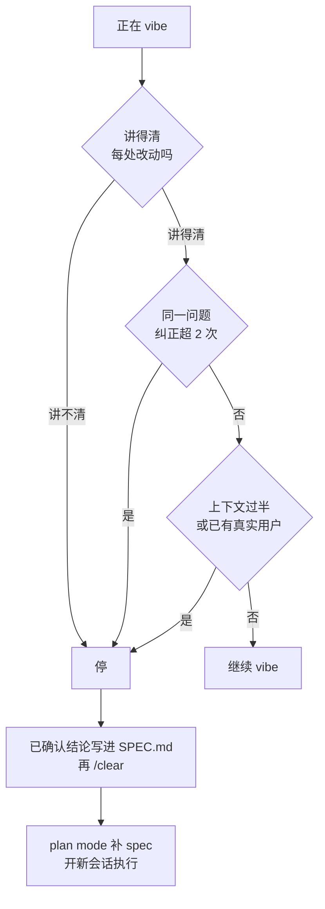

# 023. Vibe coding 为什么会翻车？什么时候必须停下来规划？

**一句话**：命中「讲不清这段代码」或「同一问题纠正超过两次」这类信号就立刻停手 —— 把已确认的结论写进 `SPEC.md`，`/clear`，进 plan mode 补一份带验收标准的 spec，再开新会话执行。

## 30 秒结论

| 你看到的 | 立刻做 | 不想再犯 |
|---|---|---|
| 这段 AI 写的代码，你没法逐行向别人讲明白 | 停手，补 spec 再继续 | 讲不清就不 commit |
| 同一个问题已经纠正 Claude 超过 2 次 | 已确认的结论写进 `SPEC.md`，`/clear` 重开 | 把「两次」设成硬闸 |
| 报错就原样粘回去，修好了也说不出为什么 | 进 plan mode 做根因分析，别继续打补丁 | 不用 prompt 糊过去 |
| 它引入了一个你说不出「为什么选它」的库或架构 | 停，这类决定写进 spec 由你拍板 | 架构决定不交给 vibe |
| 修一个 bug 引出两个新 bug | 停，回滚到上一个绿色 commit 重来 | 每块改动配一条验收命令 |
| `/context` 过半，AI 开始违反早先说好的约定 | `/clear`，约定固化进 CLAUDE.md / spec | 长任务靠书面上下文交接 |
| 项目从「周末玩具」变成有真实用户 | 换范式：spec 先行 | 上线前先划这条线 |



## 怎么做

### 先定性：这个项目还能不能 vibe

| 项目特征 | 决策 | 理由 |
|---------|------|------|
| 一次性脚本、探索性 POC、返工成本约等于 0 | 随便 vibe | Karpathy 自己就把它限定在「用完即扔的周末项目」 |
| 单功能、0.5–2 天、你自己能完全看懂 | 可以 vibe，但要配验收检查 | 满足黄金法则，加个通过/失败检查兜底 |
| 中型功能、超过 3 天、跨多文件多层 | 必须切 spec | 越过复杂度悬崖，vibe 必然绕成乱麻 |
| 有真实用户、生产代码、要对结果负责 | 不许纯 vibe | 讲不清的代码不进生产 |
| 上下文已过半，或同一问题纠正超两次 | 立刻停 | 上下文已被失败尝试污染 |

### 信号触发之后的三步

别在同一个被污染的会话里硬刚。

**第一步：先抢救，再 `/clear`。**

官方的判据很硬：同一个问题在一个会话里纠正 Claude 超过两次，说明上下文已经被失败的尝试塞满，该 `/clear` 重开，并用一个吸收了新认知的、更具体的 prompt 重来[^1]。

但 `/clear` 之前先把这三样写进 `SPEC.md` 或 `CLAUDE.md`：哪些方案试过不行、哪些约束必须满足、已经拍板的架构决定和理由。这些是用真金白银换来的认知，清了就没了。

**第二步：进 plan mode 补 spec。**

连按两次 `Shift+Tab`（或 `claude --permission-mode plan`），先让它只读探索相关代码、把它对问题的理解写出来给你看 —— 这一步经常直接暴露 vibe 阶段积累的误解。然后用访谈式 prompt 把需求逼问清楚：

```
我想做 [简要描述]。用 AskUserQuestion 工具详细地访谈我。
问技术实现、UI/UX、边界情况、顾虑和权衡。别问显而易见的问题，
挖那些我可能没考虑到的难点。
一直问到把所有点覆盖完，然后写一份完整的 spec 到 SPEC.md。
```

spec 要回答五件事：做什么、输入输出契约、验收标准、约束与边界、明确不做什么。其中验收标准必须是可执行的通过/失败判断 —— 这就是 021 篇的最小 PRD 五要素。

vibe 翻车的直接机制就在这里：没有能跑的检查时，「看起来做完了」是 AI 唯一可用的停止信号[^1]。补上检查，它才会迭代到真的通过。

**第三步：开新 session，带着书面 spec 执行。**

别在原会话继续。新 session 上下文干净，加上书面 spec 作参照，能避开长会话里累积的失败尝试。

**怎么确认这一轮止血成功**：新会话开起来后，先让它复述一遍「这次要做什么、做完怎么验」。它复述的内容和 `SPEC.md` 对得上，才开始写代码；对不上说明 spec 还不够自包含，回去补。

需求文档要写多详细、要不要加码到全流程 SDD，见 [#021 动手前到底要不要先写 PRD](./021-动手前要不要写PRD.md)。

<details>
<summary>三档「从 vibe 切 spec」姿势</summary>

| 档位 | 怎么做 | 适用 | 仪式感 |
|------|-------|------|--------|
| **轻量** | `/clear` + plan mode 手写 `SPEC.md` | 单功能、信号刚触发 | 低，零额外工具 |
| **技能链** | superpowers 的 `brainstorming → writing-plans` | 需求还说不清「做完是什么样」 | 中，装插件 |
| **全流程 gated** | GitHub Spec Kit 的 `/speckit.*` 命令链 | 项目已大到必须团队协作 | 高，四阶段带关卡 |

绝大多数「个人项目 vibe 翻车」用第一档就够。Spec Kit 的重量见 021 篇的分析，小任务用它过重。

</details>

<details>
<summary>边缘场景：老板看过 demo，以为功能已经做完了</summary>

上面几节解决「你自己什么时候该停」。另一种情况是你已经决定停下来补 spec，但老板不同意 —— 他上周看过那个 vibe 出来的 demo，问「不是已经能跑了吗，怎么还要两个月」。

**先承认对方没错，是「能跑」的定义不同。** demo 确实能跑，跑的是被挑好的那条路径：一个账号、一份干净数据、你演示时点的那几个按钮。产品要跑的是所有路径。你要争的不是「demo 是假的」，而是「demo 覆盖的是 happy path，剩下的工作量在别的地方」。

**给一个可以记住的比例。** 有开发者把自己一个上线项目的工时全程记了下来：vibe 出可用原型约 1 小时，做到真能上线约 100 小时[^2]。多出来的 99 小时去向很清楚 —— UI 在移动端的实际排版、把核心生成逻辑跑 200 次找边界情况、S3/Lambda/环境变量/域名这类基础设施、限流和并发、权限收口、以及上线当天的退款与救火。没有一项是「写业务代码」。

配合 Tom Cargill 的老规律讲给非技术管理者最有效：前 90% 的代码占掉前 90% 的时间，剩下 10% 的代码占掉另外 90% 的时间。AI 压缩的是第一个 90%，第二个 90% 一点没动。

**把 demo 定性成「一次需求确认」，不是「一次交付」。** 文档和线框图很难把一个功能讲明白，做个原型能让一大群人瞬间理解要做什么[^3]。同一串讨论里也有反面的补充：真正难的从来不是写代码，是写错了代码 —— 错的需求、错的用户、没人在乎的场景。合起来正好是你要的话术：demo 的价值是把错的需求提前暴露掉，这个价值很大，但它兑现的是需求确认，不是工程交付。

**三句可以直接说出口的话：**

1. 「这个 demo 帮我们确认了要做什么，我按它写一份验收清单，你签字，我按清单排期。」
2. 「demo 现在支持 1 个用户、1 份测试数据、我演示的那 3 个操作。要支持真实用户，缺的是 A/B/C。」A/B/C 换成你项目里的实际项，越具体越好。
3. 「我可以下周就上线现在这版，前提是我们接受它挂了不保证多久能修。」把风险明码标价交回决策者，比说「不行」有效。

**别在会上现场改 demo。** 当场加个字段就跑通了，对方对成本的估计只会更低。要改带回去，下次汇报时同时给出「这个改动实际花了多久」。

</details>

## 为什么

### vibe coding 是「不验证就接受」，不是「用 AI 写代码」

Karpathy 2025 年 2 月造这个词时给的定义是：完全交给感觉，忘掉代码的存在 —— 永远点 `Accept All`、不看改动、报错就原样粘回去[^4]。他同时画了生死线：这套玩法只适合用完即扔的周末项目。

Simon Willison 的澄清更直接：vibe coding 跟「用 LLM 帮忙写代码」不是一回事，它特指「用 LLM 造软件但不 review 它写的代码」[^5]。所以用 AI 写代码但看懂每一行改动，不算 vibe coding。翻车的根因是越过那条线：把为一次性脚本设计的姿势，用到有真实用户、需要长期维护的项目上。

从 Karpathy 那段自述能反推出三个失败模式：

- **先信任后验证的鸿沟。** 点 `Accept All` 却不看改动，等于放弃第一道验证。官方把这条列为常见失败模式：Claude 会写出看起来合理、但没处理边界情况的实现[^1]。
- **上下文腐烂。** 报错就粘回去、「通常就修好了」，修的是症状不是根因，修过的痕迹全堆在上下文里。上下文填满后，AI 开始遗忘早期决策 —— 官方原话是上下文窗口填得很快、越填性能越差，它是最需要管理的资源[^1]。
- **用 prompt 糊过去。** 「LLM 修不好我就绕过去，或者让它随便改到问题消失」，社区把这种行为叫 prompt through。每一次糊过去都留下一笔没有任何文档记录的技术债。

### 是断崖，不是滑坡

「vibe 越写越乱」不是线性退化：临界点之前一切顺利，越过之后迅速失控。

原因是「能 vibe 得动」依赖一个隐含前提：当前会话的上下文，加上你脑子里记着的东西，能共同覆盖整个项目状态。项目小的时候前提成立；项目一旦大到你必须翻代码才能回答「这个功能现在走哪条路径」，前提就瞬间崩塌，你和 AI 同时失去全局视图，之后每次改动都是盲改。

Cursor CEO Michael Truell 的说法是同一个机制：闭着眼不看代码，让 AI 在摇晃的地基上一层层往上盖，最后整个东西开始垮[^6]。地基的脆弱是一点点累积的，崩塌是一瞬间的。社区的描述也一致：AI 会把自己绕成一团解不开的乱麻，做出让代码库无法维护的架构决定 —— 到那一步不是某一行代码错了，而是架构的决策链断了，无法局部修复。

换更强的模型救不了这个。中文社区的分析说得准：一周以上的复杂任务，一次性生成的 spec 几乎必然失效，这不是模型能力问题，而是问题复杂度的自然结果。

### 官方的答案是把探索和执行分开

vibe 翻车不等于 AI coding 有罪，问题在「跳过规划直接执行」。官方给的解法是把两步物理隔离：直接开写会产出「解错了问题」的代码，用 plan mode 把探索和执行分开[^1]。「先探索、再规划、再写码」是官方工作流的第一条。

Simon Willison 给了最可操作的停止判据 —— 生产级 AI 辅助编程的黄金法则：如果一段代码我没法向别人准确解释它在做什么，我就不会把它提交进仓库[^5]。这条把「能不能继续 vibe」变成一个你随时能自问的问题。

> 个人观点（小C）：先分清你现在是探索期还是交付期。探索期允许 vibe，甚至鼓励 vibe，因为你要的就是快速看到 AI 怎么理解这个问题，半成品本身就是探索素材。一旦进入「要上线、有真实用户、要对结果负责」的交付态，黄金法则立刻生效：讲不清的代码不许 commit。

## 别这么干

- **把讲不清的代码 commit 进仓库。** 违背黄金法则。判据不是「你觉得没问题」，是「你能不能向同事逐行讲明白它在做什么」。
- **把周末项目的姿势用到生产代码。** Karpathy 原文自己限定了「用完即扔」。越线就是摇晃的地基上一层层加盖。
- **同一个问题纠正超过两次还不 `/clear`。** 上下文已被失败尝试污染，继续只会越改越错。两次是上限，第三次直接重开。
- **用 prompt 糊过去而不找根因。** 每次糊过去都留一笔无文档的技术债，累到复杂度悬崖就是断崖崩盘。
- **拿 vibe 出来的 demo 汇报「功能已完成」。** demo 跑的是你挑好的那条路径。汇报时定性成「需求已确认」，别定性成「功能已完成」。

<details>
<summary>换成 Cursor / Copilot / Gemini CLI 呢</summary>

| 维度 | Claude Code | Cursor | GitHub Copilot | Gemini CLI |
|------|------------|--------|----------------|------------|
| **「防 vibe」的原生机制** | plan mode（只读强制）+ `/clear` + AskUserQuestion 访谈 | `.cursor/rules` + chat 引导，无原生只读强制 | `agents.md` + Spec Kit `/speckit.clarify` | Spec Kit 集成 |
| **从 vibe 切 spec 的入口** | 连按两次 `Shift+Tab` 进 plan mode | 依赖人工切换 + rules | `/speckit.specify` | `/speckit.specify` |
| **上下文管理** | 官方明确「上下文窗口是最重要的资源」+ 两次纠正即 `/clear` | Composer 上下文压缩（社区反馈会引发死循环） | Spec Kit 把上下文固化进 spec 文档 | Spec Kit 同上 |

vibe coding 翻车是工具无关的现象 —— Cursor 被称作「vibe coding 的摇篮」，它的 CEO 反而最先出来警告这套玩法的危险。差异在各家「防 vibe 刹车」的成熟度：Claude Code 的只读 plan mode 加 `/clear` 加访谈式提问，把「停下来规划」做得最顺；Cursor 更多依赖人工纪律；Copilot 和 Gemini CLI 靠 Spec Kit 的关卡流程。

</details>

## 延伸

**相关文章**

- [#021 动手前到底要不要先写 PRD / 需求文档？写多详细才够？](./021-动手前要不要写PRD.md) —— 本篇给「必须停下来」的信号，021 给「停下来之后文档写到什么详细度」
- [#022 怎么把一个大需求拆成 AI 能一次做对的子任务？](./022-大需求怎么拆子任务.md) —— vibe 翻车的常见根因之一是任务没拆，022 讲怎么拆
- [#031 plan → execute → review 的正确循环怎么做？](../04-执行工作流/031-plan-execute-review循环.md) —— 本篇讲何时从 vibe 切 spec，031 讲 spec 定了之后怎么一轮轮执行
- [#012 上下文窗口要爆了怎么办？](../02-上下文工程/012-上下文窗口要爆了.md) —— 本篇「上下文过半」这条信号的机制层展开在 012

**参考资料**

- [Andrej Karpathy: vibe coding 定义推文 — X/Twitter](https://x.com/karpathy/status/1886192184808149383) —— 支撑本篇对 vibe coding 的定义与「只适合用完即扔的周末项目」这条生死线（一手，2025-02-02）
- [Best practices for Claude Code — Claude Code Docs](https://code.claude.com/docs/en/best-practices) —— 支撑「先探索再规划再写码」「上下文越满性能越差」「看起来做完就停」「同一问题纠正超两次即 `/clear`」「先信任后验证的鸿沟」五条论断（官方，2026-06）
- [Vibe coding — Simon Willison](https://simonwillison.net/2025/Mar/19/vibe-coding/) —— 支撑「vibe coding ≠ 用 LLM 写代码」的澄清与生产环境黄金法则（社区权威，2025-03）
- [Cursor CEO warns vibe coding builds shaky foundations — Fortune](https://fortune.com/article/cursor-ceo-vibe-coding-warning/) —— 支撑「摇晃的地基上一层层加盖，最后垮掉」这段 Michael Truell 的发言（一手新闻，2025-12）
- [India Today: Cursor CEO says AI vibe coding is not good coding](https://www.indiatoday.in/technology/news/story/cursor-ceo-says-ai-vibe-coding-is-not-good-coding-everything-will-start-to-fall-apart-soon-2841988-2025-12-26) —— 同一段发言的二手转述，用于交叉印证（新闻，2025-12）
- [Spec，真的能解决 AI Coding 的问题吗？ — V2EX 1183614](https://www.v2ex.com/t/1183614) —— 支撑「超过一周的复杂任务，一次性 spec 几乎必然失效，这是复杂度的自然结果而非模型能力问题」（社区，2026-01）
- [The 100 hour gap between a vibecoded prototype and a working product](https://kanfa.macbudkowski.com/vibecoding-cryptosaurus) —— 支撑「原型约 1 小时、上线约 100 小时」这组工时数字及 99 小时的去向清单（实践，2026-03；[HN 47386636](https://news.ycombinator.com/item?id=47386636)）
- [My spicy take on vibe coding for PMs](https://www.ddmckinnon.com/2026/02/11/my-%f0%9f%8c%b6-take-on-vibe-coding-for-pms/) —— 支撑「把原型定位成需求确认手段而不是交付物」，及 HN 讨论区「难的不是写代码，是写错的代码」（社区，2026-02；[HN 47240736](https://news.ycombinator.com/item?id=47240736)）
- [Does "vibe coding" hit a massive wall once your project gets big? — r/cursor 1q1v99l](https://www.reddit.com/r/cursor/comments/1q1v99l/does_vibe_coding_hit_a_massive_wall_once_your/) —— 支撑「绕成一团乱麻、做出让代码库无法维护的架构决定」这段症状描述（社区，2025；Reddit 反爬，引文来自搜索片段）
- [Vibe coding is a trap in the long run — r/cursor 1j6ufkg](https://www.reddit.com/r/cursor/comments/1j6ufkg/vibe_coding_is_a_trap_in_the_long_run/) —— 支撑 prompt through 这个说法的命名出处（社区，2025；Reddit 反爬，片段级）
- [The AI Coding Death Spiral — r/vibecoding 1m37cyl](https://www.reddit.com/r/vibecoding/comments/1m37cyl/the_ai_coding_death_spiral/) —— 支撑「为速度而来、为 debug 地狱而留」的死亡螺旋描述（社区，2025；Reddit 反爬，片段级）
- [I Tried Vibe Coding and I Need Advice — r/webdev 1qdbsyf](https://www.reddit.com/r/webdev/comments/1qdbsyf/i_tried_vibe_coding_and_i_need_advice/) —— 支撑「项目超出单次上下文窗口后极易发生上下文腐烂」（社区，2025；Reddit 反爬，片段级）
- [Cursor CEO says vibe coding will make your app crumble — r/ExperiencedDevs 1q75d1w](https://www.reddit.com/r/ExperiencedDevs/comments/1q75d1w/cursor_ceo_says_vibe_coding_will_make_your/) —— 开发者社区对 Truell 发言的讨论，主源仍为 Fortune（社区，2025-12）

[^1]: [Best practices for Claude Code](https://code.claude.com/docs/en/best-practices)（官方，2026-06）：直接开写会产出解错问题的代码，用 plan mode 把探索和执行分开；上下文窗口填得快、越满性能越差；同一问题纠正超过两次就 `/clear` 重开；没有能跑的检查时「看起来做完」是唯一信号；常见失败模式含「先信任后验证的鸿沟」。
[^2]: [The 100 hour gap between a vibecoded prototype and a working product](https://kanfa.macbudkowski.com/vibecoding-cryptosaurus)（实践，2026-03）：作者记录单个上线项目的完整工时，原型约 1 小时、上线约 100 小时，并列出 99 小时的去向。这是单人单项目的记录，不是统计结论。
[^3]: [My spicy take on vibe coding for PMs](https://www.ddmckinnon.com/2026/02/11/my-%f0%9f%8c%b6-take-on-vibe-coding-for-pms/)（社区，2026-02）：文档和线框图很难把功能讲明白，原型能让一大群人瞬间理解要做什么。
[^4]: [Andrej Karpathy 推文](https://x.com/karpathy/status/1886192184808149383)（一手，2025-02-02）：完全交给感觉、忘掉代码存在；永远 Accept All、不看 diff、报错原样粘回；并限定「用完即扔的周末项目还行」。
[^5]: [Vibe coding — Simon Willison](https://simonwillison.net/2025/Mar/19/vibe-coding/)（社区权威，2025-03）：vibe coding 指「用 LLM 造软件但不 review 它写的代码」，与「用 LLM 辅助写代码」不是一回事；生产级黄金法则是讲不清的代码不进仓库。
[^6]: [Cursor CEO warns vibe coding builds shaky foundations — Fortune](https://fortune.com/article/cursor-ceo-vibe-coding-warning/)（一手新闻，2025-12）：Michael Truell 在 Fortune Brainstorm AI 大会的发言。

---

<sub>难度 中级 · 场景题 · 主线 Claude Code，横向 Cursor / Copilot / Gemini CLI</sub>

<sub>**时效**：Karpathy 原推、Simon Willison、V2EX、India Today、官方 best-practices 于 2026-07-18 核实存活；「demo 到产品的预期差」一节的两条 HN 外链与原文于 2026-08-03 核实。**已知不确定**：Fortune 原文返回 403（付费墙或反爬），Truell 引语另有 India Today 转述交叉印证；几条 Reddit 出处受反爬限制，引文来自搜索片段，正文只当佐证。「原型 1 小时 / 上线 100 小时」是单人单项目记录，不是统计值。**易变**：Spec Kit 的 `/speckit.*` 命令名随版本变化；信号清单与决策框架不依赖具体版本。</sub>

> 本篇个人实践（L4）：`[待补：BOSS 的实战经验——你 vibe coding 翻过车吗？在什么项目、什么复杂度拐点翻的？你个人用 Simon Willison 黄金法则还是「两次纠正即停」？从 vibe 切 spec 你通常用 plan mode 还是直接手写 SPEC.md？]`
