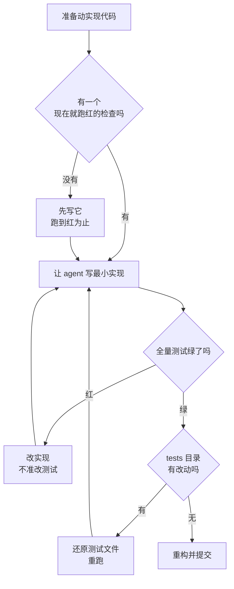

# 030. AI 写的测试一跑就过、还偷偷删测试怎么办？（TDD 在 AI coding 里怎么做）

**一句话**：测试不能和实现出自同一轮生成 —— 你先给出一个现在就跑红的检查，agent 只负责把它变绿，过没过由退出码判定，不由它自己声称。

## 30 秒结论

| 你看到的 | 立刻做 | 不想再犯 |
|---|---|---|
| 测试全绿但线上崩，且测试文件和实现在同一个 commit 里首次出现 | 删掉这批测试，从 RED 重来 | 测试先落盘、先跑红，再让 agent 碰实现 |
| `git diff --stat -- tests/` 显示测试文件有改动或被删 | `git checkout -- tests/` 还原后重跑 | prompt 写死「失败时改实现，禁止动 tests/」 |
| agent 回复里只有「已验证 / 测试通过」，没有命令行和输出 | 要它重跑并贴原始输出 | 配 `Stop` hook，用退出码闸门 |
| CLAUDE.md 里写了「遵循 TDD」，行为没任何变化 | 换成具体命令 + 具体要变绿的测试文件路径 | 流程说教对模型无效，要给可跑的上下文 |



## 怎么做

核心分工只有一句：你掌控测试（契约），agent 掌控实现（填空）。

### 最小可用：一段 prompt 走完 RED → GREEN → VERIFY

```
给 src/utils/email.ts 实现 validateEmail。

先写测试（vitest），覆盖：
- user@example.com → true
- invalid → false
- user@.com → false
- "" → false

要求：
1. 先写测试，运行 npm test，把失败输出原样贴给我
2. 失败原因必须是「validateEmail is not a function」这类「函数不存在」，
   不是 SyntaxError、import 路径错、模块找不到
3. 写最小实现让测试通过，不要加这四条用例之外的功能
4. 再跑一次 npm test，贴通过的完整输出
5. 中途测试失败时改实现代码，禁止修改或删除 tests/ 下任何文件
```

### 第 0 步：先产出一个现在就失败的检查（你来做）

形态按性价比选，不必是单元测试：

- 纯逻辑函数：单元测试（pytest / vitest / jest）。
- API 行为：契约测试或集成测试，写成「输入 → 预期输出」。
- UI 改动：「实现后截图，与设计稿对比，列出差异并修复」。
- 没有测试框架：构建退出码、代码检查（lint）、或一个 `diff` 对比脚本。

**怎么判断这一步做对了**：把这个检查跑一遍，退出码非 0。如果它现在就是绿的，或者你根本写不出这个检查，说明验收标准还没细到能交给 agent，先回去补规格（见 [031 篇](./031-plan-execute-review循环.md)）。

### 第 1 步：RED —— 要它跑给你看，不是说给你听

让 agent 写测试后**运行**，把失败输出原样贴出来。你要核对的是失败原因：`AssertionError` 或「函数未定义」算合格；`SyntaxError`、`ModuleNotFoundError`、import 路径写错则是测试本身写坏了，重来。

### 第 2 步：GREEN —— 只写刚好能过的最小实现

指令写明：不加额外功能、不顺手重构。测试失败时改实现，不改测试 —— 这句必须写进 prompt，因为改测试去迁就实现是 agent 的默认倾向[^2]。

### 第 3 步：VERIFY —— 要证据，不要断言

要求 agent 贴三样：测试通过的原始输出、它实际跑过的命令、UI 场景再加结果截图。审查证据比你自己重跑一遍快[^1]。

长任务再加一层：让一个全新上下文的子 agent 只看 diff 和验收标准来挑刺。它看不到产生这次改动的推理过程，所以不会替它辩护。写代码的上下文和打分的上下文必须分开。

### 第 4 步：REFACTOR —— 全绿才重构，且测试文件零改动

```
现在重构 src/utils/email.ts：去重、改名、抽小函数。约束：
1. 不准修改 tests/ 下的任何文件
2. 每完成一处改动就跑一次 npm test，贴出输出
3. 任何一次出现红色，立刻回滚这一处改动，不要改测试去迁就
4. 结束时贴 `git diff --stat`，确认 tests/ 下 0 changed
```

**怎么判断做对了**：`git diff --stat -- tests/` 输出为空，且 `npm test` 退出码 0。

### 第 5 步：把回归网留在仓库里

1. 测试和实现进同一个 commit，否则下次 `/clear` 之后这层保护就没了。
2. 把测试命令写进 CLAUDE.md：

```markdown
# Testing
- 全量：`npm test`；单文件：`npm test -- tests/email.test.ts`
- 提交前必须 `npm test && npm run lint` 全绿
- 测试失败时修实现，禁止修改或删除 tests/ 下的文件
```

**怎么判断做对了**：开一个新会话问「我们项目怎么跑测试？」，agent 直接回出上面的命令，而不是去翻 package.json 猜。

### 让验证硬闭合：四个档位

| 档位 | 机制 | 适用 |
|------|------|------|
| 单 prompt 内 | 让 Claude 在同一条消息里跑检查并迭代 | 任何任务，今天就能用 |
| 跨会话 | 设成 `/goal` 条件，每轮后由独立评估器复查 | 中等长度任务 |
| 确定性闸门 | `Stop` hook 跑检查脚本，退出码 2 就不让它停 | 无人值守任务 |
| 写入前拦截 | tdd-guard 插件，PreToolUse 拦住「没有失败测试就写实现」 | 想把 TDD 变成硬约束 |
| 第二意见 | 验证子 agent，换新上下文来反驳结果 | 正确性要求高 |

tdd-guard 值得单独说一句，因为它堵的正是上面第一种作弊模式，而且不靠模型自觉：三条命令装好 —— `/plugin marketplace add nizos/tdd-guard`、`/plugin install tdd-guard@tdd-guard`、`/tdd-guard:setup`，支持 vitest / jest / pytest / PHPUnit / Go / Rust。**怎么确认生效**：不写任何测试，直接让 Claude 新建一个实现文件，写入应当被拦下并提示先补失败测试；它照常写进去了，说明 setup 没跑完或测试框架没被识别。

<details>
<summary>用 /goal 把验收设成会话级停止条件（含条件写法与三个坑）</summary>

`/goal` 后面直接跟条件，回车即刻开跑，每轮结束由一个独立评估器复查，没达标自动开下一轮。命令不存在说明版本太旧，升级 Claude Code 即可。

```
# 设置
/goal tests/email.test.ts 全部通过（npm test 退出码 0），且 npm run lint 无报错，过程中不修改 tests/ 下任何文件

# 查看：显示条件、已跑轮数、token 花费、评估器最近一次的判定理由
/goal

# 取消：stop / off / reset / none / cancel 都是别名
/goal clear
```

条件三要素：一个可测量的终态、一句「怎么证明」（如「`npm test` 退出 0」）、以及不许改动什么。上限 4000 字符。想限时长就加一句 `or stop after 20 turns`。

三个坑：

1. 评估器**不跑命令、不读文件**，只看 Claude 在对话里已经贴出来的内容。所以条件必须写成「输出能证明的东西」，这也是必须要求 agent 贴测试输出的原因。
2. `/goal` 不改权限。**2026-08-14 起 Pro / Max / Team 的新会话默认就是 auto 档**，`/goal` 直接就能无人值守跑；在这之前，以及你自己设过 `defaultMode`、组织托管了默认档、或走 Bedrock / Vertex / Foundry / 网关通道的会话，起始档仍是 Manual，每个工具调用照样停下来问你[^7]。**开跑前先 `/status` 看一眼当前档位**，别假设。
3. **怎么确认生效**：界面上出现 `◎ /goal active` 指示器并显示已运行时长。

</details>

<details>
<summary>用 Stop hook 做确定性闸门（脚本 + 配置 + 验证步骤）</summary>

`/goal` 靠模型判定，Stop hook 靠退出码判定，后者是确定性的。Claude 每次想结束回合时跑你的脚本，退出码 2 就把这一轮挡回去。

**第一步：写检查脚本** `.claude/hooks/check-tests.sh`（记得 `chmod +x`）。

```bash
#!/bin/bash
# 退出 0 = 允许 Claude 结束；退出 2 = 挡住，让它继续修

input=$(cat)
# 防死循环：如果本次已经处在 Stop hook 触发的续跑里，直接放行
if echo "$input" | jq -e '.stop_hook_active == true' > /dev/null 2>&1; then
  exit 0
fi

if ! { npm test --silent && npm run lint --silent; }; then
  # stderr 的内容会作为反馈回灌给 Claude，写清楚要它干什么
  echo "测试或 lint 未通过。请修复实现代码，禁止修改或删除 tests/ 下的文件。" >&2
  exit 2
fi

exit 0
```

**第二步：配 `.claude/settings.json`**

```json
{
  "hooks": {
    "Stop": [
      {
        "hooks": [
          {
            "type": "command",
            "command": "$CLAUDE_PROJECT_DIR/.claude/hooks/check-tests.sh",
            "timeout": 300,
            "statusMessage": "正在校验测试与 lint..."
          }
        ]
      }
    ]
  }
}
```

三个字段说明（截至 2026-08 的官方 hooks 文档）：

- `Stop` 事件**不支持 `matcher`**，写了会被忽略，所以上面直接省略。
- `type` 除 `"command"` 外还支持 `"prompt"`（让模型判定），确定性闸门必须用 `"command"`。
- `timeout` 单位是秒，command 类 hook 默认 600 秒；测试慢的项目要往上调，别让 hook 自己超时。

**第三步：确认生效**（别信配置文件，跑一遍）

1. 在 Claude Code 里运行 `/hooks`，`Stop` 下应能看到你这条命令。
2. 手动把一个断言的期望值改错，然后让 Claude 做一件小事并结束回合。
3. 预期现象：它不会停，终端显示 statusMessage，紧接着拿着 stderr 那句话继续去修实现。
4. 直接验脚本：`echo '{}' | .claude/hooks/check-tests.sh; echo "exit=$?"`，测试挂着时输出 `exit=2`，全绿时输出 `exit=0`。

**「连续 8 次」是什么意思**：连续 8 次被挡之后，Claude Code 会覆盖这个 hook 强行结束回合[^5]。所以它不是死循环保险丝，是「最多再逼它修 8 轮」。如果回合结束了但测试仍是红的，不是 hook 没配好，是撞到了这个上限 —— 通常意味着 agent 卡在同一个错误里出不来，该你介入。

</details>

<details>
<summary>superpowers 的 test-driven-development 技能：把铁律变成强制流程</summary>

装了 `obra/superpowers` 插件后，这个技能会在任何新功能或修 bug 之前强制走一遍 RED→GREEN→REFACTOR。两条硬约束：

1. **铁律**：没有失败测试就不准写生产代码。先写了实现，删掉重来。
2. **验证 RED 和验证 GREEN 都是强制项**：必须真跑、真看输出，不接受「声称通过」。

它还维护一张「常见借口」表，用来识别 agent 的偷懒话术：「这太简单了不用测」「我等下再测」「删掉太浪费了」—— 每一条对应同一个处理：删掉重来。

配置与写法见 [033 篇](./033-Skill与superpowers怎么用.md)。

</details>

## 为什么

### 测试是给 agent 的停止条件，不是事后验证

Anthropic 把「给 Claude 一个能跑的检查」列为头号最佳实践：没有它，「看起来做完了」就是 agent 唯一能依赖的停止信号，验证的活就全落到你头上[^1]。

所以 AI 时代的「测试」比传统单测宽得多：测试套件、构建退出码、lint、截图对比、对照参考文件的脚本，只要能产出「过或不过」，都算。别把它窄化成「写 pytest」。

### agent 天然想先写代码、再补一个刚好能过的测试

Kent Beck 用 AI agent 编码后把 TDD 称为「超能力」，同时点破两个反模式：它想先写代码再写能通过的测试；而且他很难阻止 agent 直接删掉失败的测试来让套件变绿[^2]。

Augment Code 给这个失效模式起了名字：**测试反转（test inversion）** —— 当 AI 同时生成代码和测试时，产出的是同义反复的测试，只确认「实现做了什么」，系统真正的需求根本没被验证[^3]。

「改测试」只是最容易发现的那一种。社区把 agent 绕过 TDD 的路数归成四类，看清楚它们才知道为什么单靠「commit 一个失败测试」堵不住[^6]：

| 作弊模式 | 症状 | 堵法 |
|---|---|---|
| 改测试对齐错误实现 | 实现跑不通，它回头改断言 | commit 失败测试 + 禁改 `tests/` + diff 校验 + tdd-guard |
| 单 context 串味 | 测试和实现在同一轮里写，测试潜意识贴着已想好的实现 | 写测试、写实现、重构各用独立上下文的子 agent |
| 水平切片 | 一次写完 10 个测试再一次实现，测的是「想象中的行为」 | 垂直切片：1 个测试 → 1 段实现 → 下一个 |
| 自我祝贺式断言 | 同一个 agent 既写代码又判自己合格 | 独立评审 agent，全新上下文，只看 diff 对照验收标准 |

后三种在你的 `git diff` 里看不出任何异常 —— 测试文件干干净净、全绿，问题在于这批测试从一开始就没有独立于实现存在过。

> 个人观点（小C）：这解释了为什么社区里很多人说「AI 写的测试都是假测试」。根因不是模型不行，是默认流程让 agent 既当运动员又当裁判。同一个上下文里写测试和写实现，测试必然贴合实现。唯一的解法是让测试先于实现存在，并强制它亲眼看着测试失败。

### 只在 prompt 里喊「请用 TDD」，至少对小模型会适得其反

有一项研究直接挑战了「在 CLAUDE.md 写一句遵循 TDD 就算配好了」的做法：只给 TDD 流程指令、不告诉模型「该验哪些测试」，回归率从基线 6.08% 被推高到 9.94%，比不干预还差；先分析改动会影响哪些测试、再把这批测试喂给模型，回归率降到 1.82%[^4]。**这三个数字只在 SWE-bench Verified 上的开源小模型上验证过，且是单一来源，不能当成「所有模型都这样」的普适结论** —— Opus / Sonnet 这一级模型上没有同类实验数据。

能从它推出来的只有一条弱结论：流程说教是所有干预里最不可靠的一种，而「改动会影响哪些测试」这类具体上下文很可能更有效。所以别把赌注押在 CLAUDE.md 的一句口号上，给出具体要跑的命令和具体要变绿的测试文件、让它真跑真贴输出，成本更低也更稳 —— 上面每一步都围绕这一点设计。

## 别这么干

- ❌ **让 agent 写完代码再补测试。** 事后测试一跑就过，证明不了任何事，而且天然贴合它自己的实现。
- ❌ **测试失败时让它改测试去迁就实现。** 包括直接删测试。prompt 里必须写死：改实现，不动 `tests/`。
- ❌ **接受「已通过」这三个字。** 要原始输出、要命令行。没有输出就等于没跑。
- ❌ **只在 prompt 里喊「请用 TDD」。** 至少在开源小模型上，光喊反而增加回归。要给命令和测试文件路径。
- ❌ **只防「改测试」这一种作弊。** 串味、水平切片、自我祝贺三种在 diff 里看不见，要靠上下文隔离和独立评审。
- ❌ **写代码的上下文自己给自己打分。** agent 自查会顺着刚才的思路找理由，长任务要用全新上下文的子 agent 做对抗式审查。

<details>
<summary>换成 Cursor / Copilot 呢</summary>

| 维度 | Claude Code | Cursor | GitHub Copilot |
|------|------------|--------|----------------|
| **TDD 内置程度** | 官方最佳实践明确推荐「先写失败测试」；superpowers 技能可强制 | 靠 `.cursor/rules` 引导；社区有 TDD 自定义规则 | 无内置 TDD 工作流；靠 instructions 文件 |
| **验证闭合机制** | `/goal` + `Stop` hook（确定性闸门）+ 验证子 agent | 无原生 hook 闸门；靠 agent 自检 | 无 |
| **对抗式验证** | 原生子 agent / 双 session 写测试与审查分离 | Composer 支持多文件，但无独立打分者 | 无 |
| **测试作为停止条件** | 官方范式：把「实现后跑测试」写进 prompt 模板 | 用户自建 | 无 |

共性：所有工具的 agent 都有「先写代码再补测试」的倾向，Kent Beck 的观察适用于全部 LLM agent。差异在强制力 —— Claude Code 的 hook 加子 agent 组合目前闭合得最硬，Cursor 和 Copilot 更依赖人工纪律。

Cursor 上最接近的做法是在 `.cursor/rules/` 下放一个 `.mdc` 规则文件。frontmatter 三个字段：`description`（让 agent 自行判断何时套用）、`globs`（按文件路径自动挂载）、`alwaysApply`（设 `true` 时每次会话都加载，此时另外两个字段被忽略）。

```markdown
---
description: TDD 红绿重构工作流
alwaysApply: true
---
# TDD
- 写实现代码之前，先写一个会失败的测试，并运行它、贴出失败输出。
- 确认失败原因是「功能未实现」，不是拼写或 import 错误。
- 只写刚好能让测试通过的最小实现，不要顺手加功能。
- 测试失败时修实现代码。禁止修改、跳过或删除任何已有测试。
- 结束前重新运行测试，贴出通过的命令与输出，不要只说「已通过」。
```

两个已知限制：规则在启动时缓存，改完 `.mdc` 要重开窗口才生效；而且它和 CLAUDE.md 一样是建议性的，没有 Stop hook 那种退出码闸门。

</details>

<details>
<summary>用属性测试抓「语义漂移」（签名没变、行为变了）</summary>

agent 重构最容易引入语义漂移：函数签名没变，行为悄悄变了。单元测试和类型检查都抓不住，需要属性测试或契约边界测试。

属性测试指的是不写具体用例，而是描述「对任意输入都该成立的性质」，由框架自动生成大量输入去撞。常用框架（截至 2026-08）：Python 用 [Hypothesis](https://hypothesis.readthedocs.io/)，JS/TS 用 [fast-check](https://fast-check.dev/)，Java 用 jqwik。

```ts
import fc from 'fast-check';
import { normalizeEmail } from '../src/utils/email';

test('normalizeEmail 是幂等的', () => {
  fc.assert(fc.property(fc.emailAddress(), (e) => {
    expect(normalizeEmail(normalizeEmail(e))).toBe(normalizeEmail(e));
  }));
});
```

跑两次归一化和跑一次结果必须一致。语义漂移会当场被 fast-check 生成的反例抓出来。

</details>

## 延伸

**相关文章**

- [#031 让 AI 改一个小功能，它却动了一堆无关文件怎么办？](./031-plan-execute-review循环.md) —— RED 阶段本质是把验收标准前置，和 plan-first 循环同源
- [#032 SubAgent 并行到底该开几个？](./032-SubAgent并行开几个.md) —— 对抗式审查用的就是全新上下文的 SubAgent
- [#033 Skill 和 superpowers 怎么用？](./033-Skill与superpowers怎么用.md) —— `test-driven-development` 技能把铁律强制化
- [#012 上下文窗口要爆了怎么办？](../02-上下文工程/012-上下文窗口要爆了.md) —— 长任务用验证子 agent 既保证质量又隔离主上下文
- [#042 AI 编的 API 和依赖包怎么防](../05-质量保证/042-幻觉API与幻觉依赖.md) —— 包幻觉数据的原文详解

**参考资料**

- [Best practices for Claude Code — Claude Code Docs](https://code.claude.com/docs/en/best-practices) —— 支撑「测试是 agent 的停止条件」「要证据不要断言」「对抗式审查」「四档验证闭合」（官方，2026-06）
- [Hooks reference — Claude Code Docs](https://code.claude.com/docs/en/hooks) —— 支撑 Stop hook 的 settings.json 结构、退出码 2 语义、`stop_hook_active` 防死循环字段（官方，2026-08 核实）
- [Keep Claude working toward a goal — Claude Code Docs](https://code.claude.com/docs/en/goal) —— 支撑 `/goal` 的用法、条件写法、评估器不跑命令这个限制（官方，2026-08 核实）
- [Cursor Docs: Rules](https://cursor.com/docs/context/rules) —— 支撑横向对比里 `.mdc` 的三个 frontmatter 字段语义（官方，2026-08 核实）
- [TDD, AI agents and coding with Kent Beck — The Pragmatic Engineer](https://newsletter.pragmaticengineer.com/p/tdd-ai-agents-and-coding-with-kent) —— 支撑「agent 想先写代码再补测试、会删测试」（社区权威，2025-06）
- [Spec + TDD — Augment Code](https://www.augmentcode.com/guides/spec-tdd-shippable-ai-generated-code) —— 支撑测试反转与语义漂移两个失效模式（社区，2026-03）
- [test-driven-development SKILL.md — obra/superpowers](https://github.com/obra/superpowers/blob/main/skills/test-driven-development/SKILL.md) —— 支撑铁律、验证 RED/GREEN 强制、常见借口表（社区/开源，2025-2026）
- [TDAD: Test-Driven Agentic Development — arXiv](https://arxiv.org/abs/2603.17973) —— 支撑「只喊 TDD 反而增加回归」的三个数字（研究，2026-03，单源，仅开源小模型）
- [tdd-guard — nizos/tdd-guard](https://github.com/nizos/tdd-guard) —— PreToolUse 硬拦截插件的安装命令与框架支持范围（开源，2026-04）
- Forcing Claude Code to TDD（alexop.dev，2025-11）—— 单 context 串味模式与上下文隔离方案（社区，未存链接，按标题检索）
- My Skill Makes Claude Code GREAT at TDD（aihero.dev，Matt Pocock，2026-02）—— 水平切片 vs 垂直切片（社区，未存链接，按标题检索）
- From Sequential to Parallel: Building a Claude Code Harness（levelup.gitconnected.com，Leonid Sokolovskiy，2026-04）—— 自我祝贺模式与独立评审 agent（社区，未存链接，按标题检索）
- [We Have a Package for You! — arXiv:2406.10279（USENIX Security 2025）](https://arxiv.org/abs/2406.10279) —— 包幻觉率：商用模型至少 5.2%、开源模型 21.7%（学术，2024）
- [Demystifying evals for AI agents — Anthropic](https://www.anthropic.com/engineering/demystifying-evals-for-ai-agents) —— 官方对 agent 验证与评估的方法论（官方，2025）
- [Claude Code and the Art of Test-Driven Development — The New Stack](https://thenewstack.io/claude-code-and-the-art-of-test-driven-development/) —— 实战演示：人定质量门槛、agent 填实现（社区，2025-04）

[^1]: [Best practices for Claude Code](https://code.claude.com/docs/en/best-practices)（官方，2026-06）：没有一个能跑的检查，「看起来做完了」就是唯一可用的停止信号，验证会全落到你头上。
[^2]: [TDD, AI agents and coding with Kent Beck](https://newsletter.pragmaticengineer.com/p/tdd-ai-agents-and-coding-with-kent)（社区权威，2025-06）：Beck 说 agent 想先写代码再补一个刚好能过的测试，并坦言难以阻止它删测试让套件变绿。
[^3]: [Spec + TDD — Augment Code](https://www.augmentcode.com/guides/spec-tdd-shippable-ai-generated-code)（社区，2026-03）：AI 同时生成代码和测试时出现测试反转，产出只确认实现行为的同义反复测试。
[^4]: [TDAD: Test-Driven Agentic Development — arXiv:2603.17973](https://arxiv.org/abs/2603.17973)（研究，2026-03）：SWE-bench Verified 上，纯 TDD 指令把回归率从 6.08% 推到 9.94%，影响分析法降到 1.82%。
[^5]: [Hooks reference — Claude Code Docs](https://code.claude.com/docs/en/hooks)（官方，2026-08 核实）：Stop hook 连续 8 次阻止结束后，Claude Code 会覆盖 hook 强制结束回合。
[^6]: 四类作弊模式由多篇社区文章归纳：单 context 串味出自 alexop.dev（2025-11），水平切片出自 Matt Pocock（2026-02），自我祝贺出自 Leonid Sokolovskiy（2026-04）。均为个人博主观察，无对照实验。
[^7]: [CC Docs: Permission modes](https://code.claude.com/docs/en/permission-modes)（官方，2026-08-13 访问）：2026-08-14 起 auto 成为 Pro / Max / Team 新会话的默认权限档；自设的 `defaultMode` 除非接受一次性切换提示否则保持不变，组织托管的默认档不变；Bedrock / Vertex / Foundry / 网关通道上 auto 只是进入 `Shift+Tab` 循环，起始档仍是 `defaultMode`。

---

<sub>难度 中级 · 流程题 · 主线 Claude Code，横向 Cursor / Copilot</sub>

<sub>**时效**：`Stop` hook 的 JSON 结构与退出码语义、`/goal` 命令语法与 v2.1.139 版本门槛、Cursor `.mdc` 的三个 frontmatter 字段，已于 2026-08 对照官方文档核实；TDAD 的三个回归率数字与包幻觉率（5.2% / 21.7%）已于 2026-07-18 核对原文。tdd-guard 的安装命令与框架支持范围据 2026-04 的插件仓库说明整理，本篇作者未逐条实跑。**已知不确定**：TDAD 是单一研究来源，仅在开源小模型上验证，不代表 Opus/Sonnet 级模型的行为，正文已就地标注该边界；四类作弊模式出自三位个人博主的观察，无对照实验数据；包幻觉率经 Augment Code 转引，与 042 篇引的是同一篇论文，不是两项独立研究。**易变**：`/goal` 的可用版本、hook 字段名与默认 timeout、连续 8 次的上限值，随 Claude Code 小版本变化，用前回查官方 hooks 文档。</sub>

> 本篇个人实践（L4）：`[待补：BOSS 的实战经验——Claude Code 里用 TDD 走通/走崩的真实案例；superpowers TDD skill 启用前后的对比；agent 删测试被抓到的瞬间]`
