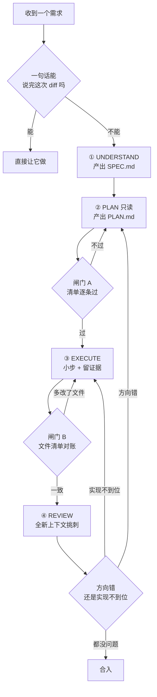

# 031. 让 AI 改一个小功能，它却动了一堆无关文件怎么办？（plan → execute → review 循环）

**一句话**：一句话说不完这次 diff 就先进 plan mode 产出 PLAN.md，动完手用 `git diff --name-only` 跟计划里的文件清单对账，多出来的文件逐个追问或 `git checkout` 还原。

## 30 秒结论

| 你看到的 | 立刻做 | 不想再犯 |
|---|---|---|
| `git diff --name-only` 列出的文件多于你要求的 | 逐个追问为什么动它，说不清就 `git checkout <文件>` 还原 | 动手前先产出 PLAN.md 的文件清单，事后拿它对账 |
| 代码写得漂亮，但解的不是你要的那道题 | 回 PLAN 重来，别在实现上打补丁 | 先 UNDERSTAND 产出 SPEC.md，再进 plan mode |
| 计划里出现「相关模块」「若干配置」「顺便优化」 | 打回重写，要求逐行写具体文件路径 | 用四段式模板下 PLAN 指令，别只说「做个计划」 |
| 同一个问题在这个会话里已经纠正 2 次还没对 | `/clear`，换更好的初始 prompt 重开 | 上下文被失败方案污染了，救不回来 |
| agent 说「完成了」，你没有任何测试输出 | 要它贴命令和原始输出，再派 subagent 对着 diff 挑刺 | 闸门 B 卡死：证据而非断言 |



## 怎么做

分工原则：你的时间花在 PLAN 和 REVIEW 上，EXECUTE 整段交给 agent。agent 动手快但方向感差，你方向感强但动手慢。

### 第 0 步：判断这次要不要走完整循环

官方给了一条可以机械执行的判据：**如果你能用一句话描述这次的 diff，就跳过规划**[^3]。

| 情形 | 走不走循环 |
|------|-----------|
| 改错别字、加一行日志、改个变量名 | 跳过，直接让它做 |
| 一句话能描述完 diff | 跳过 |
| 改动跨 2 个以上文件 | 走完整循环 |
| 你不熟这块代码 / 方案有多个选项 | 走完整循环 |
| 你在试水、想看 agent 怎么理解问题 | 故意不规划，但产出不许直接上线 |

最后一行是官方点名的例外：有时模糊的 prompt 恰恰是对的，因为你想在约束它之前先看它怎么理解问题。但这是「我在探索」的特权，一旦进入「这个功能要上线」，规划就不是可选项。

### 循环全貌：四个阶段，两道闸门

| 阶段 | 谁在做 | 产出 | 闸门 |
|------|--------|------|------|
| ① UNDERSTAND | 你 + agent 对话 | SPEC.md（点名文件与接口、写明 out of scope、以端到端验证收尾） | —— |
| ② PLAN | agent，只读模式 | PLAN.md（文件清单 / 改动性质 / 分步顺序 / 每步验证命令） | **闸门 A**：清单逐条勾 |
| ③ EXECUTE | agent 写代码 | 代码 + 每步的测试/构建输出 | **闸门 B**：文件清单对账 |
| ④ REVIEW | 全新上下文的 subagent | gap 列表 | 影响正确性的 gap 全修 + 重测通过 |

不通过时的回退规则：方向错了回 ②，只是实现没到位回 ③。

### Phase ①：让 agent 访谈你，别自己憋文档

最容易被跳过、也最贵的一步。官方推荐的姿势是反过来 —— 让 agent 主动问你。

<details>
<summary>「让 Claude 访谈你」的可复制 prompt</summary>

```text
我想做 [简要描述]。用 AskUserQuestion 工具详细地访谈我。

问技术实现、UI/UX、边界情况、顾虑和权衡。别问显而易见的问题，
挖那些我可能没考虑到的难点。

一直问到把所有点覆盖完，然后写一份完整的 spec 到 SPEC.md。
```

</details>

**这一步的完成标准**：SPEC.md 里能找到具体文件名和接口名、有一节明确写着哪些不在范围内、末尾有一个能证明功能可用的端到端验证步骤。三样缺一样就继续问。spec 写完开一个新 session 执行，上下文干净。

### Phase ②：PLAN 指令模板（别只说「做个计划」）

```text
现在是 plan mode，你不准改任何文件。读 @SPEC.md 和相关代码，产出 PLAN.md，
严格按下面四段结构写，缺一段视为不合格：

## 1. 涉及文件清单
逐行格式：`具体/文件/路径.ts` —— 一句话说明为什么要动它
只写你实际读过的文件；没读过就先读。不准写"相关模块""若干配置"这类模糊指代。
写完这一段后，另外产出一个文件 PLAN-FILES.txt：每行一个仓库根目录起算的相对路径，
不加反引号、不加说明、不加序号，内容必须与本段逐行一一对应。

## 2. 每个文件的改动性质
逐行格式：`路径` | 新增 / 修改 / 删除 | 改动的函数或符号名 | 预计行数量级
SPEC.md 里没提到的文件，单独标 [范围外] 并说明为什么必须动它。

## 3. 分步实现顺序
编号步骤，每步控制在 2-5 分钟能做完的粒度。
每步写清：做什么、依赖哪一步、失败了怎么回退。

## 4. 每步的验证命令
第 3 段每一个编号步骤都要有一行对应的：
- 验证：<可以直接粘到终端跑的命令>  → 预期：<看到什么算通过>
没有验证命令的步骤不准存在。确实无法自动验证的，写明人工验证的具体操作。

最后单独列一节"我不确定的地方"，把需要我拍板的选项列出来，不要自己替我决定。
```

#### 闸门 A：可勾选的清单，不是「感觉对不对」

- [ ] 第 1 段每一行都是具体文件路径，没有「相关模块」「若干配置」。
- [ ] 第 2 段所有标了 `[范围外]` 的文件，你逐个确认过必须动。说不清一个就打回。
- [ ] SPEC.md 的每条验收标准，都能在第 3 段找到对应的步骤编号。
- [ ] 第 3 段的步骤数 == 第 4 段的「验证：」行数。
- [ ] 没有任何一步的描述里出现「顺便」「同时优化」「重构一下」。
- [ ] 「我不确定的地方」你已逐条回答，没留给 agent 自己拍板。

<details>
<summary>前四条可以直接用命令查（可复制）</summary>

```bash
# 步骤数 vs 验证命令数，两个数字必须相等
grep -cE '^[0-9]+\.' PLAN.md
grep -c '^- 验证：' PLAN.md

# 计划点名了哪些文件：直接用 agent 产出的纯路径清单，不从正文里正则抠
sort -u PLAN-FILES.txt > /tmp/plan-files.txt
wc -l < /tmp/plan-files.txt          # 跟第 1 段的行数核对，对不上说明清单没同步

# 有没有模糊指代
grep -nE '相关模块|若干|等文件|顺便|同时优化' PLAN.md && echo "存在模糊表述，打回" || echo "无模糊表述"
```

预期：前两条命令打印同一个数字；`wc -l` 的结果等于 PLAN.md 第 1 段的行数；最后一条打印「无模糊表述」。

用单独的 `PLAN-FILES.txt` 而不是拿正则从 PLAN.md 里抠路径，是因为正则挡不住真实项目的文件名 —— `src/config.yaml`、`Dockerfile`、`package.json`、`.github/workflows/ci.yml` 这类要么没有常见代码扩展名，要么根本没有扩展名，靠「反引号 + 扩展名白名单」匹配会大面积漏掉，首跑就是满屏假告警。

</details>

### Phase ③：EXECUTE，小步 + 留证据

退出 plan mode，让 agent 做三件事：严格按 PLAN.md 的步骤编号实现、每步做完报编号；每步跑该步对应的「验证：」命令并贴原始输出；测试失败时改实现不改测试（见 [030 篇](./030-AI写的测试不可信.md)）。另有一条硬规则：**同一个 session 里同一个问题纠正超过 2 次，就 `/clear` 重来** —— 官方的判断是上下文已被失败方案污染，继续修只会越修越偏。

#### 闸门 B：文件清单对账

```bash
# 计划清单（agent 产出的纯路径文件，一行一个路径）
sort -u PLAN-FILES.txt > /tmp/plan-files.txt

# 实际改了哪些文件
git diff --name-only <基线分支>... | sort -u > /tmp/actual-files.txt

# 左边=计划里有但没改，右边=改了但计划里没有
diff /tmp/plan-files.txt /tmp/actual-files.txt
```

**怎么确认生效**：`diff` 无输出、命令退出码为 0，终端不打印任何内容 —— 这是全部改动都在计划内的样子。有差异时输出形如 `3a4` 加一行 `> src/config.yaml`。

注意路径写法要一致：`PLAN-FILES.txt` 必须是仓库根目录起算的相对路径，跟 `git diff --name-only` 的输出格式一样，否则会出现「同一个文件两边都列了却对不上」的假告警。首跑如果左右两列大面积不一致，先检查是不是路径前缀问题，再怀疑范围蔓延。

出现 `>` 开头的行就是范围蔓延 —— 这正是「让它改一个功能，它动了一堆无关文件」的检出点。逐个追问，说不清就 `git checkout` 还原那个文件。同时要求 agent 贴全量测试的原始输出，而不是「测试都过了」这句话。

### Phase ④：REVIEW，对抗式验收

| 档位 | 做法 | 适用 |
|------|------|------|
| 自验证 | agent 自己跑测试/截图，贴原始输出 | 任何任务，今天就能用 |
| `/goal` 会话级 | 把验收标准设成会话终止条件，每轮由独立评估器复查 | 中等任务，不想全程盯 |
| 对抗式 review | 全新上下文的 subagent 只看 diff + 验收标准挑刺 | 正确性要求高 / 长任务 |

<details>
<summary>对抗式 review 的可复制 prompt</summary>

```text
用一个 subagent 评审当前 diff，对照 PLAN.md：
1. PLAN.md 第 1 段列的每个文件，改动是否都做了？
2. PLAN.md 里列出的边界情况，是否每个都有对应测试？
3. 有没有改动 PLAN.md 文件清单之外的文件？逐个列出来。
4. 只报影响正确性或明确需求的缺口。风格偏好、"可以加个抽象层"这类一律标为"可选"，
   不要为了凑数量而报。
输出格式：每条 gap 给出 文件:行号 + 违反了 PLAN.md 的哪一条。
```

只想查 bug、不对照计划时，直接用自带的 `/code-review`，它在全新 subagent 里评审当前 diff 并把发现带回主会话。

</details>

**通过判据**：reviewer 报的「影响正确性」级 gap 全部修复，且全量测试重跑通过。标为「可选」的条目你自己决定 —— 官方明确警告，追着每一条 finding 改会导致过度设计[^4]。

<details>
<summary>plan mode 的进入 / 退出 / 编辑，以及用 opusplan 分算力</summary>

**四种进入方式**（官方 permission-modes 文档，2026-08 核实）：

```bash
# 1. 会话中按 Shift+Tab 循环 default → acceptEdits → plan（从默认态按两次）
#    状态栏出现 "⏸ plan mode on" 才算进去了
# 2. 只让某一条 prompt 走规划：前缀 /plan，例 `/plan 给订单列表加分页`
# 3. 启动时直接进
claude --permission-mode plan
```

```json
{
  "permissions": {
    "defaultMode": "plan"
  }
}
```

第 4 种是上面这段，写进 `.claude/settings.json`，把某个项目默认设成规划模式。

几个容易记错的点：

- **退出而不批准**：再按一次 `Shift+Tab`。
- **批准即离开**：批准计划会退出 plan mode 并切到你选的权限模式，Claude 随即开始改文件。想再规划一次，`Shift+Tab` 循环回去或再用 `/plan` 前缀。
- **编辑计划**：`Ctrl+G` 在默认文本编辑器里打开计划直接改，比来回让 agent 改快得多。很多人不知道这个。
- **plan mode 不等于完全只读**：它挡的是编辑。命令执行在开了 auto mode 且 `useAutoModeDuringPlan` 打开时由分类器判断放行；在开了 bypass permissions 的会话里，plan mode 的拦截根本不生效。别拿它当安全沙箱，要真隔离用 `/sandbox` 或容器。

**用 `opusplan` 让「想」和「做」分开花算力**：plan mode 里用 Opus 做架构决策，退出后自动切 Sonnet 做代码生成。四种配置入口（官方按优先级从高到低）：

```bash
/model opusplan                  # 1. 会话中切换（写入用户设置成为新会话默认）
claude --model opusplan          # 2. 启动时指定（只影响这一个会话）
export ANTHROPIC_MODEL=opusplan  # 3. 环境变量（只影响这一个会话）
# 4. 写进设置文件永久生效：{"model": "opusplan"}
```

两个细节：`opusplan` 的 Opus 规划阶段与 `opus` 用同样的上下文窗口；不在自动升级 1M 的订阅档位、又想两阶段都用 1M，把模型设成 `opusplan[1m]`。`ANTHROPIC_DEFAULT_OPUS_MODEL` / `ANTHROPIC_DEFAULT_SONNET_MODEL` 分别决定 plan / 非 plan 阶段用哪个具体版本。

**怎么确认生效**：进 plan mode 后跑 `/status`，模型应显示 Opus 系；批准计划退出后再跑一次，应变成 Sonnet 系。两次一致说明没生效 —— 最常见原因是项目或托管设置里的 `model` 字段优先级更高，启动时的头部提示会写明是哪个设置文件设的。

</details>

<details>
<summary>比原生 plan mode 更强制：superpowers 三段链与 GitHub Spec Kit</summary>

**superpowers**（`obra/superpowers` 插件）明确不进 plan mode，用三段技能链替代，做成不可绕过的流程：

1. **`brainstorming`**：任何创意工作前强制激活。一次问一个问题收敛需求、提 2 到 3 个带取舍的方案、等审批后才把 spec 写到文件、再做一次 spec 自审（扫占位符、矛盾、歧义、范围）。终态只能是「调用 writing-plans」。它专门列了一条反模式：「This Is Too Simple To Need A Design」—— 越是「简单」的项目，越是那些没被审视的假设造成最多返工。
2. **`writing-plans`**：把 spec 转成详细实现计划，假设执行者对代码库零上下文，工作拆成 2 到 5 分钟的小任务。
3. **`executing-plans`**：逐步执行，在每个检查点暂停验收、处理阻塞项。

配置方式见 [033 篇](./033-Skill与superpowers怎么用.md)。

**GitHub Spec Kit** 把同一条循环固化成四阶段门控 CLI：Specify → Plan → Tasks → Implement，分别产出 `spec.md`、`plan.md`、`tasks.md`，规则是 spec 没验证就不准进实现。它把「人评审」做成流程里的显式检查点，而不是「记得看一眼」。

</details>

## 为什么

### 官方把「探索」和「执行」强行分开，是因为 agent 默认不假思索动手

Anthropic 最佳实践里有一个独立小节叫「Explore first, then plan, then code」，理由一句话：让 Claude 直接上手写代码，可能写出优雅地解错了题的代码[^1]。plan mode 就是覆盖前两步的只读闸门 —— Claude 能读文件、能跑命令探索、能写计划，但在你批准之前编辑一直被挡住。

为什么值得官方单独点名？因为你给它一句「实现登录」，它的第一反应是敲代码，而不是反问用什么鉴权方案、session 还是 token。plan mode 用只读约束强行打断这个默认行为。Flask 作者 Armin Ronacher 拆过它注入的系统提示词：内部是一个四阶段状态机 —— 理解、设计、评审对齐、写出最终计划，全程只读，提示词里写死了「你绝不能做任何编辑」。本质上就是一段注入的提示词加一个状态机。

### 计划质量是执行准确率的主导因素，不是玄学

直接理由是机制上的：计划把「要改哪些文件、每步怎么验证」写成可对账的清单，闸门 A、B 才有东西可查。没有计划，你手上唯一的判据就是「看着还行」。

有研究显示计划质量会显著影响 agent 执行表现 —— CHI 2025 一项 N=248 的实证研究把 LLM agent 称为「双刃剑」，缺少高质量计划时 agent 会同时损害信任和绩效，有计划且执行阶段有人工参与时报告了约 66% 的执行准确率[^2]。但这个数字出自受控实验任务，实验条件与日常写代码场景差异大，仅作方向参考，别拿它当自己项目的预期值。

机制上的理由更能解释为什么 vibe coding（不给约束、让 agent 自由发挥）在探索期爽、在生产期崩：没有高质量计划这个前置条件，agent 的自主性是有害的。

> 个人观点（小C）：很多人把「规划」理解成写一大段需求文档甩给 agent，这是另一种极端。真正有效的规划是对话式的 —— agent 反问你，你回答，它把歧义收敛成方案，你再审。规划的本质是在动手前把假设暴露出来，不是把文档写得更长。

### Review 必须对抗，但不能照单全收

官方对 review 的两条要求：一是拿证据说话，让 Claude 贴测试输出和跑过的命令，审查证据比你自己重跑一遍快；二是引入独立检查 —— 跑在全新 subagent 上下文里的 reviewer 只看到 diff 和你给的标准，看不到产生这次改动的推理过程。

为什么必须换上下文？因为写代码的上下文天然会替自己刚写的代码辩护，让它「自查」它会顺着刚才的思路找理由。

但对抗有代价，官方专门给了反向提醒：一个被要求找缺口的 reviewer 通常总会报出一些，哪怕代码本身没问题；追着每一条 finding 改会导致过度设计[^4]。所以 reviewer 的 prompt 必须写死「只报影响正确性或明确需求的缺口，其余标为可选」。

Simon Willison 给跳过 review 的后果起了个名字：house of cards code（纸牌屋代码）—— 看起来很稳，在你没测的边界条件下一触即溃。

## 别这么干

- ❌ **不规划直接让 agent 动手。** 最贵的错误不是代码 bug，是优雅地解错了题。判断线：一句话描述不完这次 diff 就必须规划。
- ❌ **把「做个计划」当成完整 prompt。** 不指定输出结构，agent 会给你一段散文，里面全是「相关模块」「做必要的改动」，闸门 A 无从下手。必须落成四段式。
- ❌ **闸门只靠「方向看着对」。** 闸门要能机械执行才有用。用 `git diff --name-only` 跟计划的文件清单做 diff，这一条就能挡住大部分范围蔓延。
- ❌ **让写代码的上下文自己 review 自己。** 它会顺着刚才的思路找理由，必须换全新上下文的 subagent。
- ❌ **追着 reviewer 报的每一条 finding 改。** 会长出多余的抽象层、防御式代码和永远触发不了的测试。只修影响正确性和明确需求的。

<details>
<summary>还有三条低频但要命的反模式</summary>

- ❌ **在同一个 session 里反复纠正同一个问题。** 上下文会被失败方案污染，纠正 2 次还不对就 `/clear` 重来，用更好的初始 prompt。（官方）
- ❌ **把 plan mode 当安全沙箱。** 它挡的是文件编辑；在 bypass permissions 会话里连编辑都不挡，命令执行也可能被分类器放行。需要真隔离用 `/sandbox` 或容器。（官方 permission-modes）
- ❌ **写完 spec 就忘。** spec 是活文档，执行中发现的变更要回写，否则 spec、plan、实现三者会漂移。（单一社区来源：Spec Kit discussion #775，未见官方结论）

</details>

<details>
<summary>换成 Cursor / Copilot 呢</summary>

| 维度 | Claude Code | Cursor | GitHub Copilot |
|------|------------|--------|----------------|
| **规划闸门** | 原生 plan mode（只读强制）+ superpowers 三段链 | 无原生只读 plan mode；靠 `.cursor/rules` 和 chat 引导 | 无原生 plan mode；靠 instructions 文件 |
| **review 机制** | 原生对抗式 subagent / 双 session / `/code-review` skill | Composer 多文件，但无独立的全新上下文打分者 | 无内置对抗式 review |
| **会话级验收** | `/goal` + `Stop` hook（确定性闸门） | 无 | 无 |
| **规划与执行分算力** | `opusplan` 别名自动切换 | 手动换模型 | 手动换模型 |
| **spec→plan→tasks 工具链** | 社区 superpowers（强制化）+ GitHub Spec Kit（门控） | 用户自建 rules | Copilot agents.md personas |

共性：所有工具的 agent 都有「不假思索动手」的倾向，CHI 2025 的结论适用于全部 LLM agent。差异在强制力 —— Claude Code 用 plan mode（只读约束）、subagent（对抗 review）、hook（确定性闸门）把这条循环闭合得最硬，Cursor 和 Copilot 更依赖人工纪律。

</details>

## 延伸

**相关文章**

- [#030 AI 写的测试一跑就过、还偷偷删测试怎么办？](./030-AI写的测试不可信.md) —— RED 阶段就是把验收标准前置，「证据非断言」两篇同源
- [#032 SubAgent 并行到底该开几个？](./032-SubAgent并行开几个.md) —— Phase ④ 对抗式 review 的 subagent 用法
- [#033 Skill 和 superpowers 怎么用？](./033-Skill与superpowers怎么用.md) —— brainstorming / writing-plans / executing-plans 三段链把循环强制化
- [#012 上下文窗口要爆了怎么办？](../02-上下文工程/012-上下文窗口要爆了.md) —— 长循环用 subagent，既隔离上下文又做对抗 review

**参考资料**

- [Best practices for Claude Code — Claude Code Docs](https://code.claude.com/docs/en/best-practices) —— 支撑「先探索再规划再编码」「一句话能描述 diff 就跳过规划」「让 Claude 访谈你」「对抗式 review 及其过度设计警告」「纠正 2 次就 /clear」（官方，2026-08 核实）
- [Choose a permission mode — Claude Code Docs](https://code.claude.com/docs/en/permission-modes) —— 支撑 plan mode 的四种进入方式、`Ctrl+G` 编辑计划、批准选项、`defaultMode: "plan"`、bypass permissions 下不拦截（官方，2026-08 核实）
- [Model configuration — Claude Code Docs](https://code.claude.com/docs/en/model-config) —— 支撑 `opusplan` 别名定义、四种配置入口、`opusplan[1m]`、两个默认模型环境变量（官方，2026-08 核实）
- [Plan-Then-Execute: An Empirical Study of User Trust and Team Performance (CHI 2025)](https://arxiv.org/abs/2502.01390) —— 支撑 N=248、约 66% 执行准确率、无高质量计划时 agent 损害信任与绩效（学术，2025）
- [What Actually Is Claude Code's Plan Mode? — Armin Ronacher](https://lucumr.pocoo.org/2025/12/17/what-is-plan-mode/) —— 支撑 plan mode 是「注入提示词 + 四阶段状态机」这个拆解（社区权威，2025-12）
- [brainstorming SKILL.md — obra/superpowers](https://github.com/obra/superpowers/blob/main/skills/brainstorming/SKILL.md) —— 支撑强制设计先行流程与「Too Simple To Need A Design」反模式（社区/开源，2025-2026）
- [writing-plans SKILL.md — obra/superpowers](https://github.com/obra/superpowers/blob/main/skills/writing-plans/SKILL.md) —— 支撑「假设执行者零上下文、任务拆到 2-5 分钟」（社区/开源，2025-2026）
- [executing-plans skill — Claude Plugin Hub](https://www.claudepluginhub.com/skills/obra-superpowers-2/executing-plans) —— 支撑逐步执行 + 检查点验收（社区，2025-2026）
- [Superpowers v4.3.0 — blog.fsck.com](https://blog.fsck.com/agent-blog/2026/02/12/superpowers-v4-3-0/) —— 支撑 superpowers 明确「never enter plan mode」，用三段链替代（社区，2026-02）
- [How to write a good spec for AI agents — Addy Osmani](https://addyosmani.com/blog/good-spec/) —— 支撑「spec 不扎实就别生成代码」与 Spec Kit 门控工作流的引用（社区权威，2026-01）
- [Agentic Engineering Patterns — Simon Willison](https://simonw.substack.com/p/agentic-engineering-patterns) —— 支撑 house of cards code 与「永不跳过 review」（社区权威，2025-2026）
- [github/spec-kit](https://github.com/github/spec-kit) —— 支撑 Specify→Plan→Tasks→Implement 四阶段门控 CLI（官方/开源，2025-2026）
- [Spec Kit Discussion #775](https://github.com/github/spec-kit/discussions/775) —— 支撑「spec/plan/实现三者漂移」这条反模式（社区，2025）

[^1]: [Best practices for Claude Code](https://code.claude.com/docs/en/best-practices)（官方，2026-08 核实）：让 Claude 直接上手写代码，可能产出解错了题的代码；用 plan mode 把探索和执行分开。
[^2]: [Plan-Then-Execute (CHI 2025) — arXiv:2502.01390](https://arxiv.org/abs/2502.01390)（学术，2025）：N=248，高质量计划配合必要的人工执行参与时约 66% 执行准确率。该数字与实验任务设定出自论文全文，本库仅核实到摘要级，实验条件（任务类型、准确率如何判定）未确证，正文只作方向性佐证。
[^3]: [Best practices for Claude Code](https://code.claude.com/docs/en/best-practices)（官方，2026-08 核实）：能用一句话描述 diff 就跳过规划；方案不确定、跨多文件、对代码不熟这三种情况必须规划。
[^4]: [Best practices for Claude Code](https://code.claude.com/docs/en/best-practices)（官方，2026-08 核实）：被要求找缺口的 reviewer 通常会报出一些，即使工作本身没问题；追着每条 finding 改会导致过度设计。

---

<sub>难度 中级 · 流程题 · 主线 Claude Code，横向 Cursor / Copilot</sub>

<sub>**时效**：plan mode 的进入方式（`Shift+Tab` / `/plan` / `--permission-mode plan` / `defaultMode`）、`Ctrl+G` 编辑计划、批准计划的选项、`opusplan` 别名与四种配置入口，已于 2026-08-03 对照官方 permission-modes 与 model-config 文档逐条核对。闸门 A / B 的文件清单对账已于 2026-08-04 改为「agent 直接产出 `PLAN-FILES.txt` 纯路径清单」，替换掉原先靠「反引号 + 扩展名白名单」正则抠路径的写法 —— 后者会漏掉 `Dockerfile`、`package.json`、`src/config.yaml` 这类文件，导致首跑满屏假告警。**已知不确定**：CHI 2025 论文（arXiv:2502.01390）真实存在，N=248 与「低质量计划损害信任」已在摘要确认；「约 66% 执行准确率」与「2×2 因子设计」出自论文全文，本库仅核实到摘要级，实验条件未确证，正文已把它降为方向性佐证而非立论论据。**易变**：Claude Code 版本行为随小版本变化快，本文所述以 v2.1.2xx 系列文档为准。</sub>

> 本篇个人实践（L4）：`[待补：BOSS 的实战经验——你跳过规划直接动手被坑 / 认真规划后一次过的对比案例，或 superpowers 三段链启用后返工率的变化]`
