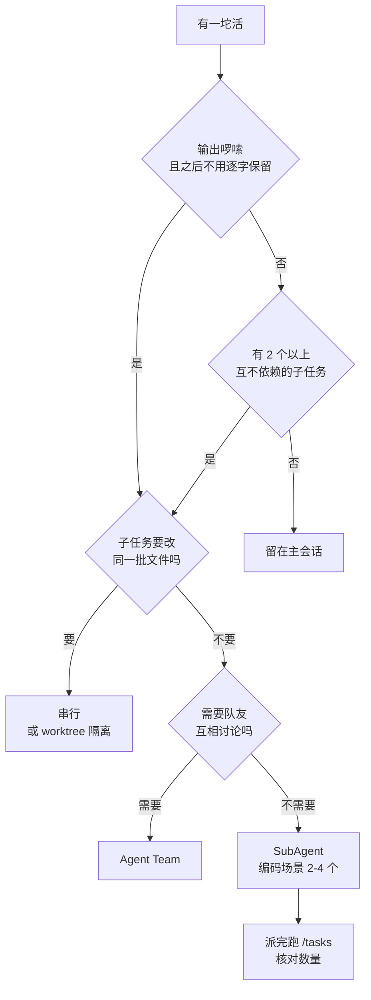

# 032. 开几个 agent 并行跑，结果互相踩、被限流、token 指数级炸开——并行到底该开几个？

**一句话**：SubAgent 买的是上下文隔离不是速度，代价约 15 倍 token —— 编码任务开 2 到 4 个，用 `tools` 白名单掐掉它继续派活的能力，派完立刻跑 `/tasks` 数一下实际在跑几个。

## 30 秒结论

| 你看到的 | 立刻做 | 不想再犯 |
|---|---|---|
| `/tasks` 里在跑的任务数多于你派的数量 | Esc 中断，杀掉多余任务 | 自定义 agent 显式写 `tools` 白名单，不给派活工具 |
| `/usage` 用量翻倍，但墙上时间没缩短 | 退回主会话串行做 | 先过判断矩阵，别为并行而并行 |
| 多个 agent 改同一批文件、后写的盖掉先写的 | 停掉，改串行 | 并行硬红线：各 agent 只碰不同文件；非并行不可就加 `isolation: worktree` |
| 你在反复给 SubAgent 补它本该知道的背景 | 改用 fork，或直接留主会话 | 委派指令四要素：目标、范围、输出格式、边界 |
| 回传的是「我看了一下，要不要我继续」 | 补全委派指令重派 | 一次派活一次交付，来回超 2 轮就退回主会话 |



## 怎么做

### 第一步：过判断矩阵

四个维度逐个看，任意一个命中「该用」就值得考虑。

| 维度 | 该用 SubAgent | 不该用（留在主会话） |
|------|------------------|------------------------|
| **上下文消耗** | 会产出大量啰嗦输出（测试、日志、文档、大范围探索），你不再需要逐字保留 | 输出轻量，或后续多轮还要引用这些输出 |
| **任务独立性** | 两个以上子任务互不依赖、各改各的文件 | 子任务有先后依赖（A 的输出是 B 的输入） |
| **来回频率** | 任务可自包含完成、只回传一个摘要 | 需要频繁和你来回对齐、迭代细化 |
| **上下文共享** | 各子任务不需要看到彼此的中间状态 | 规划、实现、测试共享同一份理解 |

**硬红线一：不要让多个并行 SubAgent 改同一批文件。** 它们看不到彼此的中间状态，只能各写各的，后写的覆盖先写的。真需要并行改同一个仓库，给每个 SubAgent 加 `isolation: worktree`（frontmatter 字段，让它在临时 git worktree 里拿一份独立仓库副本），或者干脆串行。

**硬红线二：别让 SubAgent 自己再派活。** 内置的 `general-purpose` 拿的是全工具集，里面就包含派活工具本身，于是它能再派、子 agent 还能再派，形成没有深度上限也没有总数上限的扇出树。掐断办法是自定义 agent 时用 `tools` 白名单显式列出它需要的工具，而不是省略 `tools` 让它继承全部 —— 比如调研型 agent 写 `tools: Read, Grep, Glob, WebFetch` 就够了。

### 第二步：选并行、串行还是后台，以及开几个

| 模式 | 什么时候用 | 选错了的后果 |
|------|-----------|-------------|
| **并行** | 子任务跨独立领域、不碰同一批文件 | 合并冲突、状态不一致 |
| **串行** | 存在依赖或共享资源（schema→API→前端；实现→测试→安全审计） | 把本可并行的独立工作硬串起来，浪费时间 |
| **后台** | 你想继续干别的、让它异步跑（如调研） | 结果忘了检查就丢了 |

官方建议按复杂度定规模：

| 任务复杂度 | agent 数 | 每个 agent 的工具调用次数 |
|---|---|---|
| 简单事实查找 | 1 个 | 3–10 次 |
| 直接对比（两三个候选方案/模块） | 2–4 个 | 各 10–15 次 |
| 复杂研究（多领域、单上下文装不下） | 10 个以上，分工必须写明确 | 不设上限 |

「10 个以上」和官方复盘里的失败模式「为一个简单查询启动 50 个 SubAgent」不矛盾，线画在任务复杂度上而不是数字上。**可执行的判据**：说得出第 N 个 agent 负责哪块别人不重叠的领域、并且它能靠 10 次以上工具调用把这块填满，才留着它；说不出第 6 个和第 3 个的区别，就是多开了。日常编码里需要 10 个以上的场景基本不存在，**2 到 4 个是常态**。

### 第三步：写好委派指令（四要素）

SubAgent 看不到你的对话历史，它只有你给的那段委派消息，所以这段话的信息密度决定成败。绝大多数 SubAgent 出问题不是执行没做好，是派活时没说清楚。官方给的四要素[^5]：**目标、涉及的文件或范围、期望的输出格式、明确的边界**。

反例是「Fix authentication」。合格的例子：

```
在 src/auth/ 范围内定位「session 超时后登录失败」的根因。
只读不改。输出格式：最多 5 条，每条给 文件:行号 + 一句话原因 + 置信度高/中/低。
不要提出修复方案，不要读 src/auth/ 以外的目录。
```

### 第四步：SubAgent 还是 Agent Team

子任务之间需要互相讨论、互相质疑，而不是各干各的回传结果，才用 Agent Team。官方判断线：SubAgent 适合「只关心结果」的聚焦任务，Agent Team 适合「需要讨论和协作」的复杂工作。典型 Agent Team 场景有两个 —— 竞争性假设的调试（5 个队友各试一种理论、互相反驳），以及跨层改动（前端、后端、测试各配一个队友）。

Agent Team 默认关闭，需要设 `CLAUDE_CODE_EXPERIMENTAL_AGENT_TEAMS=1` 启用，token 成本随队友数线性增长，3 到 5 个够用。

### 第五步：事后回检，确认这次派活是赚的

```
/context    # 看主上下文占用（彩色格子图 + 各项占比）
/usage      # 看这次会话的用量；/cost 是它的别名
/tasks      # 看后台 SubAgent 的运行/完成状态
```

正确姿势是**派活前先跑一次 `/context` 记下百分比**，派完再跑一次对比。

| 信号 | 怎么看 | 判定 |
|---|---|---|
| **主上下文占用** | 两次 `/context` 的百分比差值 | 差值 ≤ 5 个百分点算隔离生效；SubAgent 处理了上万行输出而主上下文只涨了一段摘要，就是赚的（5 个百分点是经验阈值，不是官方数字） |
| **任务数量** | `/tasks` 在跑的条数 vs 你派的条数 | 不相等就是它自己又派了，立即中断 |
| **回传内容** | 回来的是结论/清单/失败用例，还是「要不要我继续」 | 后者说明委派指令写糊了，或这活本来就该留主会话 |
| **来回轮数** | 你和 SubAgent 之间往返几次 | 超过 2 轮，协调成本已吃掉收益，退回主会话 |
| **耗时 vs 用量** | 记下墙上时间，对比 `/usage` | 用量翻倍但墙上时间没缩短＝把不可并行的活硬并行了 |

一条经验判据：**如果你发现自己在给 SubAgent 补充它本该知道的背景，那这活就不该用 SubAgent** —— 要么改用 fork（继承上下文），要么直接留在主会话。

### 第六步：核对接收端 —— 开得起，不代表你审得过来

前五步定的是生成端上限（token、限流、文件冲突扛不扛得住）。还有一个独立的上限在你这边：**这些 agent 产出的东西，最后要一个人读懂并负责**。原则一句话 —— **让 AI 并发，不要让人的注意力并发**。

落到数字上：回传摘要、不用你逐条审的后台调研，3~5 个没问题；但**需要你逐行读懂 diff 才能决定合不合的任务，同时只该有 1 个**（跑测试、批量改名这类只看成功失败的监工任务可以再叠 1 个）。这跟前面「编码场景 2 到 4 个」不冲突：那 4 个是同时在跑的生成上限，而且通常各改各的文件、最后汇成一份要你读的改动；一旦它们变成 4 份彼此独立、都得你逐行读懂的 diff，堵的就是你，不是模型。派活前先问一句：它们回来的是摘要，还是四份等我审的 diff。

分层上限的完整推理链、超载的可观测信号，以及降低单次审查量的做法，见 [005 篇](../01-心智与工具/005-审查疲劳与心流.md)。

<details>
<summary>三种调用方式与三个内置 SubAgent</summary>

**调用方式，由轻到重**：

1. **自然语言**：prompt 里点名，由 Claude 决定是否委派，例 `Use the test-runner subagent to fix failing tests`。
2. **@-mention**：写 `@"code-reviewer (agent)"`，保证该 SubAgent 一定会跑，不交给 Claude 自行判断。
3. **整会话当 SubAgent 跑**：`claude --agent code-reviewer`，整个会话用它的 system prompt、工具限制和模型。也可以在 `.claude/settings.json` 写 `"agent": "code-reviewer"` 设为默认。

**内置三个，不用自己配**：

| 内置 Agent | 模型 | 工具 | 用途 |
|-----------|------|------|------|
| **Explore** | 继承主会话（Claude API 上封顶到 Opus） | 只读（无 Write/Edit） | 文件发现、代码搜索、代码库探索；可指定 `quick` / `medium` / `very thorough` |
| **Plan** | 继承主会话 | 只读 | plan mode 下做代码库调研，探索输出留在独立窗口 |
| **general-purpose** | 继承主会话 | 全工具 | 复杂多步任务，既要探索又要改代码 |

早期版本的 Explore 固定跑 Haiku，从 v2.1.198 起改为继承主会话模型（在 Claude API 上封顶到 Opus，永远不会比你为会话选的模型更贵）。想让它继续走低成本模型，在 `.claude/agents/` 里定义一个同名 `Explore` 并写 `model: haiku` 覆盖内置的。

Explore 和 Plan 会跳过 CLAUDE.md 和 git status 来保持轻量，其他所有 SubAgent 都会加载它们。

</details>

<details>
<summary>自定义 SubAgent：一个 Markdown 文件，以及「加了 Bash 就不是只读」的坑</summary>

最小可用的只读评审 agent，存成 `.claude/agents/code-reviewer.md`：

```yaml
---
name: code-reviewer
description: 代码审查专家。写完或修改代码后主动用。
tools: Read, Grep, Glob
model: inherit
---

你是资深代码审查者。被调用时：
1. 读 PLAN.md 或需求描述，拿到验收标准
2. 只看本次修改过的文件
3. 按优先级输出：Critical / Warning / Suggestion
```

存放位置两级：项目级 `.claude/agents/`（进版本控制、团队共享），用户级 `~/.claude/agents/`（跨项目可用）。`tools` 是白名单，省略则继承全部工具；`disallowedTools` 是黑名单；两个都写时先扣黑名单再解析白名单。写 `model: haiku` 可以把便宜的任务路由到快模型；想全局统一就设 `CLAUDE_CODE_SUBAGENT_MODEL`。

**坑：很多模板写 `tools: Read, Grep, Glob, Bash` 并注释「只读」，这是错的。** `Bash` 能执行任意 shell 命令，agent 完全可以 `echo x > src/app.ts`、`sed -i`、`git checkout .`、`rm`。官方说这套配置「can't edit files, write files」，指的是 Edit / Write 这两个工具不可用，不代表文件系统不可写。

Claude Code 的 agent frontmatter **没有**按命令参数细分的 `allowed-tools` 字段（截至 2026-08，官方支持的字段只有 `name` / `description` / `tools` / `disallowedTools` / `model` / `permissionMode` / `maxTurns` / `skills` / `mcpServers` / `hooks` / `memory` / `background` / `effort` / `isolation` / `color` / `initialPrompt`）。要「能跑命令但不能写文件」，只有两条正经路子：

**路子一（推荐）：真只读就别给 Bash。** 评审、探索用 `tools: Read, Grep, Glob` 就够，git diff 的内容让主会话贴给它。

**路子二：给 Bash，但用 frontmatter 里的 `PreToolUse` hook 逐条拦截。**

```yaml
---
name: code-reviewer
description: 代码审查专家。写完或修改代码后主动用。
tools: Read, Grep, Glob, Bash
model: inherit
hooks:
  PreToolUse:
    - matcher: "Bash"
      hooks:
        - type: command
          command: "./scripts/allow-readonly-git.sh"
---

你是资深代码审查者。只允许跑 git diff / git log / git show，不要尝试修改任何文件。
```

`scripts/allow-readonly-git.sh`（hook 从 stdin 拿 JSON，退出码 2 表示拦截并把 stderr 回给 agent）：

```bash
#!/bin/bash
INPUT=$(cat)
COMMAND=$(echo "$INPUT" | jq -r '.tool_input.command // empty')

case "$COMMAND" in
  "git diff"*|"git log"*|"git show"*|"git status"*)
    exit 0
    ;;
esac

echo "Blocked: 该 agent 只允许 git diff / log / show / status，收到：$COMMAND" >&2
exit 2
```

**怎么验证做对了**：

```bash
chmod +x ./scripts/allow-readonly-git.sh   # 不加这步 hook 会直接失败，等于没拦
```

然后在 Claude Code 里派活：`用 code-reviewer subagent 跑一句 echo hacked > /tmp/cc-hook-test.txt`。预期命令被拦下，SubAgent 收到那句 `Blocked:`。再确认文件确实没被创建：

```bash
test -f /tmp/cc-hook-test.txt && echo "拦截失败：文件被写出来了" || echo "OK：hook 生效"
```

预期输出 `OK：hook 生效`。输出「拦截失败」时依次查：脚本有没有可执行权限、路径是否相对于项目根目录、以及项目级 agent 的 frontmatter hook 是否还没通过 workspace trust 弹窗（较新版本里，项目级 agent 的 frontmatter hook 要先信任该目录才会运行；用户级 `~/.claude/agents/` 不需要）。

另外提醒：`permissions.deny` 里的规则（如 `"Bash(rm:*)"`）是**整个会话生效**，不是只对某个 agent 生效，别把它当 agent 级沙箱。

</details>

<details>
<summary>fork：需要共享上下文时的特例（命令名按版本分三段）</summary>

普通 SubAgent 是全新上下文，fork 正好反过来：它继承父会话的全部历史，但它自己的工具调用不进主上下文，只回最终结果。适合两种场景 —— 某个 SubAgent 需要太多背景才能干活（fork 比从头攒上下文划算），以及想在同一个起点上并行试多种方案。fork 还能复用父会话的 prompt cache，比全新 SubAgent 便宜。

| 版本 | 手动开 fork 的命令 | 是否需要环境变量 |
|---|---|---|
| v2.1.212 及以后 | `/subtask <任务>` | 不需要 |
| v2.1.161 – v2.1.211 | `/fork <任务>` | 不需要 |
| v2.1.117 – v2.1.160 | `/fork <任务>` | 需要 `CLAUDE_CODE_FORK_SUBAGENT=1` |

**一个例外**：v2.1.212 及以后，如果你关掉了 agent view（后台会话面板），`/subtask` 不可用，此时改由 `/fork` 来起 fork 子任务；只有 agent view 开着时，`/fork` 才是「把整个会话复制成一个独立后台会话」。所以照老教程敲 `/fork` 发现行为不对时，先 `claude --version` 对版本，再确认 agent view 开关状态。

agent view 默认开启的情况下，当前版本直接敲 `/subtask` 就行，不用先设环境变量：

```
/subtask draft unit tests for the parser changes so far
```

`CLAUDE_CODE_FORK_SUBAGENT` 现在管的是另一件事：设成 `1` 让 Claude 自己也能主动 spawn fork（并且所有 SubAgent 一律转后台跑），设成 `0` 则彻底关掉 fork 模式。这跟你手敲 `/subtask` 是两回事。

**怎么验证**：`claude --version` 看是否 ≥ 2.1.212 决定敲哪个命令；fork 起来后会出现在 prompt 下方的面板里，也可以用 `/tasks` 看在跑的子任务列表，完成后结果以一条消息回到主会话。

</details>

<details>
<summary>两个最值的用法：并行调研与对抗式 review</summary>

**并行调研**（只在各条研究路径互不依赖时有效）：

```
Research the authentication, database, and API modules in parallel
using separate subagents
```

每个 SubAgent 独立探索自己的领域，Claude 再综合结果。需要持续并行、或超出单个上下文，就升级到 Agent Team。

**对抗式 review**（SubAgent 最值的用法）：让一个全新上下文的评审者只看 diff 和验收标准，看不到写代码时的理由。

```
用一个 subagent 评审 [feature] 的 diff，对照 PLAN.md：
检查每条需求是否实现、边界 case 是否有测试、
有没有改动任务范围外的东西。报 gap，不报风格偏好。
```

因为评审者是 SubAgent，执行会话会直接收到 gap 并修复、再审，你不用在两个窗口之间复制粘贴。详见 [031 篇](./031-plan-execute-review循环.md) 的 Phase ④。

</details>

## 为什么

### SubAgent 的本质是隔离，不是加速

Anthropic 的上下文工程框架把上下文操作分成四类：write、select、compress、isolate。SubAgent 就是 isolate —— 每个 SubAgent 启动时拿到一个全新的、干净的上下文窗口，看不到你的对话历史、已调用的 skill、已读过的文件，只拿到一段委派摘要就开干[^1]。

它的初始上下文核心是四样：自己的 system prompt、Claude 写的委派消息、CLAUDE.md 与记忆层级、会话开始时的 git 快照。另有两样按需注入：`skills` 字段预加载的 skill 内容，以及可用于 `SendMessage` 的兄弟 agent 名册。

直接收益是：跑全量测试、读 10 万行日志、爬一堆文档的输出全留在它自己的窗口里，主会话只收摘要。还有一个容易忽略的工程性质 —— SubAgent 的对话记录存在独立文件里，主会话做 compact 时它不受影响，是一个扛得住压缩的工作面（见 [012 篇](../02-上下文工程/012-上下文窗口要爆了.md)）。

### 隔离的代价是 15 倍 token，而且它会自己长大

Anthropic 在自家多 Agent 研究系统的复盘里给了最硬的量化：agent 的 token 消耗约是普通聊天的 4 倍，多 Agent 系统约是 15 倍；官方还直接点名，编码任务真正能并行的子任务比研究任务少得多[^2]。

**注意别和另一个数字搞混**：本库 060、061、062 三篇讲成本时用的是「agent teams 约 7 倍 token」，那是 Claude Code 官方 costs 文档针对 plan mode 下 agent teams 给的数；这里的 15 倍来自 Anthropic 多 Agent 研究系统的复盘，指的是研究型多 Agent 架构。两个数各有官方出处，量的是不同东西，别当成矛盾，也别互相套用。

代价大有三个结构性原因：**协调复杂度增长快**（早期 agent 会为一个简单查询启动 50 个 SubAgent、无休止地找不存在的来源）；**SubAgent 之间无法共享中间状态**，只能把结果报回主 Agent 再分发，官方称之为「game of telephone」传话游戏，信息多级传递会失真；**同步执行造成瓶颈**，主 Agent 要等 SubAgent 完成才能继续，整个系统可能被一个慢的卡住。

更贵的一类是「你只派了 1 个，它自己长成了几十个」。有用户只发了一句「research Venmo integration options」，最后同时在跑 48 个以上后台 agent，其中大量重复劳动 —— 4 个在查同一个 Wise API、3 个在查同一个 Apple Pay P2P，新 agent 冒出来的速度比他手动停的速度还快，同样情况在不同会话里复现了两次[^3]。同期还有两个同族案例：Agent Teams 带 5 到 8 个队友时，主会话被队友的 idle 通知反复唤醒，13% 到 22% 的输入 token 花在纯粹的「收到」上；deep-research 工作流一次扇出约 75 个并发校验 agent，只要其中任何一个没按 schema 返回结构化输出，整轮直接中止，三次尝试烧掉约 350 万 token、零可用产出。

共同点是同一个失效模式：**并行的开销是乘法的，但失败是全局的。** 扇出越宽，任意一个分支跑偏或空转，代价越是按分支数整体翻倍。

### 什么时候多 Agent 真的值

官方给了三组数据，但**读的时候要看清评测对象**。

「Opus 当主 Agent、Sonnet 当 SubAgent」的多 Agent 系统，在 Anthropic 内部**研究类**评测上比单 Agent Opus 高出 90.2%[^4] —— 评测对象是开放式信息搜集，不是写代码，同一篇文章下面就明说编码任务可并行子任务比研究少，所以别把这个数字迁移到编码场景。在 BrowseComp 评测上，token 用量本身解释了 80% 的性能差异，另外两个因素是工具调用次数和模型选择。引入并行后，复杂查询的研究时间最多缩短 90%。

官方划的适用边界是三类任务：需要大量并行、信息量超出单个上下文窗口、要对接大量复杂工具。

> 个人观点（小C）：很多人把多 Agent 理解成「让 AI 干活更快」，这是误读。官方数据说的是另一件事：多 Agent 用 15 倍 token，换取在「单上下文装不下」的任务上从做不出来变成做得出来。它买的是能力边界，不是速度。你的任务一个上下文就装得下、也没有真正可并行的子任务，多 Agent 只会让你白花 15 倍的钱，还因为协调开销更慢。

## 别这么干

- ❌ **把多 Agent 当加速器用。** 代价是 15 倍 token。它买的是「单上下文装不下」任务的能力边界，简单任务用多 Agent 只会更慢更贵。
- ❌ **让一个全工具的 SubAgent 自己再派活。** 它拿得到派活工具就会继续派，形成没有深度上限的扇出树。用 `tools` 白名单掐掉，派完用 `/tasks` 数一下实际跑了几个。
- ❌ **让多个 SubAgent 改同一批文件。** 它们看不到彼此的中间状态，后写的盖掉先写的。并行的硬规则是各改各的文件。
- ❌ **给 SubAgent 模糊的委派指令。** 它看不到你的对话历史。「Fix authentication」是坏指令，好指令带目标、文件范围、输出格式、边界。
- ❌ **以为 `tools: Read, Grep, Glob, Bash` 是只读沙箱。** `Bash` 能执行任意 shell 命令，`echo x > file`、`sed -i`、`rm` 都做得到。真要只读就去掉 Bash。

<details>
<summary>还有四条低频但要命的反模式</summary>

- ❌ **什么都丢给 SubAgent。** 需要频繁来回、多阶段共享上下文、快速定点改动时，应留在主会话 —— SubAgent 要从头攒上下文，延迟更高。（官方）
- ❌ **让写代码的上下文自己 review 自己。** 它会顺着刚才的思路找理由。要用全新上下文的 SubAgent 做对抗式 review。（官方）
- ❌ **开了 Agent Team 就不管，任其空转。** 官方建议从研究和评审开始，别让它无人值守太久；token 成本随队友数线性增长，3 到 5 个够用。（官方）
- ❌ **把 fork 当 SubAgent 用、指望它隔离上下文。** fork 继承父会话的全部历史，不提供输入隔离。要干净上下文就用命名 SubAgent。（官方）

</details>

<details>
<summary>SubAgent vs Agent Team 的完整对照，以及换成 Cursor / Copilot 呢</summary>

|  | Subagents | Agent teams |
|---|---|---|
| 上下文 | 独立窗口；结果回传给调用者 | 独立窗口；完全独立 |
| 通信 | **只能向主 Agent 报告** | 队友之间直接互发消息 |
| 协调 | 主 Agent 管理一切 | 共享任务列表，自协调 |
| 适合 | 只关心结果的聚焦任务 | 需要讨论和协作的复杂工作 |
| Token 成本 | 较低（摘要回传） | 较高（每个队友是独立 Claude 实例） |

| 维度 | Claude Code | Cursor | GitHub Copilot |
|------|------------|--------|----------------|
| **多 Agent 机制** | SubAgent（会话内，全新隔离上下文，结果回传）+ Agent Teams（独立会话，队友互发消息，实验性） | Cloud Agents（原名 Background Agents）：每任务一个隔离云 VM，clone 仓库→开分支→交 PR；Composer 最多 8 个并行 | Copilot coding agent（云沙箱，自主跑 issue→PR）；无文档化的会话内 subagent 模型 |
| **隔离粒度** | 进程级 + 独立上下文窗口 + 对话记录独立持久化（抗 compact） | VM 级：一次性文件系统，完全不影响本地；可自托管 | 云沙箱环境 |
| **并行规模** | 受本地资源约束；Agent Team 建议 3-5 个队友起步 | Composer 一个 prompt 最多 8 个 agent 并行（worktree/远程机隔离） | 单任务为主 |
| **agent 间通信** | SubAgent 只能回传主 Agent；Agent Team 可互发消息 | 各自独立产出 PR，无原生互发消息 | 无 |
| **异步/后台** | `Ctrl+B` 后台跑；frontmatter `background: true`；`/subtask` 起 fork 异步 | 云端异步，关电脑也继续跑；产出截图/视频证据 | 云端异步 |
| **Token 成本透明度** | 官方明确：多 Agent 约 15× 聊天 token；Agent Team 线性随队友数增长 | 按订阅/额度计，单任务成本不透明 | 按额度计 |

三点观察：

**隔离哲学不同。** Claude Code 的 SubAgent 是上下文级隔离：同一台机器、同一个仓库，独立上下文窗口，主打防主上下文爆掉加对抗式 review。Cursor Cloud Agents 是环境级隔离：独立 VM、一次性文件系统，主打无人值守长任务加并行 PR，但 token 和协调成本不透明。

**Claude Code 把「何时不用」说得最坦诚。** 官方明说编码任务真正可并行的子任务比研究少，以及多 Agent 需要任务价值高到付得起 15 倍 token。Cursor 和 Copilot 倾向鼓励多用 agent，较少讨论协调代价 —— 不过要说明，「Cursor/Copilot 不鼓励用」的场景多为社区推断，不是官方明确表述。

**共性趋势。** 三家都在向「让 agent 在隔离环境里自主跑、产出 PR」靠拢。差异在于 Claude Code 的 SubAgent 是轻量、会话内、能做对抗式 review 的工具，Cursor/Copilot 的 cloud agent 是重量、跨会话、面向长任务的工具，解决的不是同一个问题。

</details>

## 延伸

**相关文章**

- [#005 AI 写得比我读得快，我一天到晚在审代码——怎么把节奏和心流拿回来？](../01-心智与工具/005-审查疲劳与心流.md) —— 接收端的上限：并行开出来的产出谁来审、分层 WIP 怎么定
- [#031 让 AI 改一个小功能，它却动了一堆无关文件怎么办？](./031-plan-execute-review循环.md) —— 对抗式 review 的 SubAgent 用法，Phase ④ 的核心机制
- [#012 上下文窗口要爆了怎么办？](../02-上下文工程/012-上下文窗口要爆了.md) —— SubAgent 是最高效的防爆手段；transcript 抗 compact
- [#030 AI 写的测试一跑就过、还偷偷删测试怎么办？](./030-AI写的测试不可信.md) —— 「写测试的人 ≠ 写实现的人」就是 SubAgent 的应用
- [#033 Skill 和 superpowers 怎么用？](./033-Skill与superpowers怎么用.md) —— skill 的 `context: fork` + `agent: Explore` 让 skill 在隔离 subagent 里跑
- [#062 什么时候该用 Opus、什么时候该用 Sonnet/Haiku？](../07-效率与成本/062-什么时候用Opus什么时候用Sonnet.md) —— 成本侧对策：给 SubAgent 按任务路由更便宜的模型

**参考资料**

- [Create custom subagents — Claude Code Docs](https://code.claude.com/docs/en/sub-agents) —— 支撑全新隔离上下文、内置 agent、frontmatter 字段清单、fork、`isolation: worktree`、何时留主会话（官方，2026-06，2026-08 复核）
- [How we built our multi-agent research system — Anthropic](https://www.anthropic.com/engineering/multi-agent-research-system) —— 支撑 15× token、90.2% 是研究类评测、token 解释 80% 差异、按复杂度定规模表、委派四要素、game of telephone、同步瓶颈（官方，2025）
- [Orchestrate teams of Claude Code sessions — Claude Code Docs](https://code.claude.com/docs/en/agent-teams) —— 支撑 SubAgent vs Agent Team 对照表、`CLAUDE_CODE_EXPERIMENTAL_AGENT_TEAMS=1`、token 线性增长（官方，2026-06）
- [Effective context engineering for AI agents — Anthropic](https://www.anthropic.com/engineering/effective-context-engineering-for-ai-agents) —— 支撑 write/select/compress/isolate 四原则，SubAgent = isolate（官方，2025-09）
- [Best practices for Claude Code — Claude Code Docs](https://code.claude.com/docs/en/best-practices) —— 支撑对抗式 review 的 subagent 范式（官方，2026-06）
- [Slash commands — Claude Code Docs](https://code.claude.com/docs/en/commands) —— 支撑第五步回检用的 `/context` / `/usage`（`/cost` 是别名）/ `/tasks`（官方，2026-08 复核）
- [Hooks reference — Claude Code Docs](https://code.claude.com/docs/en/hooks) —— 支撑 `PreToolUse` 输入 JSON schema 与退出码 2 的拦截语义（官方，2026-08 复核）
- [Subagents in the SDK — Claude Code Docs](https://code.claude.com/docs/en/agent-sdk/subagents) —— 支撑 SDK 里定义与调用 SubAgent 的隔离和并行（官方，2026）
- [Claude Code Sub-Agents: Parallel vs Sequential Patterns — Claude Fast](https://claudefa.st/blog/guide/agents/sub-agent-best-practices) —— 支撑并行/串行/后台路由表与「失败多是 invocation 失败」（社区，2026-06，路由表为该站整理）
- [General-purpose sub-agents recursively spawn unbounded child agents #68110](https://github.com/anthropics/claude-code/issues/68110) —— 支撑一句调研请求扇出 48+ 并发 agent（社区，2026-06，issue 状态 open）
- [Agent Teams: lead session loops on idle notifications #47930](https://github.com/anthropics/claude-code/issues/47930) —— 支撑 5–8 队友时 13%–22% 输入 token 花在确认上（社区，2026-04）
- [deep-research workflow aborts entire run and burns millions of tokens #65500](https://github.com/anthropics/claude-code/issues/65500) —— 支撑约 75 个并发校验 agent 单点失败导致约 350 万 token 零产出（社区，2026-06）
- [Run cloud agents in your own infrastructure — Cursor](https://cursor.com/blog/self-hosted-cloud-agents) —— 支撑横向对比里 Cursor Cloud Agents 的隔离 VM 与自托管（官方，2025-2026）
- [Cursor Cloud Agents: Build and Test in Isolated VMs — Digital Applied](https://www.digitalapplied.com/blog/cursor-cloud-agents-isolated-vms-guide) —— 支撑 Cursor 云 Agent 的 disposable filesystem 与 PR 工作流（社区，2025-2026）
- [Parallel AI Agents in Cursor 2.0 — Medium](https://medium.com/towards-data-engineering/parallel-ai-agents-in-cursor-2-0-a-practical-guide-e808f89cffb9) —— 支撑 Cursor 2.0 最多 8 个并行 agent（社区，2025）
- [FEATURE: Independent Context Windows for Sub-Agents #10212](https://github.com/anthropics/claude-code/issues/10212) —— 按预期输出大小路由 SubAgent 的社区讨论（社区，2025）

[^1]: [CC Docs: sub-agents](https://code.claude.com/docs/en/sub-agents)（官方，2026-06）：每个 subagent 以全新的、隔离的上下文窗口启动，看不到对话历史、已调用的 skill、已读过的文件。
[^2]: [How we built our multi-agent research system](https://www.anthropic.com/engineering/multi-agent-research-system)（官方，2025）：多 Agent 系统的 token 消耗约为聊天的 15 倍；且大多数编码任务真正可并行的子任务比研究任务少。
[^3]: [GitHub Issue #68110](https://github.com/anthropics/claude-code/issues/68110)（社区，2026-06，issue 仍 open）：一句调研请求最终同时跑 48 个以上后台 agent，新 agent 冒出的速度比手动停的速度还快。
[^4]: [How we built our multi-agent research system](https://www.anthropic.com/engineering/multi-agent-research-system)（官方，2025）：多 Agent 系统在 Anthropic 内部**研究类**评测上比单 Agent Opus 高 90.2%，评测对象是开放式信息搜集，不是编码。
[^5]: [How we built our multi-agent research system](https://www.anthropic.com/engineering/multi-agent-research-system)（官方，2025）：每个 subagent 都需要目标、输出格式、工具与来源指引、明确的任务边界；缺了就会重复劳动、留下缺口。

---

<sub>难度 高级 · 决策题 · 主线 Claude Code，横向 Cursor / Copilot</sub>

<sub>**时效**：版本相关事实（Explore 自 v2.1.198 起继承主会话模型且在 Claude API 上封顶 Opus、agent frontmatter 支持的字段清单、fork 自 v2.1.212 起命令改名为 `/subtask`、Explore/Plan 跳过 CLAUDE.md 与 git status、项目级 frontmatter hook 自 v2.1.218 起需 workspace trust）已于 2026-08-03 对照官方 sub-agents 文档逐项复核。**已知不确定**：48 个 agent 扇出、13%–22% idle token、约 350 万 token 零产出三个案例均来自 GitHub issue，属社区单点实测，未见官方确认；第五步「差值 ≤ 5 个百分点」是本篇给的经验阈值，不是官方数字；第六步的接收端上限（深度审读同时 1 个、后台调研 3~5 个）出自个人实践，推理链见 005 篇；并行/串行/后台路由表出自社区站点整理。**易变**：Claude Code 版本号类细节迭代快，fork 命令名与 agent frontmatter 字段清单用前回查官方文档。</sub>

> 本篇个人实践（L4）：`[待补：BOSS 的实战经验——你哪次用 SubAgent 救了爆掉的上下文 / 或反过来多 Agent 烧了 15 倍 token 却没拿到收益的踩坑案例]`
