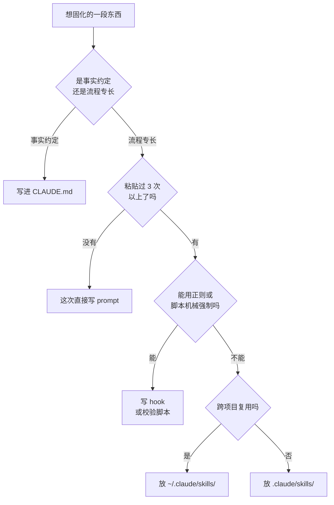

# 033. Skill / superpowers 怎么用、怎么写？

**一句话**：同一段多步流程你粘贴过 3 次以上就抽成 skill，成败全在 `description` —— 只写「做什么 + 什么时候用」并带上用户会说出口的关键词，别把流程摘要写进去，写完必须在全新会话里分别测触发率和效果。

## 30 秒结论

| 你看到的 | 立刻做 | 不想再犯 |
|---|---|---|
| skill 该触发时不触发 | 先问 `What skills are available?` 确认它在列表里，再跑 `/doctor` 看 description 有没有被截断 | description 里放用户会自然说出口的关键词，以 `Use when...` 收尾 |
| `/name` 手动能用，但从不自动触发 | frontmatter YAML 坏了导致 metadata 为空，跑 `--debug` 看解析错误 | 提交前用 `--debug` 起一次会话确认 metadata 解析成功 |
| 不该触发的时候乱触发 | description 写得更具体，或加 `disable-model-invocation: true` | 有副作用的动作（deploy/commit）一律只许手动 |
| agent 只照 description 干活，没读正文 | 把 description 里的流程摘要删掉 | description 只写何时用，流程留正文 |
| CLAUDE.md 里某一节从「一条事实」长成「一套流程」 | 抽成 skill | 事实归 CLAUDE.md，流程归 skill |



## 怎么做

### 第一步：判断这到底该不该是 skill

| 问题 | 答 Yes → | 答 No → |
|------|---------|---------|
| 你是否重复粘贴过这段指令/流程 ≥3 次？ | 可能该封装 | 别封装，直接用 prompt |
| 它是流程/专长（怎么做），还是事实/约定（是什么）？ | 流程 → skill | 事实 → CLAUDE.md |
| 它是否跨项目/跨场景可复用？ | 是 → `~/.claude/skills/` | 否 → `.claude/skills/` |
| 它是判断类知识，还是能用正则/脚本强制？ | 判断类 → skill | 机械约束 → hook / 校验脚本 |

superpowers 独立给出的四条「该封装」信号，和官方几乎一致：这个技巧不是靠直觉就能想到的、你会跨项目重复引用它、模式适用面广不是某项目特有、别人也会受益。

### 第二步：建目录，选作用域

```
my-skill/
├── SKILL.md           # 主指令（必需）
├── reference.md       # 详细参考（按需加载）
├── examples/sample.md # 输出示例（按需加载）
└── scripts/validate.sh # 可执行脚本（执行，不读进上下文）
```

<details>
<summary>四个存放位置与同名时的优先级</summary>

| 位置 | 路径 | 作用于 |
|------|------|--------|
| 个人 | `~/.claude/skills/<name>/SKILL.md` | 你的所有项目 |
| 项目 | `.claude/skills/<name>/SKILL.md` | 仅本项目（可进版本控制，团队共享） |
| 插件 | `<plugin>/skills/<name>/SKILL.md` | 启用该插件处 |
| 企业 | managed settings | 组织全员 |

同名时优先级：企业 > 个人 > 项目 > 内置。注意这与 settings 等其他配置通行的「企业 > 项目 > 个人」次序不同，是官方文档明写的 skill 特例[^7]。插件 skill 用 `plugin-name:skill-name` 命名空间，不会冲突。

</details>

### 第三步：写 frontmatter —— description 是成败关键

| 字段 | 必需 | 说明 |
|------|------|------|
| `name` | 否（默认取目录名） | 显示名。仅小写字母、数字、连字符，≤64 字符，禁含 `anthropic`/`claude` 保留词 |
| `description` | 推荐（事实上必需） | 写清「做什么 + 什么时候用」，用第三人称。这是 Claude 决定要不要加载的唯一依据。字段本身上限 1024 字符；进入 skill 列表后，`description` + `when_to_use` 的合并文本在 1536 字符处截断 |

四条写法要点：

- **用第三人称**，因为它会被注入 system prompt。正确：`Processes PDF files...`；错误：`I can help you...` / `You can use this...`。
- **同时写「做什么」和「什么时候用」，并带关键词。** 例：`Extract text and tables from PDF files, fill forms. Use when working with PDFs or when the user mentions PDFs, forms, or document extraction.`
- **以 `Use when...` 收尾**，聚焦触发条件。
- **别在 description 里概括流程。** superpowers 实测发现 agent 会把流程摘要当捷径，直接跳过读正文[^4]。反例：`Use for TDD - write test first, watch it fail, write minimal code`；正例：`Use when implementing any feature or bugfix, before writing implementation code`。

<details>
<summary>控制触发行为的常用可选字段（含四种配置模式）</summary>

| 字段 | 作用 |
|------|------|
| `disable-model-invocation: true` | 禁止 Claude 自动触发，只能你 `/name` 手动（适合 deploy/commit 等有副作用的动作） |
| `user-invocable: false` | 从 `/` 菜单隐藏，只让 Claude 自动用（适合背景知识型 skill） |
| `allowed-tools: Bash(git add *)` | skill 激活时预批准这些工具（免逐次确认） |
| `disallowed-tools: AskUserQuestion` | skill 激活时移除这些工具（适合后台循环 skill） |
| `context: fork` + `agent: Explore` | 在 fork 出的 subagent 里跑（隔离上下文，见 [032 篇](./032-SubAgent并行开几个.md)） |
| `paths: src/**/*.ts` | 仅当工作文件匹配 glob 时自动激活 |
| `argument-hint` / `arguments` | 声明位置参数，配合 `$0` / `$ARGUMENTS` 替换 |

**1. 有副作用的动作，只许手动触发：**

```yaml
---
name: deploy
description: Deploy the application to production
disable-model-invocation: true
allowed-tools: Bash(git push *) Bash(npm run deploy)
---
```

**2. 背景知识型，只许 Claude 自动用、从 `/` 菜单藏起来：**

```yaml
---
name: legacy-system-context
description: How the legacy billing system works, its quirks and failure modes
user-invocable: false
---
```

**3. 在隔离的 subagent 里跑，避免污染主上下文：**

```yaml
---
name: deep-research
description: Research a topic thoroughly across the codebase
context: fork
agent: Explore
---
```

**4. 限定文件路径才触发：**

```yaml
---
paths: apps/web/**/*.{ts,tsx}
---
```

</details>

### 第四步：写正文 —— 精简是第一原则

官方 best practices 开篇第一条就是「Concise is key」。默认假设是 Claude 本来就很聪明，你只需要补充它不知道的东西。每加一段都自问：这段配得上它占用的 token 成本吗？

四条硬约束：

- **正文控制在 500 行以内。** 超了拆成附属文件，正文只留导航。
- **附属引用只深一层。** 即 `SKILL.md → reference.md`，不要再 `reference.md → details.md` 套娃 —— Claude 预览深层文件时可能只 `head -100` 读一部分，信息会丢。
- **超过 100 行的参考文件要加目录**，方便 Claude 预览时看到全貌。
- **正文是常驻指令，不是一次性步骤。** skill 一旦被调用，正文会作为一条消息进入对话并在后续每一轮都留着，Claude Code 不会每轮重新读文件。

### 第五步：测它（不测等于没写）

看到 skill 被触发，只能说明 Claude 找到了它，不能说明它做对了事。两件事分开测：

1. **触发率**：开一个全新会话，用你真实会说出口的那句话（不要照抄 description）提问，看它加不加载。不加载就改 description。
2. **效果**：触发之后产出对不对。不对就改正文。

官方给的基线测法是：在全新会话里分别跑「开 skill」和「关 skill」对比结果，并推荐用 `skill-creator` 插件把这套评估自动化，含两个版本 skill 的盲测 A/B[^8]。superpowers 更极端，把写 skill 当 TDD 做 —— 先跑基线看 agent 没有 skill 时怎么失败（RED），再写 skill 让它变对（GREEN），最后堵漏洞（REFACTOR）。

### 排错：不触发 / 触发太频繁

<details>
<summary>不触发时的 6 步检查清单（触发太频繁的处理在末尾）</summary>

1. description 里有没有用户会自然说出口的关键词。
2. 问 `What skills are available?`，确认它出现在列表里。
3. 把请求改得更贴近 description 再试一次。
4. 如果是 user-invocable，直接 `/skill-name` 手动触发看正文是否正常。
5. frontmatter 的 YAML 坏了会导致 metadata 为空 —— 症状是 `/name` 还能用但自动触发失效，跑 `--debug` 看解析错误。
6. description 预算溢出：装太多 skill 时描述会被截断、丢掉关键词。先跑 `/context`，看 skill 分项里有没有你这个 skill —— **不在列表里就是被预算挤出去了，改多少遍 description 都没用**。再跑 `/doctor` 看哪些被截断，然后用 `skillListingBudgetFraction` 调高预算，或把低优先级 skill 设成 `"name-only"`。

触发太频繁时：description 写得更具体，或加 `disable-model-invocation: true` 改成纯手动。

</details>

<details>
<summary>5 分钟写一个「总结改动」skill（官方入门示例）</summary>

```bash
mkdir -p ~/.claude/skills/summarize-changes
```

写入 `~/.claude/skills/summarize-changes/SKILL.md`：

```markdown
---
description: Summarizes uncommitted changes and flags anything risky. Use when the user asks what changed, wants a commit message, or asks to review their diff.
---

## Current changes

!`git diff HEAD`

## Instructions

Summarize the changes above in two or three bullet points, then list any risks you notice such as missing error handling, hardcoded values, or tests that need updating. If the diff is empty, say there are no uncommitted changes.
```

两种触发方式都能测：在一个 git 项目里问 `What did I change?`（自动触发），或直接输入 `/summarize-changes`（手动触发）。

注意 `` !`git diff HEAD` `` 这行语法。它是动态上下文注入：Claude Code 会在把 skill 正文发给 Claude 之前先执行这条命令，把输出替换进 prompt。所以 Claude 看到的是「已经填好 diff 的指令」，而不是命令本身。需要把实时数据喂给 skill 时很有用。

</details>

<details>
<summary>superpowers：社区最完整的 skill 集合，以及它的 skill 长什么样</summary>

`obra/superpowers` 用一组 skill 替代了原生 plan mode，把 [031 篇](./031-plan-execute-review循环.md) 的 plan-execute-review 循环做成一条不可绕过的链：

1. **`brainstorming`**：任何创意工作之前强制激活。探索上下文，一次只问一个问题，提出 2-3 个带取舍的方案，呈现设计，等用户审批后才动手写 spec。
2. **`writing-plans`**：把 spec 转成详细实现计划，详细到「假设执行者对代码库零上下文」也能照做。
3. **`executing-plans`**：逐步执行，每个检查点暂停验收。

配套还有 `test-driven-development`（强制 RED-GREEN-REFACTOR，见 [030 篇](./030-AI写的测试不可信.md)）、`systematic-debugging`、`verification-before-completion`、`requesting-code-review` 等。它的 `using-superpowers` skill 甚至定了一条硬规则：哪怕只有 1% 的可能某个 skill 适用，也必须调用它。这是用 skill 强制流程的极端形态。

`brainstorming` 的真实 frontmatter：

```yaml
---
name: brainstorming
description: "You MUST use this before any creative work - creating features, building components, adding functionality, or modifying behavior. Explores user intent, requirements and design before implementation."
---
```

正文包含 `<HARD-GATE>` 标签（设计获批前禁止写代码）、一段名为「Anti-Pattern: This Is Too Simple To Need A Design」的反模式说明、检查清单，以及一张 graphviz 流程图。这是「纪律强制型 skill」的典型做法：用强硬指令加反模式表和「偷懒话术」对照表，堵住 agent 抄近路的借口。

注意它用了 `You MUST use this...` 这种强指令措辞，和官方推荐的第三人称客观描述有出入。这是社区实践为提高触发率做的取舍，两种写法都能工作；想和官方保持一致就用第三人称。

</details>

<details>
<summary>compact 时 skill 会被重新挂载，但有预算上限</summary>

auto-compaction 发生时，被调用过的 skill 会被重新挂载：每个保留前 5000 tokens，合计预算 25000 tokens，从最近调用的开始往里填[^5]。装了太多 skill 又都触发过，老的会被整条丢掉。

**能直接照做的推论**：重要指令写在 `SKILL.md` 最前面，因为截断是从后往前砍的。这也是正文要精简的原因之一。上下文压缩的完整机制见 [012 篇](../02-上下文工程/012-上下文窗口要爆了.md)。

</details>

## 为什么

### 渐进披露：装 100 个 skill 也几乎不占常驻 token

skill 不是「又一种 prompt」，而是把人类专家的流程化经验打包成 agent 能自己发现的资源。核心机制叫 progressive disclosure（渐进披露）—— 像一本先给目录、再到章节、最后是附录的手册，让 Claude 只在需要时加载信息，因此一个 skill 能塞进的内容量几乎没有上限[^1]。

<details>
<summary>三层加载的时机与大小</summary>

| 层级 | 何时加载 | 大小 |
|------|---------|------|
| **第 1 层**：`name` + `description` frontmatter | 启动时预加载进每个会话的 system prompt | 官方给约 100 tokens / skill；官方 skill 实测中位约 80，最大 235 |
| **第 2 层**：`SKILL.md` 正文 | Claude 判断「相关」时才读进来 | 通常 <500 行（<5k tokens） |
| **第 3 层**：附属文件（reference.md / scripts/） | 正文指向它、且当前任务真需要时才读 | 无上限 |

</details>

这也解释了 skill 和 CLAUDE.md 的根本区别：CLAUDE.md 是常驻税，每一轮对话都占 token；skill 是按需调用，不用就不花 token[^2]。

**算笔账，才知道「装多少个开始有代价」。** 只有第 1 层是常驻成本：Anthropic 17 个官方 skill 实测，发现层中位约 80 tokens 一个，最小 55（webapp-testing），最大 235（xlsx）[^6]。照中位算，装 100 个 skill 的常驻开销约 1 万 tokens —— 200K 窗口的 5%。作为对照，一个 GitHub MCP server 暴露 90 多个工具，光 JSON schema 就 5 万多 tokens[^6]，还没开始推理。同样是「给 Claude 加能力」，量级差 5 倍。

所以答案不是「skill 越少越好」，而是：**几十个 skill 完全不用心疼，真正会咬人的是 description 写太长和装了一堆常驻 MCP。** 两个能直接照做的动作：

- description 控制在两三行 —— 它是唯一进常驻预算的部分，写长了不只多花 token，还会挤掉别的 skill 的描述。
- 常驻成本超预算时，先砍 MCP 再砍 skill。判据见 [006 篇](../01-心智与工具/006-MCP装哪些不装哪些.md)。注意 Claude Code 自 v2.1.7 起默认开启 MCP tool search 自动模式：MCP 工具描述超过上下文窗口 10% 时会自动延迟加载[^9]，实际占用可能远低于 5 万，先用 `/context` 量了再动手。

### 四种机制各管一类问题

官方的一句话区分：MCP 负责把 Claude 连到数据上，skill 负责教 Claude 拿到数据后该做什么；而且 skill 是主动的，Claude 自己知道何时该用它。

<details>
<summary>五种机制对照：CLAUDE.md / Skill / Command / MCP / SubAgent</summary>

| 机制 | 本质 | 触发方式 | 适合 | 不适合 |
|------|------|---------|------|--------|
| **CLAUDE.md** | 常驻上下文（事实/约定） | 始终在上下文 | 项目事实、命名约定、不可遗忘的硬规则 | 流程化指令（该抽成 skill） |
| **Skill** | 按需加载的专长（指令+脚本+资源） | Claude 自动发现 **或** `/skill-name` 手动 | 重复出现的多步流程、领域专长、可复用检查清单 | 一次性任务、项目特定约定 |
| **Slash Command** | prompt 模板 | 只能你手动 `/name` | 你想完全掌控触发时机的动作（已并入 skill 体系） | 需要自动触发的场景 |
| **MCP** | 外部数据/工具连接器 | 始终可用 | 连数据库、Slack、GitHub、内部 API | 教 Claude 怎么用这些数据（那是 skill 的活） |
| **SubAgent** | 独立上下文窗口的专精 agent | 委派 | 隔离上下文、对抗式 review（见 [032 篇](./032-SubAgent并行开几个.md)） | 跨会话复用的专长（那该是 skill） |

</details>

一个重要演进：Claude Code 已经把 custom commands 并入 skill 体系。放在 `.claude/commands/deploy.md` 的命令文件和放在 `.claude/skills/deploy/SKILL.md` 的 skill，都会创建出 `/deploy`，用法完全一样。skill 是 command 的超集，多出三个能力：目录里能放附属文件、能用 frontmatter 控制谁能触发、能让 Claude 自动加载。**所以新项目一律用 skill，别再新建 `.claude/commands/` 目录**（旧文件仍兼容）。

### 官方给的封装判断线只有一句

当你不断把同一段指令、检查清单或多步流程粘进对话，或者 CLAUDE.md 里某一节从「一条事实」长成了「一套流程」时，就该建一个 skill[^3]。

反过来，四种情况不该封装：一次性的解决方案、别处已有充分文档的标准实践、项目特定的约定（放该项目的 CLAUDE.md）、能用正则或校验脚本强制的机械约束（直接自动化，别浪费文档）。

> 个人观点（小C）：很多人把 skill 理解成「把 prompt 存成一个文件」，这其实是把 skill 降级成了 command。skill 真正的价值有两点：渐进披露带来的「装 100 个也不爆上下文」，以及 Claude 会自动发现并触发。最好的判断测试是：如果你在第三个项目里又把同一段流程手敲了一遍，那就是信号 —— 抽成个人 skill 放 `~/.claude/skills/`，以后所有项目自动可用。

## 别这么干

- ❌ **把一次性任务封装成 skill。** skill 的复利来自复用。判断信号：你没重复粘贴过 3 次以上，就别封装。
- ❌ **description 写得太抽象。** `Helps with documents` 这种描述让 Claude 无法判断何时触发。必须同时写「做什么 + 什么时候用」并带用户会说出口的关键词。
- ❌ **在 description 里概括流程。** agent 会把流程摘要当捷径，跳过读正文。description 只写何时用。
- ❌ **有副作用的动作不设 `disable-model-invocation: true`。** 不加这个字段，Claude 可能在「看起来代码写完了」时自动触发 deploy/commit。
- ❌ **写完不测就用。** 「触发了」只说明 Claude 找到了它，不说明它做对了。触发率和效果要分开测，用全新会话做基线对比。

<details>
<summary>还有五条低频但会踩的反模式</summary>

- ❌ **SKILL.md 正文超过 500 行。** 一旦被调用，正文每轮都占 token。超了就拆成附属文件。（官方）
- ❌ **附属引用套娃。** `SKILL.md → ref.md → detail.md` 会导致 Claude 只 `head -100` 部分读取、丢失信息。引用只深一层，所有附属文件都直接从 SKILL.md 链接。（官方）
- ❌ **给 skill 起模糊名（helper / utils / tools）。** 官方命名规范是动名词（`processing-pdfs`）或动词短语（`process-pdfs`），并禁用 `anthropic` / `claude` 保留词。（官方）
- ❌ **装太多 skill 导致 description 预算溢出。** 描述被截断会丢关键词，该触发时不触发。跑 `/doctor` 检查，把低优先级设成 `"name-only"` 或调高 `skillListingBudgetFraction`。（官方）
- ❌ **把「事实/约定」塞进 skill 正文，或在正文里写满「解释为什么」。** 事实归 CLAUDE.md（常驻但短），流程归 skill（按需但长）；Claude 已经很聪明，只补它不知道的。（官方）

</details>

<details>
<summary>换成 Cursor / Copilot 呢</summary>

| 维度 | Claude Code Skill | Cursor Rules | GitHub Copilot |
|------|------------------|--------------|----------------|
| **形态** | `SKILL.md` 文件夹 + frontmatter + 附属脚本/参考（Agent Skills 开放标准） | `.cursor/rules/*.mdc`（带 frontmatter 的规则文件） | `.github/copilot-instructions.md`（单文件）/ `agents.md` personas |
| **加载机制** | 渐进披露：元数据预加载，正文按需，附属文件延迟 | rules 按 `alwaysOn` / `auto` / `model` / `agent` 模式按需注入 | instructions 常驻；agents.md 按角色 |
| **自动触发** | Claude 据 description 自动发现并加载 | `auto` / `agent` 模式据描述匹配 | 无原生自动发现（靠 instructions 常驻） |
| **附带可执行脚本** | ✅ scripts/ 目录，Claude 直接执行 | ❌ 纯规则文本 | ❌ |
| **跨工具可移植** | ✅ Agent Skills 开放标准（VS Code、Gemini CLI、Codex 等也支持） | ❌ Cursor 专属 | ❌ Copilot 专属 |
| **社区生态** | anthropics/skills 官方库 + obra/superpowers 等 | Cursor 官方 rules 库 + 社区 | 社区 agents.md 模板 |

三点观察：

- **Claude Code 的 skill 是目前扩展机制里最完备的**：支持自动发现、附带可执行脚本、跨工具可移植，Agent Skills 已成为开放标准。
- **Cursor 的 `.cursor/rules` 是最接近的对应物**：同样有 frontmatter、能按描述自动匹配、支持 alwaysOn/auto 等模式，但不支持附带可执行脚本，规则只是纯文本指令。
- **Copilot 的 instructions 最简陋**：单文件常驻，没有渐进披露也没有自动发现。agents.md 的 personas 提供了角色化，但仍是静态注入。

共性趋势是三家都在把领域专长和流程打包成可复用、按需加载的资源，差异在于 Claude Code 的三层渐进披露机制最成熟、token 经济性最好。

</details>

## 延伸

**相关文章**

- [#031 让 AI 改一个小功能，它却动了一堆无关文件怎么办？](./031-plan-execute-review循环.md) —— superpowers 的 brainstorming → writing-plans → executing-plans 三段链把这条循环强制化
- [#032 SubAgent 并行到底该开几个？](./032-SubAgent并行开几个.md) —— skill 的 `context: fork` + `agent: Explore` 让 skill 在隔离 subagent 里跑
- [#030 AI 写的测试一跑就过、还偷偷删测试怎么办？](./030-AI写的测试不可信.md) —— superpowers 的 `test-driven-development` skill 把 TDD 铁律强制化
- [#013 哪些决策必须写进 memory 才扛得住 compact](../02-上下文工程/013-哪些决策要写进memory.md) —— CLAUDE.md（事实常驻）与 skill（流程按需）的边界
- [#012 上下文窗口要爆了怎么办？](../02-上下文工程/012-上下文窗口要爆了.md) —— compact 时 skill 重新挂载的预算规则

**参考资料**

- [Extend Claude with skills — Claude Code Docs](https://code.claude.com/docs/en/skills) —— 支撑 skill 创建、frontmatter 全字段、触发控制、同名优先级、动态上下文注入、排错清单、skill-creator 评估流程、内容生命周期与 compact 重挂载预算（官方，2026-08-15 核实）
- [CHANGELOG — anthropics/claude-code](https://github.com/anthropics/claude-code/blob/main/CHANGELOG.md) —— 支撑 MCP tool search 自 v2.1.7 起默认开启、10% 阈值自动延迟加载（官方，2026-01）
- [Skill authoring best practices — Claude API Docs](https://platform.claude.com/docs/en/agents-and-tools/agent-skills/best-practices) —— 支撑「Concise is key」、正文 500 行上限、引用只深一层、description 写法与命名规范、先建评估（官方，2026）
- [Equipping agents for the real world with Agent Skills — Anthropic](https://www.anthropic.com/engineering/equipping-agents-for-the-real-world-with-agent-skills) —— 支撑渐进披露三层设计哲学与开放标准化（官方，2025-10，2025-12 更新）
- [Skills explained — Claude blog](https://claude.com/blog/skills-explained) —— 支撑三层 token 预算数字（~100 / <5k）与 skill vs MCP vs subagent 的边界厘清（官方，2026-03）
- [writing-skills SKILL.md — obra/superpowers](https://github.com/obra/superpowers/blob/main/skills/writing-skills/SKILL.md) —— 支撑「description 只写触发条件」「写 skill 也走 TDD」与四条封装信号（社区/开源，2025-2026）
- [brainstorming SKILL.md — obra/superpowers](https://github.com/obra/superpowers/blob/main/skills/brainstorming/SKILL.md) —— 支撑纪律强制型 skill 的真实结构：HARD-GATE、反模式段、流程图（社区/开源，2025-2026）
- [obra/superpowers](https://github.com/obra/Superpowers) —— 支撑三段链与配套 skill 清单（社区/开源，2026）
- [Claude Code Skills vs Slash Commands — MindStudio](https://www.mindstudio.ai/blog/claude-code-skills-vs-slash-commands-2) —— 支撑 skill 与 command 的社区侧对比（社区，2026-04；该文把 skill 等同于「可调用函数」的说法窄化了，本篇不采用）
- [I Watched 100+ People Hit the Same Claude Skills Problems — natesnewsletter](https://natesnewsletter.substack.com/p/i-watched-100-people-hit-the-same) —— 支撑「skill 不触发的首要原因是含糊的 description」（社区，2025-2026，单一来源，与官方排错指引方向一致）
- [I Built 106 Claude Skills. 12 Dos and Don'ts — Medium](https://medium.com/@mohit15856/i-built-106-claude-skills-here-are-the-12-dos-and-donts-i-wish-i-d-known-earlier-8f4f13903f28) —— 支撑「坏的 description 不告诉 Claude 何时用」（社区，2025-2026）
- [Specification — Agent Skills (agentskills.io)](https://agentskills.io/specification) —— 支撑 Agent Skills 开放标准的 SKILL.md 结构与 frontmatter 字段（社区/标准，2025-12）
- 《Agent Skills 开放标准：从 Claude Code 功能到行业基础设施》—— 支撑发现层 token 中位数、100 个 skill 的常驻开销、与 GitHub MCP server schema 开销的对比（个人研究，2026-03）
- [Use Agent Skills in VS Code — VS Code Docs](https://code.visualstudio.com/docs/agent-customization/agent-skills) —— 支撑跨工具可移植性（官方，2026）

[^1]: [Equipping agents for the real world with Agent Skills — Anthropic](https://www.anthropic.com/engineering/equipping-agents-for-the-real-world-with-agent-skills)（官方，2025-10）：渐进披露是让 Agent Skills 灵活可扩展的核心设计原则，skill 能塞进的内容量几乎没有上限。
[^2]: [Skills explained — Claude blog](https://claude.com/blog/skills-explained)（官方，2026-03）：元数据最先加载（约 100 tokens），完整指令在需要时加载（<5k tokens），附带文件或脚本只在真正用到时才加载。
[^3]: [Extend Claude with skills — Claude Code Docs](https://code.claude.com/docs/en/skills)（官方，2026-06）：当你不断把同一段指令、检查清单或多步流程粘进对话，或 CLAUDE.md 某节从事实长成流程时，就该建 skill。
[^4]: [writing-skills SKILL.md — obra/superpowers](https://github.com/obra/superpowers/blob/main/skills/writing-skills/SKILL.md)（社区/开源，2025-2026）：实测发现 agent 会把 description 里的流程摘要当捷径，直接跳过读正文。
[^5]: [Extend Claude with skills — Claude Code Docs](https://code.claude.com/docs/en/skills)（官方，2026-06）：auto-compaction 时被调用过的 skill 重新挂载，每个保留前 5000 tokens、合计预算 25000 tokens，从最近调用的开始填。
[^6]: 《Agent Skills 开放标准》读书笔记（个人研究，2026-03-26）：17 个官方 skill 发现层中位约 80 tokens（55–235），100 个约 1 万 tokens；一个 GitHub MCP server 暴露 90+ 工具、JSON schema 超 5 万 tokens。两组数字笔记标注引自 Anthropic 工程博客，本篇未逐字回查原文，按社区/笔记转述采用，量级与官方「约 100 tokens / skill」一致。
[^7]: [Extend Claude with skills — Claude Code Docs](https://code.claude.com/docs/en/skills)（官方，2026-08-15 核实）：原文明写 "enterprise overrides personal, and personal overrides project"，且任一层级的 skill 覆盖同名内置（bundled）skill——skill 的个人层压过项目层，与 settings 的次序相反，是文档明确的特例。
[^8]: [Extend Claude with skills — Claude Code Docs](https://code.claude.com/docs/en/skills)（官方，2026-08-15 核实）：Run evals with skill-creator 一节，基线对比是在全新会话里分别以「有 skill / 禁用 skill」跑同一批真实 prompt；`skill-creator` 插件（官方 marketplace）把这个循环自动化，含两版 skill 的盲测 A/B。
[^9]: [CHANGELOG v2.1.7 — anthropics/claude-code](https://github.com/anthropics/claude-code/blob/main/CHANGELOG.md)（官方，2026-01，2026-08-15 核实）：Enabled MCP tool search auto mode by default for all users——MCP 工具描述超过上下文窗口 10% 时自动延迟加载，改由 MCPSearch 工具按需发现。

---

<sub>难度 高级 · 配置题 · 主线 Claude Code，横向 Cursor / Copilot</sub>

<sub>**时效**：机制数字（metadata 约 100 tokens、正文 <500 行、`description` 字段上限 1024 字符、`description` + `when_to_use` 合并文本 1536 字符截断、compact 重挂载每技能保留前 5000 / 合计 25000 tokens）与 frontmatter 字段、同名优先级（企业 > 个人 > 项目 > 内置）、`skillListingBudgetFraction` / `"name-only"` 设置、skill-creator 评估流程、MCP tool search 默认开启（v2.1.7 起、10% 阈值）、「custom commands 已并入 skills」，均已于 2026-08-15 对照官方 skills 文档与官方 changelog 逐项核实；其中 1024 字符上限出自 platform 端 best practices，Claude Code 端文档现已不再单独标注该数字。**已知不确定**：「skill 不触发的首要原因是含糊 description」出自单一社区来源，方向与官方排错指引一致但无官方量化；superpowers 的 `You MUST use this...` 写法属社区取舍，与官方第三人称建议有出入；token 经济学的三个数字（发现层中位 80、100 个约 1 万、GitHub MCP schema 5 万+）来自个人研究笔记转述 Anthropic 工程博客，未逐字回查原文。**易变**：预算类数字与 frontmatter 字段清单随 Claude Code 迭代变化，用前回查官方 skills 文档。</sub>

> 本篇个人实践（L4）：`[待补：BOSS 的实战经验——你封装过哪个 skill 解决了重复流程 / 或踩过 description 写太抽象不触发的坑 / superpowers 启用前后工作流的变化]`
