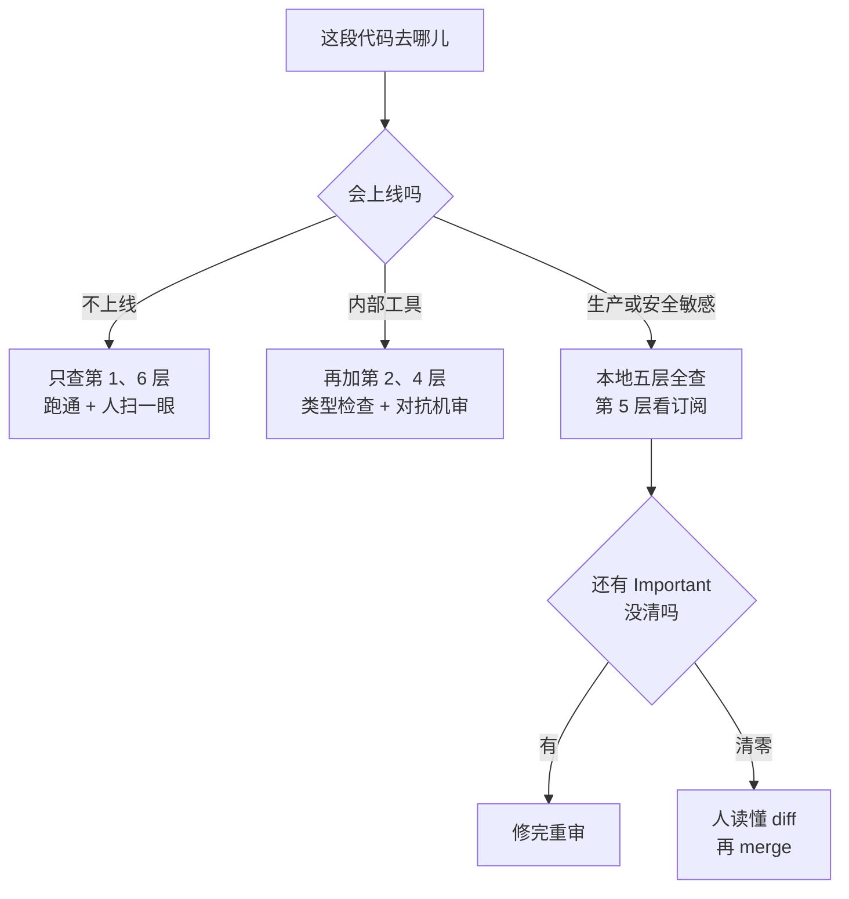

# 040. AI 说"做完了"、测试也全绿，怎么知道代码是真的对？

**一句话**：验证不是"人读一遍"，是断言、约束、运行、对抗机审、人这五层本地分工，外加一个"有 Team/Enterprise 才谈得上"的托管 CI 门禁条件层 —— 按场景风险决定叠几层，但最后签字的永远是人。

## 30 秒结论

| 你看到的 | 立刻做 | 不想再犯 |
|---|---|---|
| 测试全绿，线上还是出 bug | 把需求逐条对 assert，找出没有对应断言的那条 | 先写会失败的测试 |
| AI 说"修好了"，对话里没有任何命令回显 | 让它重跑并原样贴输出 | 配 Stop hook，检查不过不许结束回合 |
| 让写代码那轮自己 review，结论清一色"实现良好、无问题" | 换 `/code-review`（独立 subagent）或换一家模型 | reviewer 永远不等于作者 |
| 机审报了 Important，PR 照样能 merge | 在 CI 里解析 `bughunter-severity` 自己卡（条件层，见第 5 层） | 机审 check run 恒为中性结论 |
| 覆盖率很高，还是漏 bug | 对核心模块跑一次变异测试，看杀不掉的变异体 | 覆盖率只测"跑到了"，不测"断言对了" |
| 原型和生产用同一套验证强度 | 按下图重选层数 | 低风险少叠，高风险不许省 |



## 怎么做

六层自查清单，其中第 1、2、3、4、6 层本地就能做，是必经层；第 5 层依赖托管服务和订阅档位，是**条件层** —— 用不上它不算缺口，把第 4 层做实就行。每层先答一个是/否问题；答"否"就照做最小动作，再用"证据"那行确认真的做对了。全答"是"，说明没有结构性缺口。

### 第 1 层｜断言：agent 有没有一个自己能跑的通过/失败信号

**问**：你交给 Claude 的任务里，有没有一条它自己能跑、能读到结果的命令（测试 / build / lint）？

**做**：把验证条件写进 prompt，让它跑完再停。UI / 样式改动拿不出这样一条命令时，改用截图 diff、控制台 error 数、圈注点三个信号顶上，做法见 [#045 AI 把样式改完了，怎么知道界面没崩？](./045-AI改的界面怎么验证.md)。

```text
写 validateEmail 函数。测试用例：user@example.com 为 true，
invalid 为 false，user@.com 为 false。实现完把测试跑一遍，
把测试输出原样贴出来。
```

**证据**：对话里出现真实测试输出（带 `passed` / `failed` 计数）。只有"我已经验证过了"这类话、看不到命令回显，就是这层没生效。深用见 [#030](../04-执行工作流/030-AI写的测试不可信.md)。

### 第 2 层｜约束：类型 / schema 有没有独立跑一遍

**问**：仓库里有没有一条与测试无关、与实现无关的真值源检查（tsc / pyright / OpenAPI 校验）？

**做**：把类型检查写进 CLAUDE.md 的 workflow 区：`改完一组代码后必须跑 npx tsc --noEmit（或 pyright），有报错先修再继续`。

**证据**：故意让 AI 引一个不存在的成员（`import { notReal } from './utils'`），跑检查应当输出 `error TS2305: Module '"./utils"' has no exported member 'notReal'.`。静默通过说明这层没覆盖到。幻觉查防见 [#042](./042-幻觉API与幻觉依赖.md)。

### 第 3 层｜运行：AI 宣告完成时，有没有硬性拦截

**问**：AI 说"做完了"时，有没有机制**强制**它拿出运行证据，而不是靠你每次记得追问？

**做（弱）**：把检查设成 `/goal` 条件 —— 有一个独立评估器在每一轮之后重新检查该条件，直到成立才罢休。

**做（强）**：配 Stop hook 当确定性闸门，配置见下面的折叠块。

**证据**：故意写一个失败的测试，然后让 Claude 随便改点别的并结束回合。应当看到它没能停下、而是继续去修测试，`/hooks` 里也能列出这条 Stop hook。它照常结束了，说明脚本没执行权限或路径写错。

<details>
<summary>Stop hook 的完整配置与脚本</summary>

Stop hook 无 matcher，写在 `.claude/settings.json`：

```json
{
  "hooks": {
    "Stop": [
      {
        "hooks": [
          { "type": "command", "command": "$CLAUDE_PROJECT_DIR/.claude/hooks/require-tests.sh" }
        ]
      }
    ]
  }
}
```

`.claude/hooks/require-tests.sh`（记得 `chmod +x`）：

```bash
#!/usr/bin/env bash
# 回合结束前跑测试；不过就退 2，阻止 Claude 停下
set -uo pipefail
cd "$CLAUDE_PROJECT_DIR" || exit 0
if ! out=$(npm test --silent 2>&1); then
  echo "测试未通过，先修好再结束本回合：" >&2
  echo "$out" | tail -n 30 >&2
  exit 2
fi
exit 0
```

exit code 2 会把 stderr 回喂给 Claude 并阻止它停下；也可以改成 exit 0 并输出 `{"decision":"block","reason":"..."}`。注意官方限制：**连续 8 次 block 之后 Claude Code 会覆盖 hook 并结束回合**[^1]，所以 Stop hook 不能当死循环用。

</details>

### 第 4 层｜对抗机：reviewer 是不是"作者本人"

**问**：review 这段代码的，是不是刚刚写它的那个上下文？

**做**：用 `/code-review` 审当前 diff。较新版本的终端里默认丢到**后台 subagent**（独立上下文）跑；下面三种情况会退回前台或 fork 会话执行 —— 已经有一个 review 在跑时再次触发、`-p` 非交互模式、设了 `CLAUDE_CODE_DISABLE_BACKGROUND_TASKS=1`。前台执行意味着它和写代码那轮共享上下文，对抗性打折。

它默认审"当前分支领先 upstream 的提交 + 未提交改动"，也可以传文件路径、PR 号、分支名或 `main...my-feature`；`--fix` 直接改进工作区，`--comment` 发成 PR 行内评论。

想对着计划审而不是找 bug，自己写 reviewer prompt：

```text
用一个 subagent 把 rate limiter 的 diff 对照 PLAN.md 审一遍。
检查：每条需求是否都实现了、列出的边界 case 是否都有测试、
有没有改到任务范围之外的东西。只报缺口，不报风格偏好。
```

**证据**：findings 里出现了你和写代码那轮都没提过的问题（比如某个未被断言的边界 case）。结论清一色"实现良好、无问题"时，要么代码确实干净，要么你审的还是同一个上下文 —— 换一家模型再审一遍就能分辨。机制见 [#032](../04-执行工作流/032-SubAgent并行开几个.md)。

### 第 5 层（条件层）｜流水线：CI 里有没有把机审结论变成真门禁

> 本层内容基于官方文档整理，本篇作者未实跑。适用面也窄：托管版 Code Review 处于 research preview，仅 Team / Enterprise 订阅可用，开了 Zero Data Retention 的组织不可用。**个人和小团队直接跳过这一层**，不算验证体系有洞 —— 把第 4 层的本地 `/code-review` 做实，覆盖的是同一类错。

**问**：Claude Code Review 的 finding 在你的 CI 里，是"看看而已"还是能卡住 merge？

**前提**：单次 review 平均约 20 分钟、成本约 15–25 美元，走 usage credits 单独计费。

**关键机制**：它的 check run **永远以中性结论结束**[^2]，不会通过分支保护规则拦住 merge。想卡门禁，得自己在 CI 里读严重度。

**做**：两条命令 —— 先拿 check run ID，再解析严重度；完整门禁见折叠块。

```bash
gh api repos/OWNER/REPO/commits/<commit-sha>/check-runs --jq '.check_runs[] | {id, name}'
gh api repos/OWNER/REPO/check-runs/CHECK_RUN_ID \
  --jq '.output.text | split("bughunter-severity: ")[1] | split(" -->")[0] | fromjson'
```

返回形如 `{"normal": 2, "nit": 1, "pre_existing": 0}`。`normal` 是 Important 的条数，非 0 意味着至少有一个该在 merge 前修掉的 bug。

**证据**：造一个含明显逻辑 bug 的测试 PR（比如把 `>=` 写成 `>` 导致边界越界），等 review 跑完重跑这个 job，应看到 `severity: {"normal":1,...}` 且 job 变红；把 bug 改回去重跑，`normal` 归 0、job 变绿。两次都不变色，说明 jq 解析路径没匹配上，先手跑那条 `gh api` 看原始输出。

<details>
<summary>GitHub Actions 门禁片段（含两个容易踩的坑）</summary>

```yaml
      - name: Gate on Claude Code Review severity
        env:
          GH_TOKEN: ${{ github.token }}
        run: |
          set -euo pipefail
          SHA="${{ github.event.pull_request.head.sha }}"
          # 重跑 / 多次 review 会留下多条同名 check run，只取最新的一条
          ID=$(gh api "repos/${{ github.repository }}/commits/$SHA/check-runs" \
                --jq '.check_runs[] | select(.name=="Claude Code Review") | .id' | head -1)
          if [ -z "$ID" ]; then echo "尚无 Code Review check run"; exit 0; fi
          # 标记缺失时 split(...)[1] 为 null 会让 fromjson 报错，这里兜底成 normal=0
          SEV=$(gh api "repos/${{ github.repository }}/check-runs/$ID" \
                --jq '(.output.text // "") | split("bughunter-severity: ")[1] // "" | split(" -->")[0] | (fromjson? // {"normal":0})')
          echo "severity: $SEV"
          N=$(echo "$SEV" | jq -r '.normal')
          if [ "$N" -gt 0 ]; then
            echo "::error::有 $N 条 Important finding，先修掉再 merge"; exit 1
          fi
```

坑一：这个 job 要等 Code Review 跑完（平均 20 分钟）才有结果。实际用时要么放进单独 workflow 由 `check_run` 事件触发，要么在步骤里加轮询。上面的写法在 check run 还没出现时直接放行，避免误红。

坑二：光让 job 变红不够，还得去 Settings → Branches 把它加进 required status checks。

</details>

### 第 6 层｜人：merge 前有没有人真读懂了这段 diff

**问**：你能不能不看 AI 的说明，用自己的话讲清这段 diff 改了什么、为什么这么改、会影响哪些调用方？

**做**：merge 前给自己三个问题，任一答不上就打回去问 AI 或自己读代码：

1. 这段改动的失败模式是什么？出错时线上会表现成什么样？
2. 有没有调用方依赖了被改掉的旧行为？
3. 如果这次 rollback，需要额外做什么（数据迁移？特性开关？）

**证据**：你能在 PR 评论里用自己的话写出这三条的答案。写不出来就是橡皮图章。人审技巧见 [#041](./041-怎么审查AI生成的代码.md)。

## 为什么

### 测试全绿只证明"代码做了代码做的事"

AI 写代码，再让同一个 AI 给这份代码写测试，测试会天然贴着实现走：

```python
# 实现（AI 写的，有 bug：折扣上限没生效）
def apply_discount(price, rate):
    return price * (1 - rate)

# 测试（AI 接着写的）
def test_apply_discount():
    assert apply_discount(100, 0.2) == 80
```

绿灯。但需求里"折扣率不得超过 0.5"这条根本没被断言过。所以第 1 层的证据标准不是"测试绿了"，而是"每条需求都能指到一个 assert"。

换成覆盖率也一样。覆盖率只记录"这行被执行到了"，不检查"执行结果被断言过"，上面那个测试就能给 `apply_discount` 刷出 100% 行覆盖。Meta 在生产代码上给出过一个更硬的数字：他们用变异测试驱动生成的 571 个加固测试里，277 个（约 49%）不增加任何行覆盖率，但它们抓得到现有测试抓不到的故障[^6]。也就是说，只拿覆盖率当判据，会漏掉近一半真正有价值的测试。

想在覆盖率之外加一个判据，用变异测试：工具自动改坏代码（把 `>=` 改成 `>`、把返回值取反），看你的测试能不能挂掉，挂掉的比例就是 mutation score。Python 用 mutmut。个人研究结论、未经外部确证：核心业务模块把 mutation score 的基线定在 80%，每月体检一次，存活的变异体丢给 AI 让它补测试。

反过来，一旦给 agent 一个能产出通过或失败的东西，这个循环会自己闭合[^3] —— 这就是断言层存在的理由：它把"看起来做完了"换成机器可读的对错。

### 六层全穿过一次，但那不说明层数无效

官方 4-23 postmortem 记录：一个让 Claude 变"健忘"的 bug，通过了多轮人工和自动代码审查，也通过了单元测试、端到端测试、自动化验证和内部试用[^4]。六层全穿。

那还叠个什么劲？三点：

1. **每层挡的是不同类的错，不是同一类的重复投票。** 类型系统挡幻觉 API，测试挡行为回归，人审挡业务意图错。漏掉那个 bug 说明六层里没有一层的职责范围覆盖它，不说明层数无效。
2. **同一份 postmortem 给了正面证据**：back-test 时 Opus 4.7 抓到了这个 bug、Opus 4.6 没抓到。换独立视角有效，这正是第 4 层存在的理由。
3. **叠层是降低漏出概率，不是归零。** 所以决策标准是场景风险，不是"要不要全上"。

### 规模化下，人审最容易退化成盖橡皮图章

AI 的产出速度远超验证速度：一个人每天要看 20 个 PR、50-60 个分散文件，改动是中间三行、这里五行、结尾又四行，根本攒不出整文件的上下文。社区把这叫"验证复杂度壁垒" —— 组件越多，验证它们能否协同工作所需的时间超线性增长。

这跟"责任在人"不矛盾。恰恰因为最终背锅的是签字的那个人，盖橡皮图章才是整个体系里最危险的失效模式。所以第 6 层的判定标准写成了"能不能用自己的话写出三条答案"，而不是"读没读过"。

## 别这么干

- ❌ **把"验证"等同于"人读一遍"。** 人读只是六层里的一层，规模化下还会退化成橡皮图章。
- ❌ **信 AI 的"我修好了"宣告。** 没有运行证据就不算完成[^5]。配 Stop hook，把这条从"我记得追问"变成"系统强制"。
- ❌ **让写代码的那个上下文给自己 review。** 确认偏差，且模型盲区与实现一致。用 `/code-review` 或换模型。
- ❌ **把托管 Code Review 当 merge 门禁。** 它的 check run 恒为中性结论，永远拦不住 merge；要门禁必须自己在 CI 里解析 `bughunter-severity`。另外它默认只关注正确性，不管格式偏好和测试覆盖缺失，想扩范围得写 `REVIEW.md`。
- ❌ **原型和生产用同一套验证强度。** 原型全套是浪费，生产少一层是赌。验证一直不过、越改越糟还硬撑，转 [#043](./043-fix-loop什么时候必须停.md)。

<details>
<summary>换成 Cursor / Copilot / SAST 呢</summary>

| 工具 | 验证体系对应物 | 差异 |
|------|--------------|------|
| Claude Code | Code Review（托管，多 agent）+ 本地 `/code-review` + Stop hook | 唯一同时提供"多 agent 机审"和"确定性 Stop 闸门"的组合；托管版需 Team / Enterprise |
| Cursor | Cursor Bot review | 同属机审，以单 agent 为主 |
| GitHub Copilot | Copilot review | 同属机审 |
| 各厂 SAST | 静态分析 | 属约束层（类型 / lint 的子集），不看业务意图 |

核心差异在"对抗机审 + 跨模型"这一层：Claude Code 原生支持多 agent 编队，而跨模型互查目前还得靠人手动复制粘贴（把 Claude 的代码贴给 ChatGPT 和 Gemini 互查）。机审工具的详细对比见 [#041](./041-怎么审查AI生成的代码.md)。

</details>

<details>
<summary>多 agent 分工的社区模式（指针，非本篇攻略）</summary>

"乒乓结对编程"：第一个 agent 对着 spec 写一个最小的失败测试，第二个 agent 只写刚好能让它通过的最小实现，如此往复。两个 agent 互不共享上下文，机制归 [#032](../04-执行工作流/032-SubAgent并行开几个.md)。

另一种是机审打质量分、人只看低分：让 Claude Code 做 review 并给一个等级分，C 级及以下的活直接打回，不占人审时间。

</details>

## 延伸

**相关文章**

- [#004 Claude Code 能力地图](../01-心智与工具/004-Claude-Code能力地图.md) —— "验证闭合层"的一句话定位，本篇是它的展开
- [#030 AI 写的测试一跑就过怎么办](../04-执行工作流/030-AI写的测试不可信.md) —— 第 1 层断言的完整攻略
- [#031 plan → execute → review 循环](../04-执行工作流/031-plan-execute-review循环.md) —— 本篇是 review 环的体系化
- [#032 SubAgent 并行开几个](../04-执行工作流/032-SubAgent并行开几个.md) —— 第 4 层对抗机审的机制
- [#041 怎么 review AI 生成的代码](./041-怎么审查AI生成的代码.md) —— 第 6 层人审的攻略、REVIEW.md 模板
- [#042 幻觉 API 与幻觉依赖](./042-幻觉API与幻觉依赖.md) —— 第 2 层约束的攻略
- [#043 fix loop 什么时候必须停](./043-fix-loop什么时候必须停.md) —— 验证一直不过时怎么跳出
- [#045 AI 把样式改完了，怎么知道界面没崩？](./045-AI改的界面怎么验证.md) —— 第 1 层断言在 UI 场景的替代信号

**参考资料**

- [Best practices for Claude Code](https://code.claude.com/docs/en/best-practices) —— 支撑第 1 层"给 agent 一个 pass/fail 信号"、`/goal` 的独立评估器、"让 Claude 拿出证据而不是断言成功"、对抗 reviewer 会过度挑刺的提醒（官方，2026-08 核实）
- [Code Review — Claude Code Docs](https://code.claude.com/docs/en/code-review) —— 支撑第 4、5 层：research preview 与 Team/Enterprise 限制、"默认只关注正确性"、中性结论、`bughunter-severity` 两条命令、单次 15–25 美元、`/code-review` 的 flag（官方，2026-08 核实）
- [Hooks reference — Claude Code Docs](https://code.claude.com/docs/en/hooks) —— 支撑第 3 层：Stop hook 的 settings.json 结构、exit 2 阻断、连续 8 次后被覆盖（官方，2026-08 核实）
- [4-23 postmortem](https://www.anthropic.com/engineering/april-23-postmortem) —— 支撑"为什么"第 2 节：六层全穿的实例，以及 Opus 4.7 抓到 / Opus 4.6 漏掉的 back-test（官方，2026-04）
- [obra: verification-before-completion](https://github.com/obra/superpowers/blob/main/skills/verification-before-completion/SKILL.md) —— 支撑"别信宣告"这条底线：没有新鲜验证证据不许宣称完成（社区权威，2026）
- [ACH: Mutation-Guided LLM-based Test Generation at Meta — arXiv:2501.12862](https://arxiv.org/html/2501.12862) —— 支撑"49% 的加固测试不增加行覆盖率"这条覆盖率局限证据（学术/工业报告，FSE 2025 Industry Track，经个人笔记转述）
- [mutmut](https://github.com/boxed/mutmut) —— Python 变异测试工具，mutation score 判据的落地工具（开源，2026-08 核实）
- [HN: When AI writes the software, who verifies it?](https://news.ycombinator.com/item?id=47234917) —— 支撑"为什么"第 3 节的规模化困境（每天 20 个 PR、验证复杂度壁垒、橡皮图章、责任归属），以及折叠块里的乒乓结对、质量分、跨模型互查（社区，2026-02）

[^1]: [Hooks reference — Claude Code Docs](https://code.claude.com/docs/en/hooks)（官方，2026-08 核实）：连续 8 次 block 后 Claude Code 会覆盖 hook 并结束回合。
[^2]: [Code Review — Claude Code Docs](https://code.claude.com/docs/en/code-review)（官方，2026-08 核实）：check run 总以中性结论结束，因此不会通过分支保护规则阻塞合并。
[^3]: [Best practices for Claude Code](https://code.claude.com/docs/en/best-practices)（官方，2026-08 核实）：给 Claude 一个能产出通过或失败的东西，循环就会自己闭合。
[^4]: [An update on recent Claude Code quality reports](https://www.anthropic.com/engineering/april-23-postmortem)（官方，2026-04）：该 bug 通过了多轮人工与自动审查、单元测试、端到端测试、自动化验证和内部试用。
[^5]: [obra: verification-before-completion](https://github.com/obra/superpowers/blob/main/skills/verification-before-completion/SKILL.md)（社区权威，2026）：在没有验证的情况下宣称完成是不诚实，不是高效。
[^6]: [ACH: Mutation-Guided LLM-based Test Generation at Meta — arXiv:2501.12862](https://arxiv.org/html/2501.12862)（学术/工业报告，2025，经个人笔记转述）：571 个加固测试中 277 个（49%）不增加行覆盖率。

---

<sub>难度 中级 · 流程题 · 主线 Claude Code，横向 Cursor / Copilot</sub>

<sub>**时效**：命令、配置片段与产品状态（Code Review 处于 research preview、仅 Team/Enterprise 可用、check run 恒为中性结论、`gh api` 解析 `bughunter-severity` 的写法、Stop hook 的 settings.json 结构）已于 2026-08-03 对照官方文档逐条核实。**已知不确定**：第 5 层（托管 Code Review 的 CI 门禁）全部基于官方文档整理，本篇作者未实跑，命令与门禁片段未经真实 PR 验证；mutation score > 80% 的基线出自个人研究，未经外部确证，Meta 论文本身没有给出这个阈值。"Opus 4.7 抓到、Opus 4.6 漏掉"出自 2026-04 postmortem，是当时代际的快照，只作为"跨代 back-test 有效"的方法论证据。**易变**：托管 Code Review 的可用范围与定价、`/code-review` 的 flag、`--worktree` 类 CLI 行为随版本调整，用前回查官方文档。</sub>

> 本篇个人实践（L4）：`[待补：BOSS 的验证体系实际叠了几层 / 哪层最先上 / 哪层最后才加 / 生产 vs 原型的真实组合]`
