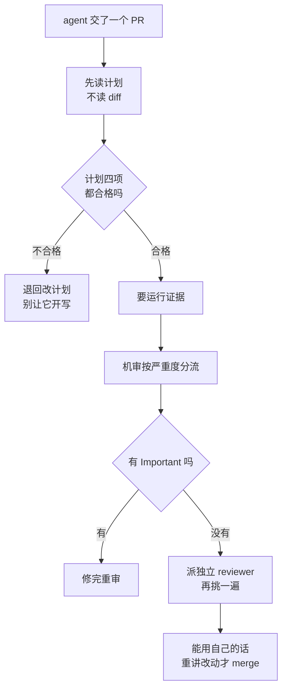

# 041. AI 一次吐几百行 diff 我读不过来、让它自己 review 它只说自己写得好——怎么 review AI 生成的代码？

**一句话**：别从 diff 开始读 —— 先审计划、再让机审按严重度分流、再派一个独立上下文的 reviewer 挑刺，最后你能用自己的话把 Important 那几处改动重讲一遍，才 merge。

## 30 秒结论

| 你看到的 | 立刻做 | 不想再犯 |
|---|---|---|
| 一个 PR 几百行、50+ 文件，读到后面忘了前面 | 打回去让 agent 按功能拆成可独立看懂的小 PR，补 PR 描述 | 计划阶段就限定文件清单和改动边界 |
| 让写代码那轮自己 review，只说"已充分测试、可上生产" | 开一个独立上下文的 reviewer subagent，只给它 diff + 验收标准 | reviewer 永远不等于作者 |
| 机审报了一屏 nit，组里已经开始整片忽略 | 写 `REVIEW.md`，先写"不该报什么"，nit 上限设 5 条（限 Team / Enterprise） | 把 REVIEW.md 当需要维护的配置，不是开关 |
| 机审报了 Important，PR 照样能 merge | 在 CI 里解析 `bughunter-severity` 自己卡 | check run 恒为中性结论，天然不阻塞 |
| agent 说"做完了"，你直接开始读代码 | 先要运行证据：测试输出或命令回显 | 没有新鲜验证证据就不接受完成声明 |
| 只让改一处，diff 里冒出十几个文件、多出没人要的抽象层 | `git diff --name-only` 对一遍计划清单，超出的当场撤掉 | 把「只改要求你改的代码」反写进 CLAUDE.md 和 REVIEW.md |



## 怎么做

五段工作流：self-review → 机审分流 → 对抗机审 → 门禁 → 反写规则防复发。其中第二、四段依赖托管 Code Review，是可选层，跳过不影响其余三段。体系全景见 [#040](./040-怎么验证AI代码是真的对.md)，本篇只挖"人审 + 机审辅助"这一环的执行做法。

### 第一段：self-review —— 从计划读起，不从 diff 读起

**动作一：把 review 左移。** 在 agent 大规模生成代码之前先审它的计划、任务分解和关键 prompt，也就是"审查剧本，而不是审查表演"。读 diff 时对照计划，看它是不是在实现你的意图，而不是看代码碰巧正确。审哪四项、什么样算不合格见折叠块 —— 任何一条不合格就退回改计划，别让它开写。改完计划再写的成本，远低于读完 300 行 diff 才发现方向错了。循环本身见 [#031](../04-执行工作流/031-plan-execute-review循环.md)。

<details>
<summary>审计划的四项检查表</summary>

| 审什么 | 不合格的样子 | 不合格就做什么 |
|--------|--------------|----------------|
| 要改哪些文件 | 计划里没列文件清单，或列的文件跟你预期的模块对不上 | 让它先列出文件清单再动手 |
| 改动边界 | 出现"顺便重构一下 X""统一一下 Y"这类计划外扩张 | 砍掉扩张项，另开一个任务 |
| 验收标准 | 没写"怎么算做完"，或写成"代码能跑" | 要它写成可执行的命令，比如"`pytest tests/test_auth.py` 全绿" |
| 未知项 | 计划里对不确定的地方直接假设了一个答案，没标出来 | 让它把假设列成问题问你，别自己拍板 |

</details>

**动作二：主动把 diff 改得更好读。** 既然 review 成了最贵的环节，就该为"好审"做优化：把大 PR 拆成可独立看懂的小块，补上 PR 描述和设计文档。这件事本身也可以让 AI 去做。

**动作三：区分 AI-Go 区和 AI-No-Go 区。** 核心业务逻辑和安全相关代码是 No-Go 区，人审重点盯；单元测试、文档、模板代码是 Go 区，可以轻审。光记在脑子里没用，要落成两处规则：`.github/CODEOWNERS` 管人（强制拉上对应 owner），`REVIEW.md` 管机审（给 Go 区降门槛），两份配置与验证方法见折叠块。

<details>
<summary>CODEOWNERS 与 REVIEW.md 分区配置及验证方法</summary>

`REVIEW.md` 里给 Go 区降门槛的写法：

```markdown
## 按路径调整严格度
- `src/auth/`、`src/billing/`、`migrations/`：AI-No-Go 区，任何行为改变都按 Important 报，宁可误报。
- `tests/`、`docs/`、`scripts/`：AI-Go 区，只在接近确定且严重时才报。
- `src/gen/`、`*.lock`：不报。
```

GitHub 的 CODEOWNERS 用 gitignore 风格的 glob，后面的规则覆盖前面的：

```
# .github/CODEOWNERS
# 默认：AI-Go 区，谁都能审
*                           @my-org/dev-team

# AI-No-Go 区：必须由对应 owner 审
/src/auth/                  @my-org/security
/src/billing/               @my-org/payments-leads
/migrations/                @my-org/dba
**/*.tf                     @my-org/platform
```

配完到 Settings → Branches 打开 "Require review from Code Owners"，否则 CODEOWNERS 只是加个建议 reviewer，不阻塞。

**怎么确认生效**：开一个只改 `src/auth/` 下文件的测试 PR，确认 PR 的 Reviewers 里自动出现 `@my-org/security`，且在他们 approve 前 merge 按钮是灰的。

</details>

**动作四：agent 报告"做完了"，第一步不是读代码，是要运行证据。** 代码改了不等于修好了，agent 自报成功也不等于验证过[^1]。要的是测试输出、跑过的命令和返回结果。

**动作五：读 diff 的顺序。**

1. 先看 commit message 或 PR 描述是否和计划匹配。不匹配就是意图漂移，先去问 agent。
2. 按文件类别排优先级：安全、认证、数据库迁移这类 No-Go 区文件先读。
3. 重点看被删掉的代码。删测试、删边界检查是常见的偷懒方式，见 [#030](../04-执行工作流/030-AI写的测试不可信.md)。
4. 关注新增的 API 和依赖。查防手法见 [#042](./042-幻觉API与幻觉依赖.md)。
5. 大 diff 先用 `/code-review` 在本地跑一遍筛出重点，这属于第二段。

**动作六：审查通过的核心判据 —— 你能不能用自己的话把这段改动重讲一遍。** 不是"读过了"，也不是"看起来没问题"，是合上 diff 后能说出这段改了什么、为什么这么改、会影响到哪些调用方。讲得出，说明你真的内化了，可以 merge；只能复述 agent 给的措辞（"重构了鉴权逻辑，提升了可维护性"），说明还没想清楚，不该点 approve —— 那一刻你已经从驾驶员变成了盖章的人。至少对 Important 那几处和 No-Go 区文件必须过这一关，其余可以放宽（个人经验）。

### 第二段（可选）：机审分流 —— 严重度 + REVIEW.md

先说清适用范围：本段涉及托管 Code Review（`@claude review`、`REVIEW.md`、check run 严重度）的部分**基于官方文档整理、本篇作者未实跑**，它只对 Team / Enterprise 开放，是可选层不是必经层。个人开发者和没开这个服务的团队，跳过本段和第四段，直接用本地 `/code-review`，第一、三、五段照样成立。

机审的定位是分流的闸门，不是替人读。它默认只关注正确性 —— 会让线上出故障的 bug，不管格式偏好和测试覆盖缺失[^2]。上不上、值不值得，先算一笔账（见折叠块），别默认"开着总没坏处"。

**三档严重度怎么读。** 🔴 Important 是合并前应该修的 bug，🟡 Nit 值得修但不阻塞，🟣 Pre-existing 不是这个 PR 引入的。人审只聚焦 🔴，🟡 批量扫一眼，🟣 基本可忽略。

**REVIEW.md：写"不该报什么"比写"该报什么"更重要。** 它会作为最高优先级指令注入到 review 管道里的每一个 agent。Cloudflare 的经验是：告诉 LLM 不做哪些事，才真正体现提示词工程的价值；没有这些限制，就会收到大量推测性的理论警告，开发者会立刻学会忽略它们[^3]。Uber 的结论一致 —— 精准比数量更重要，一个净生成低质量建议的工具会很快失去开发者信任。

七个调优 pattern 与可直接抄的模板见折叠块。**判断它真的生效了**，分三条各自验证，别只看"报的条数变少了" —— 三条验证步骤和基线对比法也见折叠块。

<details>
<summary>REVIEW.md 三条生效验证与基线对比</summary>

1. **确认被读到**：临时在 `REVIEW.md` 的 Summary shape 段要求 review 正文以 `[REVIEW.md active]` 开头，评一次 `@claude review` 看第一行有没有这个前缀。没有 → 检查文件是不是在仓库根目录。验完删掉这行。
2. **确认 nit 上限生效**：找一个风格问题多的 PR（比如批量重命名）跑一次，数 🟡 的内联评论条数，应 ≤ 5 且摘要里出现 "plus N similar items"。超过 5 条通常是 `REVIEW.md` 太长稀释了规则，删到只剩改变行为的指令。
3. **确认跳过规则生效**：故意在 `src/gen/` 下改一个明显有问题的地方推上去，确认 review 对这个文件一条评论都没有。还在报就是路径写法和实际目录对不上。

配之前先跑一次 review，记下评论总条数和 Important / Nit 的比例当基线；配完再跑一次同类 PR，Nit 明显下降、Important 条数没减少，才算调对了。

</details>

<details>
<summary>先算账：机审什么时候是净负担</summary>

命中任意一条就先别上，或者只在部分路径上开：

| 情况 | 为什么是净负担 |
|------|----------------|
| 团队每天 PR 量小、人本来就读得完 | 机审只是加了一层要人去分辨真假的噪音，瓶颈没被解开 |
| 你还没写 REVIEW.md 或等价的"不该报什么" | 默认配置下 nit 会淹掉 Important，开发者很快学会整片忽略 |
| CI 分钟数或 token 预算紧、PR 量大 | 官方给的量级是单次 review 平均 20 分钟、15–25 美元，×每天几十个 PR，账单和排队时间都不小（同类产品 Copilot 的社区实测是 30 万行仓库单次 5-10 分钟，仅作量级类比） |
| 仓库大部分是生成代码、配置、文档 | 机审在这些路径上几乎只产出风格意见 |

反过来值得上的信号：PR 量已经大到人只能草草扫一眼；仓库里有安全、权限、迁移这类 No-Go 区需要兜底；你愿意花时间维护 REVIEW.md。第一次上时把触发模式设成手动，只对重要 PR 评 `@claude review`，跑两周看命中率再决定要不要全开。

社区的反方意见值得先看：信噪比差，而且大多数情况下只要人看得够仔细同样能发现关键 bug，真正的瓶颈还是人的注意力；LLM 不敢冒险把一个问题的严重程度判低，所以它没法有效过滤掉 nit（这句来自一家做 AI code review 的创业公司创始人）。

厂商侧的正面数据要按立场打折：Anthropic 自家博客称机审上线后得到实质性 review 评论的 PR 从 16% 升到 54%，大 PR 里 84% 有发现、平均每个 7.5 条、被标错的比例低于 1%。测量口径（什么算"实质性评论"、误报由谁判定）没有公开，也没有第三方复现。它能说明的是量级，不是中立基准。

</details>

<details>
<summary>触发命令表 + REVIEW.md 七个 pattern 与可抄模板</summary>

| 命令 | 干什么 |
|------|--------|
| PR 评论 `@claude review` | 单次 review，**不**订阅后续 push（2026-07 前它是订阅的，官方改了） |
| PR 评论 `@claude review always` | 开始 review，并订阅该 PR 后续每次 push |
| PR 评论 `@claude review once` | 与不带参数的 `@claude review` 完全相同 |
| 本地 `/code-review` | 审当前分支领先 upstream 的提交加未提交改动 |
| `/code-review main...my-feature` | 审指定目标，可传文件路径、PR 号、分支名或 ref 区间 |
| `/code-review --comment` / `--fix` | 贴成 PR 内联评论 / 直接把修复应用到工作区 |
| `/code-review low` … `max` | 调 effort：`low`/`medium` 只报最有把握的，`high`/`max` 撒更大的网 |
| `/code-review ultra --fix` | 跑云端更深度的 ultrareview，并应用修复 |

三个容易踩的点：评论命令必须发成 PR 顶层评论且放在评论开头；`@claude review` 这类托管服务只对 Team / Enterprise 开放；本地 `/code-review` **不读 REVIEW.md**，那条链路靠 CLAUDE.md。

七个 pattern：重定义严重程度、限制 nit 数量、跳过规则、仓库专属检查、验证门槛（发现要带 `file:line`）、重审收敛（第一轮后只报 Important）、摘要格式。下面这份模板每一段对应一个 pattern，放仓库根目录、文件名就叫 `REVIEW.md`：

```markdown
# Review instructions

## What Important means here
Reserve Important for findings that would break behavior, leak data,
or block a rollback: incorrect logic, unscoped database queries, PII
in logs or error messages, and migrations that aren't backward
compatible. Style, naming, and refactoring suggestions are Nit at most.

## Cap the nits
Report at most five Nits per review. If you found more, say "plus N
similar items" in the summary instead of posting them inline.

## Do not report
- Anything CI already enforces: lint, formatting, type errors
- Generated files under `src/gen/` and any `*.lock` file
- Test-only code that intentionally violates production rules

## Always check
- New API routes have an integration test
- Log lines don't include email addresses, user IDs, or request bodies
- Database queries are scoped to the caller's tenant

## Re-review behavior
After the first review, suppress new nits and post Important findings only.

## Verification bar
Behavior claims need a `file:line` citation in the source, not an
inference from naming.

## Summary shape
Open the review body with a one-line tally such as `2 factual, 4 style`.
If there are no factual issues, lead with "no factual issues."
```

它是**逐字粘贴**进 review agent 的系统提示的，所以 `@` 导入语法不会展开，被引用的文件也不会被读进去，规则得直接写在文件里。

</details>

### 第三段：对抗机审 —— 换独立上下文 / 换模型

**生成与自评同体，盲点容易重合** —— 一段输出的错误往往出在生成它的那套判断上，同一套判断再跑一遍倾向于确认自己。所以让审查者换会话、换角色，是目前社区讨论里成本最低的去偏手段。具体表现就是：同一个上下文、同一个模型跑出来的机审有确认偏差，写代码的 agent 只会向你保证代码"已充分测试、可上生产"。一个"视角全新"的 agent 没有"被告知要写什么、然后自己写出来"的包袱，更敢挑刺 —— 聊天类模型会把之前整段对话史当成既定事实，去掉这段历史就去掉了这种偏向。这一节的依据是社区讨论加一次未复现的社区实验[^8]，属于"方向有共识、量化未确证"档，按场景取用。

赶时间的话只有五个动作：独立上下文 reviewer（最先上）、分配专业角色、跨模型互查、按风险分流、乒乓式结对，每个的一句话动作和成本见折叠块。

<details>
<summary>五个动作速查表</summary>

| 做法 | 一句话动作 | 成本 |
|------|-----------|------|
| 独立上下文 reviewer | 开一个子 agent，只给它 diff + 验收标准，不给写代码那段对话 | 低，最先上 |
| 分配专业角色 | 给 reviewer 指定单一职责（安全 / 性能 / 质量），每个都写清"不该报什么" | 低 |
| 跨模型互查 | 把 diff 贴给另一家模型审一遍，**审的那个不能比写的那个弱** | 中，手动复制粘贴 |
| 按风险分流 | 小改动用 `/code-review low`，碰安全文件才 `max` 或 `ultra` | 低 |
| 乒乓式结对 | 一个 agent 按 spec 写最小失败测试，另一个只写让它通过的最小实现 | 高，适合核心逻辑 |

</details>

**证据**：findings 里出现了你和写代码那轮都没提过的问题。清一色"实现良好"，就换一家模型再审一遍分辨。子 agent 机制见 [#032](../04-执行工作流/032-SubAgent并行开几个.md)。

**跨模型互查有方向，选反了是负收益。复审者的能力必须不低于生成者** —— 「换一个模型」本身不产生价值，「换一个更强的模型」才产生价值；反过来让较弱的模型去审更强模型的产出，它改坏的比修好的多，通过率不升反降。代价是单任务延迟涨到约三倍、成本涨到约两倍多，这也解释了为什么对抗机审值得放在最后一道，而不是每次都开[^8]。

<details>
<summary>分配专业角色的工业级样本：Cloudflare 七个 reviewer</summary>

Cloudflare 用最多七个专业审查器分管安全、性能、代码质量、文档、发布管理和合规，再由一个协调器去重并判断实际严重程度；它还按 diff 规模调 reviewer 数量：10 行以内只上协调器加一个通用 reviewer 共 2 个，超过 100 行或超过 50 个文件（尤其碰到安全敏感文件）才上满最多 7 个。**这套参数你抄不了** —— 托管的 Code Review 没有"配 reviewer 数量"这个旋钮，那是 Cloudflare 自建流水线里的调度逻辑，你手上的等价旋钮只有本地 `/code-review` 的 effort。能复刻的是这一条：每个角色都带上"不该报什么"，比如它的安全 reviewer 明确规定不报理论风险、不报未改动的代码、不报"考虑用某个库"这类建议。

</details>

### 第四段（可选）：门禁 —— 把严重度变成 CI 里的红灯

本段同样依赖托管 Code Review，**基于官方文档整理、本篇作者未实跑**，没开这个服务就跳过。机审的 check run 总以中性结论结束，所以它永远不会通过分支保护规则阻塞合并[^4]。想卡门禁，自己在 CI 里读 check run 输出的严重度统计 —— 解析命令、完整的 Actions job 和门禁验证方法见折叠块。

**让机审先打分，人只看低分。** 门禁之外还有一档更省力的分流：让 `/code-review` 在报 finding 的同时给这个 diff 打一个等级分，C 级及以下的直接打回让 agent 重做，不占人审时间。有限的人审精力应该投在机审打了低分、但又不到 Important 的那批 diff 上。注意打分**不是 `/code-review` 的内置功能**（官方文档未见此项），是自定 prompt 玩法：在 `CLAUDE.md` 里加一条即可，比如"每次 code review 结束时，按'A=可直接合、B=小修、C=逻辑有硬伤、D=方向错了'给整个 diff 一个总评分并说明扣分点"（个人实践）。

**留一个应急放行口。** 热修复场景下人可以 override 机审：真人审查者加一个 `break glass` 注释就强制批准，无论机审发现了什么，但要用遥测跟踪它的使用率。Cloudflare 的数据是前 30 天 48095 个 MR 里只用了 288 次，占 0.6% —— 这个比例可以当你自己的告警线。

<details>
<summary>严重度解析命令 + GitHub Actions 门禁完整 job（含轮询和 fail open）+ 门禁验证</summary>

先在本地验证解析命令能取到数：

```bash
OWNER=my-org; REPO=my-service; SHA=$(git rev-parse HEAD)

CHECK_RUN_ID=$(gh api "repos/$OWNER/$REPO/commits/$SHA/check-runs" \
  --jq '.check_runs[] | select(.name == "Claude Code Review") | .id')

gh api "repos/$OWNER/$REPO/check-runs/$CHECK_RUN_ID" \
  --jq '.output.text | split("bughunter-severity: ")[1] | split(" -->")[0] | fromjson'
```

预期输出形如 `{"normal": 2, "nit": 1, "pre_existing": 0}`，`normal` 就是 Important 的条数。`CHECK_RUN_ID` 为空说明这个 commit 上还没跑过 review（官方称平均要 20 分钟）或者仓库没开这个服务，别急着往 CI 里塞。

完整的 Actions job：

```yaml
name: Code Review Gate

on:
  pull_request:
    types: [opened, synchronize, reopened]

jobs:
  gate:
    runs-on: ubuntu-latest
    permissions:
      checks: read
      pull-requests: read
    steps:
      - name: Wait for Claude Code Review and gate on Important findings
        env:
          GH_TOKEN: ${{ github.token }}
          OWNER_REPO: ${{ github.repository }}
          SHA: ${{ github.event.pull_request.head.sha }}
        run: |
          set -euo pipefail

          # 最多等 30 分钟（官方说单次 review 平均 20 分钟）
          for i in $(seq 1 60); do
            RUN=$(gh api "repos/$OWNER_REPO/commits/$SHA/check-runs" \
              --jq '.check_runs[] | select(.name == "Claude Code Review") | select(.status == "completed") | .id' \
              | head -n 1)
            if [ -n "$RUN" ]; then break; fi
            echo "waiting for Claude Code Review... ($i/60)"
            sleep 30
          done

          if [ -z "${RUN:-}" ]; then
            echo "::warning::Code Review 没有在 30 分钟内完成，本次不阻塞"
            exit 0
          fi

          SEVERITY=$(gh api "repos/$OWNER_REPO/check-runs/$RUN" \
            --jq '.output.text | split("bughunter-severity: ")[1] | split(" -->")[0] | fromjson')
          echo "severity breakdown: $SEVERITY"

          IMPORTANT=$(echo "$SEVERITY" | jq -r '.normal')
          if [ "$IMPORTANT" -gt 0 ]; then
            echo "::error::Claude Code Review 报了 $IMPORTANT 个 Important 发现，修完再合"
            exit 1
          fi
          echo "no Important findings"
```

两点说明。第一，review 运行是 best-effort、失败不会自动重试，所以超时这条分支必须 fail open（`exit 0`），否则基础设施抖一下就把所有 PR 卡死。第二，要真正阻塞合并，还得去 Settings → Branches 把这个 job 加进 required status checks，光让它变红不够。

**怎么确认门禁真的接上了**：开一个测试 PR，故意把权限判断的 `if (!user.isAdmin)` 写成 `if (user.isAdmin)`。等 review 跑完，check run 的 Details 里应出现 🔴 Important，gate job 失败并打印 Important 条数；把 bug 改回来重推，输出应变成 `{"normal":0,...}` 且 job 变绿。两次都符合预期才算接上；job 一直绿多半是 `CHECK_RUN_ID` 压根没取到，走了 fail open 分支。

</details>

### 第五段：反写 —— 把审查清单变成规则，让它先自缚

前四段都是事后动作。同一类问题被你审出来第 2 次，就该把这条检查项反写成规则，让 agent 在写之前先自己过一遍。最值得反写的是**越界改动**：你只让它改一个函数，它交回来一个 12 个文件的 diff。

**越界改动的四种形态。** 认准形态，才写得出可观测信号 —— 四种形态与各自的可观测信号见折叠块。

<details>
<summary>越界改动四种形态与可观测信号</summary>

| 形态 | 它交回来的样子 | 可观测信号 |
|------|----------------|------------|
| 改了没让改的代码 | 顺手"统一"了别处的命名、格式、导入顺序 | `git diff --name-only` 的文件数超出计划里的文件清单 |
| 小改动重写整文件 | 让改 3 行，整个文件被重排 | 单文件 `git diff --stat` 的改动行数 > 该文件总行数的 60%（个人经验取值，按仓库习惯自调） |
| 无需求的抽象层 | 多出 interface / 工厂 / 基类 / 配置项，只有一个实现 | 新增的抽象在需求文档和任务清单里找不到对应条目；实现类只有一个 |
| 不可能场景的错误处理 | 给内部调用加了一圈 try/except 和重试 | 捕获的异常在现有调用路径下无法触发；写不出一个能命中它的测试 |

</details>

**先做交付前自检。** 在 review 之前，先让 agent 自己回答一个问题：**"你是不是只动了要求你动的代码？"** 让它逐条列出改了哪些文件、每个文件对应计划里的哪一条，对不上的当场撤掉。这一步不产出结论也有价值 —— 它会逼着 agent 把 diff 和计划摆在一起对，而这正是它自己写的时候没做的事。

**自己核一遍，别信它的自述**：`git diff --name-only main...HEAD` 对计划清单，`git diff --stat main...HEAD` 挑出改动行数超过文件总行数 60% 的文件（被整体重写的信号），再对新增的接口/基类逐个问"哪条需求要的"。

**怎么确认反写生效**：写完规则后开一个新会话，给一个明确限定单文件的小任务（比如"只改 `src/auth/token.py` 的过期判断"）。生效的样子是 `git diff --name-only` 只有 1 个文件，且 agent 结束时主动报了"本次只改动 X 文件，对应需求第 N 条"。仍然多改文件 → 规则没被读到，`/context` 看 **Memory files** 里有没有你的文件。

**规则文件放哪。** 两条链路要分别写，不能只写一处：`CLAUDE.md`（或 `.claude/rules/` 下的路径域规则）管写代码那轮，`REVIEW.md` 管托管机审 —— 本地 `/code-review` 不读 `REVIEW.md`，走的是 `CLAUDE.md` 这条。可直接粘贴的条款见折叠块。

要注意：CLAUDE.md 和 rules 都是**上下文，不是强制配置层**，官方明说要无条件拦住某个动作得用 PreToolUse hook[^6]。所以自缚条款只能降低越界频率，降不到零 —— 第一段"审计划"和这里的 `git diff --name-only` 复核都还得留着。想要一道更硬的：挂 Stop hook，在一轮结束时比对文件数，超出就用 `hookSpecificOutput.additionalContext` 把提醒喂回去让它自己收拾[^7]。

<details>
<summary>可直接粘贴的自缚条款（CLAUDE.md / REVIEW.md 两份）</summary>

放进 `CLAUDE.md` 或 `.claude/rules/scope.md`，管住写代码那一轮：

```markdown
## 改动范围

- 只修改完成本次任务必须修改的代码。看到别处有问题，写进结论里，不要顺手改。
- 小改动就做小改动：不重排文件、不调整无关的导入顺序和格式。
- 不新增没有对应需求条目的抽象层（interface / 基类 / 工厂 / 配置项）。
  只有一个实现的抽象一律不写，等出现第二个实现再抽。
- 只为能写出触发测试的失败场景加错误处理。写不出触发它的测试，就不要加。
- 结束前自查并汇报：本次改了哪些文件、每个文件对应需求的哪一条。
  有对不上的，先撤掉再汇报。
```

放进 `REVIEW.md`，让机审也认这条（接在「Always check」那段后面）：

```markdown
## Scope discipline
Report as Important any change outside the stated scope of the PR
description: edits to files the description doesn't mention, whole-file
rewrites for small changes, new abstractions with a single implementation
and no linked requirement, and error handling for paths the current
callers cannot reach.
```

`.claude/rules/` 下的文件可以加 `paths` frontmatter 只在改到匹配文件时才加载，省常驻上下文；不加 `paths` 的规则每次会话都全量载入。规则写太死也有代价，只为已经发生过第 2 次的失败加条款，别为假想边界加，见 [#010](../02-上下文工程/010-CLAUDE-md怎么写才生效.md)。

</details>

## 为什么

### review 成了瓶颈，不是因为你读得慢

官方给的数字是：过去一年里每个 Anthropic 工程师的代码产出增长了 200%，代码 review 因此成了瓶颈，很多 PR 只被草草扫一眼而不是被认真读[^5]。社区侧的具体体感是：一天 20 个 PR、50 到 60 个文件，但记不住整个文件的上下文，因为改动是分散的 —— 中间三行、这里五行、结尾又四行。

在这种速度差之下，"从头读到尾"必然退化成走过场。所以本篇给的是工作流，不是"读仔细点"。

### "读完一遍"不等于"验证过"

三个失效点：读不过来（上面的数字）；读完不等于读懂（改动分散导致上下文断裂）；让 AI 自己 review 有确认偏差（聊天类模型会把整段对话史当成既定事实）。五段工作流分别对应这三点 —— 左移和拆 PR 治读不过来，机审分流治读不懂重点，对抗机审治确认偏差，门禁把结论固化成不可绕过的检查，反写规则治同类问题复发。

### 噪音会摧毁信任，而且是不可逆的

机审失败最常见的形态不是"漏报"，是"报太多然后被整片忽略"。Uber 的 uReview 因此做了多阶段流水线：三个专业助理（Standard 查逻辑缺陷、Best Practices 查风格规范、AppSec 查安全漏洞）之后，还有一个 Review Grader 二次打分、过滤低置信度评论，再做语义去重、抑制历史上被证明低价值的评论类型。它自报的效果是会互动的工程师把 75% 的评论标为有用。

Uber 也给了具体的口味数据：可读性挑剔、小的日志调整、低影响的性能优化、风格问题，开发者评分都很差；正确性 bug、缺失的错误处理、编码最佳实践的违规，评分都很好。这就是 REVIEW.md 要先写"不该报什么"的原因。

## 别这么干

- ❌ **把 review 等同于"从头读到尾"。** 人根本读不过来。要左移读计划、拆小块、机审分流。
- ❌ **让写代码的 agent 自己 review（同上下文同模型）。** 确认偏差。用独立上下文的 reviewer 子 agent 或跨模型。
- ❌ **不算账就把机审全仓打开，或者 REVIEW.md 只写"该报什么"。** 噪音会摧毁信任，且不可逆 —— 开发者一旦学会整片忽略，后面再调准也没人看了。先手动触发跑两周看命中率。
- ❌ **把机审当最终裁判：它说没问题就 merge。** 它不批准也不阻塞 PR，结论是中性的；架构意图、跨系统副作用、微妙的并发错误它都抓不到。
- ❌ **信 AI 的"我修好了"就跳过 review。** 没有新鲜验证证据不接受完成声明。review 里发现问题、让 agent 改却越改越糟，转 [#043](./043-fix-loop什么时候必须停.md)。

<details>
<summary>换成 Cursor / Copilot 呢</summary>

对应物都有：Cursor 有 Cursor Bot review，GitHub 有 Copilot review，各厂也有各自的 SAST 静态安全扫描工具。

核心差异在"多 agent 编队 + 跨模型互查"。Claude Code 原生支持多 agent 编队，而跨模型互查目前靠人手动复制粘贴（把 Claude 写的代码贴给 ChatGPT 和 Gemini 互查）。另外要把成本算进来：GitHub 官方 changelog 明确 2026-06-01 起 Copilot code review 在消耗 AI Credits（按 token 计量）之外还吃 Actions 分钟数，双重计费；"30 万行的仓库单次 review 跑 5-10 分钟"是社区实测量级，未见官方确证。

更详细的机审工具生态对比不在本篇范围，且变化很快，请以各家官方文档为准。

</details>

## 延伸

**相关文章**

- [#040 AI 说"做完了"、测试也全绿，怎么知道代码是真的对？](./040-怎么验证AI代码是真的对.md) —— 验证体系全景，本篇是其中"人审"一环的执行层面深入
- [#030 AI 写的测试一跑就过怎么办](../04-执行工作流/030-AI写的测试不可信.md) —— 测试作为验证手段的攻略，本篇不碰 TDD 的红绿循环
- [#031 plan → execute → review 循环](../04-执行工作流/031-plan-execute-review循环.md) —— self-review 段"先读计划"对应的循环
- [#032 SubAgent 并行开几个](../04-执行工作流/032-SubAgent并行开几个.md) —— 对抗机审段"独立上下文 reviewer、乒乓结对"的机制
- [#042 幻觉 API 与幻觉依赖](./042-幻觉API与幻觉依赖.md) —— 读 diff 第 4 步"新 API、新依赖"的查防手法
- [#043 fix loop 什么时候必须停](./043-fix-loop什么时候必须停.md) —— review 出问题让 agent 改却越改越糟时怎么跳出
- [#010 CLAUDE.md 怎么写才生效](../02-上下文工程/010-CLAUDE-md怎么写才生效.md) —— 第五段自缚条款放在哪、怎么增怎么减、别为假想边界加规则
- [#053 AI 生成的 PR 太大太多，review 机制怎么扛住不崩？](../06-工程协作/053-AI的PR太大没法review.md) —— 本篇讲单个 PR 怎么审，053 讲 PR 又大又多时机制怎么扛

**参考资料**

- [Code Review — Claude Code 文档](https://code.claude.com/docs/en/code-review) —— 支撑第二、四段：REVIEW.md 七个 pattern 与放置规则、三档严重度、`bughunter-severity` 解析、`@claude review` 三种写法的区别与 2026-07 起不再默认订阅后续 push 的行为变更说明、单次 review 平均 20 分钟、`/code-review` 的 flag 与 effort、中性结论、单次 15–25 美元（官方，2026-08-15 核实）
- [Bringing Code Review to Claude Code](https://claude.com/blog/code-review) —— 支撑"为什么"第 1 节的 200% 产出增长与"只被草草扫一眼"；16%→54%、84% / 7.5 条、误报低于 1% 是**厂商自报效果数据**，无第三方复现；数字已对照原文核实无误，其中"大 PR"的原文口径是改动超 1000 行（官方博客，2026-03，2026-08-15 对照原文）
- [GitHub 文档：About code owners](https://docs.github.com/en/repositories/managing-your-repositories-settings-and-features/customizing-your-repository/about-code-owners) —— 支撑 AI-No-Go 区落地：CODEOWNERS 的 glob 语法与"后写覆盖先写"规则（官方）
- [obra: verification-before-completion](https://github.com/obra/superpowers/blob/main/skills/verification-before-completion/SKILL.md) —— 支撑动作四"先要运行证据"：没有新鲜验证证据不接受完成声明（社区权威，2026）
- [HN: When AI writes the software, who verifies it?](https://news.ycombinator.com/item?id=47234917) —— 支撑第三段对抗机审的依据（视角全新、挑剔地审、跨模型、乒乓结对）与第一段的"为好审做优化"、"每天 20 个 PR"（社区，2026-02）
- [HN: There is an AI Code Review Bubble](https://news.ycombinator.com/item?id=46766961) —— 支撑折叠块里"机审何时是净负担"的反方：信噪比差、LLM 过滤不掉 nit、缺上下文超不过 linter（社区，2026-02）
- [GitHub Changelog: Copilot code review will start consuming Actions minutes on June 1, 2026](https://github.blog/changelog/2026-04-27-github-copilot-code-review-will-start-consuming-github-actions-minutes-on-june-1-2026/) —— 支撑横向对比的双重计费：2026-06-01 起 Copilot code review 在 AI Credits 之外消耗 Actions 分钟数（官方，2026-04-27 发布，2026-08-15 核实）
- [HN: Copilot code review will start consuming Actions minutes](https://news.ycombinator.com/item?id=47932028) —— 仅支撑"30 万行仓库单次 5-10 分钟"这一社区实测量级，未见官方确证（社区，2026-05）
- [Cloudflare：大规模编排 AI 代码审查](https://blog.cloudflare.com/zh-cn/ai-code-review/) —— 支撑"不该报什么"、最多七个专业 reviewer 与按 diff 规模分档（≤10 行 2 个、>100 行或 >50 文件最多 7 个）、break glass 与 0.6% 使用率、机审局限的坦诚（社区权威，2026-04，2026-08-15 对照原文）
- [Uber：uReview](https://www.uber.com/blog/ureview/) —— 支撑"为什么"第 3 节：多阶段流水线 + Review Grader、会互动的工程师把 75% 评论标为有用、开发者对各类评论的口味数据（官方，2025-08，2026-08-15 对照原文）
- [How Claude remembers your project — Claude Code 文档](https://code.claude.com/docs/en/memory) —— 支撑第五段：CLAUDE.md / `.claude/rules/` 是上下文不是强制层、`paths` frontmatter 路径域加载、`/context` 的 Memory files 验证法（官方，2026-08-04 核实）
- [Hooks reference — Claude Code 文档](https://code.claude.com/docs/en/hooks) —— 支撑第五段"更硬的一道"：Stop hook 的退出码 2 与 `hookSpecificOutput.additionalContext`（官方，2026-08-04 核实）
- [PatrickJS/awesome-cursorrules](https://github.com/PatrickJS/awesome-cursorrules) —— 支撑第五段越界改动四种形态的归纳与自缚条款写法（社区，2026-08）
- [tonybai：AI 代码审查的危与机](https://tonybai.com/2025/12/27/code-review-hell-in-ai-age/) —— 支撑动作一、动作三：审查剧本而非表演、AI-Go 与 AI-No-Go 分区（社区权威，2025-12）

[^1]: [obra: verification-before-completion](https://github.com/obra/superpowers/blob/main/skills/verification-before-completion/SKILL.md)（社区权威，2026）：没有新鲜验证证据不接受任何完成声明；"改了代码就当修好"和"agent 自称成功"都不算验证。
[^2]: [Code Review — Claude Code 文档](https://code.claude.com/docs/en/code-review)（官方，2026-08 核实）：Code Review 关注正确性 —— 会搞垮生产的 bug，不管格式偏好和测试覆盖缺失。
[^3]: [Cloudflare：大规模编排 AI 代码审查](https://blog.cloudflare.com/zh-cn/ai-code-review/)（社区权威，2026-04）：告知 LLM 不做哪些事才真正体现提示词工程的价值，否则开发者会立即学会忽略警告。
[^4]: [Code Review — Claude Code 文档](https://code.claude.com/docs/en/code-review)（官方，2026-08 核实）：check run 总以中性结论结束，因此不会通过分支保护规则阻塞合并。
[^5]: [Bringing Code Review to Claude Code](https://claude.com/blog/code-review)（官方博客，2026-03）：每个工程师的代码产出一年增长 200%，review 成为瓶颈。
[^6]: [How Claude remembers your project — Claude Code 文档](https://code.claude.com/docs/en/memory)（官方，2026-08 核实）：CLAUDE.md 与 `.claude/rules/` 被当作上下文而非强制配置，要无条件拦住某个动作应改用 PreToolUse hook；CLAUDE.md 作为系统提示之后的一条 user message 注入，不保证严格遵守。
[^7]: [Hooks reference — Claude Code 文档](https://code.claude.com/docs/en/hooks)（官方，2026-08 核实）：Stop hook 退出码 2 会阻止本轮结束并把 stderr 交回模型；也可用 `hookSpecificOutput.additionalContext` 在回合末尾注入非报错反馈让对话继续。
[^8]: 社区实验（r/ClaudeAI，2026-08-04，1102 赞）：116 个 Python 任务上的双向交叉复审对照。强审弱 71.6% → 89.7%（修好 26、改坏 5）；弱审强 91.4% → 82.8%。成本 $0.19 → $0.44/任务，延迟 38.5s → 112.4s。单次测量、未见复现、未见官方确证，仅作量级参考。

---

<sub>难度 中级 · 流程题 · 主线 Claude Code，横向 Cursor / Copilot</sub>

<sub>**时效**：命令、flag、`gh` + `jq` 门禁片段、单次 review 平均 20 分钟与 15–25 美元标价已于 2026-08-15 对照官方 code-review 文档逐条核实；一个刚变过的行为是 2026-07 起 `@claude review` 不再订阅后续 push，要订阅得写 `@claude review always`，官方文档已明写此变更。第五段的两条官方断言（CLAUDE.md / rules 是上下文不是强制层、Stop hook 的退出码 2 与 `additionalContext`）已于 2026-08-04 对照官方 memory 与 hooks 文档核实。**已知不确定**：越界改动的四种形态与四条可观测信号是社区规则文件的归纳加实践总结，**未见官方确证**，其中"单文件改动行数 > 文件总行数 60% 即为重写"这个阈值是**个人经验取值**，没有官方或社区的量化依据，只能当粗筛，读者按自己仓库的文件粒度自调；"能不能用自己的话把改动重讲一遍"这条通过判据同样来自个人实践，不是官方标准；给 diff 打等级分是自定 prompt 玩法，非 `/code-review` 内置功能；第二、四段涉及托管 Code Review 的做法（`@claude review`、`REVIEW.md` 注入、check run 严重度解析、CI 门禁片段）**基于官方文档整理、本篇作者未实跑**，已按可选层标注；"30 万行仓库单次 review 5-10 分钟"（Copilot）是社区实测，**未见官方确证**；Anthropic 的三组效果数字（16%→54%、84% / 7.5 条、误报低于 1%）是厂商自报、无第三方复现；Cloudflare（48095 个 MR / 288 次 break glass / 0.6%）与 Uber（75% 评论被标为有用）同样是各家自报的内部快照。**易变**：`/code-review` 的子命令、flag、严重程度标记随版本调整；托管 Code Review 截至 2026-08 仍是 research preview、仅 Team / Enterprise 可用、单次标价 15–25 美元；Copilot review 2026-06-01 起吃 Actions 分钟数加 AI Credits，计费细则按 GitHub 官方文档为准（2026-08-15 核实）。</sub>

> 本篇个人实践（L4）：`[待补：BOSS 的 review 工作流实际怎么走 / REVIEW.md 写了什么 / 用没用跨模型互查 / 哪段最先上哪段最后才加]`
