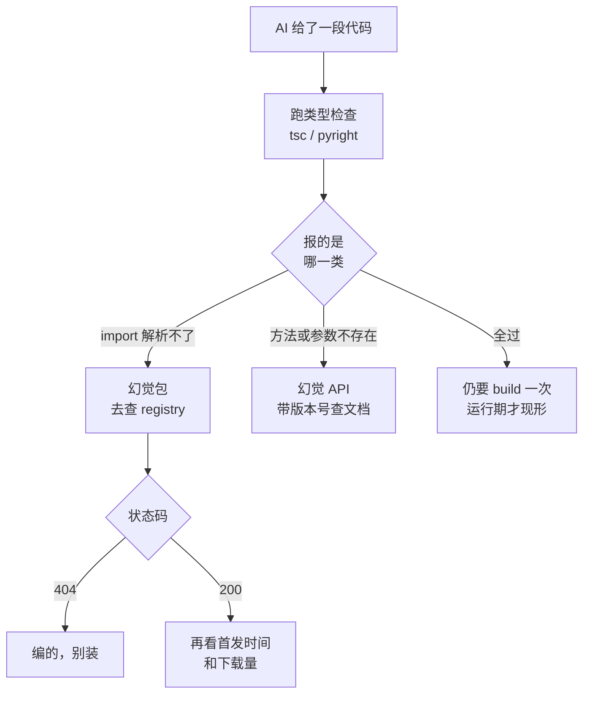

# 042. AI 写的方法不存在、pip install 报 404、API 参数对不上——幻觉 API 和幻觉依赖怎么查、怎么防？

**一句话**：别靠记忆判断"这个 API 存不存在" —— 跑一次类型检查分出是幻觉包还是幻觉 API，包去 registry 查状态码和首发时间，API 带着 lockfile 里的版本号去查官方文档，最后 build 一次让它现形。

## 30 秒结论

| 你看到的 | 立刻做 | 不想再犯 |
|---|---|---|
| `pip install` / `npm install` 报 404 | `curl` 查 registry 状态码坐实，别再让 AI 换个名字试 | lockfile 钉死依赖，新包进不来 |
| 包装上了，但首发在几周内、周下载量三位数以内 | 当疑似 slopsquatting 抢注处理，不装 | 装前查首发时间 + 下载量，不只看"存在" |
| `AttributeError` / `TypeError: unexpected keyword argument` | 带上 lockfile 里的版本号去查官方文档，不查 AI 的记忆 | 让 agent 先用 Context7 查文档再写 |
| TS 报 "Property does not exist"，Python 侧却一声不吭 | Python 靠 pyright 的 `reportMissingImports`，Ruff 没有等效规则 | 两侧的约束层要各配各的 |
| `npm audit` / `pip-audit` 全绿，幻觉包还在 | 换 registry 查询 + lockfile，SCA 挡不住这一类 | 别把 SCA 当幻觉闸门 |



## 怎么做

先把幻觉分成两类，因为查法完全不同：**幻觉包**是 AI 让你装的依赖根本不存在，**幻觉 API** 是包真、但方法名 / 参数 / 签名 / 版本错。下面这张矩阵负责对号入座，每格给"挡什么、怎么配"。

| 手段 \ 类型 | **幻觉包**（不存在的依赖） | **幻觉 API**（方法名 / 参数 / 签名 / 版本错） |
|------|------|------|
| **类型系统** | pyright `reportMissingImports`（默认 `"error"`）、mypy 报 `Cannot find implementation or library stub`、TS 在 import 阶段就挡 | TS `strict` / mypy / pyright 挡方法名与参数类型错 |
| **lint** | **只有 JS 侧有**：`import/no-unresolved` + `import/no-extraneous-dependencies`。Python 侧 Ruff 没有等效规则，靠上一行 | 挡不住通用情况。只有库专属规则集（`NPY001`/`NPY201` 管 NumPy、`AIR301` 管 Airflow）能挡该库的废弃 API |
| **lockfile** | `package-lock.json` / `uv.lock` / `poetry.lock` 把"装什么"钉死，新加的包不在 lock 里就装不进来，`npm ci` 直接失败 | 钉住的是**版本漂移**：保证运行时的库版本和你核对文档时是同一个，避免"文档查的 2.x、装上的是 3.x" |
| **官方文档核对** | Context7 查"这个包在 registry 里存在吗、当前版本 API 是什么" | Context7 查"这个 API 在当前版本的签名和参数是什么" |
| **运行验证** | `pip install` / `npm install` 跑一次——幻觉包会 404 | `import` / build / 跑涉及该 API 的测试——会 ImportError 或编译报错 |
| **机审** | REVIEW.md 的 Repo-specific checks（如 "new deps must be in lockfile"） | REVIEW.md 的 Verification bar（行为断言要带 `file:line`，逼它去查而不是靠命名推断） |

每种手段的完整攻略归对应篇：约束层的体系定位见 [#040](./040-怎么验证AI代码是真的对.md)，运行验证归 [#030](../04-执行工作流/030-AI写的测试不可信.md)，REVIEW.md 通用模板归 [#041](./041-怎么审查AI生成的代码.md)。下面只给幻觉专项配置。

### ① 类型系统：第一道闸，也是最能分类的一道

- TypeScript 开 `strict: true` 加 `noUncheckedIndexedAccess`。
- Python 用 `pyright` 或 `mypy --strict`；pyright 的 `reportMissingImports` 默认就是 `"error"`，显式写进 `pyproject.toml` 防被人调低[^1]。
- HTTP API 幻觉（AI 编的 endpoint 或字段）用 OpenAPI schema 挡：`openapi-typescript` 从 spec 生成类型。
- 用 mypy 的话有个坑：配置里开了 `ignore_missing_imports = True`（很多老项目为了消噪都开了），这条报错会被整个吞掉，幻觉包静默通过。用 mypy 挡幻觉前先确认这个开关是关的。

**怎么确认这层活着**：见折叠块的一开一关自测 —— 光跑一次看到报错不算数，那可能只是撞上了默认值。

<details>
<summary>eslint 与 pyright 的最小配置 + 一开一关自测</summary>

JS/TS 侧，`import/no-unresolved` 的作用是确认 import 的模块能在本地文件系统上被解析出来[^2]，AI 编的包没装也解析不出来，所以这条能报：

```js
// eslint.config.js
import importPlugin from 'eslint-plugin-import';

export default [
  {
    plugins: { import: importPlugin },
    rules: {
      'import/no-unresolved': 'error',            // 挡"import 了根本不存在 / 没装的包"
      'import/no-extraneous-dependencies': 'error', // 挡"import 了没写进 package.json 的包"
    },
  },
];
```

```bash
printf "import x from 'totally-not-a-real-pkg-42';\nconsole.log(x);\n" > /tmp/halluc.js
npx eslint /tmp/halluc.js
# 预期出现：error  Unable to resolve path to module 'totally-not-a-real-pkg-42'  import/no-unresolved
```

这行没出现说明规则没生效（最常见原因是 eslint 没匹配到这个文件，或 resolver 没配好），你以为的这道闸是空的。

Python 侧写进 `pyproject.toml`：

```toml
[tool.pyright]
reportMissingImports = "error"   # pyright 默认就是 "error"，显式写死防被人调低
```

自测必须在**能读到这份 `pyproject.toml` 的目录里**跑，否则测的只是 pyright 的默认值：

```bash
mkdir -p /tmp/hallucdemo
printf '[tool.pyright]\nreportMissingImports = "error"\n' > /tmp/hallucdemo/pyproject.toml
printf 'import totally_not_a_real_pkg_42\nprint(totally_not_a_real_pkg_42)\n' > /tmp/hallucdemo/halluc.py
npx -y pyright --project /tmp/hallucdemo     # 或 uvx pyright --project /tmp/hallucdemo
```

2026-08 实测输出（pyright 1.1.411），退出码 1：

```
/tmp/hallucdemo/halluc.py:1:8 - error: Import "totally_not_a_real_pkg_42" could not be resolved (reportMissingImports)
1 error, 0 warnings, 0 informations
```

加 `--verbose` 能看到 `Loading pyproject.toml file at /tmp/hallucdemo/pyproject.toml`，确认配置被读到了。**要彻底证明这条设置在起作用，把值临时改成 `"none"` 再跑一次**，输出应变成 `0 errors`。能一开一关，说明是这份配置在生效，而不是撞上了默认值。测完改回 `"error"`。

Python 侧要直说：**Ruff 没有 `import/no-unresolved` 的等效规则**，它的 import 类规则管排序、未使用、位置，不做模块解析。常被拿来凑数的 `F401` 是 unused-import，AI 编的包只要在代码里被调用了它就一声不吭。

</details>

### ② 装之前先查 registry：判存在性，再判抢注

判存在性用 registry 的 HTTP 状态码，不用 `pip index`（它把结果打到 stderr，而且只告诉你有没有可安装版本，看不到首发时间和下载量）：

```bash
curl -s -o /dev/null -w "%{http_code}\n" https://pypi.org/pypi/<pkg>/json   # 404 = 不存在
curl -s -o /dev/null -w "%{http_code}\n" https://registry.npmjs.org/<pkg>
```

2026-08 实测：`langchain-openai-agent` → `404`；`langchain-openai` → `200`。

**光有"存在"还不够 —— 被抢注的包也是 200。** 幻觉包名可以被预测性抢注（slopsquatting），所以对 AI 推荐的每个新包还要看首发时间和下载量，命令见折叠块。

**判定标准**：包存在（200），但首次发布在最近几周内、周下载量三位数以内、版本只有 0.0.1 一个、GitHub 仓库空或不存在 —— 这几条同时出现就当疑似抢注处理，别装。反过来，几年历史 + 周下载量六位数以上，基本可以排除 slopsquatting（不排除该包本身有 CVE，那是 SCA 的事）。

**SCA 工具在这里帮不上忙。** `npm audit` / `pip-audit` / Snyk 的输入是**已经声明或已经装上**的依赖树，比对的是已知漏洞库[^3]。所以：AI 只在源码片段里写了一行 `import fake_pkg`、还没进 manifest，SCA 看不到；幻觉包不存在，不在漏洞库里；抢注包是新注册的，还没被收录成 CVE。挡源码那行 import 的是 `import/no-unresolved` / pyright，挡"装进来"的是 lockfile + registry 查询。

<details>
<summary>查首发时间与下载量的命令，以及"正常包长什么样"的对照</summary>

```bash
# PyPI：首次发布时间 + 最新版本
curl -s https://pypi.org/pypi/<pkg>/json | python3 -c "import json,sys;d=json.load(sys.stdin);r=d['releases'];t=sorted(f['upload_time'] for v in r.values() for f in v);print('首次发布:', t[0] if t else '无文件');print('最新版本:', d['info']['version'])"
# PyPI 近期下载量
curl -s https://pypistats.org/api/packages/<pkg>/recent
# npm：创建时间 + 最新版 + 周下载量
npm view <pkg> time.created dist-tags.latest
curl -s https://api.npmjs.org/downloads/point/last-week/<pkg>
```

2026-08 跑 `langchain-openai` 的实际输出，可以当"正常包长什么样"的对照：

```
首次发布: 2024-01-05T23:12:33
最新版本: 1.4.1
{"data":{"last_day":1403333,"last_month":65421713,"last_week":16037434},...}
```

另外两条等价写法：`npm view <pkg> version` 对不存在的包报 `npm error code E404` 且退出码非 0；`pip index versions <pkg>` 报 `ERROR: No matching distribution found`、退出码 1，但输出走 stderr，管道里要写 `2>&1`。

lockfile 这一层的作用是：AI 加的新包不进 lock 就装不进 CI，逼它走一次人工过目。用 `package-lock.json` / `uv.lock` / `poetry.lock`，或 `pip-compile --generate-hashes` 生成带 hash 的 `requirements.txt`。

</details>

### ③ 让 agent 查官方文档，而不是查自己的记忆

让 agent 用 Context7 MCP：先 `resolve-library-id` 查包名，再 `query-docs` 查这个 API 在当前版本的签名。这一步把幻觉从"概率脑补"变成"检索核对"。

三条纪律：

- **工具名会变，先兜底。** `resolve-library-id` + `query-docs` 是 2026-08 对照官方 README 核到的名字（更早叫 `get-library-docs`）。agent 报 `tool not found` 时，在 Claude Code 里跑 `/mcp` 列出当前已连接 server 实际暴露的工具名，按实际名字改口，别照着本文硬试。
- **查文档时带上 lockfile 里的版本号问**，比如"在 langchain-openai 1.4.1 里，ChatOpenAI 的构造参数有哪些"。不带版本号，检索回来的可能是另一个大版本的文档，等于换了个来源继续幻觉。
- **人审扫到新 API 时，去官方文档核对签名、参数、版本**，别信自己对 API 的记忆 —— AI 训练数据里混着多个版本，用错版本的 API 是高发错误。

### ④ 最后 build 一次，让它现形

给 agent 一个 build / import / 测试当作"通过或失败"的信号，幻觉会在这一步暴露[^4]：ImportError、404 或编译报错。agent 说"我用了某某 API"时，要它贴出 import 或 build 的输出，而不是宣告。

这一层是兜底也是最硬的一层：幻觉 API 的语法通常是对的，静态分析和编译都可能过，只有跑到那条代码路径上才现形 —— 而自动化测试未必覆盖到那条路径。所以它和 ① 是互补关系，不能只留一个。

### ⑤ 机审侧的两条幻觉专项规则

REVIEW.md 里加这两段（通用七 pattern 模板见 [#041](./041-怎么审查AI生成的代码.md)）：

```markdown
## Verification bar (hallucination-specific)
- Any claim that an API exists must cite the official documentation
  URL or the local type definition `file:line`, not an inference from
  the function name.
- Any new dependency must appear in the lockfile; if it does not,
  flag it as Important and require manual registry verification
  before install.

## Always check (hallucination-specific)
- New imports cross-referenced against the manifest
- Method calls exist in the library's type definitions for the pinned version
- External API calls match the current OpenAPI spec
```

**怎么确认生效**：跑 `/code-review` 后，每条关于 API 存在性的 finding 都应带 `file:line` 或官方文档 URL。某条只写"这个 API 看起来不存在"而没有引用，就是靠命名推断，退回重查。

<details>
<summary>完整走一遍：查一段 AI 生成代码里的幻觉</summary>

**任务**：agent 生成了一个 Python 函数，里面调用了 `GetUserAgeFromDB()`，还让你 `pip install langchain-openai-agent`。

| 步骤 | 命令 | 预期输出 / 怎么判读 |
|----|------|--------|
| 1 | `npx pyright src/` | 幻觉包那行报 `error: Import "langchain_openai_agent" could not be resolved (reportMissingImports)`，退出码非 0；`GetUserAgeFromDB` 报 `is not a known attribute of module`。两类幻觉在这一步就分开了 |
| 2 | `curl -s -o /dev/null -w "%{http_code}\n" https://pypi.org/pypi/langchain-openai-agent/json` | 实测返回 `404` → 幻觉包坐实。**若返回 `200`，不要松口**，接着跑 2b |
| 2b | 查首发时间与下载量（脚本见 ② 的折叠块） | 首发在几周内 + 周下载量三位数以内 + 只有 0.0.1 一个版本 → 疑似抢注，别装 |
| 3 | Context7：`resolve-library-id` → `query-docs` | 确认真实包名是 `langchain` / `langchain-openai`，`-agent` 后缀是编的。报 `tool not found` 就先跑 `/mcp` 看实际工具名 |
| 4 | `pip install langchain-openai-agent` | 报 `No matching distribution found`、退出码非 0 —— 这就是官方说的 pass/fail 信号 |
| 5 | `/code-review` | 配了 verification bar 后，findings 应带 `file:line` 或文档 URL |

</details>

## 为什么

### 幻觉是规模化、可预测、有安全后果的现象，不是个例

一项学术研究用 16 个主流代码 LLM 生成了 576,000 个代码样本（Python + JavaScript），推荐出的 223 万个包里有 440,445 个（19.7%）是幻觉，其中 205,474 个是唯一的不存在包名[^5]。

**这个 19.7% 是把大量开源模型样本混进来的均值**，论文摘要给的分档是商业模型至少 5.2%、开源模型至少 21.7%。你用 Claude / GPT 对标的是 5.2% 那档，别拿 19.7% 吓自己，也别因为"我用的是好模型"就不查。

真正危险的是第二个数字：**同一个 prompt 跑 10 次，同一个幻觉包重复出现超过一次的比例是 58%**。重复就意味着可预测，攻击者能提前把这些不存在的包名注册到公共仓库里塞进恶意代码 —— 这就是 slopsquatting。它让幻觉从"跑不通"升级成一条供应链攻击向量。

顺带一个反直觉的数字：在所有生成的包名里约 81% 是单个模型独有的，幻觉包的独有比例更高。换句话说，换模型或跨模型不能消除幻觉，只会撞出另一批。

### AI 为什么会编：概率 + 训练激励的双重结果

社区的"西瓜树"比喻最能说清直接机制：你知道西瓜是水果，而"果"这个 token 后面经常跟着"树"，于是写下"西瓜树"。尽管是错的，但你也不会写"西瓜人"，因为"树"比"人"概率更大。语法 token 有大量训练数据保障，所以语法几乎不出错；具体 API 的 token 在数据缺失时就塌成了幻觉。

还有一层结构性根因来自训练激励：模型被优化成"自信的考生"而非"谨慎的推理者"，当评测无法区分错误陈述和事实时，模型学到的是自信地猜比承认不确定更划算。

结论：幻觉不是 AI 偶尔犯错，是 token 概率加训练激励的结构性产物。所以不能靠"AI 应该知道"来防，必须靠外部真值源来查 —— 类型定义、依赖清单、官方文档、实际运行。这四样正好对应上面的四层手段。

### 好消息：幻觉是会现形的那一类错

代码里的幻觉在 LLM 的错误里算相对好抓的：你一运行 LLM 生成的代码，任何幻觉方法立刻现形，你会拿到一个报错。这区别于会静默通过的逻辑错和安全漏洞。

这也是本篇整套方法能成立的基础：幻觉有确定性的暴露点（类型检查、install、build、import），所以可以配成流水线上的闸门，而不是靠人盯。

## 别这么干

- ❌ **凭人脑记忆判断"这个 API 存不存在"。** 光读代码抓不到，必须拿它跟你实际的依赖清单和官方文档去比对。
- ❌ **以为 `npm audit` / `pip-audit` / Snyk 能挡幻觉包。** 它们扫的是已装依赖树里的**已知漏洞**：源码里那行 import 还没进 manifest，它们看不到；包不存在或刚被抢注，漏洞库里也没有记录。
- ❌ **拿 `F401` 或某个 deprecation 规则当 Python 侧的幻觉闸门。** F401 只查未使用的 import，Ruff 也没有通用 deprecation 规则集。配完跑一遍自测就知道它一个幻觉都拦不住。
- ❌ **看到 registry 返回 200 就装。** 被抢注的包也是 200。还要看首发时间、下载量、版本数、仓库是否存在。
- ❌ **让 agent 不查文档就写 API 调用，或机审的 REVIEW.md 不设 verification bar。** 前者是凭训练记忆脑补，后者会让机审也靠命名推断判断 API 是否存在，一样被骗。查出幻觉后让 agent 改却越改越编出新幻觉，转 [#043](./043-fix-loop什么时候必须停.md)。

<details>
<summary>换成 Cursor / Copilot 呢</summary>

Cursor 和 Copilot 同样会幻觉 —— 上面那项研究测的 16 个 LLM 都会，且幻觉包大多是单个模型独有的，换工具只会换一批。

好消息是这几层跟你用哪个 AI 工具无关，配一次全都受益：类型检查器、`import/no-unresolved`、registry 存在性查询、lockfile。Context7 这类官方文档检索（也就是 RAG 落地）是 MCP 生态的手段，Claude Code 接得最顺。

工具生态的完整横向对比归 [#001](../01-心智与工具/001-AI编程工具怎么选.md)，不在本篇范围。

</details>

## 延伸

**相关文章**

- [#040 AI 说"做完了"、测试也全绿，怎么知道代码是真的对？](./040-怎么验证AI代码是真的对.md) —— 验证体系全景，本篇是它"约束层"那一行的展开
- [#041 怎么 review AI 生成的代码](./041-怎么审查AI生成的代码.md) —— REVIEW.md 七个通用 pattern，本篇只展开挡幻觉的两条
- [#030 AI 写的测试一跑就过怎么办](../04-执行工作流/030-AI写的测试不可信.md) —— "运行验证挡幻觉"这一层的 TDD 攻略
- [#043 fix loop 什么时候必须停](./043-fix-loop什么时候必须停.md) —— 查出幻觉后越改越编新幻觉时怎么跳出

**参考资料**

- [arXiv:2406.10279 — We Have a Package for You!](https://arxiv.org/abs/2406.10279) —— 支撑"为什么"第 1 节的全部数字：16 个 LLM × 576,000 样本 × 223 万推荐包 × 19.7% 幻觉、商业 5.2% / 开源 21.7% 的分档、58% 重复率、81% 单模型独有（学术，UT San Antonio + Virginia Tech + Oklahoma，2024，即 USENIX Security 2025 论文）
- [CC Docs: best-practices](https://code.claude.com/docs/en/best-practices) —— 支撑④：给 agent 一个能产出通过或失败的东西，循环自己闭合；以及"拿出证据而不是断言成功"（官方，2026-06）
- [CC Docs: code-review](https://code.claude.com/docs/en/code-review) —— 支撑⑤：REVIEW.md 的 Verification bar 与 Repo-specific checks 写法，以及机审自带的 verification 步骤用于过滤误报（官方，2026-06）
- [eslint-plugin-import: no-unresolved](https://github.com/import-js/eslint-plugin-import/blob/main/docs/rules/no-unresolved.md) —— 支撑①的 JS 侧配置与自测报错文案（官方文档，2026-08 复核）
- [Ruff Rules 索引](https://docs.astral.sh/ruff/rules/) —— 支撑"Ruff 无等效规则"这条判断：F401 是 unused-import，deprecation 规则只有库专属的 `NPY0xx` / `AIR3xx`（官方文档，2026-08 复核）
- [Pyright configuration](https://github.com/microsoft/pyright/blob/main/docs/configuration.md) / [mypy: Running mypy](https://mypy.readthedocs.io/en/stable/running_mypy.html) —— 支撑①的 Python 侧：`reportMissingImports` 默认 `"error"`、mypy 的报错文案、`ignore_missing_imports` 会吞掉该报错（官方文档，2026-08 复核；pyright 报错文案为本机实跑输出）
- [pip-audit README](https://github.com/pypa/pip-audit) —— 支撑"SCA 挡不住幻觉"：自述为扫描已装环境里的已知漏洞（官方，2026-08 复核）
- [PyPI JSON API](https://docs.pypi.org/api/json/) / [npm registry API](https://github.com/npm/registry/blob/main/docs/REGISTRY-API.md) —— 支撑②的全部命令与示例输出（官方 + 2026-08 本机实测）
- [Context7 官方 README](https://github.com/upstash/context7) —— 支撑③的工具名 `resolve-library-id` + `query-docs`（官方，2026-08 复核）
- [Endor Labs: Common Security Vulnerabilities in AI-Generated Code](https://www.endorlabs.com/learn/the-most-common-security-vulnerabilities-in-ai-generated-code) —— 支撑 slopsquatting 攻击向量的定义与机制（安全厂商，卖 SCA 工具，标商业立场；引事实论断不引产品段）
- [diffray: LLM Hallucinations in AI Code Review](https://diffray.ai/blog/llm-hallucinations-code-review/) —— 支撑"为什么"第 2 节的"自信的考生"根因，以及 RAG 降幻觉 60-80% 的量级（code review SaaS 厂商，标商业立场，数字多转引学术源）
- [shiftasia: How to Review AI-Generated Code](https://shiftasia.com/column/how-to-review-ai-generated-code-the-complete-developers-guide/) —— 支撑"别信记忆、去查那个具体版本的文档"与"失败只在运行时、且在测试未必覆盖的路径上出现"（QA 外包公司，标商业立场）
- [V2EX 1172660](https://www.v2ex.com/t/1172660) —— 支撑"西瓜树"比喻与 token 概率根因（社区，2025-11）
- [HN 43233903 / Simon Willison: Hallucinations in code are the least dangerous form of LLM mistakes](https://news.ycombinator.com/item?id=43233903) —— 支撑"为什么"第 3 节：一运行幻觉方法立刻现形（社区，2025-03）
- [Stack Overflow Developer Survey 2025: AI](https://survey.stackoverflow.co/2025/ai) —— 背景：主动不信任 AI 工具准确性的开发者（46%）多于信任的（33%）（官方调查，2025）

[^1]: [Pyright configuration](https://github.com/microsoft/pyright/blob/main/docs/configuration.md)（官方文档，2026-08 复核）：`reportMissingImports` 的默认值是 `"error"`。
[^2]: [eslint-plugin-import: no-unresolved](https://github.com/import-js/eslint-plugin-import/blob/main/docs/rules/no-unresolved.md)（官方文档，2026-08 复核）：该规则确认被 import 的模块能在本地文件系统上解析出来。
[^3]: [pip-audit README](https://github.com/pypa/pip-audit)（官方，2026-08 复核）：自述为"扫描 Python 环境中含已知漏洞的包"，输入是已装依赖而非源码片段。
[^4]: [CC Docs: best-practices](https://code.claude.com/docs/en/best-practices)（官方，2026-06）：给 Claude 一个能产出通过或失败的东西，循环就会自己闭合。
[^5]: [arXiv:2406.10279 §5.1 / §5.3](https://arxiv.org/abs/2406.10279)（学术，2024）：223 万个被推荐的包里 440,445 个（19.7%）是幻觉，含 205,474 个唯一不存在包名；58% 的情况下同一幻觉包会在 10 次迭代里重复出现不止一次。

---

<sub>难度 中级 · 排错题 · 主线 Claude Code，横向 Cursor / Copilot</sub>

<sub>**时效**：命令与工具行为于 2026-08-03 实测复核 —— Context7 现行工具名为 `resolve-library-id` + `query-docs`（旧名 `get-library-docs` 已更名）；`import/no-unresolved` 能挡幻觉包而 Ruff 没有等效规则；`pip index versions` 的 experimental 警告已在 pip 25.1（2025-04-26）移除，但输出走 stderr。**已知不确定**：diffray 的"RAG 降幻觉 60-80%"来自厂商博客转引，无独立复现，只作量级参考。**易变**：MCP 工具名是本篇最易变的一类信息，报 `tool not found` 时用 `/mcp` 查实际名；registry 返回字段与 pyright 版本号会随时间变。"幻觉类型 × 查防手段"矩阵不依赖版本，长期有效。</sub>

> 本篇个人实践（L4）：`[待补：BOSS 遇到过哪些幻觉 API/包 / 用 Context7 查文档挡幻觉的实际经验 / REVIEW.md verification bar 写了什么 / 哪种手段最先挡住幻觉]`
