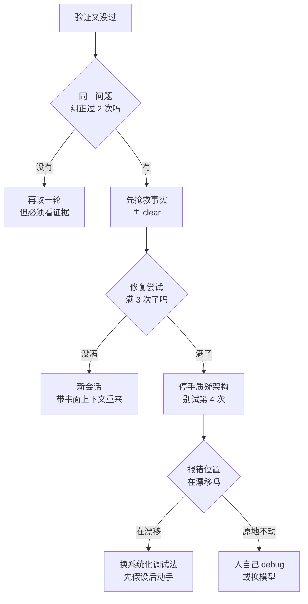

# 043. AI 改不对 bug、陷入 fix loop / 越改越糟，什么时候必须停、怎么跳出？

**一句话**：纠正 2 次仍错就 `/clear`，修复失败 3 次就停手质疑架构，别试第 4 次；跳出之前先诊断是哪一类根因，选错策略等于白费一轮。

## 30 秒结论

| 你看到的 | 立刻做 | 不想再犯 |
|---|---|---|
| 同一个问题纠正了 2 次，它还是错 | `/clear`，把已验证的事实先写进 SPEC 或 CLAUDE.md | 每修一个新开一个会话 |
| 修复尝试满 3 次仍不对 | 停手，别试第 4 次；先质疑问题定义和架构 | 动手前先做根因调查 |
| 每一轮 fix 都在**新的位置**冒出新报错 | 换系统化调试法：先写单一假设，再写最小复现 | 强制把"分析"和"修复"拆成两步 |
| 它每轮都说"我修好了"，但你没看到测试输出 | 要运行证据，不接受宣告 | 给它一个能跑的 pass/fail 信号 |
| 换个更强的模型后一两轮就过了 | 之前撞的是模型上限，早换早省时间 | 到点就换模型，别硬刚 |



## 怎么做

两件事：先按硬触发决定停不停，再按根因决定往哪跳。顺序不能反 —— 不诊断根因就 `/clear`，只是把同一个坑换个会话再踩一遍。

### 第 1 步：按分层硬触发决定停不停

四层按严重度递进，**触发任意一层就停**，不是"过了 L1 才看 L2"。L1 最早也最便宜，`/clear` 几乎零成本；L4 最贵，要人全程接管。越早触发越省时间。

| 层级 | 硬触发信号 | 触发后动作 |
|------|-----------|-----------|
| L1（最早） | 同一个 bug 纠正 Claude 2 次仍错 | `/clear`，把已验证的事实抢救出来写进 SPEC / CLAUDE.md，新会话用书面上下文重来[^1] |
| L2 | 修复尝试满 3 次仍不对 | 停下质疑问题定义和架构，回到根因分析，不要去试第 4 次修复[^2] |
| L3 | 迭代次数到上限（建议 5 次） | 停下，让 AI 报告"学到了什么"，人介入提供方向 |
| L4（最严重） | 几十轮还在转圈，或每个修复都在新地方冒出新问题，或 L1–L3 的动作都走过一遍仍不收敛 | 停下，人自己看代码、定位、设计方案，再让 AI 落地 |

官方对 L1 的表述是：一个干净的会话配一个更好的 prompt，几乎总是胜过一个攒满修正的长会话。obra 对 L2 的表述是：修复次数达到或超过 3 次就停下并质疑架构，不经过架构层面的讨论不要去试第 4 次。

还有一张按问题类型的表，决定这一类 bug 值不值得继续交给 AI：

| 问题类型 | 该不该继续让 AI 改 | 理由 |
|---------|-------------------|------|
| 语法错误 / 类型错误 | 继续，这是 AI 强项 | 确定性高，几乎不会错 |
| 运行时报错，栈里能直接看出出错行 | 给 1-2 轮 | 给足上下文，几轮能过 |
| 逻辑 bug，3 轮没修好 | 换模型或换工具 | 多半撞上根因 ② 或 ③ |
| 几十轮还在转圈 | 停，自己看代码、定位后再给 AI 修 | 根因 ①②③ 叠加，硬刚无效 |
| 架构层面的 bug | 人设计方案，再让 AI 落地 | 根因 ③，问题定义本身要重来 |

### 第 2 步：诊断根因，按根因选跳出策略

跳出不是"无脑 `/clear`"的线性清单，而是条件分支。先用左列的可观测信号对号入座，再取对应策略。

| 怎么诊断（看得见的信号） | 根因 | 跳出策略与具体动作 |
|---------|------|---------|
| 就同一问题纠正过 2 次仍错；对话里已堆了 3 段以上失败的 diff 和报错栈；`/context` 占用过半 | ① 上下文污染 | `/clear` 重开 + 抢救事实：把"已试过都不行"和"已确认的结论"写进 SPEC.md 或 CLAUDE.md，新会话用更具体的 prompt 重来 |
| 每一轮 fix 之后，报错行号或文件**换了位置**；每个修复都在新地方冒出新问题 | ② 只做局部修复，缺全局因果 | 换系统化调试法 + 两步调试法：强制把"分析"和"修复"分成两步，先写单一假设再写最小复现，一次只改一个变量 |
| AI 反复修同一个区域但不收敛；**你写不出一条能跑的验收命令**（说不清"修好"长什么样）；你给它的是"fix this bug"而不是"这个症状 + 这个预期行为 + 这个失败的测试" | ③ 问题定义就错了 | 重新定义问题 + 拆问题：质疑架构；切 plan mode 重写 spec（见 [#023](../03-需求与规划/023-Vibe-coding什么时候停下规划.md)）；把大 bug 拆成小任务（见 [#022](../03-需求与规划/022-大需求怎么拆子任务.md)） |
| 换一个更强的模型或提高 reasoning effort 之后，同一个 bug 一两轮就过 | ④ 模型能力到顶，或配置退化 | 换模型 / 提高 effort / 换工具。这条是反向验证：换完就过，说明之前撞的是上限 |
| 这条改动链上的 commit 已经多到 revert 不清；工作区里混着多轮半成品 | 已经失控 | `git reset` 硬回退到这条链的第一个 commit，换思路重做或直接跳过 |
| L1–L3 的动作都走过一遍仍不收敛 | 该人接手 | 人读代码、定位根因、设计修复，再让 AI 落地 |

多根因叠加很常见，① 和 ② 往往同时出现。这时**先解最便宜的那个**（`/clear`），再解最贵的（人接手）。

### 第 3 步：用两步调试法把"分析"和"修复"拆开

直接让 AI 改一个没定义清楚的 bug，等于要求它同时完成理解问题和解决问题两件难事，注意力发散。强制拆成两步：

```text
# 第一步：纯分析（禁止改代码）
这是报错 [粘贴堆栈]。用户反馈上传超过 5MB 时发生。
已排除：网络层、服务端接收逻辑。已试过无效：改 upload timeout、改 buffer size。
请分析，不要改代码：
1. 哪里失败了？追踪 timeout 变量从定义到使用的完整路径。
2. 这个 timeout 在 runtime 会被改吗？谁改的？
3. 最可能的根因是什么？只给一个 hypothesis。

# 第二步：修复 + 测试（分析确认后）
你的「speed 变量在 runtime 影响 timeout」这条假设合理。
只修这一个点，不要动 upload 函数本身。
修完为「上传 10MB」场景加测试，跑测试给我看输出。
```

**证据**：第二步之后你看到的应该是测试的实际输出，而不是"我修好了"这句话[^3]。只有宣告没有回显，就是这一轮没验证过，别接着往下走。

<details>
<summary>完整走一遍：识别并跳出一个 fix loop</summary>

场景：agent 在改一个上传超时 bug，用户反馈上传超过 5MB 时超时。改了 4 轮，每轮都说"我修好了"，跑测试还是错，第 4 轮甚至编出了一个不存在的 API。

**第 1 步，诊断根因。** 同时命中两类：

- 根因 ①：4 轮失败尝试堆积，对话里已有 4 段失败 diff 和报错栈。
- 根因 ②：agent 每轮都在改上传函数本身，但报错栈的顶帧在第 2、3、4 轮各不相同 —— 位置在漂移。
- 附带一个幻觉：第 4 轮编了个 API，查防归 [#042](./042-幻觉API与幻觉依赖.md)，这里不展开。

**第 2 步，触发判定。** L2（修复满 3 次）在第 3 轮就该触发，现在已经超了一轮。停下，不要去试第 5 次。先质疑问题定义：真的是上传函数的问题吗？还是上游的 speed 或 timeout 配置？

**第 3 步，先解最便宜的 ①。** `/clear` 之前手动把这四条写进 CLAUDE.md 或 SPEC：

```text
- 症状：上传 >5MB 超时
- 已试过且无效：改 upload timeout（3 次）、改 buffer size（1 次）
- 已排除：网络层、服务端接收逻辑
- 待验证假设：speed 变量在 runtime 被改，影响 timeout 计算
```

**第 4 步，新会话里用两步调试法**（模板见上面），解掉根因 ②。

**第 5 步，验证。** 看测试的实际输出，不看宣告。

</details>

<details>
<summary>systematic-debugging 这个 skill 的几个决策触发点</summary>

[obra 的 systematic-debugging](https://github.com/obra/superpowers/blob/main/skills/systematic-debugging/SKILL.md) 是一套"动 bug 之前先做根因分析"的方法论，四阶段完整流程见原文，本篇只取决策触发点：

- **何时启用**：你有时间压力、"就快速改一下"看起来很显然、你已经试过多次修复、上一次修复没起作用、你还没完全搞懂这个问题。这几条正好对应已经陷在 fix loop 里的状态。
- **何时停手换法**：修复失败达到或超过 3 次，停下并质疑架构，不经过架构讨论不要试第 4 次。
- **Iron Law**：没有先做根因调查，就不允许动手修。
- **为什么系统性方法反而快**：obra 给的对比是系统性方法修一个 bug 要 15 到 30 分钟，随机乱改要 2 到 3 小时反复折腾，一次修对的成功率 95% 对 40%。这组数字来自 skill 文档本身，未见独立复现，当量级参考。

</details>

## 为什么

### 陷进去有 4 类根因，不诊断就选不对策略

**① 上下文污染。** 每一次失败的修复尝试，都在往上下文里塞进更多错误代码和历史报错。到第四第五轮，AI 已经很难在膨胀的上下文里精确定位真正的问题。官方把这条列为一个显式命名的失败模式，叫 "Correcting over and over" —— 你纠正、它还错、你再纠正，上下文被失败的方法污染了[^1]。

**② 只做局部修复，缺全局因果。** AI 遇到报错的第一反应是在报错附近找问题、改掉它。但很多 bug 的根因不在报错那一行，而在上游的数据格式、被忽略的边界条件、或架构层面的设计缺陷。社区的比喻很准：AI 像一个拿手电筒找钥匙的人，灯光照到哪就找哪；它会在同一个坑里以不同的姿势跌倒 —— 换了变量名、改了逻辑顺序、加了防御性判断，但根因始终没碰。另一个角度是它拿不到完整上下文：它不记得你的状态在过去 30 次调用里怎么变的，也看不到那个只在周五、只在预发环境才出现的异步竞态。

**③ 问题定义就错了。** 你连问题都没定义对就让 AI 改，它当然转圈。根因不在模型，在你喂给它的那个"问题"。直接让 AI 改一个没定义清楚的 bug，等于要求它同时完成理解问题和解决问题两件难事。obra 给的判定是：修复失败 3 次之后，就该意识到这不是一个失败的假设，而是架构本身就错了[^2]。

**④ 模型能力到顶，或配置退化。** 有些 bug 就是当前模型或当前配置搞不定。官方 4-23 postmortem 给了配置退化的实例：2026-03-04 把 Claude Code 的默认 reasoning effort 从 high 改成 medium，事后承认这是个错误的取舍；改完不久用户就开始反映 Claude Code 变笨了[^3]。配置变更会静悄悄地拉低调试能力，而用户一开始分不清是模型变笨了还是自己运气差 —— 所以④的诊断信号只能是反向的：换完就过。

### 改不对的隐性成本，远超生成代码省下的那点时间

社区有个"90% 陷阱"的说法：AI 写的代码往往 90% 可用，剩下 10% 充满隐蔽的 bug、过时的库引用和糟糕的结构，结果是"帮我省了 30 分钟敲代码的时间，我却花了 2 小时去 review 和填坑"。

更极端的案例是一个本该 2 天搞定的 bug 折腾了将近两周：AI 一直在改主代码、想办法掩盖问题，而根因只是别处的一行代码 —— 变量 `x` 在运行时被改成了 `x + speed`，AI 始终没碰它。当事人的结论是：AI 能修对前 3 个问题，但卡在第 4 个上；一旦你彻底卡死，最终产出就是 0。

官方 postmortem 也给了机制层面的旁证：一个 caching bug 让 Claude 继续执行，但越来越想不起来自己当初为什么要这么做，表现出来就是用户报告的健忘、重复和奇怪的工具选择[^3]。这正好对应 fix loop 里"越改越没方向感"的体感。

所以结论是：生成快不等于交付快。AI 真正的速度不在于修好第一批任务有多快，而在于修完所有任务要多久。

### 健康的 fixloop 和失控的 fix loop 是同一机制的两面

别因噎废食。fixloop 这个词本来是正面的：让 AI 自己看它有没有修好问题，没修好就再试一次[^4]。官方是同一个意思 —— 给 Claude 一个能产出通过或失败的东西，这个循环就会自己闭合，它干活、跑检查、读结果、迭代，直到检查通过。[#030](../04-执行工作流/030-AI写的测试不可信.md) 里的红绿信号就是这种 pass/fail。

失控只发生在三个条件同时缺失时[^4]：

1. **缺真实的验证信号** —— AI 靠"看起来做完了"自报修好，而不是真去跑 pass/fail。
2. **缺迭代上限** —— 循环跑飞，AI 反复幻想出同一个修复方案。
3. **缺人监督** —— 你当了甩手掌柜。

所以本篇教的"何时停、怎么跳出"是给失控的 fix loop 兜底，不是否定这个模式。配上 pass/fail 信号、迭代上限、加上你盯着，自动闭环反而是加速器。

## 别这么干

- ❌ **硬刚，想着"再试一次就好"。** 官方把 "Correcting over and over" 列为显式命名的失败模式：这时上下文已经被失败的方法污染了。纠正 2 次仍错就 `/clear`，这是硬上限不是建议。
- ❌ **相信 AI 每轮说的"我修好了"。** 每一轮都要看测试输出，别信声称[^5]。
- ❌ **让 AI 边理解问题边改，不分离分析和修复。** 两件难事挤在一起，注意力发散。用两步调试法。
- ❌ **`/clear` 的时候不抢救已验证的事实。** 失败的尝试里也有真东西：哪些方法试过不行、哪些已经排除。不写进 SPEC 或 CLAUDE.md，新会话会重蹈覆辙。
- ❌ **把需求侧的信号混进来触发。** "需求不清、复杂度超限、vibe coding 该停"是 [#023](../03-需求与规划/023-Vibe-coding什么时候停下规划.md) 的活（需求侧何时停），本篇是调试侧（验证失败后改不对）。两者都会用 `/clear`，但触发点不同，别搅在一起。

<details>
<summary>换个工具就不会陷 fix loop 了吗</summary>

会陷。Cursor 里有用户报告 Sonnet 4.0 会无限次地反复跑测试套件，却始终不去真正修复测试。fix loop 不是某个工具独有的问题，是 LLM 调试的共性失效。

换模型、换工具确实是跳出策略之一（对应根因 ④），但要先诊断是不是真的撞上了模型上限。如果是根因 ①②③，换工具不解决问题，反而会把同样的上下文污染带到新工具里去。

</details>

## 延伸

**相关文章**

- [#023 Vibe coding 什么时候必须停下来规划？](../03-需求与规划/023-Vibe-coding什么时候停下规划.md) —— 需求侧何时停。这是本篇最关键的边界：023 讲需求侧、本篇讲调试侧
- [#040 AI 说"做完了"、测试也全绿，怎么知道代码是真的对？](./040-怎么验证AI代码是真的对.md) —— 验证体系全景，本篇接住它"越改越糟"那句指针
- [#041 怎么 review AI 生成的代码](./041-怎么审查AI生成的代码.md) —— 注意本篇的"人接手"不等于 041 的"人审"：041 是审查 AI 的产出，本篇是人自己 debug 取代 AI
- [#042 幻觉 API 与幻觉依赖](./042-幻觉API与幻觉依赖.md) —— 越改越编出新幻觉时，查防手法在那边
- [#030 AI 写的测试一跑就过怎么办](../04-执行工作流/030-AI写的测试不可信.md) —— 健康 fixloop 依赖的红绿 pass/fail 信号
- [#022 怎么把一个大需求拆成 AI 能一次做对的子任务？](../03-需求与规划/022-大需求怎么拆子任务.md) —— 根因 ③ 的"拆问题"指向这里

**参考资料**

- [CC Docs: best-practices](https://code.claude.com/docs/en/best-practices) —— 支撑 L1 硬触发与根因 ①：纠正超过两次就 `/clear`、"Correcting over and over"失败模式、"looks done"、"the loop closes on its own"（官方，2026-06）
- [obra: systematic-debugging](https://github.com/obra/superpowers/blob/main/skills/systematic-debugging/SKILL.md) —— 支撑 L2 与根因 ③：Iron Law、≥3 次质疑架构、Red Flags、15-30 分钟 vs 2-3 小时与 95% / 40% 的对比（社区权威，2026；后一组数字未见独立复现）
- [obra: verification-before-completion](https://github.com/obra/superpowers/blob/main/skills/verification-before-completion/SKILL.md) —— 支撑"看证据不看宣告"：Evidence before claims（社区权威，2026）
- [Anthropic 4-23 postmortem](https://www.anthropic.com/engineering/april-23-postmortem) —— 支撑根因 ④ 与"越改越没方向感"：caching bug 导致失忆、effort 从 high 改 medium 的错误取舍（官方，2026-04）
- [Medium @waleedk: Getting out of the cycle: fixloops](https://waleedk.medium.com/getting-out-of-the-cycle-fixloops-make-ai-codevelopment-more-productive-33d2e40e0e1f) —— 支撑"健康 vs 失控"一节：fixloop 的正面定义、三个缺失、L3 的 5 次迭代上限（社区方法论，Waleed Kadous，2025-12）
- [知乎 @郝敬: 为什么 AI 总修不对 Bug](https://zhuanlan.zhihu.com/p/1959760698503598667) —— 支撑第 3 步两步调试法：强制分离分析与修复、"同时完成理解和解决两件难事"（社区，2025-10）
- [tonybai: AI 编程的 90% 陷阱](https://tonybai.com/2025/12/17/ai-programming-90-percent-trap-generation-vs-bug-fix/) —— 支撑"隐性成本"一节：90% 可用 / 10% 隐蔽 bug、"30 分钟省下、2 小时填坑"、问题在工作流不在模型（社区，2025-12；文末有专栏推广，只引方法论部分）
- [掘金: 为什么大模型修不好自己的 bug](https://juejin.cn/post/7650463834928889908) —— 支撑根因 ② 与按问题类型分档表："手电筒找钥匙"、"同一个坑不同姿势跌倒"（社区，2026-06；有产品推广倾向，只引根因分析部分）
- [LinkedIn @markessien](https://www.linkedin.com/posts/markessien_i-and-ai-had-been-struggling-to-fix-a-bug-activity-7333369661352284161-ZKXS) —— 支撑"隐性成本"一节的两周案例：mask the problem、根因是别处的 `x + speed`、卡在第 4 个产出为 0（社区，2025-05）
- [dev.to: AI killed my coding brain](https://dev.to/dev_tips/ai-killed-my-coding-brain-but-im-rebuilding-it-4i35) —— 支撑根因 ②④：AI 记不住过去 30 次调用的状态变化、"没搞懂过的东西没法调试"（社区，2025）
- [HN 42829466 评论](https://news.ycombinator.com/item?id=42829466) —— 支撑"已经失控 → git reset"这一行：硬 reset 回这条链的第一个 commit（社区，只引评论）
- [V2EX 1187820](https://v2ex.com/t/1187820) —— 支撑"每修一个新开一个对话"与"到点就换模型"两条社区共识（社区，2026-01）
- [Cursor Forum 97598](https://forum.cursor.com/t/claude-sonnet-4-0-gets-stuck-in-loops/97598) —— 支撑折叠块"换工具不免疫"：Sonnet 4.0 无限反复跑测试套件却不修（社区，2025-05；站点反爬，仅 meta description 可抓）

[^1]: [CC Docs: best-practices](https://code.claude.com/docs/en/best-practices)（官方，2026-06）：在同一会话里就同一问题纠正 Claude 超过两次，上下文就已被失败的尝试塞乱，应运行 `/clear` 并用更具体的 prompt 重新开始。
[^2]: [obra: systematic-debugging](https://github.com/obra/superpowers/blob/main/skills/systematic-debugging/SKILL.md)（社区权威，2026）：修复次数达到或超过 3 次就停下质疑架构，不经架构讨论不要尝试第 4 次修复。
[^3]: [Anthropic 4-23 postmortem](https://www.anthropic.com/engineering/april-23-postmortem)（官方，2026-04）：caching bug 使 Claude 继续执行却越来越想不起来为何这么做；默认 reasoning effort 从 high 降到 medium 是错误的取舍。
[^4]: [Medium @waleedk: fixloops](https://waleedk.medium.com/getting-out-of-the-cycle-fixloops-make-ai-codevelopment-more-productive-33d2e40e0e1f)（社区方法论，2025-12）：fixloop 指让 AI 自己判断有没有修好、没修好就再试；失控源于缺验证信号、缺迭代上限、缺人监督。
[^5]: [obra: verification-before-completion](https://github.com/obra/superpowers/blob/main/skills/verification-before-completion/SKILL.md)（社区权威，2026）：没有新鲜的验证证据就不允许声称完成。

---

<sub>难度 高级 · 排错题 + 决策题 · 主线 Claude Code，横向 Cursor</sub>

<sub>**时效**：本篇引用的模型与配置故事都是当时的快照 —— 4-23 postmortem（2026-04 发布）记录的 reasoning effort 从 high 降到 medium 发生在 2026-03-04；Cursor 论坛里 Sonnet 4.0 卡循环的报告是 2025-05。**已知不确定**：obra 给的"15-30 分钟 vs 2-3 小时、95% vs 40%"来自 skill 文档自述，未见独立复现，只当量级参考。**易变**：模型和默认配置随版本变化，上述案例只用来证明"配置退化会引发 fix loop"这个机制，不代表当前模型行为。决策框架（纠正 2 次就 clear、失败 3 次质疑架构、迭代 5 次设上限）与模型版本无关，长期有效。</sub>

> 本篇个人实践（L4）：`[待补：BOSS 被 AI 的 fix loop 坑过吗？最惨的一次改了几轮、花了多久？你个人的「何时停」触发点是几次（2 次 /clear 还是 3 次质疑架构）？你用 /clear 重开多还是 git reset 回退多？systematic-debugging skill 你启用过吗、管用吗？两步调试法 prompt 你试过吗？]`
