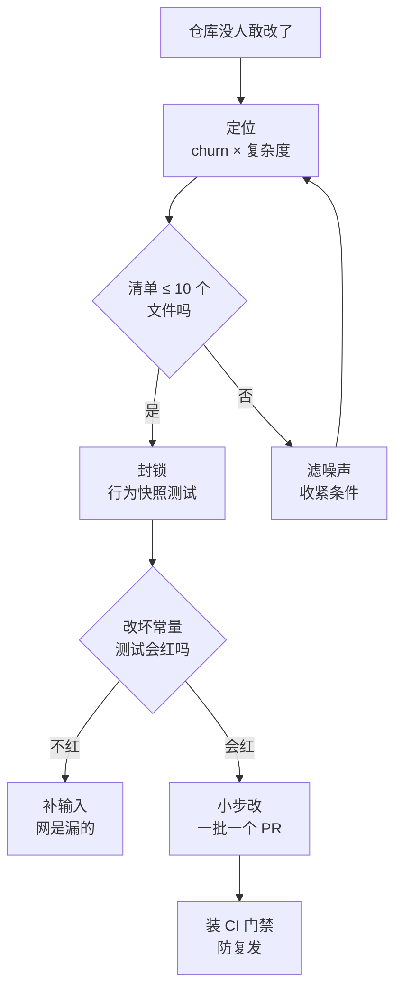

# 044. AI 写的代码上线三个月，300 行的函数没人敢动——怎么分批还债？

**一句话**：还债不是"重构一遍" —— 先用「改得最频繁 × 最复杂」定位出不超过 10 个文件，套一层行为快照测试当安全网，再按改动类型一批一个 PR 地小步改，最后装 CI 门禁防复发。

## 30 秒结论

| 你看到的 | 立刻做 | 不想再犯 |
|---|---|---|
| 一个 300 行的函数没人敢动 | 先跑 churn × 复杂度定位，别凭印象挑文件 | 计划阶段限定改动边界 |
| 改一处要去别处找兄弟副本 | `npx jscpd` 扫重复块，记下重复率当基线 | CI 装重复率门禁 |
| 想重构又怕改坏行为 | 先套行为快照测试，并验证"改坏了会红" | 快照测试进 CI，跟着代码一起活 |
| 想让 AI 一把梭"重构这个模块" | 拆成一次一类改动，每类一个 PR，diff 上限写进 CLAUDE.md | AI 只当执行者，边界和验收由你定 |
| 上个季度还完，这个季度又长回来 | 把当前实测值设成 CI 阈值，每季度 −2 个百分点 | 还债只是止血，闸门才是止损 |



## 怎么做

AI 在还债里的角色是**执行者**，不是决策者：边界、批次和验收标准由你定，体力活交给它。

### 第 1 步：拉一张 churn × 复杂度清单

别凭印象挑文件。改动频率（churn）是缺陷预测研究里反复验证过的强信号，CodeScene 的热点分析把它当作首要排序依据[^1]，冷门的烂代码不值得动。

```bash
# 近 12 个月每个文件的改动次数，取前 30
git log --format=format: --name-only --since=12.months \
  | grep -v '^$' | sort | uniq -c | sort -rn | head -30
```

复杂度那一列用 lizard 或 scc 拉（命令见折叠块），把两张表按文件名 join，**同时进前列的就是还债清单**。

> **怎么确认做对了**：清单 ≤ 10 个文件，且每个文件你都能说出它属于哪个业务模块。说不出来的（`package-lock.json`、生成代码、批量格式化过的文件）就是噪声没滤掉 —— 加进排除列表，或用 `.git-blame-ignore-revs` 屏蔽大规模重排提交后重跑。

<details>
<summary>复杂度命令与 subagent 委托提示词</summary>

```bash
# lizard：跨语言圈复杂度（pip install lizard），列出圈复杂度 > 15 或长度 > 100 行的函数
lizard -C 15 -L 100 src/

# 只想要规模，用 scc（brew install scc）
scc --by-file --sort complexity src/ | head -30
```

**探索类调查可以让 subagent 去做**，别把主上下文烧在探索上：

```text
用一个 subagent 调查 src/order/ 下 handleOrder 这个函数的所有调用方和副作用，
只回报：调用点清单、外部依赖（DB/网络/全局状态）、可能的隐式契约。不要改任何代码。
```

</details>

### 第 2 步：扫重复块，量化"传播税"

```bash
npx jscpd ./src --min-lines 5 --min-tokens 50 --reporters console,html,json --output ./report/
```

> **怎么确认做对了**：`./report/` 下有 HTML 报告，控制台给出重复百分比。**记下这个数字当基线** —— 它是你后面证明"债确实还了"的唯一硬指标。经验值：超过 10% 明显偏高，但基线比绝对值重要，你要的是趋势下降。

### 第 3 步：先套行为快照，再动一行代码

行为快照测试（characterization test，也叫 golden master）的规则很简单：**不判断行为对不对，只把当前行为录下来**[^2]。这是处理"没人敢动的遗留代码"的标准前置动作。流程四步：构造覆盖面尽量宽的输入 → 跑一遍把输出序列化落盘 → 人工确认后接受为基准 → 之后每次改动对比快照。细节和生成快照的提示词见折叠块。

<details>
<summary>ApprovalTests 式流程细节与生成快照的提示词</summary>

1. 挑目标模块的入口函数，构造一组覆盖面尽量宽的输入（正常值、边界值、异常值）。
2. 跑一遍，把输出序列化成文本落盘（JSON / 文本快照均可）。
3. 人工扫一眼快照文件，**接受它作为基准**（ApprovalTests 系工具的流程是首跑生成 `.received.txt`，你确认后改名为 `.approved.txt`）。
4. 之后每次改动都对比快照，不一致就说明行为变了。

生成快照测试的提示词，关键是把"不许判断对错"写死：

```text
给 src/order/handleOrder.ts 写 characterization test（行为快照测试）。
规则：
1. 不要判断现有行为是否正确，只记录当前输出作为基准
2. 输入要覆盖：正常路径、每个 if 分支、空值/边界、会抛异常的输入
3. 输出序列化成 JSON 快照文件，不要写内联断言
4. 不许修改 handleOrder.ts 本身，一行都不能改
写完运行测试，确认全部通过后停下来等我确认。
```

</details>

> **怎么确认做对了**：故意在目标函数里改一个常量，跑测试 —— **必须失败**。不失败说明你的输入没覆盖到那条路径，网是漏的，继续补输入。这一步没验证过就往下走，等于裸奔。

### 第 4 步：按"改动类型"分批，一批一个 PR

顺序有讲究，从低风险到高风险：**删死代码 → 合并重复块 → 拆长函数 → 补掩盖错误的地方 → 改接口/模块边界**，每批的验收标准见折叠块。

<details>
<summary>五个批次的内容、风险与验收</summary>

| 批次 | 内容 | 风险 | 验收 |
|---|---|---|---|
| 1 | 删死代码、删未使用的依赖和导出 | 最低 | 快照测试全绿 + 构建通过 |
| 2 | 合并重复块，抽公共函数 | 低 | jscpd 重复率低于基线，快照全绿 |
| 3 | 拆长函数（纯提取，不改语义） | 中 | 快照全绿，且 diff 里没有新逻辑 |
| 4 | 补掩盖错误的地方（空 catch、无脑可选链） | 中 | 每个改动点补一条针对性测试 |
| 5 | 改接口 / 调整模块边界 | 高 | 需要单独评审，见 [#053](../06-工程协作/053-AI的PR太大没法review.md) |

</details>

第 5 批之前的所有改动都应该是"行为不变"的，快照测试一旦红了就是你改坏了，直接 revert 重来，不要在红的状态上继续修。把这几条约束写进项目的 `CLAUDE.md`（模板见折叠块），别指望每次都在 prompt 里重复。

<details>
<summary>写进 CLAUDE.md 的约束模板</summary>

```markdown
## 还债任务约束
- 单次改动只做一类：删死代码 / 合重复 / 拆函数，不要混做
- 每次改完必须跑 `npm run test:snapshot`，红了立刻停下报告，不要自行"顺手修好"
- 不许修改快照基准文件（*.approved.*），需要更新时先问我
- 单个 PR diff 不超过 300 行
```

</details>

> **怎么确认做对了**：还完一轮后重跑第 1、2 步。churn 清单里的文件复杂度下降、jscpd 重复率低于基线，才算数。没有前后对比数字的"我重构完了"不算完成。

### 第 5 步：把闸门装上，否则一个月后原样长回来

```yaml
# .github/workflows/debt-gate.yml 片段
- name: 重复率门禁
  run: npx jscpd ./src --threshold 12 --exitCode 1 --reporters console
```

`--threshold` 的含义是：重复率大于该百分比，就按 `--exitCode` 指定的错误码退出。**这里的 12 是占位数字，你要填的是自己仓库的当前实测值**（第 2 步记下的那个基线），然后按固定节奏收紧：每季度下调 2 个百分点；本季度 CI 曾因它变红就先不降，观察一个季度；降到正常 PR 开始被频繁拦住（一个月内两次以上不是复制粘贴却被拦）就停在当前值。一上来就卡理想值只会让全组把这条 CI 关掉。

> **怎么确认做对了**：故意提一个复制粘贴 50 行的 PR，CI 必须红。

<details>
<summary>三条能省不少时间的 Claude Code 用法</summary>

**动手前先出计划，别让它直接落盘**：

```bash
claude --permission-mode plan
```

会话中按 `Shift+Tab` 也能切换（循环顺序 `default` → `acceptEdits` → `plan`），状态栏显示 `⏸ plan mode on`。在 plan 模式里让它输出还债批次拆分，你逐条砍到能审的粒度再批准。

**每批还债在独立 worktree 里做**：

```bash
claude --worktree debt-dedup-order
```

每个 worktree 是独立分支的独立检出，一个批次一个 worktree，还债和日常需求可以并行推进而不打架。

**批量体力活走 headless 模式**：

```bash
npx jscpd ./src --reporters json --output ./report/ \
  && cat ./report/jscpd-report.json \
  | claude -p "按'合并收益 / 改动风险'给这些重复块排序，输出前 10 条，每条注明涉及文件和建议做法。不要改代码。"
```

**怎么确认粒度对了**：每一步 AI 的产出你都能在 1 分钟内判断接不接受。做不到就是粒度太大，回去拆。

</details>

## 为什么

### 这不是错觉，是可测的趋势

GitClear 与 GitKraken 分析了 2023–2026 年 6.23 亿次真实代码改动[^3]：重复代码块 **+81%**（2026 年是有记录以来最高）、移动/重构行 **−70%**、老代码维护量 **−74%**、跨文件函数调用 **−35%**、"掩盖错误"写法 **+47%**。这解释了你为什么现在读不动自己三个月前的仓库。

<details>
<summary>五项信号明细</summary>

| 信号 | 变化 | 对维护意味着什么 |
|---|---|---|
| 重复代码块（连续 5 行以上重复） | 比基线 **+81%**，2026 年是有记录以来最高 | 改一处要去找散落各处的兄弟副本 |
| 移动/重构行占比 | **−70%** | 没人在整理，只在堆 |
| 12 个月以上老代码的维护量 | 比 2023 年 **−74%**（1.7% → 0.46%） | 老代码进入无人区 |
| 跨文件函数调用（复用信号） | **−35%** | 不复用，直接重写一份 |
| 吞异常的 catch 等"掩盖错误"写法 | **+47%** | 故障被埋起来，出问题更难定位 |

</details>

GitClear 把重复叫作"传播税"：一处改动强制你在不熟悉的文件里找齐所有副本并逐个评估。这正好解释了"300 行的函数没人敢动"的体感 —— 不是函数长，是**你不知道改了它会牵动谁**。需求已经量化成生意了：HN 上一个波兰团队开帖"我们收 1 万美元一周删除 AI 生成的代码"（304 分 / 240 评论），同一个生意模式在 HN 上前后两次上榜。中文社区同样密集，V2EX"AI 代码后面怎么维护，心智负担太大了"71 条回复，楼主的原话是"加两个函数多了 300 行"。

### 为什么事后还债需要单独一套方法

传统技术债是"当时赶工，知道欠在哪"；AI 债的特点是**欠债的人不知道自己欠了什么** —— 代码是生成的、没人完整读过、注释齐全但结构随意，看起来比人写的还体面。所以还债的第一步不是重构，是**测量**：把"我感觉这儿乱"换成"这个文件近 6 个月改了 47 次、780 行、和另外 3 个文件有 5 处重复块"。第 1、2 步的产出就是这两个数字，也是你后面证明债确实还了的唯一硬指标。对照本库其他篇：[#003](../01-心智与工具/003-AI代码审不动改不懂.md) 讲的是**当下**读不动，[#023](../03-需求与规划/023-Vibe-coding什么时候停下规划.md) 讲的是**事前**别欠，本篇处理的是**已经欠了三个月**的那笔。

## 别这么干

- ❌ **直接说"帮我重构这个模块，让它更清晰"。** 没有快照测试、没有 diff 上限、没有验收标准，AI 会顺手改掉行为并给你一份看起来很专业的说明。V2EX 上高赞的"谁污染谁治理"听着解气，但无边界地让 AI 重构一个它自己写乱的模块，只会把乱摊得更开。
- ❌ **一个大 PR 把 5 类改动全做完。** 出问题时你无法二分定位是哪类改动引入的，只能整体回滚，前面的收益一起赔进去。
- ❌ **按"看着最难受"挑还债目标。** 一年没人碰的模块再丑也不产生成本。不看改动频率，你很可能花一周整理了一段没人会再打开的代码。
- ❌ **快照测试写完不做失效验证。** 没验证过"改坏了会不会红"的测试网等于没有网，而且比没有更危险 —— 它给了你虚假的安全感。
- ❌ **还完债不装 CI 门禁，或者把还债做成一次性"重构冲刺"。** 重复是持续累积的趋势而非一次性事故；债的产生速度取决于日常协作方式，不改协作方式，冲刺只是把还款日往后推。

## 延伸

<details>
<summary>相关文章</summary>

- [#003 为什么 AI 写的代码我审不动、改完自己看不懂？](../01-心智与工具/003-AI代码审不动改不懂.md) —— 本篇的"当下"版本：现在就读不动时怎么办
- [#023 Vibe coding 什么时候必须停下来规划？](../03-需求与规划/023-Vibe-coding什么时候停下规划.md) —— 从源头少欠债
- [#040 AI 说"做完了"、测试也全绿，怎么知道代码是真的对？](./040-怎么验证AI代码是真的对.md) —— 快照测试全绿之后还需要哪些验证层
- [#041 怎么 review AI 生成的代码](./041-怎么审查AI生成的代码.md) —— 还债 PR 本身也要过评审
- [#052 怎么不让 AI 把 git 仓库搞乱？](../06-工程协作/052-别让AI搞乱git仓库.md) —— 还债过程中安全回滚的前提
- [#053 AI 生成的 PR 太大太多，review 机制怎么扛住不崩？](../06-工程协作/053-AI的PR太大没法review.md) —— 第 5 批高风险改动的评审组织方式

</details>

<details>
<summary>参考资料</summary>

- [Nagappan & Ball：Use of Relative Code Churn Measures to Predict System Defect Density](https://dl.acm.org/doi/10.1145/1062455.1062514) —— 支撑第 1 步：churn 预测缺陷密度的学术验证（学术，ICSE 2005）
- [GitClear：The Maintainability Gap](https://www.gitclear.com/the_ai_code_quality_maintainability_gap) —— 支撑"为什么"第 1 节的全部信号：6.23 亿次改动统计、重复 +81%、重构行 −70%、老代码维护 −74%、跨文件调用 −35%、掩盖错误 +47%、"传播税"（实践/厂商研究，2026-07）
- [LeadDev：Code maintainability plummets in the AI coding era](https://leaddev.com/ai/code-maintainability-plummets-in-the-ai-coding-era) —— 第三方媒体对上述研究的复核报道与数字汇总（社区/媒体，2026-07）
- [CodeScene 文档：Hotspots](https://docs.enterprise.codescene.io/versions/4.0.16/guides/technical/hotspots.html) —— 支撑第 1 步："改动频率是最强质量信号"的方法论依据（官方）
- [Understand Legacy Code：Hotspots Analysis](https://understandlegacycode.com/blog/focus-refactoring-with-hotspots-analysis/) —— 支撑第 1 步的 churn × 复杂度定位法与 `git log` 统计命令（实践）
- [Wikipedia：Characterization test](https://en.wikipedia.org/wiki/Characterization_test) —— 支撑第 3 步：行为快照测试的定义与 Michael Feathers 的出处（社区/百科）
- [jscpd 官方文档](https://jscpd.dev/) —— 支撑第 2、5 步：`--min-lines` / `--min-tokens` / `--threshold` / `--reporters` 参数（官方，2026-08 核对）
- [Claude Code 官方文档：Common workflows](https://code.claude.com/docs/en/common-workflows) —— 支撑折叠块：`--permission-mode plan`、`--worktree`、subagent 委派、`claude -p` 管道用法（官方，2026-08 核对）
- [HN：We charge $10k a week to delete AI-generated code](https://news.ycombinator.com/item?id=48823359) / [同一模式的早前讨论](https://news.ycombinator.com/item?id=45320431) —— 支撑"需求已经量化成生意"：304 分 / 240 评论，该模式两次登上首页（社区，2025–2026）
- [V2EX：AI 代码后面怎么维护](https://www.v2ex.com/t/1207049) / [已经有屎山化倾向](https://www.v2ex.com/t/1215790) —— 支撑真实团队处境："加两个函数多了 300 行"、"不同人用不同 AI、不再逐行审查"、高赞回复"谁污染谁治理"（社区，中文）

</details>

[^1]: [CodeScene 文档：Hotspots](https://docs.enterprise.codescene.io/versions/4.0.16/guides/technical/hotspots.html)（官方）：热点分析以改动频率为首要排序依据；学术侧的经典验证是 [Nagappan & Ball, ICSE 2005](https://dl.acm.org/doi/10.1145/1062455.1062514)（学术，微软研究院）：相对 churn 指标高度预测缺陷密度，在 Windows Server 2003 上判别故障倾向模块的准确率为 89%。
[^2]: [Wikipedia：Characterization test](https://en.wikipedia.org/wiki/Characterization_test)（社区/百科）：characterization test 由 Michael Feathers 提出，用于描述遗留代码的既有行为，而非断言行为是否正确。
[^3]: [GitClear：The Maintainability Gap](https://www.gitclear.com/the_ai_code_quality_maintainability_gap)（厂商研究，2026-07）：基于 2023–2026 年 6.23 亿次代码改动，重复代码块比基线增长 81%，移动/重构行占比下降 70%。。**基线年份注意**：该页摘要写「down 74% vs 2022 levels」，但正文给出的具体数值是「from 1.7% in 2023 to 0.46% year-to-date in 2026」，且全研究取数区间为 2023–2026。本篇按正文口径取 2023 基线。

---

<sub>难度 中级 · 流程题 · 主线 Claude Code</sub>

<sub>**时效**：排查方法（churn × 复杂度定位、重复块扫描、行为快照测试、小步切分）不依赖工具版本，长期有效。涉及具体工具的命令与参数（jscpd、lizard、`--permission-mode plan` / `--worktree` / `-p`）以 2026-08-15 查到的官方文档为准。**已知不确定**：GitClear「Maintainability Gap」数据发布于 2026-07，是一家代码分析厂商基于自家数据集的统计，方向可信、绝对值按厂商立场打折。**易变**：jscpd 与 Claude Code 的 CLI 参数随版本调整，用前回查官方文档。</sub>

> 本篇个人实践（L4）：`[待补：BOSS 的实战经验/踩坑]`
