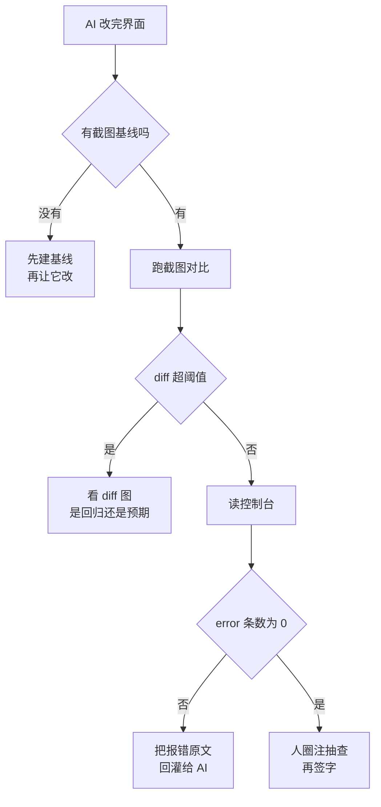

# 045. AI 把样式改完了，怎么知道界面没崩？

**一句话**：给界面配三个机器能读的信号 —— 改动前后的截图 diff、控制台 error 数、你圈注的那几处必须对的地方；三个都过才算完成，别用"我看着挺好"结账。

## 30 秒结论

| 你看到的 | 立刻做 | 不想再犯 |
|---|---|---|
| 改了一个组件的样式，别的页面塌了 | 补一组 `toHaveScreenshot` 基线，改前先跑一次留底 | 基线图入库，跟代码一起 review |
| 页面看着正常，功能点了没反应 | 让 AI 读控制台，把 error 条数当通过信号 | 把"console error = 0"写进验收命令 |
| 截图 diff 每次都红，全是动画和时间戳 | 用 `stylePath` 注入 CSS 把易变元素遮掉 | 基线只覆盖稳定区域，别全屏截 |
| AI 说"已修复"，但你一眼看出还是歪的 | 截图 + 标出坐标/元素，把具体差异描述回灌 | 描述用元素和数值，不用"感觉不对" |
| 每次都得自己开浏览器看 | 把截图那一步挂进 Stop hook / CI | 界面改动和代码改动共用一个门禁 |



## 怎么做

### 第 1 步：先留基线，再让 AI 动手

没有"改之前长什么样"，之后的一切对比都是空谈。用 Playwright 的内置视觉对比建基线，第一次跑会自动生成参考图并落盘[^1]：

```ts
// tests/visual.spec.ts
test('结算页视觉基线', async ({ page }) => {
  await page.goto('http://localhost:3000/checkout');
  await expect(page).toHaveScreenshot('checkout.png', { maxDiffPixels: 100 });
});
```

```bash
npx playwright test tests/visual.spec.ts            # 首次跑：生成基线
git add tests/visual.spec.ts-snapshots/ && git commit -m "chore: 结算页视觉基线"
```

**证据**：仓库里出现 `*-snapshots/` 目录且有 PNG 文件；故意把某个按钮的 `padding` 加 20px 再跑，测试应当变红，`test-results/` 里出现 expected / actual / diff 三张图。三张图没出现，说明你截的是 `page.screenshot()` 而不是 `toHaveScreenshot`，前者不做对比。预期内的视觉改动用 `npx playwright test --update-snapshots` 更新基线，并把新基线放在**同一个 PR** 里，让 review 的人同时看到代码 diff 和图 diff。

<details>
<summary>基线老是假红：怎么把动画和随机内容排除</summary>

官方给的手段是 `stylePath` —— 截图时注入一份 CSS，把易变元素藏掉：

```ts
// tests/screenshot.css
.timestamp, .avatar-random, [data-testid="live-count"] { visibility: hidden !important; }
```

```ts
await expect(page).toHaveScreenshot('checkout.png', {
  stylePath: './tests/screenshot.css',
  maxDiffPixels: 100,
});
```

也可以全局配 `expect: { toHaveScreenshot: { maxDiffPixels: 100 } }`。另外两条经验（社区经验，未见官方确证）：基线图必须在同一操作系统 + 同一浏览器版本下生成，跨平台字体渲染差异会让 diff 恒红，所以基线要么全在 CI 容器里生成，要么按平台分目录；组件级截图比整页截图稳得多，能定位到具体是哪个组件坏了。

</details>

### 第 2 步：把控制台 error 数当成通过/失败信号

截图看得见"长歪了"，看不见"点了没反应"。控制台是成本最低的第二个信号 —— 它是机器可读的数字，不是主观判断。在 Playwright 里监听 `console` 和 `pageerror` 两个事件、断言 error 数组长度为 0，断言代码折在下面。

<details>
<summary>Playwright 控制台断言代码 + 假绿自检</summary>

```ts
test('结算页无控制台错误', async ({ page }) => {
  const errors: string[] = [];
  page.on('console', m => { if (m.type() === 'error') errors.push(m.text()); });
  page.on('pageerror', e => errors.push(e.message));
  await page.goto('http://localhost:3000/checkout');
  await page.getByRole('button', { name: '提交订单' }).click();
  expect(errors, errors.join('\n')).toHaveLength(0);
});
```

**证据**：故意在组件里加一行 `undefinedVar.foo`，这条测试应当红，且失败信息里带着原始报错文本。红不了说明你只监听了 `console` 没监听 `pageerror`（未捕获异常走的是后者）。

</details>

不写测试也能验：Claude Code 接上 Chrome 之后可以直接读控制台和 DOM 状态，然后去修造成报错的代码[^2]。给它的话要指明**找什么模式**（比如"只把 error 级别的条目原样贴出来，一条都没有就明确说 0 条"），别让它把全部日志倒出来 —— 官方文档专门提醒日志可能很啰嗦。

<details>
<summary>Claude Code 连浏览器的前置条件（2026-08-15 核实）</summary>


官方文档明写的门槛[^2]：

| 项 | 要求 |
|---|---|
| 启动 | `claude --chrome`；`/chrome` 查状态，显示 Status: Enabled + Extension: Installed 才算通 |
| 扩展 | Claude in Chrome 扩展 1.0.36 及以上 |
| 账号 | 直连 Anthropic 的 Pro / Max / Team / Enterprise，且必须 `/login`；用 API key 或 `claude setup-token` 的长期令牌时，Chrome 集成会被强制关掉 |
| 渠道 | Bedrock / Google Cloud Agent Platform / Microsoft Foundry 不可用 |
| 平台 | WSL 不支持 |
| 版本 | 截图的 `save_to_disk` 在 v2.1.211 之前不会真的写文件 |

plan mode 里的权限分档：`read_page`、`get_page_text`、`find`、读控制台和网络请求、截图属于只读，不弹权限；点击、输入、导航、标签页管理、录 GIF 会弹。只读调用一旦带上改状态的参数（截图的 `save_to_disk`、控制台/网络读取器的 `clear`）也会弹；plan mode 此前漏弹改状态浏览器调用的问题在 v2.1.199 修复[^3]。

一个要权衡的代价：官方注明**把 Chrome 设成默认开启会增加上下文占用**，因为浏览器工具会一直挂着。上下文紧张时改回 `--chrome` 按需开，机制见 [#012](../02-上下文工程/012-上下文窗口要爆了.md)。

</details>

### 第 3 步：人工圈注，把差异回灌成可执行描述

前两个信号只能判"变了没有"和"报错没有"，判不了"是不是设计想要的那样"。这一步必须人来，但反馈方式决定了 AI 能不能一次改对。做法：截图 → 在图上圈出问题处 → 把图连同**元素定位 + 数值差异**一起给 Claude Code，措辞模板折在下面。

<details>
<summary>圈注反馈的措辞模板</summary>

```text
[附截图] 圈红的地方：结算页右侧 .order-summary 卡片。
两个问题：
1. 卡片和上方 header 的间距是 8px，设计稿是 24px；
2. 窄屏（宽 375px）下它跑到了主内容下面，应该保持右侧固定 320px。
改完用浏览器打开 localhost:3000/checkout，分别在 1440 和 375 宽度截图给我看。
```

</details>

**证据**：AI 返回的两张截图里，间距和布局都对上了，且没有引入新的 console error。**判断标准**：反馈里出现"感觉太挤""看着不协调"这类词，就是没写清楚 —— 换成元素选择器 + 具体像素值 + 具体视口宽度。

> 个人观点（小C）：圈注这一步不要想着自动化掉。它承担的是"设计意图对不对"，这本来就是人的活；能自动化的部分（变没变、报没报错）第 1、2 步已经接住了。

### 第 4 步：把截图挂进验收流程，别靠记性

前三步只要靠"我记得去看"，就一定会漏。把它变成和代码测试同一条门禁：加一条 `verify:ui` 脚本，再在 `CLAUDE.md` 里写死"改样式必跑"，配置折在下面。

<details>
<summary>package.json 脚本 + CLAUDE.md 条目</summary>

```jsonc
// package.json
{ "scripts": { "verify:ui": "playwright test tests/visual.spec.ts tests/console.spec.ts" } }
```

`CLAUDE.md` 的 workflow 区：

```md
改动任何 .css / .scss / 组件样式文件后，必须跑 `npm run verify:ui`，
把结果原样贴出来；红了先修再继续，基线要更新就说明理由。
```

</details>

更硬的做法是 Stop hook —— 回合结束前自动跑 `verify:ui`，不过就 `exit 2` 拦住它，配置模板直接复用 [#040](./040-怎么验证AI代码是真的对.md) 第 3 层的折叠块。**证据**：故意改坏一处样式，让 Claude 随便改点别的并结束回合，应当看到它没能停下、而是回头去修视觉测试。它照常结束了，先用 `/hooks` 或 `claude --debug` 确认 hook 已注册且被触发，再查脚本执行权限和路径；完整排查步骤见 [#040](./040-怎么验证AI代码是真的对.md) 第 3 层。

## 为什么

### 像素 diff 交给算法，语义判断才交给模型

Playwright 的视觉对比走的是确定性的像素比对，超过 `maxDiffPixels` 就红，同一份输入永远同一个结论[^1]。模型看图不是这样 —— 它能发现"文字溢出了""图片没加载"这类明显异常，但 2px 的偏移、轻微的色相变化，它给不出稳定结论（社区经验，未见官方确证）。所以分工是：**算法负责"变没变"，模型负责"这个变化要不要紧"**，反过来用（让模型逐张比对像素）就会得到一个每次结论都不一样的门禁，还不如没有。

### 控制台 error 是成本最低的现成信号

写视觉基线、写交互测试都要成本，但控制台 error 是浏览器白送的 —— 页面一跑就有。网络面板里的 4xx/5xx 状态码同样白送，不过只覆盖接口层；控制台的覆盖面刚好补上截图的盲区：`Uncaught TypeError`、接口 404、React key 警告升级成的渲染异常，截图全看不见。代价是它只能报"确实炸了"，报不了"逻辑错了"——在 [#040](./040-怎么验证AI代码是真的对.md) 的六层里，它属于第 1 层断言在 UI 场景的最低配版本。

### 界面回归的传播路径比代码长

改一个 `Button` 的 `padding`，塌的可能是三个页面外的某个弹窗。代码层有类型系统和引用查找帮你找调用方，样式层没有 —— CSS 的级联和组件库的继承让影响面不可静态推导。这就是为什么界面验证必须**先留基线再动手**：事后再想"我改之前长什么样"已经晚了。

## 别这么干

- ❌ **让 AI 自己看截图判断"改好了"。** 它会给出高度自信的肯定结论，而像素级差异它测不准。截图是给算法比对和给人看的，不是给模型下结论的。
- ❌ **只截整页全屏图当基线。** 一处动画、一个时间戳就让全套基线恒红，红久了就没人看了。截组件、遮易变元素。
- ❌ **用 `page.screenshot()` 代替 `toHaveScreenshot()`。** 前者只存图不比对，跑一百遍都是绿的，是典型的假绿。
- ❌ **反馈写"感觉不对""看着挺丑"。** 这类描述让 AI 只能瞎猜，改三轮还在原地。给选择器、给像素值、给视口宽度。撞上越改越糟，转 [#043](./043-fix-loop什么时候必须停.md)。
- ❌ **把 Chrome 集成设成默认常开还抱怨上下文不够用。** 官方明说这会增加上下文占用，按需 `--chrome` 就行。

<details>
<summary>Claude Code 连浏览器 vs Playwright MCP vs 纯 CI 视觉测试</summary>


| 方案 | 强在哪 | 弱在哪 | 什么时候用 |
|---|---|---|---|
| Claude Code + Chrome 扩展 | 复用你已登录的浏览器状态，能开发中随时看；读控制台/DOM 后直接改代码，不切上下文 | 需直连 Anthropic 付费账号、不支持 WSL 和第三方渠道；结论不确定性高 | 开发循环里的即时验证、排查一个具体页面 |
| Playwright MCP | AI 可驱动浏览器并回传结构化 DOM 快照，跨工具通用 | 多一层 MCP 常驻上下文；仍不是确定性门禁 | 想让 AI 自主跑流程、又不想绑 Chrome 扩展 |
| Playwright 测试（CI 里跑） | 确定性、可入库、可当 merge 门禁 | 要人先写测试和基线；跨平台字体差异要治 | 门禁层，凡是会上线的界面都该有 |

不冲突：前两个是**开发时的探针**，第三个是**上线前的门禁**。只有探针没门禁，等于回到"我看着挺好"。MCP 该不该装、装几个，见 [#006 装了一堆 MCP 之后卡顿、上下文被吃掉，到底该留哪些？](../01-心智与工具/006-MCP装哪些不装哪些.md)。

</details>

## 延伸

**相关文章**

- [#040 怎么知道 AI 代码是真的对](./040-怎么验证AI代码是真的对.md) —— 六层验证体系，本篇是它在 UI 场景的补充层
- [#030 AI 写的测试一跑就过怎么办](../04-执行工作流/030-AI写的测试不可信.md) —— 视觉基线同样会被写成假绿，防假绿的通法
- [#041 怎么 review AI 生成的代码](./041-怎么审查AI生成的代码.md) —— 基线图入库后怎么在 review 里看
- [#043 fix loop 什么时候必须停](./043-fix-loop什么时候必须停.md) —— 界面反复改不对时怎么跳出
- [#012 上下文窗口要爆了](../02-上下文工程/012-上下文窗口要爆了.md) —— 浏览器工具常驻带来的上下文占用怎么治
- [#006 装了一堆 MCP 之后卡顿、上下文被吃掉，到底该留哪些](../01-心智与工具/006-MCP装哪些不装哪些.md) —— Playwright MCP 这类浏览器 server 该不该常驻

**参考资料**

- [Use Claude Code with Chrome — Claude Code Docs](https://code.claude.com/docs/en/chrome) —— 支撑第 2 步全部前置条件、plan mode 权限分档、"默认开启增加上下文占用"、"日志啰嗦，告诉它找什么模式"（官方，2026-08-15 核实）
- [Visual comparisons — Playwright Docs](https://playwright.dev/docs/test-snapshots) —— 支撑 `toHaveScreenshot` 首次生成基线、`maxDiffPixels`、`stylePath`、`--update-snapshots`（官方，2026-08-15 核实）
- [Hooks reference — Claude Code Docs](https://code.claude.com/docs/en/hooks) —— 支撑第 4 步 Stop hook 的 `exit 2` 阻断（官方，2026-08 核实）
- [Claude Code CHANGELOG](https://github.com/anthropics/claude-code/blob/main/CHANGELOG.md) —— 支撑 v2.1.199 / v2.1.211 两处版本号（官方，2026-08-15 核实）

[^1]: [Visual comparisons — Playwright Docs](https://playwright.dev/docs/test-snapshots)（官方，2026-08-15 核实）：首次运行自动生成参考截图并保存；`maxDiffPixels` 控制允许的像素差异数，可按用例或全局配置。
[^2]: [Use Claude Code with Chrome — Claude Code Docs](https://code.claude.com/docs/en/chrome)（官方，2026-08-15 核实）：连上 Chrome 后可直接读取控制台错误与 DOM 状态并去修造成问题的代码；需扩展 1.0.36+、直连 Anthropic 付费计划、不支持 WSL 与第三方渠道；文档并提醒日志可能非常啰嗦，应告诉 Claude 找什么模式，而不是让它输出全部控制台内容。
[^3]: [Claude Code CHANGELOG — v2.1.199](https://github.com/anthropics/claude-code/blob/main/CHANGELOG.md)（官方，2026-08-15 核实）：修复 plan mode 不对改状态浏览器工具调用弹权限的问题，纯只读的 `browser_batch` 调用自动放行；v2.1.211 条目：截图的 `save_to_disk` 从此真正落盘并返回路径，此前不写文件。

---

<sub>难度 中级 · 流程题 · 主线 Claude Code，横向 Playwright / Playwright MCP</sub>

<sub>**时效**：Chrome 集成的前置条件（扩展 1.0.36+、必须 `/login`、Bedrock/Foundry 不可用、WSL 不支持、v2.1.211 之前 `save_to_disk` 不写文件、只读调用带改状态参数会弹权限且 plan mode 漏弹问题于 v2.1.199 修复）与 Playwright 的 `toHaveScreenshot` / `maxDiffPixels` / `stylePath` / `--update-snapshots` 已于 2026-08-15 对照官方文档与官方 CHANGELOG 核实。**已知不确定**：`maxDiffPixelRatio`、`threshold`、`mask`、`animations` 等选项在本次核实的官方页面上未出现，用前查 Playwright API reference；"模型看图测不准 2px 偏移""跨平台字体渲染让 diff 恒红""组件级截图比整页稳"均为社区经验，未见官方确证。**易变**：Chrome 集成的计划限制与版本行为随版本调整，用前跑 `/chrome` 看状态面板回查。</sub>

> 本篇个人实践（L4）：我的顺序是——先让 AI 对着设计稿一比一截图对比，再跑模拟器自动验证，人眼只做最后兜底。翻车案例经常有，所以一定要逼它自己做像素级的截图对比，不能只听它说"改好了"；这一步多模态模型明显好用得多。截图上圈注问题点喂回给 AI 这招实测可行，尤其适合那些你用文字不好描述的问题。
