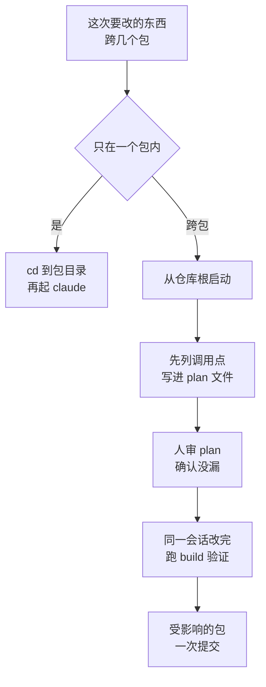

# 050. 代码库一大 agent 就开始瞎找文件、抓错同名符号——大仓库 / monorepo 怎么让它不迷路

**一句话**：单包任务就 `cd` 到那个包的目录再起 Claude，跨包改动放进一个会话、动手前先把改动清单写进 markdown 文件。

## 30 秒结论

| 你看到的 | 立刻做 | 不想再犯 |
|---|---|---|
| 它 Read 了 3 个以上和本次任务无关的包的文件 | 退出，`cd packages/<目标包>` 再起 `claude` | 每个包一份 CLAUDE.md，根目录只留全仓通用内容 |
| `/context` 的 Memory files 列出了这次根本不碰的包 | 把那些包写进 `claudeMdExcludes` | 静态排除只管「永远不碰」，临时聚焦仍靠从包目录启动 |
| 它去读 `dist/`、`*.generated.*`、`vendor/` 里的文件 | `permissions.deny` 加 `Read()` 规则 | 生成物进 `.gitignore`；已进仓库的显式 deny |
| 问「这个符号在哪定义」，它逐个文件 Read 去找 | 装 LSP 插件让它跳定义 | `/plugin install typescript-lsp@claude-plugins-official` |
| 改完共享类型，`turbo build` 报某个包编译不过 | 回仓库根，一个会话里把共享类型和全部调用方重改一遍 | 跨包改动一次性提交，不留中间态 |
| 长跨包会话 compact 之后，它漏了几个调用方没改 | 打开落盘的 plan 文件，照清单补齐 | 动手前先让它把计划写进 markdown |



## 怎么做

### 第 1 步：单包任务从包目录启动

这一步零配置、收益最大。从 `packages/api/` 启动时，Claude 加载 `packages/api/CLAUDE.md` 和根目录的 `CLAUDE.md`，`packages/web/` 的任何指令都不会进上下文[^1]；文件访问也天然被框在这个子树里，除非你再授权。

机制上是两条加载规则叠出来的不对称：**CLAUDE.md 沿目录树向上回溯，`settings.json` 不回溯、只从启动目录加载**[^6]。所以从包目录启动是唯一能同时拿到「祖先的 CLAUDE.md」和「本包 settings.json」的启动方式；反过来从仓库根启动，`packages/api/.claude/settings.json` 里包专属的 deny 规则、`additionalDirectories`、hook 一条都读不到。

**怎么确认生效**：会话里跑 `/context`，看 Memory files 那一栏。预期只列出本包和仓库根两份 CLAUDE.md，没有同级包的。包专属 settings 是否生效，用 `/permissions` 看 deny 列表里有没有你在本包配的规则。

### 第 2 步：分层写 CLAUDE.md 和 skills

根目录只放哪里都适用的内容：编码规范、commit 约定、仓库布局。每个包放自己那套：跑测试的命令、路由在哪、禁止写裸 SQL。这些文件提交进 git，各目录由 owner 维护自己那份。

别指望用 `@import` 省上下文 —— `@` 引用只改善组织结构，被引用的文件启动时仍会全量加载（见 [#010](../02-上下文工程/010-CLAUDE-md怎么写才生效.md)）。要按需加载，用带 `paths` 的 rules 或 per-directory skills：包专属的操作流程（比如 API 包的测试套路）放进 `packages/api/.claude/skills/`，只在该包工作时才加载。skill 描述写短，把会触发它的关键词放在最前面（例如 "writing or modifying tests in `packages/api/`"），因为 skill 一多描述会被截断。

### 第 3 步：挡掉永远不该进上下文的东西

两类东西两种挡法，配置写法见折叠块：

- **别的团队的包、遗留代码、拷进来的第三方子树**：写进 `claudeMdExcludes`。它是静态排除，不是「今天聚焦这个包」的开关 —— 想临时聚焦，用第 1 步，别天天改这个列表。管理策略（组织统一下发的强制配置）级别的 CLAUDE.md 排除不掉。
- **生成物和第三方代码**：`.gitignore` 里的目录（`node_modules/`、`dist/`）搜索时默认已跳过；已提交进仓库的生成代码、拷进来的第三方 SDK 用 `permissions.deny` 显式挡 Read。注意 deny 覆盖内建文件工具和 `cat`/`grep`/`find`，但不会从递归搜索的结果里过滤掉这些文件，也管不住 Claude 自己开的子进程去读[^7]。

**怎么确认生效**：`/permissions` 的 deny 列表里能看到这几条规则；再让它读一个 `dist/` 下的文件，预期返回权限拒绝而不是文件内容。

<details>
<summary>两条排除规则的配置写法</summary>

```json
// .claude/settings.local.json（个人用；手动创建的要自己加进 .gitignore）
{ "claudeMdExcludes": ["**/packages/admin-dashboard/**", "**/packages/legacy-*/**"] }
```

```json
// .claude/settings.json（提交，全仓生效）
{ "permissions": { "deny": ["Read(./**/dist/**)", "Read(./**/build/**)", "Read(./**/*.generated.*)", "Read(./vendor/**)"] } }
```

</details>

### 第 4 步：让它别靠全文扫描找符号

大仓里「找某个符号在哪定义、被谁调用」会烧掉大量文件读取。装一个 LSP 插件（语言服务器，提供跳定义、找引用能力），让它直接跳转：

```
/plugin install typescript-lsp@claude-plugins-official
```

**怎么确认生效**：`/plugin` 列表里能看到已装插件；问一句「某某符号在哪定义」，预期它调用插件的跳定义能力直接给出文件和行号，而不是逐个 Read 文件去找。

### 第 5 步：跨包改动，一个会话做完

以「给 `shared` 的 `User` 加 `role` 字段，`api` 和 `web` 都要跟上」为例，从仓库根启动：

```
1. "先探明：packages/ 下哪些包 import 了 shared 的 User 类型？把受影响的调用点
    列出来写进 docs/plan-user-role.md，先别改代码。"
2. 人审 plan 文件，逐条对照 grep 结果确认调用点没漏。
3. "按 plan 一次性改完 shared + api + web 三个包，改完跑 `pnpm turbo build` 验证。"
4. "三个包一起 commit，一条 message。"
```

四条纪律各自对应一个失败模式：

- **一个会话改完**：共享改动和它的调用方一起交出去，决策才一致；分包做会重新推导，决策就飘了[^2]。
- **计划先落盘**：长的跨包会话会一路 compact 掉上下文，写进文件的计划活得比对话历史久[^3]。
- **给一条 build 命令当终止条件**：有明确的成功/失败信号，Claude 才能自己闭环。
- **受影响的包一次提交**：多个 commit 会留下 build 坏掉的中间态[^4]。git 侧展开见 [#052](./052-别让AI搞乱git仓库.md)。

### 第 6 步：跨包访问怎么给权限

从 `packages/api/` 启动却要改 `shared/` 时，两条路：临时用 `--add-dir` 标志，固定给本包所有人用 `additionalDirectories` 设置。区别在于会不会连带加载那个目录的 CLAUDE.md 和 skills，配置写法和差异表见折叠块。

**别误会一点**：官方明说，不管用哪种方式加目录，Claude 都能读也能改里面的文件[^5]。`--add-dir` 给的是读写权，不是只读，挡不住对同级包的写入。

<details>
<summary>两种加法的配置与加载差异</summary>

| 加法 | 加载 CLAUDE.md / rules | 加载 skills |
|---|---|---|
| `additionalDirectories` 设置 | 从不 | 从不 |
| `--add-dir` 标志 / `/add-dir` 命令 | 仅当设了下面的环境变量 | 会 |

```bash
claude --add-dir ../shared                                          # 只给文件访问
CLAUDE_CODE_ADDITIONAL_DIRECTORIES_CLAUDE_MD=1 claude --add-dir ../shared   # 连带加载对方 CLAUDE.md 和 rules
```

```json
// 固定给本包所有人，提交进 packages/api/.claude/settings.json
{ "permissions": { "additionalDirectories": ["../shared", "../web"] } }
```

</details>

<details>
<summary>用 worktree 时只签出需要的目录</summary>

`--worktree` 隔离改动时默认会签出整个仓库。`sparsePaths` 让它只签出列出的目录加根级文件，worktree 起得更快、更省磁盘；配上 `symlinkDirectories` 避免每个 worktree 各存一份依赖。

```json
{ "worktree": { "sparsePaths": [".claude", "packages/api", "packages/shared"], "symlinkDirectories": ["node_modules"] } }
```

坑：`sparsePaths` 的路径相对仓库根，不管你从哪个子目录启动。根级目录不会自动带上 —— 想要根目录的 `.claude/`，必须把 `.claude` 显式列进去。

**怎么确认生效**：进 worktree 目录跑 `ls`，只应看到列出的目录和根级文件；`du -sh node_modules` 与主检出体积一致说明 symlink 生效了。

</details>

## 为什么

### 1. 为小项目调好的默认设置，到大仓里会把上下文喂脏

官方 large-codebases 文档开门见山点破根因：仓库变大后，为小项目调好的默认设置会把上下文窗口塞满与任务无关的指令和文件读取，既烧 token 又拉低表现[^1]。举例：20 个包的仓库、本次任务只涉及 5 个，你说「读一下代码库」，它会把其余 15 个不相关包的约定和文件全灌进上下文 —— 只增加噪音，不改善输出质量[^4]。这和 [#012](../02-上下文工程/012-上下文窗口要爆了.md) 讲的窗口爆炸是同一类病，但 monorepo 多给了一个通用仓没有的解法：用目录结构做切片。

### 2. 从哪里启动，决定了 Claude 看得见什么

这是本篇最重要的一条。官方把它做成一张表[^1]：

| 从哪启动 | 文件访问范围 | 启动时加载的 CLAUDE.md | 何时用 |
|---|---|---|---|
| 仓库根 | 每个文件 | 只有根；子目录文件按需加载 | 任务跨多个包 / 子系统 |
| 某个子目录 | 只有那个子树，除非再授权 | 该目录 + 所有祖先目录的 | 工作范围就在一个包内 |

### 3. 跨包改动为什么会裂开

社区把跨包改动列为 monorepo 开发里风险最高的一类操作[^4]，裂开有两种情况。一是改一半丢了上下文：跨包会话往往很长，中途 compact（把旧对话压缩掉腾空间）之后，它可能忘了还有几个调用方没改。二是 build 出现破窗：改动拆成多个 commit 就会留下「改了共享类型、调用方还没跟上」的中间态，这个中间态编译不过。官方对这个问题给的是流程约束而不是配置项，就是上面第 5 步那四条。

## 别这么干

- ❌ **一个根 CLAUDE.md 塞下所有包的约定。** 要么膨胀到烧光上下文预算，要么泛到没用。分层，每个目录一份。
- ❌ **单包任务也从仓库根启动。** 白白让十几个无关包的记忆和文件有机会进上下文，而且该包 `.claude/settings.json` 里的权限规则和 hook 一条都读不到（settings 不向上回溯也不懒加载）。`cd` 一下就能天然框住范围。
- ❌ **跨包改动分成多个会话、逐包改。** 会重新推导、决策不一致。共享改动和它的调用方要在一个会话里一起给。
- ❌ **跨包改动拆成多个 commit。** 留下 build 崩掉的中间态。所有受影响的包一次提交。
- ❌ **长跨包会话不落盘计划。** 一旦 compact，计划就丢了，它会漏掉没改的调用方。动手前先把清单写进 markdown 文件。

<details>
<summary>换成 Cursor / Copilot 呢</summary>

| 工具 | monorepo 上下文切片解法 | 差异 |
|---|---|---|
| **Claude Code** | per-dir CLAUDE.md + 从包目录启动 + `claudeMdExcludes` + `Read` deny + `sparsePaths` + per-dir skills + `--add-dir` | 层级最全，覆盖「记忆分层 / 文件读取 / worktree / 跨包访问」四条轴；官方有 monorepo 专档 |
| **Cursor** | `.cursor/rules/*.mdc`（`globs` frontmatter 按路径激活）+ `.cursorignore` | 靠 glob 规则做路径作用域，无「从子目录启动即切片」的会话作用域概念；索引整仓 |
| **GitHub Copilot** | `.github/copilot-instructions.md`（仓库根单文件）+ `.github/instructions/*.instructions.md`（可加 `applyTo` glob） | 单文件为主，路径作用域较新且弱；无 worktree / sparse-checkout 类物理切片 |

核心差异一句话：Claude Code 把「上下文切片」拆成四条各自独立、可自由组合的轴 —— 记忆分层（CLAUDE.md）、文件读取（deny 和 LSP）、磁盘签出（sparsePaths）、跨包授权（`--add-dir`）。Cursor 和 Copilot 主要只落在「按 glob 加载规则」这一条上。跨多个仓库的对比见 [#051](./051-跨仓改动只改了一边.md)。

</details>

## 延伸

**相关文章**

- [#010 CLAUDE.md 怎么写才真的生效？](../02-上下文工程/010-CLAUDE-md怎么写才生效.md) —— 通用 CLAUDE.md 写法与加载层级，本篇是它在多层目录下的应用
- [#012 上下文窗口要爆了怎么办？](../02-上下文工程/012-上下文窗口要爆了.md) —— 窗口爆炸的通用机制，本篇是「用目录结构切片」这一类结构对策
- [#051 前后端分仓，让 AI 改一个字段它只改了一边怎么办？](./051-跨仓改动只改了一边.md) —— 跨多个仓库（非单仓多包）的工作区编排与契约同步
- [#052 怎么不让 AI 把 git 仓库搞乱？](./052-别让AI搞乱git仓库.md) —— 跨包 commit / PR 的分支与提交流程侧展开

**参考资料**

- [Set up Claude Code in a monorepo or large codebase — Claude Code Docs](https://code.claude.com/docs/en/large-codebases) —— 本篇权威源：per-dir CLAUDE.md、`claudeMdExcludes`、`Read` deny、`sparsePaths`、per-dir skills、`--add-dir` 加载差异表、跨包两条法则全部出自此（官方，2026-07）
- [Claude Code with Monorepos — Phos AI Labs](https://phosailabs.com/blog/claude-code-monorepos) —— 支撑「跨包改动是最高风险类」「多 commit 造成 build 破窗」「原子提交」三处论断（社区，2026-04）
- [Claude Code for Monorepo Development — lowcode.agency](https://www.lowcode.agency/blog/claude-code-monorepo) —— 支撑「从包目录启动做上下文切片」在实践中被反复验证（社区，2026，与官方文档说法一致但为二手复述）
- 《多仓库 CLAUDE.md 配置方案》（内部项目笔记）—— 最早推出「CLAUDE.md 向上回溯、settings.json 不回溯」这条不对称及启动位置结论（个人研究，2026-07；2026-08-15 起该不对称已由官方 large-codebases 文档正面写明，见 [^6]）
- [Claude Code settings — Claude Code Docs](https://code.claude.com/docs/en/settings) —— settings 五层优先级叠加，无父目录回溯（官方）
- [How I Organized My CLAUDE.md in a Monorepo — dev.to/anvodev](https://dev.to/anvodev/how-i-organized-my-claudemd-in-a-monorepo-with-too-many-contexts-37k7) —— 支撑「根 CLAUDE.md 会膨胀」与「`@` 引用不省 token」两处论断（社区，单人经验）

[^1]: [Set up Claude Code in a monorepo or large codebase — Claude Code Docs](https://code.claude.com/docs/en/large-codebases)（官方，2026-07）：大仓默认设置会用无关指令和文件读取填满上下文窗口；从子目录启动只加载该目录及所有祖先目录的 CLAUDE.md。
[^2]: 同上：把共享改动和它的调用点一起交给 Claude，能让每处改动背后的决策保持一致，而不是逐包重新推导。
[^3]: 同上：长的跨包会话会一路压缩上下文，落盘的计划能活过对话历史。
[^4]: [Claude Code with Monorepos — Phos AI Labs](https://phosailabs.com/blog/claude-code-monorepos)（社区，2026-04）：跨包改动是 monorepo 开发里风险最高的一类；拆成多个 commit 会制造 build 损坏的窗口。
[^5]: [Claude Code Docs: large-codebases](https://code.claude.com/docs/en/large-codebases)（官方，2026-07）：不论用哪种方式添加目录，Claude 都能读取和编辑其中的文件。
[^6]: [Claude Code Docs: memory](https://code.claude.com/docs/en/memory)（官方）：CLAUDE.md 从 cwd 向上递归查找到根目录，沿途每份都加载；子目录的只在读到该目录文件时才加载。settings 不回溯已由官方正面写明：[large-codebases](https://code.claude.com/docs/en/large-codebases)（官方，2026-08-15 复核）称 `.claude/settings.json` 只从启动目录加载、不像 CLAUDE.md 那样从父目录继承。注意一个例外：自 v2.1.211 起，仓库根的 `.claude/settings.local.json` 在仓库内任意目录启动都会加载。
[^7]: [Claude Code Docs: large-codebases](https://code.claude.com/docs/en/large-codebases)（官方，2026-08-15 核实）：deny 规则覆盖内建文件工具及 `cat`/`head`/`grep`/`find` 等被识别的 Bash 文件命令（当被拒路径作为参数传入时），但不会从递归搜索的输出里过滤这些路径，也不覆盖自行打开文件的任意子进程。

---

<sub>难度 中级 · 配置题 · 主线 Claude Code，横向 Cursor / Copilot</sub>

<sub>**时效**：全部配置键与行为断言（`claudeMdExcludes` 及「管理策略级 CLAUDE.md 排除不掉」、`permissions.deny` 的 Read 规则及其覆盖范围（内建工具 + `cat`/`grep`/`find`、不过滤搜索结果、不管子进程）、`worktree.sparsePaths` / `symlinkDirectories` 及「路径相对仓库根、`.claude` 须显式列入」、`additionalDirectories` / `--add-dir` 加载差异表与 `CLAUDE_CODE_ADDITIONAL_DIRECTORIES_CLAUDE_MD` 环境变量、启动位置对照表、`/plugin install typescript-lsp@claude-plugins-official` 命令）已于 2026-08-15 对照官方 large-codebases 文档逐项核实。「settings.json 不从父目录继承」原为推论，2026-08-15 起官方 large-codebases 文档已正面写明（见 [^6]，含 settings.local.json 自 v2.1.211 起的例外）。**已知不确定**：「20 个包 / 只涉及 5 个 / 15 个无关包」是举例说明用的数量级，不是实测统计。**易变**：LSP 插件的安装命令与插件名、`worktree.*` 配置键随版本迭代快，动手前回查官方文档。</sub>

> 本篇个人实践（L4）：`[待补：BOSS 的实战经验/踩坑]`
