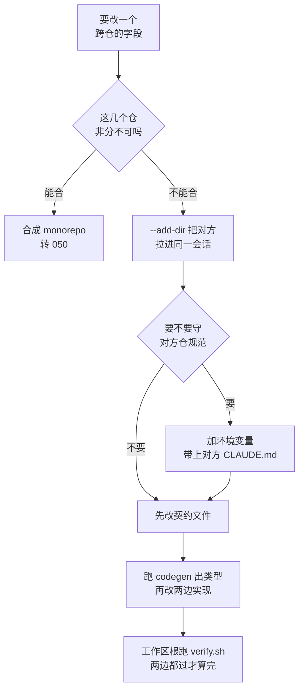

# 051. 前后端分仓，让 AI 改一个字段它只改了一边怎么办？（跨仓工作区 + 接口契约治理）

**一句话**：先问能不能合仓；不能合就用 `--add-dir` 把对方仓拉进同一会话解决「看得见」，再用一份契约文件当唯一真值源解决「字段名对得上」，最后在工作区根跑一条 `verify.sh` 两边一起验。

## 30 秒结论

| 你看到的 | 立刻做 | 不想再犯 |
|---|---|---|
| AI 只改了前端，末尾补一句「后端也需要相应添加」 | `cd frontend && claude --add-dir ../backend`，重新交代两边都改 | 固定协作写进 `additionalDirectories`，或建元仓库当工作区根 |
| 前端写 `phone`、后端叫 `phone_number`，两边 typecheck 都过，联调值是 `undefined` | 以契约文件为准统一命名，跑 codegen 重新生成前端类型 | 改接口先改 `openapi.yaml`，前端类型一律生成、不手写 |
| AI 改后端时不守后端仓的架构和命名约定 | 改用 `CLAUDE_CODE_ADDITIONAL_DIRECTORIES_CLAUDE_MD=1 claude --add-dir ../backend`，跑 `/context` 确认 Memory files 里有 `../backend/CLAUDE.md` | 记住 `additionalDirectories` 永远不加载对方 CLAUDE.md，环境变量也救不了它 |
| 后端 200、测试全绿就宣告做完，spec 没人验、另一边测试没跑 | 拿 spec 跑一遍 `schemathesis` 看字段名 / 类型 / 必填是否对得上，再在工作区根跑 `./verify.sh` | CI 里加 `oasdiff` 破坏性改动闸门；两边 typecheck + test 收进同一个脚本 |



**能合仓就别配跨仓**；非分不可才用 `--add-dir`，且改动一律先改契约文件。

## 怎么做

### 第 1 步：先决策，能合就合

强耦合的前后端优先考虑合成 monorepo（见 [#050](./050-大仓库monorepo里不迷路.md)）。合仓后 AI 一次就能看到两边，多仓的麻烦从根上消失。只有因为团队边界、权限隔离、独立发布节奏而确实不能合的场景，才需要下面这套。

### 第 2 步：把要协同的仓拉进同一会话

```bash
cd frontend
claude --add-dir ../backend                                              # 临时：只给文件读写
CLAUDE_CODE_ADDITIONAL_DIRECTORIES_CLAUDE_MD=1 claude --add-dir ../backend  # 临时 + 带上后端的说明书
```

固定协作把 `{ "permissions": { "additionalDirectories": ["../backend"] } }` 写进 `frontend/.claude/settings.json`（团队共享）或 `settings.local.json`（个人）。仓多了（经验值：4 个以上）或要长期维护，再上「元仓库」工作区（见下面的折叠块）。

**怎么确认生效**：会话里跑 `/context`，看 **Memory files** 那一栏 —— 带环境变量启动时应多出 `../backend/CLAUDE.md`，不带则不该出现；带了仍没出现，确认后端是用 `--add-dir` 加的而不是写在 `additionalDirectories` 里，该环境变量对后者无效[^1]。

### 第 3 步：立契约当唯一真值源

拉进同一会话只解决「看得见」，解决不了「字段名对得上」。字段名一致要靠一个独立于前后端实现之外的第三方裁判。

1. **选载体。** REST 接口用 OpenAPI（server stub、client SDK、文档都能从它生成）；前后端同语言（比如都是 TS）用共享类型包或 tRPC，编译器直接当裁判，最省事；强类型跨服务用 GraphQL schema 或 Protobuf。
2. **立规矩：改接口先改契约。** 所有对 API 的改动，无论多小，都从更新规格开始[^4]。把这条写进工作区顶层 CLAUDE.md（可复制模板见下面折叠块），AI 每次动接口才会从契约起步。
3. **让代码从契约生成，别手抄。** 改完 schema 就跑 codegen 产出类型和 client。代码是重新生成而不是手工编辑的，spec 和代码天生对齐。

<details>
<summary>CLAUDE.md 契约纪律（可复制）</summary>

```markdown
## API 契约纪律
- 本项目接口契约在 `api/openapi.yaml`，它是唯一真值源。
- 改任何接口（字段/端点/类型）必须先改 openapi.yaml，再改实现。
- 前端类型不许手写，一律 `pnpm gen:api` 从 openapi.yaml 生成。
- 改完接口必须在前后端各自跑 typecheck + 契约测试。
```

</details>

### 第 4 步：CI 当硬闸门

只当参考文档、不进 CI 的契约没有约束力 —— 没被强制执行的 spec 只是一份愿望文档。三道闸按需上：spec-diff（`oasdiff`）拦破坏性改动、契约测试（`Schemathesis` / `Specmatic`）拿 spec 打真实 API、spec lint（`Spectral`）管契约本身质量。各工具能力见下面折叠块。

<details>
<summary>三道闸各自管什么</summary>

- **spec-diff**：每个 PR 跑 `oasdiff` 检测破坏性改动（改名字段、删端点、改类型），一旦 breaking 就挡下。它还提供官方托管的 MCP server，可以让 Claude Code 在动手前就对比两版 spec。
- **契约测试**：`Schemathesis` 从 spec 生成基于属性的用例（按 spec 里的类型约束自动造大量输入），打真实运行的 API，验证响应是否符合 spec；`Specmatic` 在 CI 里校验实现是否匹配 spec，不匹配就让构建失败。
- **spec lint**：`Spectral` 检查契约本身的质量，比如字段命名是否一致、参数是否都有描述。

</details>

**怎么确认生效**：故意在后端把 `phone` 改成 `phoneNumber` 而不动 `openapi.yaml`，跑 `oasdiff` 或契约测试。做对的话 CI 当场失败并指出这是一处破坏性改动（`oasdiff` 会给出严重级别和文件行号）；如果两边都绿，说明闸门没接上，你的契约还只是文档。

### 第 5 步：一次会话改完两边，计划先落盘

官方对「跨边界一次改动」的两条法则在多仓同样适用：把「改接口」加「改所有调用点」放进同一会话，决策才一致；动手前把改动清单写进 markdown 文件，因为长会话会自动压缩历史，落盘的计划活得比对话历史久[^2]。别拆成「先开个会话改后端，再开个会话改前端」。

<details>
<summary>可直接复制的 contract-first prompt</summary>

```text
给 User 加 phone 字段，contract-first 走：
1. 先改 api/openapi.yaml：User schema 加 phone: string，标注是否必填
2. 跑 `pnpm gen:api` 重新生成前端 client 类型
3. 后端 handler 加校验和落库，字段名严格对齐 openapi.yaml
4. 前端表单/调用点用生成出来的类型，编译器保证字段名一致
5. 后端跑契约测试(schemathesis)，前端跑 typecheck，两边都过再报完成
```

</details>

### 第 6 步：两边一起验，用一条命令

手动切目录跑两遍，实操里很容易只跑一边。在工作区根放一个 `verify.sh`（全文见下面折叠块），让 AI 改完直接跑它。

**怎么确认生效**：`chmod +x verify.sh && ./verify.sh; echo "exit=$?"`。两边都过时最后两行是 `VERIFY OK (backend + frontend)` 和 `exit=0`；任一仓挂掉会先看到 `--- frontend FAILED`，末尾是 `VERIFY FAILED` 和 `exit=1`。验证体系见 [#040](../05-质量保证/040-怎么验证AI代码是真的对.md)。

<details>
<summary>verify.sh 全文（可复制）</summary>

```bash
#!/usr/bin/env bash
# 跨仓验证：任一仓失败即整体失败
set -uo pipefail
cd "$(dirname "${BASH_SOURCE[0]}")"   # 锚定脚本所在目录，任何 cwd 下调用都跑得对
fail=0
run() {
  local dir="$1"; shift
  echo "=== $dir: $* ==="
  if (cd "$dir" && "$@"); then echo "--- $dir OK"; else echo "--- $dir FAILED"; fail=1; fi
}
run backend  npm run typecheck
run backend  npm test
run frontend npm run typecheck
run frontend npm test
[ "$fail" -ne 0 ] && { echo "VERIFY FAILED"; exit 1; }
echo "VERIFY OK (backend + frontend)"
```

用 `set -uo pipefail` 而不是 `set -e` 是故意的 —— 要让两个仓都跑完再汇总，否则后端一挂就看不到前端的情况。命令换成你项目真实的（Java 换 `./gradlew check`，Python 换 `mypy .` 和 `pytest`）。

</details>

<details>
<summary>仓多了：元仓库（虚拟 monorepo）可复制骨架</summary>

社区两篇实践收敛到同一个模式：建一个不含业务代码的父仓当工作区根，里面只放仓清单、跨仓 CLAUDE.md、跨仓脚本；各业务仓作为子目录克隆进来并 gitignore 掉，各自保留自己的 origin。四个文件就能跑起来。

```text
workspace/                      # 元仓库，自己是一个 git 仓
  CLAUDE.md                     # 跨仓说明书（提交）
  repos.yaml                    # 仓清单，唯一真值源（提交）
  verify.sh                     # 一条命令验两边（提交）
  .gitignore
  backend/                      # 独立 git 仓，被 gitignore
  frontend/                     # 独立 git 仓，被 gitignore
```

`repos.yaml` —— 每个仓一行描述，这行描述决定 AI 能不能找对地方：

```yaml
projects:
  backend:
    desc: 用户与订单 REST API，Node.js + Express + TypeScript + PostgreSQL
    url: git@github.com:acme/backend.git
    path: backend
    tags: [api, node]
  frontend:
    desc: 后台管理界面，React + Vite + TypeScript，调用 backend 的 REST API
    url: git@github.com:acme/frontend.git
    path: frontend
    tags: [ui, react]
```

字段名取自多仓管理 CLI `mani` 的配置格式。装了 mani 就能 `mani sync` 一次克隆全部；不想引入工具，这份 yaml 当纯清单给 AI 读也够用。

`.gitignore` —— 子仓目录写成 `backend/`，末尾带斜杠，**别写 `backend/*`**：

```gitignore
backend/
frontend/
```

这里有个反直觉的点。网上不少示例写 `orders/*`，那是因为在原文里 `orders/` 只是一个业务分组目录、它本身不是 git 仓，`/*` 才能匹配到里面的条目。但子仓目录本身是独立 git 仓，git 把嵌入仓当作**单一路径** `backend` 处理，不会遍历它内部的条目，所以 `backend/*` 匹配不上，等于没写。本地实测（2026-08）：

```bash
# 用 backend/* 时，忽略不生效
$ git status --short
?? .gitignore
?? backend/
?? frontend/
$ git add .
warning: adding embedded git repository: backend

# 换成 backend/ 后才真正干净
$ git status --short
?? .gitignore
```

同理不能写 `!backend/CLAUDE.md` 这类例外：父仓无法单独追踪嵌入仓内部的文件。跨仓说明书写在元仓库顶层的 `CLAUDE.md` 里。忽略没生效的直接后果，就是 AI 在元仓库根一把 `git add .`，把子仓当 gitlink 塞进索引 —— 这正是顶层 CLAUDE.md 明令禁止的事。

顶层 `CLAUDE.md` —— 只写工作区规则和「去哪里查」，不硬抄仓列表：

```markdown
# 多仓工作区

这个目录不是一个普通项目，它是多个独立 git 仓的父工作区。
每个子目录（backend/、frontend/）是**独立的 git 仓**，有自己的 origin。

## 有哪些仓、分别是什么

看 `repos.yaml`，每个 project 的 `desc` 字段说明了它是什么。
不要凭记忆假设某个仓存在或不存在，先读 repos.yaml。

## 跨仓改动规则

1. 动手前先把改动清单写进 `_plans/<日期>-<改动名>.md`，包含：要改哪几个仓、每个仓改哪些文件、接口字段的最终名字。
2. 一次会话内改完所有涉及的仓，不要分多次会话。
3. 接口字段名以契约文件为准（见各仓 README 指向的 schema），不要在两边分别起名。
4. 改完必须在工作区根运行 `./verify.sh`，两个仓都过了才算完成。

## git 规则

- 不要在 workspace 根 commit 子仓里的改动，子仓改动在子仓目录内 commit。
- 每个仓单独开分支、单独提 PR。
```

**三层 CLAUDE.md**：Claude Code 加载 CLAUDE.md 时会从当前目录往上逐级读父目录，所以从 `workspace/backend/` 启动时，`workspace/CLAUDE.md` 和 `workspace/backend/CLAUDE.md` 都会进上下文。

| 层 | 位置 | 写什么 |
|---|---|---|
| 工作区级 | `workspace/CLAUDE.md` | 多仓警告、去 repos.yaml 查仓、跨仓操作规则。刻意写短 |
| 团队级（可选） | `workspace/orders/CLAUDE.md` | 一组仓共用的技术栈约定和例外 |
| 仓级 | `workspace/backend/CLAUDE.md` | 该仓的构建命令、架构、工具链，由仓的 owner 维护 |

团队级只有当仓多到需要按业务域分组时才加（原文例子是 `orders/`、`shipping/`、`infra/` 各一层）。两三个仓就别加，直接工作区级 + 仓级两层。

</details>

## 为什么

### 1. 跨仓上下文天生是断的

在单仓里 AI 能顺着 import 找到定义。跨仓时，前端仓里根本没有后端的代码。一次典型翻车：在 `frontend/` 里说「给用户资料加一个手机号字段，前后端都要改」，AI 在 `frontend/src/types/user.ts` 加了 `phone: string`、在表单里加了输入框，然后说一句「后端也需要相应添加 phone 字段」就结束了 —— 后端仓压根没被读过。

根因是结构性的：决定这次改动安不安全的依赖关系，横跨两个仓，落在任何单个仓的边界之外，也就落在 AI 的上下文窗口之外。这不是 Claude Code 独有的问题 —— GitHub 员工也在官方论坛承认 background agent「在单个仓的上下文里表现最好」，多仓建议拆成针对单仓的子任务[^5]。所以别指望换模型解决，只能靠工作区结构解决。

### 2. 官方给的是「文件访问」，不是「上下文合并」

这是最大的坑。`additionalDirectories` 和 `--add-dir` 给的只是文件读写权限，默认不会把那个目录的记忆和技能加载进来：`additionalDirectories` 从不加载对方的 CLAUDE.md、rules、skills；`--add-dir` 会加载 skills，但 CLAUDE.md 和 rules 只在设了 `CLAUDE_CODE_ADDITIONAL_DIRECTORIES_CLAUDE_MD=1` 时才加载[^1]。很多人抱怨「AI 改后端不守后端规范」，根因就在这：你给了它文件，没给它那个仓的说明书。

### 3. 看得见也会漂，因为 AI 靠记忆对齐字段

你让 AI 给用户加 `phone`，它在后端加了校验和落库；轮到前端时，它靠上下文里的记忆去回忆后端刚才叫什么。长会话一压缩，记忆就变了：后端 `phoneNumber`、前端 `phone`，两边各自的类型检查都过，联调才发现值永远是 `undefined`。

指望 code review 挡住这类漂移也不现实：评审者盯的是 PR 的业务逻辑，不是「这次响应模型的改动是否和 spec 一致」，spec 和实现往往在不同目录的不同文件里，改一个不会在视觉上高亮出另一个也该改。有社区文章给的典型场景是：把响应字段从 `user_id` 改名成 `userId`，接口能跑、单测全绿，但 OpenAPI spec 没更新；三周后依赖 `user_id` 的移动端在生产崩溃[^3]。

还要防一个自我欺骗：「后端能启动、返回 200、测试全绿」不是契约严谨的证据。绿测试常常只覆盖顺利路径（happy path）。可观测的判据只有一条：拿 spec 跑 `schemathesis` 或 `oasdiff`，响应的字段名、类型、必填全部对得上，才叫对齐。这和 [#042](../05-质量保证/042-幻觉API与幻觉依赖.md) 是同源问题 —— 契约就是当场戳穿 AI 编造字段和端点的那把尺子。

## 别这么干

- ❌ **明明能合 monorepo 却硬维护多仓。** 分仓要有真实理由（团队、权限、发布节奏），否则先合仓（[#050](./050-大仓库monorepo里不迷路.md)），比任何跨仓配置都省心。
- ❌ **以为 `additionalDirectories` 拉进后端就万事大吉。** 它只给文件权限，永不加载后端的 CLAUDE.md 和 skills，AI 会不守后端规范。要说明书得用 `--add-dir` 加环境变量。
- ❌ **开两个会话分别改前后端。** 决策不一致、字段对不上的高发姿势。跨仓改动放同一会话，清单先落盘。
- ❌ **让 AI 手抄类型到另一个仓，或者先写代码事后补 spec。** 手抄就是漂移之源；补的 spec 会立刻烂掉。有契约就跑 codegen，让类型系统当裁判；契约不进 CI 就没有约束力。
- ❌ **只在一边验证就宣告完成。** 改了后端只跑后端测试，前端调用点对没对上没人验。把两边检查收进工作区根的 `verify.sh`。

<details>
<summary>换成 Cursor / Copilot 呢</summary>

| 工具 | 多仓解法 | 契约治理解法 | 差异 |
|---|---|---|---|
| **Claude Code** | `--add-dir` / `additionalDirectories` 拉相邻仓；元仓库工作区；跨仓 CLAUDE.md 分层 | 在 CLAUDE.md 里定 contract-first 纪律，让 AI 跑 codegen 和契约测试；可挂 `oasdiff` MCP 在改前查破坏性改动 | 官方原生支持多目录访问；但 `additionalDirectories` 不加载对方 CLAUDE.md 和 skills，需环境变量补 |
| **Cursor** | 多根工作区；社区长期在请求「跨窗口、跨仓的 agent 通信」 | 在 rules 文件里写契约约定，同样接 OpenAPI codegen 和契约测试 | 跨窗口协同仍停在功能请求阶段 |
| **GitHub Copilot** | background agent 在单仓上下文里表现最好，GitHub 员工建议拆成针对单仓的子任务，最后测集成点 | 同样靠 OpenAPI 或共享类型当真值源，加 CI 契约门；没有契约专属特性 | 多仓需手动拆解协调 |

共性趋势：三家都在补「跨仓依赖」这块短板，社区收敛到两类解法。一类是工作区打包，把依赖的仓拉进一个工作区，仓少时最省事；另一类是元仓库或显式依赖图，规模大或跨语言时才值得。别一上来就上重方案。「不超过 3 个用工作区打包、4 个以上上元仓库」这个分界是本篇经验值，两篇社区实践原文都没给具体数字。

契约这一侧三家没差别：工具本身都不「管」契约漂移，真正兜底的是 CI 里那道机器闸门（spec-diff + 契约测试 + codegen）。工具的差异只在「多方便把契约纪律喂给 AI」。

</details>

## 延伸

<details>
<summary>相关文章（8 篇）</summary>

- [#050 大仓库 / monorepo 怎么让 AI 不迷路](./050-大仓库monorepo里不迷路.md) —— 本篇「能合就合」的去处，也是多仓配置项的同源文档
- [#052 怎么不让 AI 把 git 仓库搞乱？](./052-别让AI搞乱git仓库.md) —— 跨仓改动落到分支、commit、PR，尤其是两个仓的 PR 怎么协同
- [#042 AI 编出来的 API / 依赖根本不存在——怎么查、怎么防？](../05-质量保证/042-幻觉API与幻觉依赖.md) —— 契约就是戳穿 AI 编造字段和端点的那把尺子
- [#021 动手前到底要不要先写 PRD / 需求文档？](../03-需求与规划/021-动手前要不要写PRD.md) —— 接口契约是「先写规格再写实现」在接口这一处的落地
- [#030 AI 写的测试不可信怎么办？](../04-执行工作流/030-AI写的测试不可信.md) —— 契约测试是 TDD 的一种：spec 当断言，让 pass/fail 闭合验证环
- [#040 AI 说"做完了"、测试也全绿，怎么知道代码是真的对？](../05-质量保证/040-怎么验证AI代码是真的对.md) —— 本篇「双边验证」的体系出处
- [#053 AI 生成的 PR 太大太多，review 机制怎么扛住不崩？](./053-AI的PR太大没法review.md) —— 跨仓大改动的 review 承接
- [#012 上下文窗口要爆了怎么办？](../02-上下文工程/012-上下文窗口要爆了.md) —— 多仓上下文断裂是窗口机制在跨边界的体现

</details>

<details>
<summary>参考资料（11 条）</summary>

- [Set up Claude Code in a monorepo or large codebase — Claude Code Docs](https://code.claude.com/docs/en/large-codebases) —— 支撑「`additionalDirectories` / `--add-dir` 加载差异表」与「一次会话改完 + 计划落盘」两条法则（官方，2026-08-15 核实）
- [Structuring Claude Code for Multi-Repo Workspaces — Karun Japhet](https://karun.me/blog/2026/03/26/structuring-claude-code-for-multi-repo-workspaces/) —— 支撑元仓库骨架里的「清单文件 + 三层 CLAUDE.md」（社区，2026-03）
- [Repo-of-Repos Pattern — Rafferty Uy](https://raffertyuy.com/raztype/repo-of-repos-pattern/) —— 同一模式的另一份独立实践，支撑「元仓库不含业务代码、子仓各自保留 origin」（社区，2026-05）
- [alajmo/mani](https://github.com/alajmo/mani) —— `repos.yaml` 里 `desc` / `url` / `path` / `tags` 字段名的出处（开源工具，2026-08-15 对照其 config 文档核实）
- [Background agents touching multiple repositories? — GitHub community](https://github.com/orgs/community/discussions/186469) —— 支撑「跨仓不是 Claude Code 独有问题」，回复者为 GitHub 员工（自述带领 GitHub 架构师团队），建议拆成单仓子任务（官方论坛的员工回复，2026，2026-08-15 核实）
- [Feature Request: Cross-Window / Cross-Repo Agent Communication — Cursor Forum](https://forum.cursor.com/t/feature-request-cross-window-cross-repo-agent-communication/151603) —— 支撑横向对比里「Cursor 跨窗口 agent 协同仍停在功能请求阶段」（社区，2026-02 发帖，2026-08-15 核实仍未落地；Cursor 已另行支持单会话多根工作区）
- [Your AI shipped a backend that boots. That is the whole problem. — Stack Overflow Blog](https://stackoverflow.blog/2026/06/23/your-ai-shipped-a-backend-that-boots-that-is-the-whole-problem/) —— 支撑「能启动能返回 200 不等于契约严谨」（社区，2026-06）
- [Spec-Driven APIs — Kinde](https://kinde.com/learn/ai-for-software-engineering/using-ai-for-apis/spec-driven-apis-designing-and-building-services-the-ai-friendly-way/) —— 支撑「契约作唯一真值源」「改动必须从更新规格开始」（社区，2026）
- [Spec-Driven Development: From Code to Contract — arXiv:2602.00180](https://arxiv.org/html/2602.00180v1) —— 支撑「用 spec 当源头从构造上消除漂移」；文中「有 spec 让 LLM 代码错误率最高降 50%」是论文对若干 controlled studies 的转述，未逐一回溯原始研究（学术，2026）
- [API Schema Validation Drift Detection Guide — TotalShiftLeft](https://totalshiftleft.ai/blog/api-schema-validation-catching-drift) —— 支撑「code review 是 schema 漂移的结构盲区」与 `user_id`→`userId` 场景（社区，2026）
- [oasdiff](https://www.oasdiff.com/) / [Schemathesis](https://schemathesis.io/) —— CI 三道闸的工具出处：前者做 OpenAPI 破坏性改动检测，官方仓库另提供托管 MCP server（api.oasdiff.com/mcp，2026-08-15 核实）；后者从 spec 生成基于属性的用例验证运行中的实现（工具官网，2026）

</details>

[^1]: [Claude Code Docs: large-codebases](https://code.claude.com/docs/en/large-codebases)（官方，2026-08-15 核实）：`additionalDirectories` 永不加载对方的 CLAUDE.md、rules 和 skills；`--add-dir` 加载 skills，只有设了 `CLAUDE_CODE_ADDITIONAL_DIRECTORIES_CLAUDE_MD=1` 才加载 CLAUDE.md 和 rules，且该环境变量对 `additionalDirectories` 无效；两者都是读写权限。
[^2]: 同上：把整个改动放进一个会话，决策才一致；动手前把计划存成文件，它能活过被压缩的对话历史。
[^3]: [API Schema Validation Drift Detection Guide — TotalShiftLeft](https://totalshiftleft.ai/blog/api-schema-validation-catching-drift)（社区，2026，2026-08-15 核实链接与原文）：`user_id`→`userId` 改名后 spec 未更新、三周后移动端生产崩溃。原文以此示意场景开篇，并称同类情形在依赖 API 契约的组织里反复出现，非指某一具体事故。
[^4]: [Spec-Driven APIs — Kinde](https://kinde.com/learn/ai-for-software-engineering/using-ai-for-apis/spec-driven-apis-designing-and-building-services-the-ai-friendly-way/)（社区，2026）：对 API 的任何改动，无论多小，都必须从更新规格开始。
[^5]: [Background agents touching multiple repositories? — GitHub community](https://github.com/orgs/community/discussions/186469)（官方论坛，2026）：background agent 在单个仓的上下文里表现最好，多仓场景建议拆成针对单仓的子任务。此话出自论坛里一位 GitHub 员工（自述带领 GitHub 架构师团队）的回复，非官方文档表述。

---

<sub>难度 中级 · 配置题 + 流程题 · 主线 Claude Code，横向 Cursor / Copilot</sub>

<sub>**时效**：多仓配置事实（`additionalDirectories` 与 `--add-dir` 的加载差异、`CLAUDE_CODE_ADDITIONAL_DIRECTORIES_CLAUDE_MD` 的作用范围、两者都是读写权限）已于 2026-08-15 对照官方 large-codebases 文档逐条核实；契约与 CI 两节的事实性内容与外链（oasdiff MCP、TotalShiftLeft、arXiv:2602.00180、GitHub 与 Cursor 论坛帖、mani 字段名）于 2026-08-15 复核；`.gitignore` 写 `backend/` 而非 `backend/*` 为 2026-08 本地实测。**已知不确定**：「有 spec 让 LLM 生成代码错误率最高降 50%」是 arXiv:2602.00180 对若干 controlled studies 的转述（原文引 InfoQ 与 Red Hat Developer 两篇），未逐一回溯原始研究，只看方向；「3 个仓以内工作区打包、4 个以上上元仓库」为本篇经验值，未见社区或官方给出数字。**易变**：`--add-dir` 相关参数语义、oasdiff / Schemathesis / Spectral 的能力边界随版本变化，动手前以官方为准。</sub>

> 本篇个人实践（L4）：`[待补：BOSS 的实战经验/踩坑]`
