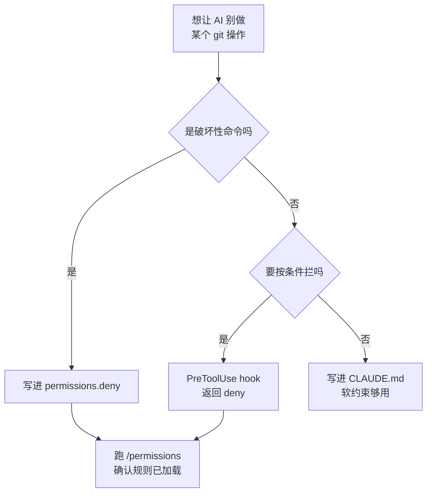

# 052. 怎么不让 AI 把 git 仓库搞乱？（禁掉 force push / reset --hard，去掉 Co-Authored-By 署名）

**一句话**：破坏性 git 命令写进 `permissions.deny`（写在 CLAUDE.md 里没有强制力），署名用 `attribution` 三个键关掉，分支活几小时就合、PR 提交前人要能逐处说出「为什么这么改」。

## 30 秒结论

| 你看到的 | 立刻做 | 不想再犯 |
|---|---|---|
| AI 执行了 `git reset --hard` / `git push --force` | `git reflog` 找回本地；远端已 force push 就立刻通知全队别 pull | 把破坏性命令逐条写进 `permissions.deny` |
| CLAUDE.md 里写了「别 force push」，它照做不误 | 改写成 `permissions.deny` 规则 | 权限规则由 Claude Code 执行，不由模型执行 |
| `git log` 里出现 `Co-Authored-By: Claude …` | `attribution.commit` / `attribution.pr` 设空串，`sessionUrl` 设 `false` | 放 `~/.claude/settings.json`，别在项目级一刀切 |
| `/rewind` 退不回来 —— 文件是 AI 用 Bash 删的 | `git checkout .`；未跟踪文件靠之前的 `git stash -u` | 动手前 `git status` 必须干净 |
| 一次会话堆成一个几十文件的巨型 commit | `git reset --soft HEAD~1` 后用 `git add -p` 重新拆 | 提交前先让它列拆分方案，人定 commit 边界 |
| 分支开了三天，merge 时冲突一片、AI 的假设全过期 | 拆小、尽快合 | 一个 AI 任务一个分支，几小时内 merge 掉 |



硬门禁只能靠 `permissions.deny` 或 PreToolUse hook，**写进 CLAUDE.md 等于没写**。

## 怎么做

### 第 1 步：把破坏性 git 命令写进 `permissions.deny`

这是唯一真正拦得住的手段。复制进项目根的 `.claude/settings.json`（提交进仓库，全队生效）：

```json
{
  "permissions": {
    "allow": ["Bash(git status *)", "Bash(git diff *)", "Bash(git log *)",
              "Bash(git add *)", "Bash(git commit *)", "Bash(git checkout -b *)", "Bash(git stash *)"],
    "ask": ["Bash(git push *)", "Bash(git merge *)"],
    "deny": ["Bash(git push --force *)", "Bash(git push --force*)",
             "Bash(git push -f *)", "Bash(git push -f*)",
             "Bash(git reset --hard *)", "Bash(git reset --hard*)",
             "Bash(git rebase *)", "Bash(git rebase*)",
             "Bash(git clean -fd *)", "Bash(git clean -fd*)",
             "Bash(git branch -D *)", "Bash(git branch -D*)",
             "Bash(git filter-branch *)", "Bash(git filter-branch*)",
             "Bash(git update-ref *)", "Bash(git update-ref*)",
             "Bash(git reflog delete *)", "Bash(git reflog delete*)"]
  }
}
```

**怎么确认生效**：跑 `/permissions` 确认列表里有这些 deny 条目（会标注来源文件），再让它试一次 `git reset --hard HEAD~1`。预期不弹「是否允许」确认框，而是直接报告该命令被权限规则拒绝 —— **弹出确认框就说明规则没匹配上**，最常见原因是配置写在了没被加载的文件里。

<details>
<summary>三条匹配规则与两个边界（wrapper 名单 / 无人值守）</summary>

三个必须知道的匹配规则[^1]：

- **求值顺序是 deny → ask → allow，先匹配到的说了算**，规则写得多具体不影响顺序。所以上面 `allow` 里再宽的 git 规则也解不开 deny。
- **`*` 前有没有空格不一样。** 带空格的 `Bash(ls *)` 要求前缀后面是空格或直接结束 —— 匹配 `ls -la` 和裸命令 `ls`，但不匹配 `lsof`；不带空格的 `Bash(ls*)` 三个都匹配。所以上面每条 deny 都补了一条不带空格的版本，用来覆盖长参数前缀 —— 比如 `Bash(git push --force*)` 能同时拦下 `--force-with-lease`。（`Bash(x:*)` 等价于 `Bash(x *)`，只在模式结尾有效。）
- **复合命令逐段匹配。** Claude Code 认识 `&&`、`||`、`;`、`|`、`|&`、`&`、换行，`git status && git reset --hard` 里的后半段会被单独拿去匹配 deny，不会因为前半段被允许就整条放行。

两个边界别忽略：环境运行器（`devbox run`、`docker exec`、`npx`）会执行任意内层命令，deny 规则看不到里面，别给它们开宽泛的 allow；官方剥离的 wrapper 只有 `timeout`、`time`、`nice`、`nohup`、`stdbuf`、`command`、`builtin`、`noglob`、无参数的 `xargs`。deny 规则会穿过前置环境变量赋值，`FOO=bar rm -rf tmp/` 仍会被 `Bash(rm *)` 拦下。

无人值守（批处理 / CI）再收一层：用 `--allowedTools "Edit,Bash(git commit *)"` 把能力收窄。注意 `--allowedTools` 只是「免确认」，要限制哪些工具可用得用 `--tools`。

</details>

### 第 2 步：条件式门禁用 hook，不用嘱咐

「提交前必跑测试」这类规则写进 CLAUDE.md 只是软约束 —— 模型可能照做，也可能哪次就失守。要成为硬门禁，得用 PreToolUse hook。**怎么确认生效**：故意改坏一个测试，然后让 Claude 提交。预期它执行 `git commit` 失败并把测试失败日志读回来；跑 `git log -1` 确认没有产生新 commit。

<details>
<summary>PreToolUse hook 完整配置 + 拦截脚本</summary>

`.claude/settings.json`（`if` 字段用的就是权限规则语法）：

```json
{
  "hooks": {
    "PreToolUse": [
      {
        "matcher": "Bash",
        "hooks": [
          {
            "type": "command",
            "if": "Bash(git commit *)",
            "command": "${CLAUDE_PROJECT_DIR}/.claude/hooks/pre-commit-test.sh",
            "timeout": 300
          }
        ]
      }
    ]
  }
}
```

配套脚本 `.claude/hooks/pre-commit-test.sh`（记得 `chmod +x`）：

```bash
#!/bin/bash
# 测试不过就拦下这次 commit
if ! npm test --silent >/tmp/cc-pretest.log 2>&1; then
  jq -n --rawfile log /tmp/cc-pretest.log '{
    hookSpecificOutput: {
      hookEventName: "PreToolUse",
      permissionDecision: "deny",
      permissionDecisionReason: ("测试未通过，commit 被拦下：\n" + $log)
    }
  }'
  exit 0
fi
exit 0   # 不打印 JSON = 不做决定，走正常权限流程
```

官方给了两种拦截方式：退出码 2（stderr 作为原因回给 Claude），或退出码 0 加上面这段 `permissionDecision: "deny"` 的 JSON。退出码 2 无条件拦截，JSON 里就算写了 `"allow"` 也覆盖不掉。

</details>

### 第 3 步：按场景决定要不要去掉署名

先定档位：内部私有仓可以关；对外贡献前必须先查目标项目的 AI 政策 —— 有的项目（如 Kubernetes）明令要求披露 AI 使用，为了隐藏而关署名反而违规（取舍细节见文末折叠块）。决定要关的话，默认 commit 带 `Co-Authored-By: Claude Sonnet 5 <noreply@anthropic.com>`（trailer 里的模型名跟随当前会话的模型变化），PR 描述带 `🤖 Generated with [Claude Code](https://claude.com/claude-code)`，全部关掉[^4]：

```json
{ "attribution": { "commit": "", "pr": "", "sessionUrl": false } }
```

<details>
<summary>attribution 三个键的语义与自定义署名</summary>

`commit` 是 commit 的署名内容（含 trailer），`pr` 是 PR 描述的署名，两者空串即隐藏；`sessionUrl` 控制 cloud / Remote Control 会话里要不要追加 claude.ai 会话链接（commit 上是 `Claude-Session` trailer），默认 `true`。也可以改成自定义署名而不是删掉，比如 `"commit": "Generated with AI\n\nCo-Authored-By: AI <ai@example.com>"`。旧开关 `includeCoAuthoredBy` 已被官方标记 deprecated，`attribution` 优先级更高，别再碰旧开关。

</details>

**放哪一层**：项目级 `.claude/settings.json` 会覆盖全队（包括本想保留署名的人），个人偏好放 `~/.claude/settings.json`，机器级一次性设置放被 gitignore 的 `.claude/settings.local.json`。

**怎么确认生效**：让 Claude 提交一次，跑 `git log -1 --format='%B'`，预期输出里没有任何 `Co-Authored-By:` 或 `Claude-Session:` 行。

### 第 4 步：分支 / commit / PR，人守三道闸

一个 AI 任务对应一个分支，几小时内 merge 掉 —— 分支越短，AI 基于的 main 状态越新[^5]。并行跑多个 AI 时用 `claude --worktree feature-auth`（短写 `-w`）隔离，它在 `.claude/worktrees/feature-auth/` 建独立检出、分支名默认 `worktree-feature-auth`；记得把 `.claude/worktrees/` 加进 `.gitignore`。分支命名约定写进 CLAUDE.md 就够 —— 那是没有破坏性的软约束。

两道人闸必须守住：**commit 边界人来定**（先让它列拆分方案再提交），**PR 提交前人要能对每一处 diff 说出「为什么这么改」**，说不出就退回去让它解释[^3]。

<details>
<summary>完整会话骨架（每一格标了人守哪道闸）</summary>

| 阶段 | 你说什么（可直接复制） | 人守哪道闸 |
|---|---|---|
| 开分支 | `按 CLAUDE.md 的命名约定开一个新分支，任务是 <一句话描述>` | 命名约定写死在 CLAUDE.md |
| 实现前 | `先跑 git status 确认工作区干净，脏的话停下来告诉我` | 干净才动手，保证能回滚 |
| 实现 | plan → implement（见 [#031](../04-执行工作流/031-plan-execute-review循环.md)） | 分支短命，几小时内合掉 |
| commit | `按逻辑边界把这些改动拆成多个 commit：先列出你打算怎么拆、每个 commit 包含哪些文件，等我确认后再提交` | **人定 commit 边界**，别让它堆巨型 commit |
| 自审 | `/code-review` | 对抗审在提 PR 之前（见 [#041](../05-质量保证/041-怎么审查AI生成的代码.md)） |
| 提 PR | `create a pr，描述里写清楚改了什么、为什么这么改、有哪些风险点和没覆盖到的场景` | **人要能对每一处 diff 说出「为什么这么改」**，说不出就退回去让它解释[^3] |

`gh pr create` 之后 session 会自动关联到那个 PR，用 `claude --from-pr 1234` 能找回（也接受 GitHub / GitLab / Bitbucket 的 PR、MR URL）。

</details>

### 第 5 步：搞乱了怎么退回去

三层退路，从最兜底到最精细：

1. **保持工作区干净再放 AI 试错。** 动手前 `git status` 确认干净（或先 commit / stash），出问题就 `git checkout .` 退回去。这是唯一兜得住「AI 用 Bash 删了文件」的一层。未跟踪文件要 `git stash -u` 才会一起存。
2. **会话内的小回退用 `/rewind`。** 它只退得回 Claude 用文件编辑工具做的改动，适合「这一轮改歪了，退到上一步重来」。用之前先看清楚下面那张边界表 —— 有一半场景它是静默失效的。
3. **逐块审查用 `git add -p`。** 这是「逐块 diff 审查」在命令行里现成的等价物。搭配第 4 步「人定 commit 边界」，一次 AI 大改就能拆成几个各自能单独 revert 的 commit —— **回滚粒度是在 commit 阶段挣来的，不是出事之后**。

<details>
<summary>git add -p 逐块过的具体命令</summary>

```bash
git diff                 # 先整体扫一遍 AI 改了什么
git add -p               # 逐块过：y 收下 / n 丢弃 / s 拆更小 / e 手改这一块
git checkout -- .        # 没 add 的（你不要的那些块）一次性丢掉
```

`s` 能把大 hunk 拆成更小的块，`e` 能直接编辑这一块再收；`git restore -p` 则是反过来逐块丢弃。

</details>

#### `/rewind` 的五个粒度

`/rewind`，或者输入框为空时连按两下 `Esc`（框里有字则第一下是清空），会列出本次会话你发过的每一条 prompt。选中一个点之后有五个动作：退代码 + 对话、只退对话、只退代码、从这里往后压缩成摘要、从这里往前压缩成摘要[^6]。

<details>
<summary>五个粒度分别什么时候用</summary>

| 选项 | 干什么 | 什么时候用 |
|---|---|---|
| Restore code and conversation | 代码和对话一起退回该点 | 这一轮整个方向错了，重来 |
| Restore conversation | 只退对话，代码保持现状 | 改动要留，但对话被带偏了 |
| Restore code | 只退文件改动，对话保留 | 想让它记着刚才试过什么，再换个写法 |
| Summarize from here | 把该点之后的对话压成摘要 | 上下文快满，调试啰嗦段落要瘦身 |
| Summarize up to here | 把该点之前的对话压成摘要 | 保留最近细节，砍掉前段 |

</details>

两个「Restore code」选项**只在该 checkpoint 确实有被跟踪的文件改动时才出现**。这就是最直接的可观测信号：**菜单里没有 Restore code，说明这段改动压根没被记下来，别指望它能退**。它退不回来的情况见下表。

<details>
<summary>/rewind 退不回来的六种情况（附验证方法）</summary>

| 边界 | 具体表现 | 你该怎么办 |
|---|---|---|
| Bash 命令改的文件 | `rm` / `mv` / `cp`、`sed -i`、`echo >` 全不跟踪，只有文件编辑工具的改动才记 | 靠 git：动手前工作区干净 + `git stash -u` |
| SubAgent 的改动 | 后台 subagent（含后台 `/code-review --fix`、后台运行的 fork skill）的编辑落在你会话的 checkpoint 之外，即使它用的是文件编辑工具 | 官方明说这类改动用 git 回退 |
| 外部改动 | 你自己在编辑器里改的、其他并发会话改的，本会话没碰过就不记 | 别在 AI 跑着的时候手动改同一批文件 |
| 软链接 / 硬链接路径 | restore 时直接跳过，提示 `Restored the code, but skipped N files`，文件内容保持原样 | 恢复前先 `/debug`，跳过的路径会写进 `~/.claude/debug/<session-id>.txt` |
| 超过 100 个 checkpoint | 一个会话只保留最近 100 个 checkpoint 的文件快照（每条 prompt 一个） | 长会话别把 rewind 当长期存档 |
| 超过保留期 | checkpoint 跟着 session 一起删，默认 30 天，由 `cleanupPeriodDays` 控制 | 要长期留就得是 commit |

checkpoint 跟着对话一起存，`--resume` 恢复会话之后 `/rewind` 仍然可用。

**怎么确认边界**：让 Claude 用 Bash 删一个文件（`rm test-file.txt`），再开 `/rewind` 选那条 prompt 之前的点。预期菜单里不给 Restore code 选项，或者选了文件也不回来 —— 这是「checkpoint 不是 git」最直观的一次演示。

</details>

## 为什么

### 1. AI 打破了 git 流程的一个隐含前提

传统 git 流程默认「写代码」是最慢的瓶颈，所以才有开 feature 分支、慢慢攒 commit、PR 排队 review 这一套。AI 把写代码压到几分钟，瓶颈立刻移到另一头：人能多快理解并合并这些改动。更要命的是，AI 是基于开分支那一刻的状态写代码的，而 main 在继续往前走 —— 等你合并时，它当初的一半假设已经不成立[^5]。所以 AI 时代分支策略要往短命分支 / trunk-based 偏。

### 2. checkpoint 不是 git，兜不住破坏性命令

官方明确说 Claude Code 的 checkpoint（用 `/rewind` 回退的存档点）只记录 Claude 通过文件编辑工具做的改动，Bash 命令和外部进程的改动不会被记录，它不是 git 的替代品[^2]。也就是说：`git reset --hard`、`git push --force`、`git rebase` 这些走 Bash 的操作，checkpoint 完全看不见也回退不了。一旦执行，你只剩 reflog 这条命 —— 远端 force push 之后连 reflog 都救不了别人。

### 3. 嘱咐没有强制力，只有权限规则有

官方把这句话写死了：权限规则由 Claude Code 强制执行，不是由模型执行；写在 prompt 或 CLAUDE.md 里的指令只影响 Claude 想做什么，不改变 Claude Code 允许它做什么[^1]。所以「怎么不让 AI 搞乱」这个问题，答案在 `settings.json` 的 `permissions.deny`，不在 CLAUDE.md 的措辞。

## 别这么干

- ❌ **靠 CLAUDE.md 嘱咐「别 force push」「提交前必跑测试」。** CLAUDE.md 是软约束，没有强制力 —— 模型可能照做，也可能哪次就失守。硬门禁只能用 `permissions.deny` 或 PreToolUse hook。
- ❌ **deny 只写一条 `Bash(git push --force *)` 就收工。** 漏掉 `-f` 和 `--force-with-lease` 这些变体。要么按上面那份清单逐条写全，要么干脆把 `Bash(git push *)` 整个放进 `ask`。
- ❌ **在脏工作区上放 AI 大改，还把 `/rewind` 当回滚的全部依靠。** checkpoint 看不见 Bash 层的改动、后台 subagent 的改动、你在编辑器里手改的内容，软硬链接路径也会被直接跳过。兜底是动手前工作区干净 + `git stash -u`。
- ❌ **PR 不读 diff 就提，或把整个会话堆成一个巨型 commit。** 前者违反官方铁律「Review before submitting」，Kubernetes 会直接关掉这类 PR；后者是 review 灾难，也丢掉了回滚粒度（见 [#053](./053-AI的PR太大没法review.md)）。
- ❌ **在项目级 settings 里一刀切关掉署名。** 会覆盖全队偏好；对外贡献时还可能撞上目标项目的 AI 披露要求 —— 为了「隐藏 AI 使用」而关署名，可能反过来违规。

<details>
<summary>AI 的 git 政策光谱：官方 vs Kubernetes；换成 Cursor / Copilot 呢</summary>

宽松的一端是 Anthropic 官方工作流：AI 写 commit message、生成 PR，人 review 后提交，署名默认带。

严格的一端是 Kubernetes 官方政策：明令禁止 AI 写 commit message、禁止 AI 署名 co-author、禁止大型 AI 生成的 PR，并要求在 PR 描述里披露是否使用了 AI。原话是「解释不了改动为什么这么改，PR 直接关掉」—— 作者不能把理解的责任甩给 reviewer。

取舍：内部私有仓可以偏宽松；对外贡献开源前先查清该项目的 AI 政策。政策制度层见 [#072](../08-团队与组织/072-AI-coding安全红线.md)。

| 工具 | commit / PR 配合 | 差异 |
|---|---|---|
| **Claude Code** | 会话内直接 `git commit` / `gh pr create`；`attribution` 可配；`--worktree` 并行；`permissions.deny` + PreToolUse hook 双层收窄 | agent 化最深，能跑整条流程，也因此最需要权限边界 |
| **Cursor** | 内置 Generate Commit Message（读 staged diff 生成）；Agent 可提 PR | 以生成 message 为主，git 高危操作仍走人手 |
| **GitHub Copilot** | 生成 commit message；coding agent 可开分支提 PR | 与 GitHub 原生流程绑定最紧，PR 里带 Copilot 署名 |

共性：三家都把「生成 commit message / PR 描述」做成标配，这是 AI 稳赢人的部分。差异在于谁更敢让 AI 碰 git 的破坏性操作，以及给不给你收窄的手段。

</details>

## 延伸

**相关文章**

- [#053 AI 生成的 PR 太大太多，review 机制怎么扛住不崩？](./053-AI的PR太大没法review.md) —— 本篇 PR 层的深入篇
- [#051 前后端分仓，让 AI 改一个字段它只改了一边怎么办？](./051-跨仓改动只改了一边.md) —— 跨仓的 git 协调（本篇聚焦单仓流程）
- [#050 大仓库 / monorepo 怎么让 AI 不迷路](./050-大仓库monorepo里不迷路.md) —— worktree 与目录级配置的深入
- [#040 AI 说"做完了"、测试也全绿，怎么知道代码是真的对？](../05-质量保证/040-怎么验证AI代码是真的对.md) / [#041 怎么 review AI 生成的代码？](../05-质量保证/041-怎么审查AI生成的代码.md) —— 提 PR 前对抗审的攻略
- [#031 plan → execute → review 的正确循环怎么做？](../04-执行工作流/031-plan-execute-review循环.md) —— commit 前的执行环
- [#010 CLAUDE.md 怎么写才真的生效？](../02-上下文工程/010-CLAUDE-md怎么写才生效.md) —— 分支命名约定放哪、hook 与嘱咐的分工
- [#072 AI coding 的安全红线怎么画？](../08-团队与组织/072-AI-coding安全红线.md) —— AI git 政策的制度层

**参考资料**

- [Configure permissions — Claude Code Docs](https://code.claude.com/docs/en/permissions) —— 支撑「规则由 Claude Code 执行不由模型执行」，以及 deny→ask→allow 求值顺序、Bash 通配符空格语义、复合命令逐段匹配、wrapper 剥离名单（官方，2026-08）
- [Hooks reference — Claude Code Docs](https://code.claude.com/docs/en/hooks) —— 支撑第 2 步的 PreToolUse 结构、`matcher` / `if` / `timeout` 字段、退出码 2 与 `permissionDecision: deny` 两种拦截方式（官方，2026-08）
- [Claude Code settings](https://code.claude.com/docs/en/settings) —— 支撑 `attribution` 三键语义、默认署名文本、`includeCoAuthoredBy` 已 deprecated 且优先级更低（官方，2026-08）
- [Git worktrees — Claude Code Docs](https://code.claude.com/docs/en/worktrees) —— 支撑 `--worktree` / `-w`、`.claude/worktrees/<name>/` 路径、`worktree-<name>` 分支名与加 `.gitignore` 的提示（官方，2026-08）
- [Checkpointing — Claude Code Docs](https://code.claude.com/docs/en/checkpointing) —— 支撑第 5 步的五个 rewind 粒度与整张边界表：Bash 改动 / subagent 改动 / 外部改动 / 软硬链接不跟踪，100 个 checkpoint 上限，30 天保留期，以及「checkpoint 不替代版本控制」（官方，2026-08）
- [Best practices for Claude Code](https://code.claude.com/docs/en/best-practices) —— 支撑「checkpoint 不是 git 替代品」、CLAUDE.md 该放 branch naming / PR conventions、`--allowedTools` 用法（官方，2026-08）
- [Common workflows — Claude Code Docs](https://code.claude.com/docs/en/common-workflows) —— 支撑「提 PR 前人必须先 review」这条铁律与 `gh pr create` 推荐（官方，2026-08）
- [CLI reference — Claude Code Docs](https://code.claude.com/docs/en/cli-reference) —— 支撑 `--from-pr` 接受 PR 号与三家平台 URL、`--allowedTools` 是免确认而非限制可用工具（官方，2026-08）
- [Pull Request Process — kubernetes.dev](https://www.kubernetes.dev/docs/guide/pull-requests/) —— 支撑折叠块里「严格一端」的全部内容：禁 AI commit message / AI 署名 / 大型 AI PR，要求披露，作者须能解释改动（官方项目政策，2026）
- [Claude Code CHANGELOG](https://github.com/anthropics/claude-code/blob/main/CHANGELOG.md) —— 支撑 `attribution` 自 v2.0.62 起取代（deprecate）`includeCoAuthoredBy`、`sessionUrl` 键自 v2.1.183 起加入且默认 `true`（官方，2026-08）
- [Trunk-Based Development with Short-Lived Branches — dev.to](https://dev.to/tacoda/trunk-based-development-with-short-lived-branches-5f74) —— 支撑「分支活得越久 AI 产出越危险」与「合并时一半假设已不成立」的原文（社区，2024-04）
- [Codex issue #9203](https://github.com/openai/codex/issues/9203)（388 👍，截至 2026-08-15 仍 open）/ [claude-code issue #33932](https://github.com/anthropics/claude-code/issues/33932)（173 👍，截至 2026-08-15 仍 open）—— 支撑第 5 步的动机：社区在集中要求「能撤销 AI 改动的 /undo」和「逐文件 / 逐块 accept-reject 的 diff 审查界面」（社区，2026-01 / 2026-03）
- [GitHub issue #4224 — anthropics/claude-code](https://github.com/anthropics/claude-code/issues/4224) —— 旧署名开关偶发不生效，是迁移到 `attribution` 的佐证（社区，现已关闭）

[^1]: [Configure permissions — Claude Code Docs](https://code.claude.com/docs/en/permissions)（官方，2026-08）：权限规则由 Claude Code 强制执行而非模型执行，prompt 和 CLAUDE.md 只影响 Claude 想做什么；求值顺序 deny → ask → allow；`*` 前的空格改变匹配范围；复合命令按分隔符逐段匹配。
[^2]: [Best practices for Claude Code](https://code.claude.com/docs/en/best-practices)（官方，2026-08）：checkpoint 只跟踪 Claude 文件编辑工具做的改动，Bash 命令或外部进程的改动不被记录，它不是 git 的替代品。
[^3]: [Common workflows — Claude Code Docs](https://code.claude.com/docs/en/common-workflows)（官方，2026-08）：提交前先 review Claude 生成的 PR，并让它指出潜在风险与需要考虑的点。
[^4]: [Claude Code settings](https://code.claude.com/docs/en/settings)（官方，2026-08）：要隐藏全部署名，把 `commit` 和 `pr` 设为空串、`sessionUrl` 设为 `false`；`attribution` 优先级高于已弃用的 `includeCoAuthoredBy`。
[^5]: [Trunk-Based Development with Short-Lived Branches — dev.to](https://dev.to/tacoda/trunk-based-development-with-short-lived-branches-5f74)（社区，2024-04）：agent 基于开分支时的状态写代码，main 却在往前走，等到合并时它一半的假设已经不成立。
[^6]: [Checkpointing — Claude Code Docs](https://code.claude.com/docs/en/checkpointing)（官方，2026-08）：`/rewind` 或空输入框连按两下 `Esc` 打开菜单，提供 Restore code and conversation / Restore conversation / Restore code / Summarize from here / Summarize up to here 五个动作，两个 code 选项仅在该 checkpoint 有被跟踪改动时出现；不跟踪 Bash 命令、后台 subagent、外部编辑器与并发会话的改动，restore 跳过软链接与硬链接路径；每会话保留最近 100 个 checkpoint 快照，checkpoint 随 session 在 `cleanupPeriodDays` 天后删除（默认 30 天）。

---

<sub>难度 中级 · 流程题 · 主线 Claude Code，横向 Cursor / Copilot</sub>

<sub>**时效**：所有配置片段与命令行参数已于 2026-08-15 逐条对照官方文档复核 —— `permissions` 的 allow/ask/deny 语法与求值顺序、hook 的 `if` 字段与两种拦截方式、`attribution` 三键、`--worktree` / `--from-pr` / `--allowedTools`，以及第 5 步 `/rewind` 五个粒度与整张边界表（Bash / subagent / 外部改动 / 软硬链接 / 100 个 checkpoint 上限 / 30 天保留期）。本次复核修正一处：官方现行文档明确带空格通配符「前缀后是空格或直接结束」都算匹配，裸命令不会漏过，早先版本关于此处的说法已更正。**已知不确定**：GitHub issue 的 👍 数是抓取当时的快照，会继续变。**易变**：配置键与 CLI 参数随版本迭代很快，动手前以官方文档为准。</sub>

> 本篇个人实践（L4）：`[待补：BOSS 的实战经验/踩坑]`
