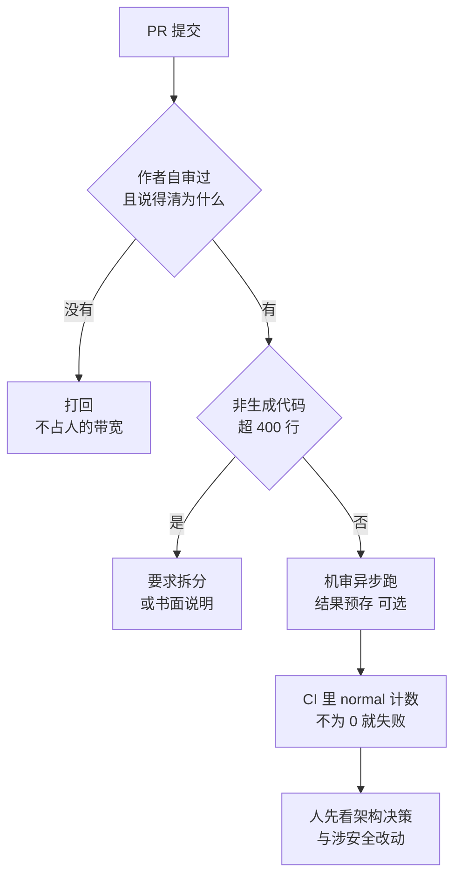

# 053. AI 生成的 PR 太大太多，review 机制怎么扛住不崩？

**一句话**：四件事叠加才扛得住 —— 从源头控住 PR 体积（非生成代码超 400 行就要说明为什么拆不开）、机审当第一道分流、按风险分层展开而不是平铺 diff、治理规则定死「作者先自审、说不清为什么就打回」。

## 30 秒结论

| 你看到的 | 立刻做 | 不想再犯 |
|---|---|---|
| 一个 PR 20+ 文件、1000+ 行 | 打回让作者按逻辑边界拆；非拆不可的先只审架构决策和涉安全部分 | `CLAUDE.md` 写死「一个 PR 只做一件事」，超 400 行要作者主动说明 |
| 最大那批 PR 的 review 时长不升反降 | 这就是 rubber stamp 的硬信号，立刻上体积上限 | 把「PR 行数 vs review 时长」做成看板指标，定期看 |
| reviewer 被 nit 刷屏，看不到真问题 | `REVIEW.md` 收窄 Important 定义 + 给 Nit 封顶 5 条 | 生成代码、lockfile 写进「不要 review」清单 |
| 机审账单按月翻倍 | 改成手动触发，或「PR 创建后只审一次」 | 「每次 push 后都审」按推送次数成倍计费 |
| PR 描述只写「改了什么」，作者说不出为什么这么改 | 直接打回，不占 reviewer 带宽 | 治理规则写明：解释不了就关掉 |
| 开源仓被陌生人批量投喂 AI PR | 上「入口限流」那一层（见折叠块） | CONTRIBUTING.md 声明 + 可复现 PoC 门槛 + issue 前置确认 |



## 怎么做

四层叠加，从源头到门禁，按团队成熟度逐层往上加。第二层依赖托管 Code Review（Team / Enterprise 才有），是可选层，跳过不影响其余三层。

### 第一层：控住 PR 体积（生产者侧）

- **约定「一个 PR 只做一件事」。** AI 一次能改 20 个文件，不代表这些改动该塞进一个 PR。规则写进 `CLAUDE.md` 或团队规范，让它按逻辑边界拆成多个小 PR。
- **设一个软性体积上限。** 非生成代码超过 400 行就该拆。大 PR 不绝对禁止，但需要作者主动说明为什么拆不开。
- **生成代码和手写代码分开提交。** lockfile、迁移生成物、schema 生成代码单独一个 commit 或 PR，别混进逻辑改动里淹没 reviewer。这部分也正是机审该跳过的。
- **PR 描述必须写清意图。** 不只写「改了什么」，还要写「为什么这么改」。Kubernetes 的红线是：说不清一处改动为什么要做，PR 就会被关掉[^4]。

### 第二层（可选）：上 AI review 当第一道分流

先说清适用范围：托管 Code Review 只对 Team / Enterprise 订阅开放，本层关于它的做法（`REVIEW.md` 调参、`gh + jq` 严重度门禁、计费方式）**基于官方文档整理、本篇作者未实跑**，属于可选层不是必经层。没开这个服务就跳过，只留本层最后一条「提 PR 前本地 `/code-review` 自审」，第一、三、四层照样成立。

机制是一队专门的 agent 检查代码改动，找逻辑错误、安全漏洞、没考虑到的边界情况和隐蔽的回归问题，之后还有一个验证步骤拿候选问题去对照代码的真实行为、过滤误报。用它有三条纪律：

- **默认聚焦正确性，别当格式检查工具。** 官方明说它关注的是会搞坏生产的 bug，不是格式偏好或缺失的测试覆盖。格式交给 CI 的 linter。
- **先搞清成本模型再定触发频率。** 每次 review 平均 15–25 美元，「每次 push 后都审」会按推送次数成倍计费[^3]。高流量仓库用手动触发或「PR 创建后只审一次」。
- **人只看它标出来的和它够不到的。** 它产出的是信号，不是放行决定 —— 见「为什么」第 3 节。

**用 `REVIEW.md` 把它调成团队分流器。** Code Review 会读仓库根目录的 `REVIEW.md`，内容作为优先级最高的指令块逐字注入到 review 流水线每个 agent 的系统提示里[^3]。针对「PR 太大太多」最有用的三类调参：收窄 Important 定义、给 Nit 封顶、写「不要 review」清单。想让机审信号变成硬门禁，官方还给了在 CI 里按严重度计数拦截的口子。模板和命令见折叠块。

<details>
<summary>REVIEW.md 调参模板与 CI 门禁命令</summary>

```markdown
# Review instructions

## Important 的定义（收窄，别让人被噪音淹没）
只有会破坏行为、泄露数据、阻断回滚的才算 Important：
错误逻辑、未按租户 scope 的 DB 查询、日志里的 PII、不向后兼容的迁移。
风格、命名、重构建议最多算 Nit。

## 给 Nit 封顶（大 PR 的 nit 能刷屏）
每次 review 最多贴 5 条 Nit，多出来的在 summary 里写「另有 N 条同类」。

## 不要 review（把生成代码 / CI 已管的挡在外面）
- CI 已经管的：lint、格式、类型错
- 生成文件 src/gen/ 与所有 *.lock
- 机器生成的分支

## 收敛再次 review（防止一行小改被审到第七轮）
首次 review 之后，只报 Important，抑制新增 Nit。
```

`REVIEW.md` 是逐字粘贴的，不会展开 `@import`，规则要直接写进去。它和 `CLAUDE.md` 的区别：违反 `CLAUDE.md` 只会被标成 nit 级，`REVIEW.md` 则是 review 专用、优先级最高。

**想让机审信号变成硬门禁，自己在 CI 里加。** 官方给了用 `gh` 加 `jq` 解析严重度的口子：

```bash
gh api repos/OWNER/REPO/check-runs/CHECK_RUN_ID \
  --jq '.output.text | split("bughunter-severity: ")[1] | split(" -->")[0] | fromjson'
# 返回如 {"normal": 2, "nit": 1, "pre_existing": 0}
# normal 是 Important 计数，非 0 = 有该修的 bug
```

CI 里判 `normal != 0` 就让流水线失败。注意这是**你**在给它加门禁，不是机审自己拦截，仍然符合「决定权在人和流程」的边界。

</details>

**提 PR 前先本地自审。** 不装 GitHub App 也能审：任意 Claude Code 会话里跑 `/code-review`，默认审「本分支领先 upstream 的提交」加「未提交的改动」，加 `--fix` 会直接把修复应用到工作区。这正好落地了 K8s 那条「先自己 verify 再提 PR」。

### 第三层：重构 review 流程本身

- **保留代码结构，别把 diff 当一整块平铺文本。** Salesforce 的做法是在分析时保留文件、函数、模块这些结构边界[^1]。
- **逐步展开，按风险分层。** 让 reviewer 分批拿到上下文，优先暴露架构决策、涉及安全的改动和高风险区域。人先看那高风险的 10%，而不是从第 1 行平铺看到第 1000 行。
- **异步跑，结果预存。** Salesforce 实测大 PR 的完整分析最多要跑五分钟，等不起，所以让它在 PR 创建时就异步跑完、结果存下来，人来看时秒出[^1]。Cloudflare 是同样思路、规模更大：5169 个仓库的 48095 个合并请求上跑了 131246 次 review，中位耗时 3 分 39 秒；人工「破窗」（绕过机审强行处理）只有 288 次，占合并请求数的 0.6%[^6]。

### 第四层：定治理规则

- **第一遍 review 不许甩给 reviewer。** 提 PR 之前作者自己先验证过（code review、测试），拿出证据才配占用别人的带宽[^4]。
- **要求声明 AI 的使用。** K8s 允许用 AI 帮忙写 PR，但必须在描述里说明，且作者要对每一处改动负责、理解每一处改动。
- **要求人亲自回 review 意见。** K8s 规定回复 review 意见不能依赖 AI 工具，不直接和 reviewer 交流的 PR 会被关掉 —— 防止讨论环节退化成 AI 对 AI。
- **把责任归属写死在流程里。** 担责的永远是提 PR 的人，机审结论是 neutral、不拦截。这条和 [#040](../05-质量保证/040-怎么验证AI代码是真的对.md) 的底线一致。

<details>
<summary>如果你维护的是开源项目：还要多一层「入口限流」</summary>

上面四层默认贡献者是同事，来源可控。开源没这个前提，要在最前面再加一道入口限流。按代价从低到高：

1. **先写清收不收 AI 贡献。** 在 `CONTRIBUTING.md` 里写明是否接受 AI 生成的 PR、要不要声明、作者要不要能解释每一处改动。成本最低，但别指望它挡住恶意提交 —— curl 加了声明勾选框，效果为零。
2. **给赏金和悬赏类入口设门槛。** 假漏洞报告的成本几乎为零，验证成本全落在维护者头上。可行的中间态是只接受能复现的 PoC（proof of concept，可运行的复现代码），跑不起来就不进人工队列。
3. **要求 PR 先关联已确认的 issue。** 先让 issue 过一遍人工确认再允许提 PR，能掐掉「AI 生成 issue、AI 又拿它生成 PR」的自动循环。
4. **实在扛不住就暂停外部 PR。** tldraw 自动关闭全部外部 PR，Ghostty 对未经邀请的 AI 提交永久封禁。这两条都是止血手段，代价是同时挡掉真实贡献者，只在维护者已经被淹没时才用，并且要写明是临时措施。

企业团队照抄这层通常没必要：内部提交量受工位约束，加了只会增加摩擦。

</details>

## 为什么

### 1. 瓶颈从「写」搬到了「审」，而最危险的信号是审得更快了

传统 review 有个隐含前提：代码产出速度和人审速度大致匹配。AI 把「写」加速了几倍，「审」还是靠人的眼睛和脑子，供需一下失衡。

Salesforce 工程团队量化了这个失衡：引入 AI 编码后代码量增加约 30%，单个 PR 经常膨胀到超过 20 个文件、1000 行改动，review 排队时间逐季度上升[^1]。

但最扎心的发现不是排队变长，而是**最大那批 PR 的 review 时长开始见顶、甚至下降**。PR 越大本该审得越久，结果反过来了 —— Salesforce 的解读是 reviewer 已不再真正参与：彻底审完的代价超过感知收益时，人就默认走表面验证、没看懂也 approve[^1]。这就是 [#040](../05-质量保证/040-怎么验证AI代码是真的对.md) 里说的 rubber stamp（橡皮图章，审查只走形式不真看内容）。

这条也是本篇唯一可量化的预警指标：把 PR 行数和 review 时长两条曲线放一起看，后者不随前者上升，人审这层就已经塌了。

### 2. 「多加一个 AI reviewer」不能单独解决，因为它天生不是门禁

官方对 Claude Code Review 的定位很明确：发现的问题按严重度打标签，但既不批准也不拦截 PR；检查始终以 neutral（中性）结论结束，所以它永远不会通过分支保护规则挡住合并[^2]。

Cloudflare 把话说得更直白：这不是人工 review 的替代品，至少以今天的模型还不是[^6]。

所以 AI review 是分流器，不是守门员。它帮人省掉一部分明显问题，最终担责的仍是人 —— 想要硬门禁，得自己在 CI 里按严重度计数拦（见「怎么做」第二层）。

### 3. 开源侧是同一个病，只是先撞墙

开源维护者面对的是陌生人批量投喂的 AI PR 和 issue，提交量增长不受任何成本约束。对企业团队的意义不是围观：**当提交量增长不受成本约束时，评审侧一定会先崩** —— 内部还撑得住，只是因为工位和绩效构成了天然的提交限流。

<details>
<summary>开源侧到底崩成什么样（curl / tldraw / Ghostty 的具体处置）</summary>

- **curl**：收到一份 AI 生成的假漏洞报告后改了文档，要求贡献者声明是否用了 AI 工具。到 2026 年初这条路走到尽头 —— 关掉了跑了六年、累计发出 8.6 万美元的漏洞赏金计划。给出的数据是：2025 年中期约 20% 的提交是 AI 垃圾，全年只有 5% 的提交真的指出了漏洞；2026 年 1 月更是在 16 小时内涌进 7 份提交，里面有真 bug，但没有一个是真漏洞。Daniel Stenberg 早在 2025 年 5 月就加了「是否使用 AI」的勾选框，没起作用[^5]。
- **tldraw**：创始人 Steve Ruiz 宣布自动关闭全部外部 PR，等到「GitHub 提供更好的贡献管理工具」为止。他点出了一个循环——自己用 AI 脚本生成的低质量 issue，被贡献者喂给他们自己的 AI，变成低质量 PR，两头的活都是 AI 干的[^5]。
- **Ghostty**：2026 年 1 月底立零容忍规则，未经邀请提交 AI 生成内容的人永久封禁[^5]。
- **更早的信号**：开发者 Andi McClure 把这类贡献称为「既浪费我的时间，又违反了我项目的行为准则」，并预言过滤 AI 生成的 issue 和 PR 会成为维护者额外的负担。Flux 维护者 Stefan Prodan 的概括是：AI 垃圾正在 DDoS 开源维护者，而托管开源项目的平台没有动力去阻止。

</details>

## 别这么干

- ❌ **只上 AI review，以为人就能撒手。** 机审 neutral、不拦截，连 Cloudflare 都说它不是人审的替代品。分流器当守门员用，等于换个马甲的橡皮图章。
- ❌ **放任 20 文件 / 1000 行的巨型 PR。** 最大的 PR review 时长不升反降，说明没人真在审。不控体积，加多少工具都白搭。
- ❌ **把机审当格式检查工具用，或每次 push 都触发全量机审。** 它聚焦正确性、不管格式，格式让 linter 管；而「每次 push 都审」按推送次数成倍计费，高流量仓库会烧穿预算。
- ❌ **把 AI 改动的第一遍 review 甩给 reviewer，或让 AI 代替自己回 review 意见。** K8s 两条都明令禁止：前者是把认知负担转嫁给别人，后者让讨论环节退化成 AI 对 AI。
- ❌ **把开源那套入口限流原样搬进公司内网，或照搬 K8s 全套禁令。** 暂停外部 PR、永久封禁针对的是不受成本约束的陌生投稿；K8s 也没一刀切禁 AI PR，它禁的是大型 AI 生成 PR、AI 写的 commit message、AI 代回意见。治理强度要分场景，政策怎么定见 [#074](../08-团队与组织/074-团队AI-coding规范怎么立.md)。

<details>
<summary>换成 Cursor Bugbot / Copilot review 呢</summary>

| 工具 / 方案 | 定位 | 是否拦截 PR | 关键差异 |
|---|---|---|---|
| **Claude Code Review** | 多 agent 机审，含误报过滤 | 否（neutral，可靠 CI 自定义门禁） | 原生多 agent、`REVIEW.md` 高优先级调参、15–25 美元/次 |
| **Cursor Bugbot** | 以单 agent 为主的 PR 机审 | 否 | 同属机审信号，agent 编排较轻 |
| **GitHub Copilot review** | 平台内建的 PR review | 否 | 与 GitHub 深度集成，定制和跳过规则较弱 |
| **Cloudflare 自建（GitLab CI）** | 内部 AI reviewer 组件 | 否（靠人工「破窗」兜底） | 自托管、规模化验证过（4.8 万 MR）、明确「非人审替代品」 |

共性很清楚：主流 AI review 都刻意不拦截 PR。因为它们都知道机审会漏、也会误报，最终判断权必须留在人和流程手里。差异在于编排方式（单 agent 还是多 agent）、调参能力（有没有 `REVIEW.md` 这类机制）以及是否自托管。更深入的机审工具对比见 [#041](../05-质量保证/041-怎么审查AI生成的代码.md)。

</details>

## 延伸

**相关文章**

- [#040 AI 说"做完了"、测试也全绿，怎么知道代码是真的对？](../05-质量保证/040-怎么验证AI代码是真的对.md) —— 本篇的「人审塌成橡皮图章」「担责在人」承接自它的验证体系框架
- [#041 怎么 review AI 生成的代码？（人审 + 机审策略）](../05-质量保证/041-怎么审查AI生成的代码.md) —— 本篇讲团队级 review 治理，041 讲个人审代码的技巧和机审工具细比
- [#052 怎么不让 AI 把 git 仓库搞乱？](./052-别让AI搞乱git仓库.md) —— PR 怎么开、commit 怎么写在 052；本篇专讲 PR 开出来之后的 review 门
- [#074 团队的 AI coding 规范怎么立？哪些该强制、哪些该自由？](../08-团队与组织/074-团队AI-coding规范怎么立.md) —— 本篇「第四层治理规则」的组织级落地

**参考资料**

- [Code Review — Claude Code Docs](https://code.claude.com/docs/en/code-review) —— 支撑机审机制、neutral 不拦截、`REVIEW.md` 逐字注入与调参、`gh + jq` 严重度门禁、15–25 美元/次定价与按推送计费（官方，2026-06）
- [Scaling Code Reviews — Salesforce Engineering](https://engineering.salesforce.com/scaling-code-reviews-adapting-to-a-surge-in-ai-generated-code/) —— 支撑「代码量 +30%」「20 文件 / 1000 行」「最大 PR review 时长见顶」三个数字，以及保留结构 / 逐步展开 / 异步预存三条流程做法（实践，2026）
- [Orchestrating AI Code Review at scale — Cloudflare](https://blog.cloudflare.com/ai-code-review/) —— 支撑「机审不是人审替代品」与规模化数字（4.8 万 MR、中位 3 分 39 秒、破窗占 MR 数 0.6%）（实践，2026）
- [Pull Request Process — kubernetes.dev](https://www.kubernetes.dev/docs/guide/pull-requests/) —— 支撑第四层全部治理规则：禁大型 AI PR、第一遍 review 不许甩锅、必须声明、必须人亲自回复、说不清为什么就关掉（官方政策，2026）
- [AI Slopageddon and the OSS Maintainers — RedMonk](https://redmonk.com/kholterhoff/2026/02/03/ai-slopageddon-and-the-oss-maintainers/) —— 支撑折叠块里 curl / tldraw / Ghostty / Stefan Prodan 的全部事实（社区，2026-02）
- [OSS maintainers demand ability to block Copilot-generated PRs — Socket](https://socket.dev/blog/oss-maintainers-demand-ability-to-block-copilot-generated-issues-and-prs) —— 支撑「更早的信号」：Andi McClure 的表态与 curl 早期的 AI 声明要求（社区，2025-05）

[^1]: [Scaling Code Reviews — Salesforce Engineering](https://engineering.salesforce.com/scaling-code-reviews-adapting-to-a-surge-in-ai-generated-code/)（实践，2026）：引入 AI 后代码量增加约 30%，单个 PR 常超 20 文件 / 1000 行；最大那批 PR 的 review 时间开始见顶甚至下降，原文解读为 reviewer 已不再真正参与（彻底审的代价超过感知收益时，默认走表面验证或未理解即批准）；大 PR 的完整语义分析最多要跑五分钟，故在 PR 创建时异步执行、结果预存。
[^2]: [Code Review — Claude Code Docs](https://code.claude.com/docs/en/code-review)（官方，2026-06）：发现的问题按严重度打标签，既不批准也不拦截 PR；检查始终以 neutral 结论结束，因此不会通过分支保护规则挡住合并。
[^3]: 同上：`REVIEW.md` 的内容作为优先级最高的指令块逐字注入 review 流水线里每个 agent 的系统提示；每次 review 平均 15–25 美元，「每次 push 后都审」按推送次数计费。
[^4]: [Pull Request Process — kubernetes.dev](https://www.kubernetes.dev/docs/guide/pull-requests/)（官方政策，2026）：不要把 AI 生成改动的第一遍 review 留给 reviewer；作者须理解每一处改动；解释不了改动为什么这么做，PR 会被关掉。
[^5]: [AI Slopageddon and the OSS Maintainers — RedMonk](https://redmonk.com/kholterhoff/2026/02/03/ai-slopageddon-and-the-oss-maintainers/)（社区，2026-02）：curl 关停六年、累计 8.6 万美元的赏金计划及其比例数据，tldraw 自动关闭外部 PR，Ghostty 永久封禁，「AI 垃圾正在 DDoS 开源维护者」。
[^6]: [Orchestrating AI Code Review at scale — Cloudflare](https://blog.cloudflare.com/ai-code-review/)（实践，2026）：5169 个仓库、48095 个合并请求、131246 次 review，中位耗时 3 分 39 秒；人工破窗 288 次，占合并请求数的 0.6%；并明确「这不是人工 review 的替代品，至少以今天的模型还不是」。

---

<sub>难度 中级 · 流程题 + 治理 · 主线 Claude Code，横向 Cursor / Copilot</sub>

<sub>**时效**：定价与机制事实（机审 15–25 美元/次、三种触发模式的计费方式、结论为 neutral 不拦截、`REVIEW.md` 逐字注入且优先级最高且不展开 `@import`、违反 `CLAUDE.md` 只标 nit 级、`gh + jq` 解析严重度）已于 2026-08-15 对照官方 code-review 文档逐条核实；Salesforce 数字（+30%、20 文件 / 1000 行、review 时长见顶、分析最长五分钟）、Cloudflare 数字（5169 仓库 / 48095 MR / 131246 次 review / 中位 3 分 39 秒 / 破窗 288 次占 MR 数 0.6%）、K8s 五条治理规则（含「禁大型 AI 生成 PR」为原文明文）、开源侧事实（curl 赏金关停的年限 / 金额 / 比例、2026-01 的 16 小时 7 份提交、tldraw、Ghostty、Stefan Prodan 引述）均于 2026-08-15 对照各原文核实。**已知不确定**：「非生成代码超 400 行就拆」是本篇给的可操作阈值，不是任何一方的官方数字；第二层涉及托管 Code Review 的全部做法（`REVIEW.md` 调参、`gh + jq` 严重度门禁、触发频率与计费）**基于官方文档整理、本篇作者未实跑**，已按可选层标注；tldraw 的暂停与 Ghostty 的封禁规则均以 RedMonk 2026-02 报道为准，当前是否仍生效未再核实，需自行确认。**易变**：Claude Code Review 截至 2026-08-15 仍为 research preview（面向 Team / Enterprise 订阅，Zero Data Retention 组织不可用），定价和形态可能随正式发布调整。</sub>

> 本篇个人实践（L4）：`[待补：BOSS 的实战经验/踩坑]`
