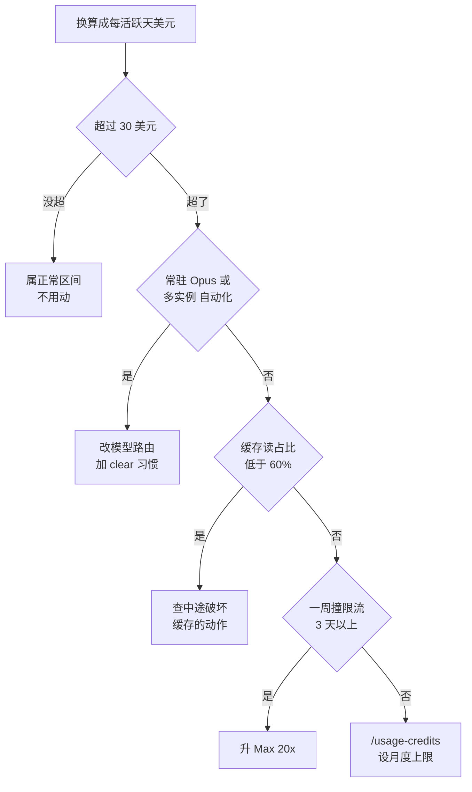

# 060. 额度怎么突然就没了？20x Max 也撑不过一上午——先算清自己一天该烧多少

**一句话**：别盯 token 数，把消耗换算成「每活跃天多少美元」，对齐官方基准 $13（平均）和 $30（90 分位）[^1]；超标了先查是不是常驻 Opus、从不 `/clear`、派了 agent team，最后才考虑升档。

## 30 秒结论

| 你看到的 | 立刻做 | 不想再犯 |
|---|---|---|
| 额度进度条一上午就见底 | `/usage` 按 `w` 看 7 天，先定位是 skill / subagent / MCP 谁在吃 | 无关任务之间 `/clear` |
| 账单数字看着不对劲 | 用 Console 账单换算每活跃天美元，对齐 $13 / $30 | 默认模型设 Sonnet，别常驻 Opus |
| `ccusage daily` 某天比 7 日中位高 2 倍以上 | 查那天是不是派了 agent team 或挂了 Opus | agent team 约 7 倍 token，收敛队伍规模[^2] |
| cache read 占输入 token 不到 60% | 查会话中途有没有连 / 断 MCP、切模型、改 CLAUDE.md | 这些动作全放在会话开始前做 |
| 一周里 3 天以上被限流打断且影响交付 | 才考虑升 Max 20x | 偶发峰值用 `/usage-credits` 设上限兜底 |

表中 $13 / $30 是官方基准；「60%」「2 次」「3 天」「高 2 倍」这类触发线是本库经验值，非官方标准，其中 60% 是由单个社区个例的 88.8% 反推的保守线[^3]。

## 怎么做

### 第 1 步：量出自己的「每活跃天美元」

三层工具，按你要看的时间跨度选。**会话内即时看：`/usage`。** 顶部 Session 块给本会话的 token 明细和估算美元；订阅用户还能看到额度进度条、活动统计，以及按 skills / subagents / MCP server 拆分的用量归因。按 `d` 或 `w` 切近 24 小时和近 7 天。归因指向某个 MCP server 时，怎么判断该留该关见 [#006 装了一堆 MCP 之后卡顿、上下文被吃掉，到底该留哪些？](../01-心智与工具/006-MCP装哪些不装哪些.md)。两个坑：数据只来自本机会话历史，其他设备和 claude.ai 上的用量不算；`/clear` 开新会话后总额归零。

**跨会话复盘：ccusage（社区工具）。** 官方 Console 不给订阅用户看逐 token 明细，ccusage 读本地日志、不上传数据，`npx ccusage@latest` 就能跑。支持 `daily`、`weekly`、`monthly`、`session`、`blocks`（5 小时窗口）视图，`ccusage blocks --live` 是实时仪表盘。建议每周跑一次 `ccusage daily`。

**权威账单：Console。** API 用户看 [Usage 页](https://platform.claude.com/usage)，这是唯一权威值。企业看组织分析的支出报告（按用户或模型拆分、导出 CSV、每日更新）或 Enterprise Analytics API。

**怎么拿到能对标的数**：API 用户以 Console Usage 页的账单为准，除以活跃天数（`ccusage daily` 输出的行数就是实际写代码的天数，不是自然日数），才是「每活跃天美元」。订阅用户拿不到权威美元数——Console 不给订阅侧看明细——所以跳过对金额，直接用第 2 步的限流频率行判断；ccusage 的美元数只当趋势和下限看。

**一条必须知道的口径限制**：ccusage 这类工具读的是本地 `~/.claude` 下的 jsonl 会话日志，社区实测这份日志的 input 字段大量被记成 0 或 1（可差两个数量级）、output 字段漏记 thinking token（Opus 上可差 10 倍以上），只有 cache 两列基本准确[^6]。所以 ccusage 的美元数是系统性低估，能用的是趋势——同一台机器上「这周比上周高多少」有意义；绝对值以 Console 为准。

### 第 2 步：对着基准判断正不正常，逐条对一遍

- [ ] API 用户：Console 账单换算的每活跃天美元落在 $30 以内 —— 超了走第 3 步。订阅用户改看限流频率：一周撞 5 小时窗口上限不超过 2 次算正常（本库经验值）。
- [ ] `ccusage` 的 cache read 占总输入 token 60% 以上 —— 社区实测重度用户能到 88.8%[^3]，低于 60% 说明缓存频繁失效，是漏钱点，怎么治见 [#061 怎么少烧 token](./061-怎么少烧token.md)。
- [ ] 别拿撞额度顶当超支（5 小时和周窗口是限速不是扣费）；也别拿 30 天乘 $13 —— 基准单位是「活跃天」，要月度数字直接用官方的 $150–250。

各场景的正常量级参考表

| 你的场景 | 正常量级参考 |
|---|---|
| 个人订阅 Pro/Max，日常写代码 | 一周内撞 5 小时窗口上限不超过 2 次；换算成 API 约 $13/活跃天档 |
| API 按量，单人重度使用 | $13/天是官方平均值，$30/天已是 90 分位；月 $150–250 |
| 常驻 Opus + 多实例 + 自动化 | 会明显超过 $30/天，属高消耗一侧，正常但可优化 |
| 企业/团队人均 | 先小范围试点测基线，再拿 $150–250/人·月做预算[^1] |

### 第 3 步：超标了，按这个顺序排查成因

1. **默认模型是不是 Opus。** 官方把「Opus 被留作默认模型」和「长会话从不清理」并列为账单失控的两大成因[^2]。改成 Sonnet 默认，选型见 [#062 什么时候该用 Opus、什么时候用 Sonnet/Haiku](./062-什么时候用Opus什么时候用Sonnet.md)。
2. **有没有跨任务不 `/clear`。** 陈旧上下文在之后每条消息上都要重新计费一遍。
3. **那天是不是派了 agent team。** plan 模式下的 agent teams 大约用 7 倍 token，因为每个队友有独立上下文[^2]。「烧得快」如果正好发生在派了多个 agent 之后，成因就是它。并行开几个见 [#032 SubAgent 并行开几个](../04-执行工作流/032-SubAgent并行开几个.md)。
4. **缓存命中率是不是掉了。** ccusage 分列 cache read 和 cache write，read 占比掉下来通常是中途连/断 MCP、切模型、改 CLAUDE.md 造成的。
5. **shell 环境里有没有 `ANTHROPIC_API_KEY`。** 这一条的症状是反的：订阅额度怎么都用不完，账单却在涨。环境变量里的 API key 优先级高于订阅凭据，一经批准这个会话就整体走按量计费，跑起来看不出任何区别 —— 常见触发场景是为了调自己 app 的接口把 key 写进了 `.zshrc`，然后另一个终端里的 Claude Code 会话就被顺手切走了。**怎么确认**：`/status` 里出现 `API key` 行（正常订阅只有 `Login method` 行）。**怎么恢复**：`unset ANTHROPIC_API_KEY`，或在 `/config` 里关掉 "Use custom API key" 开关[^7]。

不用查的一项：Claude Code 空闲时也有后台 token（生成会话摘要、查询 `/usage` 状态等），但官方给的量级是每个会话通常不到 $0.04，可以忽略。

### 第 4 步：真的不够用，再谈升档

先把日均乘以月活跃天数，得到「同样的活儿走 API 要花多少钱」（下称 API 等价月消耗）。拿这个数定档只有两条金额线，再往上就不看金额了（Pro $20/月、Max 5x $100/月、Max 20x $200/月）：

- API 等价超过约 $20/月 → Pro 回本；超过约 $100/月 → Max 5x 回本。
- 再往上 → **仍然停在 Max 5x**。订阅档位买的是限流额度，不是消费额度。API 等价 $260/月的人在 Max 5x 上已经净省 $160，升到 Max 20x 并不会更划算。

**本库的判断标准：升 Max 20x 只看是否持续撞限流，不看金额**（从「订阅买的是限流额度」推出，非官方标准）：用 `/usage` 看限额条，一周里 3 天以上被 5 小时窗口或周窗口打断、且影响了交付，才算「持续」。一周只撞一两次不算。

偶发峰值怎么兜底：/usage-credits 的开启步骤和两个副作用

`/usage-credits` 让你用完订阅额度后按标准 API 价继续跑，并且能设月度上限。

1. 确认自己是 `/login` 的订阅凭据登录（用 API key 认证时该命令不可用）。
2. 会话里敲 `/usage-credits`，跳到网页 Settings → Usage。
3. 在 Usage credits 区域点 Enable，绑支付方式。
4. **先用 Adjust limit 把月度上限设死**（里面有个 "Set to unlimited"，别选）。
5. 最后 Add funds。

**怎么确认生效**：网页 Settings → Usage 里出现余额和月度上限两个数字；撞到 spend limit 时 Claude Code 会直接在 CLI 里提示你抬高或移除上限。

两个副作用：超出部分按标准 API 价计费，没有折扣；而且一旦动用 usage credits，prompt cache 有效期会从订阅的 1 小时降到 5 分钟[^4]。间隔稍长的下一次提问更容易缓存未命中、重新处理整段上下文，单价和用量同时上升。官方给了逃生阀：设环境变量 `ENABLE_PROMPT_CACHING_1H=1` 可在动用 usage credits 时保住 1 小时缓存[^4]。即便如此，它也只适合扛偶发峰值，不适合当常态。

## 为什么

### 官方给了明确基准，别拿社区极端值吓自己

在企业部署里，平均每个开发者每个活跃天约 $13、每月 $150–250，且 90% 的用户每个活跃天低于 $30[^1]。把这三个数当标尺：平均 $13/天，90 分位 $30/天，月账单 $150–250 是常态。注意「活跃天」这个词——不写代码的那天不算，所以别拿 30 天去乘 $13。官方同时强调人均成本会因模型选择、代码库大小、使用方式（多实例、自动化）而差别很大：跑多实例、开自动化、默认挂 Opus 都会把你推到分布的高消耗一侧，这不是故障，是使用模式决定的。

### 「一天多少 token」没有标准答案，钱由单价和缓存决定

同样的 token 数，花的钱可以差一个数量级，两个原因。**第一，模型单价差 5 倍。**

| 模型 | 输入 $/1M | 输出 $/1M |
|---|---|---|
| Claude Fable 5 | $10.00 | $50.00 |
| Claude Opus 5 / 4.8 | $5.00 | $25.00 |
| Claude Sonnet 5 | $2.00 | $10.00 |
| Claude Sonnet 4.6 | $3.00 | $15.00 |
| Claude Haiku 4.5 | $1.00 | $5.00 |

同样 100 万输出 token，Fable 花 $50，Haiku 只花 $5。所以「今天烧了多少 token」和「花了多少钱」之间隔着一层模型选择。

**别拿单价直接算省了多少。** Claude 4.7 及之后的模型换了新的分词器（把文本切成 token 的规则），同样一段文字会切出约 30% 更多的 token，具体幅度看内容[^8]。所以 Sonnet 5 单价比 Sonnet 4.6 低 33%（$3 → $2），同一个请求的实际花费并不会同比例下降。跨模型比成本时，用实测的账单数字，别拿旧的 token 估算套新单价。

**第二，绝大多数 token 是缓存命中，只花 0.1 倍价。** prompt caching 指把系统提示词这类每轮重发的内容缓存起来复用，Claude Code 默认就开着。计价规则：写入缓存花 1.25 倍（5 分钟有效期）或 2.0 倍（1 小时有效期），读取只花 0.1 倍输入价。社区实测的重度用户缓存命中率能到 88.8%[^3] —— 近九成 token 走 0.1 倍价，这就是「海量 token」不等于「海量账单」的原因。所以盯 token 绝对数会误判，要盯的是每日美元（对齐 $13 / $30）和缓存命中率（低了就是在漏钱）。

### `/usage` 里的美元是估算，订阅制根本不按它计费

官方明说：那个美元数是本地根据 token 数估算的，可能和实际账单有出入，权威账单在 Claude Console 的 Usage 页[^5]。订阅制（Pro/Max）更进一步：用量已包含在订阅里，会话成本数字和计费完全无关，订阅用户该看的是同一屏上的额度进度条、活动统计和用量拆分[^5]。

所以分两种人：API / Console 用户以 Console 账单为准，`/usage` 只是本地估算；订阅用户把那个美元数当成「如果按 API 算会是多少」的参考，真正的判断依据是额度进度条撞不撞顶。

## 别这么干

- ❌ **拿「一天多少 token」当正常性标准。** 单价按模型差 5 倍，且大部分 token 走 0.1 倍缓存价，绝对数说明不了钱。盯每日美元和缓存命中率。
- ❌ **把 `/usage` 的美元数当账单。** 官方明说是估算；订阅用户那个数更是不用于计费。权威值在 Console。
- ❌ **用 30 天乘 $13 估月账单。** 基准单位是「每活跃天」。要月度数字直接用官方的 $150–250 区间。
- ❌ **默认挂 Opus、从不 `/clear` 还嫌贵。** 官方点名这两个是高消耗最常见成因。这不是工具贵，是使用模式问题。
- ❌ **按金额一路升档到 Max 20x。** 「API 等价 $260 > $200 所以该上 20x」是错的。订阅档位是限流额度不是消费额度，本库的标准是只有一周 3 天以上被限流打断才升 20x。

换成 Cursor / Copilot 呢

| 工具 | 计费模型 | 成本可见性 | 关键差异 |
|---|---|---|---|
| **Claude Code** | 订阅（Pro/Max 额度）或 API 按 token | `/usage`（会话估算）+ Console（权威）+ ccusage（本地历史） | token 计价透明、缓存自动、官方给了 $13/$30 基准；单 token 相对贵但缓存命中率高 |
| **Cursor** | 订阅（含额度）+ 超额按请求/token | 应用内 usage 面板 | 订阅打包，超额才计量；模型混用，成本归因不如逐 token 透明 |
| **GitHub Copilot** | 固定月费（座席）+ premium requests 配额 | 组织后台按座席/请求 | 以座席制为主，成本可预测但和 token 量脱钩，难以按用量精算 |

三点观察：

- Claude Code 是三者里 token 级成本最透明的，能拆到 skill 或 subagent 级别。代价是社区常说的「单 token 更贵」，但这个印象忽略了缓存命中率。
- 座席制工具（Copilot）成本可预测，但你几乎无法回答「这个任务花了多少钱」。
- Cursor 居中：有额度面板，但成本归因粒度不到子任务级。

那些吓人的账单数字该怎么看（社区个例，别当基准）

社区流传的 $80K/月、$47K 单次事件账单，都是未经核实的个例，不要当自己的预期。

一个相对可查的个例：HN 上一位作者复盘完整 CSV 账单，70 天共 $928.45，平均每个请求 83,371 tokens、缓存命中率 88.8%、单日均值 $13.86，按月推算约 $416[^3]。同一帖标题写的是「6 周 $638」，两组数字不冲突，只是统计区间不同（6 周 vs 70 天），本篇引用的是 70 天那组。

注意两点口径：一是 $13.86 是按活跃天算的（$928.45 ÷ $13.86 ≈ 67 天，少于 70 个自然日）；二是那个「按月约 $416」是用 30 天乘出来的，和「按活跃天计」的口径不一致，看看就好，别拿它当月预算。

## 延伸

**相关文章**

- [#061 怎么少烧 token？prompt caching / 精简 CLAUDE.md / 模型切换哪个最有效？](./061-怎么少烧token.md) —— 本篇教怎么测，061 教怎么降
- [#062 什么时候该用 Opus、什么时候该用 Sonnet/Haiku？](./062-什么时候用Opus什么时候用Sonnet.md) —— 模型单价差 5 倍，路由是成本的主变量
- [#032 开几个 agent 并行跑，结果互相踩、被限流、token 指数级炸开](../04-执行工作流/032-SubAgent并行开几个.md) —— agent teams 约 7 倍 token，是本篇成本视角的执行侧决策
- [#012 上下文窗口要爆了怎么办？](../02-上下文工程/012-上下文窗口要爆了.md) —— 上下文膨胀是成本的根因之一
- [#006 装了一堆 MCP 之后卡顿、上下文被吃掉，到底该留哪些？](../01-心智与工具/006-MCP装哪些不装哪些.md) —— `/usage` 归因到 MCP、cache read 掉了之后怎么裁
- [#074 团队的 AI coding 规范怎么立？](../08-团队与组织/074-团队AI-coding规范怎么立.md) —— 个人测出的量级怎么变成团队预算和用量约定

**参考资料**

- [Manage costs effectively — Claude Code Docs](https://code.claude.com/docs/en/costs) —— 本篇的 $13/活跃天、$150–250/月、90% 低于 $30/天三个基准，以及 `/usage` 估算警告、订阅额度语义、agent teams 约 7 倍、后台低于 $0.04（官方，2026-08-15 核实）
- [Anthropic 定价](https://claude.com/pricing) / [API 定价文档](https://platform.claude.com/docs/en/about-claude/pricing) —— 支撑「模型单价差 5 倍」与缓存倍率：Opus 4.8 $5/$25、Sonnet 5 $2/$10、Sonnet 4.6 $3/$15、Haiku 4.5 $1/$5，缓存写入 1.25 倍（5 分钟）或 2.0 倍（1 小时）、读取 0.1 倍（官方，2026-08-15 核实；订阅价 Pro $20 / Max 5x $100 / Max 20x $200）
- [I spent $638 on AI coding agents in 6 weeks — HN 45914307](https://news.ycombinator.com/item?id=45914307) —— 支撑「缓存命中率可以很高」这一论断的社区个例：70 天 $928.45、83,371 tokens/请求、命中率 88.8%、日均 $13.86（社区，2025-11，个例）
- [Extra usage for paid Claude plans — Claude 帮助中心](https://support.claude.com/en/articles/12429409-extra-usage-for-paid-claude-plans) —— 支撑第 4 步的 usage credits 开启路径与月度上限设置（官方，2026-08-15 核实）
- [ccusage](https://ccusage.com/) / [github.com/ryoppippi/ccusage](https://github.com/ryoppippi/ccusage) —— 支撑第 1 步「跨会话复盘」的工具，订阅用户查逐 token 明细的社区首选（社区）
- [ccusage issue #866](https://github.com/ryoppippi/ccusage/issues/866) / [issue #705](https://github.com/ryoppippi/ccusage/issues/705) —— 支撑「本地 jsonl 的 input/output 字段不可靠、ccusage 系统性低估」这条口径限制（社区实测，2026-08-15 核实）

[^1]: [Manage costs effectively — Claude Code Docs](https://code.claude.com/docs/en/costs)（官方，2026-08-15 核实）：企业部署平均（average）每开发者每活跃天约 $13、每月 $150–250，90% 的用户每活跃天低于 $30；团队先小范围试点建立基线再推广。
[^2]: 同上：账单意外飙高通常源于长会话从不清理，或 Opus 被留作默认模型；agent teams 在 plan 模式下大约用 7 倍 token。
[^3]: [HN 45914307](https://news.ycombinator.com/item?id=45914307)（社区，2025-11，单人个例）：70 天完整账单复盘，缓存命中率 88.8%。个例，不是官方基准。
[^4]: [Manage costs effectively — Claude Code Docs](https://code.claude.com/docs/en/costs)（官方，2026-08-15 核实）：缓存有效期在订阅下是 1 小时，动用 usage credits 后降为 5 分钟；同页给出设 `ENABLE_PROMPT_CACHING_1H=1` 可保住 1 小时有效期。
[^5]: 同上：`/usage` 的美元是本地按 token 估算、可能与实际账单不同；Max/Pro 订阅用户的会话成本数字与计费无关。
[^6]: [ccusage issue #866](https://github.com/ryoppippi/ccusage/issues/866)、[issue #705](https://github.com/ryoppippi/ccusage/issues/705)（社区实测，2026-08-15 核实）：jsonl 日志的 input_tokens 大量被写成流式早期的占位值 0 或 1（实测可差 100 倍以上，约 2 个数量级），output_tokens 漏记 thinking 与工具 token（Opus 上实测差 10–17 倍），cache read / cache write 两列与真实值基本一致。结论是 ccusage 的美元数系统性偏低、只能看趋势。未见官方对该偏差的确证说明。
[^7]: [CC Docs: Authentication — Authentication precedence](https://code.claude.com/docs/en/iam)（官方，2026-08-13 访问）原文：「If you have an active Claude subscription but also have `ANTHROPIC_API_KEY` set in your environment, the API key takes precedence once approved.… Run `unset ANTHROPIC_API_KEY` to fall back to your subscription, and check `/status` to confirm which method is active.」交互模式下这个批准只问一次并被记住，之后不再提示；非交互模式（`-p`）下只要 key 存在就一律使用，不问。社区侧有对应的踩坑记录（r/ClaudeAI，2026-08-03，699 赞）：作者的 $200/月订阅会话被静默切到按量计费，靠预设的消费告警才在 $20 时发现 —— 该个例未经官方确证，但与上述官方优先级规则一致。
[^8]: [Pricing — Claude Platform Docs](https://platform.claude.com/docs/en/about-claude/pricing)（官方，2026-08-15 核实）原文：「Claude 4.7 and later models and Claude Mythos Preview use a newer tokenizer… This tokenizer produces approximately 30% more tokens for the same text. The exact increase depends on the content and workload shape. Claude Sonnet 4.6 and earlier models use the previous tokenizer.」同页确认 Sonnet 5 的 $2/$10 已由引导价转为正式价，原定 2026-09-01 涨至 $3/$15 的计划取消。

---

难度 中级 · 场景题 + 配置题 · 主线 Claude Code，横向 Cursor / Copilot

**时效**：价格与基准数字（模型单价、$13/活跃天、$150–250/月、90% 低于 $30、缓存倍率、订阅计划价、`/usage-credits` 行为、agent teams 约 7 倍、后台低于 $0.04）已于 2026-08-15 对照官方 costs、iam 与定价页逐项核实；官方对 $13 的用词是「平均」（average），$30 对应「90% 的用户低于此值」。**已知不确定**：88.8% 缓存命中率、$13.86 日均出自单个社区个例，非官方基准；「本地 jsonl 的 input/output 字段不可靠、ccusage 系统性低估」出自社区 issue 实测，未见官方确证；该个例的「按月约 $416」用自然日推算，与官方的活跃天口径不一致；60% 缓存占比、限流次数等触发线是本库经验值。**易变**：所有价格随官方调价即失效；Sonnet 5 的 $2/$10 引导价已于 2026-08 官宣转为正式价（原定 2026-09-01 涨至 $3/$15 的计划取消），引用前请回查官方定价页。

> 本篇个人实践（L4）：`[待补：BOSS 的实战经验/踩坑]`
