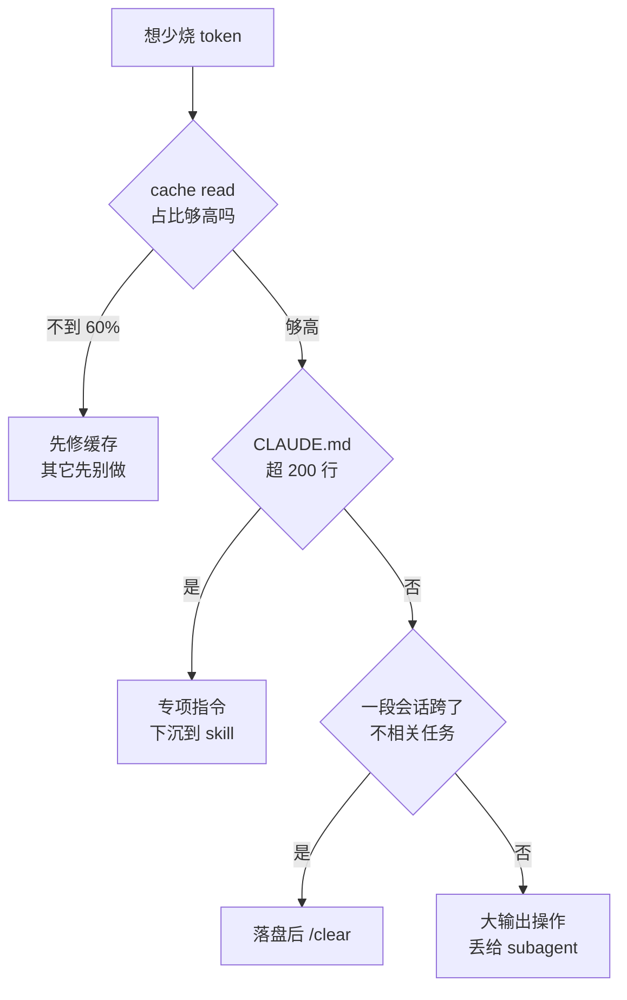

# 061. 怎么少烧 token？prompt caching / 精简 CLAUDE.md / 模型切换哪个最有效？

**一句话**：这三个不在同一层，没法直接比 —— caching 是默认就开的地基，你只要别在会话中途连 MCP / 切模型 / 改 CLAUDE.md 把它拆了；精简 CLAUDE.md（≤ 200 行）加任务边界 `/clear` 是你手动能拿到的最大收益；模型切换是另一道路由题，见 [#062](./062-什么时候用Opus什么时候用Sonnet.md)。

## 30 秒结论

| 你看到的 | 立刻做 | 不想再犯 |
|---|---|---|
| `ccusage` 里 cache read 占输入 token 不到 60% | 查会话中途有没有连/断 MCP、切模型、改 CLAUDE.md | MCP 和模型在会话开始前定好，中途别动 |
| CLAUDE.md 超过 200 行，或 `/context` 里它占了显眼一格 | 专项工作流指令下沉到 skill 按需加载 | 只写 Claude 从代码里推不出来的东西 |
| 一段会话干了几小时、跨了多个不相关任务 | 落盘 handoff 文件后 `/clear` | 任务切换就是 `/clear` 的信号 |
| 跑一次测试或抓一次日志就吃掉上万 token | 交给 subagent，或用 PreToolUse hook 先过滤 | 大输出操作一律不进主上下文 |
| 改个错别字也跑出几万 thinking token | `/effort` 降档，或设 `MAX_THINKING_TOKENS=8000` | thinking token 按 output 价计费 |



**先看 cache read 占比够不够 60%**，不够就先修缓存，别急着砍 CLAUDE.md。

## 怎么做

按「性价比 × 你能控制的程度」排序：1–2 不花力气就有收益，3–6 是每天要拧的螺丝，7–9 是进阶。

**1. 别拆掉缓存地基。** MCP server 只在会话开始时连好，不要中途连或断；一段会话内不要频繁切模型；不要每轮把时间戳或 UUID 注进 CLAUDE.md 或系统提示。这条不需要多做什么，只需要不做破坏动作。

<details>
<summary>怎么确认没被拆（及 ccusage 的口径限制）</summary>

看 API 响应 `usage` 里的 `cache_read_input_tokens`（这次命中读取）和 `cache_creation_input_tokens`（这次写入）；或者跑 `npx ccusage@latest daily` 看 cache read 分列。正常的长会话里 cache read 应该占输入 token 的大头，社区实测的重度用户能到 88.8%[^5]；掉到 60% 以下就该回头查上面三个动作。

注意 ccusage 的口径限制：它读的是本地 `~/.claude` 下的 jsonl 会话日志，而这份日志记的 token 绝对数会被系统性少算 1–2 个数量级[^6]。所以上面这条只看比例和趋势——cache read 占比、以及这周比上周高还是低——别拿它的 token 绝对值去对账单。

</details>

**2. 少挂 MCP。** MCP 工具定义默认延迟加载（只有工具名进上下文，用到时才载入完整 schema），但仍然是开销[^7]。官方建议：能用命令行工具（`gh`、`aws`、`gcloud`）就别用 MCP，因为 CLI 不占工具列表[^7]。用 `/mcp` 看已配置的，停掉没在用的。

**3. 把 CLAUDE.md 精简到 200 行以内。** 原则：Claude 能从读代码推断出来的，删掉；专项工作流指令（PR 审查清单、DB 迁移步骤）下沉到 skills 按需加载[^3]。写法见 [#010 CLAUDE.md 怎么写才真的生效](../02-上下文工程/010-CLAUDE-md怎么写才生效.md)。

<details>
<summary>放进去 vs 移出去的取舍表</summary>

| 放进 CLAUDE.md（每轮常驻，值这个价） | 移出去（按需加载才划算） |
|---|---|
| 技术栈、构建/测试命令、核心目录约定 | PR 审查清单 / DB 迁移步骤 → skill |
| 每次都适用的红线（如「金额用整数分」） | 临时计划 → issue tracker |
| 指针（`@docs/architecture.md`，用时才读） | Claude 能从代码推断的一切 → 删 |

</details>

**4. 切换到不相关的任务时就 `/clear`。** 陈旧上下文会在之后每条消息上都浪费一次 token。做法是先落盘再清：让 Claude 写一个 `session-handoff.md`（当前目标、改过的文件、关键决策、失败的测试、下一步），然后 `/clear`，开新会话时说 "Read session-handoff.md and continue."。想找回旧会话用 `/rename` 配 `/resume`。

**5. 主动 `/compact` 并指定保留什么。** 别等窗口爆了才压。写法 `/compact Focus on code samples and API usage`；也可以写进 CLAUDE.md 的 `# Compact instructions` 段固化。机制侧见 [#012 上下文窗口要爆了怎么办](../02-上下文工程/012-上下文窗口要爆了.md)。

**6. prompt 写具体。** "improve this codebase" 会触发全库扫描；"add input validation to the login function in auth.ts" 让它读最少的文件就开工。改动前先用 plan mode（连按两次 `Shift+Tab`）探一探，避免走错方向后的昂贵返工。

**7. 大输出操作丢给 subagent，或用 hook 先过滤。** 跑测试、抓文档、处理日志这类活交给 subagent，冗长内容留在子上下文，只把摘要回给主上下文。也可以用 PreToolUse hook 在命令执行前改写它（见下面的折叠块）。

**8. 调低 extended thinking。** thinking token 按 output 价计费，默认预算每请求可达数万[^7]。用 `/effort` 降级、`/config` 关掉思考（Fable 5 不支持关闭），或设 `MAX_THINKING_TOKENS=8000`（只对固定思考预算的模型生效，自适应推理模型用 `/effort` 调档）。

**9. 给类型语言装 code intelligence 插件。** 指像 IDE 那样精确跳转符号定义的能力。它替代文本搜索，一次 "go to definition" 就省下 grep 加翻阅多个候选文件的 token。官方 marketplace 有现成插件[^8]：先自行装好对应语言服务器二进制（插件不代装，如 TypeScript 装 `typescript-language-server`、Python 装 `pyright-langserver`、Go 装 `gopls`、Rust 装 `rust-analyzer`），再执行 `/plugin install typescript-lsp@claude-plugins-official`（其余语言换成 `pyright-lsp` / `gopls-lsp` / `rust-analyzer-lsp` 等）。**怎么确认生效**：Claude 每次编辑后界面出现「Found N new diagnostic issues」诊断提示（按 `Ctrl+O` 查看），且探索代码时改用符号跳转、Grep 明显变少。

<details>
<summary>查「钱花哪了」的三条命令</summary>

- `/context`：显示上下文窗口里每个元素的 token 占比 —— 系统提示、CLAUDE.md、MCP、历史各占多少。
- `/usage`：把近期用量归因到 skills、subagents、plugins 和各个 MCP server（订阅计划下按占比显示），`d` / `w` 切 24 小时和 7 天视图[^7]。界面行为随版本变化快，以实际运行为准。
- `/memory`：列出各层级 CLAUDE.md 和 memory 文件的位置并打开编辑。它只负责列位置和开关，不显示「本会话实际加载了什么」—— 那是 `/context` 的活。

</details>

<details>
<summary>一个 hook：把测试输出过滤成只剩失败行（官方 costs 页示例，JSON 生成处已加固）</summary>

这个 hook 在跑测试时改写命令，只回 FAIL/ERROR 附近的行，把上万 token 的测试输出压到几百。

先在 `settings.json` 里注册：

```json
{
  "hooks": {
    "PreToolUse": [
      { "matcher": "Bash", "hooks": [
        { "type": "command", "command": "~/.claude/hooks/filter-test-output.sh" }
      ]}
    ]
  }
}
```

再写 `~/.claude/hooks/filter-test-output.sh`（节选）：

```bash
#!/bin/bash
input=$(cat); cmd=$(echo "$input" | jq -r '.tool_input.command')
if [[ "$cmd" =~ ^(npm test|pytest|go test) ]]; then
  # 用 jq 生成 JSON，不要用字符串拼接 —— 命令里一旦带引号或反斜杠，
  # 拼出来的就是非法 JSON，hook 会静默失效（不报错、不过滤）
  jq -n --arg c "$cmd 2>&1 | grep -A 5 -E '(FAIL|ERROR|error:)' | head -100" '{
    hookSpecificOutput: {
      hookEventName: "PreToolUse",
      permissionDecision: "allow",
      updatedInput: { command: $c }
    }
  }'
else echo "{}"; fi
```

**怎么确认生效**：跑一次 `npm test`，Claude 收到的输出里应该只剩 FAIL/ERROR 上下文，`/context` 里对话历史的增量从上万 token 降到几百。

</details>

## 为什么

### 你在为「每一轮重发的前缀」反复付费

API 是无状态的，它不记得上一轮。所以每发一条消息，模型都要重新处理整个上下文：系统提示、CLAUDE.md、全部历史、MCP 工具定义，再加上你的新输入。

这就解释了为什么「打个招呼」也不便宜 —— 真正的开销来自启动时就加载的固定内容，不是你打的那几个字。社区里反复出现相关吐槽，量级从「非交互式发一句你好吃掉约 15 万 token」到「说声 hello 就烧掉约 2% 会话额度」不等，数字未经核实，但方向一致：固定启动开销才是大头。

### prompt caching 是默认已开的地基，三块机制就够用

cache read（命中）按 0.1× 基础输入价计费，cache write 5 分钟 TTL 是 1.25×、1 小时 TTL 是 2.0×；倍率以官方为准[^1]，社区口口相传的数字一律存疑。缓存内容每被用一次就免费续一次期，只要请求间隔小于 TTL 缓存一直是热的，绝大部分前缀按 0.1× 计费 —— 这也是真实账单里 cache read 往往占大头的原因。

**缓存是前缀精确匹配** —— 官方要求逐字节一致才算命中[^2]。渲染顺序是 `tools → system → messages`，哪一层变了，该层及其之后全部失效。落到日常，就是三个会拆掉地基的动作：中途连/断 MCP server（改了排最前的 tools，整段作废）、中途切模型（缓存按模型隔离，等于冷启动）、每轮改 CLAUDE.md 或往里注时间戳（CLAUDE.md 在 system 段，其后全失效）。

<details>
<summary>TTL 回本账 + 完整的缓存失效层级表 + 最小可缓存前缀</summary>

**TTL 的经济含义是回本点。** 5 分钟 TTL 写一次 1.25×、再命中一次 0.1×，合计 1.35×，低于两次全价的 2×，第二次请求就回本。1 小时 TTL 写贵一倍，两次合计 2.1× 反超 2×，要到第三次（2.0× + 0.1×2 = 2.2× < 3×）才回本。所以 TTL 是按请求间隔选的经济题，不是越长越省；一旦冷掉就要重新付写入费。

| 改动 | tools 缓存 | system 缓存 | messages 缓存 |
|---|:---:|:---:|:---:|
| 工具定义（增删改/重排）、切模型 | ✘ | ✘ | ✘ |
| system prompt 内容、web search / citations 等开关 | ✓ | ✘ | ✘ |
| message 内容、`tool_choice`、图片有无、thinking 参数 | ✓ | ✓ | ✘ |

✓ 表示该层缓存仍有效，✘ 表示失效。

另外，能被缓存的前缀有最小长度，且随模型不同：Fable 5 是 512，Opus 4.8 / Sonnet 5 / Sonnet 4.6 / Sonnet 4.5 是 1024，Opus 4.7 是 2048，Opus 4.6 / Opus 4.5 / Haiku 4.5 是 4096。前缀短于这个值会被静默地不缓存，而且不报错。

这套参数属于可调定价参数，随官方更新即失效，用前回查官方 prompt caching 文档。

</details>

### CLAUDE.md 和上下文膨胀，是你唯一能直接控的两块

CLAUDE.md 在会话启动时就载入上下文。如果里面塞了专项工作流的详细指令（PR 审查、DB 迁移步骤），那么即使你在做无关的活，这些 token 也一直占着。官方的建议是把专项指令移进 skills 按需加载，并把 CLAUDE.md 控制在 200 行以内[^3]。它每个会话、每一轮都常驻，同时又是你能直接删改的最大一块，所以最值得优化。

上下文随对话越滚越大，则是长会话烧钱的主因。官方点名的两个最该纠正的高开销习惯正是：跨不相关任务不清空历史，以及把 Opus 一直留作默认模型[^4]。前者对应 `/clear`，后者对应模型路由。

## 别这么干

- ❌ **中途连接或断开 MCP server。** 一次操作作废整段 prompt cache，之后每轮全价重写，比一直多挂那个 server 还贵。MCP 要在会话开始时就配好。
- ❌ **一段会话里反复切模型。** 缓存按模型隔离，切一次等于冷启动。想用便宜模型跑苦力就派 subagent 并配 `model: haiku`，别在主循环里换。
- ❌ **无脑上 1 小时 TTL 想更省。** 1 小时写入 2.0×，要三次以上请求才回本；请求密集时反而不如默认的 5 分钟。TTL 按请求间隔选。
- ❌ **把 CLAUDE.md 当垃圾桶。** 塞满一次性指令、能从代码推断的东西、临时计划。超过 200 行就是持续的 token 税，而且内容越多遵守率越低（见 [#010](../02-上下文工程/010-CLAUDE-md怎么写才生效.md)）。
- ❌ **把「少烧 token」等同于「用最便宜的模型」。** 贵模型单价高，但往往因为试错更少而总 token 更省。这是路由题，见 [#062](./062-什么时候用Opus什么时候用Sonnet.md)。

<details>
<summary>另外三条容易忽略的浪费</summary>

- **等窗口爆了才 `/compact`，跨任务从不 `/clear`。** 官方点名「长会话不清空」是最该纠正的高开销习惯之一。应该在完成子任务后就主动压缩或清空。
- **让 Claude 先「确认理解」或「复述需求」。** "summarize the requirements before you start" 会让它把你整段 prompt 复述回来，纯浪费。直接让它开工。
- **无脑并行一堆 subagent 或 agent team。** agent team（plan mode）大约用 7 倍 token[^4]，消耗和队友数量成正比。不是所有活都值得铺开并行，见 [#032](../04-执行工作流/032-SubAgent并行开几个.md)。

</details>

<details>
<summary>换成 Cursor / Copilot 呢</summary>

| 工具 | 省 token 的主要机制 | 与 Claude Code 的差异 |
|---|---|---|
| **Claude Code** | 自动 prompt caching（0.1× read）+ auto-compaction + `/clear`/`/compact` + CLAUDE.md 瘦身 + MCP 延迟加载 + hooks/subagent 预处理 | 缓存是默认地基、可用命令细粒度归因（`/context`、`/usage`）；控制点最丰富 |
| **Cursor** | 上下文按需检索（codebase index）+ 手动 @ 引用 + 模型档位选择 | 更偏「选对上下文喂进去」，没有等价的 per-session 缓存纪律；成本多按订阅额度/请求计 |
| **GitHub Copilot** | 主要靠订阅/席位（月费固定），无逐 token 计费暴露给用户 | 用户几乎不直接管 token；省钱空间小，代价是控制力也小 |

核心差异在控制权的位置。Claude Code 把 token 成本的控制权大量交给用户：能看、能清、能改前缀、能配 hook。Cursor 偏向帮你「选对上下文」。Copilot 把成本封装进订阅，用户基本不感知。控制力越强，「会不会用」造成的账单差异就越大。

</details>

## 延伸

**相关文章**

- [#060 额度怎么突然就没了？先算清自己一天该烧多少](./060-一天该烧多少额度.md) —— 先测自己的消耗基准，再谈省
- [#062 什么时候该用 Opus、什么时候该用 Sonnet/Haiku？](./062-什么时候用Opus什么时候用Sonnet.md) —— 本篇开头说的「模型切换是另一道题」，那道题在这里
- [#010 CLAUDE.md 怎么写才真的生效？](../02-上下文工程/010-CLAUDE-md怎么写才生效.md) —— 本篇「精简 CLAUDE.md」的写法攻略
- [#012 上下文窗口要爆了怎么办？](../02-上下文工程/012-上下文窗口要爆了.md) —— `/compact` 和 `/clear` 的机制侧，本篇讲降本侧
- [#032 开几个 agent 并行跑，token 指数级炸开——并行到底该开几个？](../04-执行工作流/032-SubAgent并行开几个.md) —— agent team 的 7 倍 token 从哪来

**参考资料**

- [Manage costs effectively — Claude Code Docs](https://code.claude.com/docs/en/costs) —— 支撑本篇全套省 token 动作：caching 默认开启、auto-compaction、`/clear`/`/compact`、CLAUDE.md 移入 skills 并控在 200 行、MCP 工具定义默认延迟加载与优先用 CLI、`/usage` 归因视图、PreToolUse 过滤测试输出的 hook 示例、extended thinking 降档、模型选择、agent teams 在 plan 模式约 7 倍（官方，2026-08-15 核实）
- [Prompt caching — Anthropic Docs](https://platform.claude.com/docs/en/build-with-claude/prompt-caching) —— 支撑「为什么」第二节的全部机制：倍率（write 1.25×/2.0×、read 0.1×）、TTL 免费续期、前缀 100% 精确匹配、失效层级表、最小可缓存前缀（官方）
- [Memory — Claude Code Docs](https://code.claude.com/docs/en/memory) —— 支撑 `/memory` 只列位置、不显示实际加载内容这一说明（官方）
- [firecrawl: 12 Ways to Cut Token Consumption in Claude Code](https://www.firecrawl.dev/blog/claude-code-token-efficiency) —— 支撑 CLAUDE.md 瘦身与 handoff 文件两条做法：一份约 3800 token 的 CLAUDE.md 砍到 300 出头未见质量回退（社区个例，数字未核实）
- [HN 45914307: I spent $638 on AI coding agents in 6 weeks](https://news.ycombinator.com/item?id=45914307) —— 支撑「cache read 应占大头」的量级参考：70 天账单复盘，缓存命中率 88.8%（社区，2025-11，单人个例）
- 《AI 使用能力的度量与认证：系统可行性与赛道判断》—— 支撑「本地 jsonl token 数被系统性少算 1–2 个数量级、只能看趋势」这条口径限制（个人研究，2026-06，未公开）
- [V2EX 1153108](https://v2ex.com/t/1153108) / [r/ClaudeCode: It costs you around 2% session usage to say hello](https://www.reddit.com/r/ClaudeCode/comments/1s54q0d/it_costs_you_around_2_session_usage_to_say_hello/) —— 支撑「固定启动开销才是大头」的社区吐槽，两处具体数字均为单源个例、未核实（社区，2025）

[^1]: [Prompt caching — Anthropic Docs](https://platform.claude.com/docs/en/build-with-claude/prompt-caching)（官方）：cache read 0.1×，cache write 5 分钟 TTL 1.25×、1 小时 TTL 2.0×。
[^2]: 同上：命中要求 prompt 片段 100% 逐字节一致，失效按 `tools → system → messages` 顺序向后传导。
[^3]: [Manage costs effectively — Claude Code Docs](https://code.claude.com/docs/en/costs)（官方，2026-08-15 核实）：CLAUDE.md 会话启动即载入，建议把专项指令移进 skills 并把文件控制在 200 行以内。
[^4]: 同上：官方点名的两个高开销习惯是「跨不相关任务不清空历史」和「Opus 留作默认模型」；agent teams 在 plan 模式下大约用 7 倍 token。
[^5]: [HN 45914307](https://news.ycombinator.com/item?id=45914307)（社区，2025-11，单人个例）：70 天完整账单复盘，缓存命中率 88.8%。个例，不是官方基准。
[^6]: 个人研究（2026-06，跨工具痕迹采集可行性评估）：Claude Code 本地 jsonl 里的 token 数被系统性少算 1–2 个数量级，只能看趋势、不能当绝对值。未见官方对该偏差的确证说明。
[^7]: [Manage costs effectively — Claude Code Docs](https://code.claude.com/docs/en/costs)（官方，2026-08-15 核实）：MCP 工具定义默认延迟加载（deferred by default，仅工具名进上下文）；官方原文建议优先用 `gh`、`aws`、`gcloud` 等 CLI；thinking token 按 output 计费、默认预算依模型可达每请求数万，`/effort` 与 `MAX_THINKING_TOKENS=8000` 均见原文；`/usage` 的归因与 `d`/`w` 视图切换同页。
[^8]: [Discover and install prebuilt plugins — Claude Code Docs](https://code.claude.com/docs/en/discover-plugins)（官方，2026-08-15 核实）：code intelligence 插件清单（`typescript-lsp`、`pyright-lsp`、`gopls-lsp`、`rust-analyzer-lsp` 等）、需自装语言服务器二进制、安装命令与诊断行为。

---

<sub>难度 中级 · 流程题 + 配置题 · 主线 Claude Code，横向 Cursor / Copilot</sub>

<sub>**时效**：缓存倍率（write 1.25×/2.0×、read 0.1×）、TTL 免费续期、前缀失效层级、最小可缓存前缀（Fable 5=512 / Opus 4.8=1024 / Opus 4.7=2048 / Opus 4.6=4096 等）、MCP 工具定义默认延迟加载、thinking 默认预算「依模型可达每请求数万」、`/usage` 归因与 `d`/`w` 视图、code intelligence 插件清单，均已于 2026-08-15 对照官方文档核实。**已知不确定**：「cache read 低于 60% 该查」这条阈值是本篇按社区实测量级给的经验线，官方没有健康值标准；「一句你好吃掉 15 万 token」「hello 烧掉 2% 额度」两处数字是单源社区个例，未核实；「本地 jsonl token 数少算 1–2 个数量级」（2026-08-04 补入）出自个人一手研究，未见官方确证，故本篇涉及 ccusage 的判断一律用比例与趋势、不用绝对值。**易变**：倍率与最小可缓存前缀属可调定价参数，随官方更新即失效，用前回查官方 prompt caching 页；`/usage` 界面行为（归因口径、按键）随版本变化快，以实际运行为准。</sub>

> 本篇个人实践（L4）：`[待补：BOSS 的实战经验/踩坑]`
