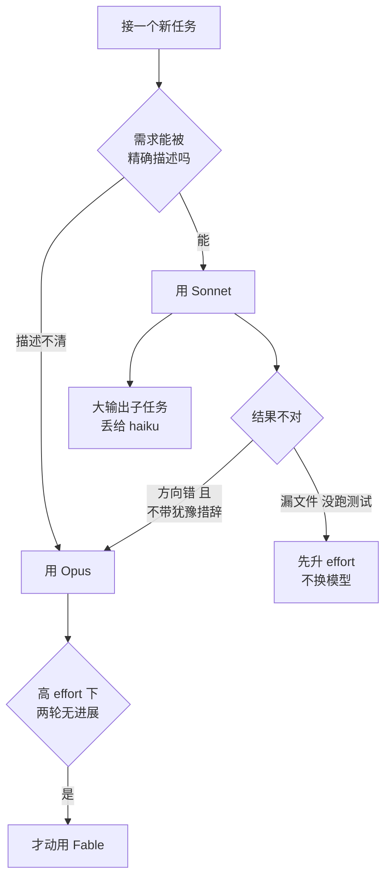

# 062. 什么时候该用 Opus、什么时候该用 Sonnet/Haiku？怎么按任务路由模型才不浪费？

**一句话**：默认设 Sonnet，Opus 只在「需求本身描述不清」或「Sonnet 连续两轮自信地改错方向」时切过去，subagent 的苦力活显式写 `model: haiku` —— 官方把「Opus 被留作默认模型」和「长会话从不清理」并列为账单失控的两大根因[^1]。

## 30 秒结论

| 你看到的 | 立刻做 | 不想再犯 |
|---|---|---|
| 额度比预期掉得快，且 `/model` 显示默认是 Opus | `/config` 把默认改成 Sonnet | 默认永远 Sonnet，Opus 手动切 |
| Sonnet 漏读了某个文件、没跑测试、没复查 | `/effort` 升一档，别换模型 | 先分清「不够努力」还是「不够懂」[^2] |
| Sonnet 连续两轮改错方向，且回答里没有「可能 / 大概 / 建议你确认」这类措辞 | `/model opus` 切过去重做这一段 | 需求含糊的活直接开 `opusplan` |
| subagent 跑测试、抓日志也在烧 Opus | frontmatter 里写 `model: haiku` | 不写 `model` 默认是 `inherit`[^3] |
| agent team 开了一堆队友、全跟着主会话用 Opus | 队友统一 Sonnet，收敛队伍规模 | teams 约 7 倍 token[^1] |



## 怎么做

三档路由，从默认往上升级。

**第 1 步：把默认设成 Sonnet，不是 Opus。** 在 `/config` 里设默认模型，或用 `/model sonnet`（v2.1.153 及以后会把它存为新会话默认）。日常编码、能描述清楚的改动、上下文里已有代码的问答，全部走 Sonnet。官方原话是 Sonnet 能很好地处理大多数编码任务，且比 Opus 便宜[^1]。

**怎么确认生效**：开一个新会话敲 `/model`，选择器顶部显示的当前模型是 Sonnet 而不是 Opus。

**第 2 步：升 effort 还是升模型，按这两组信号分。** 官方给的诊断问题是：它是「不够努力」还是「不够懂」[^2]。

| 你观察到的 | 判断 | 动作 |
|---|---|---|
| 跳过了你点名的文件、没跑测试、没复查就说完成 | 不够努力 | `/effort` 升一档，模型不动 |
| 连续两轮给出方向性错误的方案，且满足下面三个信号中的两个 | 不够懂 | `/model opus` |
| 你自己都说不清要什么，只能描述症状 | 不够懂 | 直接 `/model opusplan` |

「很笃定」不可观测，换成三个能在回复里直接看到的信号，中两个就算：

1. **回答里不出现犹豫措辞** —— 通篇没有「可能」「大概」「我不确定」「建议你确认一下」「取决于……」。
2. **不主动提复查建议** —— 结尾没有「你可以先跑一下测试验证」「这块我没读到 X 文件，需要的话我去看」这类自我设限。
3. **收到需求后直接开始改文件** —— 没有先问澄清问题、没有先列方案让你选，第一个动作就是 Edit/Write。

反过来，如果它自己在打问号、主动要你确认，那多半是信息不足而不是模型不够强 —— 补上下文比换模型便宜。

升 effort 比升模型便宜得多。反过来，简单任务把 effort 调低会提速、通常还降成本，且不影响输出质量[^2]。很多「以为只有 Opus 才做得对」的情况，其实只是 effort 不够。

**第 3 步：需求含糊的活用 `opusplan` 自动切。**

```
/model opusplan
```

它把本篇的核心决策自动化了：规划阶段（连按两次 `Shift+Tab` 进 plan mode，见 [#031 plan → execute → review 循环](../04-执行工作流/031-plan-execute-review循环.md)）用 Opus 出方案，你批准后自动切 Sonnet 执行[^4]。想既用 Opus 的规划能力、又不让它写完整段代码，这是推荐默认。

**怎么确认生效**：批准 plan 之后，状态行里的模型名从 Opus 变成 Sonnet。

**第 4 步：给 subagent 显式配便宜模型。** 跑测试、抓文档、处理日志这类高 token、低智力的子任务，在 frontmatter 里写 `model: haiku`；需要真正理解的写 `model: sonnet`。

```markdown
---
name: test-runner
description: 跑测试并只回报失败项
model: haiku          # 高 token、低智力 → 用最便宜的
---
```

**这里有个坑**：`model` 省略时默认是 `inherit`，也就是跟随主会话。主会话在 Opus 时，那些没写 `model` 的 subagent 会全部继承 Opus，连跑测试都在烧 Opus[^3]。只有显式写才省得下来。

**第 5 步：agent teams 的队友用 Sonnet。** 官方建议队友用 Sonnet，它在协调类任务上兼顾能力和成本；同时 agent teams（plan mode 下的多智能体）大约消耗 7 倍 token，务必收敛队伍规模[^1]。开几个见 [#032 SubAgent 并行开几个](../04-执行工作流/032-SubAgent并行开几个.md)。

**第 6 步：Fable 只留给真正的硬骨头。** 判断信号是：Opus 在高 effort 下连续两轮没有进展。适用场景是跨会话的大重构、线上故障排查、架构决策，用 `/model fable`。它单价约为 Sonnet 的 3.3 倍，不是日常选项。

<details>
<summary>/model 的全部可选项（alias 表）</summary>

| alias | 行为 | 何时用 |
|---|---|---|
| `default` | 清除覆盖，回到账户推荐模型 | 想重置 |
| `sonnet` | 最新 Sonnet（API 上 = Sonnet 5） | **日常编码默认** |
| `opus` | 最新 Opus（= Opus 4.8） | 复杂推理 / 架构 |
| `haiku` | 快而省 | 简单任务、subagent 苦力 |
| `fable` / `best` | Fable 5（有权限时） | 最难、跨会话的长任务 |
| `sonnet[1m]` / `opus[1m]` | 1M 上下文窗口 | 超长会话（Sonnet 5 本身已是 1M） |
| **`opusplan`** | plan mode 用 Opus，执行阶段自动切 Sonnet | 「Opus 规划 + Sonnet 干活」的自动化默认 |

alias 解析到的具体版本随 provider 不同，例如在 Bedrock 上 `sonnet` 等于 Sonnet 4.5。这张表随模型换代变化，用前回查官方 model-config。

</details>

<details>
<summary>subagent 模型字段的完整规则，和内置 Explore 的坑</summary>

`model` 字段可选 `sonnet`、`opus`、`haiku`、`fable`、完整模型 ID 或 `inherit`；省略则默认 `inherit`，跟随主会话。

```markdown
---
name: data-analyst
description: 数据分析工作流
model: sonnet         # 需要真正理解 → 用 Sonnet，别 inherit 到 Opus
---
```

内置的 `Explore` 子代理从 v2.1.198 起会继承主会话模型（API 上封顶到 Opus）。想强制它走便宜模型，可以自定义一个同样叫 `Explore` 的子代理，写上 `model: haiku` 来覆盖它。

**怎么确认生效**：派一次 subagent 后跑 `/usage`，用量归因里那个 subagent 对应的模型应该是 Haiku 而不是 Opus。

</details>

<details>
<summary>effort 这个旋钮和 extended thinking 的成本</summary>

除了换模型，你还有 effort。简单任务降 effort 省钱，难任务升 effort 补「不够努力」，两者都比换模型来得轻。

extended thinking（扩展思考，指让模型在回答前多想一段）产生的思考 token 按 output 价计费，默认预算每个请求可达数万 token。简单任务可以用 `/effort` 降档，或在 `/config` 里关掉。thinking 的成本细节属于 [#061 怎么少烧 token](./061-怎么少烧token.md) 的范围。

</details>

## 为什么

### 贵模型不一定贵，但无脑用贵的一定亏

常见误解是「反正缓存便宜，全程 Opus 更稳」。但官方明确把「Opus 被留作默认模型」列为 API / 云计费账单意外飙高的根因之一，另一个是长会话一直没清理；最有效的两个习惯是在不相关任务之间清理会话，以及让模型匹配任务[^1]。

关键词是「匹配任务」。路由是一个主动动作，不是「选个最强的一劳永逸」。

### 单价差是真实存在的，按 token 计费时逐条累加

| 模型 | input $/1M | output $/1M | 上下文 | 相对 Sonnet |
|---|---|---|---|---|
| **Haiku 4.5** | $1 | $5 | 200K | ≈ 1/3 |
| **Sonnet 5** | $3（引导期 $2，至 2026-08-31） | $15（引导期 $10） | 1M | 1x（基准） |
| **Opus 4.8** | $5 | $25 | 1M | ≈ 1.67x |
| **Fable 5** | $10 | $50 | 1M | ≈ 3.3x |

这张表要看两点。第一，Opus 只比 Sonnet 贵 1.67 倍，不是数量级差距 —— 所以「Opus 一定烧钱」和「Opus 无所谓」都不成立，差距要靠任务量放大才显著。第二，订阅制下你不直接按 token 付费，但仍然消耗用量额度（5 小时窗口、周额度），所以路由照样决定你多久撞一次限额，见 [#060 一天该烧多少额度](./060-一天该烧多少额度.md)。

### 贵模型 token 可能更省，所以判断标准是「缺什么」而不是「贵不贵」

社区里有个常见观点：Opus 单价是 Sonnet 的 1.67 倍，但因为少走弯路、少来回改，完成同一任务的总 token 可能反而更少。这个权衡真实存在，但推不出「Opus 永远更划算」。

官方给的判断标准更精确：分清 Claude 是「缺知识」还是「没努力」[^2]。缺知识就升模型，没努力就升 effort。

同一篇官方博客把三档模型拟人化，值得记住：Sonnet 是「很好的通才」，适合能被精确描述的编辑、机械改动、以及上下文里已有代码的问答；Opus 是「专家」，适合复杂、含糊、小模型容易自信答错的问题，它比 Sonnet 更会处理模糊需求；Fable 是最强的专家，适合微妙的 bug、陌生领域、架构决策，只有在其它模型真的被逼到极限时才动用。

## 别这么干

- ❌ **把 Opus 设成常驻默认。** 官方点名的高账单两大根因之一（另一个是长会话不清理）。默认应该是 Sonnet。
- ❌ **一遇到错就升到 Opus / Fable。** 先分清「不够懂」还是「不够努力」。跳过文件、没跑测试属于后者，升 effort 就够，比升模型便宜。
- ❌ **subagent 不写 `model` 就跑苦力活。** 默认 `inherit`，主会话在 Opus 时连跑测试都在烧 Opus。高 token、低智力的子任务显式配 `model: haiku`。
- ❌ **用 Fable 干日常活。** 单价约为 Sonnet 的 3.3 倍，官方定位是只有把其它模型逼到极限的硬骨头才用。
- ❌ **在 agent teams 里给每个队友都上 Opus。** teams 本就约 7 倍 token，队友用 Sonnet、收敛规模、干完即关。

<details>
<summary>换成 Cursor / Copilot 呢</summary>

| 工具 | 模型路由机制 | 差异 |
|---|---|---|
| **Claude Code** | `/model`（含 `opusplan` 自动切）+ per-subagent `model` + effort 旋钮 | 路由粒度最细：会话级、阶段级（plan/execute）、子任务级三层都能独立配 |
| **Cursor** | 每次对话手动选模型（下拉），可混用 Anthropic / OpenAI / 自带 key | 无「规划用贵的、执行用便宜的」自动切换；跨厂商是其强项 |
| **GitHub Copilot** | Chat / Agent 里手动选模型（含 Claude、GPT、Gemini） | 无 subagent 级路由；模型切换是全局对话级 |

核心差异在自动化程度。Claude Code 用 `opusplan` 做阶段级自动路由、用 subagent 的 `model: haiku` 做子任务级路由，把「贵模型只花在刀刃上」做成了机制，而不是靠人每次手动记得切。Cursor 和 Copilot 更偏「手动单选 + 跨厂商灵活」。

</details>

## 延伸

**相关文章**

- [#060 额度怎么突然就没了？先算清自己一天该烧多少](./060-一天该烧多少额度.md) —— 模型选择是成本量级的主变量，本篇是它的「怎么选」侧
- [#061 怎么少烧 token？prompt caching / 精简 CLAUDE.md / 模型切换哪个最有效？](./061-怎么少烧token.md) —— 缓存纪律和 CLAUDE.md 瘦身在那一篇，本篇只管模型路由
- [#032 开几个 agent 并行跑，token 指数级炸开——并行到底该开几个？](../04-执行工作流/032-SubAgent并行开几个.md) —— 决策侧；本篇补「派出去的 subagent 该配哪个模型」
- [#031 plan → execute → review 的正确循环怎么做？](../04-执行工作流/031-plan-execute-review循环.md) —— `opusplan` 正是在 plan/execute 边界上切模型

**参考资料**

- [Manage costs effectively — Claude Code Docs](https://code.claude.com/docs/en/costs) —— 支撑本篇立论：「Sonnet 能处理大多数编码任务」「把 Opus 留给复杂架构决策或多步推理」「Opus 留作默认是高账单根因」「agent teams 约 7 倍 token」「subagent 用 haiku 控成本」（官方，2026-06）
- [Model configuration — Claude Code Docs](https://code.claude.com/docs/en/model-config) —— 支撑第 3 步与 alias 折叠表：全部 model alias、`opusplan` 的 plan 用 Opus / 执行切 Sonnet、各 provider 的 alias 解析版本（官方，2026-06）
- [Create custom subagents — Claude Code Docs](https://code.claude.com/docs/en/sub-agents) —— 支撑第 4 步：`model` frontmatter 取值与默认 `inherit`、Explore 的继承规则（官方，2026-06）
- [Choosing a Claude model and effort level in Claude Code — Anthropic Blog](https://claude.com/blog/claude-model-and-effort-level-in-claude-code) —— 支撑第 2 步的诊断问题与三档模型定位：Sonnet 通才 / Opus 专家 / Fable 极限、「不够懂 vs 不够努力」、降 effort 提速降本（官方，2026）
- [Anthropic 模型定价](https://claude.com/pricing) —— 支撑「为什么」第二节的单价表与倍率换算：Opus 4.8 $5/$25、Sonnet 5 $3/$15、Haiku 4.5 $1/$5、Fable 5 $10/$50（官方，2026-06）
- [Is Opus 4.6 really worth it compared to sonnet? — r/ClaudeCode](https://www.reddit.com/r/ClaudeCode/comments/1rc6xpu/is_opus_46_really_worth_it_compared_to_sonnet/) —— 支撑「贵模型 token 可能更省」这一社区观点的出处（社区，单源，仅标题级引用，未逐字核对正文）

[^1]: [Manage costs effectively — Claude Code Docs](https://code.claude.com/docs/en/costs)（官方，2026-06）：账单意外飙高通常源于长会话从不清理，或 Opus 被留作默认模型；Sonnet 能很好地处理大多数编码任务且比 Opus 便宜；agent teams 大约用 7 倍 token。
[^2]: [Choosing a Claude model and effort level in Claude Code — Anthropic Blog](https://claude.com/blog/claude-model-and-effort-level-in-claude-code)（官方，2026）：做错了要问它是不够努力还是不够懂；降低 effort 会提升速度、通常还降低成本，且不影响输出质量。
[^3]: [Create custom subagents — Claude Code Docs](https://code.claude.com/docs/en/sub-agents)（官方，2026-06）：`model` 可取 sonnet/opus/haiku/fable/完整 ID/inherit，省略时默认 `inherit`，跟随主会话模型。
[^4]: [Model configuration — Claude Code Docs](https://code.claude.com/docs/en/model-config)（官方，2026-06）：`opusplan` 在 plan mode 用 Opus，执行阶段切 Sonnet。

---

<sub>难度 中级 · 决策题 + 配置题 · 主线 Claude Code，横向 Cursor / Copilot</sub>

<sub>**时效**：模型单价（Haiku $1/$5、Sonnet $3/$15、Opus $5/$25、Fable $10/$50）与倍率换算已于 2026-07-18 对照 Anthropic 官方定价核实；`/model` alias 表与 subagent 继承规则同日对照官方文档核实。**已知不确定**：「Opus 单价更高但总 token 更省」出自单个社区讨论，只做标题级引用，未逐字核对正文，也没有可复现的实测数据；「连续两轮」这类切换门槛、以及第 2 步用来替代「答得很笃定」的三个可观测信号（无犹豫措辞 / 不提复查建议 / 直接动手改文件），都是本篇给的经验线，官方没有量化标准，2026-08-04 改写。**易变**：Sonnet 5 引导期折扣至 2026-08-31；alias 解析到的具体版本随 provider 和模型换代变化，换代或调价后倍率结论需重算。</sub>

> 本篇个人实践（L4）：`[待补：BOSS 的实战经验/踩坑]`
