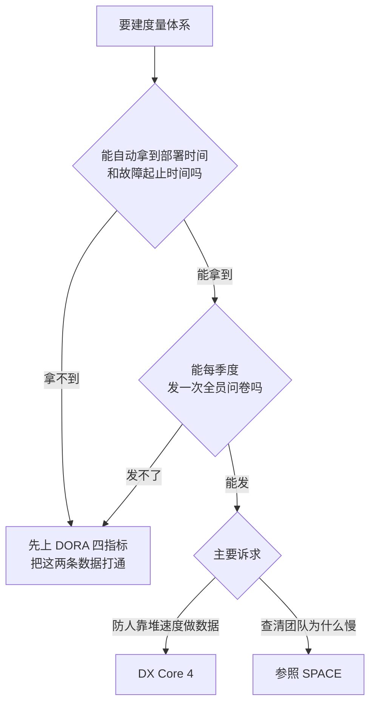

# 071. AI coding 的效能到底怎么度量？DORA / SPACE / 代码量 / AI 生码率，哪个不是 vanity metric？

**一句话**：代码量、AI 生码率、token 量当效能指标全是虚荣指标，先上 DORA 四指标（部署与故障数据、全员问卷都拿得到时再升 DX Core 4）并给每个速度指标配一个反向制衡指标（吞吐配变更失败率、速度配开发者体验），且吞吐类数字只在团队维度看、不落个人绩效。

## 30 秒结论

| 你看到的 | 立刻做 | 不想再犯 |
|---|---|---|
| 上级要按「代码行数 / AI 生码率 / token 量」考核到人 | 用四段可查证原文申诉，同时提替代口径 | 度量口径写进团队规范，先定制度再开数据开关 |
| 看板上只有部署频率和变更前置时间 | 同一张板补上变更失败率、恢复时间 | 任何速度指标成对出现，单独出现视为无效 |
| 吞吐涨 ≥20%，同期变更失败率也在涨 | 停止对外报吞吐，先查失败率涨在哪个环节 | 每季度对比两个指标的变化方向 |
| 有人拿 Claude Code 遥测当效能数据源 | 它只测 AI 用量；效能从 Git、CI、事故系统取 | 开遥测前书面写明「不进个人绩效」 |
| 指标体系已上线三个月 | 不预告，抽查 3 个数字最漂亮的 PR，人读 diff | 每季度一次抽查，比再加十个指标管用 |

选哪套框架，按能不能拿到数据决定，不按「团队成熟度」这种说不清的标准决定：



选框架只看数据拿不拿得到：**部署时间和故障起止时间打不通，就只上 DORA 四指标**。

## 怎么做

### 第零步：你不定 KPI，但你被 KPI 度量

本库读者多数是被度量方，后面几步是给设计度量的人看的，这一步是给你的。

**一，先确认你到底被什么指标考核。**问三句：这个数字的口径是什么、从哪个系统取数、看的是团队还是个人。三问里有一问答不上来，说明指标还没成型，此时提异议成本最低。答案里出现「个人的代码行数 / AI 生码率 / token 消耗」，进第二步。

**二，用可查证的原文申诉，别用「我觉得」。**四段原文在下面折叠块里，可直接复制进邮件，对方能自己去核。申诉时一定要附替代方案：「这个数字放团队看板、不进个人绩效；个人这边改看我负责的变更有没有引发线上问题。」只反对不给替代，通过率极低。

<details>
<summary>可直接复制的四段申诉原文</summary>

```text
1）指标设计方自己禁止个人层面使用
DX Core 4 由 DORA、SPACE、DevEx 三套框架的原作者联合推出，其主指标
"diffs per engineer" 的官方说明明确要求：不要把它设为个人目标，也不要与
奖惩挂钩。
出处：https://getdx.com/research/measuring-developer-productivity-with-the-dx-core-4/

2）单一产出指标必然被优化掉
DORA 与 SPACE 两个框架的作者 Nicole Forsgren 的说法是：衡量任何单一「产出」
指标都可能被滥用；开发者一旦知道某个指标在被考核，就会专门去优化它。
出处：https://newsletter.pragmaticengineer.com/p/developer-productivity-with-dr-nicole

3）只看吞吐会掉进 AI 特有的陷阱
2025 DORA 报告（Google DORA 团队，近 5000 名从业者）的结论是 AI 的主要作用
是放大器，且 AI 与吞吐量正相关、与交付稳定性负相关。只考核产出量而不同时看
变更失败率，等于奖励制造下游故障。
出处：https://dora.dev/dora-report-2025/

4）工具厂商自己也没把这个指标定位成生产力度量
Claude Code 官方遥测文档里，claude_code.lines_of_code.count 的说明只有一句
「增删的代码行数」，按 added/removed 与 model 拆分，全文没有把它称为生产力
或绩效指标。
出处：https://code.claude.com/docs/en/monitoring-usage
```

</details>

**三，留下能被查证的记录，防止被数字倒打一耙。**每两周记一行，只记三项：日期、这两周花在返工或验证 AI 产出上的小时数、对应的 PR 链接。绩效面谈时，这份带 PR 链接的记录是唯一能对抗「你 diff 量怎么这么低」的东西。

### 第一步：分清每个指标测的是投入还是结果

越靠近「结果」越值得当北极星指标，越靠近「投入」越是虚荣指标。判据一句话：**能被一个人闷头刷高、又不改善业务的，就是虚荣指标。**

| 指标 | 层次 | 测的是 | 判定 | 怎么用 |
|------|------|--------|------|--------|
| **代码行数 / diff 量** | 投入 | AI 吐了多少字 | ❌ 虚荣（可刷） | 只当用量趋势，**永不用于个人考核** |
| **AI 生码率** | 投入 | AI 参与度 | ❌ 虚荣 | 看渗透率可以，别当产出 |
| **token / $ 消耗** | 投入（成本） | 花了多少钱 | ❌ 当效能是虚荣；✅ 当成本要管 | 归成本管理，见 [#060](../07-效率与成本/060-一天该烧多少额度.md) |
| **部署频率 / 变更前置时间** | 产出 | 交付节奏 | ⚠️ 有用但必须配对 | 与稳定性指标一起看 |
| **变更失败率 / 恢复时间** | 结果 | 交付质量 | ✅ 信号 | AI 时代**尤其要盯**，防吞吐幻觉 |
| **重复率 / churn / 重构占比** | 结果 | 可维护性 | ✅ 信号 | 抓「加了就忘」式退化 |
| **开发者体验指数（DXI）** | 结果 | 可持续性 | ✅ 信号 | 反向牵制速度 |
| **% 时间花在新能力上** | 结果 | 业务价值 | ✅ 信号 | 防「忙而无功」 |

### 第二步：按四个是非题选框架，别自创

流程图已给答案，四题的原文是：能不能自动拿到每次部署时间和每次故障的起止时间；能不能每季度向全员发一次调研问卷；诉求是不是「防有人靠堆速度做数据」；诉求是不是「想查清团队为什么慢，包括协作和沟通」。第三、四题都答是，就先上 DX Core 4，再用 SPACE 补沟通维度，两者不冲突。

- **DORA（4 指标）**：部署频率、变更前置时间、变更失败率、恢复时间。入门首选，只覆盖「commit → 生产」这一段，AI 时代务必四个一起看。
- **SPACE（5 维度）**：满意度、表现、活动、沟通、效率。它是思考指标的框架而不是固定指标集，比另两个多一个沟通维度。
- **DX Core 4（4 维度）**：速度、有效性、质量、影响。每个维度一个主指标加若干制衡指标，设计目的就是防止用牺牲体验的方式堆速度[^2]。

### 第三步：每个速度指标必须配一个反向指标

三对固定搭配：吞吐量配变更失败率，速度配开发者体验指数，数量配重复率与 churn。三份框架材料都没公布「涨多少算警戒」的绝对阈值（2026-08 复核），因为各团队基线差太远，所以判据只能用相对变化。

| 检查项 | 怎么算 | 触发线（相对自身基线） | 触发了做什么 |
|--------|--------|----------------------|-------------|
| 速度 vs 质量背离 | 连续两个季度对比吞吐量变化率与变更失败率变化率 | 吞吐涨 ≥20%，同期失败率也涨 | 停止对外报吞吐，先查失败率涨在哪个环节 |
| 速度 vs 体验背离 | 季度调研的开发者体验指数 | 连续两个季度下降 | 暂停提速目标，先做一轮定性访谈 |
| 代码质量退化 | 重复代码占比、两周内 churn 率 | 任一项连续两季度单向上升 | 把「重构占比」加进本季度目标 |
| 指标被针对性优化 | 抽查 3 个数字最好看的 PR，人读 diff | 出现凑数提交、空断言测试、无意义拆分 | 该指标立即下线，别修，直接停 |

上表 20% 这个数是**个人假设的起步值**，没有任何框架或研究给出过这个阈值，别把它当引用。它的作用只是让你第一个季度有个能动手的线；跑满两个季度后，换成你自己团队吞吐量的历史波动幅度（例如取过去 8 个季度环比变化的标准差）。

### 第四步：三条硬规矩

1. **产出和吞吐指标只在团队或组织级别看，绝不落到个人绩效。**这条要拆成三句可执行的口径，缺一句都会漏：**只做团队级聚合、只与本人历史基线纵向比、禁止跨人横向比较**。商用效能产品的方法论正朝这三条收敛：DX 明确主张只和工程师本人用 AI 之前的基线纵向比，Faros 的分析口径只做团队级聚合；把三条并成一组是本篇的归纳，未见哪家原文逐条写全[^6]。DX Core 4 对 "diffs per engineer" 也有明确告诫：不要设成个人目标，不要与奖惩挂钩[^2]。任何「人均产出」指标最终都会在绩效评估里被当武器用。
2. **组合优于单点。**一组相互制衡的指标比单个指标更能反映全局[^4]。
3. **客观数据要配主观信号。**纯遥测漏掉认知负荷、心流和返工的痛感，用季度开发者体验调研补齐。

### 第五步：用 Claude Code 遥测当数据源，但只当 AI 用量的数据源

打开 `CLAUDE_CODE_ENABLE_TELEMETRY=1` 后，Claude Code 按 OpenTelemetry（一套标准的遥测采集协议，简称 OTel）导出下列指标[^5]。

| 指标名 | 含义 | 度量定位 |
|--------|------|----------|
| `claude_code.session.count` | 启动的 CLI 会话数 | adoption（渗透率） |
| `claude_code.active_time.total` | 活跃时长（秒） | adoption / 投入 |
| `claude_code.lines_of_code.count` | 增删的代码行数 | ⚠️ **虚荣**，只看趋势 |
| `claude_code.commit.count` / `pull_request.count` | commit 数 / PR 数 | ⚠️ 工作流影响，非产出 |
| `claude_code.cost.usage` / `token.usage` | 成本（USD）/ token 用量 | 成本，非效能 |
| `claude_code.code_edit_tool.decision` | accept / reject 编辑的次数 | ✅ 少有的偏结果信号 |

`code_edit_tool.decision` 比 LoC 有用得多，它反映 AI 产出被人采纳的比例。算采纳率有两个必须做的动作：**只留 `source` 以 `user_` 开头的记录**（`config` 和 `hook` 是权限规则自动放行或拦截的，混进来会把采纳率算虚高），**并按 `language` 分组**（假设某团队 Python 85%、内部 DSL 只有 30%——这两个数是编造的示意，只为说明混在一起的平均值什么都说明不了）。官方没有公布基线数值，别抄网上的数字当目标；正确用法是只看自己的趋势线，某语言的采纳率两周内明显下滑就去问那个方向的人。这个指标同样不能落到个人。

`cost.usage` 官方标注是近似值，别拿它和账单较真，账单归 [#060](../07-效率与成本/060-一天该烧多少额度.md)。

**顺序不能反：先书面定制度，再打开开关。**官方属性表把 `user.email` 标为 OAuth 登录时始终携带，且没有提供关掉它的配置项[^5]，也就是说指标落到个人在技术上默认可行。等有人发现自己的邮箱出现在看板上，信任就没了。

<details>
<summary>本机十分钟跑通的最小配置（collector + Prometheus + 四步验证）</summary>

数据流是 Claude Code → OTel Collector → Prometheus（→ Grafana 出图）。跑通后把 endpoint 换成公司的 collector 就是团队版。环境变量名与默认值来自官方 monitoring 文档（2026-08-15 核对）。

**第 1 步：collector 配置 `otel-collector.yaml`**

```yaml
receivers:
  otlp:
    protocols:
      grpc:
        endpoint: 0.0.0.0:4317
      http:
        endpoint: 0.0.0.0:4318

processors:
  batch:
    timeout: 10s

exporters:
  # 暴露 /metrics 供 Prometheus 抓取
  prometheus:
    endpoint: 0.0.0.0:8889
    # 把 OTEL_RESOURCE_ATTRIBUTES 里的 department、team.id 变成指标标签
    resource_to_telemetry_conversion:
      enabled: true
  # 调试用：把收到的数据打到 collector 日志
  debug:
    verbosity: detailed

service:
  pipelines:
    metrics:
      receivers: [otlp]
      processors: [batch]
      exporters: [prometheus, debug]
    logs:
      receivers: [otlp]
      processors: [batch]
      exporters: [debug]
```

**第 2 步：启动 collector**

```bash
docker run --rm \
  -p 4317:4317 -p 4318:4318 -p 8889:8889 \
  -v "$(pwd)/otel-collector.yaml:/etc/otelcol-contrib/config.yaml" \
  otel/opentelemetry-collector-contrib:latest
```

用 contrib 版而不是 core 版，因为 `prometheus` exporter 和 `resource_to_telemetry_conversion` 只在 contrib 里。

**第 3 步：Claude Code 侧的环境变量全集**

```bash
export CLAUDE_CODE_ENABLE_TELEMETRY=1
export OTEL_METRICS_EXPORTER=otlp
export OTEL_LOGS_EXPORTER=otlp
export OTEL_EXPORTER_OTLP_PROTOCOL=grpc
export OTEL_EXPORTER_OTLP_ENDPOINT=http://localhost:4317

# 关键坑：Claude Code 默认发 delta，Prometheus exporter 只认 cumulative，
# 不改这一行，8889 端口上什么都看不到
export OTEL_EXPORTER_OTLP_METRICS_TEMPORALITY_PREFERENCE=cumulative

# 默认 60000ms（60 秒）。调试时改短，跑通后记得改回来
export OTEL_METRIC_EXPORT_INTERVAL=10000

# 团队维度：给指标打上部门/团队标签（值里不能有空格）
export OTEL_RESOURCE_ATTRIBUTES="department=engineering,team.id=platform"

claude
```

**第 4 步：企业统一下发**（managed settings，走 MDM 推给全员，个人无需手工 export）

```json
{
  "env": {
    "CLAUDE_CODE_ENABLE_TELEMETRY": "1",
    "OTEL_METRICS_EXPORTER": "otlp",
    "OTEL_LOGS_EXPORTER": "otlp",
    "OTEL_EXPORTER_OTLP_PROTOCOL": "grpc",
    "OTEL_EXPORTER_OTLP_ENDPOINT": "http://collector.example.com:4317",
    "OTEL_EXPORTER_OTLP_HEADERS": "Authorization=Bearer example-token",
    "OTEL_EXPORTER_OTLP_METRICS_TEMPORALITY_PREFERENCE": "cumulative"
  }
}
```

**第 5 步：Prometheus 抓取配置 `prometheus.yml`**

```yaml
scrape_configs:
  - job_name: claude-code
    scrape_interval: 30s
    static_configs:
      - targets: ["localhost:8889"]
```

**怎么确认跑通了**，按顺序验证，哪一步断了就知道问题在哪一段。

验证 1，Claude Code 到底有没有在发。先不接 collector，用 console exporter 打到终端：

```bash
CLAUDE_CODE_ENABLE_TELEMETRY=1 \
OTEL_METRICS_EXPORTER=console \
OTEL_METRIC_EXPORT_INTERVAL=1000 \
claude
```

预期：随便问一句话，一两秒后终端出现包含 `claude_code.session.count`、`claude_code.token.usage` 的 JSON。没有任何输出说明遥测没打开，检查是否被 managed settings 的策略关掉。

验证 2，collector 收到了没：`docker logs <container-id> 2>&1 | grep -c "claude_code"`，预期输出大于 0。是 0 说明 endpoint 或 protocol 配错了（grpc 对 4317，http 对 4318，写反是最常见的错）。

验证 3，Prometheus 格式的指标出来了没：

```bash
curl -s http://localhost:8889/metrics | grep claude_code
```

预期看到类似：

```text
# HELP claude_code_session_count_total Count of CLI sessions started
# TYPE claude_code_session_count_total counter
claude_code_session_count_total{team_id="platform",department="engineering"} 3
```

指标名会被转换：点变下划线，单调计数器加 `_total` 后缀，所以 `claude_code.session.count` 在 Prometheus 里叫 `claude_code_session_count_total`（后缀行为由 prometheus exporter 的 `add_metric_suffixes` 控制，默认 true）。**在 Grafana 里按原始点号名字查不到，是排查时最常见的误判。**curl 有输出但是空的，十有八九是漏了 `OTEL_EXPORTER_OTLP_METRICS_TEMPORALITY_PREFERENCE=cumulative`。

验证 4，Prometheus 端能查到：查询框执行 `claude_code_session_count_total`，预期返回非空，且数值随着新开 Claude Code 会话而增长。

**降低颗粒度**：只想看团队 adoption 时，`export OTEL_METRICS_INCLUDE_ACCOUNT_UUID=false`（默认 true）。注意它只能去掉 `user.account_uuid` / `user.account_id`，去不掉 `user.email`；想彻底不落到个人，只能在 collector 侧用处理器丢掉这个属性，或在制度上禁止按它查询。

**隐私开关保持默认关闭**：`OTEL_LOG_USER_PROMPTS`、`OTEL_LOG_ASSISTANT_RESPONSES`、`OTEL_LOG_TOOL_DETAILS`、`OTEL_LOG_TOOL_CONTENT` 默认不导出 prompt 和工具内容，没有任何度量需求需要打开它们。

</details>

## 为什么

### 代码量、AI 生码率、token 量为什么是虚荣指标

虚荣指标的定义：数字好看、和真实价值弱相关、能被轻易做高。这三个全中。

代码量（LoC）几十年前就被软件工程界否定，AI 时代产出代码的边际成本趋近于零，多写更可能是在堆技术债。AI 生码率测的是「AI 写了多少」，一段跑不通、返工三次的代码生码率很高、价值是负的。token 量比前两个更等而下之——它就是花掉的钱，当成本指标该管，当产出指标只会奖励浪费。

只要它被拿来考核，就会被优化[^4]。有人试过让 AI 补单元测试刷覆盖率，AI「给单元测试直接糊了个 return」，数字照样好看。这就是 Goodhart 定律：一个指标一旦成为目标，就不再是好指标。这也是本库对「测试该不该人审」的口径依据：测试夹具（测试用的假数据、mock 对象）可以只让 AI 审，但测试断言和边界用例必须人审——被拿来当质量证据的东西，恰恰是刷指标时最先被糊弄的地方，审查分档见 074 篇。

关键陷阱是：这三个指标 Claude Code 官方遥测恰好都能导出。工具能测，不等于你该拿来考核。

### DORA 没失效，但 AI 让它必须配对着看

2025 DORA 报告调研了近 5000 名从业者，核心结论是 AI 的主要作用是放大器，会放大组织现有的优势和劣势[^1]。报告里两个反差数据：吞吐量与 AI 从 2024 年的负相关反转成正相关；交付稳定性与 AI 仍然负相关。

含义很直接：AI 让你合并代码更快，但会把下游的薄弱之处（测试、部署、审查）暴露出来。只看部署频率和前置时间这一半，会严重误导你。DORA 团队还提醒了一种失败模式：团队真正的瓶颈是部署管线脆弱，却砸钱买 AI 编码工具——个体产出的提升可以和组织交付的恶化同时存在。

AI 还带来一笔特有的隐藏成本，叫验证税：省下的写代码时间被重新花在审查和验证上。所以「代码写得快」根本没进入交付方程的分子。验证具体怎么做见 [#040](../05-质量保证/040-怎么验证AI代码是真的对.md)，但在度量上你必须承认这笔税存在，否则吞吐数字全是幻觉。

把几个独立来源的数字并排放，会看到同一条主线：**AI 让个人变快，把消化成本推给下游和未来**（数字与硬度见下面「关键数字与翻车现场」折叠块）。

### 只测吞吐会漏掉一个已被实证的质量退化

GitClear 分析了 2020 到 2024 年的 2.11 亿行代码变更，在 AI 普及的这几年里量到三个退化信号[^3]：代码克隆（重复代码块）增长约 4 倍；重构占变更行的比例从 2021 年的 25% 跌到 2024 年不足 10%，同期复制粘贴的克隆代码从 8.3% 升到 12.3%；两周内被返工的短期 churn 代码持续上升。

这些恰恰是任何「代码量 / 生码率」指标都看不到的，只有变更失败率、churn、重复率这类质量指标才抓得到。

## 别这么干

- ❌ **拿代码量、AI 生码率、token 量当效能 KPI。**它们测投入不测产出，而且必被刷。token 是成本，归 [#060](../07-效率与成本/060-一天该烧多少额度.md)。
- ❌ **只看 DORA 的速度那两个，不看稳定性。**AI 与稳定性负相关，只看吞吐量下游会爆雷。
- ❌ **用单一指标下结论。**任何单指标都会被刷，要用相互制衡的指标组。
- ❌ **把团队级吞吐指标落到个人绩效。**DX Core 4 明确要求这类指标绝不用于个人层面；Claude 遥测的 `user.email` 让这在技术上可行，所以制度上必须禁止。
- ❌ **只测 AI 用量、不测交付结果。**Claude 遥测测的是投入侧，质量与影响维度要从 Git、CI、事故系统取数。

<details>

<summary>关键数字与四个翻车现场</summary>

**五组数字，一条主线：AI 让个人变快，把消化成本推给下游和未来。**

| 来源 | 数字 | 硬度 |
|---|---|---|
| DORA 2024 | AI 采用度每提高 25%，吞吐量下降 1.5%、交付稳定性下降 7.2%（归因是批量变大）[^7] | 行业权威研究 |
| DORA 2025 | 吞吐量首次转为正相关，稳定性仍为负[^1] | 行业权威研究 |
| DX 纵向数据 | AI 编码工具带来的真实吞吐提升约 7.8%，远低于厂商宣传[^6] | 厂商自有数据，未见独立复现 |
| GitClear（2.11 亿行） | 克隆代码约 4 倍增长；两周内返工率 5.5% → 7.9%；重构占比 25% → 不足 10%[^3] | 行业研究 |
| METR 2025 | 16 名资深开发者、246 个真实任务：自评 AI 提速 20%，实测反而慢 19%[^8] | 学术实验，样本小 |

METR 那条要连 caveat 一起引：它的场景对 AI 极不利（资深工程师 + 极熟悉的成熟大代码库），绿地项目结论可能反转。拿它论证「AI 没用」是误读，它真正说明的是**主观提速感和客观数据可以反向**——所以别用「大家觉得快多了」当效能证据。

**四个已经翻车的现场，都是把用量当 KPI 的后果。**这四个案例的共同点：指标本身没写错，错在它被挂上了奖惩。挂上的当月，人就开始优化指标而不是优化工作。

- **按 token 消费定下限。**某美国上市 SaaS 公司给工程师定了「每人每月约 $175 token 消费」的下限，结果是集体刷 token：明知答案还要问一遍 AI、纯为凑指标跑 agent[^9]。这条最值得记，因为它证明了连「成本指标」反着用也能变成刷量激励。
- **按 AI 采用率施压。**某美国上市加密交易平台的 CEO 强推 AI 采用率，未按时上线的人被叫去周六开会解释，有人因此离职或被辞退；CEO 后来自认做过了头[^9]。
- **周报填「AI 节省工时」。**国内某公司要求每周填这个数字，员工的应对是编数字，甚至用 AI 生成周报来凑——度量本身制造了表演型忙碌[^9]。
- **AI 代码占比当 KPI。**国内某大型互联网公司的技术负责人公开反思，把「AI 代码占比不该当 KPI」列为第一条教训[^9]。

反过来看，这四个都可以用「怎么做」第四步那三句口径挡掉：团队级聚合、纵向自比、禁止跨人比较。指标一旦和奖惩解耦，操纵动机就消失了，粗糙的精度做趋势判断反而够用。

</details>

<details>
<summary>三大框架横向对比（选型对照表）</summary>

选哪个由「怎么做」第二步那四个是非题决定，下表最后一列是四题的答案对照。

| 框架 | 维度 | AI 时代适配性 | 什么条件下选它 |
|------|------|--------------|--------|
| **DORA** | 部署频率 / 前置时间 / 变更失败率 / 恢复时间 | ⚠️ 仍有效，但「commit→生产」只覆盖一段；AI 时代必须四个一起看、盯稳定性 | 第 1 题答「拿不到部署时间或故障起止时间」→ 选它；或第 2 题答「发不了全员问卷」→ 停在它 |
| **SPACE** | 满意度 / 表现 / 活动 / 沟通 / 效率 | ✅ 天然覆盖「人+流程」，能装下认知负荷这类 AI 新瓶颈 | 第 4 题答「想查清团队为什么慢、卡在协作和沟通上」→ 参照它 |
| **DX Core 4** | 速度 / 有效性 / 质量 / 影响 | ✅ 显式四维制衡，专治堆速度牺牲质量；主指标 diffs/engineer 自带「禁用于个人」警告 | 第 1、2 题都答「能」，且第 3 题答「要防有人靠堆速度做数据」→ 选它 |

三者不是竞争关系：DORA 是 SPACE 的一个实例，DX Core 4 是 DORA、SPACE、DevEx 三者的统一。实践路径是小团队从 DORA 起步，加上质量和体验维度就成了 DX Core 4，想覆盖协作和满意度就参照 SPACE。

反例警示：如果框架里只有速度和数量、没有质量维度（重复率 / churn / 重构占比），AI 时代会系统性地把可维护性的退化藏起来。任何选型都要保证质量维度非空。

</details>

## 延伸

**相关文章**

- [#040 AI 说「做完了」、测试也全绿，怎么知道代码是真的对？](../05-质量保证/040-怎么验证AI代码是真的对.md) —— 验证税的落地面：验证怎么做归 040，本篇只主张度量上要承认这笔税
- [#060 额度怎么突然就没了？先算清自己一天该烧多少](../07-效率与成本/060-一天该烧多少额度.md) —— token 和美元是成本指标，归这里，不进效能考核
- [#074 团队的 AI coding 规范怎么立？哪些该强制、哪些该自由？](./074-团队AI-coding规范怎么立.md) —— 度量口径本身要写进规范；两篇对「测试该不该人审」的口径以本篇为准（依据见「为什么」第一节）：测试夹具可以只让 AI 审，测试逻辑本身必须人审
- [#073 天天用 AI 写代码，我是不是在越用越不会写？](./073-junior怎么一边用AI一边长本事.md) —— 个人产出指标对 junior 的伤害在这篇展开

**参考资料**

- [DORA Report 2025: State of AI-Assisted Software Development](https://dora.dev/dora-report-2025/) —— 支撑「AI 是放大器」「吞吐正相关、稳定性负相关」与「近 5000 名从业者」样本数（行业权威，2025；样本数另见 Google Cloud 官方发布稿，2026-08-15 核对）
- [getdx: Measuring developer productivity with the DX Core 4](https://getdx.com/research/measuring-developer-productivity-with-the-dx-core-4/) —— 支撑第三步的四维制衡设计与第四步规矩一（行业，2024-12）
- [Pragmatic Engineer: Developer productivity with Dr. Nicole Forsgren](https://newsletter.pragmaticengineer.com/p/developer-productivity-with-dr-nicole) —— 支撑「单指标必被优化」「DORA 是 SPACE 的实例」「组合优于单点」（社区权威）
- [GitClear: AI Copilot Code Quality 2025](https://www.gitclear.com/ai_assistant_code_quality_2025_research) —— 支撑「为什么」第三节全部退化数字（行业研究，2025）
- [Monitoring — Claude Code Docs](https://code.claude.com/docs/en/monitoring-usage) —— 支撑第五步的指标清单、属性名与默认值、`code_edit_tool.decision` 的 `source` 取值枚举、`user.email` 始终携带（官方，2026-08-15 逐项核对）

<details>
<summary>次要来源与折叠块内容的支撑材料</summary>

- [Faros AI: Key Takeaways from the DORA Report 2025](https://www.faros.ai/blog/key-takeaways-from-the-dora-report-2025) —— 支撑「AI 加速会暴露下游薄弱环节」与「把资源投错地方也是失败模式」（社区，2026）。注：报告里 90% 和 95% 是两个分母不同的数 —— 90% 指全部受访者中在工作里用 AI 的比例，95% 指在这些 AI 使用者里、至少把 AI 用于一项日常任务的比例，转述时别混用
- [InfoQ: AI Is Amplifying Software Engineering Performance](https://www.infoq.com/news/2026/03/ai-dora-report/) —— 支撑「验证税」这一概念的解读（社区，2026）
- [OpenTelemetry Collector: Prometheus Exporter](https://github.com/open-telemetry/opentelemetry-collector-contrib/tree/main/exporter/prometheusexporter) —— 支撑折叠块里的 collector 配置与 `add_metric_suffixes` 默认为 true（官方，2026-08-15 核对）
- [OTel 规范: Prometheus and OpenMetrics Compatibility](https://opentelemetry.io/docs/specs/otel/compatibility/prometheus_and_openmetrics/) —— 支撑「delta 指标进 Prometheus exporter 会被丢弃」：规范允许把 delta 计数器转成 cumulative 或直接丢弃，contrib 版 exporter 实测选择丢弃，所以必须在 Claude Code 侧改成 cumulative（官方规范 + 实践验证，2026-08-15 核对）
- [Prometheus: Using Prometheus as your OpenTelemetry backend](https://prometheus.io/docs/guides/opentelemetry/) —— 支撑指标名转换规则（点变下划线、计数器加 `_total`）（官方，2026-08 访问）
- [DORA Report 2024](https://dora.dev/research/2024/dora-report/) —— 支撑「AI 采用度每 +25%，吞吐 -1.5%、稳定性 -7.2%」（行业权威，2024）
- [METR: Measuring the Impact of Early-2025 AI on Experienced Open-Source Developer Productivity](https://arxiv.org/pdf/2507.09089) —— 支撑「自评提速 20%、实测慢 19%」及其场景 caveat（学术，2025）
- [DX: The AI efficiency plateau](https://getdx.com/blog/the-ai-efficiency-plateau/) / [DX: How to measure AI impact](https://getdx.com/blog/measure-ai-impact/) / [Faros AI: The AI Software Engineering Productivity Paradox](https://www.faros.ai/blog/ai-software-engineering) —— 支撑「PR 吞吐提升中位数约 7.8%」（出自 DX）与「纵向自比、团队级聚合」的方法论方向（厂商研究，2026）
- [token maximizing 现象综述](https://tldrecap.tech/posts/2026/aie-europe/token-maximizing-big-tech-metrics/)（社区，2026，二手转述）与《AI 时代研发效能度量与绩效评估》（个人研究，2026-07，未公开）—— 支撑折叠块里「关键数字对照表」与「四个翻车现场」，其中「按 token 消费定下限导致集体刷 token」出自前者；2026-08-15 联网检索未找到该案例的原始报道，未见官方确证
- [V2EX 1217703: 必须对 AI 进行严肃的绩效考核](https://www.v2ex.com/t/1217703) —— 支撑「token 量定 KPI 比代码量更蠢」与「给单元测试糊个 return」这个刷指标实例（社区，2026-06）

</details>

[^1]: [DORA Report 2025: State of AI-Assisted Software Development](https://dora.dev/dora-report-2025/)（行业权威，2025）：AI 的主要作用是放大器，会放大组织现有的优势和劣势；AI 与吞吐量正相关、与交付稳定性负相关。
[^2]: [Measuring developer productivity with the DX Core 4 — getdx](https://getdx.com/research/measuring-developer-productivity-with-the-dx-core-4/)（行业，2024-12）：四维相互制衡；主指标 "diffs per engineer" 明确要求不设为个人目标、不与奖惩挂钩。
[^3]: [AI Copilot Code Quality 2025 — GitClear](https://www.gitclear.com/ai_assistant_code_quality_2025_research)（行业研究，2025）：2.11 亿行变更实证，克隆约 4 倍、重构占比 25%→<10%、克隆占比 8.3%→12.3%、短期 churn 上升。
[^4]: [Developer productivity with Dr. Nicole Forsgren — Pragmatic Engineer](https://newsletter.pragmaticengineer.com/p/developer-productivity-with-dr-nicole)（社区权威）：任何单一产出指标一旦被考核就会被专门优化，一组指标比单个指标更能反映全局。
[^5]: [Monitoring — Claude Code Docs](https://code.claude.com/docs/en/monitoring-usage)（官方，2026-08-15 逐项核对）：OTel 指标清单；`lines_of_code.count` 官方说明只是「增删的代码行数」，未被定位成生产力指标；`code_edit_tool.decision` 的 `source` 属性取值为 `config`、`hook` 及 `user_permanent` / `user_temporary` / `user_abort` / `user_reject` 四个 `user_` 前缀值；temporality 默认 `delta`、导出间隔默认 60000ms、`OTEL_METRICS_INCLUDE_ACCOUNT_UUID` 默认 true 且只控制 `user.account_uuid` / `user.account_id`；`user.email` 标注为 OAuth 时始终携带，无关闭配置项。`cost.usage` 标注为近似值。
[^6]: [DX: The AI efficiency plateau](https://getdx.com/blog/the-ai-efficiency-plateau/)（厂商研究，2026）：AI 编码工具带来的 PR 吞吐提升中位数约 7.8%，厂商自有数据、未见独立复现。[DX: How to measure AI impact](https://getdx.com/blog/measure-ai-impact/) 明确主张与工程师本人用 AI 之前的基线做纵向对比；[Faros AI: The AI Software Engineering Productivity Paradox](https://www.faros.ai/blog/ai-software-engineering) 的分析口径只做团队级聚合（均为厂商研究，2026）。「团队级聚合 / 纵向自比 / 禁止跨人比较」三条并列是本篇基于两家方法论的归纳，未见任一家原文逐条写全（2026-08-15 复核）。
[^7]: [DORA Report 2024](https://dora.dev/research/2024/dora-report/)（行业权威，2024）：AI 采用度每提高 25%，吞吐量下降 1.5%、交付稳定性下降 7.2%，归因于变更批量变大。
[^8]: [METR: Measuring the Impact of Early-2025 AI on Experienced Open-Source Developer Productivity](https://arxiv.org/pdf/2507.09089)（学术，2025）：16 名资深开发者、246 个真实任务，自评提速 20%、实测慢 19%；作者标注场景对 AI 不利（资深人 + 极熟悉的成熟大库）。
[^9]: 个人研究整理（2026-07，AI 时代研发效能度量与绩效评估）：四个把 AI 用量挂上奖惩后翻车的公开案例，原始报道见「参考资料」中的 token maximizing 一条与各案例公开报道。均为二手转述，未见涉事公司官方确认。

---

<sub>难度 高级 · 决策题 + 配置题 · 主线 Claude Code，横向 DORA / SPACE / DX Core 4 · 面向团队负责人与 Tech Lead，被度量方看「怎么做」第零步</sub>

<sub>**时效**：Claude Code 遥测的环境变量名、指标名、属性名与默认值已于 2026-08-15 逐项对照官方 monitoring 文档核实；框架结论引自 2025 DORA 报告（近 5000 名从业者的样本数经官方发布稿核对）。DORA 2024、METR、DX/Faros 三组数字与四个翻车案例于 2026-08-04 从一手研究笔记录入。**已知不确定**：第三步表里的「吞吐涨 ≥20%」是个人假设的起步值，三份框架材料均未公布绝对阈值；「PR 吞吐提升约 7.8%」是 DX 自有数据、未见独立复现；「团队级聚合 / 纵向自比 / 禁止跨人比较」三条并列是本篇归纳，未见厂商原文逐条写全；METR 只有 16 名开发者、246 个任务，且场景对 AI 不利；四个翻车案例均为公开报道的二手转述（「$175 token 消费下限」2026-08-15 联网检索未找到原始报道），未见涉事公司官方确认。**易变**：DORA 已于 2026-04 发布后续报告《ROI of AI-assisted Software Development》，提出 "instability tax"，方向与本篇一致但数字会更新；OTel 指标名随 Claude Code 版本变化，配置前回查 monitoring 文档。</sub>

> 本篇个人实践（L4）：`[待补：BOSS 的实战经验/踩坑]`
