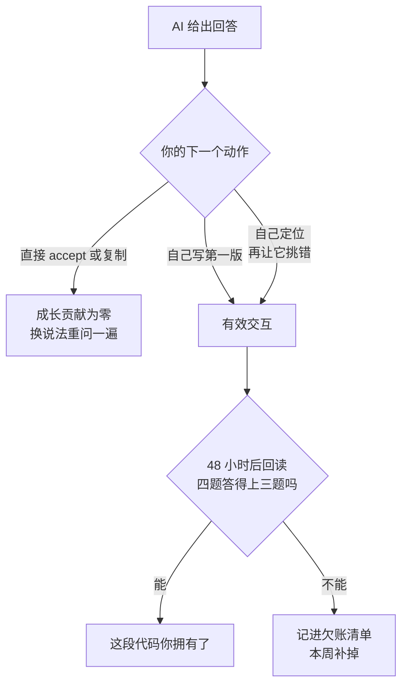

# 073. 天天用 AI 写代码，我是不是在越用越不会写？junior 怎么一边用 AI 一边真长本事

**一句话**：会退化，但决定退化还是成长的不是用不用 AI，而是你对它说什么——把「帮我写完」换成「先讲原理、我来写第一版、你挑错」，再用 48 小时回读测验验证自己是不是真的懂了。

## 30 秒结论

| 你看到的 | 立刻做 | 不想再犯 |
|---|---|---|
| AI 回完话，你的下一个动作是 accept 或 Ctrl+C | 换成让它先解释、由你写第一版 | 每句提示词都要逼出你自己的一个动作 |
| 产出量涨了，就觉得自己在进步 | 做 48 小时回读测验，用分数说话 | 提效和成长分成两根轴，各自记录 |
| 赶时间直接收下了看不懂的 diff | 当天记进欠账清单，本周补掉一条 | PR 描述里必须写「我验证了什么」 |
| 连续几周没有一次卡住的经历 | 每周留一个半天以内的任务全程不开 AI | 卡住 30 分钟再问，是长本事的必要成本 |
| 团队里资深判断只在 senior 脑子里 | 写成 `.claude/agents/` 里的 reviewer subagent 进 git | 标准要能分发，不能靠口头带 |

判断一次交互对成长有没有贡献，只看你的下一个动作：



## 怎么做

### 第一步：今天就换掉这 5 句提示词

这是全篇唯一有实测支撑的分水岭。同一批人里，拿 AI 追问概念、要解释、自己动手实现的得分 65% 以上；把整段活甩给 AI 生成和 debug 的跌破 40%[^1]。左列是后者的说法，右列是前者的。

| 你常说的（反成长，<40 分） | 换成这句（促成长，>65 分） | 说完怎么自检 |
|---|---|---|
| 「帮我把这个功能写完」 | 「先解释这里为什么用 async 而不是线程池，讲完别写代码，我自己写第一版，你再挑错」 | 合上 AI 窗口，能不能口述这段代码的执行顺序（谁先跑、在哪挂起、谁唤醒） |
| 「报错了，你直接改」 | 「别改。告诉我这个报错的根因假设有哪几种、分别怎么验证，我来定位」 | 能不能自己说出「如果是原因 A，我该看哪个日志、加哪句打印」 |
| 「行，就这么改吧」（然后 accept 整个 diff） | 「逐段讲这个 diff 改了什么、有什么副作用、哪一处最可能出问题，我来决定收哪些」 | 能不能指出 diff 里你**主动拒绝**的至少一处改动，并说出拒绝理由 |
| 「这个库怎么用，给我示例」 | 「给我这个库的核心心智模型：它解决什么问题、有哪三个必须记住的约束，示例先不要」 | 不看文档能不能说出这三个约束，以及违反后会出什么症状 |
| 「帮我优化一下性能」 | 「先告诉我怎么测出瓶颈在哪，我跑完把数据给你，再一起决定改哪儿」 | 手里有没有一组「改前 / 改后」的实测数字，而不是一句「快了」 |

判据很简单：**AI 说完之后，如果你的下一个动作是 accept 或复制，这次交互对成长的贡献是零。**右列每一句的共同点，都是逼出你自己的一个动作。

### 第二步：每周留一个裸写任务

挑一个半天以内、非紧急的小任务，全程不开 AI，卡住了先自己顶 30 分钟再问。目的不是效率，是把「痛苦地卡住」这段过程留下来——Anthropic 的建议里明确说，认知上的努力甚至是痛苦地卡住，很可能是培养精通的关键[^1]。

### 第三步：做 48 小时回读测验，别信感觉

这是唯一能戳破「感觉更快」错觉的办法。连资深开发者都会误判：METR 测 16 名资深开发者，用 AI 后实际慢了 19%，自评却是「快了 20%」[^3]。你没有可靠的内部信号，只能用外部测验。

> **48 小时回读测验**
> 从上周合并的 PR 里随机挑一个自己提的，**关掉编辑器和 AI**，只看 PR 标题，在空文档里回答四题：
> 1. 这段代码的执行顺序是什么？（关键分支、异步点各在哪）
> 2. 为什么选了这个方案，被否掉的备选是什么？
> 3. 哪一处最可能出线上问题？为什么当时觉得可以接受？
> 4. 如果要加一个相邻需求，改哪几个文件？
>
> **判据**：四题里答不上 2 题以上，说明这个 PR 你没真正拥有。
> **频率**：每周一次，连续 4 周记分。分数不上升就说明提效没换来成长。

### 第四步：建一个欠账清单

每次因为赶时间直接 accept 了看不懂的 diff，在一个文件（比如 `skill-debt.md`）里记一行：日期 + PR 链接 + 哪儿没看懂。每周挑一条补掉。同时要求自己 PR 描述里必须有一段「我验证了什么」——不是走流程，是逼自己在提交前把理解补上，写不出来就说明还没懂。

### 第五步：把资深判断力沉淀成可分发的 subagent

带人者最容易失效的做法是靠口头带：senior 一忙，junior 就只剩裸 AI。Claude Code 在这个话题上的主场，是用 subagent（带独立上下文和专属系统提示词的专职助手）把审查标准固化成一个能进 git 的文件，放在 `.claude/agents/` 里全队共享，还能用 `tools` 白名单限制它只读。

关键设计是让它输出两段：第一段列代码问题，第二段针对本次改动出 3 个理解检查问题、只出题不给答案。答不上来的，说明这段代码作者还没拥有——这批问题正好当「读懂才 merge」这一关的题库。

<details>
<summary>growth-reviewer.md 完整内容 + 怎么确认生效</summary>

新建 `.claude/agents/growth-reviewer.md`：

```markdown
---
name: growth-reviewer
description: 审查 junior 提交的代码改动，同时输出「你需要补的理解点」。在提 PR 前主动使用。
tools: Read, Grep, Glob
model: sonnet
color: orange
---

你是本仓库的资深 reviewer。你的输出分成固定两段，缺一不可。

## 第一段：代码问题
按严重度倒序列出，每条给出 文件:行号 + 问题 + 建议改法。
重点看：边界条件、错误处理、并发/异步的执行顺序、与本仓库既有约定不一致的地方。

## 第二段：理解检查（必须有）
针对本次改动出 3 个问题，考察作者是否真的理解自己提交的代码：
1. 一个关于执行顺序的问题
2. 一个关于「为什么不用另一种方案」的问题
3. 一个关于「这段代码在什么输入下会挂」的问题
只出题，不给答案。作者答不上来的，说明这段代码他还没拥有。

约束：你只读代码，不修改任何文件。
```

frontmatter 四个要点：

- `tools: Read, Grep, Glob` 是刻意的——只给只读工具，它就物理上改不了代码。省略这一行会继承全部工具，所以必须写。
- `model` 可选 `sonnet` / `opus` / `haiku` / `fable` / 完整模型 ID（如 `claude-opus-5`）/ `inherit`，省略时默认 `inherit`（跟随主会话）。
- `name` 只能用小写字母和连字符，不能含 `:`（`:` 保留给插件作用域名）。
- 只有 `name` 和 `description` 是必填。

**怎么确认生效**：

```bash
ls -1 .claude/agents/          # 预期输出包含 growth-reviewer.md
head -8 .claude/agents/growth-reviewer.md
# 预期：第 1 行和第 7 行都是 ---，中间是 name/description/tools/model/color
git add .claude/agents/growth-reviewer.md && git commit -m "chore: 加 growth-reviewer subagent"
```

然后在会话里显式调用（`@agent-<名字>` 是官方支持的手写形式）：

```
@agent-growth-reviewer 看一下我这次的改动
```

预期返回**两段结构**：先代码问题，再三个理解检查问题。只返回代码问题、没有第二段，说明系统提示词没生效，检查 YAML 头是否闭合。如果 Claude 根本找不到这个 subagent：`.claude/agents/` 目录如果是本次会话开始后才新建的，需要重启 Claude Code 才能被发现；文件已存在时的后续编辑会被自动监听，几秒内生效。

机制详解见 [#032](../04-执行工作流/032-SubAgent并行开几个.md)。

</details>

<details>
<summary>顺手把提示词红线写进 CLAUDE.md（团队默认）</summary>

在项目 `CLAUDE.md` 里加一段，让默认交互方式就是促成长的那种：

```markdown
## 与本仓库协作的默认约定

- 解释优先：被要求实现一个不熟悉的机制时，先用 5 行以内讲清心智模型和关键约束，再问对方要不要你写代码。
- 不主动整段生成：单次改动超过 50 行时，先给方案要点让对方确认，不要直接铺代码。
- diff 必须可复述：给出改动后，附一句「这次改动最可能出问题的地方是 X」。
```

**怎么确认生效**：新开一个会话，问一个你不熟的库怎么用。预期它先给心智模型和约束、并反问要不要写代码，而不是直接吐一大段实现。直接吐代码了，说明 `CLAUDE.md` 没被加载，用 `/context` 确认当前上下文里有没有这个文件。写法细节见 [#010](../02-上下文工程/010-CLAUDE-md怎么写才生效.md)。

</details>

### 带人者额外要做的两件事

1. **提效和成长分开度量。**产出量走 [#071](./071-AI-coding效能怎么度量.md) 那套；成长用上面的 48 小时回读测验，每月记一次分。别用产出涨来推断人在成长。
2. **立「用法红线」，不是「用量红线」。**要禁的不是用 AI，是整块委托不求理解。把第一步那张提示词表塞进 onboarding 和项目 `CLAUDE.md`。

## 为什么

### 两个方向相反的数据，必须同时看

关于 junior 用 AI，市面上流传两组看似打架的结论，其实量的是不同的东西。

**论当周产出，junior 增益更大。**MIT Sloan 对三家公司做的 GitHub Copilot 实验显示，经验少、入职短的开发者更爱用这个工具，产出也涨得更多：junior 完成任务量 +27~39%，senior 只 +8~13%[^2]。这是提效维度。

**论对代码的掌握度，junior 反而受损。**Anthropic 的随机对照实验里，52 名工程师（多为 junior）学一个没用过的异步库 Trio，用 AI 写代码的那组对自己几分钟前刚写的代码做测验平均 50%，手写组 67%[^1]。用 AI 干活速度只快了一点点、还没到统计显著，但理解掉了 17 个百分点。这是成长维度。

并排看，结论就出来了：**AI 让你出活更快，但不自动让你长本事。**混为一谈就会出现最危险的误判——看着产出涨了，以为人也在成长。

### 为什么老手在被放大、新手在被腐蚀

同一个工具对两类人作用相反，根子在判断力谁有谁没有。

Fastly 调查了 791 名开发者：约三分之一的 senior（10 年以上经验）说自己上线的代码里过半是 AI 生成的，是 junior（0~2 年，13%）的约 2.5 倍。原因不是打字快，而是他们能更快识别出 AI 生成的代码在哪里不正确、不安全，或者不适合当前问题[^4]。

这跟 MIT 的「junior 提效更大」不打架：MIT 量的是自动补全时代（2024）的任务完成量，Fastly 量的是 agentic 时代（2025，指 AI 能自主执行多步任务）敢把多少 AI 代码放进生产。敢放靠的是审查判断力，而判断力恰恰是 senior 有、junior 还没长出来的。

新手被腐蚀的机制在于：不是用 AI 就掉分，是「卡住—硬磕—搞懂」这段最长本事的过程被跳过了。**而且这种腐蚀是隐形的**——METR 那组数据说明，当你实际变慢却感觉更快时，你没有任何内部信号能自我修正[^3]。

### 岗位这一层：入门岗在缩，但只留 senior 的结构撑不住

到 2025-07，22–25 岁软件开发者的就业相比 2022 年末的峰值降了约 20%，入门级技术招聘在 2024 年同比降了 25%[^5]。

短期看，senior + AI 能吃掉过去交给 junior 的活，砍掉入门岗省钱很诱人。长期看，senior 只有一个来源——从 junior 长出来。停招 junior，就是把未来几年的 senior 供给一起关掉，而现有 senior 会老去、会跳槽。这不是道德问题，是补给问题。社区把成长路径重构成三段：先不用 AI 直到建立起直觉，再有意识地用 AI 去观察它在哪里失灵，最后成为 AI-native expert。难点也在这：AI 是超个性化的家教，同时也是逃避动手练习的、几乎不可抗拒的诱惑。

## 别这么干

- ❌ **看产出涨就断定「我在成长」。**提效和成长是两根轴，产出涨的同时掌握度可能在掉。用延迟测验测，别用感觉测。
- ❌ **信自己「感觉更快了」的自评。**连资深开发者都被测出「自评 +20%、实则 −19%」。
- ❌ **整段甩给 AI 生成加 debug，或者为省时间取消所有自己磕的机会。**这是跌破 40 分的用法；该甩给 AI 的不是理解，是重复劳动。
- ❌ **团队「AI 能顶活，停招 junior 省钱」。**senior 只有一个来源，就是长大的 junior，停招等于关掉未来几年的供给。
- ❌ **资深判断力只留在 senior 脑子里、靠口头带。**senior 一忙 junior 就裸奔，要用 subagent、`CLAUDE.md`、rules 把标准固化下来。

<details>
<summary>横向对比：三条组织路线，以及谁承载资深判断力</summary>

面对「junior 怎么办」，组织有三条路线：

| 路线 | 做法 | 后果 |
|------|------|------|
| **停招入门岗**（省钱派） | 只留 senior + AI，不招 junior | 账面短期变好；2~5 年后 senior 无来源可补，现有 senior 一流失就补不上。**不推荐** |
| **放养提效**（乐观派） | 照招 junior，随便用 AI 冲产出 | 产出涨、掌握度掉（−17 个百分点），养出「永久新手」，且腐蚀是隐形的 |
| **刻意培养**（推荐） | 招 junior，配「用法红线 + 每周裸写任务 + 延迟测验 + 读懂才 merge」 | 提效与成长兼得；短期带教成本高，长期唯一可持续 |

工具这一层，差别在「资深判断力能不能被分发」：

| 工具 | 承载物 | 差异 |
|------|--------|------|
| **Claude Code** | 可版本化 subagent（`.claude/agents/`）+ 多层 `CLAUDE.md` + `.claude/rules/` | 层级最丰富，判断力可拆成专职 reviewer agent 分发全队，且能用 `tools` 白名单强制只读 |
| **Cursor** | `.cursor/rules/*.mdc`（按文件匹配条件加载） | 规则可按文件类型注入，但没有独立 reviewer agent 的概念 |
| **GitHub Copilot** | `.github/copilot-instructions.md`（单文件） | 无多层级、无条件加载，承载资深判断的粒度最粗 |

</details>

## 延伸

**相关文章**

- [#074 团队的 AI coding 规范怎么立？哪些该强制、哪些该自由？](./074-团队AI-coding规范怎么立.md) —— 本篇讲人才结构怎么变，074 讲团队规矩写什么、哪些该强制
- [#071 AI coding 的效能到底怎么度量？](./071-AI-coding效能怎么度量.md) —— 本篇「提效≠成长」的度量落地在这
- [#040 AI 说「做完了」、测试也全绿，怎么知道代码是真的对？](../05-质量保证/040-怎么验证AI代码是真的对.md) —— 「读懂才 merge」这道成长闸的质量体系版：人最终担责
- [#010 CLAUDE.md 怎么写才真的生效？](../02-上下文工程/010-CLAUDE-md怎么写才生效.md) —— 把资深判断力固化进上下文的载体
- [#032 开几个 agent 并行跑，到底该开几个？](../04-执行工作流/032-SubAgent并行开几个.md) —— 把资深 reviewer 做成可复用 agent 的机制

**参考资料**

- [How AI assistance impacts the formation of coding skills — Anthropic](https://www.anthropic.com/research/AI-assistance-coding-skills) —— 支撑第一步的分水岭（追问 65% vs 甩给 <40%）、50% vs 67% 的主结果、以及「痛苦地卡住是培养精通的关键」（官方研究，Shen & Tamkin，arXiv:2601.20245，2026-01）
- [How generative AI affects highly skilled workers — MIT Sloan](https://mitsloan.mit.edu/ideas-made-to-matter/how-generative-ai-affects-highly-skilled-workers) —— 支撑「junior +27~39%、senior +8~13%」的产出增益对比（研究，2024-11）
- [Measuring the Impact of Early-2025 AI on Experienced OS Developers — METR](https://metr.org/blog/2025-07-10-early-2025-ai-experienced-os-dev-study/) —— 支撑「实际慢 19%、自评快 20%」这一感知落差（研究，2025-07）
- [Senior Developers Ship 2.5x More AI Code — Fastly](https://www.fastly.com/blog/senior-developers-ship-more-ai-code) —— 支撑「senior 敢放进生产的 AI 代码是 junior 的 2.5 倍，差在审查判断力」（调查，791 人，2025-07）
- [AI vs Gen Z — Stack Overflow Blog](https://stackoverflow.blog/2025/12/26/ai-vs-gen-z/) —— 支撑「22–25 岁就业降约 20%、入门招聘降 25%」与「不招 junior 就没有 senior」（社区转引 Stanford 数字经济研究，2025-12）
- [Create custom subagents — Claude Code Docs](https://code.claude.com/docs/en/sub-agents) —— 支撑第五步的文件位置、frontmatter 字段、`@agent-<name>` 调用、新建目录需重启（官方，2026-08 核对）
- [AI is making junior devs useless — HN 47206663](https://news.ycombinator.com/item?id=47206663) —— 支撑「三段成长路径」与「AI 既是家教也是逃避练习的诱惑」（社区，2026-03）
- [The Skill Atrophy Trap — TianPan.co](https://tianpan.co/blog/2026-04-19-skill-atrophy-ai-augmented-engineering) —— 支撑「隐形腐蚀无内部信号可纠偏」与欠账清单（skill-debt tracking）这个做法（社区，2026-04）

[^1]: [How AI assistance impacts the formation of coding skills — Anthropic](https://www.anthropic.com/research/AI-assistance-coding-skills)（官方研究，Shen & Tamkin，arXiv:2601.20245，2026-01）：52 人随机对照实验，AI 组测验平均 50%、手写组 67%；组内分化为追问型 >65%、整段委托型 <40%；并建议保留「痛苦地卡住」的过程。
[^2]: [How generative AI affects highly skilled workers — MIT Sloan](https://mitsloan.mit.edu/ideas-made-to-matter/how-generative-ai-affects-highly-skilled-workers)（研究，Dylan Walsh，2024-11）：经验少、入职短的开发者更常用工具且产出增幅更大，junior +27~39%、senior +8~13%。
[^3]: [Measuring the Impact of Early-2025 AI on Experienced OS Developers — METR](https://metr.org/blog/2025-07-10-early-2025-ai-experienced-os-dev-study/)（研究，2025-07）：16 名资深开发者用 AI 后实际慢 19%，自评快 20%。
[^4]: [Senior Developers Ship 2.5x More AI Code — Fastly](https://www.fastly.com/blog/senior-developers-ship-more-ai-code)（调查，2025-07）：791 人；senior 更能快速识别 AI 代码在哪里不正确、不安全或不适合当前问题。
[^5]: [AI vs Gen Z — Stack Overflow Blog](https://stackoverflow.blog/2025/12/26/ai-vs-gen-z/)（社区，Eira May，2025-12，数字转引 Stanford 数字经济研究，单链路）：22–25 岁软件开发者就业较 2022 年末峰值降约 20%，入门级技术招聘 2024 年同比降 25%。

---

<sub>难度 高级 · 场景题 + 决策题 · 主线 Claude Code，横向 Cursor / Copilot · 个人和带人者都能用，第五步起偏带人者</sub>

<sub>**时效**：Anthropic RCT 与 MIT Sloan 研究于 2026-08-03 复核，均无更新版或后续发表；METR / Fastly / Stack Overflow 数据链接当时全部存活；subagent 的文件位置与 frontmatter 字段按官方 2026-08 版文档核对。**已知不确定**：22–25 岁就业降 20% 的数字由 Stack Overflow 转引 Stanford 研究，单链路；HN 与 TianPan 两条为社区观点，非实证。**易变**：各研究测的时代背景不同（MIT 是补全时代 2024，Fastly / METR 是 agentic 时代 2025），换代后数字会变；subagent 的 frontmatter 字段随版本调整，配置前回查 sub-agents 文档。</sub>

> 本篇个人实践（L4）：`[待补：BOSS 带 junior 的真实组合 / 哪条红线最有效 / 保护区怎么留 / 有没有养出永久新手的教训]`
