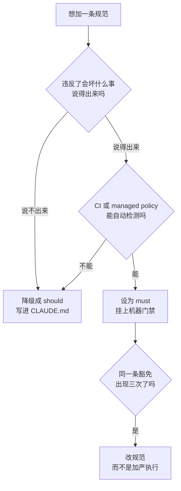

# 074. 团队的 AI coding 规范怎么立？哪些该强制、哪些该自由？

**一句话**：只把「违反就出事、且机器能检测」的条款设成强制并挂上 managed settings 或 CI 门禁，其余一律降级成 should 写进 CLAUDE.md；规范范围要覆盖所有让 AI 产出进入交付链路的人，不只研发。

## 30 秒结论

| 你看到的 | 立刻做 | 不想再犯 |
|---|---|---|
| 规范里写着「负责任地使用 AI」这类空话 | 逐条问「违反了会坏什么事、CI 能不能查出来」，答不上来的降级成 should | 每加一条强制项都先过这两问 |
| 强制项只躺在 Confluence 或 PDF 里 | 挂到 managed settings、linter、CI 分支保护上 | 没挂机器门禁的 must 一律按 should 记 |
| 规范有一两百条、豁免流程还慢 | 砍到只剩「违反就坏事」的几条，其余转 should | 条数越多、豁免越慢，绕过率越高 |
| 同一条豁免申请出现了三次 | 改规范：要么批准一个受治理的工作流，要么把禁令写清楚 | 豁免是信号不是漏洞，按季度复盘 |
| 产品或管理层拿 AI 出的方案直接压排期 | 要求方案标明哪部分是 AI 生成，并附已核对的接口清单 | 「人对产出负责」要覆盖所有进交付链路的 AI 产出 |
| 被要求按「提示词条数 / AI 生成行数」考核 | 换成结果口径：交付周期、缺陷率、review 一次通过率 | 用量指标奖励拆碎和生成再删 |
| 不知道这一版规范该管什么 | 用第零交付物的症状表定位卡在验证 / 信任 / 编排哪层 | 先诊断再立规范，别治不存在的病 |

一条规则该强制还是该自由，只走这个流程：

## 怎么做

### 第零交付物：先诊断卡在哪层，再决定规范往哪写

立规范之前先做一件事：搞清楚团队现在真正卡在哪。跳过这一步，写出来的规范多半是在治不存在的病。

判断工具是下面这张症状表。三层是有依赖顺序的——**验证是地基，信任建在验证之上，编排在最顶**。没有可重复的验证证据，信任无从谈起；信任没校准，多 agent 编排必然崩[^5]。所以诊断出的最低那一层就是你这一版规范该管的地方，往上写没用。

| 团队里听到的原话 | 卡在哪层 | 这一版规范该写什么 |
|---|---|---|
| 「AI 写的代码不敢直接合并」 | **验证层**（没有能判定对错的证据） | 把「任务必须有机器可判的验收标准」和 CI 门禁设成 must，见第一交付物 |
| 「review 的时候忍不住自己重写一遍」 | **信任层**（信任没校准，非黑即白） | 写分级信任与责任归属：哪类代码可以只看结果、哪类必须逐行读；AI 产出由提交者负责 |
| 「一个 agent 还行，多个就乱」 | **编排层**（状态和分工没设计） | 写任务粒度、上下文传递、人在哪个 gate 上介入 |
| 「用了半年，效率没明显提升」 | 多半仍是**验证层**，返工吃掉了红利 | 别加规范，先把验证补上 |

三层各自要具备什么（诊断出来之后照这个补）

| 层 | 要具备的 | 常见缺口 |
|---|---|---|
| **验证（地基）** | 机器可判的完成标准（可执行断言 / BDD）；分钟级 CI；单测 / 集成 / E2E / 性能 / 安全分层各管各的风险 | 「验证者悖论」——测试也是 AI 写的。用 mutation testing（故意改坏代码看测试能不能抓到）反向校验测试质量。CI 要 30 分钟，L3 级的 agent 自主闭环就不成立 |
| **信任（中层）** | 分级信任而非全信/全不信（样板代码可以高、核心业务中等、安全与资金最低）；AI 改了什么为什么必须可见；团队共享的失败模式库（长上下文遗忘、幻觉 API、过时库版本） | 责任归属没写死，出事时「AI 写的」成了挡箭牌。正确口径是 AI 产出 = 提交者负责 |
| **编排（顶层）** | 任务粒度切到「一个 agent 能独立完成且可独立验证」；agent 间上下文怎么传；人嵌在关键 gate 上而不是全程监工；产出可回滚可断点续 | 跳过验证直接堆 agent。这是最常见的翻车方式 |

信任不是态度问题，是验证层给出的可重复证据。规范里写「要信任 AI」或「不要过度信任 AI」都是空话，只有把证据链写出来才可执行。

### 第一交付物：强制 vs 自由分类表

原则只有一条：只强制「违反就坏事」的，其余留自由。must 指违反会破坏代码库、触发安全或法律风险的条款，should 指风格、上下文、个人判断。

**该强制（must，且尽量机器门禁）**

| 强制项 | 为什么必须硬 | 落地手段（非纸面） |
|--------|-------------|-------------------|
| **安全红线**：禁止把密钥、客户数据、受监管数据、专有源码贴进未批准工具；禁止用个人或消费账号写公司代码 | 数据外泄不可逆 | managed policy 的 deny 规则 + secrets 扫描 + DLP，细节见 [#072](./072-AI-coding安全红线.md) |
| **高危代码强制人审**：认证、加密、支付、隐私、基础设施的 AI 改动，合并前须指定 senior 或安全 owner 签字 | 出事代价最高 | 按风险分级触发（见第二交付物），CI 分支保护卡门禁 |
| **agentic 硬限**：不得部署生产、改基础设施、改密钥、改访问控制、跑破坏性命令，除非有显式人批准加审计日志 | 自主 agent 的高危动作不可回滚 | 权限 deny + approval gate（managed policy） |
| **人对产出负责**：提交或批准 AI 辅助工作的人对结果负责，不得合并自己解释不了的 AI 代码 | 责任不能转嫁给 AI | PR 模板 + review 纪律，机制见 [#040](../05-质量保证/040-怎么验证AI代码是真的对.md) |
| **上游产出同样适用**：AI 写的需求、技术方案、排期，提出者要能自己解释每一条并标明哪部分是 AI 生成；接口和数据结构须与现有系统对齐后才能进排期 | 幻觉方案会一路传到交付端，下游只能被动接单 | 方案模板加「AI 参与标注」和「已核对的接口清单」两栏，技术评审是这条的门禁 |
| **工具/模型白名单**：批准的工具（企业档 Cursor/Copilot、带内部端点的 Claude Code）对禁止的工具（个人 ChatGPT、浏览器插件、个人邮箱的免费 API key） | 影子 AI 等于影子风险 | 采购或网关层强制 + managed policy |

**该自由（should / 开发者判断）**

| 自由项 | 为什么别强制 |
|--------|-------------|
| **具体工作流**（先 plan 还是直接写、开不开 plan mode、派不派 SubAgent） | 因人因任务而异，强制反而降效；把「要有验证」设成 must，把「怎么走到验证」留自由 |
| **低风险场景的模型选择** | 内部工具或一次性脚本用哪个模型，交给成本判断，见 [#060](../07-效率与成本/060-一天该烧多少额度.md) |
| **个人偏好**：statusline、快捷键、本地实验配置 | 与团队一致性无关，强制只增摩擦 |
| **风格细节里「选哪个」**：snake_case 还是 camelCase | 选哪个不重要，全组一致才重要[^3]。所以这类是「一致性要强制、具体选项自由约定」：写进 CLAUDE.md 让 agent 统一，而不是逐条人审 |
| **AI 参与的披露粒度** | 别要求每次 autocomplete 都披露，只对实质性改动、高危代码、agentic 动作要求[^2]。披露开销要与真实风险成比例 |

### 第二交付物：风险分级的 review 触发

强制不是「一刀切最严」，而是按风险分层。触发条件必须无歧义，否则工程师会默认走最低档。

| 风险档 | 工作类型 | 强制 review |
|--------|---------|------------|
| **AI 审即可** | 内部文档、测试夹具（测试用的假数据、mock 对象） | 无需人审 |
| **单个人审** | 非关键应用代码 | 一名工程师 |
| **指定 senior + 显式签字** | 基础设施、认证、支付、客户数据 | 强制 senior |

第一档有个例外要点名：**测试逻辑本身不算测试夹具**。测试断言、边界用例、以及任何被拿来当「质量已验证」证据的测试，都要人看过，理由见 [#071](./071-AI-coding效能怎么度量.md)。review 流程本身怎么改（PR 体量、reviewer 疲劳）归 [#053](../06-工程协作/053-AI的PR太大没法review.md) 和 [#041](../05-质量保证/041-怎么审查AI生成的代码.md)，本篇只定「哪档触发强制」。

### 第三交付物：用 Claude Code 三层设置把强制变成硬门禁

三层设置正好对应「强制 / 团队默认 / 个人自由」三档。官方给出的优先级从高到低是：Managed（最高，不能被任何东西覆盖）→ 命令行参数 → Local → Project → User[^1]。

| 层 | 放什么 | 对应规范档 |
|----|--------|-----------|
| **Managed settings**（IT 部署，不可覆盖） | 安全 deny 规则、工具白名单、agentic 硬限、禁 bypass | **强制（must）** |
| **Project settings**（`.claude/settings.json`，进 git 全组共享） | 团队默认权限、hooks、MCP，加上项目 CLAUDE.md 里的命名和技术栈约定 | **团队默认（should，可议）** |
| **User / Local settings**（`.claude/settings.local.json`，不进 git） | 个人偏好、本地实验 | **个人自由** |

把强制变硬，靠两把只在 managed settings 生效的锁[^1]：`allowManagedPermissionRulesOnly` 让 user 和 project 设置无法定义 allow / ask / deny 规则，只有 managed 里的规则生效；`allowManagedHooksOnly` 只加载 managed hooks 与在 managed `enabledPlugins` 里强制启用的插件 hooks，其余全部屏蔽。还有一条底层规则：deny 优先于 allow，且跨层时下层的 allow 翻不了案，这是安全红线能真正强制的关键（deny 细节归 [#072](./072-AI-coding安全红线.md)）。

落地四步：

1. 团队默认（should）写进仓库根的 `.claude/settings.json` 和项目 `CLAUDE.md`，命名、技术栈、错误处理约定都放这里，让 agent 统一续写（写法见 [#010](../02-上下文工程/010-CLAUDE-md怎么写才生效.md)）。
2. 硬红线（must）交给 IT 用 managed-settings.json 部署（走 MDM / Jamf / Intune / Group Policy，或 Team 档的 server-managed settings），并配上 `allowManagedPermissionRulesOnly`。
3. 个人偏好留在 `settings.local.json`，别进 git。
4. 在 CI 挂 linter 和 secrets 扫描。纸面上的 must 只有挂上机器门禁才算真强制，这呼应 [#040](../05-质量保证/040-怎么验证AI代码是真的对.md) 的「约束层当独立真值源」。

**怎么确认生效**：在 Claude Code 里跑 `/status`，Setting sources 一行会列出每个生效层及投递渠道（Enterprise managed settings、file 等）。看不到 managed 那一层，说明策略没推下来。再补一次实测：让 Claude 跑一条你 deny 掉的命令，预期被直接拒绝而不是弹批准框；在项目 `.claude/settings.json` 里手动加一条 allow 试图放行同一命令，开了 `allowManagedPermissionRulesOnly` 之后这条 allow 应该完全不起作用。

### 第四交付物：把规范当活文档运营

四条运营纪律（第一版不求完美 / 协作可编辑 / 豁免是信号 / 别顶替确定性工具）

- **第一版不求完美。**第一版编码规范不会产出完美的 agentic 代码，那些失败就是反馈[^4]。
- **保持协作可编辑。**把标准文件当成和工程团队的一场对话，让所有人都能编辑、评论、更新[^4]。
- **豁免是信号，不是漏洞。**同一个豁免出现三次，要么批准一个受治理的工作流，要么把禁令写得更清楚[^2]。
- **别让规则文档顶替确定性工具。**linter、formatter、静态分析在流水线里仍有一席之地，它们能抓住 agent 搞砸的基础问题[^4]。

如果你是被 mandate 的那一方（不需要任何审批就能做的五件事）

上面四份交付物都要拍板权。如果你是被规范约束、或被自上而下要求「必须用 AI」的那一方，下面这几条今天就能做。

**一，收到含糊规范时，别在群里吐槽，去问「这条怎么机器检测」。**把「负责任地使用 AI」这类条款逐条提回去：违反了会坏什么事、CI 能不能查出来。答不上来的建议降级成 should 写进 CLAUDE.md。话题落在「怎么写才可执行」会被当成建议，落在「我不想被管」会被当成抵触。

**二，被规范拦住时走豁免流程，并且留记录。**同一条豁免申请出现三次，就是规范该改的信号，你把三次记录摆出来比讲道理有力。绕过规则则相反——一次绕过就把这条证据链毁了。

**三，自己团队先把 should 那半边落地，不用等公司批。**在仓库根写 `.claude/settings.json` 和项目 `CLAUDE.md`，把命名、技术栈、错误处理约定定下来；个人偏好放 `settings.local.json` 不进 git。这两步不需要任何 IT 权限，却能解决「每个人的 agent 各走各的」这个最常见的问题。等公司的强制层下来时，你这部分正好是对方要的团队默认。

**四，收到上游用 AI 生成的方案时，把核对成本摆到台面上。**两个可执行做法：一是「谁定义谁负责」，他用 AI 出方案、你用 AI 实施；二是用推理模型把方案反向挑一遍刺，列出具体的 P0/P1 问题清单再打回。第二条更实用——你交回去的不是「这方案不行」，而是「这 5 个接口不存在、这 3 处和现有表结构冲突」。有清单才叫评审意见，没清单只会被当成不配合。

**五，别接受基于 AI 使用量的考核指标。**如果考核的是「提示词条数」「AI 生成代码行数」这类用量，正确的提法不是拒绝用 AI，而是把指标换成结果口径：交付周期、缺陷率、review 一次通过率。用量指标的问题很具体——它奖励把活儿拆碎、奖励生成再删掉，和「人对产出负责」直接冲突。度量口径的完整论证见 [#071](./071-AI-coding效能怎么度量.md)。

## 为什么

### 没有基线，每个人的 agent 各走各的

不立规范的真正问题不是 AI 写的代码有多烂，而是一致性会塌方。没有标准时，每个开发者的 AI agent 会做出不同的决定：一个用 Jest 一个用 Mocha，一个照你的错误处理模式写、一个自己发明一套。代码都能跑，但代码库会越来越难懂。

Augment 把这个张力说得直白：代码库模式一致时，AI 助手是力量倍增器；模式不一致时，它们是混乱放大器[^3]。道理很简单，AI 会照着代码库里已有的模式续写，规范就是喂给它的那套「已有模式」。

### 空话和大部头都会失败

有了规范也可能失败，通常有两种失败方式。

第一种是空话，比如「负责任地使用 AI」——含糊的政策没法执行，只会被绕过。第二种是禁令式大部头：规则条数越多、豁免流程越慢，绕过率就越高；工程师只会采纳那些让安全路径比绕路更省事的规则[^2]。

所以规范的设计目标不是覆盖所有情况，而是让该强制的少而硬、其余留自由。2026 年的主流治理范式叫 bounded autonomy（有边界的自主），包含三件事：给 agent 明确的操作边界、对高风险决策强制升级到人来批准、保留完整审计轨迹。翻译成一句话：agent 能自主做什么、什么必须人批准，这条线要画出来，线以内放手、线以外强制。

### 规范只管写代码的人，上游会漏掉

多数团队的 AI 规范只写给研发，但用 AI 的不止研发。V2EX 上一个 64 回复的帖子讲的就是这种情况：产品经理用 AI 生成十几页技术方案，里面是不存在的功能和接口，跟现有数据结构也对不上，末尾还附了一份 AI 估的排期，老板对这位 PM 很信任，方案就这么往下压。另一个帖子把链路补全了：领导、产品、开发、测试全都在用 AI，结果是「从头到尾，没人认真读过那个规划，包括领导」。

这说明一件事：「人对产出负责」如果只写在研发那一栏，就会出现一个缺口——上游用 AI 出的方案没人为准确性负责，下游却要按它排期交付。所以立规范时要先答一个问题：这份规范管到谁？范围应该是「所有让 AI 产出进入交付链路的人」，而不是「所有写代码的人」。

## 别这么干

- ❌ **写「负责任地使用 AI」这类空话当规范。**不可执行、会被绕过。规范要点名具体工具、具体数据类、具体工作流。
- ❌ **把 must 停在 Confluence 文档里。**Confluence 里放个 PDF 改变不了行为，强制项没挂机器门禁就等于没强制；同理，靠规则文档替代 linter 和 CI 也不成立。
- ❌ **规范写成大部头、豁免流程又慢。**条数越多、豁免越慢，绕过率越高。慢豁免是政策失败，不是安全特性。
- ❌ **风格细节逐条人审，或要求每次 autocomplete 都披露。**披露开销要与真实风险成比例；snake_case 还是 camelCase 写进 CLAUDE.md 让 agent 统一，别耗人审。
- ❌ **规范只写给写代码的人，或按 AI 使用量考核。**上游用 AI 出的方案没人负责准确性，下游就要按幻觉排期；用量指标则奖励拆碎和生成再删，两者都和「人对产出负责」冲突。

换成 Cursor / Copilot 呢

| 工具 | 「强制」机制 | 差异 |
|------|-----------|------|
| **Claude Code** | managed-settings.json（MDM 或 server-managed）加 `allowManagedPermissionRulesOnly` 硬锁，deny 跨层不可翻案 | 三层设置天然对应强制/默认/自由，IT 可部署不可覆盖层 |
| **Cursor** | Team/Enterprise 的 admin 规则加 Cursor Rules 全员分发 | 规则以引导 agent 风格为主，硬权限边界依赖底层模型厂商条款 |
| **GitHub Copilot** | 企业策略（组织级开关、内容排除、代码引用过滤） | 偏「哪些能用、哪些内容不喂」，代码库风格一致性靠外部 linter |

共性一句话：团队一致性这类软约束，靠共享规则文件（CLAUDE.md / Cursor Rules）加 linter；安全和高危这类硬约束，靠 IT 可部署、不可覆盖的 managed policy。两类别混。

## 延伸

**相关文章**

- [#072 AI coding 的安全红线怎么画？](./072-AI-coding安全红线.md) —— 本篇「安全红线强制项」的细节与真实事故在 072
- [#053 AI 生成的 PR 太大太多，review 机制怎么扛住不崩？](../06-工程协作/053-AI的PR太大没法review.md) / [#041 怎么 review AI 生成的代码？](../05-质量保证/041-怎么审查AI生成的代码.md) —— 本篇只定「哪档触发强制人审」，review 流程本身在这两篇
- [#040 AI 说「做完了」、测试也全绿，怎么知道代码是真的对？](../05-质量保证/040-怎么验证AI代码是真的对.md) —— 把 linter 和扫描当「约束层独立真值源」挂进强制门禁
- [#071 AI coding 的效能到底怎么度量？](./071-AI-coding效能怎么度量.md) —— 度量口径本身也要写进规范；「测试该不该人审」两篇口径以 071 为准
- [#010 CLAUDE.md 怎么写才真的生效？](../02-上下文工程/010-CLAUDE-md怎么写才生效.md) —— 团队默认（should）落地在 CLAUDE.md：文件级写法在 010，本篇是组织级政策框架
- [#052 AI 写代码怎么和 git 流程配合？](../06-工程协作/052-别让AI搞乱git仓库.md) —— commit 署名和披露的操作层
- [#060 额度怎么突然就没了？先算清自己一天该烧多少](../07-效率与成本/060-一天该烧多少额度.md) —— token 账单和预算上限

**参考资料**

- [CC Docs: Settings](https://code.claude.com/docs/en/settings) —— 支撑第三交付物：五层优先级（Managed 最高且不可覆盖）、`allowManagedPermissionRulesOnly` / `allowManagedHooksOnly` 两把锁、project 与 local 的定位（官方，2026）
- [Metacto: AI Usage Policy Template for Developers 2026](https://www.metacto.com/blogs/creating-effective-ai-usage-policies-for-development-teams) —— 支撑 must/never 清单、人对产出负责、agentic 硬限、「禁令式规范会失败」、豁免三次即改规范、披露与风险成比例（从业者指南，2026-07）
- [GoGloby: AI Policy for Software Teams 2026](https://gogloby.com/insights/ai-policy/) —— 支撑工具白名单与禁用清单、风险分级 review 触发、「含糊政策不可执行」（从业者指南，2026-06）
- [Augment Code: Enterprise Coding Standards — 12 Rules for AI-Ready Teams](https://www.augmentcode.com/guides/enterprise-coding-standards-12-rules-for-ai-ready-teams) —— 支撑「力量倍增器 vs 混乱放大器」与「命名选哪个不重要、一致才重要」（从业者指南，2025-09 发布 / 2026-06 更新）
- [Stack Overflow Blog: Building shared coding guidelines for AI (and people too)](https://stackoverflow.blog/2026/03/26/coding-guidelines-for-ai-agents-and-people-too/) —— 支撑第四交付物：第一版不完美、标准文件当团队对话、别放弃 linter/formatter（社区，Ryan Donovan，2026-03）
- [V2EX 1229246: 产品经理开始用 AI 做「技术方案」了](https://www.v2ex.com/t/1229246) —— 支撑「为什么」第三节的上游案例，以及被 mandate 一方的「谁定义谁负责」「反向挑刺再打回」两条做法（社区，2025-07，2026-08-03 实访核实）
- [V2EX 1221898: IT 团队没人愿意动脑子了](https://v2ex.com/t/1221898) —— 支撑「全链路依赖 AI、没人认真读过那个规划」与「脑子可以外包，责任不能外包」（社区，2026-08-03 实访核实）
- 《AI 原生团队：成熟度光谱与转型诊断框架》—— 支撑第零交付物的验证 / 信任 / 编排三层依赖、症状对层的映射表，以及三层各自的构成要件（个人研究，2026-07，未公开）
- [IBM: Standardize AI Code Generation Across Your Development Team](https://www.ibm.com/think/insights/standardize-ai-code-generation-across-your-development-team) —— 支撑「无标准时每个 agent 各走各的（Jest vs Mocha）」与 bounded autonomy 三要件（从业者综述，2026；页面 403 反爬，内容经搜索返回、未逐字二次核验）

[^1]: [CC Docs: Settings](https://code.claude.com/docs/en/settings)（官方，2026）：设置优先级 Managed > 命令行参数 > Local > Project > User，Managed 不能被任何东西覆盖；`allowManagedPermissionRulesOnly` 阻止 user/project 定义 allow、ask、deny 规则；`allowManagedHooksOnly` 只加载 managed 及 managed 强制启用插件的 hooks。
[^2]: [Metacto: AI Usage Policy Template for Developers 2026](https://www.metacto.com/blogs/creating-effective-ai-usage-policies-for-development-teams)（从业者指南，2026-07）：Confluence 里放个 PDF 改变不了行为；伪装成治理的禁令会失败，工程师只采纳让安全路径比绕路更省事的规则；同一豁免出现三次即应修改规范；披露要求与真实风险成比例。
[^3]: [Augment Code: Enterprise Coding Standards — 12 Rules for AI-Ready Teams](https://www.augmentcode.com/guides/enterprise-coding-standards-12-rules-for-ai-ready-teams)（从业者指南，2025-09 发布 / 2026-06 更新）：模式一致时 AI 助手是 force multipliers，不一致时是 chaos amplifiers；命名风格选哪个不重要，全组一致才重要。
[^4]: [Stack Overflow Blog: Building shared coding guidelines for AI (and people too)](https://stackoverflow.blog/2026/03/26/coding-guidelines-for-ai-agents-and-people-too/)（社区，2026-03）：第一版规范不会完美，失败就是反馈；标准文件应可被全员编辑评论；不要因此放弃 linter、formatter 等确定性执行器。
[^5]: 个人研究（2026-07，AI 原生团队成熟度与转型诊断框架）：验证 / 信任 / 编排三层自下而上依赖，验证是地基；症状对层的映射（不敢合并 = 验证层、review 时自己重写 = 信任层、多 agent 就乱 = 编排层、效率没提升多半仍卡验证层）来自团队一线观察，非公开研究结论。

---

难度 中级 · 决策题 + 配置题 + 流程题 · 主线 Claude Code，横向 Cursor / Copilot · 主要面向团队负责人与 Tech Lead，不是决策者可直接看「被 mandate 的那一方」折叠块

**时效**：官方 settings 引用（五层优先级、`allowManagedPermissionRulesOnly` / `allowManagedHooksOnly`）于 2026-07-18 巡检复核并与现行文档一致；两条 V2EX 社区素材于 2026-08-03 实访核实；外链当时全部存活。第零交付物的三层诊断表于 2026-08-04 从一手研究笔记录入。**已知不确定**：验证 / 信任 / 编排三层框架与症状映射出自个人一手研究与团队一线观察，不是公开研究结论，别当行业标准引用；IBM 那篇因 403 反爬未能逐字二次核验，「bounded autonomy」与「Jest vs Mocha」两处依赖它；GoGloby、Metacto、Augment 均为厂商或从业者指南，非实证研究。**易变**：managed settings 的具体键名与 server-managed settings 的可用版本随官方更新，配置前以 settings 文档为准；「强制/自由怎么划」的框架不依赖具体版本。

> 本篇个人实践（L4）：`[待补：BOSS 团队的强制清单实际几条 / 哪条最先落 managed policy / 哪条从强制降回自由 / 豁免流程踩过的坑]`
