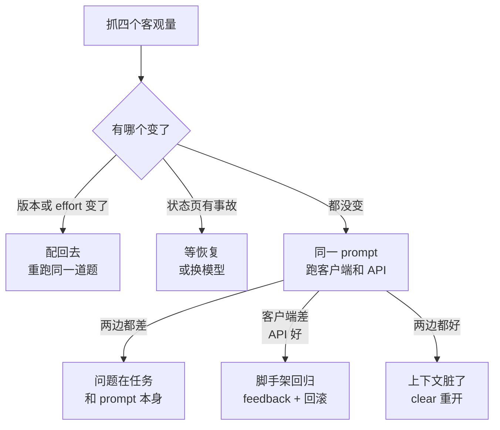

# 080. 今天 Claude Code 是不是变笨了？——怎么分清模型降级、effort 降档和自己用法退步

**一句话**：先抓四个客观量（客户端版本、effort 级别、状态页、上下文占用），再拿同一段 prompt 在 Claude Code 和 API 各跑一次做对照——分不清「工具变了」还是「我变了」之前，别发帖，也别加钱换更贵的模型。

## 30 秒结论

| 你看到的 | 立刻做 | 不想再犯 |
|---|---|---|
| 同类任务从一次过退化成来回三轮；回答从给 diff 退成「你可以考虑…」；CLAUDE.md 里写死的约定被无视 | 抓四个客观量：`claude --version`、会话头 effort、status.claude.com、`/status` 里的上下文占用 | 模型名、effort、更新频道全部写进 settings 钉死 |
| 四个量里有一个变了（版本刚自动更新过 / effort 从 high 掉到 medium） | 显式配回去，重启后跑同一道回归题 | `autoUpdatesChannel: stable` + `minimumVersion` |
| 四个量都没变 | 同一段自包含 prompt，Claude Code 跑一次、API 跑一次 | 仓库里放 3–5 道自己项目的回归题 |
| Claude Code 差、API 好 | 问题在客户端脚手架：提 `/feedback`，必要时回滚版本 | 回滚的同时必须关掉自动更新 |
| 两边都好 | 是这次会话的上下文脏了，`/clear` 重开 | 见 [#012 上下文窗口要爆了](../02-上下文工程/012-上下文窗口要爆了.md) |



## 怎么做

顺序不能反：先排查，后 workaround。第 1–4 步不依赖版本，长期有效。

### 第 1 步：抓四个客观量（2 分钟）

在症状出现的当下立刻记录，事后补记没有意义：

```bash
claude --version            # 例如 2.1.211 (Claude Code)
claude doctor               # 安装健康度、settings 校验错误、最近一次自动更新结果
```

会话里再看两处：**会话头部**模型名旁边的 effort 标记（例如 `with low effort`），以及 `/status` 里的账号、模型、上下文占用百分比。最后开 [status.claude.com](https://status.claude.com/)，它按 claude.ai / Claude API / Claude Code 分服务列状态。

**怎么确认做到位**：你手上有四个能写下来的具体值——版本号、effort 级别、状态页有无 incident、上下文百分比。四个说不出一个，就还没到能下结论的时候。

### 第 2 步：客户端 vs API 对照（10 分钟）

这个实验设计是从官方 4 月复盘里直接抄的：那次事故 API 直连全程正常，只有 Claude Code / Agent SDK / Cowork 受影响[^1]。所以两边一对照，就能把「模型侧」和「客户端脚手架侧」分开。

1. 把能稳定复现问题的任务写成一段自包含 prompt（必要代码片段贴进去）。
2. 在 Claude Code 里跑一次，存下结果。
3. 同一段 prompt 发给 API 或 claude.ai，用同一个模型。

**怎么读结果**：两边都差 → 问题在任务本身或 prompt，去第 4 步；客户端差、API 好 → 脚手架回归，去第 3、5 步；两边都好 → 原会话上下文污染，`/clear` 重开。

### 第 3 步：把变量钉死（一次性配置）

「变笨」难查的根因是变量太多。别名（`opus` / `sonnet`）会随时间指向新版本，写进配置的就不是你以为的模型了：

```json
// ~/.claude/settings.json
{
  "model": "claude-opus-5",
  "effortLevel": "high",
  "autoUpdatesChannel": "stable",
  "minimumVersion": "2.1.100",
  "env": { "ANTHROPIC_DEFAULT_OPUS_MODEL": "claude-opus-5" }
}
```

`autoUpdatesChannel: stable` 比 latest 大约晚一周，会跳过有重大回归的版本；`minimumVersion` 是下限，自动更新和 `claude update` 都不会装低于它的版本，所以从 latest 切到 stable 不会把你降级[^2]。

`effortLevel` 在 settings 文件里只接受 `low` / `medium` / `high` / `xhigh`。`max` 和 `ultracode` 是会话级的，settings 不收；要长期用 `max` 得走环境变量 `CLAUDE_CODE_EFFORT_LEVEL`（环境变量优先级高于所有其他设置方式）[^3]。

**怎么确认做到位**：重启后 `/model` 显示的是完整模型名而不是别名，会话头显示的 effort 是你配的级别，`claude doctor` 不报 settings 校验错误。

### 第 4 步：建一个自己的回归集（最值钱的一步）

不用 300 道 SWE-bench。三到五道**你自己项目里的真实题目**就够，每道题满足三条：5 分钟内能跑完；有明确对错判据（测试通过 / 输出匹配 / 改动文件数正确）；三种类型各覆盖一道——纯理解题、多文件改动题、要求遵守 CLAUDE.md 约定的题。

放进仓库 `bench/` 目录，每题一个 `prompt.md` 加一个期望说明。出现第 1 步表格里那些症状时，在**干净会话**里跑一遍：

```bash
cd /path/to/your/repo
claude -p "$(cat bench/01-explain/prompt.md)" --model claude-opus-5 --effort high
```

`-p` 是非交互模式，一次性出结果，方便存档对比。非交互模式下 `/effort` 设的级别不保存为默认，所以显式带 `--effort` 更稳。

**怎么确认做到位**：你能拿出「同一道题，上周这样答，今天这样答」的两份文本。回归集全过 = 问题在这次会话的上下文，不在工具。

### 第 5 步：确认是客户端回归之后

1. **提 `/feedback`**。官方在 4 月复盘里明确说这是他们定位问题的关键渠道。带上第 1 步的四个量和第 4 步的两份文本，比一句「变笨了」有用得多。
2. **回滚 + 同时关掉自动更新**（见下面折叠块）。
3. **等修复，别硬扛**。4 月那三项问题分别在 4 月 7 日、4 月 10 日（v2.1.101）、4 月 20 日（v2.1.116）修完[^1]。硬用一个已知有回归的版本干重活，把活推后一天通常更划算。

<details>
<summary>怎么回滚版本（版本号是历史示例，别照抄，核实于 2026-08）</summary>

原生安装器支持指定版本号：

```bash
curl -fsSL https://claude.ai/install.sh | bash -s 2.1.89
claude --version   # 应打印 2.1.89 (Claude Code)
```

npm 装的话是 `npm install -g @anthropic-ai/claude-code@<版本>`。

回滚后必须同时停掉自动更新，否则第二天又被更回去：

```json
{ "env": { "DISABLE_AUTOUPDATER": "1" } }
```

`DISABLE_AUTOUPDATER` 只停后台检查，`claude update` 仍能手动跑；要连手动路径一起封死才用 `DISABLE_UPDATES`。另外注意：如果你按第 3 步配过 `minimumVersion` 且目标版本低于它，自动更新和 `claude update` 都会拒装低于下限的版本，走这条路回滚前要先删掉或下调该项（用安装脚本直接装指定版本不受此限）。

**怎么确认做到位**：回滚后跑回归集，判据回到旧水平。回滚了还是差，说明不是版本问题，回第 2 步重做对照。

</details>

<details>
<summary>effort 的三个行为细节（最常被误当成「变笨」）</summary>

- **默认值随模型不同**。支持 effort 的模型默认是 `high`，但 Opus 4.7 默认 `xhigh`[^3]。切模型时 effort 跟着变——你没动任何配置，行为却变了。
- **级别不跨模型可比**。同一个名字在不同模型上代表的实际值不同；模型不支持你设的级别时会落到它支持的最高档（`xhigh` 在 Opus 4.6 上跑成 `high`）。
- **prompt 里写 `ultrathink` 只是加一条上下文指令**，发给 API 的 effort 级别不变；`think hard` / `think more` 这类说法完全不是关键词，就是普通文本[^3]。别把它当算力开关。

会话内可用的相关命令：`/model` 看当前模型和 effort，`/effort` 直接设级别（`/effort auto` 恢复模型默认），`/status` 看账号与上下文，`/feedback` 提报。

</details>

## 为什么

### 四个原因长得一模一样

**模型输出本身有方差。** 同一 prompt 跑两次结果不同是常态，单次体验的信噪比接近零。

**客户端会悄悄变。** 你用的不是模型，是「模型 + 系统提示词 + 上下文管理策略 + effort 配置」这一整套脚手架。Claude Code 默认后台自动更新、下次启动生效，昨天和今天跑的可能不是同一个客户端。

**事故只影响一部分人。** 2025 年 8 月那次，部分 Sonnet 4 请求被误路由到为 100 万上下文配置的服务器，8 月 31 日最差时段约 16% 的 Sonnet 4 请求受影响[^4]。所以「只有我觉得变笨」不等于「是我的错」，「群里一片说变笨」也不等于「一定是官方的锅」。

**你的用法在漂移。** 项目变大、CLAUDE.md 越写越长、会话跑到 80% 上下文才想起来清、开始一句话让它改十个文件。这些变化是渐进的，人察觉不到，对模型来说难度却是阶跃上升。

### 真发生过降级，降的是脚手架不是模型权重

2026 年 4 月那次，官方复盘认定三项变更：3 月 4 日把 Claude Code 默认 reasoning effort 从 high 降到 medium；3 月 26 日清理闲置会话旧思考的改动有 bug，变成每轮都清；4 月 16 日一条「减少啰嗦」的系统提示词让编码质量掉了 3%[^1]。模型权重一个字没动，用起来确实变差了——这也是为什么第 2 步的对照实验管用。

<details>
<summary>社区量化尝试的两个坑</summary>

有人分析自己 6852 个会话的 JSONL 日志，统计「读文件次数 / 编辑次数」比值、循环推理次数、用户打断次数；也有人每天跑 SWE-bench 子集追踪曲线。方向是对的——把感受换成能重放的数字——但都被指出过问题：前者的 thinking 长度指标理解错了（`redact-thinking` 是纯 UI 层隐藏，不改思考预算）；后者只用 50 道题，被 SWE-bench 作者当场指出方差太大，要 300 题、每天跑 5 到 10 次才有统计意义。

结论很朴素：你不需要统计学上严谨的 benchmark，只需要一组能重放、能对照的固定题目，够你分清「工具变了」还是「我变了」。

</details>

## 别这么干

- ❌ **凭一次糟糕的会话下结论并发帖** —— 单次输出方差本来就大，官方自己都说早期报告无法与正常波动区分。至少要同一道题的两次对照。
- ❌ **把「变笨」当成加大剂量的理由** —— 换更贵的模型、开更高 effort、把整个仓库塞进上下文，这三招在提高成本的同时增加变量，之后更查不清。
- ❌ **回滚版本却忘了关自动更新** —— 后台更新下次启动就把你送回新版本，你以为回滚无效，其实是根本没回滚成功。
- ❌ **拿 thinking 显示长度当降级证据** —— `redact-thinking` 是 UI 层隐藏，不改思考预算。用自己不理解的指标做结论，会把整个分析带偏。
- ❌ **默认「一定是官方在偷偷降级省算力」** —— 两次复盘的归因都是具体的工程 bug 和配置变更。抱着阴谋论排查，你会直接跳过第 4 步。

<details>
<summary>换成 Cursor / Copilot / Gemini CLI 呢</summary>

| 工具 | 「变笨」的可查性 | 差异 |
|---|---|---|
| Claude Code | 有官方状态页、有公开事故复盘（两次）、客户端版本可指定安装与回滚、effort 与模型版本可显式钉死 | 可查性最好，但用户体量大、脚手架变更频繁，「变笨」讨论也最密集 |
| Cursor | 模型可选，但底层路由与系统提示词不透明，版本回滚依赖旧安装包 | 出同类问题时更难自证，社区讨论常停在体感层 |
| GitHub Copilot | 模型与提示词由服务端控制，客户端是 IDE 插件，行为变更基本不可观测 | 排查手段最少，基本只能提 issue 等官方 |
| Gemini CLI | 开源可读代码，能自己 diff 版本间的 prompt 变化 | 可查性理论上最高，但同样有「跑一半卡住」这类跨工具共性故障 |

共同点：**所有闭源 agent 客户端的「变笨」都是同一类问题——你观测不到脚手架层的变更。** 所以第 3、4 步（钉版本 + 自建回归集）在哪个工具上都适用，这是唯一不依赖厂商配合的方法。

</details>

## 延伸

**相关文章**

- [#012 上下文窗口要爆了怎么办？](../02-上下文工程/012-上下文窗口要爆了.md) —— 回归集全过时，问题在上下文，这篇讲怎么清
- [#043 fix loop 什么时候必须停、怎么跳出？](../05-质量保证/043-fix-loop什么时候必须停.md) —— 「越改越糟」的判停标准，和本篇的对照法互补
- [#062 什么时候该用 Opus、什么时候该用 Sonnet/Haiku？](../07-效率与成本/062-什么时候用Opus什么时候用Sonnet.md) —— 别把「变笨」当成升级模型的理由
- [#060 额度怎么突然就没了？](../07-效率与成本/060-一天该烧多少额度.md) —— 加大剂量的成本代价

**参考资料**

- [An update on recent Claude Code quality reports](https://www.anthropic.com/engineering/april-23-postmortem) —— 支撑「三项变更 + API 直连未受影响 + 各自修复版本」（官方，2026-04）
- [A postmortem of three recent issues](https://www.anthropic.com/engineering/a-postmortem-of-three-recent-issues) —— 支撑「事故只影响部分流量切片、16% 受影响」（官方，2025-09）
- [Model configuration](https://code.claude.com/docs/en/model-config) —— 支撑「模型别名会漂移、effort 级别取值与优先级」（官方，2026-08-15 访问）
- [Advanced setup](https://code.claude.com/docs/en/setup) —— 支撑「指定版本安装、stable 频道、minimumVersion、DISABLE_AUTOUPDATER」（官方，2026-08-15 访问）
- [Claude Status](https://status.claude.com/) —— 第 1 步四个客观量里的状态页来源（官方，持续更新）

<details>
<summary>更多社区讨论</summary>

- [GH #42796](https://github.com/anthropics/claude-code/issues/42796) —— 支撑「6852 会话行为指标分析」及官方关于 `redact-thinking` 是 UI 层变更的澄清（社区 + 官方回复，2026-04）
- [HN 46810282](https://news.ycombinator.com/item?id=46810282) —— 支撑「每日跑 SWE-bench 子集、50 题样本量被作者指出方差过大」（社区，2026-02）
- [HN 47878905](https://news.ycombinator.com/item?id=47878905) / [HN 47660925](https://news.ycombinator.com/item?id=47660925) / [HN 46978710](https://news.ycombinator.com/item?id=46978710) —— 支撑「这是周期性复发话题」（社区，2026 上半年）
- [V2EX 1213794](https://www.v2ex.com/t/1213794) —— 中文社区同题讨论（社区，2026）
- [V2EX 1226728](https://www.v2ex.com/t/1226728) / [llm-iq-test](https://github.com/yukun181013/llm-iq-test) —— 开源的「降智」固定题目回测脚本（社区，2026）
- [Reddit r/ClaudeCode: Anyone else's Claude Code terrible lately](https://www.reddit.com/r/ClaudeCode/comments/1t6wdjy/anyone_elses_claude_code_terrible_lately) —— 典型症状帖，可对照自己的描述（社区，2026）

</details>

[^1]: [An update on recent Claude Code quality reports](https://www.anthropic.com/engineering/april-23-postmortem)（官方，2026-04）：三项客户端变更、API 直连未受影响、三个修复版本。
[^2]: [Advanced setup — Claude Code Docs](https://code.claude.com/docs/en/setup)（官方，2026-08-15 访问）：`autoUpdatesChannel` 与 `minimumVersion` 的语义、指定版本安装、`DISABLE_AUTOUPDATER` 与 `DISABLE_UPDATES` 的区别。
[^3]: [Model configuration — Claude Code Docs](https://code.claude.com/docs/en/model-config)（官方，2026-08-15 访问）：effort 取值范围、各模型默认档与降档规则、设置优先级、非交互模式行为、`ultrathink` 关键字语义。
[^4]: [A postmortem of three recent issues](https://www.anthropic.com/engineering/a-postmortem-of-three-recent-issues)（官方，2025-09）：2025-08-31 最差时段约 16% 的 Sonnet 4 请求受影响。

---

<sub>难度 中级 · 排错题 · 主线 Claude Code，横向 Cursor / Copilot / Gemini CLI</sub>

<sub>**时效**：配置项（`effortLevel`、`autoUpdatesChannel`、`minimumVersion`、`DISABLE_AUTOUPDATER`）、指定版本安装命令与两次事故复盘内容核实于 2026-08-15，均以官方文档为准。**已知不确定**：社区量化尝试的数字（6852 会话、50 题 / 300 题）来自社区帖当时内容，未独立复核。**易变**：所有具体版本号（2.1.89 / 2.1.101 / 2.1.116）只是历史示例，各模型的 effort 默认档随模型迭代变化，用前回查 model-config。</sub>

> 本篇个人实践（L4）：`[待补：BOSS 的实战经验/踩坑]`
