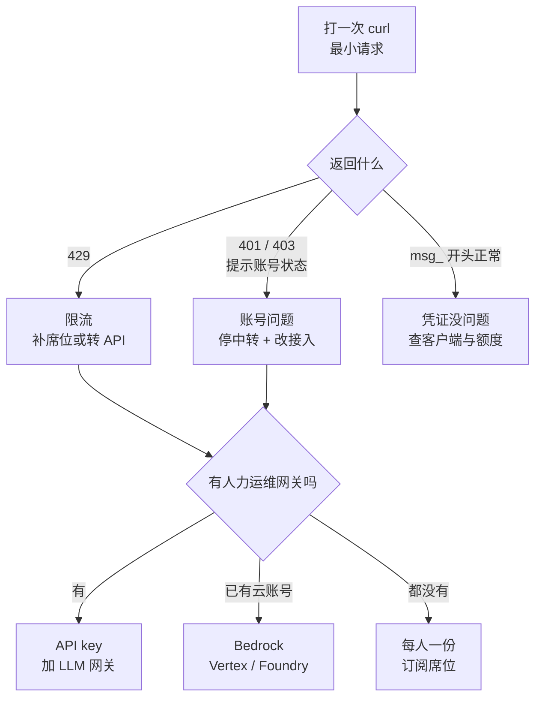

# 081. 十几个人共用两个账号、自建号池买了一天就全封了——工具链怎么接才不被供应商卡脖子？

**一句话**：先用一次 curl 最小请求分清「限流」还是「封禁」——限流按人头补席位，封禁只能改接入方式；长期解法是把接入收敛成「一个环境变量能切走」的网关或云托管，别拿订阅凭证搭号池。

## 30 秒结论

| 你看到的 | 立刻做 | 不想再犯 |
|---|---|---|
| 429 / 提示达到用量上限，等一阵能恢复 | 补合法席位或转 API 计费；先降用量 | 按人头配额度，别指望共用 |
| 登录失效 / 账号被停用 / 收到违规邮件 | 停掉所有把订阅凭证转 API 的中转，官方渠道申诉，并行搭合规通道 | 一个账号只服务一个自然人 |
| 只有某个客户端报错，官方 CLI 正常 | 那是第三方 harness 限制，换接入方式 | 别把订阅额度接到第三方 harness |
| curl 通了、Claude Code 真实会话 403 | 查前置 WAF：真实 prompt 带 XML 标签和源码会命中 XSS 规则 | 给 `/v1/messages` 豁免请求体检查 |
| 想知道自己被绑得多死 | 计时：只改网关配置、不碰开发机，能否 30 分钟切走上游 | 配置集中下发 + 第二条通道保持验证过 |



## 怎么做

顺序是：**先定性，再改接入方式**。没定性之前别换方案——把限流当封禁治（去搭号池），恰好会把自己送进封禁。

### 第 1 步：定性——限流还是封禁

先看凭证从哪来。启动 `claude`，会话里跑 `/status`，看三行：`Login method` 显示 claude.ai 账号 = 在用订阅凭证；`Anthropic base URL` **只有配了网关才会出现**，没这行就是直连；`Auth token` / `API key` 行写明用的是 `ANTHROPIC_AUTH_TOKEN`、`ANTHROPIC_API_KEY` 还是 `apiKeyHelper`。

**怎么确认做到位**：你能一句话说清「我这台机器上，请求拿谁的凭证、发到哪个地址」。说不清就先别改配置。

然后打一次最小请求，把客户端问题排除掉：

```bash
curl -sS -X POST "https://api.anthropic.com/v1/messages" \
  -H "x-api-key: $ANTHROPIC_API_KEY" \
  -H "anthropic-version: 2023-06-01" \
  -H "content-type: application/json" \
  -d '{"model":"claude-sonnet-4-6","max_tokens":1,"messages":[{"role":"user","content":"."}]}'
```

**怎么读结果**（这一步的输出直接决定走哪条路）：

- 返回以 `{"id":"msg_` 开头 → 凭证正常，问题在客户端或额度。
- HTTP 429 / `rate_limit_error` → 限流，走第 2 步 A。
- HTTP 401 / 403 且提示账号状态 → 账号级问题，走第 2 步 B。
- 报未知模型名 → 凭证是好的（服务端先认证再校验模型），只是模型 ID 写错。

### 第 2 步 A：限流——按人头补席位，不要补号池

两个方向：减少用量，或增加合法额度。减少用量的手段（模型路由、缓存、精简上下文）见 [#061 怎么少烧 token](../07-效率与成本/061-怎么少烧token.md) 和 [#062 什么时候该用 Opus](../07-效率与成本/062-什么时候用Opus什么时候用Sonnet.md)。

增加额度的合法路径只有两条：每人独立席位，或转 API 计费（第 3 步）。**转 API 计费没有「限额」这个概念**——用多少付多少，团队不会在早上十点集体停工，代价是成本要自己盯（见 [#060 额度怎么突然就没了](../07-效率与成本/060-一天该烧多少额度.md)）。

**怎么确认做到位**：连续 3 个工作日，团队里没有人因为额度被打断。还有人被打断说明席位数或预算配得不够，不是方案错了。

### 第 2 步 B：账号问题——立刻停共享，不要换号继续

唯一正确的动作是改接入方式，不是再买一批号：批量注册可能触发域名级连坐，越换死得越快。

1. 停掉所有把订阅凭证转成 API 的中转（sub2api 一类）。
2. 走官方渠道申诉，同时并行推进合规接入——别把复工时间压在申诉结果上。
3. 按第 3 步搭合规通道。

### 第 3 步：换成能随时切走的接入方式

三选一，判断标准就一条：**你有没有人力运维一个网关**。

**方案一：LLM 网关（10 人以上团队）。** 密钥留服务端，每人发一把网关凭证，人走了吊销一把即可。开发者机器上只要两个变量：

```bash
export ANTHROPIC_BASE_URL=https://llm-gateway.example.com
export ANTHROPIC_AUTH_TOKEN=sk-gateway-key
```

选哪个凭证变量取决于网关怎么读：网关说 bearer token / Authorization 就用 `ANTHROPIC_AUTH_TOKEN`（走 `Authorization: Bearer`）；说 API key / x-api-key 就用 `ANTHROPIC_API_KEY`（走 `x-api-key`）；凭证会轮换或来自 vault 就用 `apiKeyHelper`（两个 header 都发）。不确定先用 `ANTHROPIC_AUTH_TOKEN`，401 了再换。

**方案二：云厂商托管（已有云账号 / 有合规要求）。** 用现成的云合同和账单，不新增供应商关系。以 Bedrock 为例：

```bash
export CLAUDE_CODE_USE_BEDROCK=1
export AWS_REGION=us-east-1
# 多人部署必须钉住模型版本，否则各人解析到的默认模型可能不同
export ANTHROPIC_DEFAULT_SONNET_MODEL='us.anthropic.claude-sonnet-4-6'
```

Google Cloud Agent Platform 和 Microsoft Foundry 同理，各有一组 `CLAUDE_CODE_USE_VERTEX` / `CLAUDE_CODE_USE_FOUNDRY` 变量。注意 Bedrock 上 WebSearch 工具不可用、`/logout` 不可用（认证走 AWS 凭证）。

**方案三：每人一份订阅席位（10 人以下、不想搞基建）。** 最贵也最省事，要点只有一条：一个账号只服务一个人，不共享、不转售、不搭池子。

<details>
<summary>三层验证：怎么确认真的切干净了（三层缺一层就定位不到问题）</summary>

```bash
# 第 1 层：绕过 Claude Code，直接验证网关地址和凭证
curl -X POST "$ANTHROPIC_BASE_URL/v1/messages" \
  -H "Authorization: Bearer $ANTHROPIC_AUTH_TOKEN" \
  -H "anthropic-version: 2023-06-01" \
  -H "content-type: application/json" \
  -d '{"model":"claude-sonnet-4-6","max_tokens":1,"messages":[{"role":"user","content":"."}]}'
# 期望：返回以 {"id":"msg_ 开头。401 = 凭证变量选错了，换另一个再试
```

```bash
# 第 2 层：同一个 shell 里启动 Claude Code，让它继承这两个变量
claude
/status
# 期望：Status 页出现 Anthropic base URL = 你的网关地址，
#      且 Auth token 行写着你设的那个变量名，不是 claude.ai 账号
```

第 3 层：随便发一条真实消息（带一段源码），能正常回复。

**只跑第 1 层就宣布上线是最常见的翻车点**：curl 请求体太短，绕过了 WAF 的请求体规则；真实 prompt 带 XML 风格标签和源代码才会触发 403。

要让配置在所有场景生效（包括后台 agent），写进设置文件而不是只靠 shell export：

```json
{
  "env": {
    "ANTHROPIC_BASE_URL": "https://llm-gateway.example.com",
    "ANTHROPIC_AUTH_TOKEN": "sk-gateway-key"
  }
}
```

放 `~/.claude/settings.json`（个人全局）或 `.claude/settings.local.json`（单项目，记得先加 gitignore）。**绝对不要放进项目的 `.claude/settings.json`**——那个文件会被提交，等于把凭证推进仓库。

云托管这边的验收是：`/status` 里 provider 行显示 Amazon Bedrock，region 是你设的那个。官方明确提醒多人部署必须钉模型版本，否则别名会解析到 Claude Code 的内置默认值，可能落到某些人账号里还没开通的模型上，出现「我这能跑，他那不能跑」。

方案三的验收是：随便抽查一台机器，`/status` 显示的登录账号就是这台机器主人的账号。

</details>

<details>
<summary>网关常见错误对照表（官方 troubleshooting 表，核实于 2026-08-03）</summary>

| 现象 | 原因 | 处理 |
|---|---|---|
| 启动时警告同时存在两个凭证源 | 网关凭证和保存的登录都在 | 要用网关就 `/logout`，要用登录就 unset 变量 |
| 401 说 token 无效 | 凭证放错了 header | 换另一个凭证变量 |
| `Unable to connect to API (ConnectionRefused)` | 地址错了，或 VPN / 防火墙挡了 | 先跑 curl 最小请求定位 |
| `API returned an empty or malformed response (HTTP 200)` | 网关返回了 HTML（常见于登录页 / 错误页） | 修网关路由 |
| 403 但网关日志里没有这条请求 | 前面的 WAF 拦了请求体（XML 标签和源码命中 XSS 规则） | 给 `/v1/messages` 路径豁免请求体检查 |
| curl 能通但 Claude Code 一直让你登录 | CLI 自己没有凭证；项目级 `.claude/settings.json` 的 env 块在首次运行向导之后才生效 | 把凭证变量放 shell export 或 `~/.claude/settings.json` |
| 证书 / TLS 报错但 curl 正常 | Node 运行时和 curl 信的 CA 不一样（常见于 TLS 检查代理） | 设 `NODE_EXTRA_CA_CERTS` 指向 CA bundle |

排查用的两条命令：`claude doctor` 看版本与基本健康度；`claude --debug` 看实际请求，日志在 `~/.claude/debug/<session-id>.txt`。

**一个容易忽略的边界**：网关凭证生效时，Remote Control 和语音输入不可用（它们依赖 claude.ai 身份）。Claude Code in Slack、Claude Code on the web 是 Anthropic 托管产品，**永远走 Anthropic 的 API，不受网关变量影响**。合规要求是「流量必须走网关」的话，得关掉这些入口。

</details>

### 第 4 步：给自己留一条退路

1. **配置集中下发**。网关地址和凭证通过 managed settings / 配置管理下发，不是每个人自己 export。切供应商时改一处即可。
2. **验证脚本进 CI**。把第 1 步的 curl 最小请求做成每天跑的健康检查，供应商出问题时你比开发者先知道。
3. **第二条通道保持可用**。至少有一个人验证过备用路径（主用网关、备用 Bedrock）能跑通，而不是「理论上可以」。

**怎么确认做到位**：拿秒表计时——只改网关配置、不动任何一台开发机，把全团队流量切到另一个上游，30 分钟内完成。做不到就说明还被绑着。

## 为什么

### 「便宜」的方案贵在哪

订阅制的定价假设是「一个人一天能用多少」。号池、共享账号、第三方 harness 全都在打破这个假设：同一个凭证上出现了远超一个人的并发和用量。这是最容易被自动风控抓到的信号，不需要人工审查。

官方文档在 Authentication and credential use 一节把边界写得很直白[^1]：OAuth 认证专供 Free / Pro / Max / Team / Enterprise 订阅的**购买者**，用于 Claude Code 等原生应用的普通使用；开发者构建产品或服务（包括用 Agent SDK 的）应当用 API key；不允许第三方开发者提供 Claude.ai 登录、或代表其用户路由 Free / Pro / Max 计划凭证；并且保留采取措施执行这些限制的权利，**可能不经事先通知**。

最后一句是重点：没有申诉期，没有提前通知。所以这不是「风险偏好」问题，是「愿不愿意让团队某天早上集体停工」的问题。

### 三种中断长得像，根因完全不同

| 症状 | 根因 | 性质 |
|---|---|---|
| 429 / 达到用量上限，等一段时间恢复 | 用量限流：人多额度少 | 容量问题，加钱或加席位能解 |
| 登录失效、账号被停用、邮件通知违规 | 违反使用政策：共享 / 号池 / 转售 | 政策问题，加钱解不了 |
| 特定客户端能用、特定客户端报错 | 第三方 harness 限制 | 兼容性问题，换接入方式能解 |

社区里「十几个人共用两个 plan、早十点就 429」是第一类，纯粹是产能被额度卡住，跟封号无关；「号池买了一天全封」是第二类[^2]。**把第一类当第二类处理，恰好会把自己送进第二类。**

### 供应商风险不只是封号

- **档位不匹配**：社区反映团队版没有跟个人 Max 20x 对齐的高档位，结果重度用户只能留在个人账号上，组织拿不到 SSO 和统一管理[^3]。
- **能力条款会变**：订阅能不能配合第三方工具用，2026 上半年改过两次。工作流建立在某条政策上，那条政策就是你的依赖。
- **单点依赖**：全公司只会一种接入方式，供应商出问题时没有 B 方案。

## 别这么干

- ❌ **拿订阅凭证搭号池 / 中转成 API** —— 官方明确禁止且可不经通知处置，社区实测有人一天就全封。省下的钱不够赔停工一天。
- ❌ **被封了就换一批号继续** —— 批量注册可能触发域名级连坐，把可修复的问题做成不可修复的。
- ❌ **把 429 当成封号来治** —— 429 是额度不够，解法是补席位或转 API 计费；换号池只会把限流问题升级成封禁问题。
- ❌ **凭证写进项目的 `.claude/settings.json`** —— 那是会被提交的共享文件，等于把网关密钥推进仓库。
- ❌ **只设 `ANTHROPIC_BASE_URL` 就以为切走了** —— 没设凭证变量的话，请求确实走网关，但用的还是保存的 claude.ai 登录，额度和账单照旧算在订阅上。要彻底切干净就 `/logout`。

<details>
<summary>换成 Copilot / Cursor / 云厂商托管呢</summary>

| 工具 | 团队接入方式 | 被卡脖子的风险点 |
|---|---|---|
| Claude Code | 订阅席位 / API key + 网关 / Bedrock、Vertex、Foundry | 订阅侧规则收紧过；网关方案切换成本最低 |
| GitHub Copilot | 企业版按席位，走 GitHub 组织 | 绑在 GitHub 生态；模型选择由 GitHub 决定 |
| Cursor | 按席位订阅，也支持自带 API key | 自带 key 时部分功能受限；编辑器本身就是绑定项 |
| 云厂商托管（Bedrock / Vertex） | 用现成云合同和账单 | 模型上线有滞后；区域可用性要自己确认 |

选型时问自己一句：**如果这家明天涨价三倍或改规则，我要多久能切走？** 答案是「几天」就没问题，答案是「要重新培训全团队」就是被绑住了。

</details>

## 延伸

**相关文章**

- [#072 AI coding 的安全红线怎么画？](../08-团队与组织/072-AI-coding安全红线.md) —— 数据往哪走的红线，本篇讲凭证怎么接
- [#060 额度怎么突然就没了？](../07-效率与成本/060-一天该烧多少额度.md) —— 转 API 计费后的成本怎么算
- [#061 怎么少烧 token？](../07-效率与成本/061-怎么少烧token.md) —— 限流时先从降用量入手
- [#074 团队的 AI coding 规范怎么立？](../08-团队与组织/074-团队AI-coding规范怎么立.md) —— 接入方式定下来后怎么落成团队规范

**参考资料**

- [Claude Code — Legal and compliance](https://code.claude.com/docs/en/legal-and-compliance) —— 支撑「OAuth 适用范围、禁止第三方代路由订阅凭证、可不经通知执行」（官方，2026-08 核对）
- [Claude Code — Connect Claude Code to an LLM gateway](https://code.claude.com/docs/en/llm-gateway-connect) —— 支撑网关环境变量、凭证变量对照、验证请求与错误对照表（官方，2026-08 核对）
- [Claude Code — Other LLM gateways](https://code.claude.com/docs/en/llm-gateway) —— 支撑「只设 base URL 不替换订阅凭证」（官方，2026-08 核对）
- [Claude Code on Amazon Bedrock](https://code.claude.com/docs/en/amazon-bedrock) —— 支撑 Bedrock 变量与「多人部署必须钉模型版本」的警告（官方，2026-08 核对）
- [HN 47963204](https://news.ycombinator.com/item?id=47963204) / [HN 47633396](https://news.ycombinator.com/item?id=47633396) / [HN 46549823](https://news.ycombinator.com/item?id=46549823) —— 支撑「2026 上半年两次收紧第三方 harness」及社区反弹规模（社区，2026）
- [V2EX 1203227](https://v2ex.com/t/1203227) —— 支撑「号池一天全封」「域名邮箱注册被连坐」（社区，2026）
- [V2EX 1230291](https://www.v2ex.com/t/1230291) —— 支撑「十几人共用两个 plan、早十点就 429」的限流现场（社区，2026）
- [GitHub anthropics/claude-code #47509](https://github.com/anthropics/claude-code/issues/47509) —— 支撑「团队版缺高档位席位」（社区，2026-08-03 核对状态 open）

[^1]: [Claude Code — Legal and compliance](https://code.claude.com/docs/en/legal-and-compliance)（官方，2026-08-03 核对）：OAuth 凭证仅供订阅购买者本人普通使用，禁止第三方代路由，且可不经事先通知执行。
[^2]: [V2EX 1203227](https://v2ex.com/t/1203227)（社区，2026）：「号池才蹬了 1 天全封了」「域名邮箱注册整个域名被拉黑」，帖内共识是老实开团队版。
[^3]: [GitHub anthropics/claude-code #47509](https://github.com/anthropics/claude-code/issues/47509)（社区，2026-08-03 核对，状态 open）：团队版缺少对齐个人 Max 20x 的高档位。

---

<sub>难度 高级 · 决策题 + 排错题 · 主线 Claude Code，横向 Copilot / Cursor / 云厂商托管</sub>

<sub>**时效**：官方规则与环境变量（legal-and-compliance、llm-gateway-connect、amazon-bedrock）已于 2026-08-03 逐项核对。**已知不确定**：社区帖里的封禁案例是当事人自述，无官方确认；风控判定口径官方不公开。**易变**：套餐档位、限流阈值、订阅能否配合第三方工具用的条款变化很快，涉及具体档位和参数的部分以官方页面为准；本篇的排查方法（先定性再改接入）长期有效。</sub>

> 本篇个人实践（L4）：`[待补：BOSS 的实战经验/踩坑]`
