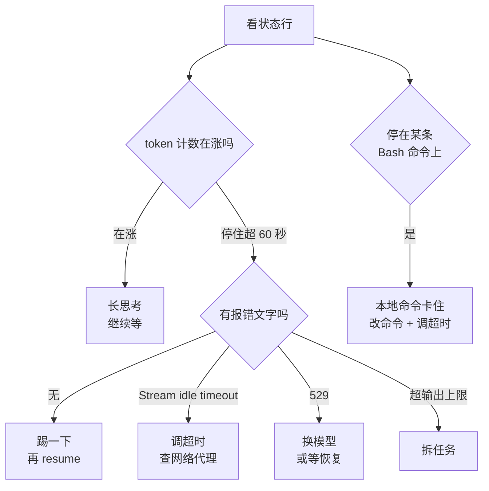

# 082. Claude Code 卡住不动 / Stream idle timeout / 长文件改到一半断了——怎么救回来？

**一句话**：先看状态行的 token 计数——还在涨就是长思考不是卡住；停住超过 60 秒才是真卡，这时别杀终端，`claude --resume` 接回来后第一件事是让它跑 `git diff` 对账，而不是说「继续」。

## 30 秒结论

| 你看到的 | 立刻做 | 不想再犯 |
|---|---|---|
| 转圈，token 计数**还在涨** | 什么都别做，它在长思考 | —— |
| 转圈，token 计数**停住超过 60 秒** | 再发一句话「踢」一下；不动就 Ctrl+C，再不动就关终端 + `claude --resume` | 大任务先出计划再执行，每步落盘 |
| `API Error: Stream idle timeout` | 调大 `API_TIMEOUT_MS`；横幅每次都出现就去查代理和网络 | 写进 settings.json，别只临时 export |
| `529 Overloaded` / 反复重试 | 看 status.claude.com，`/model` 换模型（容量按模型分） | CI 场景才开 `CLAUDE_CODE_RETRY_WATCHDOG` |
| 状态行停在某条 Bash 命令上 | 是你的本地命令，不是 Claude Code；调大 bash 超时**并**改命令 | CLAUDE.md 里写死命令约束 |
| `exceeded the 32000 output token maximum` | 先拆任务，再考虑调 `CLAUDE_CODE_MAX_OUTPUT_TOKENS` | 单轮输出别逼近上限 |



**token 计数还在涨就是长思考，停住超 60 秒才叫真卡**，计数在动时别去翻 MCP 和插件。

## 怎么做

### 第 0 步：10 秒分诊，别乱按

按顺序看三样：

1. **token 计数在涨吗？** 状态行显示类似 `↓ 35.0k tokens · thinking`。数字在动 = 长思考，继续等；数字停住超过 60 秒 = 真卡。60 秒是经验阈值，官方无此标准，取的是排除长思考的安全余量。
2. **有没有报错文字？** 有 `Stream idle timeout` / `529` / `exceeded ... token maximum` 就直接跳到对应小节，别走通用流程。
3. **最后一个动作是什么？** 状态行停在某条 Bash 命令上 = 本地命令卡住，跟 API 无关。

**怎么确认做到位**：你能用一句话说出「卡在哪一段」。说不出来就回来重看这三条，别往下做。

### 第 1 步：token 不涨 —— 先踢，再 resume

按顺序试，每一步给 30 秒观察窗口，token 计数仍不动就进下一步：

```
# 1) 在输入框再发一句话（内容随意，比如 "status?"）
# 2) Ctrl+C 取消当前操作
# 3) 直接关掉终端窗口
# 4) 回到同一个目录接回原会话：
claude --resume
```

官方对这一段的说法是：先 Ctrl+C 尝试取消，仍无响应就关终端重启，**重启不会丢对话**，在同一目录跑 `claude --resume` 就能接回来[^1]。

**怎么确认做到位**：`claude --resume` 列出会话列表，选中后能看到你刚才那轮的历史对话。看得到历史 = 上下文没丢。

### 第 2 步：resume 之后先对账，别接着往下改

这是「长文件改到一半断了」的关键动作。断点之后你不知道文件处于什么状态，直接让它继续改会叠加出更烂的结果。先在终端跑 `git status` / `git diff` / `git stash list`，然后在会话里贴本节末尾折叠块里那段断点对账提示词——核心要求是：先不写任何代码，跑 `git diff` 报出「已完成 / 改了一半 / 未开始」三分清单，等你确认再继续。

**怎么确认做到位**：它给出的「已完成 / 半截 / 未开始」三分清单，和你 `git diff` 看到的逐条一致。有一条对不上就说明它在猜，让它逐文件重读。

改到一半的文件已经语法都不成立的话，最省事的是单独回退这一个文件重做：`git checkout -- path/to/broken-file.ts`，直到 `git diff` 里这个文件消失、项目重新通过构建。

### 第 3 步：`Stream idle timeout` —— 调超时 + 查网络

先把超时放宽：在 `~/.claude/settings.json` 的 `env` 块里把 `API_TIMEOUT_MS` 调大（如 `1200000`），写进 settings.json 而不是临时 export，这样重启终端也在。完整可抄配置见本节末尾折叠块。

**怎么确认做到位**：改完重启 Claude Code，跑 `/doctor`，确认设置被读到、没有 JSON 语法报错。

调大之后横幅**依然每次都出现**，按官方说法这就是网络问题，别再折腾变量[^2]。这时查三样：公司代理 / VPN、`HTTPS_PROXY` 环境变量、status.claude.com 有没有在报事故。

### 第 4 步：`529 Overloaded` —— 换模型或等，别死磕

三步：看 [status.claude.com](https://status.claude.com) 是否有事故 → 过几分钟再试 → `/model` 换一个模型。**容量是按模型分的**，Opus 满了不代表 Sonnet 也满。

**怎么确认做到位**：换模型后同一个请求能正常出结果 = 确实是容量问题，不是你的配置。

CI 或无人值守场景可以让它对 429/529 无限重试：`{"env": {"CLAUDE_CODE_RETRY_WATCHDOG": "1"}}`。交互式使用别开——你会对着一个永远在重试的界面干等。相关的还有 `CLAUDE_CODE_MAX_RETRIES`（默认 10，上限 15；开了 watchdog 后上限被移除）[^5]。

### 第 5 步：卡在某条 bash 命令 —— 放宽超时**并**改命令

两件事都要做。放宽超时：settings.json 的 `env` 块里调大 `BASH_DEFAULT_TIMEOUT_MS` / `BASH_MAX_TIMEOUT_MS`（完整可抄配置见本节末尾折叠块）。

改命令本身更重要——超时调多大都救不了一个永不返回的命令。在 CLAUDE.md 里写死搜索、分页、长命令三条约束，比每次口头提醒有效，示例见折叠块。

<details>
<summary>可以直接抄的 CLAUDE.md 命令约束</summary>

```markdown
## 命令执行约束
- 搜索一律用 rg 并限定目录，禁止在仓库根跑无限定的 find / grep
- git 命令带 --no-pager，禁止进入交互式分页器
- 任何可能超过 2 分钟的命令（构建、全量测试），先告诉我，由我在外部终端跑
```

</details>

**怎么确认做到位**：下次它跑搜索时命令是 `rg 'xxx' src/` 这种带目录限定的形式，而不是从仓库根开始扫。

### 第 6 步：`exceeded the 32000 output token maximum` —— 先拆任务

顺序不要反。第一动作是把任务切开：「先只改 `src/auth/` 下的文件，其他目录一个字都不要动，做完停下来等我确认」。确实需要更大的单轮输出时（比如一次生成一份长文档），再调 `CLAUDE_CODE_MAX_OUTPUT_TOKENS`。

**怎么确认做到位**：同样的任务不再中途报这个错。调大后还是撞，说明拆分没做够，回到第一动作。

### 第 7 步：排查完还想预防（低频路径，全部在折叠块里）

<details>
<summary>怀疑是自己的配置搞出来的 + 结构性预防</summary>

**怀疑是自己的配置搞出来的**：用 `claude --safe-mode` 起一次，它关掉本次会话的所有自定义项。配套两个检查：`/doctor` 查安装、设置、扩展、上下文占用；`/mcp` 看各 MCP server 连接状态。`claude` 根本起不来时，在终端里跑不带斜杠的 `claude doctor`。

怎么确认做到位：你能说出「开着 X 就卡，关掉 X 就不卡」这样的对照结论，而不是「关了一堆好像好点了」。

**结构性预防（做完上面才做这个）**：

- **上下文别撑满**。上下文压到极限时更容易长时间无响应和 auto-compact 反复。官方对 `Autocompact is thrashing` 的处置：让它按行范围分块读大文件、用带焦点的 `/compact`（如 `/compact keep only the plan and the diff`）、把大文件的活丢给 subagent 隔离、或者直接 `/clear`。
- **大任务先出计划再执行**，每步之间有落盘和确认点，任何一步断了损失只有一步。
- **随手 commit**。断点恢复的成本和你上次 commit 的距离成正比。

</details>

<details>
<summary>可以直接抄的 settings.json，和一段断点恢复提示词</summary>

```jsonc
// ~/.claude/settings.json，数值按自己情况调
{
  "env": {
    "API_TIMEOUT_MS": "1200000",
    "BASH_DEFAULT_TIMEOUT_MS": "300000",
    "BASH_MAX_TIMEOUT_MS": "900000"
  }
}
```

注意优先级：**shell 里 export 的环境变量优先于 settings.json 的 `env` 块**。改了 settings.json 却不生效，先看 shell 配置里是不是已经 export 过同名变量。

卡死重启后可以直接贴的提示词：

```
上一轮执行被中断了。现在按顺序做，做完一步停一步：
1. 跑 git status 和 git diff，报告当前工作区的真实状态
2. 对照你上一轮的计划，标出「已完成 / 改了一半 / 未开始」
3. 对「改了一半」的文件，只说清楚缺什么，不要动手补
4. 等我确认后，从第一个未完成项继续

在我确认之前，不要写入任何文件。
```

顺带一个官方相关项：Search 工具、`@file` 补全找不到文件时，可能是内置 ripgrep 在你的系统上跑不起来。装系统版（macOS：`brew install ripgrep`），然后在 settings.json 的 env 里设 `USE_BUILTIN_RIPGREP=0`。确认方式是跑 `claude doctor`，Search 那一行显示你系统 ripgrep 的路径，而不是 `OK (bundled)`。

</details>

## 为什么

### 「卡住」是一个症状，不是一个故障

从你敲回车到出结果，中间至少四段：本地 CLI 进程 → 网络 / 代理 → Anthropic API 的流式响应（SSE）→ 本地工具执行（bash、文件读写、MCP）。任何一段停住，屏幕上看起来都一样：光标在转，什么都不发生。所以「卡住怎么办」没有单一答案，第 0 步的分诊就是按这四段来的。

### 服务端流卡住是真实存在的，不是你配置错了

社区里量最大的一类反馈：会话卡在 thinking 状态 5–20 分钟以上，**token 用量在此期间完全不增长**，抓包看到的是在等 Anthropic 服务端的 SSE 数据；报告者试过全新安装、关掉所有 MCP 和扩展，没用[^3]。

这条的实际意义是：**token 计数停住时，检查自己的配置基本是浪费时间**，直接走「踢一下 / resume」。

### 阈值和重试规则都是官方写死的

流中断超过 20 秒会弹出等待横幅；正在跑 advisor 调用时放宽到 90 秒——advisor 指 Claude Code 内部咨询另一个更强模型的辅助请求，不是你的主请求。整个请求的超时由 `API_TIMEOUT_MS` 控制，默认 600000 毫秒（10 分钟）；官方给的判断标准很直接：这个横幅**每次尝试都出现**就按网络问题处理，而不是继续等[^2]。

<details>
<summary>重试规则与 bash 超时默认值明细</summary>

同页还写明哪些会自动重试：服务端错误、529、超时、响应开始前的连接中断会重试；TLS 证书失败、响应中途（某个 block 已完成后）的服务端错误不会重试。这解释了为什么有的错误自己就恢复了，有的直接把整轮丢掉。

bash 那边：`BASH_DEFAULT_TIMEOUT_MS` 默认 120000 毫秒（2 分钟），`BASH_MAX_TIMEOUT_MS` 默认 600000 毫秒[^4]。你让它跑一个需要 5 分钟的构建，默认配置下 2 分钟就被掐掉，看起来像「Claude Code 卡住了又自己乱跳」。反过来，某些环境下（Windows 尤其常见）`find`、`ls`、`grep` 会因为扫到挂载点、网络盘、巨大目录而永不返回——这时卡住的是你的操作系统，Claude Code 只是在老实等。

</details>

## 别这么干

- ❌ **一卡住就杀终端重开新会话** —— 重启不丢对话，`claude --resume` 能接回来。开新会话等于把已经付过费的上下文全扔了，还要重讲一遍需求。
- ❌ **resume 之后直接说「继续」** —— 它不知道断在哪，会凭上一轮的计划猜，把已改过的文件再改一遍，或跳过实际没做完的那步。必须先对账。
- ❌ **看到转圈就去翻 MCP、翻插件** —— token 计数不涨的那种卡死是服务端 SSE 问题，报告者全新安装、零 MCP 也照样复现。先看 token 计数再决定要不要查配置。
- ❌ **只调 `BASH_DEFAULT_TIMEOUT_MS` 不改命令** —— 一个在仓库根跑 `find /` 的命令，超时给到 1 小时它也不会返回。超时是给「慢」用的，不是给「永不返回」用的。
- ❌ **看到社区 issue 说「降级到 X 版本」就照做** —— 降级会丢掉这期间所有修复和安全更新，还可能撞上早就修好的老 bug。只在你能自己复现「换版本症状就变」时才用，并尽快升回来。

<details>
<summary>版本相关的具体 workaround（时效性最强，2026-08-15 状态，随版本更新即失效）</summary>

上面的分诊流程无论版本怎么变都成立，这一节只是补充。看之前先确认你的版本和下面对不上。

- **`Stream idle timeout` 在 2.1.92 附近有一波集中报告**。[GH #46987](https://github.com/anthropics/claude-code/issues/46987) 报告者称 2.1.90 正常、2.1.92 开始复现，issue 被打了 `duplicate` 标签，说明是已知问题的一个实例。当时社区做法是降级回上一个可用版本，**现在不建议无脑照抄**——只在你能明确复现「换版本就好 / 就坏」时才用。
- **「tool call could not be parsed（retry also failed）」**：[GH #63875](https://github.com/anthropics/claude-code/issues/63875)（2.1.158）和 [GH #62123](https://github.com/anthropics/claude-code/issues/62123)（2.1.150）都是这个，标记为 `area:model`，即模型侧问题。现象是工具调用直接被丢弃、内置重试也失败。没有官方 workaround，社区做法是手动重发、把大 payload 拆小、避免往参数里塞超长代码块。这类不需要改任何配置。
- **v2.1.208 之前**，会话里如果有超大 Markdown 表格，resume 时会因为重新渲染每一行而卡住。[v2.1.208 release notes](https://github.com/anthropics/claude-code/releases/tag/v2.1.208) 记录了这个修复：超过 200 行的表格只渲染前 200 行，其余显示「… N more rows」。卡在 resume 那一刻就先升级版本。
- **输出上限报错和「还在跑」会同时发生**：[GH #24055](https://github.com/anthropics/claude-code/issues/24055)（带 `has repro` / `oncall` 标签）记录了任务跑 8 分钟后弹出 `exceeded the 32000 output token maximum`、但会话看起来还在继续跑的组合。这类根因是单轮要产出的东西太多，调大上限只是让它撞墙晚一点。

判断这一节还有没有效：去对应 issue 页面看是否已关闭，并跑一次 `claude doctor` 看当前版本。

</details>

## 延伸

**相关文章**

- [#012 上下文窗口要爆了怎么办？](../02-上下文工程/012-上下文窗口要爆了.md) —— 上下文压满时更容易触发 auto-compact 反复和长时间无响应，这篇讲怎么从源头控住
- [#043 fix loop 什么时候必须停、怎么跳出？](../05-质量保证/043-fix-loop什么时候必须停.md) —— 「反复重试不见效」的另一种形态，判停标准可以互相参考
- [#031 让 AI 改一个小功能，它却动了一堆无关文件怎么办？](../04-执行工作流/031-plan-execute-review循环.md) —— 计划分步执行是断点恢复成本最低的工作方式
- [#032 开几个 agent 并行跑，并行到底该开几个？](../04-执行工作流/032-SubAgent并行开几个.md) —— 并行度过高本身就会制造限流和「像卡住」的等待

**参考资料**

- [Troubleshooting — Claude Code Docs](https://code.claude.com/docs/en/troubleshooting) —— 支撑「hang 处置流程、resume 不丢对话、`--safe-mode`、`/doctor`、ripgrep、auto-compact thrashing」（官方，核实于 2026-08）
- [Error reference — Claude Code Docs](https://code.claude.com/docs/en/errors) —— 支撑「20 秒 / 90 秒横幅阈值、`API_TIMEOUT_MS` 默认值、529 处置、重试规则、retry watchdog 与 `CLAUDE_CODE_MAX_RETRIES` 默认值/上限」（官方，核实于 2026-08-15）
- [Release v2.1.208 — anthropics/claude-code](https://github.com/anthropics/claude-code/releases/tag/v2.1.208) —— 支撑「超大 Markdown 表格 resume 卡住的修复与前 200 行渲染上限」（官方 release notes，2026-07，核实于 2026-08-15）
- [Environment variables — Claude Code Docs](https://code.claude.com/docs/en/env-vars) —— 支撑 bash 超时默认值与 settings.json 三级作用域优先级（官方，核实于 2026-08）
- [GH #26224](https://github.com/anthropics/claude-code/issues/26224) —— 支撑「卡 5–20 分钟且 token 不增长是服务端 SSE 问题」（社区 + 官方置顶回复，2026-02）
- [GH #46987](https://github.com/anthropics/claude-code/issues/46987) —— 支撑 2.1.92 附近 Stream idle timeout 集中报告（社区，2026-04）
- [GH #24055](https://github.com/anthropics/claude-code/issues/24055) —— 支撑「输出上限报错但会话仍在跑」（社区，核实于 2026-08）
- [GH #63875](https://github.com/anthropics/claude-code/issues/63875) / [GH #62123](https://github.com/anthropics/claude-code/issues/62123) —— 支撑「工具调用解析失败无配置层解法」（社区，核实于 2026-08）
- [status.claude.com](https://status.claude.com) —— 判断是不是供应商侧事故的第一站（官方）

[^1]: [Troubleshooting — Claude Code Docs](https://code.claude.com/docs/en/troubleshooting)（官方，核实于 2026-08）：重启不会丢对话，同一目录 `claude --resume` 可接回。
[^2]: [Error reference — Claude Code Docs](https://code.claude.com/docs/en/errors)（官方，核实于 2026-08）：「Response stalled mid-stream」20 秒横幅、`API_TIMEOUT_MS` 默认 600000 毫秒、横幅每次都出现即按网络问题处理。
[^3]: [GH #26224](https://github.com/anthropics/claude-code/issues/26224)（社区，2026-02 起，Anthropic 有置顶回复确认在查）：卡在 thinking 5–20 分钟、token 用量不增长。
[^4]: [Environment variables — Claude Code Docs](https://code.claude.com/docs/en/env-vars)（官方，核实于 2026-08）：`BASH_DEFAULT_TIMEOUT_MS` 默认 120000、`BASH_MAX_TIMEOUT_MS` 默认 600000。
[^5]: [Error reference — Claude Code Docs](https://code.claude.com/docs/en/errors)（官方，核实于 2026-08-15）：`CLAUDE_CODE_MAX_RETRIES` 默认 10，v2.1.186 起上限 15；v2.1.199 起设置 `CLAUDE_CODE_RETRY_WATCHDOG` 会移除该上限，并对 429/529 无限重试（原文用词为 indefinitely）。

---

<sub>难度 中级 · 排错题 · 主线 Claude Code</sub>

<sub>**时效**：环境变量默认值、错误页阈值与重试规则、`--safe-mode` / `/doctor` 行为已于 2026-08-15 对照官方 troubleshooting、errors、env-vars 三页核实。**已知不确定**：「token 不涨的卡死」根因来自社区报告加官方在 issue 里的排查确认，未见正式复盘；分诊用的 60 秒阈值是经验值，非官方标准。**易变**：折叠块里的版本号与 issue 状态（2.1.92、2.1.208、#46987、#63875）随版本更新即失效，照做前先看 issue 是否已关闭。</sub>

> 本篇个人实践（L4）：`[待补：BOSS 的实战经验/踩坑]`
