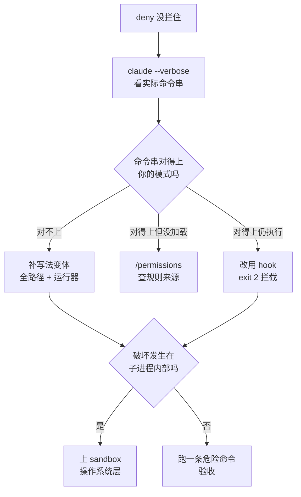

# 083. 我配了 deny 规则，它照样删了我的东西——permissions / hooks 怎么配才真拦得住？

**一句话**：deny 规则匹配的是 Claude 实际发出的字面命令串、不是意图，所以先用 `claude --verbose` 看那条命令长什么样；真正不可逆的动作靠 PreToolUse hook 的 `exit 2`（它先于权限规则评估），进程内部干的事只有 sandbox 拦得住——三层叠加，配完必须跑一条危险命令验收。

## 30 秒结论

| 你看到的 | 立刻做 | 不想再犯 |
|---|---|---|
| deny 里明明写了 `Bash(rm *)`，它照样删了 | `claude --verbose` 看实际命令串，跟你的模式逐字比 | 全路径变体、环境运行器各写一条规则 |
| 实际命令是 `/bin/rm` / `devbox run rm -rf .` / `npx rimraf dist` | 补精确规则；环境运行器一律放 `ask`，不给宽泛 allow | 宽 allow 全部降级成 ask |
| 实际命令是 `python cleanup.py`、`npm run build` | 权限系统看不见子进程内部，只能上 sandbox | sandbox + `credentials` 段一起配 |
| 你写的规则在 `/permissions` 里根本看不到 | 文件路径或 JSON 写错了，规则压根没加载 | 改完立刻用一条危险命令验收 |
| 这个动作必须 100% 拦死，不接受「弹窗让人确认」 | 写 PreToolUse hook，`exit 2` | 把 `"Bash"` 放 allow，用 hook 拒那几条 |
| 团队机器，开发者能自己改配置 | managed settings + `allowManagedPermissionRulesOnly` | 顺手禁掉 `--dangerously-skip-permissions` |
| 它总是漏做收尾检查（测试、CHANGELOG） | Stop hook 注入 `additionalContext`，不用 block | 见第 6 步「hook 的三个正面用法」 |



一句话记法：**deny 规则防手滑，hook 防特定危险动作，sandbox 防「命令干的事比名字多」。三层是叠加的，不是三选一。**

git 层的具体禁令清单见 [#052 怎么不让 AI 把 git 仓库搞乱？](../06-工程协作/052-别让AI搞乱git仓库.md)，本篇讲权限系统本身怎么配、以及它已知的失灵模式。

## 怎么做

### 第 1 步：先确认规则到底有没有匹配上

别急着改配置。会话里跑 `/permissions` 看当前生效的规则和它们来自哪个文件；用 `claude --verbose` 启动，看每次工具调用发出的确切参数字符串。

**怎么确认做到位**：`--verbose` 输出里能看到 Bash 工具的 `command` 原文。把原文和你的模式逐字比一遍——十有八九你会发现它是 `cd apps/api && rm -rf dist`、`npx rimraf dist` 这类，跟你写的 `Bash(rm *)` 对不上。

权限规则**跨作用域合并而不是覆盖**，且任何一层 deny 了其他层都不能再 allow[^1]。所以 deny 写在哪一层都会生效；写了不生效通常是文件路径或 JSON 语法错了——`/permissions` 里看不到它，就是没加载。

<details>

<summary>settings 一共五层，哪层压哪层、什么字段覆盖什么字段拼接</summary>

优先级从高到低：**Managed > CLI 参数 > Local > Project > User**[^7]。

| 层级 | 路径 | 对谁生效 | 进 git |
|---|---|---|---|
| Managed | macOS `/Library/Application Support/ClaudeCode/managed-settings.json`；Linux `/etc/claude-code/`；Windows `C:\Program Files\ClaudeCode\` | 整台机器 / 整个组织，覆盖不了 | 由 IT 部署 |
| CLI 参数 | `--settings` 等 | 仅本次会话 | — |
| Local | `.claude/settings.local.json` | 只有自己、只在该仓库 | 否（自动 gitignore） |
| Project | `.claude/settings.json` | 该仓库所有协作者 | 是 |
| User | `~/.claude/settings.json` | 自己，跨所有项目 | 否 |

Managed 有三种交付方式（远程下发、MDM 策略、本地文件），**取其中一个源，不做合并**。

合并语义分两种，混淆它们是「我明明写了却没生效」的第二大来源：

- **标量字段**（`model`、`cleanupPeriodDays` 这类）是高优先级覆盖低优先级，只有一个值活下来。
- **`permissions` 的 allow / ask / deny 是跨层拼接**，五层的条目全都进最终清单。所以你在 user settings 里写的 deny，不会因为项目里写了 allow 就被抵消——**任意一层 deny，其他任何层都 allow 不回来**，这也是团队红线要往 managed 里放的根据。

还有个和 CLAUDE.md 容易搞反的点：settings.json **不向父目录回溯**。从父目录启动，读不到子项目的 `.claude/settings.json`——那是「不回溯」，不是「不叠加」，五层之间该合并照样合并。

</details>

### 第 2 步：修规则写法，覆盖真实变体

```json
{
  "permissions": {
    "deny": [
      "Bash(rm *)", "Bash(/bin/rm *)", "Bash(/usr/bin/rm *)",
      "Bash(sudo *)", "Bash(* --force *)",
      "Read(./.env)", "Read(./.env.*)", "Read(./secrets/**)", "Edit(./.env*)"
    ],
    "ask": ["Bash(git push *)", "Bash(docker *)", "Bash(npx *)"]
  }
}
```

四个写法要点，都对应上面踩过的坑：

- `*` 前有空格（`Bash(rm *)`）会强制词边界，只匹配 `rm ` 开头或 `rm` 本身；没空格（`Bash(rm*)`）连 `rmdir` 一起匹配。
- `:*` 只在模式**结尾**才被识别为通配，写在中间（`Bash(git:* push)`）里的冒号是字面字符。官方示例里的规范写法就是尾部通配（`Bash(npm run test:*)`），语义是「以这段开头的命令」；其他工具各有自己的参数形式：`Read(./.env)` 按路径、`WebFetch(domain:example.com)` 按域名、`mcp__puppeteer__*` 是某个 MCP server 的全部工具、`Agent(Explore)` 是某个 subagent[^7]。
- **三类规则的评估顺序固定是 deny → ask → allow，第一个匹配上的直接定结果**，规则写得多具体都不改变这个顺序。所以别指望用一条更精确的 allow 去「例外掉」一条宽泛的 deny，做不到。
- 想把某个工具彻底关掉，deny 里写**裸工具名**（如 `"Bash"`）——它不是「每次拦一下」，而是把该工具从 Claude 的上下文里整个移除，模型根本看不到它存在。
- 全路径变体（`/bin/rm`、`/usr/bin/rm`）要单独写，前缀不同不会自动覆盖。
- Write / NotebookEdit / Glob 上写路径规则**无效**：只有 `Edit(path)` 和 `Read(path)` 参与文件权限检查，写成 `Write(docs/**)` 会被接受但永不生效。

**怎么确认做到位**：重启会话，让它执行一条你期望被拦的命令（比如「运行 `/bin/rm -rf ./tmp-test`」）。**看到明确的拒绝提示才算过；只是弹窗询问，说明落到了 `ask` 而不是 `deny`。**

### 第 3 步：不可逆的动作，放进 PreToolUse hook

这是 deny 之上更硬的一层。官方写明：以 exit code 2 退出的 hook 会**在权限规则被评估之前**中止这次工具调用，所以即便有 allow 规则本来会放行，这个拦截依然生效[^1]。而且 PreToolUse hook 对除 `EndConversation` 之外的每一次工具调用都会触发，不受权限模式影响。

注册（`.claude/settings.json`）：

```json
{
  "hooks": {
    "PreToolUse": [{
      "matcher": "Bash",
      "hooks": [{ "type": "command", "command": "${CLAUDE_PROJECT_DIR}/.claude/hooks/guard.sh", "timeout": 10 }]
    }]
  }
}
```

退出码语义：`0` = 成功，Claude Code 解析 stdout 里的 JSON；`2` = **阻断**，stderr 内容作为错误反馈给 Claude；其他值 = 非阻断错误，只提示、继续执行[^2]。**`exit 1` 不阻断**，这是自己写 hook 时最常见的错。

**怎么确认做到位**：跑下面两条，一条 `exit=2` 一条 `exit=0`，再在会话里 `/hooks` 确认 hook 已加载，最后让 Claude 实际试一条危险命令收尾。

```bash
echo '{"tool_input":{"command":"/bin/rm -rf ./x"}}' | .claude/hooks/guard.sh; echo "exit=$?"  # 期望 2
echo '{"tool_input":{"command":"npm test"}}'       | .claude/hooks/guard.sh; echo "exit=$?"  # 期望 0
```

<details>
<summary>guard.sh 完整脚本，以及 JSON 形式的软拒绝怎么写</summary>

`.claude/hooks/guard.sh`（记得 `chmod +x`）：

```bash
#!/usr/bin/env bash
# 从 stdin 读 hook 输入，取出这次要执行的命令原文
CMD=$(jq -r '.tool_input.command // ""')

# 用正则覆盖变体：rm / rmdir，含全路径，含拆开写的 -r -f
if printf '%s' "$CMD" | grep -Eq '(^|[[:space:]/])rm(dir)?([[:space:]]|$)'; then
  echo "guard: 拦截删除类命令 -> $CMD" >&2
  exit 2   # 关键：必须是 2。exit 1 是非阻塞的，不会拦下来
fi

# 数据库 / 生产环境这类你自己的红线，一并写在这里
if printf '%s' "$CMD" | grep -Eq 'drop (table|database)|kubectl .*(delete|prod)'; then
  echo "guard: 拦截高危运维命令 -> $CMD" >&2
  exit 2
fi

exit 0   # 不表态，交回正常权限流程
```

想给出结构化理由而不是硬阻断，可以 exit 0 并输出 JSON：

```json
{
  "hookSpecificOutput": {
    "hookEventName": "PreToolUse",
    "permissionDecision": "deny",
    "permissionDecisionReason": "删除类命令必须由人手工执行"
  }
}
```

`permissionDecision` 取值：`allow` / `deny` / `ask` / `defer`（defer = 交回正常权限流程）。但要清楚区别：**JSON 形式的 `allow` 不能越过 deny 规则**，只有 exit 2 具备「先于权限规则」的优先级。硬防线一律用 exit 2。

还可以用 `if` 字段预过滤，减少 hook 被调起的次数：

```json
{ "type": "command", "if": "Bash(rm *)", "command": "/path/to/guard.sh" }
```

`if` 用的是权限规则语法，且会拆开子命令和命令替换来检查——`Bash(rm *)` 对 `echo $(rm -rf /)` 也会命中。

</details>

### 第 4 步：要「进程级别真的做不到」，开 sandbox

hook 和 deny 规则都停在「Claude 发出的命令串」这一层。一旦命令跑起来、它干的事比名字多（`npm run build` 里藏了删除、脚本自己 `os.remove()`），只有操作系统层拦得住。会话里跑 `/sandbox` 打开面板选模式，配置写进 `.claude/settings.local.json`。

**怎么确认做到位**：开启后让 Claude 执行 `touch ~/sandbox-test-file`，应当失败（写入工作目录之外）；再执行 `cat ~/.aws/credentials`，配了 `credentials` 段之后应当读不到。

### 第 5 步：团队场景，用 managed settings 焊死

个人配置有个天然漏洞：开发者自己能改。企业侧对应的是 managed settings，优先级最高，任何其他层级都覆盖不了它，包括命令行参数。三个关键开关：`disableBypassPermissionsMode: "disable"` 禁掉 `--dangerously-skip-permissions`（`disableAutoMode` 同理禁 auto 模式）；`allowManagedPermissionRulesOnly: true` 让用户和项目设置里的 allow/ask/deny 全部失效；`allowUnsandboxedCommands: false` 关掉「命令在沙箱里失败后重试到沙箱外」的逃生口。

**怎么确认做到位**：在受管机器上执行 `claude --dangerously-skip-permissions`，应当被拒绝启动。

<details>
<summary>sandbox 与 managed settings 的完整配置，和五个必须知道的边界</summary>

`~/.claude/settings.json` 全局开 sandbox：

```json
{
  "sandbox": {
    "enabled": true,
    "filesystem": { "allowWrite": ["~/.kube"] },
    "credentials": {
      "files": [
        { "path": "~/.aws/credentials", "mode": "deny" },
        { "path": "~/.ssh", "mode": "deny" }
      ],
      "envVars": [{ "name": "GITHUB_TOKEN", "mode": "deny" }]
    }
  }
}
```

五个必须知道的事实[^3]：

- 默认写入范围只有**当前工作目录 + 会话临时目录**；默认**读**范围是整台机器（`~/.aws/credentials`、`~/.ssh` 默认仍可读），所以 `credentials` 那段不是可选项。
- 平台：macOS 用 Seatbelt，开箱即用；Linux / WSL2 需要 `bubblewrap` 和 `socat`（`sudo apt-get install bubblewrap socat`）；**原生 Windows 不支持**。
- 默认行为是「沙箱起不来就带个警告继续裸跑」。要让它硬失败，设 `"failIfUnavailable": true`。
- 沙箱会自动禁止写入各层 `settings.json`，所以沙箱内的命令改不了自己的策略。
- 它不是完整隔离边界。官方明确列了限制：默认不解密 TLS，允许 `github.com` 这类宽泛域名可能被用来外传数据。

managed settings（企业侧，优先级最高）：

```json
{
  "permissions": {
    "deny": ["Bash(rm *)", "Bash(sudo *)"],
    "disableBypassPermissionsMode": "disable",
    "allowManagedPermissionRulesOnly": true
  },
  "sandbox": { "enabled": true, "failIfUnavailable": true, "allowUnsandboxedCommands": false }
}
```

注意一个仍存在的口子：`sandbox.excludedCommands` 是数组、跨作用域合并，官方明说没有对应的 managed-only 锁定，开发者总能追加条目让额外命令跑在沙箱外。所以 managed 的 `excludedCommands` 要尽量短。

另外，项目 `.claude/settings.json` 的 allow 规则受 workspace trust 约束，但开发者自己的 `settings.local.json` 不受——团队红线必须走 managed settings。

</details>

<details>
<summary>版本相关的具体行为（信息日期 2026-08，最易过期，先按上面查再来对版本）</summary>

| 行为 | 版本 | 说明 |
|---|---|---|
| `rm -rf /` / `rm -rf ~` 的内置熔断 | v2.1.208 起 | 即便在 bypassPermissions 模式也会弹窗；v2.1.208 起还覆盖 `$(...)`、反引号、`<(...)` 里的形式，之前只有裸写的那一种会弹 |
| Read deny 规则连带拦住 Edit（含新建文件） | v2.1.208 起 | Write / NotebookEdit 不在覆盖内，要单独写 Edit deny |
| 对 Write / Glob 写路径规则会在启动时告警 | v2.1.210 起 | 之前是静默无效 |
| `AskUserQuestion` 60 秒自动继续 | v2.1.198 出现，后续版本改为默认关闭、`/config` 可配 | 见 [GH #73125](https://github.com/anthropics/claude-code/issues/73125) |
| 复合命令授权项显示成 `cd:*` | v2.1.52 起复现，截至 2026-08 仍 open | 见 [GH #28240](https://github.com/anthropics/claude-code/issues/28240)，暂无官方 workaround；规避办法是让 Claude 不用 `cd &&` 拼接，改用绝对路径 |
| 沙箱关闭文件系统隔离（`filesystem.disabled`） | v2.1.216 起 | 会同时失去 `denyRead` 和 `credentials.files` 保护 |

</details>

### 第 6 步：hook 的三个正面用法

前五步都在讲「拦住」。hook 还有另一半价值：把「我记得去查」的人工检查变成它每轮必须自己做。这一半不阻断任何东西，风险低，值得先上。

**① Stop hook 做完成度判定，用 `additionalContext` 注入反馈，别用 block。**

老写法返回 `{"decision":"block"}` 逼它继续干，会以「hook 报错」的形式呈现且官方对连续 block 有硬上限；改用 `hookSpecificOutput.additionalContext`，官方明写 Stop 与 SubagentStop 接受它，作为**非报错的反馈**注入并让对话继续[^6]。**怎么确认生效**：`/hooks` 里能看到已加载，让它做个小改动，回答结束后它会多走一轮补测试或明确说「已做完」；看到红色 hook 错误提示就说明你用的还是 `decision: block`。

<details>
<summary>Stop hook 的 JSON 输出格式与一个坑</summary>

```json
{
  "hookSpecificOutput": {
    "hookEventName": "Stop",
    "additionalContext": "收尾自检：改动的文件跑过测试了吗？CHANGELOG 更新了吗？没做完就继续，做完了直接说完成。"
  }
}
```

注意 Stop 在**每次**回答结束时都触发，不只是任务完成时；用户手动打断不触发。所以注入的文本要写成「已做完就直接说完成」，否则每轮都被追问一遍。

</details>

**② 判定逻辑写不成正则时，用 prompt 型 / agent 型 hook。**

「测试跑过了吗」「这次改动有没有超出需求范围」这类判断，shell 脚本写不出来。官方的 hook `type` 除 `command` 外还有 `prompt`（单轮模型判定，默认超时 30 秒）和 `agent`（能调 Read / Grep / Glob 去核实再下判断，默认超时 60 秒，官方标注为实验性）[^6]。

<details>
<summary>prompt 型 hook 的配置与验证方法</summary>

用 `$ARGUMENTS` 占位 hook 输入 JSON：

```json
{
  "hooks": {
    "Stop": [{ "hooks": [{
      "type": "prompt",
      "prompt": "判断这轮是否真的完成。输入：$ARGUMENTS。未完成则返回 {\"decision\":\"block\",\"reason\":\"...\"}，完成返回 {}。",
      "model": "claude-haiku-4-5"
    }]}]
  }
}
```

模型的输出按和 command hook 的 stdout 同样的规则处理：能解析成 hook JSON 就当决策，否则按纯文本呈现。**怎么确认生效**：故意留一个没跑测试的改动结束一轮，看它是否被判定为未完成。代价是每轮多一次模型调用，别挂在 PreToolUse 这种高频事件上。

</details>

**③ 用 PreToolUse 统计 skill 实际触发次数，找出死 skill。**

写了一堆 skill，没人知道哪些真被调起过。在 PreToolUse 上挂一个只记录不阻断的 hook，把 `tool_name` 和 `tool_input` 追加进日志，跑一两周再统计：零命中的 skill 要么描述写得没法被匹配、要么本来就不该存在。

<details>
<summary>统计脚本、以及为什么 PreToolUse 统计不全</summary>

```bash
#!/usr/bin/env bash
# .claude/hooks/skill-stat.sh —— 只记录，永远 exit 0
IN=$(cat)
printf '%s\t%s\t%s\n' "$(date -Iseconds)" \
  "$(printf '%s' "$IN" | jq -r '.tool_name')" \
  "$(printf '%s' "$IN" | jq -r '.tool_input | tostring' | cut -c1-200)" \
  >> "$HOME/.claude/tool-usage.log"
exit 0
```

统计：`awk -F'\t' '{print $2}' ~/.claude/tool-usage.log | sort | uniq -c | sort -rn`

两个坑：

- **skill 走的工具名，官方 hooks 文档里没有列举**，本篇不写死名字——先不加 matcher 跑一天，从日志里看真实的 `tool_name` 长什么样，再据此加 matcher 收窄。（社区经验，未见官方确证）
- **手动敲 `/skillname` 不经过 PreToolUse**，只有模型自己调起才算。要覆盖手动那条路径，得另挂 `UserPromptExpansion`，它按命令名（你的 skill / command 名字）匹配。所以「零命中」的结论要两边日志合起来看。

</details>

上下文余量也能这么用：把已用的绝对 token 数（≥100000 / ≥130000 两档）通过 `additionalContext` 回灌给模型，让它自己知道该收尾了——阈值口径和具体配置见 [#012 上下文窗口要爆了怎么办？](../02-上下文工程/012-上下文窗口要爆了.md)。

## 为什么

### 权限规则匹配的是字符串，不是意图

这是所有「deny 没生效」问题的总根源。官方把 Bash 规则的匹配方式讲得很直白：`Bash(npm run test *)` 匹配「以 `npm run test ` 开头的命令」，`*` 可以出现在任意位置并跨多个参数[^1]。它不做任何「这条命令语义上是不是在删文件」的判断。于是同一个「删除」动作有无数种写法能绕开 `Bash(rm *)`：

| 实际命令 | `Bash(rm *)` 拦得住吗 | 为什么 |
|---|---|---|
| `rm -rf tmp/` | ✅ | 字面前缀匹配 |
| `FOO=bar rm -rf tmp/` | ✅ | deny/ask 规则会跨过任意前导环境变量赋值匹配 |
| `/bin/rm -rf tmp/` | ❌ | 字面串以 `/bin/rm` 开头，不匹配 `rm ` |
| `find . -name '*.log' -delete` | ❌ | 压根不是 `rm` |
| `devbox run rm -rf .` | ❌ | 环境运行器**不在**内置的 wrapper 剥离列表里 |
| `python cleanup.py` | ❌ | 删除发生在子进程内部，权限系统看不见 |

后四行不是猜的：内置剥离的 wrapper 只有 `timeout`、`time`、`nice`、`nohup`、`stdbuf`、`command`、`builtin`、`noglob` 和无参数的 `xargs`，这个列表内置且不可配置；`devbox run`、`mise exec`、`npx`、`docker exec` 明确不在其中，所以 `Bash(devbox run *)` 这种 allow 会匹配 `run` 后面的任何东西。

Read / Edit 的 deny 规则边界一样，官方带 Warning 标注：它们作用于 Claude 的内置文件工具，以及 Claude Code 能识别的 Bash 文件命令（`cat` / `head` / `tail` / `sed` 这类），**不作用于**间接读写文件的任意子进程，比如自己打开文件的 Python 或 Node 脚本。

### 复合命令是这类问题里变化最频繁的地方

按当前文档，Claude Code 是认识 shell 操作符的：`&&`、`||`、`;`、`|`、`|&`、`&` 和换行都算分隔符，一条规则必须独立匹配每个子命令，所以 `Bash(safe-cmd *)` 不会让 `safe-cmd && other-cmd` 通过。方向是对的——deny 侧因此不容易被复合命令绕开。

但工程实现上这块反复出过问题：早期版本把复合命令当单个字符串匹配，导致 `cd /path && git status` 在两条规则都已 allow 的情况下仍然弹窗；后来又出现反向 bug——`cd /some/path && git add x && git commit -m "msg"` 弹出的授权项是 `cd:*`，而不是真正需要判断的 `git add` / `git commit`，且那个 `cd:*` 还没法加进会话白名单[^4]。

合起来只说明一件事：**别把「复合命令里每一段都会被正确识别」当成稳定假设去设计安全策略**。关键防线要放到 hook 里。

### 依赖「人会看到弹窗」的护栏不是护栏

有一个版本的 `AskUserQuestion` 在 60 秒无人应答后会自动返回「用户可能不在电脑前，请按你的判断继续」然后往下跑，而很多人正是拿它当危险操作前的人工确认闸[^5]。该行为已改为默认关闭、超时窗口可配，并且只在终端**没有焦点**时触发。

**就算人确实在电脑前，也拦不住多少。** Anthropic 在把 auto mode 定为默认档时公布了两个数：遥测显示用户会批准 **97%** 的权限弹窗；上千名付费专业测试者的对照研究里，人工审查只抓到 **13.6%** 的危险命令，而分类器抓到 89%。一个大样本社区实验的方向与之一致 —— 漏判集中在伪装成 `npm run analyze` 这类日常命令的那一批，且同一场会话里越往后漏得越多，疲劳是可测量的，不是感觉[^8]。指向同一个结论：**人工确认不是安全边界，它是通知机制**，把它当边界等于把安全性押在「你这次刚好没走神」上。

留下的通用教训比这个具体 bug 重要：**真正不可逆的动作要做成默认拒绝、显式放行，而不是默认询问。**从 2026-08-14 起这个环节的默认形态也变了：Pro / Max / Team 新会话的默认档从 Manual 改成 `auto`，工具调用先过后台分类器，只在它判定动作与你的请求不符时才拦[^9]。方向与本节一致 —— 用确定性检查替掉人眼确认。但它换掉的只是弹窗：`deny` 规则和 PreToolUse hook 在 auto 档下照样生效，也照样是你唯一能自己控制的硬边界。

## 别这么干

- ❌ **把红线写进 `CLAUDE.md` 就当配好了** —— 权限规则由 Claude Code 执行，不由模型执行。prompt 只影响它想干什么，不改变系统允许什么。
- ❌ **hook 里写 `exit 1` 表示拒绝** —— 1 是非阻断错误码，只会显示一条 hook 报错然后继续执行。必须是 `exit 2`。
- ❌ **hook 返回 `permissionDecision: "allow"` 就以为能免掉弹窗** —— deny 规则照样拦，ask 规则照样弹。只有 exit 2 先于权限规则。
- ❌ **为图省事临时 allow `Bash(*)`** —— 它让所有基于弹窗的判断形同虚设，而且「临时」通常会留到永远。
- ❌ **配完不验证** —— 权限配置属于「不触发就不知道错了」的一类，写完必须主动跑一条危险命令验收。等真出事再发现规则没匹配上，代价就是这篇文章的标题。

## 延伸

**相关文章**

- [#012 上下文窗口要爆了怎么办？](../02-上下文工程/012-上下文窗口要爆了.md) —— 把已用的绝对 token 数用 `additionalContext` 回灌给模型，是本篇「hook 正面用法」的一个具体实例
- [#052 怎么不让 AI 把 git 仓库搞乱？](../06-工程协作/052-别让AI搞乱git仓库.md) —— git 层的具体禁令清单，本篇是它依赖的权限系统底座
- [#072 AI coding 的安全红线怎么画？](../08-团队与组织/072-AI-coding安全红线.md) —— 密钥与数据外泄侧的红线，与本篇的 sandbox credentials 配置互补
- [#074 团队的 AI coding 规范怎么立？](../08-团队与组织/074-团队AI-coding规范怎么立.md) —— managed settings 属于「该强制」的那一类，规范怎么定见这篇

**参考资料**

- [Claude Code Docs: Configure permissions](https://code.claude.com/docs/en/permissions) —— 支撑「按字面串匹配、通配符空格边界、wrapper 剥离列表、复合命令拆分、deny 跨作用域合并、hook exit 2 先于权限规则」（官方，2026-08）
- [Claude Code Docs: Hooks reference](https://code.claude.com/docs/en/hooks) —— 支撑 PreToolUse 输入 JSON、退出码语义、`permissionDecision` 取值、`if` 字段（官方，2026-08）
- [Claude Code Docs: Configure the sandboxed Bash tool](https://code.claude.com/docs/en/sandboxing) —— 支撑 sandbox 默认读写边界、credentials 保护、平台支持与安全限制（官方，2026-08）
- [Claude Code Docs: Settings](https://code.claude.com/docs/en/settings) —— 支撑 settings 五层优先级与路径、Managed 三种交付、标量覆盖 vs permissions 拼接、不向父目录回溯、managed settings 不可被覆盖、`allowManagedPermissionRulesOnly`（官方，2026-08；五层与合并语义部分为个人研究整理，2026-07-09 按 v2.1.203 核实）
- [GH #28240](https://github.com/anthropics/claude-code/issues/28240) —— 支撑「复合命令授权项指错成 `cd:*`」的 regression（社区，2026-02 报告，截至 2026-08 仍 open）
- [GH #16561](https://github.com/anthropics/claude-code/issues/16561) —— 支撑「早期版本按整串匹配复合命令导致误弹窗」（社区，2026）
- [GH #73125](https://github.com/anthropics/claude-code/issues/73125) —— 支撑「`AskUserQuestion` 60 秒超时自动继续」（社区，2026，已关闭）

[^1]: [Claude Code Docs: Configure permissions](https://code.claude.com/docs/en/permissions)（官方，2026-08）：Bash 规则按字面命令串匹配；权限规则跨作用域合并、任一层 deny 即不可再 allow；exit 2 的 hook 在权限规则评估前中止工具调用。
[^2]: [Claude Code Docs: Hooks reference](https://code.claude.com/docs/en/hooks)（官方，2026-08）：hook 退出码 0 / 2 / 其他的语义，以及 JSON 形式的 `permissionDecision` 不能越过 deny 规则。
[^3]: [Claude Code Docs: Configure the sandboxed Bash tool](https://code.claude.com/docs/en/sandboxing)（官方，2026-08）：默认写范围为工作目录与会话临时目录、默认读范围为整机、平台支持与 `failIfUnavailable`。
[^4]: [GH #16561](https://github.com/anthropics/claude-code/issues/16561) 与 [GH #28240](https://github.com/anthropics/claude-code/issues/28240)（社区，2026）：复合命令匹配的两个方向相反的实现问题。
[^5]: [GH #73125](https://github.com/anthropics/claude-code/issues/73125)（社区，2026，已关闭）：`AskUserQuestion` 在终端失焦时 60 秒无应答自动继续。
[^6]: [Claude Code Docs: Hooks reference](https://code.claude.com/docs/en/hooks)（官方，2026-08）：Stop / SubagentStop 接受 `hookSpecificOutput.additionalContext` 作为非报错反馈并让对话继续；hook `type` 包含 `command` / `http` / `mcp_tool` / `prompt` / `agent`，`prompt` 默认超时 30 秒、`agent` 默认 60 秒且标注为实验性；`$ARGUMENTS` 占位 hook 输入 JSON。
[^7]: [Claude Code Docs: Settings](https://code.claude.com/docs/en/settings) 与 [Configure permissions](https://code.claude.com/docs/en/permissions)（官方，个人研究整理，2026-07-09 按 v2.1.203 逐项核实）：五层优先级 Managed > CLI 参数 > Local > Project > User；Managed 三种交付取一个源不合并；标量字段覆盖、`permissions` 三类清单跨层拼接、任一层 deny 其他层不可 allow；评估顺序 deny → ask → allow；settings.json 不向父目录回溯；工具规则的参数形式与裸工具名 deny 的语义。
[^8]: 两份证据，方向一致但口径不同。**① 官方**：[Auto mode is now the default in Claude Code](https://claude.com/blog/auto-mode-default-in-claude-code)（Anthropic，2026-08）—— 遥测显示用户批准 97% 的权限弹窗；1053 名付费专业测试者的对照研究中，人工审查捕获 13.6% 的危险命令，auto mode 分类器捕获 89%。这是本条的主要依据，但需注意它是 Anthropic 为论证自家默认档变更而公布的数据，非独立审计。**② 社区**：公开实验（HN 49195468，2026-08-06，339 分），约 4 万名参与者、40.9 万次放行/拦截决策，人工审批平均准确率 66.3%，凭据外泄漏 33.4%、越权访问密钥漏 35%，伪装成日常命令的那一类 64.7% 被批准，漏判率随会话推进上升。样本大但为游戏化环境下的自愿参与者，未见官方或同行评审确证。两者绝对值差距很大（13.6% vs 66.3%），因任务难度与判定口径不同不可直接比较，共同成立的只有方向：**人眼审批的漏判率高到不能当边界用**。
[^9]: [CC Docs: Permission modes](https://code.claude.com/docs/en/permission-modes)（官方，2026-08-13 访问）原文：「Starting August 14, 2026, auto mode becomes the default permission mode for new sessions on Pro, Max, and Team plans.」自设的 `defaultMode` 与组织托管的默认档不受影响；`permissions.disableAutoMode: "disable"` 可整体关掉该档。

---

<sub>难度 中级 · 排错题 · 主线 Claude Code</sub>

<sub>**时效**：permissions / hooks / sandboxing / settings 四页的规则语义、退出码、沙箱边界已于 2026-08-04 逐项核实；Stop / SubagentStop 的 `hookSpecificOutput.additionalContext`、五种 hook `type`（command / http / mcp_tool / prompt / agent）及其默认超时同日核实于 hooks 页；settings 五层优先级与路径、`permissions` 跨层拼接语义、deny → ask → allow 评估顺序、裸工具名 deny、不向父目录回溯，来自个人研究整理，按 v2.1.203 于 2026-07-09 核实。**已知不确定**：skill 被模型调起时在 PreToolUse 里的确切 `tool_name`，官方 hooks 文档未列举，本篇让读者先跑日志实测；`AskUserQuestion` 超时行为改为默认关闭的具体版本号，issue 里 assignee 的说法与官方发布说明未能对齐，本篇不写死版本号；GH issue 的 👍 数为当时快照。**易变**：折叠块里的版本相关行为表（v2.1.198 / v2.1.208 / v2.1.210 / v2.1.216）随版本更新即失效，wrapper 剥离列表也可能随版本调整，照做前先跑 `claude --verbose` 用实际命令串复核。</sub>

> 本篇个人实践（L4）：`[待补：BOSS 的实战经验/踩坑]`
