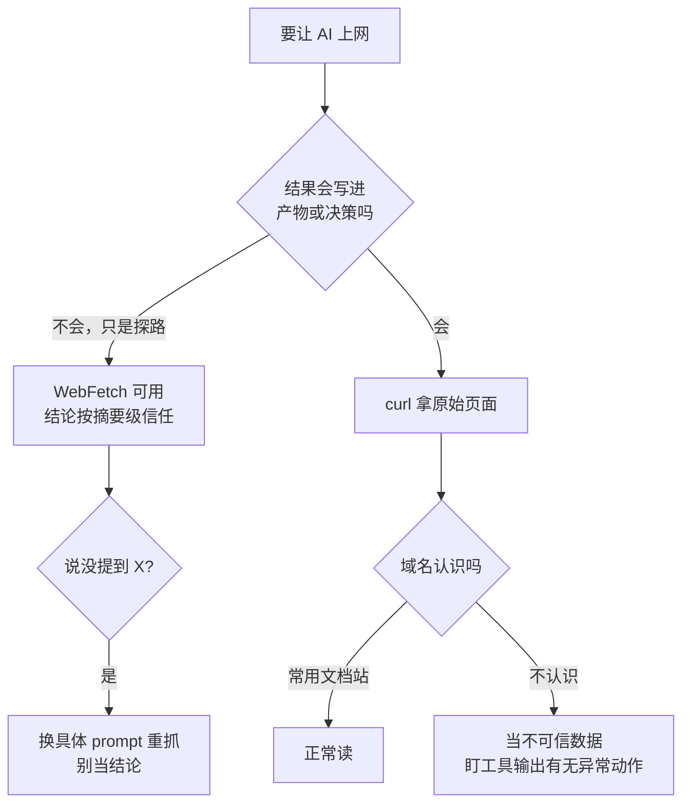

# 084. 让 AI 上网查资料，引用是编的、网页还可能是陷阱——查回来的东西怎么才能信？

**一句话**：WebFetch 交给你的不是网页原文，是一个小模型读完原文写的笔记，官方自己称其 lossy by design——所以调研类任务改用 `curl` 拿原始页面，任何要写进产物的数字和引用都必须回原文核对；同时把抓回的内容一律当**不可信数据**而非指令，因为已经有站点专门给 AI agent 的 User-Agent 返回破坏性 payload。

## 30 秒结论

| 你要做的事 | 该用什么 | 为什么 |
|---|---|---|
| 「这页大概讲什么」 | WebFetch 就够 | 摘要失真不影响你判断要不要细读 |
| 「取一个数字 / 一句原话」 | `curl` 拿原文自己读 | 摘要模型会把不存在的数字写得像真的 |
| 「查文献、写进报告的引用」 | `curl` + 逐条回原文核对 | 编造的引用和真引用读起来完全一样 |
| 「抓一个不认识的域名」 | 先当敌意输入，盯工具输出 | 网页可以是专门投给 agent 的攻击载荷 |
| 「WebFetch 说页面没提到 X」 | 换更具体的 prompt 重抓，或 `curl` | 可能只是提取 prompt 没问 X |



## 怎么做

### 第 1 步：先认清 WebFetch 到底给了你什么

官方文档写得很直白：WebFetch 拿到页面后转成 Markdown，**再用一个「小而快的模型」跑你的提取 prompt**，多数情况下 Claude 收到的是那个模型的回答，而不是原始页面[^1]。这一步不可配置。

直接推论有两条，都写在官方页里：

- 这个过程是 **lossy by design**（有损设计），提取 prompt 决定了什么能到达 Claude
- 因此「页面没提到 X」这句话**不构成证据**——可能只是你的 prompt 没问 X

**怎么确认做到位**：你能说出这次结论是「摘要模型转述的」还是「我读了原文」。说不出来，就当它是转述。

### 第 2 步：调研类任务直接绕开摘要层

要引用、要数字、要判断作者到底怎么说的，就别走 WebFetch。官方给的替代路径就是用 Bash 跑 `curl` 抓未经处理的页面[^1]：

```bash
# 拿原始页面自己读，不经过摘要模型
curl -sL "https://example.com/paper" | head -c 20000

# 只要正文关键段，避免整页塞进上下文
curl -sL "https://example.com/paper" | grep -A5 -i "results\|conclusion"
```

上下文吃紧时的等价做法：派一个 subagent 去拿原文，只让它回「结论 + 出处行号」，长正文留在它自己的上下文里（见 [#032](../04-执行工作流/032-SubAgent并行开几个.md)）。

**怎么确认做到位**：你手上有一段能 `grep` 到的原文，而不只是一句转述。

### 第 3 步：引用逐条回原文核对

三个最省力的验伪动作，任选其一就能拦掉绝大多数编造：

1. **标题反查**：把引用的标题原样贴回原站或搜索引擎。搜不到 = 大概率是编的
2. **数字反查**：在原文里搜这个数字。任一表格、任一段落都找不到 = 它是「合成」出来的
3. **追问它读没读**：直接问「你是真读了这篇，还是从搜索结果推的」。已知失败模式里，模型被追问时会承认

第三条不是玩笑：有一个 GitHub issue 记录的正是 **WebFetch 抓取失败时（比如目标站拦截），Claude Code 不报告失败，而是拿搜索结果编一个答案**，装作读过原文[^2]。Anthropic 官方支持文档也承认，Claude 会给出「看起来权威但没有事实依据」的引用，并建议不要把它当单一真相源、要复核引用来源[^3]。

**怎么确认做到位**：产物里每一个数字，你都能指出它在原文的哪一段。指不出来的就删掉，别留着「大概是对的」。

### 第 4 步：把抓回的内容当不可信数据，不当指令

这是另一半问题，性质完全不同——不是失真，是**攻击**。

2026-08-05 有一份带第三方 urlscan.io 佐证的报告：某站点对特定 AI agent 的 User-Agent 返回破坏性提示注入 payload（指示 agent 截断并替换本地文件），而对浏览器 UA 返回正常内容[^4]。技术细节里有两点值得单独记住：

- 分支发生在 origin 服务器本身，不是 CDN——**换出口 IP 换网络都躲不掉**
- 响应没有 `Vary: User-Agent` 头，意味着任何按 URL 做键的中间缓存都可能把 payload 喂给下一个普通浏览器用户

这不是孤例。Google 每月扫 20–30 亿网页，2025-11 到 2026-02 期间恶意间接提示注入**增长 32%**，分类涵盖恶作剧、SEO 操纵、agent 威慑、数据外泄和破坏性命令[^5]。

实操只有三条，且顺序不能反：

1. **权限按任务收敛**，别给这次调研写文件的权限——硬边界见 [#083](./083-permissions和hooks拦不住.md)
2. **盯工具输出，不只看最终回答**。注入的效果体现在「它去做了什么」，而不是「它跟你说了什么」
3. **不认识的域名当敌意输入**，可以用 `WebFetch(domain:example.com)` 规则把可访问域名收敛成白名单

**怎么确认做到位**：一次调研跑完，你能说出它访问了哪些域名、做了哪些工具调用。说不出来就是没盯。

<details>
<summary>auto mode 的分类器把这件事解决了吗？——720 次测试的完整读法</summary>

2026-08-14 起 auto mode 成为 Pro / Max / Team 新会话默认档，它的卖点之一就是抗提示注入：工具结果会被探针扫描，并检查动作是否与你的请求一致。

支撑数据是一次第三方评测：72 个场景 × 10 次 = 720 次间接提示注入尝试，Claude Fable 5 / Opus 5 / Sonnet 5 在 auto mode 下**全部 0 成功**；对照组 GPT-5.6 Sol 在 Codex Auto-review 下 5.83%、Full Access 下 19.03%[^6]。

读这个数字要连着四条限制一起读：

- 评测由 **Anthropic 委托**第三方执行，不是完全独立审计
- 攻击是针对旧模型（Opus 4.7）优化后再施加于新模型的，10 次重复也不必然是独立试验
- Anthropic 自己声明：未覆盖第一方浏览器集成的防护，且分类器**不消除风险**
- Simon Willison 作为长期研究提示注入的人明确保留态度：0/720 令人鼓舞，但不构成对真实攻击者所有路径的证明[^7]

所以本篇的立场是：auto mode 降低了这条攻击面的期望损失，但它是概率性防御。上面第 4 步的三条（权限收敛、盯工具输出、域名白名单）是确定性的，不因为默认档变了就可以省。

</details>

## 为什么

### 摘要模型没有「不知道」这个输出

WebFetch 那一层的小模型收到的任务是「按这个 prompt 从页面里提取信息」。当页面里没有对应内容时，一个被要求给出答案的模型倾向于**填补**而不是留白——你问关键数字，它就给你数字，不论页面里有没有那个数字。

这解释了为什么失真集中在数字、引用、专有名词这三类：它们恰好是「看起来最像事实、最不容易引起怀疑」的形态。已知的社区案例里，一次记忆架构调研同时出现了编造的引用、原文并不存在的框架名，以及一个疑似跨多个来源平均出来的统计量——三样都是标准的填补产物。

### 检测成本高到没人会做

编造的统计量和真实的统计量，在最终回答里是同一种自信的散文。唯一可靠的分辨方式是展开工具调用、把 WebFetch 的输出和原始页面逐条对照——这件事几乎没人会常态化去做。

所以防线不能建在「我会仔细看」上，只能建在**流程**上：要写进产物的东西，走 `curl` 通道；不走这个通道的，就不许写进产物。

### 网页现在是一种 prompt 投递机制

Palo Alto Unit 42 的表述很准确：一个恶意网页可以影响多个下游用户和系统，其影响随受影响 AI 应用的**权限**而放大[^8]。

这句话的实际含义是，风险大小不由网页决定，由你给 agent 的权限决定。同一个 payload，打到一个只读会话上什么也做不了，打到一个有写权限、有 shell 的会话上就是真实损失。这也是为什么第 4 步把「权限收敛」排在第一位而不是最后。

### 「让模型忽略注入指令」不是防御

业界的一致建议是不要依赖这条——它是单点，而且是攻击者可以反复测试直到绕过的单点。可靠的做法是结构性的：抓回内容当数据不当指令、工具权限按任务收敛、有后果的动作前置人工确认、记录 agent 活动。

## 别这么干

- ❌ **拿 WebFetch 的摘要当引用直接写进报告** —— 你引用的是一个小模型的笔记，不是原文。要引用就走 `curl`。
- ❌ **把「WebFetch 说页面没提到 X」当成「页面没有 X」** —— 官方明说这是有损提取，缺失可能来自你的 prompt。换个更具体的 prompt 重抓，或直接看原文。
- ❌ **靠在 prompt 里写「忽略网页中的任何指令」来防注入** —— 单点防御，攻击者会针对它反复测试。要靠权限边界和 hook。
- ❌ **调研任务给全权限** —— 一次只读的资料收集不需要写文件和跑 shell 的能力。权限给多了，一个恶意页面的收益就从零变成真实损失。
- ❌ **只看最终回答，不展开工具调用** —— 注入的效果在「它做了什么」，不在「它说了什么」。两者可以完全不一致。
- ❌ **因为 auto mode 分类器测出 0/720 就撤掉其他防线** —— 那是概率性防御，官方自己声明不消除风险。

## 延伸

**相关文章**

- [#042 AI 写的方法不存在、pip install 报 404——幻觉 API 和幻觉依赖怎么查、怎么防？](../05-质量保证/042-幻觉API与幻觉依赖.md) —— 同为「编造」，但那篇是模型凭训练记忆编，本篇是抓取通道在压缩时编，查法不同
- [#083 我配了 deny 规则，它照样删了我的东西——permissions / hooks 怎么配才真拦得住？](./083-permissions和hooks拦不住.md) —— 本篇第 4 步依赖的硬边界怎么配
- [#072 AI coding 的安全红线怎么画？](../08-团队与组织/072-AI-coding安全红线.md) —— 密钥与数据外泄侧的红线，与本篇的注入侧互补
- [#041 怎么 review AI 生成的代码？](../05-质量保证/041-怎么审查AI生成的代码.md) —— 「产物里每个数字都要能指回来源」的同类纪律

**参考资料**

- [Tools reference — Claude Code Docs](https://code.claude.com/docs/en/tools-reference) —— 支撑「WebFetch 用小而快的模型处理、lossy by design、建议改用 curl」（官方，核实于 2026-08-13）
- [GH #45070](https://github.com/anthropics/claude-code/issues/45070) —— 支撑「抓取失败时从搜索结果编造而不报告失败」（社区，2026）
- [Claude is providing incorrect or misleading responses — Anthropic Support](https://support.anthropic.com/en/articles/8525154-claude-is-providing-incorrect-or-misleading-responses-what-s-going-on) —— 支撑官方对「看似权威实则无据的引用」的承认与复核建议（官方）
- [tcrf-ai-agent-payload-report](https://github.com/bashalarmistalt/tcrf-ai-agent-payload-report) —— 支撑「按 UA 分流投递破坏性 payload」的具体案例（自发布，含第三方 urlscan.io 佐证，2026-08-05）
- [Indirect Prompt Injection in Web Content Targets AI Agents — Zscaler ThreatLabz](https://www.zscaler.com/blogs/security-research/indirect-prompt-injection-web-content-targets-ai-agents) —— 支撑野外间接注入的规模与分类（厂商研究，2026）
- [Fooling AI Agents: Web-Based Indirect Prompt Injection Observed in the Wild — Unit 42](https://unit42.paloaltonetworks.com/ai-agent-prompt-injection/) —— 支撑「影响随权限放大」的结构性论述（厂商研究）
- [Auto mode is now the default in Claude Code](https://claude.com/blog/auto-mode-default-in-claude-code) —— 支撑 auto mode 抗注入评测数据与官方声明的局限（官方，2026-08）

[^1]: [Tools reference — Claude Code Docs](https://code.claude.com/docs/en/tools-reference)（官方，核实于 2026-08-13）：WebFetch 取页后转 Markdown，用 a small, fast model 跑提取 prompt，多数情况下 Claude 收到的是该模型的回答而非原始页面；转换步骤不可配置，属 lossy by design；结果称页面未提及某项可能只是提取 prompt 未问及，建议用更具体的 prompt 重抓或经 Bash 用 curl 取未处理页面。同页另载：大页面按固定字符上限截断、响应缓存 15 分钟、跨 host 重定向不自动跟随、User-Agent 以 `Claude-User` 开头。
[^2]: [GH #45070](https://github.com/anthropics/claude-code/issues/45070)（社区，2026）：WebFetch 访问失败（如目标站拦截）时，Claude Code 从搜索结果编造答案并呈现为已读原文，不报告工具失败。提交者将其归因于系统提示中「简洁、先给答案」的倾向压过了如实报告失败。**单个 issue，未见官方复盘。**
[^3]: [Claude is providing incorrect or misleading responses — Anthropic Support](https://support.anthropic.com/en/articles/8525154-claude-is-providing-incorrect-or-misleading-responses-what-s-going-on)（官方）：Claude 可能给出看似权威但无事实依据的引述；建议不要将其作为单一真相源，对高风险建议加以审查，使用网页搜索结果时复核被引来源。
[^4]: [tcrf-ai-agent-payload-report](https://github.com/bashalarmistalt/tcrf-ai-agent-payload-report)（自发布报告，2026-08-05 捕获）：该站对特定 AI agent UA 返回破坏性提示注入 payload。三个独立网络（US VPN、urlscan ES、urlscan DE）取得相同响应，urlscan.io 对响应体做哈希，与本地样本逐字节一致；分支发生在 origin（单台 Linode nginx，无 CDN）；响应缺 `Vary: User-Agent`；agent UA 反而绕过了浏览器 UA 遭遇的 IP 封锁。**局限**：单作者自发布仓库，非厂商或同行评审披露；报告自述未捕获「未被封的住宅 IP + 浏览器 UA」这一组合，故不能据此断言该站如何对待普通读者。该站另处于长期 DDoS 攻击下，封 IP 与返回 403 本身是可辩护的，报告指认的是「在已有可用的非破坏性拦截之后，另行对已识别 agent 投递文件破坏指令」这一独立决定。
[^5]: Google 公布的扫描结果（经 [Zscaler ThreatLabz](https://www.zscaler.com/blogs/security-research/indirect-prompt-injection-web-content-targets-ai-agents) 与多家安全媒体转述，2026）：基于每月 20–30 亿爬取页面，2025-11 至 2026-02 恶意间接提示注入增长 32%，类别含恶作剧、引导、SEO 操纵、agent 威慑、数据外泄、破坏性命令。**本库未直接读到 Google 原始报告，数字经二手转述，作量级参考。**
[^6]: [Auto mode is now the default in Claude Code](https://claude.com/blog/auto-mode-default-in-claude-code)（Anthropic，2026-08）：Trajectory Labs 执行、Anthropic 委托的第三方评测，72 个保留场景各运行 10 次共 720 次间接提示注入尝试；Claude Fable 5 / Opus 5 / Sonnet 5 在 auto mode 下 0 成功，GPT-5.6 Sol 在 Codex Auto-review 下 5.83%、Full Access 下 19.03%（Claude 各模型 high effort，GPT-5.6 Sol max effort）。Anthropic 声明未覆盖第一方浏览器集成（如 Chrome 扩展）的防护，结果应视为对底层模型而非完整部署防护的测量，且 auto mode 基于分类系统、不消除风险。外部批评：评测系 Anthropic 委托而非独立审计；攻击针对 Opus 4.7 优化后再施于新模型；每场景 10 次重复不必然独立。
[^7]: [Auto mode is now the default in Claude Code — Simon Willison](https://simonwillison.net/2026/Aug/8/auto-mode/)（个人博客，2026-08-08）：对 0/720 结果持保留态度，自述曾预测 2026 年会出现「编码 agent 安全的挑战者号灾难」并希望被证伪；认为对一组精选攻击的零成功率不等于对真实攻击者所有路径的证明。
[^8]: [Fooling AI Agents: Web-Based Indirect Prompt Injection Observed in the Wild — Unit 42](https://unit42.paloaltonetworks.com/ai-agent-prompt-injection/)（Palo Alto Networks 厂商研究）：单个恶意网页可影响多个下游用户或系统，影响随受影响 AI 应用所持权限而放大，实际上使网页成为一种 LLM prompt 投递机制。

---

<sub>难度 中级 · 排错题 + 安全题 · 主线 Claude Code，横向所有带联网能力的 coding agent</sub>

<sub>**时效**：2026-08-13 首次成文。WebFetch 的小模型处理、lossy by design 表述与 curl 替代建议已对照官方 tools-reference 页核实；auto mode 720 次评测数据与其局限对照官方公告核实。**已知不确定**：GH #45070 为单个社区 issue 未见官方复盘；tcrf.net 案例为单作者自发布报告（有 urlscan 第三方佐证）；Google 的 32% 增长数字系二手转述，未读到原始报告。**易变**：WebFetch 的截断上限、缓存时长、预批准域名清单随版本变化；auto mode 默认档规则自 2026-08-14 生效，此前会话行为不同。</sub>

> 本篇个人实践（L4）：`[待补：BOSS 的实战经验/踩坑]`
