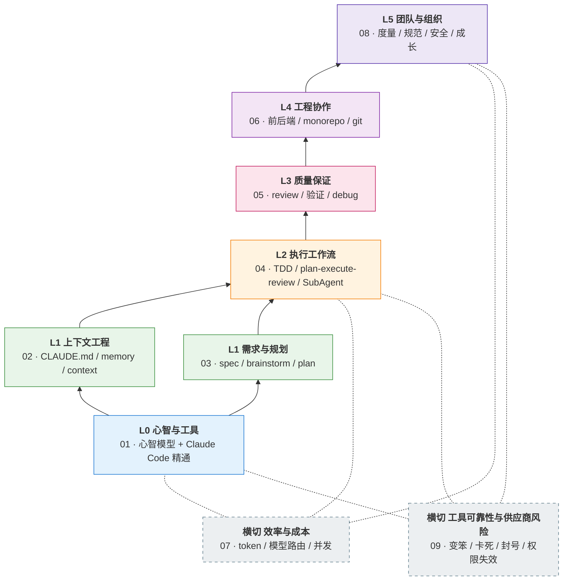
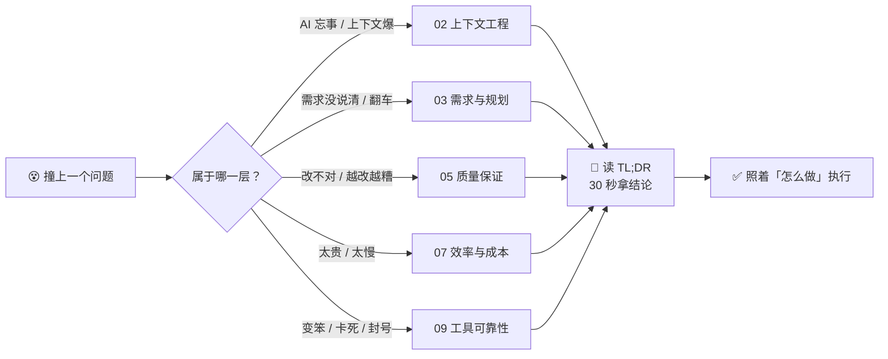

# 🎮 AI-Coding-Playbook-100

**用 AI 写代码会撞上的真实问题 —— 一个一个解出来，按能力栈归好类。**

带着问题来查，30 秒定位到答案。

---

## 🎯 为什么做这个库

大部分研发没有开发 Agent 的场景，但**每天用 Claude Code / Cursor 写代码，本质就是在和 Agent 协作** —— 这是离 Agent 最近的高频入口。

而这条路上的坑很实：上下文爆了、AI 编造 API、fix loop 越改越糟、PR 大到没法 review。

本库的做法：**穷举问题 → 每个问题给可照做的解法 → 按能力栈归组**。

> 三条内容准则，每一篇都以此校验：
>
> 1. **问题要真** —— 开发者真会撞上，不是从文档推演的伪问题
> 2. **解法可操作** —— 下次遇到能直接照做，不是只记住一个原则
> 3. **分类服务检索** —— 遇到问题 → 30 秒定位到对应文章

## 🏗️ 能力栈分层

下层是上层的基础，这个依赖关系就是学习路径：

## 🚀 怎么用

## 📖 目录

<b>01 · 心智与工具（L0）</b>

| # | 问题 |
|---|------|
| 001 | [Claude Code、Codex、Cursor、Copilot 到底该用哪个？按你的活儿选，不按测评选](01-mindset-and-tools/001-claude-code-vs-chatgpt-cursor-copilot.md) |
| 002 | [为什么我一开始用 Claude Code 各种不顺、"差点放弃"？卡在哪、怎么顺](01-mindset-and-tools/002-why-claude-code-feels-hard-at-first.md) |
| 003 | [为什么 AI 写的代码我审不动、改完自己看不懂？](01-mindset-and-tools/003-prompt-to-agentic-mindset-shift.md) |
| 004 | [CLAUDE.md、skill、subagent、hooks、plan mode——这几个到底该用哪个？](01-mindset-and-tools/004-claude-code-capabilities-map.md) |
| 005 | [AI 写得比我读得快，我一天到晚在审代码——怎么把节奏和心流拿回来？](01-mindset-and-tools/005-review-fatigue-and-flow.md) |

<b>02 · 上下文工程（L1）</b>

| # | 问题 |
|---|------|
| 010 | [CLAUDE.md 怎么写才真的生效？](02-context-engineering/010-claude-md-how-to-make-it-work.md) |
| 011 | [为什么 prompt 写得很细，Claude 还是越跑越偏？](02-context-engineering/011-context-vs-prompt-engineering.md) |
| 012 | [上下文窗口要爆了怎么办？](02-context-engineering/012-context-window-exploding.md) |
| 013 | [压缩一次它就忘了刚定的方案——哪些决策必须写进 memory 才扛得住 compact](02-context-engineering/013-memory-what-to-remember.md) |
| 014 | [CLAUDE.md、AGENTS.md、.cursor/rules 三份规则文件，改一处漏两处怎么办？](02-context-engineering/014-claude-md-agents-md-cursor-rules.md) |

<b>03 · 需求与规划（L1）</b>

| # | 问题 |
|---|------|
| 021 | [动手前到底要不要先写 PRD / 需求文档？写多详细才够？](03-spec-and-planning/021-prd-before-coding-how-detailed.md) |
| 022 | [怎么把一个大需求拆成 AI 能一次做对的子任务？](03-spec-and-planning/022-task-decomposition-for-ai.md) |
| 023 | [Vibe coding 为什么会翻车？什么时候必须停下来规划？](03-spec-and-planning/023-vibe-coding-when-to-stop-and-plan.md) |

<b>04 · 执行工作流（L2）</b>

| # | 问题 |
|---|------|
| 030 | [AI 写的测试一跑就过、还偷偷删测试怎么办？（TDD 在 AI coding 里怎么做）](04-execution-workflow/030-tdd-in-ai-coding.md) |
| 031 | [让 AI 改一个小功能，它却动了一堆无关文件怎么办？（plan → execute → review 循环）](04-execution-workflow/031-plan-execute-review-loop.md) |
| 032 | [开几个 agent 并行跑，结果互相踩、被限流、token 指数级炸开——并行到底该开几个？](04-execution-workflow/032-subagent-when-and-how.md) |
| 033 | [Skill / superpowers 怎么用、怎么写？](04-execution-workflow/033-skill-superpowers-usage.md) |

<b>05 · 质量保证（L3）</b>

| # | 问题 |
|---|------|
| 040 | [AI 说"做完了"、测试也全绿，怎么知道代码是真的对？](05-quality-assurance/040-who-verifies-ai-code-and-how.md) |
| 041 | [AI 一次吐几百行 diff 我读不过来、让它自己 review 它只说自己写得好——怎么 review AI 生成的代码？](05-quality-assurance/041-how-to-review-ai-generated-code.md) |
| 042 | [AI 写的方法不存在、pip install 报 404、API 参数对不上——幻觉 API 和幻觉依赖怎么查、怎么防？](05-quality-assurance/042-hallucinated-apis-and-dependencies.md) |
| 043 | [AI 改不对 bug、陷入 fix loop / 越改越糟，什么时候必须停、怎么跳出？](05-quality-assurance/043-fix-loop-when-to-stop-debugging.md) |
| 044 | [AI 写的代码上线三个月，300 行的函数没人敢动——怎么分批还债？](05-quality-assurance/044-paying-down-ai-code-debt.md) |

<b>06 · 工程协作（L4）</b>

| # | 问题 |
|---|------|
| 050 | [代码库一大 agent 就开始瞎找文件、抓错同名符号——大仓库 / monorepo 怎么让它不迷路](06-engineering-collab/050-claude-code-in-monorepo.md) |
| 051 | [前后端分仓，让 AI 改一个字段它只改了一边怎么办？（跨仓工作区 + 接口契约治理）](06-engineering-collab/051-working-across-multiple-repos.md) |
| 052 | [怎么不让 AI 把 git 仓库搞乱？（禁掉 force push / reset --hard，去掉 Co-Authored-By 署名）](06-engineering-collab/052-git-workflow-with-ai.md) |
| 053 | [AI 生成的 PR 太大太多，review 机制怎么扛住不崩？](06-engineering-collab/053-ai-prs-too-large-to-review.md) |

<b>07 · 效率与成本（横切）</b>

| # | 问题 |
|---|------|
| 060 | [额度怎么突然就没了？20x Max 也撑不过一上午——先算清自己一天该烧多少](07-efficiency-and-cost/060-how-much-does-claude-code-cost-per-day.md) |
| 062 | [怎么少烧 token？prompt caching / 精简 CLAUDE.md / 模型切换哪个最有效？](07-efficiency-and-cost/062-reduce-claude-code-token-usage.md) |
| 063 | [什么时候该用 Opus、什么时候该用 Sonnet/Haiku？怎么按任务路由模型才不浪费？](07-efficiency-and-cost/063-model-routing-when-to-use-opus.md) |

<b>08 · 团队与组织（L5）</b>

| # | 问题 |
|---|------|
| 071 | [AI coding 的效能到底怎么度量？DORA / SPACE / 代码量 / AI 生码率，哪个不是 vanity metric？](08-team-and-org/071-measuring-ai-coding-productivity-dora.md) |
| 072 | [AI coding 的安全红线怎么画？密钥泄露、数据外泄、第三方上传的真实事故与防护](08-team-and-org/072-ai-coding-security-red-lines.md) |
| 073 | [天天用 AI 写代码，我是不是在越用越不会写？junior 怎么一边用 AI 一边真长本事](08-team-and-org/073-junior-developer-growth-ai-era.md) |
| 075 | [团队的 AI coding 规范怎么立？哪些该强制、哪些该自由？](08-team-and-org/075-team-ai-coding-standards.md) |

<b>09 · 工具可靠性与供应商风险（横切）</b>

| # | 问题 |
|---|------|
| 080 | [今天 Claude Code 是不是变笨了？——怎么分清模型降级、effort 降档和自己用法退步](09-tool-reliability/080-is-claude-code-getting-dumber.md) |
| 081 | [十几个人共用两个账号、自建号池买了一天就全封了——工具链怎么接才不被供应商卡脖子？](09-tool-reliability/081-vendor-lock-in-account-bans.md) |
| 082 | [Claude Code 卡住不动 / Stream idle timeout / 长文件改到一半断了——怎么救回来？](09-tool-reliability/082-claude-code-stuck-or-frozen.md) |
| 083 | [我配了 deny 规则，它照样删了我的东西——permissions / hooks 怎么配才真拦得住？](09-tool-reliability/083-permissions-hooks-not-blocking.md) |

## 🧬 单篇结构

每篇 7 段，其中 2 段按题型启用：

虚线两段可选，其余 5 段必备，由 [`scripts/validate-qa.sh`](scripts/validate-qa.sh) 强制校验。模板见 [`_templates/qa-template.md`](_templates/qa-template.md)。

## 👥 适用人群

| 你是 | 能拿到什么 |
|------|-----------|
| 🧑‍💻 **开发者** | 系统用好 AI coding，遇到问题有地方查 |
| 🧭 **团队负责人** | 落地方案，解决「只发 token 不够」 |
| 🏢 **组织 / 培训** | 现成的规范与课程骨架 |

## 📄 许可证

[MIT](LICENSE)
