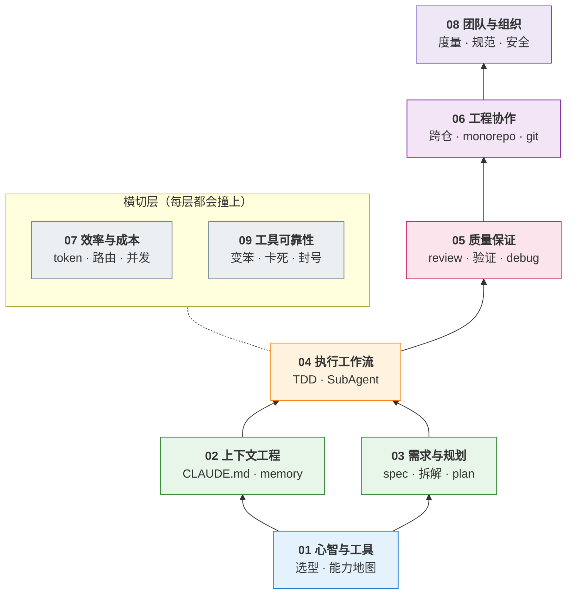

# 🎮 AI-Coding-Playbook

### 把 AI 用好，是今天研发收益确定性最强的一件事

**沿开发全链路分层的人机协作指南 —— 每个环节该怎么跟 AI 配合、会撞上什么问题、遇到了怎么解决。**

[能力栈](#-这是一套什么) · [怎么用](#-两种用法) · [症状速查](#按症状查手上正卡着的问题) · [完整目录](#-完整目录)

---

## 🎯 为什么是「用好 AI」，而不是「开发 AI」

今天的风气是万众搞 AI，其中一部分人在**开发 AI** —— 做业务 agent 或个人 agent。

但这个场景终归是少数。很多公司现阶段并没有能落地 AI 应用的地方，多数研发也接不到 agent 开发的活。等着这件事发生，收益是不确定的。

**另一件事的确定性强得多：能不能把 AI 用好。**

它不依赖公司有没有 AI 业务，不依赖你能不能拿到 agent 项目 —— 今天就能用在手上的开发任务里，今天就见效。每天用 Claude Code / Cursor 写代码，本质就是在和 Agent 协作，这是绝大多数研发离 Agent 最近、也最实在的入口。

问题是，这条路上的内容大多停在"要写好 prompt""要给足上下文"这类原则上，真撞上上下文爆了、AI 编造 API、fix loop 越改越糟的时候用不上。零散技巧不成体系，换个场景就失效。

**所以有了这个库：把「用 AI 完成一个开发任务」拆成分层的能力栈，每一层给出可照做的解法。**

> 三条准则，每一篇都以此校验：
>
> 1. **问题要真** —— 开发者真会撞上，有具体触发场景和症状，不是从文档推演的伪问题
> 2. **解法可操作** —— 给步骤、给可复制的命令配置、给"怎么判断做对了"的验证方法
> 3. **分类服务检索** —— 遇到问题 30 秒定位到对应文章，不用从头读

## 🏗️ 这是一套什么

不是经验贴的堆叠，是一张**能力地图**：下层是上层的基础，这个依赖关系就是学习路径。

| 层 | 解决什么 | 不补会怎样 |
|---|---|---|
| **L0** 心智与工具 | 选对工具、建立与 Agent 协作的心智 | 拿着锤子找钉子，工具能力用不到三成 |
| **L1** 上下文 + 需求 | 让 AI 知道该知道的、想清楚要做什么 | 越跑越偏，返工比自己写还慢 |
| **L2** 执行工作流 | 把任务可靠地交给 AI 跑完 | 改一个功能动一堆文件，收不住 |
| **L3** 质量保证 | 确认交付物是真的对 | 测试全绿但线上炸，不敢信也不敢改 |
| **L4** 工程协作 | 在真实工程环境里配合 | 大仓迷路、跨仓漏改、git 被搞乱 |
| **L5** 团队与组织 | 从个人能力变成团队能力 | 只发 token 不发方法，效能说不清 |
| **横切** 成本 + 可靠性 | 控住花费、扛住工具抽风 | 额度一上午烧光，工具一抽风就停摆 |

## 🚀 两种用法

### 按栈系统补：想把协作能力补全

按你现在的处境挑一条路径，每条 4 篇、约 1 小时：

| 你的处境 | 推荐顺序 |
|---|---|
| **刚上手 Claude Code**，不知道从哪使力 | [001 工具怎么选](01-心智与工具/001-AI编程工具怎么选.md) → [004 能力地图](01-心智与工具/004-Claude-Code能力地图.md) → [010 CLAUDE.md 怎么写](02-上下文工程/010-CLAUDE-md怎么写才生效.md) → [023 什么时候停下规划](03-需求与规划/023-Vibe-coding什么时候停下规划.md) |
| **用了一阵但不稳**，时好时坏 | [011 为什么细 prompt 也跑偏](02-上下文工程/011-上下文工程与提示词工程.md) → [031 plan-execute-review](04-执行工作流/031-plan-execute-review循环.md) → [040 怎么验证是真的对](05-质量保证/040-怎么验证AI代码是真的对.md) → [043 跳出 fix loop](05-质量保证/043-fix-loop什么时候必须停.md) |
| **要在团队里推**，不只管自己 | [074 团队规范怎么立](08-团队与组织/074-团队AI-coding规范怎么立.md) → [053 PR 太大怎么扛](06-工程协作/053-AI的PR太大没法review.md) → [072 安全红线](08-团队与组织/072-AI-coding安全红线.md) → [071 效能怎么度量](08-团队与组织/071-AI-coding效能怎么度量.md) |

### 按症状查：手上正卡着一个问题

<table>
<tr><td valign="top" width="50%">

**AI 不听话 / 记不住**

| 症状 | 去这篇 |
|---|---|
| 压缩一次就忘了刚定的方案 | [013](02-上下文工程/013-哪些决策要写进memory.md) |
| 上下文要爆、频繁 compact | [012](02-上下文工程/012-上下文窗口要爆了.md) |
| CLAUDE.md 写了它照样不理 | [010](02-上下文工程/010-CLAUDE-md怎么写才生效.md) |
| prompt 很细还是越跑越偏 | [011](02-上下文工程/011-上下文工程与提示词工程.md) |
| 改个小功能动一堆无关文件 | [031](04-执行工作流/031-plan-execute-review循环.md) |
| 大仓里瞎找文件、抓错符号 | [050](06-工程协作/050-大仓库monorepo里不迷路.md) |

</td><td valign="top" width="50%">

**代码不敢信 / 改不对**

| 症状 | 去这篇 |
|---|---|
| 说"做完了"、测试全绿但不敢信 | [040](05-质量保证/040-怎么验证AI代码是真的对.md) |
| 调的方法不存在、pip 报 404 | [042](05-质量保证/042-幻觉API与幻觉依赖.md) |
| 越改越糟，陷在 fix loop | [043](05-质量保证/043-fix-loop什么时候必须停.md) |
| 测试一跑就过、还偷偷删测试 | [030](04-执行工作流/030-AI写的测试不可信.md) |
| 几百行 diff 读不过来 | [041](05-质量保证/041-怎么审查AI生成的代码.md) |
| 300 行函数没人敢动 | [044](05-质量保证/044-AI代码债怎么分批还.md) |

</td></tr>
<tr><td valign="top">

**花钱 / 工具抽风**

| 症状 | 去这篇 |
|---|---|
| 额度一上午就没了 | [060](07-效率与成本/060-一天该烧多少额度.md) |
| 今天它是不是变笨了 | [080](09-工具可靠性/080-Claude-Code是不是变笨了.md) |
| 卡住不动 / Stream idle timeout | [082](09-工具可靠性/082-Claude-Code卡住不动.md) |
| 配了 deny 规则照样删我东西 | [083](09-工具可靠性/083-permissions和hooks拦不住.md) |
| 号池买一天就全封了 | [081](09-工具可靠性/081-账号封禁与供应商锁定.md) |
| Opus 还是 Sonnet，怎么算都亏 | [062](07-效率与成本/062-什么时候用Opus什么时候用Sonnet.md) |

</td><td valign="top">

**需求 / 协作**

| 症状 | 去这篇 |
|---|---|
| 要不要先写 PRD、写多细 | [021](03-需求与规划/021-动手前要不要写PRD.md) |
| 大需求怎么拆它才能一次做对 | [022](03-需求与规划/022-大需求怎么拆子任务.md) |
| 并行开几个 agent 才不互相踩 | [032](04-执行工作流/032-SubAgent并行开几个.md) |
| 前后端分仓只改了一边 | [051](06-工程协作/051-跨仓改动只改了一边.md) |
| 它把 git 仓库搞乱了 | [052](06-工程协作/052-别让AI搞乱git仓库.md) |
| 三份规则文件改一处漏两处 | [014](02-上下文工程/014-多份规则文件怎么同步.md) |

</td></tr>
</table>

## 📖 完整目录

<b>01 · 心智与工具（L0）</b>

| # | 问题 |
|---|------|
| 001 | [Claude Code、Codex、Cursor、Copilot 到底该用哪个？按你的活儿选，不按测评选](01-心智与工具/001-AI编程工具怎么选.md) |
| 002 | [为什么我一开始用 Claude Code 各种不顺、"差点放弃"？卡在哪、怎么顺](01-心智与工具/002-上手Claude-Code不顺怎么办.md) |
| 003 | [为什么 AI 写的代码我审不动、改完自己看不懂？](01-心智与工具/003-AI代码审不动改不懂.md) |
| 004 | [CLAUDE.md、skill、subagent、hooks、plan mode——这几个到底该用哪个？](01-心智与工具/004-Claude-Code能力地图.md) |
| 005 | [AI 写得比我读得快，我一天到晚在审代码——怎么把节奏和心流拿回来？](01-心智与工具/005-审查疲劳与心流.md) |

<b>02 · 上下文工程（L1）</b>

| # | 问题 |
|---|------|
| 010 | [CLAUDE.md 怎么写才真的生效？](02-上下文工程/010-CLAUDE-md怎么写才生效.md) |
| 011 | [为什么 prompt 写得很细，Claude 还是越跑越偏？](02-上下文工程/011-上下文工程与提示词工程.md) |
| 012 | [上下文窗口要爆了怎么办？](02-上下文工程/012-上下文窗口要爆了.md) |
| 013 | [压缩一次它就忘了刚定的方案——哪些决策必须写进 memory 才扛得住 compact](02-上下文工程/013-哪些决策要写进memory.md) |
| 014 | [CLAUDE.md、AGENTS.md、.cursor/rules 三份规则文件，改一处漏两处怎么办？](02-上下文工程/014-多份规则文件怎么同步.md) |

<b>03 · 需求与规划（L1）</b>

| # | 问题 |
|---|------|
| 021 | [动手前到底要不要先写 PRD / 需求文档？写多详细才够？](03-需求与规划/021-动手前要不要写PRD.md) |
| 022 | [怎么把一个大需求拆成 AI 能一次做对的子任务？](03-需求与规划/022-大需求怎么拆子任务.md) |
| 023 | [Vibe coding 为什么会翻车？什么时候必须停下来规划？](03-需求与规划/023-Vibe-coding什么时候停下规划.md) |

<b>04 · 执行工作流（L2）</b>

| # | 问题 |
|---|------|
| 030 | [AI 写的测试一跑就过、还偷偷删测试怎么办？（TDD 在 AI coding 里怎么做）](04-执行工作流/030-AI写的测试不可信.md) |
| 031 | [让 AI 改一个小功能，它却动了一堆无关文件怎么办？（plan → execute → review 循环）](04-执行工作流/031-plan-execute-review循环.md) |
| 032 | [开几个 agent 并行跑，结果互相踩、被限流、token 指数级炸开——并行到底该开几个？](04-执行工作流/032-SubAgent并行开几个.md) |
| 033 | [Skill / superpowers 怎么用、怎么写？](04-执行工作流/033-Skill与superpowers怎么用.md) |

<b>05 · 质量保证（L3）</b>

| # | 问题 |
|---|------|
| 040 | [AI 说"做完了"、测试也全绿，怎么知道代码是真的对？](05-质量保证/040-怎么验证AI代码是真的对.md) |
| 041 | [AI 一次吐几百行 diff 我读不过来、让它自己 review 它只说自己写得好——怎么 review AI 生成的代码？](05-质量保证/041-怎么审查AI生成的代码.md) |
| 042 | [AI 写的方法不存在、pip install 报 404、API 参数对不上——幻觉 API 和幻觉依赖怎么查、怎么防？](05-质量保证/042-幻觉API与幻觉依赖.md) |
| 043 | [AI 改不对 bug、陷入 fix loop / 越改越糟，什么时候必须停、怎么跳出？](05-质量保证/043-fix-loop什么时候必须停.md) |
| 044 | [AI 写的代码上线三个月，300 行的函数没人敢动——怎么分批还债？](05-质量保证/044-AI代码债怎么分批还.md) |

<b>06 · 工程协作（L4）</b>

| # | 问题 |
|---|------|
| 050 | [代码库一大 agent 就开始瞎找文件、抓错同名符号——大仓库 / monorepo 怎么让它不迷路](06-工程协作/050-大仓库monorepo里不迷路.md) |
| 051 | [前后端分仓，让 AI 改一个字段它只改了一边怎么办？（跨仓工作区 + 接口契约治理）](06-工程协作/051-跨仓改动只改了一边.md) |
| 052 | [怎么不让 AI 把 git 仓库搞乱？（禁掉 force push / reset --hard，去掉 Co-Authored-By 署名）](06-工程协作/052-别让AI搞乱git仓库.md) |
| 053 | [AI 生成的 PR 太大太多，review 机制怎么扛住不崩？](06-工程协作/053-AI的PR太大没法review.md) |

<b>07 · 效率与成本（横切）</b>

| # | 问题 |
|---|------|
| 060 | [额度怎么突然就没了？20x Max 也撑不过一上午——先算清自己一天该烧多少](07-效率与成本/060-一天该烧多少额度.md) |
| 061 | [怎么少烧 token？prompt caching / 精简 CLAUDE.md / 模型切换哪个最有效？](07-效率与成本/061-怎么少烧token.md) |
| 062 | [什么时候该用 Opus、什么时候该用 Sonnet/Haiku？怎么按任务路由模型才不浪费？](07-效率与成本/062-什么时候用Opus什么时候用Sonnet.md) |

<b>08 · 团队与组织（L5）</b>

| # | 问题 |
|---|------|
| 071 | [AI coding 的效能到底怎么度量？DORA / SPACE / 代码量 / AI 生码率，哪个不是 vanity metric？](08-团队与组织/071-AI-coding效能怎么度量.md) |
| 072 | [AI coding 的安全红线怎么画？密钥泄露、数据外泄、第三方上传的真实事故与防护](08-团队与组织/072-AI-coding安全红线.md) |
| 073 | [天天用 AI 写代码，我是不是在越用越不会写？junior 怎么一边用 AI 一边真长本事](08-团队与组织/073-junior怎么一边用AI一边长本事.md) |
| 074 | [团队的 AI coding 规范怎么立？哪些该强制、哪些该自由？](08-团队与组织/074-团队AI-coding规范怎么立.md) |

<b>09 · 工具可靠性与供应商风险（横切）</b>

| # | 问题 |
|---|------|
| 080 | [今天 Claude Code 是不是变笨了？——怎么分清模型降级、effort 降档和自己用法退步](09-工具可靠性/080-Claude-Code是不是变笨了.md) |
| 081 | [十几个人共用两个账号、自建号池买了一天就全封了——工具链怎么接才不被供应商卡脖子？](09-工具可靠性/081-账号封禁与供应商锁定.md) |
| 082 | [Claude Code 卡住不动 / Stream idle timeout / 长文件改到一半断了——怎么救回来？](09-工具可靠性/082-Claude-Code卡住不动.md) |
| 083 | [我配了 deny 规则，它照样删了我的东西——permissions / hooks 怎么配才真拦得住？](09-工具可靠性/083-permissions和hooks拦不住.md) |

## 🧬 每篇长什么样

7 段固定结构，其中 2 段按题型启用：

赶时间就只读 **TL;DR**（30 秒拿结论）和 **怎么做**（照着执行）。虚线两段可选，其余 5 段必备，由 [`scripts/validate-qa.sh`](scripts/validate-qa.sh) 强制校验。模板见 [`_templates/qa-template.md`](_templates/qa-template.md)。

## 👥 适用人群

| 你是 | 能拿到什么 |
|------|-----------|
| 🧑‍💻 **开发者** | 一张能力地图，知道自己缺哪层、按什么顺序补 |
| 🧭 **团队负责人** | 落地方案，解决「只发 token 不发方法」 |
| 🏢 **组织 / 培训** | 现成的规范骨架与课程大纲 |

## 📄 许可证

[MIT](LICENSE)
