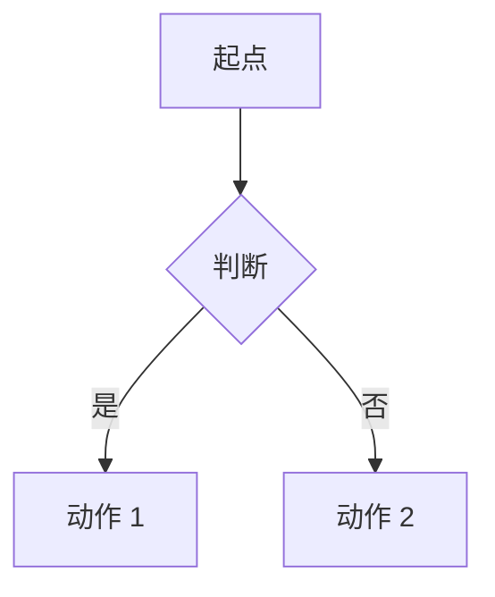

# NNN. [问题标题，用遇到问题的人会搜的话]

**一句话**：[一句给出结论和动作。读者只读这一行也该知道该干什么。]

## 30 秒结论

[速查表：症状 → 立刻做 → 不想再犯。带着问题来的人在这里就能走。]

| 你看到的 | 立刻做 | 不想再犯 |
|---|---|---|
| … | … | … |

[决策类、流程类内容在这里放一张 mermaid 图。节点 ≤ 两行、单行 ≤ 12 个中文字。]

## 怎么做

### 第 1 步：[动作]

[步骤 + 可复制的命令/配置 + 「怎么确认生效」的验证方法。]

进阶：[深水区标题]

[配置细节、环境变量表、边缘场景。summary 后面必须空一行，否则 GitHub 不渲染这里的 Markdown。]

### 第 2 步：[动作]

### 第 3 步：[防复发]

## 为什么

### [原理小节 1]

[背后机制、关键权衡。3 小节以内。关键论断用脚注 [^1]，正文不挂行内来源。]

### [原理小节 2]

> 个人观点（小C）：[需要表态的地方明确标注这是观点不是事实。]

## 别这么干

- ❌ **[错误姿势]** [为什么错、后果是什么。≤ 5 条。]

换成 Cursor / Copilot 呢

| 维度 | Claude Code | Cursor | GitHub Copilot |
|---|---|---|---|
| … | … | … | … |

## 延伸

**相关文章**

- [#NNN 相关问题标题](../主题目录/NNN-中文简述.md) —— 一句话说明关联在哪

**参考资料**

- [来源标题](url) —— 一句话说明它支撑本篇的哪个论断（官方 / 社区 / 实践，日期 YYYY-MM）

[^1]: [来源标题](url)（官方，YYYY-MM）：被引用的具体结论。

---

难度 基础|中级|高级 · 决策题|配置题|流程题|排错题|场景题 · 主线 Claude Code，横向 Cursor / Copilot

**时效**：[哪些事实核实过、核实日期]。**已知不确定**：[查不到官方出处的断言，明说未见官方确证]。**易变**：[随版本迭代会变的内容，给出回查方式]。

> 本篇个人实践（L4）：`[待补：BOSS 的实战经验/踩坑]`
